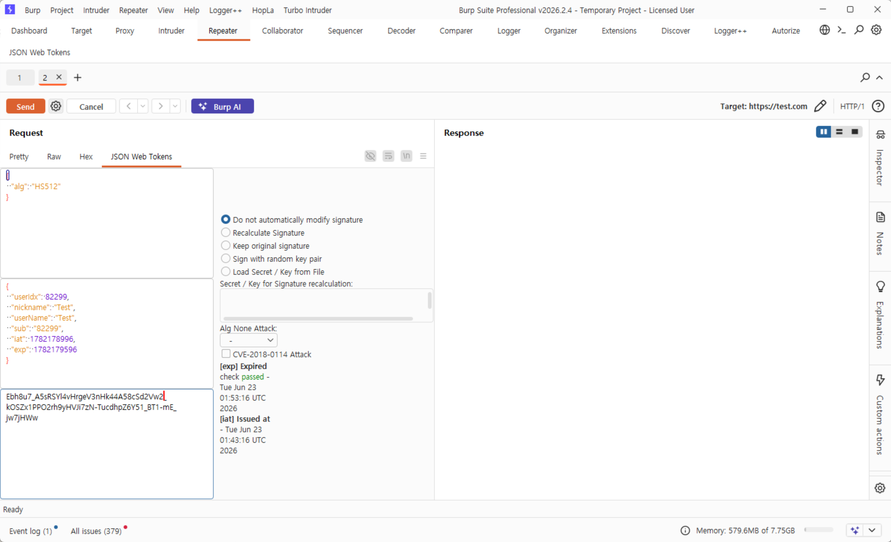
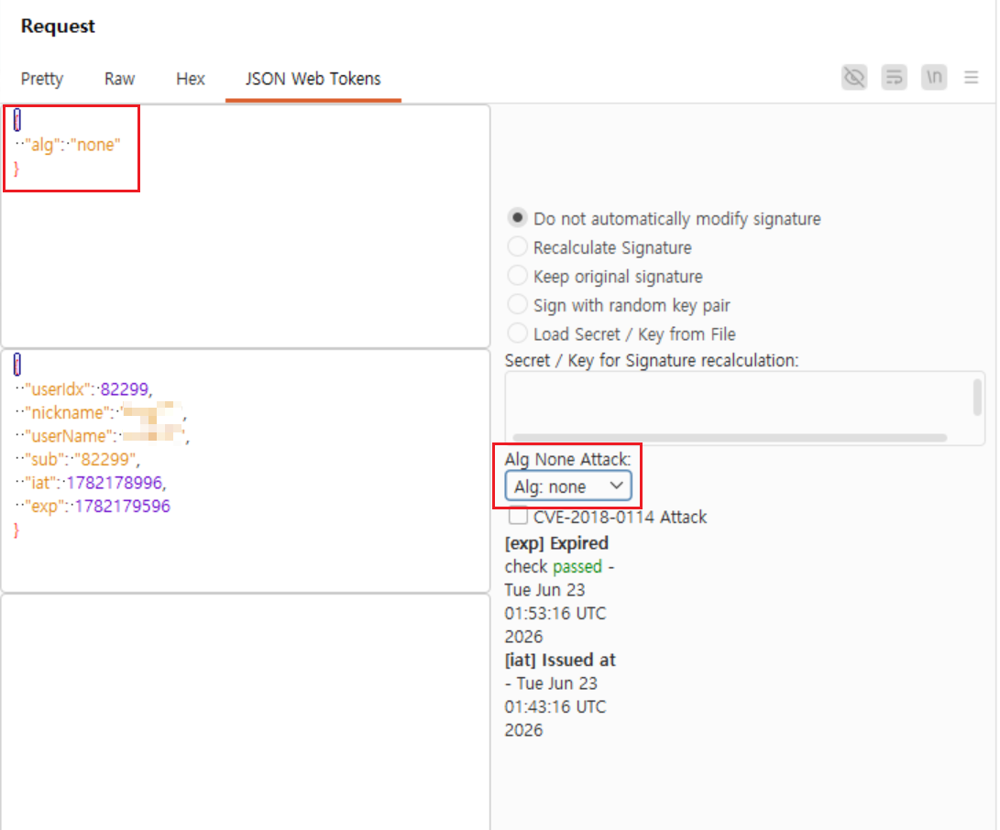
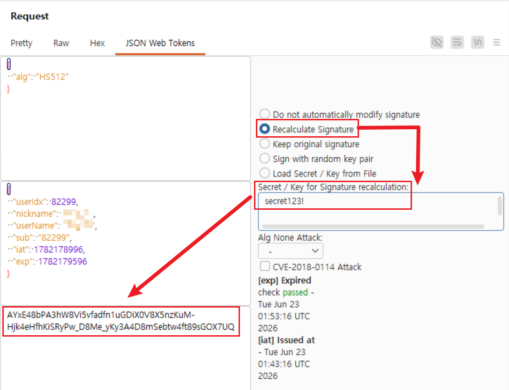

최근 웹과 모바일 애플리케이션 환경에서는 무거운 세션(Session) 대신 **JWT(JSON Web Token)**를 활용한 인증 방식이 표준처럼 자리 잡았다. 

JWT의 취약점을 점검하려면 수많은 토큰의 Base64 디코딩/인코딩, 페이로드 변조, 그리고 변조된 데이터에 맞는 **서명(Signature) 재생성** 과정을 거쳐야 한다. 이를 매번 외부 웹사이트(jwt.io 등)나 파이썬 스크립트를 이용해 변환하는 것은 실무에서 엄청난 시간 낭비다.

BApp Store에는 여러 JWT 관련 플러그인이 있지만, 그중에서도 복잡한 탭 이동 없이 패킷 내에서 직관적으로 모든 것을 해결할 수 있는 **JSON Web Tokens** 플러그인의 실무 활용법을 알아본다.

## 1. JSON Web Tokens 란?
Base64로 인코딩된 JWT를 패킷 내에서 자동으로 인식하여 풀어주고, 별도의 설정 탭 없이 패킷 창 안에서 즉시 페이로드를 수정하고 서명을 조작할 수 있게 해주는 확장 도구다. 

특히 다른 플러그인들과 달리 UI가 한 화면에 통합되어 있어, 빠른 속도로 여러 페이로드를 대입해 보아야 하는 실무 환경에 아주 적합하다.

## 2. 기본 화면 구성
`BApp Store`에서 **JSON Web Tokens**를 찾아 설치한다. 

설치가 완료된 후 Proxy나 Repeater에서 JWT 형식(`eyJ...`)이 포함된 패킷을 띄우면, 요청(Request) 텍스트 박스 상단(`Pretty`, `Raw` 탭 옆)에 **JSON Web Tokens**라는 전용 탭이 활성화된다.

화면은 크게 세 부분으로 나뉜다.
- **좌측 상단**: JWT의 Header 영역
- **좌측 하단**: JWT의 Payload 영역 (직접 타이핑하여 변조 가능)
- **우측 패널**: 서명(Signature)을 어떻게 처리할지 결정하는 공격 설정 영역

## 3. 실무 취약점 점검 시나리오

실무에서 가장 많이 시도하는 공격 시나리오를 이 플러그인으로 어떻게 처리하는지 알아보자.

### 3.1. None 알고리즘 공격 (Signature Bypass)
서버가 JWT의 서명을 검증할 때, Header의 알고리즘 필드가 `None`이면 서명 검증을 아예 건너뛰어 버리는 치명적인 취약점이다.

1. Repeater에서 타겟 패킷 상단의 `JSON Web Tokens` 탭을 연다.
2. 좌측 Payload 영역에서 `"role": "user"`를 `"role": "admin"`으로 조작한다.
3. 우측 패널 하단의 **`Alg None Attack:`** 드롭다운 메뉴를 클릭하여 `none` (또는 `None`)을 선택한다.
4. 상단의 `Send` 버튼을 누르면, 플러그인이 알아서 Header를 변조하고 마지막 서명 부분을 깔끔하게 지운 채로 패킷을 서버에 전송한다.
5. 서버가 관리자 권한을 인가해 주는지 확인한다.

예시 이미지:

### 3.2. Payload 변조 및 강제 서명 (Secret Key 탈취 시)
깃허브 리포지토리나 로컬 파일 정보 노출(LFI) 취약점 등을 통해 서버에서 사용하는 대칭키(Secret Key)를 알아냈을 때 사용하는 방법이다.

1. `JSON Web Tokens` 탭을 열고 좌측 Payload에서 유저 식별자(ID)나 권한을 마음대로 조작한다.
2. 우측 패널에서 **`Recalculate Signature`** (서명 재계산) 라디오 버튼을 선택한다.
3. 바로 아래에 있는 **`Secret / Key for Signature recalculation:`** 텍스트 박스에 탈취한 시크릿 키(예: `secret123!`)를 그대로 입력한다.
4. `Send` 버튼을 누르면, 입력한 시크릿 키를 바탕으로 조작된 Payload에 맞는 올바른 서명이 즉시 생성되어 서버로 전송된다.

예시 이미지:

### 3.3. CVE-2018-0114 공격 (공개키 신뢰 취약점)
이 플러그인 우측 하단을 보면 **`CVE-2018-0114 Attack`** 체크박스가 있다.
이는 서버가 토큰 안에 포함된 JWK(JSON Web Key) 파라미터를 아무런 검증 없이 그대로 신뢰하여 서명을 검증해 버리는 취약점이다. 

이 옵션을 체크하고 `Send`를 누르면, 플러그인이 임의의 공개키/개인키 쌍을 생성하여 Payload를 서명한 뒤, 그 검증용 키(JWK)를 토큰 헤더에 통째로 끼워 넣어 서버를 속이는 공격을 자동으로 수행해 준다.

> [!TIP]
> **Inspector와의 차이점**
> 최신 버전의 Burp Suite는 기본 우측 패널인 `Inspector`에서도 JWT를 디코딩해서 보여주는 기능이 생겼다. 단순한 디코딩과 확인 용도라면 Inspector로도 충분하지만, 위에서 설명한 서명 조작(Recalculate), None 알고리즘 공격 등 본격적인 **조작과 해킹**을 위해서는 여전히 별도의 플러그인이 필수적이다.
