모의해킹 실무에서 툴의 기본기를 탄탄하게 다지는 것은 해킹 기술만큼이나 중요하다. Burp Suite의 우측 상단 톱니바퀴 아이콘(⚙️)을 누르면 나오는 **설정(Settings)** 창은 기능이 너무 방대하고 어렵지만, 이곳을 어떻게 세팅하느냐에 따라 패킷 분석의 효율이 차이가 많이 난다.

---

## 1. User & Project Settings (전역 및 프로젝트 설정)

설정창 좌측 상단을 보면 `All`, `User`, `Project` 버튼이 있다. 
Burp Suite는 설정을 두 가지 범위로 나누어 관리한다.

- **User settings (사용자 설정)**: Burp Suite 프로그램 전체에 영구적으로 적용되는 설정이다. UI 테마(다크모드), 단축키, 폰트 크기 등이 여기에 속한다.
- **Project settings (프로젝트 설정)**: 현재 열려있는 프로젝트(Project) 파일에만 적용되는 설정이다. 타겟 도메인 범위(Scope), 자동 로그인 매크로(Sessions), 프록시 리스너 설정 등이 속한다. 새 프로젝트를 만들면 이 설정들은 초기화된다.

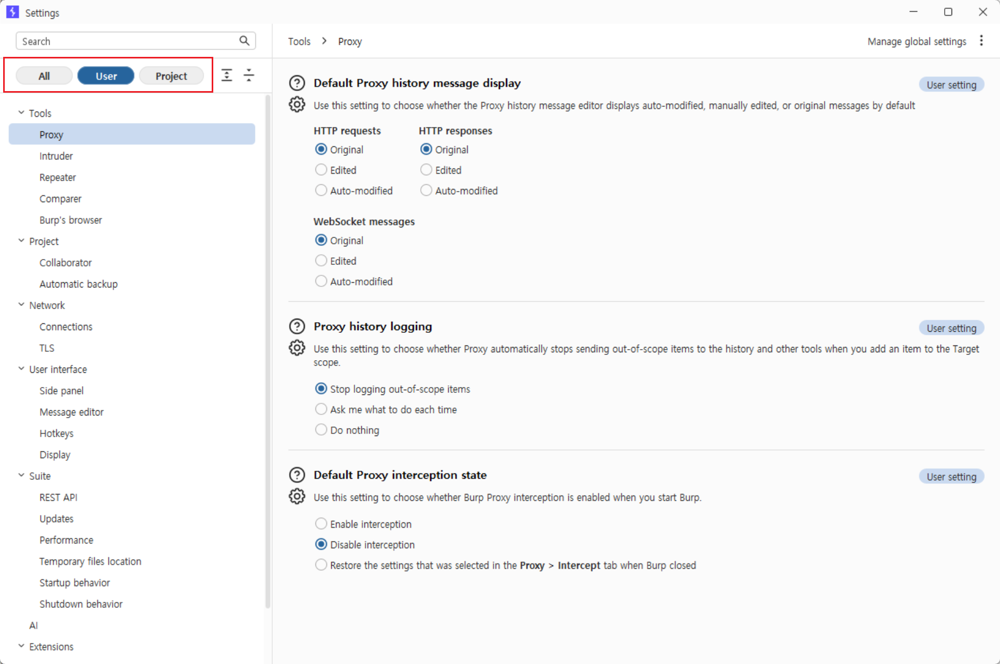

---

## 2. Proxy (프록시 설정)

좌측 메뉴 트리에서 **Tools > Proxy** 탭은 웹 브라우저의 트래픽을 가로채는 가장 핵심적인 설정들이 모여 있는 곳이다.

### 2.1. Proxy Listeners (리스너 설정)
Burp Suite가 브라우저의 트래픽을 수신하기 위해 열어두는 로컬 포트를 설정한다.

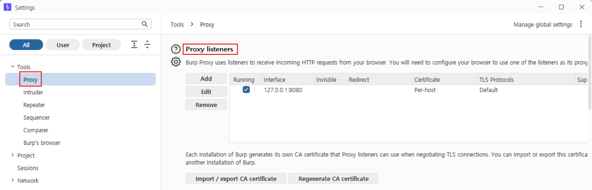

- 기본적으로 `127.0.0.1:8080` 포트가 등록되어 체크(`Running`)되어 있다.
- **포트 충돌 시**: 다른 툴(예: Tomcat, Oracle 등)이 8080 포트를 사용 중이라 Burp가 켜지지 않는다면, `Edit`을 눌러 `8081` 등으로 포트를 변경해야 한다.
- **모바일 모의해킹 시**: 스마트폰 앱의 패킷을 잡으려면 Bind to address 설정을 `All interfaces`로 변경하여 외부 기기에서 내 PC의 Burp로 패킷을 보낼 수 있게 열어주어야 한다.
- **인증서 관리(CA certificate)**: `Import / export CA certificate` 버튼을 통해 기기에 심을 PortSwigger 인증서를 추출한다.
  - **인증서 내장 버프 브라우저**: Burp에 내장된 브라우저(`Burp's Browser`)를 쓰면 이 인증서가 기본 탑재되어 있어 경고 없이 HTTPS 패킷이 잡힌다.
  - **언제 추출?**: 내장 브라우저를 쓸 수 없는 **모바일 앱 해킹(iOS/Android)**이나, 평소 쓰는 외부 크롬/파이어폭스 브라우저에 프록시를 걸 때 수동으로 설치하기 위해 사용한다.

### 2.2. Request / Response Interception Rules (요청 및 응답 인터셉트 규칙)
가장 중요한 설정 중 하나다. Proxy 탭의 `Intercept is on` 상태일 때, **어떤 패킷은 잡고 어떤 패킷은 그냥 통과시킬지** 룰(Rule)을 정한다.

실무를 하다 보면 `Intercept`를 켰을 때 내가 원하는 타겟 서버의 패킷뿐만 아니라, 백그라운드에서 날아가는 크롬 확장 프로그램 패킷, 구글 애널리틱스(`*.google-analytics.com`), 그리고 의미 없는 이미지 파일(`.png`, `.gif`), 스타일시트(`.css`) 등이 수없이 잡힌다. 이를 일일이 `Forward` 누르다가 시간이 다 간다.

- **기본 필터링과 JS 파일 예외 처리**: 기본적으로 `^gif$|^jpg$|^png$|^css$|^js$` 등으로 끝나는 정적 파일들은 인터셉트하지 않도록 세팅되어 있다. **하지만 실무 진단 시 프론트엔드 취약점이나 중요 로직을 파악하기 위해 `.js` 파일을 반드시 뜯어봐야 하는 경우가 많다.** 이때는 이 룰을 `Edit`하여 중간 부분의 `|^js$`를 지워주면 자바스크립트 파일도 정상적으로 캡처할 수 있다.

	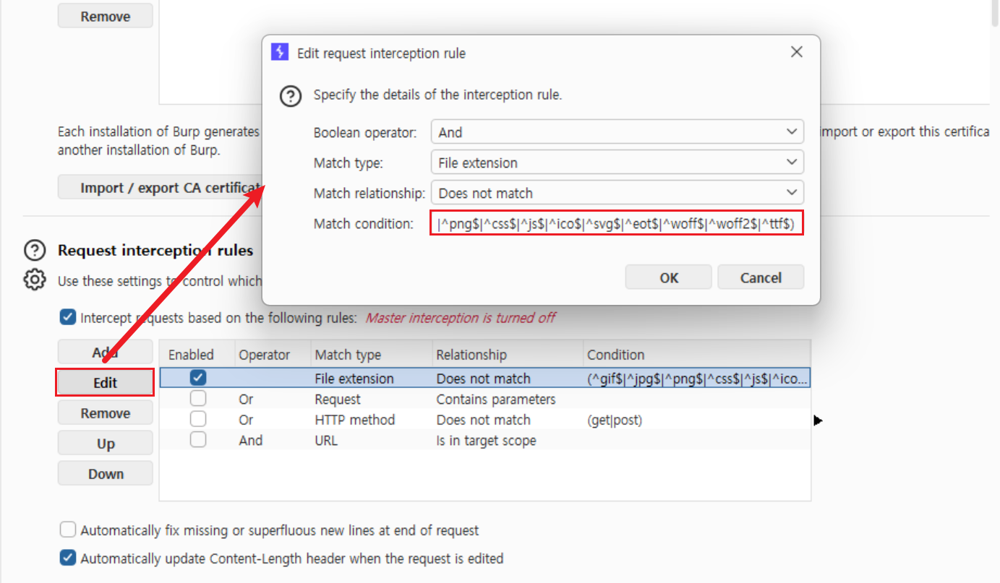

- **In target scope**: 룰을 새로 추가(`Add`)하여 **"And / URL / Is in target scope"** 조건을 걸어두는 것을 추천한다. 이렇게 세팅하면 Target 탭에서 설정한 스코프(타겟 도메인)의 패킷만 잡히기 때문에 쓰레기 패킷을 완벽하게 걸러낼 수 있다.
	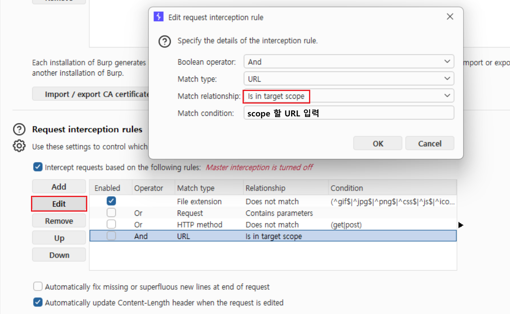

### 2.3. Response Interception Rules (응답 인터셉트 상세 규칙)
요청(Request)뿐만 아니라, 서버에서 돌아오는 응답(Response) 패킷을 화면에 띄울지 말지 결정하는 규칙이다.

- **기본 설정 (`Content type header Matches text`)**
  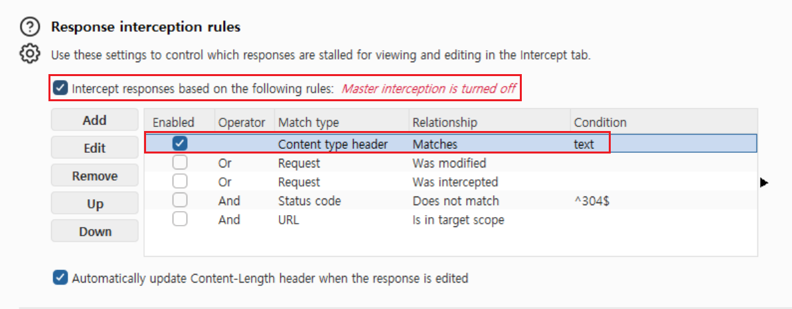
  - Burp의 초기 설정은 응답의 Content-Type 헤더가 `text`(예: `text/html`)인 경우에 무조건 응답을 잡도록 되어 있다. 
  - **단점**: 모의해킹 시 핵심인 JSON 응답(`application/json`)은 놓치기 십상이고, 굳이 분석할 필요 없는 텍스트 응답까지 모조리 잡아버려 인터셉트 창이 피곤해진다.

- **권장 커스텀 설정 (`Request Was intercepted`)**
  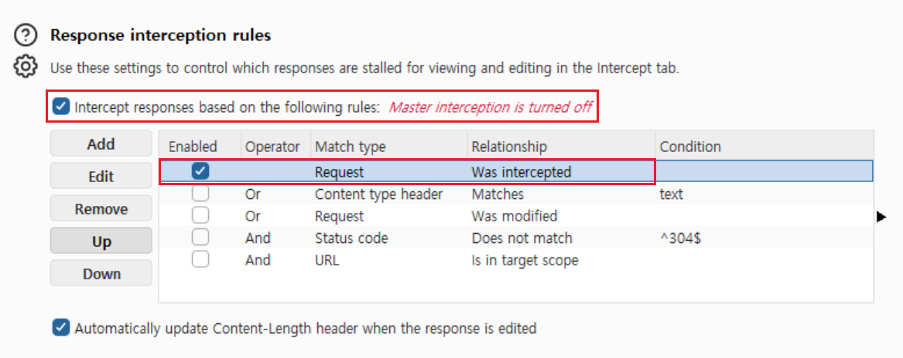
  - **거의 대부분의 경우 커스텀 설정 하는 것을 권장한다.**
  - 이 규칙을 활성화하면, **"내가 Request 창에서 직접 조작하고 Forward를 누른 바로 그 패킷의 응답"**만 선별해서 잡게 된다.
  - 내가 공격 코드를 삽입한 패킷에 대해 서버가 어떻게 반응하는지만 핀포인트로 확인할 수 있기 때문에, 분석 효율이 극대화된다.

### 2.4. WebSocket Interception / Match and Replace Rules (웹소켓 인터셉트 및 치환 규칙)
HTTP 트래픽뿐만 아니라 WebSocket 메시지에 대해서도 클라이언트-서버 간 메시지를 가로챌지(Intercept), 혹은 특정 텍스트를 자동으로 치환할지(Match and replace) 결정한다.

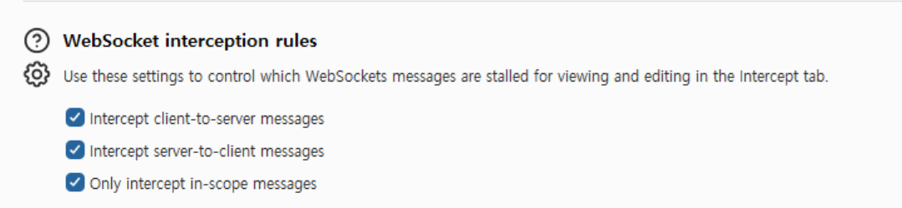

- **Intercept client-to-server messages**: 클라이언트(브라우저)에서 서버로 보내는 웹소켓 메시지를 인터셉트 창에 잡아둔다. (기본 체크됨)
- **Intercept server-to-client messages**: 반대로 서버에서 브라우저로 실시간 푸시(Push)하는 웹소켓 메시지를 잡아둔다. (기본 체크됨)
- **Only intercept in-scope messages (체크 권장)**: 타겟 스코프(Scope)에 등록된 도메인의 웹소켓 통신만 인터셉트한다. HTTP 인터셉트 규칙과 마찬가지로, 쓸데없는 백그라운드 웹소켓 통신(노션, 슬랙 등)을 전부 걸러내고 타겟 트래픽만 보고 싶다면 이 옵션을 반드시 체크해 주는 것을 추천한다.

### 2.5. Response Modification Rules (응답 자동 변조 규칙)
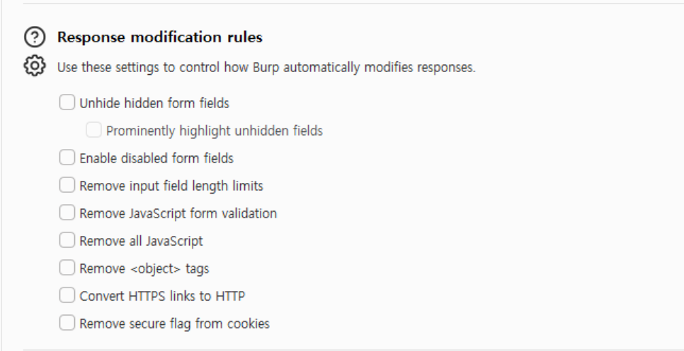

서버에서 오는 응답(Response)을 브라우저에 띄우기 전에 Burp가 자동으로 조작해 주는 기능이다. 패킷을 일일이 잡지 않고도 브라우저 화면 상에서 편하게 취약점을 테스트할 수 있게 해준다.

- **Unhide hidden form fields**: 결제 금액 등 숨겨진 `<input type="hidden">` 값을 화면에 강제로 띄워서 브라우저에서 직접 수정할 수 있게 한다.
- **Remove JavaScript form validation**: 프론트엔드의 입력 검증 로직을 무력화하여, 브라우저 입력창에 페이로드를 바로 붙여넣을 수 있게 한다.
- 💡 **참고**: 버프가 익숙하지 않은 사람들에게는 유용할 수 있으나, 최신 웹(React, Vue 등)에서는 UI가 깨지는 부작용이 많다. 버프에 익숙한 사람들은 굳이 이 기능을 켜서 브라우저에서 진단하는 것 보다, 그냥 패킷을 잡아 `Repeater`에서 직접 조작하는 것을 훨씬 선호하므로 필수 옵션은 아니다.

### 2.6. HTTP Match and Replace Rules (패킷 자동 치환 규칙)
지나가는 패킷의 특정 문자열이나 헤더를 정규식을 사용해 자동으로 치환해 주는 기능이다.

- **활용 예시**: `User-Agent` 헤더를 모바일 기기로 강제 고정시키거나, WAF 우회를 위해 특정 헤더를 모든 패킷에 삽입하도록 자동화할 때 쓴다.

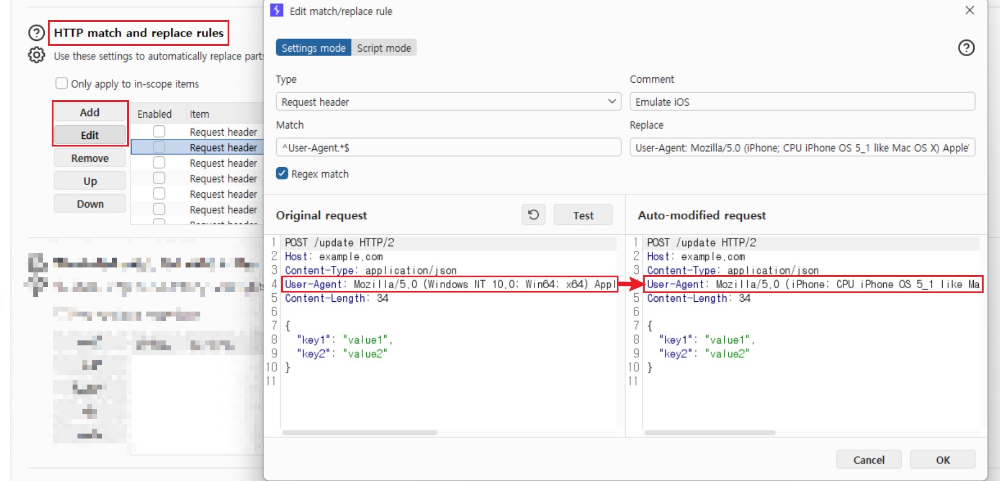

### 2.7. TLS Pass Through (인증서 피닝 우회)
모바일 앱 진단 시 '인증서 피닝(Certificate Pinning)'이 강하게 걸려있어서 패킷을 잡을 수 없는 카카오톡, 금융 앱 등이 있다. 

이때 이 앱들의 호스트 도메인을 여기에 등록해두면, Burp가 억지로 패킷을 열어보지 않고 원래 암호화된 상태 그대로 조용히 통과시킨다. (특정 앱의 먹통을 방지하면서, 핸드폰 내의 다른 타겟 앱들을 정상적으로 진단할 때 필수적이다.)

### 2.8. Proxy History Logging / Default Interception State (로깅 및 기본 인터셉트 상태)
- **Stop logging out-of-scope items**: 타겟 스코프가 아닌 쓰레기 패킷들을 HTTP history에 아예 남기지 않아 램(RAM) 메모리를 아끼는 옵션이다.
- **Default Proxy interception state**: Burp Suite를 처음 켰을 때 Intercept가 켜져 있을지, 꺼져 있을지 결정한다. (보통 켤 때마다 패킷이 막히면 귀찮으므로 캡처 화면처럼 `Disable interception` 세팅을 추천한다.)

---

## 3. Intruder (자동화 공격 설정)
자동화 공격(Fuzzing, Brute-force)을 수행할 때 사용하는 Intruder 탭 전용 설정이다.
- **Payload list location (⭐️)**: Intruder의 페이로드 드롭다운 메뉴(Simple list 등)에 띄울 기본 사전(Dictionary) 파일들의 위치를 지정한다.
  - **나만의 핵심 워드리스트 폴더 지정하기**: [SecLists](https://github.com/danielmiessler/SecLists)나 한국어 사전을 다운로드한 뒤, 최상위 폴더를 그대로 지정하면 Burp가 하위 폴더까지는 읽어오지 못한다. 따라서 **내가 가장 자주 쓰는 핵심 텍스트 파일(예: 디렉터리 스캐닝용, 단축 패스워드 등 10~20개)만 복사해서 하나의 '즐겨찾기 폴더'에 모아두면 빠르게 불러올 수 있다**
  - 이 옵션을 `Load custom lists from directory`로 바꾸고 그 즐겨찾기 폴더를 지정해 두면, 매번 `Load` 버튼을 눌러 복잡한 하위 폴더를 뒤질 필요 없이 드롭다운 메뉴에서 내 핵심 페이로드들을 1초 만에 바로 불러올 수 있다.

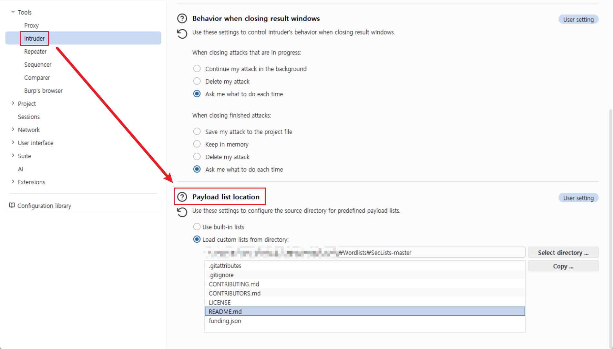

## 4. Repeater (수동 진단 설정)
수동으로 패킷을 변조하고 재전송하는 Repeater 탭 전용 설정이다. 보내주신 스크린샷의 주요 기능들은 다음과 같다.

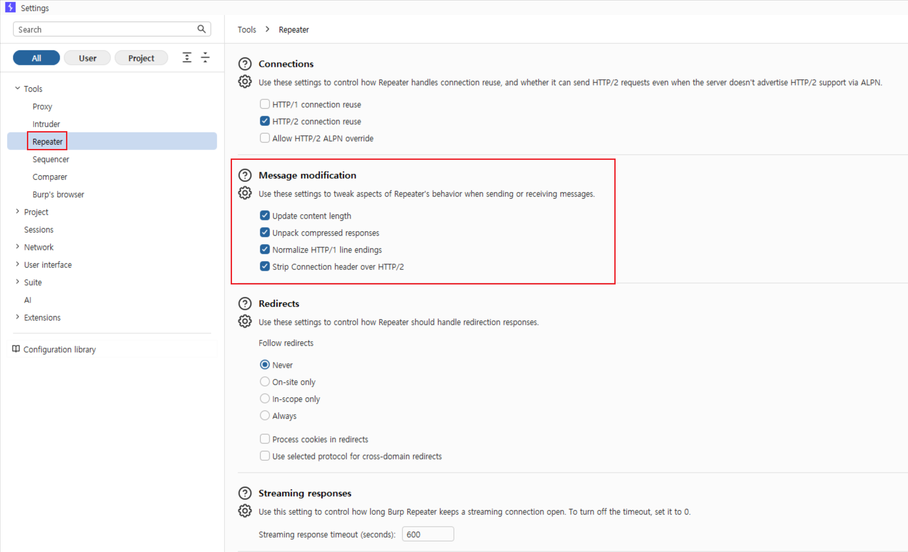

- **Connections**: HTTP/1 및 HTTP/2 커넥션 재사용(Reuse) 여부를 설정한다. 속도 향상을 위해 기본값(체크)을 유지하면 된다.
- **Message modification (매우 중요 ⭐️)**: 내가 수정한 패킷을 서버로 쏠 때, Burp가 알아서 규격에 맞게 보정해 주는 옵션들이다.
  - `Update content length`: **(필수)** Body의 파라미터나 페이로드 길이를 수정하면, 그에 맞춰 `Content-Length` 헤더 값을 자동으로 계산해서 바꿔준다. 이거 끄면 서버에서 400 에러를 뱉으니 무조건 켜두자.
  - `Unpack compressed responses`: 서버가 gzip 등으로 압축해서 보낸 응답 패킷을 우리가 읽기 편하게 자동으로 압축 해제해 준다.
  - `Normalize HTTP/1 line endings`: 패킷의 줄바꿈(CRLF)을 HTTP 표준에 맞게 자동으로 교정한다. (단, **HTTP Request Smuggling** 같은 특수 취약점을 공격할 때는 이 옵션을 잠시 꺼야 한다)
- **Redirects**: 서버가 30x Redirect 응답(다른 페이지로 튕겨냄)을 보냈을 때, Repeater가 자동으로 따라갈지(Follow) 설정한다. 
  - 수동 진단 시에는 패킷의 흐름을 본인이 완벽하게 통제해야 하므로, 기본값인 `Never`로 두고 필요할 때만 화면 상단의 `Follow redirection` 버튼을 직접 누르는 것이 좋다.
- **Streaming responses**: 서버와 연결을 계속 열어두는 스트리밍 응답의 타임아웃을 설정한다. (기본 600초)
- **Default tab group**: Repeater 탭이 무한정 늘어나는 것을 방지하기 위한 그룹화 기본 옵션이다.

## 5. Comparer (패킷 비교 설정)
두 개의 패킷(요청 또는 응답) 간의 차이점을 시각적으로 비교(Diff)해 주는 툴의 설정이다.
- **Sync Comparer results view**: Comparer 창에서 두 패킷을 나란히 띄워놓고 스크롤을 내릴 때, 양쪽 화면이 동시에 똑같이 내려가도록(동기화) 할지 설정한다. 
  - 평소에는 체크를 해제해두고 양쪽을 따로따로 스크롤하면서 보는 것이 낫지만, 구조가 완전히 똑같은 두 패킷의 미세한 값 차이만 비교할 때는 체크해 두는 것이 눈이 덜 피로하다.

## 6. Burp's browser (내장 브라우저 설정)
Burp Suite 내장 브라우저(Chromium 기반) 전용 설정이다. 귀찮은 인증서 설치나 시스템 프록시 세팅 없이 `Open browser` 버튼 클릭 한 번에 바로 트래픽을 잡을 수 있어 실무에서 가장 많이 쓰인다. 

- **Browser data**: 내장 브라우저의 방문 기록, 쿠키, 로그인 세션 등 데이터를 로컬에 저장할지(`Store browser data`) 설정한다.
  - **(팁 ⭐️)**: 기본적으로 체크해 두면 브라우저를 껐다 켜도 쿠키가 유지되어 매번 로그인할 필요가 없어 편하다. 하지만 진단 환경을 아예 초기화하고 싶다면 하단의 `Clear 하단all` 버튼을 눌러 브라우저 찌꺼기를 깔끔하게 밀어버릴 수 있다.
- **Browser running**: 내장 브라우저 실행 시 샌드박스(Sandbox) 보호 기능을 해제할지, 그래픽 카드(GPU) 가속을 사용할지 설정한다.
  - `Allow Burp's browser to run without a sandbox`: 샌드박스를 끄면 악성 사이트 진단 시 내 PC가 악성코드에 감염될 위험이 커지므로, 특별한 에러가 없는 한 **체크 해제(안전 모드 유지)** 상태로 두는 것이 좋다.
  - `Use the GPU`: 브라우저 화면을 부드럽게 렌더링하기 위해 GPU를 사용한다. (단, 가상머신(VM) 환경에서는 간혹 GPU 충돌로 브라우저 창이 하얗게 멈추거나 안 켜지는 경우가 잦은데, 이때 이 체크를 해제하면 귀신같이 해결된다.)
- **Browser logging**: 내장 브라우저가 통신하는 시스템 디버깅 로그를 파일로 남길지 결정한다. (일반적인 모의해킹 진단 시에는 쓸 일이 없으므로 체크 해제 상태로 둔다.)

---

## 7. Project (프로젝트 설정)

### 7.1. Scope (타겟 범위 설정)
Proxy 인터셉트, Scanner 등 Burp Suite의 모든 기능이 '어느 도메인을 대상으로 동작할 것인지'를 결정하는 가장 중요한 기준점이다. 타겟을 정확히 지정해야 엉뚱한 사이트(네이버, 구글 등)의 패킷이 쌓이는 것을 막을 수 있다.

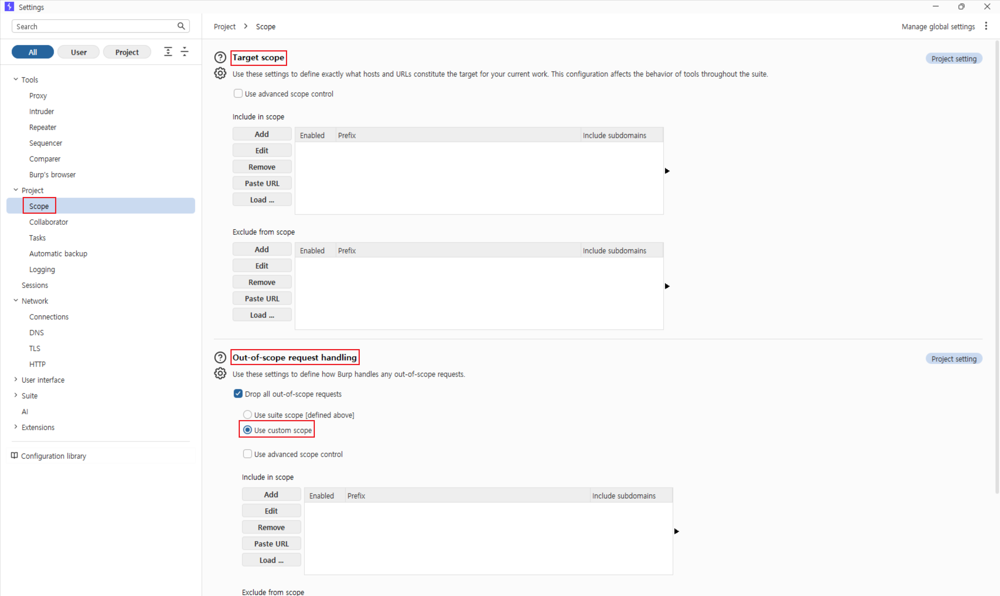

- **Target scope**: 진단 대상 도메인을 포함(`Include`)하거나 제외(`Exclude`)하는 목록을 관리한다.
  - `Use advanced scope control`: 기본 설정은 단순 URL 매칭이지만, 이 옵션을 켜면 정규표현식을 사용해 `.*\.target\.com`처럼 서브도메인 전체를 와일드카드로 유연하게 지정할 수 있다. (실무에서는 이 기능을 켜두고 정규식으로 타겟을 세팅하는 것이 권장된다.)
  - `Paste URL / Load`: 타겟 URL이 수백 개인 대형 프로젝트의 경우, 클립보드에 복사해 둔 리스트를 한 번에 붙여넣거나 텍스트 파일에서 불러올 수 있어 세팅 시간을 획기적으로 줄여준다.
- **Out-of-scope request handling (스코프 외 트래픽 차단)**: 
  - `Drop all out-of-scope requests`: 타겟 스코프에 포함되지 않은 트래픽을 브라우저 통신 단계에서부터 아예 차단(방화벽처럼 Drop)해 버리는 세팅이다. 
    - **장점 (램/용량 확보)**: 진단 중 백그라운드에서 발생하는 수많은 쓰레기 트래픽(메신저, 윈도우 업데이트 등)을 원천 차단하여 버프가 뻗거나 프로젝트 용량이 수십 GB로 폭발하는 것을 막아준다.
    - **🚨 주의사항 (SSO 및 외부 API 통신)**: 타겟 도메인이 아니라고 무작정 차단해 버리면, 간편 로그인(카카오, 구글 SSO)이나 외부 결제 모듈 등 **타 도메인과 반드시 통신해야 하는 기능들이 먹통이 되는 부작용**이 발생한다.
  - **해결책 (Custom scope 활용)**: 따라서 외부 API 통신이 많은 최신 웹/앱을 진단할 때는 `Use suite scope`를 쓰면 안 된다. 대신 **`Use custom scope`**를 선택해야한다.
    - 포함(Include) 목록은 비워두어 모든 통신을 허용하되, 제외(Exclude) 목록에만 확실하게 차단할 쓰레기 도메인들(예: `*.google-analytics.com`, `*.youtube.com` 등)을 추가하는 **블랙리스트 방식**으로 커스텀 스코프를 짜면 통신 오류 없이 진단을 할 수 있다.

### 7.2. Collaborator (OOB 취약점 탐지 서버)
Burp Collaborator는 SSRF(Server-Side Request Forgery)나 Blind SQL Injection처럼, 화면에 결과가 즉각적으로 뜨지 않고 서버 내부에서 외부로 패킷이 나가는 취약점(Out-of-Band)을 잡기 위해 사용하는 일종의 **'페이로드 서버(Payload Server)'**다. 해당 기능은 `Burpsuite Pro`에서만 사용 가능하다.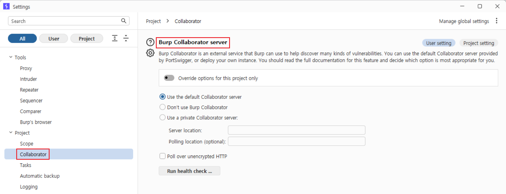

- **Override options for this project only**: 기본적으로 Collaborator 설정은 `User setting`(버프 전체 공통 설정)을 따라가지만, 이 토글을 켜면 현재 열려있는 프로젝트 파일에만 별도의 서버를 지정할 수 있다.
- **서버 선택 옵션 3가지**:
  1. `Use the default Collaborator server`: PortSwigger(버프 제작사)가 운영하는 공개 서버를 사용한다. (인터넷이 빵빵하게 뚫려있는 일반적인 웹 진단 시 가장 많이 쓰는 기본값이다.)
  2. `Don't use Burp Collaborator`: 서버 기능을 아예 꺼버린다. (보안 가이드라인 상 사외로 핑(Ping)을 날리는 것조차 엄격하게 금지된 환경에서 사용한다.)
  3. `Use a private Collaborator server`: 금융권 등 **망분리(폐쇄망) 환경**이거나 보안이 매우 빡빡한 환경에서는 외부 인터넷(PortSwigger 서버)으로 패킷이 나갈 수 없다. 이때는 사내망에 직접 구축해 둔 사설 Collaborator 서버 주소를 `Server location`에 입력해서 사용해야만 OOB 취약점을 정상적으로 찾아낼 수 있다.
- **Poll over unencrypted HTTP**: Burp가 Collaborator 서버에 "내 페이로드에 걸려든 패킷 있어?"라고 물어보는(Polling) 통신을 HTTPS 대신 HTTP(평문)로 할지 묻는 옵션이다.
  - **언제 쓸까?**: 사내망에 Private 서버를 대충 구축해 둬서 SSL/TLS 인증서 세팅이 안 되어 있거나, 사내 방화벽이 알 수 없는 HTTPS 인증서를 몽땅 차단해 버려서 통신 에러가 날 때 쓴다. 이 체크를 켜면 암호화 에러를 무시하고 80포트(HTTP)로 취약점 결과 데이터를 긁어올 수 있다. (기본적으로는 보안을 위해 체크 해제가 맞다.)
- **Run health check ...**: 내가 설정한 Collaborator 서버가 정상적으로 핑을 주고받을 수 있는지 즉시 테스트해 보는 버튼이다. 세팅을 변경했다면 꼭 한 번 눌러서 `Success`가 뜨는지 확인하는 것이 좋다.

​	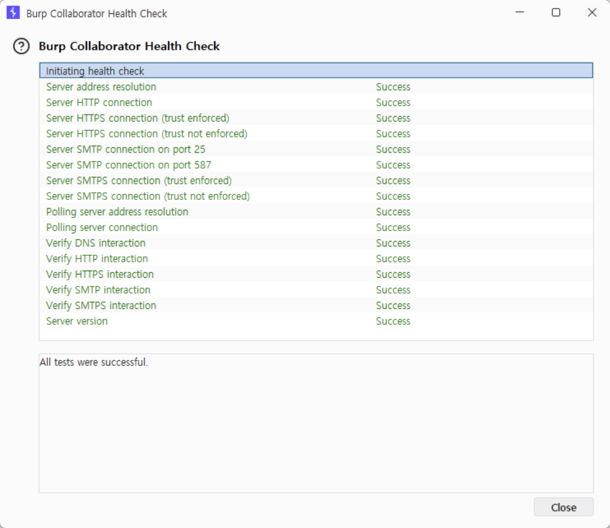

### 7.3. Tasks (태스크 및 리소스 풀 관리)
Burp Suite 우측 상단 대시보드(Dashboard)에서 돌아가는 각종 스캔(Live audit), 크롤링(Crawl) 등의 작업(Task)들을 제어하고, 이 작업들이 타겟 서버로 보내는 트래픽 속도를 조절하는 핵심 메뉴다.

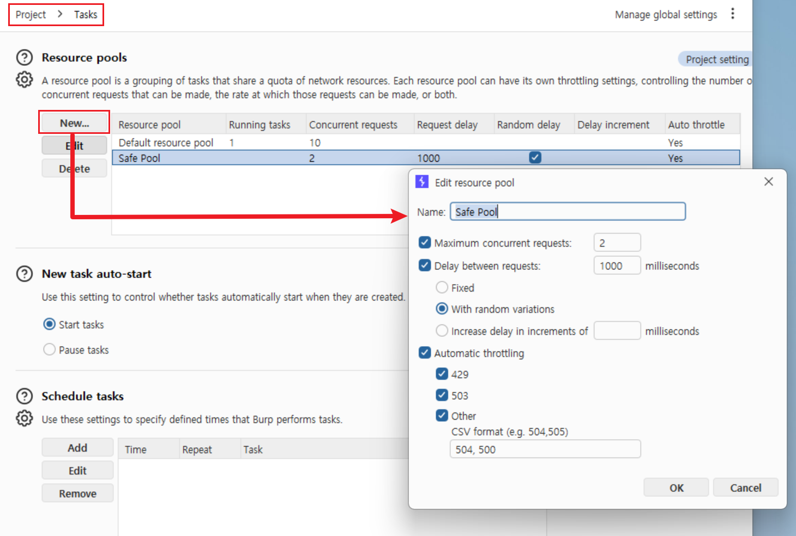

- **Resource pools (리소스 풀 ⭐️)**: 스캐너나 크롤러가 서버로 보내는 패킷의 속도(Throttling)를 제어하는 그룹이다.
  - **왜 중요할까?**: 기본 풀(`Default resource pool`)은 최대 동시 요청(Concurrent requests) 수가 10개로 잡혀 있다. 이대로 방치하고 스캐너를 냅다 돌리면 타겟 서버가 수많은 요청을 견디지 못하고 뻗어버리거나(DoS), WAF(웹 방화벽)에 공격 IP로 찍혀서 차단당하기 십상이다.
  - **실무 세팅법 (Safe Pool 만들기)**: `New` 버튼을 눌러 타겟 서버를 뻗게 하지 않을 나만의 안전한 풀(예: `Safe Pool`)을 세팅한다.
    - `Maximum concurrent requests (최대 동시 요청)`: 서버가 견딜 수 있도록 **1~2개** 정도로 확 낮춘다. 
    - `Delay between requests (요청 간 딜레이)`: 스캔 패킷 사이에 100ms~1000ms(0.1~1초) 정도의 여유를 준다. 특히 방화벽(WAF) 차단을 피하려면 하단의 `With random variations`를 체크해 봇(Bot)이 아닌 사람이 누르는 것처럼 랜덤한 딜레이를 줄 수도 있다.
    - `Automatic throttling (자동 속도 조절)`: 진단 도중 타겟 서버가 트래픽을 감당하지 못하고 뻗기 직전일 때, Burp가 알아서 눈치껏 스캔 속도를 늦춰주는 안전장치다. 다음과 같은 응답 코드를 감지한다.
      - **429 (Too Many Requests)**: 방화벽(WAF)이나 API 서버의 Rate Limit(요청 제한)에 걸렸을 때 발생하는 코드다. (필수 체크)
      - **503 (Service Unavailable)**: 타겟 웹 서버(Apache, Nginx 등) 자체가 큐(Queue)를 초과하여 말 그대로 '뻗기 일보 직전'이거나 잠시 다운되었을 때 발생하는 코드다. 체크해 두면 서버를 완전히 죽여버리는 대참사를 막을 수 있다.
      - **Other (CSV format)**: 시스템에 따라 429나 503 대신 `504 (Gateway Timeout)`나 특정 커스텀 에러 코드(예: 500)를 뱉는 경우가 있다. 이때 쉼표로 구분하여 `504, 500` 식으로 직접 입력해주면 해당 에러 발생 시에도 속도를 자동으로 늦춘다.
- **New task auto-start**: 대시보드에서 새로운 태스크를 만들었을 때 바로 시작(`Start tasks`)할지, 일단 멈춰둘지(`Pause tasks`) 결정한다. 서버 상태가 너무 불안정할 때는 잠시 `Pause tasks`로 돌려두는 것이 좋다.
- **Schedule tasks**: 특정 시간에 스캔이나 작업을 예약 실행하는 기능이다. (보통 모의해킹 실무는 실시간 수동 진단이 메인이기 때문에 자주 쓰이지는 않는다.)

### 7.4. Logging (트래픽 로그 파일 저장)
Burp Suite를 거쳐가는 HTTP 요청(Requests)과 응답(Responses) 패킷들을 내 PC의 텍스트(.txt) 파일로 고스란히 저장해 주는 기능이다.

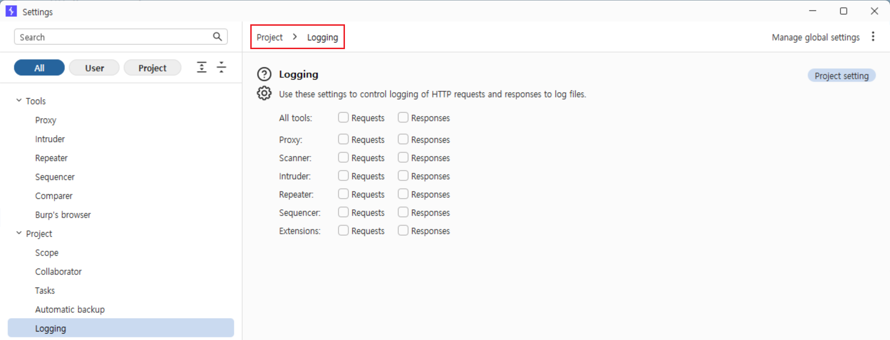

- **어떤 툴의 로그를 남길 것인가?**: 
  - 스크린샷에 보이는 것처럼 Proxy, Scanner, Intruder 등 각 툴(Tools)별로 요청(Requests)과 응답(Responses)을 쪼개서 따로따로 저장할 수 있다.
  - **면피용(증거용) 세팅 ⭐️**: 모의해킹 진단 중 간혹 고객사에서 "어제 오후 2시쯤 서버가 잠깐 뻗었는데, 진단팀에서 무슨 공격 패킷 쏘셨나요?"라고 물어보는 상황이 발생할 수 있다. 이때를 대비해 **`All tools`**의 `Requests`와 `Responses`를 모두 체크해서 날짜별로 텍스트 파일을 남겨두면, 내가 안 쐈다는 걸 확실하게 증명할 수 있는 완벽한 블랙박스가 된다.
  - **용량 관리 팁**: 하지만 `All tools`를 켜두면 스캐너(Scanner)나 인트루더(Intruder)가 무지성으로 쏘는 수만 개의 패킷까지 전부 텍스트로 저장되어 로그 파일 용량이 무지막지하게 커질 수 있다. 하드 용량이 넉넉하지 않다면, 내가 직접 쏘고 조작한 흔적인 **`Proxy`**와 **`Repeater`** 항목만 체크해서 가볍고 효율적으로 로깅하는 것도 방법이다.

## 8. Sessions (세션 및 매크로 설정)
웹 애플리케이션 진단 시 세션(로그인 상태)이 자주 만료되거나 CSRF 토큰을 매번 갱신해야 하는 번거로움을 자동화로 해결해 주는 기능이다. 스크린샷에 보이는 3가지 메뉴가 서로 톱니바퀴처럼 맞물려 돌아간다.

### 8.1. Session handling rules

Burp Suite가 패킷을 보낼 때 '언제, 어떤 툴에서, 어떤 행동을 할지' 큰 그림(조건과 규칙)을 정의하는 곳이다.
- **기본 룰 (Use cookies from Burp's cookie jar)**: 기본적으로 `Scanner` 툴만 쿠키 항아리(Cookie jar)를 쓰도록 설정되어 있다.
  - **추천 세팅법 ⭐️**: 스크린샷처럼 기본 룰을 더블클릭(`Edit`)해서 **`Scope` 탭**으로 들어간 뒤, `Tools scope`에서 **`Repeater`**와 **`Intruder`**를 체크해 주자. 
  - **왜 좋을까?**: 이렇게 세팅해 두면 진단 중 세션이 끊겼을 때, 브라우저(Proxy)에서 쓱 로그인만 다시 해주면 끝이다. 브라우저가 받아온 새 쿠키를 Burp가 알아서 `Repeater`와 `Intruder` 패킷에 덮어씌워서 쏴주기 때문에, 수십 개의 탭에 일일이 쿠키를 복사/붙여넣기 할 필요가 없어진다.

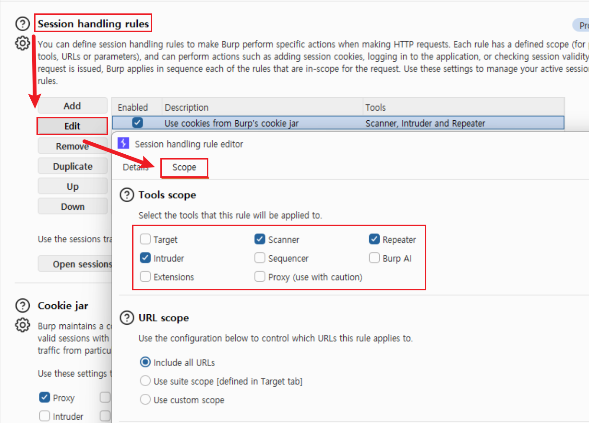

- **URL scope / Parameter scope**: 이 룰을 모든 사이트(`Include all URLs`)에 일괄적으로 적용할지, 타겟 스코프에만 적용할지 타겟팅하는 옵션이다.
- **Open sessions tracer (트러블슈팅)**: 룰이 제대로 발동해서 쿠키를 잘 덮어씌우고 있는지 패킷 교환 로그를 상세하게 보여주는 디버깅 창이다.

### 8.2. Cookie jar 
Burp가 트래픽에서 수집한 유효한 쿠키(세션)들을 자동으로 주워 담아 보관하는 가상의 항아리(Jar)다.

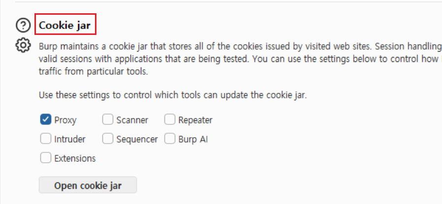

- **업데이트 출처 설정 (Proxy)**: 스크린샷을 보면 유일하게 **`Proxy`**에만 체크가 되어 있다. 즉, "내가 웹 브라우저로 직접 돌아다니면서 정상적으로 받아온 신선한 쿠키들만 담아라" 라는 뜻이다. (괜히 Scanner나 Intruder가 쏘는 비정상 패킷에서 돌아오는 이상한 쓰레기 쿠키가 세션을 덮어쓰지 못하도록 방지하는 기본 세팅이다.)
- **Open cookie jar**: 현재 항아리에 어떤 도메인의 어떤 세션값이 들어있는지 직접 눈으로 확인하고, 만료된 찌꺼기 쿠키를 수동으로 지우거나 값을 수정할 수 있는 버튼이다.

### 8.3. Macros 
세션이 만료되었을 때 "로그인 페이지 이동 -> ID/PW 입력 -> 로그인 성공" 이라는 일련의 행동(패킷 흐름)을 녹화해 두고 필요할 때마다 자동으로 실행시키는 기능이다.
- **사실상 거의 안씀**: `Macro recorder`나 `Macro editor` 창을 열어보면 알 수 있듯이, 설정 과정이 은근히 복잡하고 파라미터 매칭 등 세팅할 게 많아서 좀 번거롭고 어렵다.
- **언제 써야 할까?**: 
  - **수동 진단 시 (사용 비추)**: `Repeater`로 수동 진단을 할 때 세션이 끊기면? 그냥 웹 브라우저 창에서 다시 로그인하고 새 쿠키값을 복사해서 Repeater에 붙여넣는 게 정신건강에 훨씬 이롭고 빠르다. 
  - **자동 스캔 시 (필수)**: 수만 개의 패킷을 쏘는 **자동 스캐너를 돌릴 때**는 이야기가 다르다. 새벽에 세션이 끊기면 스캔이 통째로 망해버리기 때문에, 이때는 이 복잡한 매크로 창을 열어 자동 로그인을 세팅해두어야 한다. (지금 당장 수동 진단 위주라면 스킵해도 무방하다.)

---

## 9. Network (네트워크 및 통신 설정)
트래픽 라우팅, 서버와의 연결 방식, 그리고 암호화(TLS) 통신과 관련된 전역 설정이다.

### 9.1. Connections (연결 및 프록시 설정)
Burp Suite가 타겟 웹 서버와 어떻게 연결을 맺을지 정의하는 메뉴다.

- **Upstream proxy servers (업스트림 프록시 ⭐️)**: 

  - **언제 쓸까?**: 금융권 같은 철저한 망분리 환경에서 모의해킹을 할 때, 내 PC에서 타겟 서버로 다이렉트 통신이 불가능하고 **무조건 특정 사내 프록시/보안 장비를 거쳐야만 인터넷이 뚫리는 빡센 환경**일 때가 있다.
  - 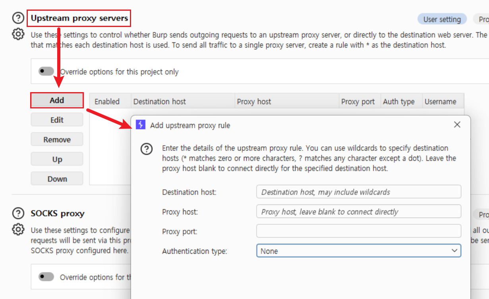
  - **실무 세팅법 (규칙 추가)**: 스크린샷처럼 `Add` 버튼을 누르면 세부 규칙을 짤 수 있다.
    - **Destination host**: 이 프록시 규칙을 적용할 목적지 타겟을 적는다. `*`(모든 문자) 와일드카드를 지원하므로, 보통 `*.target.com` 처럼 세팅해서 해당 도메인으로 가는 트래픽만 사내 프록시로 넘긴다. (빈칸이나 `*`로 두면 전체 트래픽에 적용된다.)
    - **Proxy host & port**: 내가 거쳐 가야 할 사내 프록시 서버(보안 장비)의 IP와 포트를 적어준다. 
      - **💡 우회(Bypass) 팁**: 스크린샷 설명에도 나와 있듯, 만약 `Proxy host` 칸을 빈칸으로 비워두면? "이 목적지(Destination)로 갈 때는 프록시 거치지 말고 다이렉트로 쏴라" 라는 예외 처리 규칙이 된다.
    - **Authentication type**: 사내 프록시 서버 자체를 통과할 때 비밀번호가 필요하다면 여기서 인증 방식을 고르고 계정을 입력하면 된다. (보통 사내망 프록시는 NTLM이나 Basic 인증이 걸려있다.)
  - **결과**: 이렇게 세팅해 두면 Burp가 목적지를 보고 알아서 사내 프록시로 패킷을 토스해 주거나 다이렉트로 쏴주므로, 복잡한 망분리 환경에서도 에러 없이 쾌적하게 진단을 수행할 수 있다.
- **SOCKS proxy (SOCKS 프록시)**: 
  - **언제 쓸까?**: `Upstream proxy`가 웹(HTTP) 통신만 우회시켜 주는 프록시라면, `SOCKS proxy`는 TCP 통신 자체를 전부 우회시켜 주는 하위 계층 프록시다. 모의해킹 실무에서는 주로 내 PC에서 타겟 서버로 다이렉트 통신이 안 될 때, 중간에 있는 **경유지(Jumpbox) 서버를 통해 SSH 터널링(Dynamic Port Forwarding)**을 뚫어놓고 그 터널을 타고 타겟 서버로 진입하기 위해 쓴다. (횡적 이동 기법 사용할 때 주로 사용하는 걸로 알고있다.)
  - 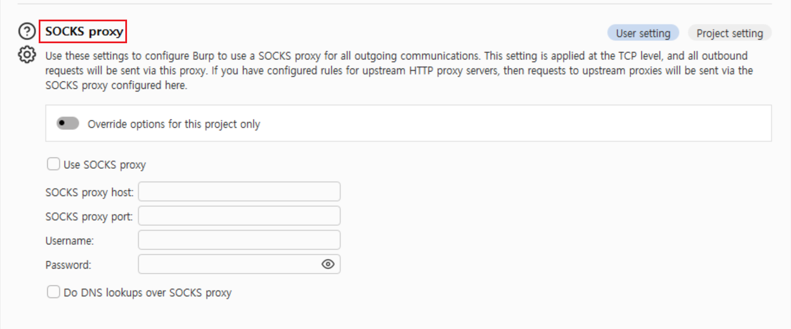
  - **실무 세팅법**: `Use SOCKS proxy`를 체크하고, SSH 터널링이 열려있는 내 로컬 PC의 포트(예: `localhost`, `1080`)를 입력해 주면 Burp가 쏘는 모든 트래픽이 해당 터널을 타고 쑥 빠져나가게 된다.
    - **Username / Password **: 보통 가장 많이 쓰는 SSH 터널링(`localhost:1080`) 방식에서는 터널 자체에 별도의 비밀번호를 걸지 않으므로 **빈칸으로 두는 것이 정상**이다. 이 칸은 접속 자체에 인증(RFC 1929)이 걸려있는 유료 상용 SOCKS5 프록시 서비스나, 깐깐하게 설정된 사내 전용 SOCKS 서버를 사용할 때만 계정 정보를 입력하는 곳이다.
  - **Do DNS lookups over SOCKS proxy (체크박스)**: 타겟 도메인의 IP를 찾을 때(DNS 조회), 내 PC의 로컬 DNS 서버를 안 쓰고 저 멀리 터널 끝(SOCKS 프록시 너머)에 있는 타겟 망의 DNS 서버를 쓰겠다는 옵션이다. 외부망에서 사내 폐쇄망의 내부 전용 도메인(예: `dev.corp.local`)에 접근할 때 이 체크박스를 켜지 않으면 도메인을 못 찾아서 에러가 나므로 **반드시 체크**해야 한다.
  - **💡 중복 적용 규칙**: 스크린샷 설명란(Description)에도 적혀 있듯, 만약 위에 있는 `Upstream proxy`와 `SOCKS proxy`를 둘 다 세팅했다면 어떻게 될까? Burp는 패킷을 `SOCKS 프록시`로 먼저 보낸 뒤, 그 터널을 타고 넘어가서 다시 `Upstream 프록시`를 거치도록 설계되어 있다.

### 9.2. DNS
타겟 도메인에 대해 Burp Suite 내부적으로 별도의 DNS 조회를 설정해야 할 때 사용한다. 스크린샷에 나온 두 가지 핵심 기능이 있다.

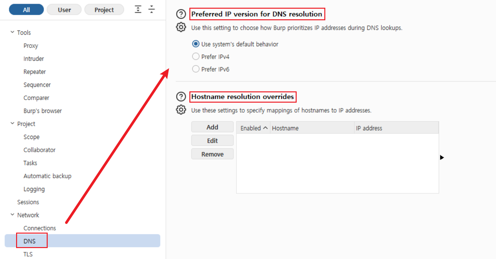

- **Preferred IP version for DNS resolution**: 도메인을 IP로 바꿀 때 IPv4를 우선할지, IPv6를 우선할지 고르는 옵션이다. 
  - **실무 팁**: 간혹 타겟 서버가 IPv6를 지원하긴 하는데 방화벽 설정이 꼬여있어서 IPv6로 패킷을 쏘면 에러가 나는 경우가 있다. 이때 이 옵션을 `Prefer IPv4`로 강제 고정해 주면 깔끔하게 해결된다. 특별한 이슈가 없다면 기본값(`Use system's default behavior`)으로 둔다.
- **Hostname resolution overrides (호스트네임 강제 덮어쓰기 ⭐️)**: 모의해킹 실무에서 **가장 많이 쓰는 기능 중 하나**다. 내 PC의 `hosts` 파일(`C:\Windows\System32\drivers\etc\hosts`)을 변조하는 것과 완전히 똑같은 역할을 Burp 내부에서만 해준다.
  - **언제 쓸까?**:
    1. **운영 서버 건드리기 무서울 때**: 타겟 도메인(`www.test.com`)을 쳤을 때, 실제 운영 서버 IP 대신 회사 내부에 있는 안전한 '개발/스테이징 서버 IP'로 패킷이 날아가도록 조작할 때 쓴다.
    2. **DNS 서버가 안 도와줄 때**: 아직 정식 오픈 전이라 DNS 서버에 도메인이 안 올라가 있거나, 폐쇄망이라 DNS 조회가 아예 안 될 때 수동으로 IP와 도메인을 강제 매핑해 준다.
  - **장점**: 윈도우의 `hosts` 파일을 직접 수정하면 내 PC 전체(다른 브라우저, 메신저 등)에 영향을 주지만, 여기에 세팅하면 **오직 Burp Suite를 거치는 트래픽에만 적용**되므로 훨씬 안전하고 쾌적하다.

### 9.3. TLS (구 SSL)
HTTPS 통신 중 발생하는 인증서 에러나 암호화 연결 실패(Handshake error)를 해결할 때 필수적인 메뉴다. 

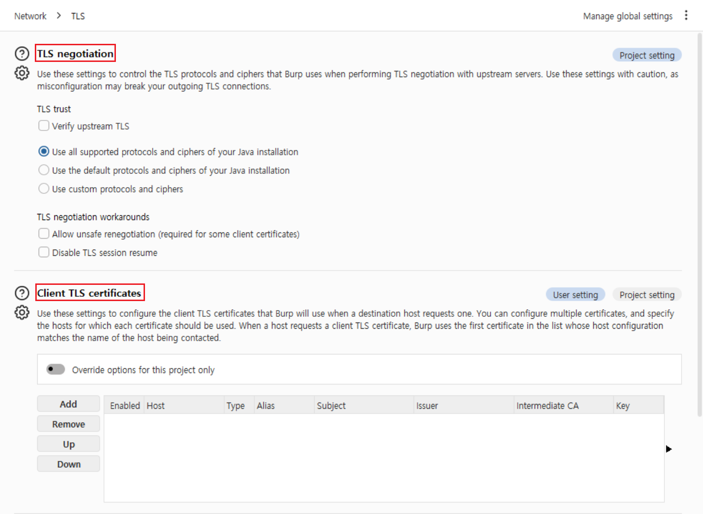

- **TLS negotiation (TLS 협상)**: 타겟 서버와 암호화 통신을 맺을 때 어떤 프로토콜과 암호화 알고리즘(Cipher)을 사용할지 결정한다.
  - **실무 팁**: 기본적으로 자바(Java)가 지원하는 모든 프로토콜을 사용하도록(`Use all supported protocols...`) 체크되어 있다. 하지만 타겟 서버가 너무 구형이라서 통신 에러가 난다면, `Use custom protocols and ciphers`를 선택해 지원 범위를 수동으로 직접 맞춰볼 수 있다.
- **Client TLS certificates (클라이언트 인증서)**: 금융권이나 사내망에서 흔히 쓰는 **'상호 인증(mTLS)'** 환경에서 필수다. 서버가 "너 우리 직원 맞아? 네 인증서 내놔봐" 하고 요구할 때, `Add` 버튼을 눌러 회사가 발급해 준 내 PC의 인증서(p12, jks 등)를 등록해 두면 Burp가 알아서 제출하고 인증을 통과시켜 준다.

​	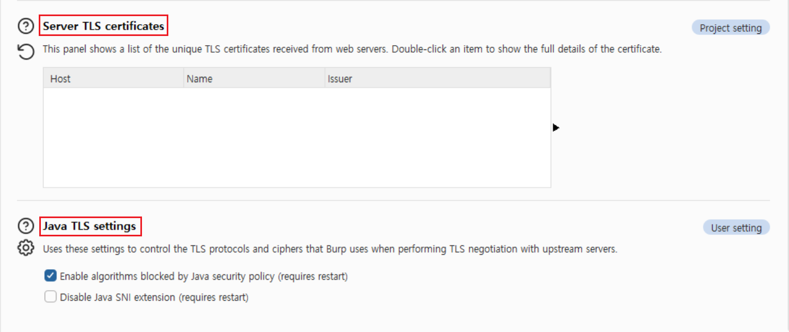

- **Server TLS certificates**: 진단 중에 내가 접속했던 타겟 서버들이 뱉어낸 인증서 목록을 모아서 보여주는 단순 조회용 패널이다. (더블 클릭하면 상세 정보 확인 가능)
- **Java TLS settings (자바 보안 해제 ⭐️)**: 모의해커라면 눈여겨봐야 할 세팅이다.
  - `Enable algorithms blocked by Java security policy`: 자바(Java) 자체 보안 정책 때문에 차단된 아주 옛날의 취약한 암호화 알고리즘들을 Burp에서는 강제로 쓸 수 있게 허용해 주는 옵션이다.
  - 취약점 진단을 하다 보면 보안이 안좋은 구형 서버를 찔러야 할 때가 많다. 이때 Burp가 "이 서버 암호화가 너무 취약해서 연결 안 할래" 하고 튕겨내는 것을 방지하려면, 스크린샷처럼 이 체크박스를 **반드시 켜두는 것**이 좋다. (체크 후 Burp 재시작 필요)

### 9.4. HTTP
HTTP/1 및 HTTP/2 프로토콜 파싱과 리다이렉트(Redirect) 처리 등 웹 통신의 아주 디테일한 뼈대를 제어하는 곳이다. 주요 기능들은 다음과 같다.

- **Allowed redirect types (리다이렉트 허용 규칙)**: 자동 스캐너나 Intruder가 동작할 때, 서버가 "다른 페이지로 가!" 하고 응답했을 때 어떤 방식의 리다이렉트를 끝까지 쫓아갈지(Follow) 결정한다.
  - `3xx status code with Location header`: HTTP 상태 코드 301, 302와 함께 `Location` 헤더가 떨어질 때 쫓아간다. (가장 표준적인 웹 리다이렉트 방식이므로 기본 체크)
  - `Refresh header`: HTTP 응답 헤더에 `Refresh: 5; url=...` 형식으로 이동을 지시할 때 쫓아간다. (기본 체크)
  - `Meta refresh tag`: HTML 코드 안에 `<meta http-equiv="refresh" ...>` 태그가 있을 때 쫓아간다. (기본 체크)
  - `JavaScript-driven`: 자바스크립트(`window.location` 등) 코드로 페이지를 이동시킬 때 쫓아간다.
    - **왜 꺼둘까?**: 자바스크립트 이동까지 쫓아가게 켜두면, 스캐너가 너무 깊은 엉뚱한 페이지(예: 로그아웃 버튼 스크립트, 외부 사이트)로 무한 루프를 돌며 빠져버릴 위험이 커서 보통 기본값(Off)으로 둔다.
  - `Any status code with Location header`: 3xx 코드가 아닌데도(예: 200 OK) `Location` 헤더가 있으면 무조건 쫓아간다. 비표준적인 구현이므로 기본적으로 꺼져있다.
- **HTTP/1 & HTTP/2 (프로토콜 버전 설정 ⭐️)**:
  - `HTTP/1 - Use keep-alive for HTTP/1 if the server supports it`: 패킷을 보낼 때마다 TCP 연결을 끊지 않고 계속 재사용할지 묻는 옵션이다. (스크린샷에서는 꺼져있는데, 대량의 패킷을 쏘는 진단 속도를 위해 켜두는 것도 좋다.)
  - `HTTP/2 - Default to HTTP/2 if the server supports it`: 타겟 서버가 HTTP/2를 지원한다면 무조건 최신 버전인 HTTP/2로 통신하겠다는 옵션이다. 
  - **실무 팁 (Request Smuggling)**: 최근 HTTP/2 시대가 오면서 리퀘스트 스머글링(HTTP Request Smuggling)이라는 취약점이 유행하고 있다. 이 취약점을 수동으로 깊게 테스트하려면 HTTP/2 통신을 강제로 HTTP/1.1 통신으로 쪼개고 변조해야 하는데, 이때 여기로 들어와서 이 체크박스들을 끄며 '프로토콜 강제 다운그레이드' 를 시도할 수 있다.
