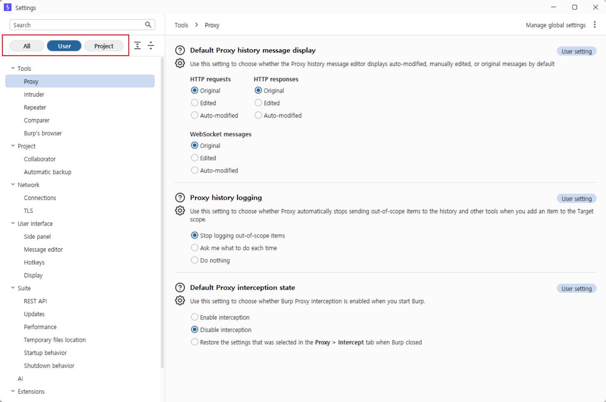
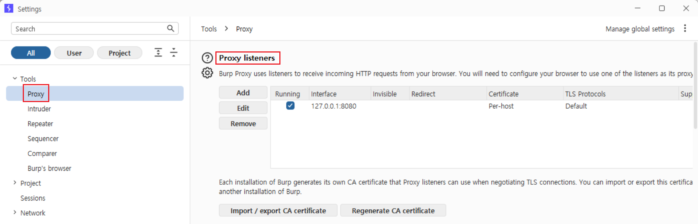
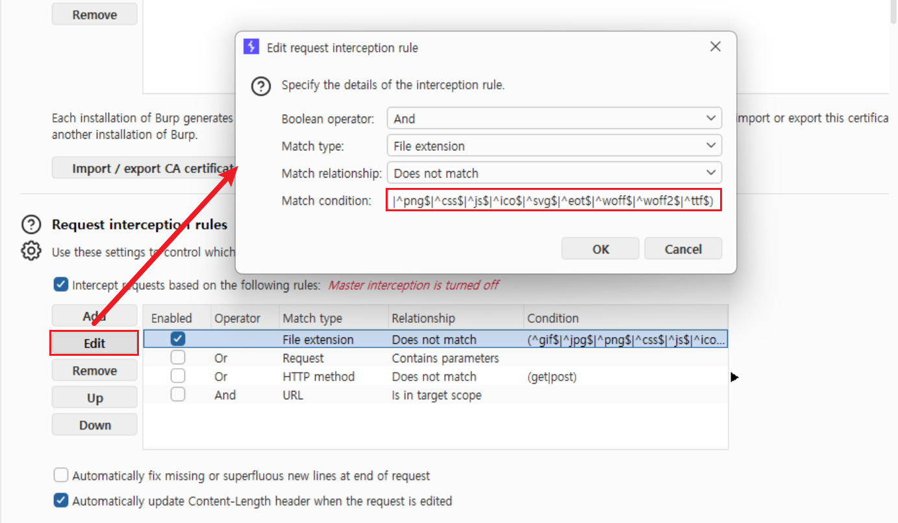
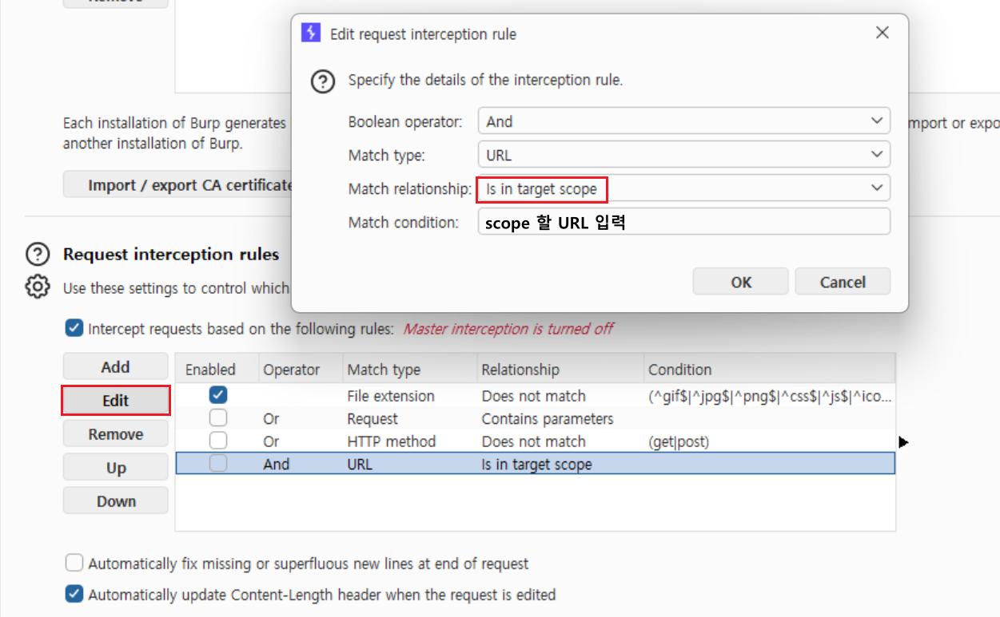
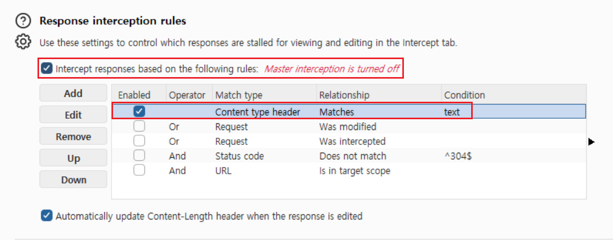
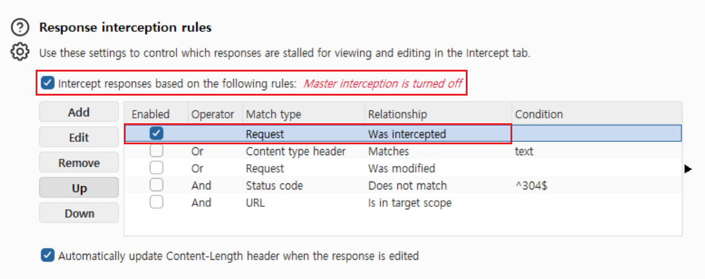
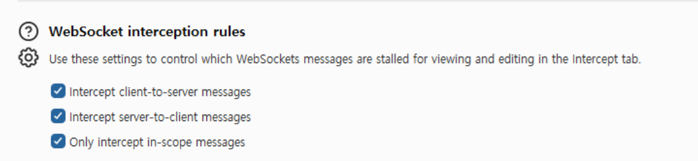

모의해킹 실무에서 툴의 기본기를 탄탄하게 다지는 것은 해킹 기술만큼이나 중요하다. Burp Suite의 우측 상단 톱니바퀴 아이콘(⚙️)을 누르면 나오는 **설정(Settings)** 창은 기능이 너무 방대하고 어렵지만, 이곳을 어떻게 세팅하느냐에 따라 패킷 분석의 효율이 차이가 많이 난다.

PortSwigger 공식 문서의 스펙을 바탕으로, 설정창의 모든 메뉴를 얕고 넓게 살펴보려고한다.

---

## 1. User Settings vs Project Settings

설정창 좌측 상단을 보면 `All`, `User`, `Project` 버튼이 있다. 
Burp Suite는 설정을 두 가지 범위로 나누어 관리한다.

- **User settings (사용자 설정)**: Burp Suite 프로그램 전체에 영구적으로 적용되는 설정이다. UI 테마(다크모드), 단축키, 폰트 크기 등이 여기에 속한다.
- **Project settings (프로젝트 설정)**: 현재 열려있는 프로젝트(Project) 파일에만 적용되는 설정이다. 타겟 도메인 범위(Scope), 자동 로그인 매크로(Sessions), 프록시 리스너 설정 등이 속한다. 새 프로젝트를 만들면 이 설정들은 초기화된다.

---

## 2. Tools > Proxy (프록시 설정)

좌측 메뉴 트리에서 **Tools > Proxy** 탭은 웹 브라우저의 트래픽을 가로채는 가장 핵심적인 설정들이 모여 있는 곳이다.

### 2.1. Proxy Listeners (리스너 설정)
Burp Suite가 브라우저의 트래픽을 수신하기 위해 열어두는 로컬 포트를 설정한다.

- 기본적으로 `127.0.0.1:8080` 포트가 등록되어 체크(`Running`)되어 있다.
- **포트 충돌 시**: 다른 툴(예: Tomcat, Oracle 등)이 8080 포트를 사용 중이라 Burp가 켜지지 않는다면, `Edit`을 눌러 `8081` 등으로 포트를 변경해야 한다.
- **모바일 모의해킹 시**: 스마트폰 앱의 패킷을 잡으려면 Bind to address 설정을 `All interfaces`로 변경하여 외부 기기에서 내 PC의 Burp로 패킷을 보낼 수 있게 열어주어야 한다.
- **인증서 관리(CA certificate)**: `Import / export CA certificate` 버튼을 통해 기기에 심을 PortSwigger 인증서를 추출한다.
  - **인증서 내장 버프 브라우저**: Burp에 내장된 브라우저(`Burp's Browser`)를 쓰면 이 인증서가 기본 탑재되어 있어 경고 없이 HTTPS 패킷이 잡힌다.
  - **언제 추출?**: 내장 브라우저를 쓸 수 없는 **모바일 앱 해킹(iOS/Android)**이나, 평소 쓰는 외부 크롬/파이어폭스 브라우저에 프록시를 걸 때 수동으로 설치하기 위해 사용한다.

### 2.2. Request / Response Interception Rules (인터셉트 규칙)
가장 중요한 설정 중 하나다. Proxy 탭의 `Intercept is on` 상태일 때, **어떤 패킷은 잡고 어떤 패킷은 그냥 통과시킬지** 룰(Rule)을 정한다.

실무를 하다 보면 `Intercept`를 켰을 때 내가 원하는 타겟 서버의 패킷뿐만 아니라, 백그라운드에서 날아가는 크롬 확장 프로그램 패킷, 구글 애널리틱스(`*.google-analytics.com`), 그리고 의미 없는 이미지 파일(`.png`, `.gif`), 스타일시트(`.css`) 등이 수없이 잡힌다. 이를 일일이 `Forward` 누르다가 시간이 다 간다.

- **기본 필터링과 JS 파일 예외 처리**: 기본적으로 `^gif$|^jpg$|^png$|^css$|^js$` 등으로 끝나는 정적 파일들은 인터셉트하지 않도록 세팅되어 있다. **하지만 실무 진단 시 프론트엔드 취약점이나 중요 로직을 파악하기 위해 `.js` 파일을 반드시 뜯어봐야 하는 경우가 많다.** 이때는 이 룰을 `Edit`하여 중간 부분의 `|^js$`를 지워주면 자바스크립트 파일도 정상적으로 캡처할 수 있다.

	

- **실무 꿀팁 (In target scope)**: 룰을 새로 추가(`Add`)하여 **"And / URL / Is in target scope"** 조건을 걸어두는 것을 강력 추천한다. 이렇게 세팅하면 Target 탭에서 설정한 스코프(타겟 도메인)의 패킷만 잡히기 때문에 쓰레기 패킷을 완벽하게 걸러낼 수 있다.
​	

### 2.3. Response Interception Rules (응답 인터셉트 규칙)
요청(Request)뿐만 아니라, 서버에서 돌아오는 응답(Response) 패킷을 화면에 띄울지 말지 결정하는 규칙이다.

- **기본 설정 (`Content type header Matches text`)**
  
  - Burp의 초기 설정은 응답의 Content-Type 헤더가 `text`(예: `text/html`)인 경우에 무조건 응답을 잡도록 되어 있다. 
  - **단점**: 모의해킹 시 핵심인 JSON 응답(`application/json`)은 놓치기 십상이고, 굳이 분석할 필요 없는 텍스트 응답까지 모조리 잡아버려 인터셉트 창이 피곤해진다.

- **권장 커스텀 설정 (`Request Was intercepted`)**
  
  - **거의 대부분의 경우 커스텀 설정 하는 것을 권장한다.**
  - 이 규칙을 활성화하면, **"내가 Request 창에서 직접 조작하고 Forward를 누른 바로 그 패킷의 응답"**만 선별해서 잡게 된다.
  - 내가 공격 코드를 삽입한 패킷에 대해 서버가 어떻게 반응하는지만 핀포인트로 확인할 수 있기 때문에, 분석 효율이 극대화된다.

### 2.4. WebSocket Interception / Match and Replace Rules
HTTP 트래픽뿐만 아니라 WebSocket 메시지에 대해서도 클라이언트-서버 간 메시지를 가로챌지(Intercept), 혹은 특정 텍스트를 자동으로 치환할지(Match and replace) 결정한다.

- **Intercept client-to-server messages**: 클라이언트(브라우저)에서 서버로 보내는 웹소켓 메시지를 인터셉트 창에 잡아둔다. (기본 체크됨)
- **Intercept server-to-client messages**: 반대로 서버에서 브라우저로 실시간 푸시(Push)하는 웹소켓 메시지를 잡아둔다. (기본 체크됨)
- **Only intercept in-scope messages (체크 권장)**: 타겟 스코프(Scope)에 등록된 도메인의 웹소켓 통신만 인터셉트한다. HTTP 인터셉트 규칙과 마찬가지로, 쓸데없는 백그라운드 웹소켓 통신(노션, 슬랙 등)을 전부 걸러내고 타겟 트래픽만 보고 싶다면 이 옵션을 반드시 체크해 주는 것을 추천한다.

### 2.5. Response Modification Rules
서버에서 오는 응답(Response)을 브라우저에 띄우기 전에 Burp가 자동으로 조작해 주는 기능이다. 패킷을 일일이 잡지 않고도 브라우저 화면 상에서 편하게 취약점을 테스트할 수 있게 해준다.

- **Unhide hidden form fields**: 결제 금액 등 숨겨진 `<input type="hidden">` 값을 화면에 강제로 띄워서 브라우저에서 직접 수정할 수 있게 한다.
- **Remove JavaScript form validation**: 프론트엔드의 입력 검증 로직을 무력화하여, 브라우저 입력창에 페이로드를 바로 붙여넣을 수 있게 한다.
- 💡 **실무 코멘트**: 초보자에게는 유용할 수 있으나, 최신 웹(React, Vue 등)에서는 UI가 깨지는 부작용이 잦다. 버프에 익숙한 사람들은 굳이 이 기능을 켜서 브라우저에서 진단하는 것 보다, 그냥 패킷을 잡아 `Repeater`에서 직접 조작하는 것을 훨씬 선호하므로 필수 옵션은 아니다.

### 2.6. HTTP Match and Replace Rules
지나가는 패킷의 특정 문자열이나 헤더를 정규식을 사용해 자동으로 치환해 주는 기능이다.
- **활용 예시**: `User-Agent` 헤더를 모바일 기기로 강제 고정시키거나, WAF 우회를 위해 특정 헤더를 모든 패킷에 삽입하도록 자동화할 때 쓴다.

### 2.7. TLS Pass Through 
모바일 앱 진단 시 '인증서 피닝(Certificate Pinning)'이 강하게 걸려있어서 패킷을 잡을 수 없는 카카오톡, 금융 앱 등이 있다. 

이때 이 앱들의 호스트 도메인을 여기에 등록해두면, Burp가 억지로 패킷을 열어보지 않고 원래 암호화된 상태 그대로 조용히 통과시킨다. (특정 앱의 먹통을 방지하면서, 핸드폰 내의 다른 타겟 앱들을 정상적으로 진단할 때 필수적이다.)

### 2.8. Proxy History Logging 및 Default Interception State
- **Stop logging out-of-scope items**: 타겟 스코프가 아닌 쓰레기 패킷들을 HTTP history에 아예 남기지 않아 램(RAM) 메모리를 아끼는 옵션이다.
- **Default Proxy interception state**: Burp Suite를 처음 켰을 때 Intercept가 켜져 있을지, 꺼져 있을지 결정한다. (보통 켤 때마다 패킷이 막히면 귀찮으므로 캡처 화면처럼 `Disable interception` 세팅을 추천한다.)

### 2.9. Miscellaneous
- **Unpack compressed responses**: 서버가 GZIP 등으로 압축해서 보낸 응답을 Burp가 자동으로 압축 해제해서 보기 좋게 텍스트로 보여주는 기능이다. (기본 체크됨)

---

## 3. Sessions (세션 및 자동 로그인 매크로)
웹 애플리케이션 진단 시 세션이 자주 만료되거나 CSRF 토큰을 매번 갱신해야 하는 번거로움을 해결해 주는 강력한 기능이다.

### 3.1. Session Handling Rules
Burp Suite가 패킷을 보낼 때 특정 조건에 맞으면 자동으로 수행할 규칙을 정의한다.
- **활용 예시**: 패킷의 응답에 "Session Expired"라는 텍스트가 보이면, 자동으로 로그인 패킷을 먼저 날려서 세션을 갱신한 뒤 원래 쏘려던 공격 패킷을 다시 보내도록 설정할 수 있다.

### 3.2. Macros
위 규칙에서 "자동으로 로그인 패킷을 날린다"는 일련의 행동을 녹화해 두는 기능이다.
- 매크로 설정 창에서 로그인 과정을 순서대로 클릭(`Add`)하여 기록해 두면, 필요할 때마다 Burp가 알아서 백그라운드에서 매크로를 실행하여 세션값을 물고 온다.

> **[여기에 Project > Sessions (매크로/세션 룰) 캡처 첨부]**

---

## 4. Network (네트워크 및 TLS 설정)
트래픽 라우팅, 서버와의 연결 방식, 그리고 암호화(TLS) 통신과 관련된 전역 설정이다.

### 4.1. Connections
- **Upstream Proxy Servers**: 사내망이나 특정 망에서 외부로 나가기 위해 회사의 사내 프록시를 반드시 거쳐야 할 때 사용한다. (Burp ➡️ 회사 사내 프록시 ➡️ 타겟 서버)
- **SOCKS Proxy**: SSH 터널링 등을 통해 SOCKS 프록시를 연결할 때 세팅한다.

### 4.2. TLS (구 SSL)
HTTPS 통신 중 발생하는 인증서 에러나 암호화 연결 실패를 해결할 때 필수적이다.

- **TLS Negotiation**: 최신 TLS 1.3부터 오래된 SSLv3까지 설정할 수 있다. 타겟 서버가 너무 구형 웹서버라서 패킷 전송 시 핸드셰이크(Handshake) 에러가 난다면 여기서 지원 프로토콜 버전을 낮춰서 연결을 시도해 볼 수 있다.

> **[여기에 Network > TLS 설정 캡처 첨부]**
