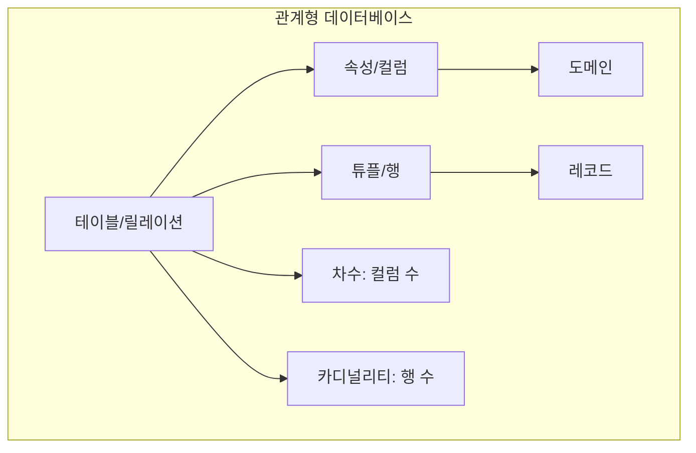
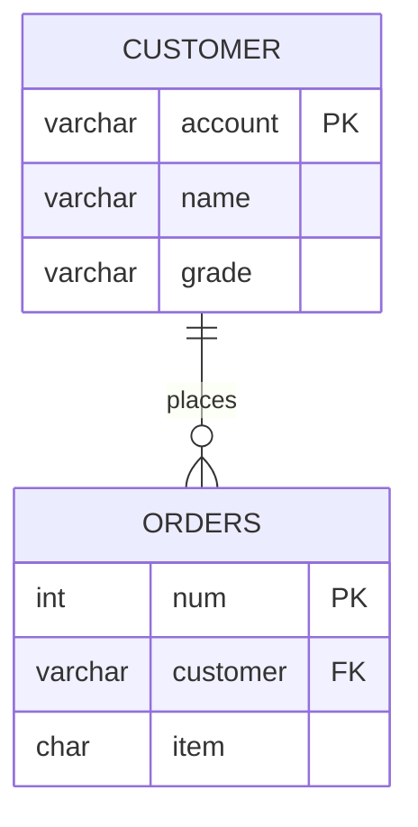
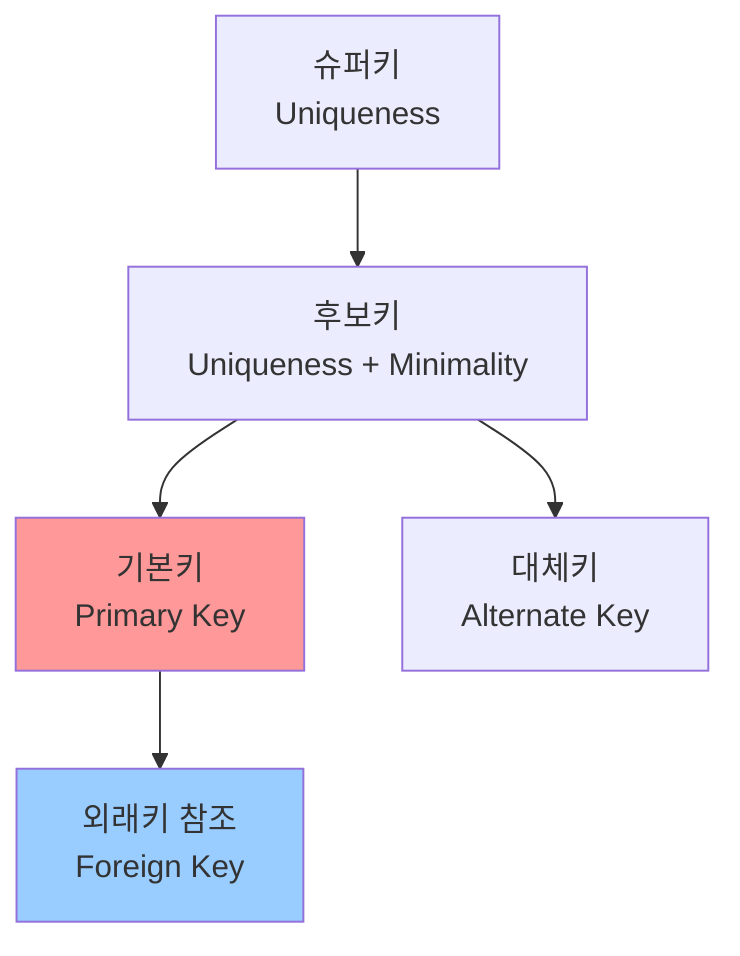

## 전체 흐름 요약

데이터베이스는 현대 정보 시스템의 핵심 요소입니다. 이 문서에서는 데이터베이스의 기본 개념부터 시작하여 DBMS(Database Management System)의 역할과 기능을 이해하고, 관계형 데이터베이스(RDB)의 구조와 특징을 학습합니다.

먼저 데이터와 정보의 차이를 명확히 구분하고, 데이터베이스가 왜 필요한지 그 특징을 살펴봅니다. 이어서 데이터베이스를 관리하는 시스템인 DBMS의 필수 기능(정의, 조작, 제어)을 이해합니다.

관계형 데이터베이스(RDB)는 현재 가장 널리 사용되는 데이터베이스 모델로, 테이블(table) 형태로 데이터를 저장하고 관리합니다. RDB의 핵심 개념인 릴레이션(Relation), 속성(Attribute), 튜플(Tuple) 등의 용어를 익히고, 데이터의 무결성을 보장하기 위한 다양한 키(Key) 개념을 학습합니다.

마지막으로 DBMS와 RDBMS의 장단점을 비교하여 각각의 특성을 이해하고, 실무에서 어떻게 활용되는지 파악합니다.

## 1. DATABASE 관련 기본 용어

### 데이터 (Data)

**데이터**는 현실에서 수집한 단순한 사실이나 결과값으로, 가공되지 않은 원시 상태의 자료를 의미합니다.

**특징:**
- 단순한 사실이나 값의 나열
- 그 자체만으로는 의미를 파악하기 어려움
- 가공 전의 원시 자료

**예시:**
- 숫자: 25, 30, 180
- 문자: "홍길동", "서울시 강남구"
- 날짜: 2025-01-04

### 정보 (Information)

**정보**는 의사 결정에 도움을 줄 수 있는 유용한 형태로 데이터를 가공해서 얻은 결과물입니다.

**특징:**
- 데이터를 처리하고 가공한 결과
- 특정 목적이나 의미를 가짐
- 의사결정에 활용 가능

**예시:**
- "홍길동 고객의 나이는 25세이며, 서울시 강남구에 거주합니다"
- "이번 달 매출은 전월 대비 15% 증가했습니다"

**데이터와 정보의 관계:**

```
데이터 (Data) → [가공/처리] → 정보 (Information) → [의사결정]
```

### 데이터베이스 (Database)

**데이터베이스**는 효율적인 관리와 검색을 위해 데이터들을 통합하여 체계화시킨 집합소입니다.

**정의:**
- 여러 사용자나 응용 프로그램이 공유하는 데이터의 집합
- 체계적으로 조직되고 저장된 데이터의 모음
- 특정 목적을 위해 구조화된 데이터 저장소

## 2. 데이터베이스의 특징

데이터베이스는 다음과 같은 6가지 주요 특징을 가지고 있습니다.

### (1) 통합된 데이터 (Integrated Data)

**중복을 최소화한 데이터 집합입니다.**

- 동일한 데이터가 여러 곳에 중복 저장되지 않도록 관리
- 데이터의 일관성 유지
- 저장 공간의 효율적 활용

**예시:**
- 고객 정보를 여러 테이블에 중복 저장하지 않고 하나의 고객 테이블에서 관리
- 다른 테이블에서는 고객 ID만 참조하여 사용

### (2) 저장된 데이터 (Stored Data)

**컴퓨터가 접근 가능한 매체에 저장된 데이터입니다.**

- 하드디스크, SSD 등의 저장 매체에 보관
- 컴퓨터 시스템을 통해 접근 가능
- 영구적인 저장 (비휘발성)

### (3) 실시간 접근성 (Real-time Accessibility)

**수시적이고 비정형적인 질의에 실시간으로 처리하고 응답할 수 있습니다.**

- 사용자의 요청에 즉시 응답
- 예측하지 못한 질의도 처리 가능
- 빠른 검색 및 조회 기능 제공

**예시:**
- 은행 시스템에서 실시간 잔액 조회
- 항공 예약 시스템에서 실시간 좌석 확인

### (4) 계속적인 변화 (Continuous Evolution)

**새로운 데이터의 삽입, 삭제, 갱신을 통해 시간에 따라 변화합니다.**

- 데이터의 동적인 상태 유지
- 삽입(INSERT), 삭제(DELETE), 수정(UPDATE) 연산 지원
- 현재의 정확한 데이터 유지

**예시:**
- 신규 고객 등록
- 주문 정보 추가
- 재고 수량 업데이트

### (5) 동시 공유 (Concurrent Sharing)

**여러 사용자에게 동시에 데이터를 제공합니다.**

- 다수의 사용자가 동시에 접근 가능
- 동시성 제어(Concurrency Control) 기능 제공
- 데이터 일관성 유지

**예시:**
- 여러 직원이 동시에 고객 정보 조회
- 온라인 쇼핑몰에서 여러 사용자가 동시에 상품 주문

### (6) 내용에 의한 참조 (Content Reference)

**데이터의 물리적 위치가 아닌 데이터 값에 따라 참조됩니다.**

- 데이터가 저장된 물리적 주소를 알 필요 없음
- 데이터의 내용(값)으로 검색
- 사용자 편의성 향상

**예시:**
```sql
-- 물리적 위치가 아닌 이름으로 검색
SELECT * FROM customer WHERE name = '홍길동';
```

## 3. DBMS (Database Management System)

### DBMS의 개념

**DBMS**는 Database를 관리하는 시스템을 의미합니다.

**정의:**
- 데이터베이스를 생성하고 관리하는 소프트웨어
- 사용자와 데이터베이스 사이의 중재자 역할
- 데이터의 효율적인 관리와 보호 기능 제공

### DBMS의 주요 기능

DBMS는 다음과 같은 기능을 제공합니다:

**일반 기능:**
- 데이터 조회 (Read)
- 데이터 추가 (Create)
- 데이터 수정 (Update)
- 데이터 삭제 (Delete)
- 데이터 무결성 유지
- 트랜잭션 관리
- 백업 및 복원 기능

### DBMS의 필수 기능 (3가지)

#### (1) 정의 기능 (Definition)

**데이터의 타입과 구조에 대해 데이터가 DB에 저장될 때의 제약조건 등을 명시합니다.**

- 데이터 구조 정의
- 데이터 타입 지정
- 제약조건 설정
- 스키마(Schema) 정의

**예시:**
```sql
CREATE TABLE customer (
    id VARCHAR(10) PRIMARY KEY,
    name VARCHAR(20) NOT NULL,
    age INT CHECK (age >= 0)
);
```

#### (2) 조작 기능 (Manipulation)

**데이터 검색, 갱신, 삽입, 삭제 등을 체계적으로 처리하기 위해 데이터 접근 수단 등을 정하는 기능입니다.**

- 데이터 검색 (SELECT)
- 데이터 변경 (UPDATE)
- 데이터 삽입 (INSERT)
- 데이터 삭제 (DELETE)

**예시:**
```sql
-- 데이터 검색
SELECT * FROM customer WHERE age > 20;

-- 데이터 삽입
INSERT INTO customer VALUES ('hong', '홍길동', 25);
```

#### (3) 제어 기능 (Control)

**데이터의 무결성 유지, 데이터 보안을 유지하고 권한 검사, 병행 제어가 가능해야 합니다.**

- **데이터 무결성 유지**: 데이터의 정확성과 일관성 보장
- **데이터 보안**: 권한이 없는 사용자의 접근 차단
- **권한 검사**: 사용자별 접근 권한 관리
- **병행 제어**: 여러 사용자의 동시 접근 관리

**예시:**
```sql
-- 권한 부여
GRANT SELECT, INSERT ON customer TO user1;

-- 권한 회수
REVOKE DELETE ON customer FROM user1;
```

## 4. RDB (Relationship Database) - 관계형 데이터베이스

### RDB의 개념

**관계형 데이터베이스**는 데이터의 관계를 열(Column)과 행(Row)을 가진 테이블 형태로 표현하여 데이터를 관리하는 것입니다.

### RDB의 특징

#### (1) 단순화된 구조

**계층 모델과 망 모델의 복잡한 구조를 단순화시킨 모델입니다.**

- 2차원 테이블 구조로 데이터 표현
- 직관적이고 이해하기 쉬운 구조
- 사용자 친화적인 데이터 관리

#### (2) 테이블 기반 데이터 관리

**표(Table)를 이용해서 데이터 상호 관계를 정의하는 DB 구조입니다.**

- 행(Row)과 열(Column)로 구성된 테이블
- 테이블 간의 관계 설정 가능
- 체계적인 데이터 구조화

#### (3) 키(Key)를 이용한 관계 표현

**데이터 간의 관계를 기본 키(Primary Key)와 이를 참조하는 외래 키(Foreign Key)로 표현합니다.**

- 기본 키: 각 행을 고유하게 식별
- 외래 키: 다른 테이블의 기본 키를 참조
- 테이블 간의 연결 관계 설정

#### (4) SQL 기반 관리

**데이터 저장에 필요한 명령어를 지원하기 위해 1974년 IBM 연구소에서 SQL(Structured Query Language)을 창안했습니다.**

- 표준 질의 언어 SQL 사용
- 데이터 정의, 조작, 제어 기능 제공
- 직관적이고 강력한 데이터 처리

### RDB 관련 용어

관계형 데이터베이스에서 사용되는 주요 용어들을 이해하는 것이 중요합니다.

#### Relation = Table (릴레이션 = 테이블)

**자료 저장의 형태가 2차원 구조(표)로 표현됩니다.**

- 데이터베이스의 기본 저장 단위
- 행과 열로 구성된 2차원 구조
- 하나의 개체(Entity)를 표현

**예시: customer 테이블**

| id | name | age | grade |
|----|------|-----|-------|
| apple | 홍길동 | 25 | Gold |
| banana | 김철수 | 30 | VIP |
| cherry | 이영희 | 22 | Silver |

#### 속성 (Attribute) = 필드 (Field) = 컬럼 (Column)

**테이블을 구성하는 열(Column)을 의미합니다.**

- 하나의 특성이나 속성을 나타냄
- 동일한 데이터 타입을 가짐
- 테이블의 구조를 정의

**예시:** customer 테이블의 속성
- `id` (고객 아이디)
- `name` (고객 이름)
- `age` (나이)
- `grade` (등급)

#### 튜플 (Tuple) = 레코드 (Record) = 행 (Row)

**테이블을 구성하는 행(Row)을 의미합니다.**

- 하나의 개체 인스턴스를 표현
- 여러 속성 값들의 집합
- 실제 데이터가 저장되는 단위

**예시:** customer 테이블의 한 튜플
```
('apple', '홍길동', 25, 'Gold')
```

#### 도메인 (Domain)

**하나의 속성(Attribute)이 가질 수 있는 같은 타입의 원자 값들의 집합(NULL 포함)입니다.**

- 속성이 취할 수 있는 값의 범위
- 데이터 타입과 제약조건 포함
- 데이터 무결성 보장

**예시:**
- `age` 속성의 도메인: 0 이상의 정수 (INT)
- `grade` 속성의 도메인: {'VIP', 'Gold', 'Silver', 'Bronze'}
- `email` 속성의 도메인: 유효한 이메일 형식의 문자열

#### 차수 (Degree)

**테이블을 구성하는 열(속성)의 수를 의미합니다.**

**예시:**
```
customer 테이블 (id, name, age, grade) → 차수: 4
```

#### 카디널리티 (Cardinality)

**테이블을 구성하는 행(튜플)의 수를 의미합니다.**

**예시:**
```
customer 테이블에 3명의 고객 정보가 있다면 → 카디널리티: 3
```

### RDB 구조 다이어그램



## 5. RDBMS (Relationship Database Management System) 구조

### 주요 DBMS 종류

현재 널리 사용되는 RDBMS는 다음과 같습니다:

- **Oracle**: 대규모 엔터프라이즈 환경에서 주로 사용
- **MSSQL**: Microsoft SQL Server, Windows 환경에 최적화
- **MySQL / MariaDB**: 오픈소스 데이터베이스, 웹 서비스에 널리 사용

### 키(Key)의 개념

데이터베이스에서 **키(Key)**는 테이블에서 특정 튜플을 식별하기 위해 사용되는 속성 또는 속성들의 집합입니다.

#### 키의 특성

##### (1) 유일성 (Uniqueness)

**하나의 키 값으로 하나의 튜플만을 유일하게 식별할 수 있어야 합니다.**

- 같은 키 값을 가진 튜플이 존재하지 않음
- 각 튜플을 구별할 수 있는 고유한 값

**예시:**
- 주민번호: 각 개인을 유일하게 식별
- 학번: 각 학생을 유일하게 식별

##### (2) 최소성 (Minimality)

**튜플을 유일하게 식별하는데 꼭 필요한 최소한의 속성으로 구성되어야 합니다.**

- 불필요한 속성을 포함하지 않음
- 최소한의 속성 조합으로 식별

**예시:**
- (주민번호, 이름)보다는 주민번호만으로 식별 가능 → 주민번호만 키로 사용

### 키의 종류

#### (1) 슈퍼키 (Super Key)

**유일성을 만족하는 속성 또는 속성들의 집합입니다.**

- 최소성을 만족하지 않아도 됨
- 튜플을 유일하게 식별할 수 있으면 슈퍼키

**예시: customer 테이블**
```
슈퍼키 예시:
- (고객ID)
- (고객ID, 고객이름)
- (고객이름, 주소)
- (고객ID, 고객이름, 주소)
```

#### (2) 후보키 (Candidate Key)

**유일성과 최소성을 모두 만족하는 속성 또는 속성들의 집합입니다.**

- 슈퍼키 중에서 최소성을 만족하는 키
- 기본키가 될 수 있는 후보

**예시: customer 테이블**
```
후보키 예시:
- (고객ID) ← 유일성 O, 최소성 O
- (고객이름, 주소) ← 유일성 O, 최소성 O
```

#### (3) 기본키 (Primary Key)

**필드(속성, 열, 컬럼) 중에서 비어(NULL) 있지 않고, 값이 중복되지 않으면서, 행을 식별할 수 있는 유일한 값만 가질 수 있는 키입니다.**

**기본키의 특징:**
- NULL 값을 가질 수 없음 (NOT NULL)
- 중복된 값을 가질 수 없음 (UNIQUE)
- 테이블당 하나만 지정 가능
- 자동으로 인덱스 생성
- 다른 테이블에서 외래키로 참조 가능

**예시:**
```sql
CREATE TABLE customer (
    id CHAR(10) PRIMARY KEY,  -- 기본키 지정
    name VARCHAR(20) NOT NULL,
    age INT
);
```

**기본키 예시:**
- 고객 테이블: 고객ID
- 학생 테이블: 학번
- 주문 테이블: 주문번호
- 사원 테이블: 사원번호

#### (4) 외래키 (Foreign Key)

**2개의 테이블을 서로 연관시키는 키로써, 다른 테이블의 기본키(Primary Key)를 참조하는 속성 또는 속성들의 집합입니다.**

**외래키의 특징:**
- 참조 무결성 제약조건 적용
- 다른 테이블의 기본키를 참조
- NULL 값을 가질 수 있음
- 중복된 값을 가질 수 있음
- 테이블 간의 관계를 설정

**예시:**

```sql
-- 고객 테이블 (부모 테이블)
CREATE TABLE customer (
    account VARCHAR(10) PRIMARY KEY,
    name VARCHAR(20),
    grade VARCHAR(10)
);

-- 주문 테이블 (자식 테이블)
CREATE TABLE orders (
    num INT PRIMARY KEY,
    customer VARCHAR(10),  -- 외래키
    item CHAR(3),
    FOREIGN KEY (customer) REFERENCES customer(account)
);
```

**테이블 간 관계 다이어그램:**



#### (5) 대체키 (Alternate Key)

**기본키(Primary Key)가 될 수 있는 모든 키를 의미하며, 기본키로 선택되지 못한 후보키입니다.**

- 후보키 중에서 기본키가 아닌 키
- 필요시 기본키의 대안으로 사용 가능
- UNIQUE 제약조건으로 설정 가능

**예시: student 테이블**
```
후보키: (학번), (주민번호)
기본키: 학번
대체키: 주민번호
```

#### (6) 복합키 (Composite Key)

**여러 열(속성)을 조합하여 기본키 역할을 할 수 있게 만든 키입니다.**

- 하나의 열만으로는 행을 식별할 수 없을 때 사용
- 두 개 이상의 열을 조합하여 유일성 확보
- 각 열은 유일하지 않지만, 조합하면 유일해짐

**사용 시나리오:**
- 하나의 속성만으로는 튜플을 식별할 수 없는 경우
- 두 개 이상의 속성을 조합해야 각 행이 유일한 데이터로서 가치를 지님

**예시:**

```sql
CREATE TABLE orders (
    customer VARCHAR(10),  -- 고객ID
    item CHAR(3),          -- 상품코드
    qty INT,
    PRIMARY KEY (customer, item)  -- 복합키
);
```

위 예시에서 `customer`와 `item`을 조합해야 각 주문을 유일하게 식별할 수 있습니다. 같은 고객이 여러 상품을 주문할 수 있고, 같은 상품을 여러 고객이 주문할 수 있기 때문입니다.

### 키의 관계 다이어그램



### SQL (Structured Query Language)

**SQL**은 구조화된 질의 언어로 DB에서 정보를 얻거나 생성, 갱신하려고 정의한 표준 언어입니다.

**SQL의 특징:**
- 관계형 데이터베이스 표준 언어
- 데이터 정의, 조작, 제어 기능 제공
- 비절차적 언어 (원하는 결과만 명시)
- 대부분의 RDBMS에서 지원

**SQL의 주요 분류:**
- **DDL** (Data Definition Language): CREATE, ALTER, DROP
- **DML** (Data Manipulation Language): SELECT, INSERT, UPDATE, DELETE
- **DCL** (Data Control Language): GRANT, REVOKE
- **TCL** (Transaction Control Language): COMMIT, ROLLBACK

## 6. DBMS vs RDBMS의 장단점

### 비교표

| 구분 | DBMS | RDBMS |
|------|------|-------|
| **장점** | • 데이터의 중복을 피할 수 있다<br>• 저장된 자료를 공유으로 이용할 수 있다<br>• 데이터의 일관성과 무결성을 유지할 수 있다<br>• 데이터를 표준화하고 통합하여 관리 할 수 있다<br>• 향상 최신의 데이터를 유지 • 데이터의 실시간 처리가 가능하다 | • 간결하다<br>• 사용자가 보기 편하다<br>• 다른 데이터베이스로 변환이 용이 하다 |
| **단점** | • 데이터 백업과 정보가 복잡<br>• 전산화 비용이 증가<br>• 대용량 디스크의 집중적인 접근으로 과부하(Overheard)가 발생<br>• 시스템의 복잡화로 파일의 백업(Backup)과 복구(Recovery)의 어려움 | • 성능이 다소 떨어질 진다 |

### 상세 분석

#### DBMS의 장점

**(1) 데이터 중복 최소화**
- 동일한 데이터를 여러 곳에 저장하지 않음
- 저장 공간 효율성 증가
- 데이터 일관성 유지

**(2) 데이터 공유**
- 여러 사용자와 응용 프로그램이 데이터 공유
- 조직 내 정보 활용도 증가
- 협업 환경 지원

**(3) 데이터 일관성과 무결성**
- 제약조건을 통한 데이터 품질 보장
- 잘못된 데이터 입력 방지
- 데이터의 정확성 유지

**(4) 데이터 표준화**
- 통일된 형식으로 데이터 관리
- 데이터 해석의 일관성
- 시스템 간 호환성 향상

**(5) 실시간 처리**
- 즉각적인 데이터 조회 및 갱신
- 최신 정보 유지
- 실시간 의사결정 지원

#### DBMS의 단점

**(1) 복잡성**
- 데이터베이스 설계 및 관리의 복잡성
- 전문 지식 필요
- 학습 곡선 존재

**(2) 비용 증가**
- DBMS 소프트웨어 라이선스 비용
- 하드웨어 투자 비용
- 관리 인력 비용

**(3) 성능 오버헤드**
- 대용량 데이터 처리 시 부하 발생
- 동시 접근 시 병목 현상 가능
- 시스템 자원 소모

**(4) 백업과 복구의 어려움**
- 대용량 데이터 백업의 복잡성
- 복구 시간 소요
- 전문적인 관리 필요

#### RDBMS의 장점

**(1) 간결성**
- 테이블 형태의 직관적인 구조
- 이해하기 쉬운 데이터 모델
- 사용자 친화적

**(2) 사용 편의성**
- SQL을 통한 직관적인 데이터 조작
- 표준화된 인터페이스
- 다양한 도구 지원

**(3) 이식성**
- 다른 RDBMS로의 전환 용이
- 표준 SQL 지원
- 벤더 종속성 감소

#### RDBMS의 단점

**(1) 성능 이슈**
- 대용량 데이터 처리 시 성능 저하 가능
- 복잡한 조인 연산의 비용
- 수평적 확장의 어려움

**(2) 유연성 제한**
- 고정된 스키마 구조
- 구조 변경의 어려움
- 비정형 데이터 처리의 한계

## 주요 개념 요약표

| 구분 | 주요 개념 | 설명 |
|------|----------|------|
| **기본 용어** | 데이터 (Data) | 가공되지 않은 원시 사실이나 값 |
| | 정보 (Information) | 가공되어 의미를 가진 데이터 |
| | 데이터베이스 (Database) | 체계적으로 조직된 데이터의 집합 |
| **DB 특징** | 통합된 데이터 | 중복 최소화 |
| | 저장된 데이터 | 컴퓨터 매체에 저장 |
| | 실시간 접근성 | 즉시 처리 및 응답 |
| | 계속적인 변화 | 동적인 갱신 |
| | 동시 공유 | 여러 사용자 동시 접근 |
| | 내용에 의한 참조 | 값으로 검색 |
| **DBMS 기능** | 정의 (Definition) | 데이터 구조 및 제약조건 명시 |
| | 조작 (Manipulation) | 데이터 검색, 삽입, 수정, 삭제 |
| | 제어 (Control) | 무결성, 보안, 권한, 병행 제어 |
| **RDB 용어** | Relation (테이블) | 2차원 표 형태의 데이터 구조 |
| | Attribute (속성) | 테이블의 열 (Column) |
| | Tuple (튜플) | 테이블의 행 (Row) |
| | Domain (도메인) | 속성이 가질 수 있는 값의 집합 |
| | Degree (차수) | 테이블의 열 개수 |
| | Cardinality (카디널리티) | 테이블의 행 개수 |
| **키(Key)** | 슈퍼키 (Super Key) | 유일성을 만족하는 속성 집합 |
| | 후보키 (Candidate Key) | 유일성 + 최소성을 만족 |
| | 기본키 (Primary Key) | 후보키 중 선택된 메인 키 (NULL 불가) |
| | 외래키 (Foreign Key) | 다른 테이블의 기본키를 참조 |
| | 대체키 (Alternate Key) | 기본키로 선택되지 않은 후보키 |
| | 복합키 (Composite Key) | 여러 속성을 조합한 키 |

## 마무리

이번 학습을 통해 데이터베이스의 기본 개념과 관계형 데이터베이스의 핵심 원리를 이해했습니다.

**핵심 내용 정리:**

1. **데이터베이스의 본질**: 데이터는 단순한 사실이지만, 이를 체계적으로 관리하고 가공하면 의사결정에 활용할 수 있는 정보가 됩니다. 데이터베이스는 이러한 데이터를 효율적으로 저장하고 관리하는 시스템입니다.

2. **DBMS의 역할**: 데이터베이스 관리 시스템은 데이터의 정의, 조작, 제어 기능을 제공하여 데이터의 무결성과 보안을 보장하면서 여러 사용자가 동시에 데이터를 활용할 수 있게 합니다.

3. **관계형 데이터베이스**: RDB는 테이블 형태로 데이터를 저장하고, 키(Key)를 통해 테이블 간의 관계를 설정합니다. 이는 직관적이고 이해하기 쉬운 구조로 현재 가장 널리 사용되는 데이터베이스 모델입니다.

4. **키의 중요성**: 기본키는 각 데이터를 유일하게 식별하고, 외래키는 테이블 간의 관계를 설정합니다. 이러한 키 개념은 데이터의 무결성을 보장하고 효율적인 데이터 관리를 가능하게 합니다.

**다음 학습 주제:**

Part 2에서는 SQL 기본 문법과 실제 MariaDB를 활용한 데이터베이스 조작 방법을 학습합니다. DDL, DML, DCL 등의 SQL 언어를 이해하고, 테이블 생성, 데이터 입력/조회/수정/삭제, 조인, 서브쿼리 등의 실습을 진행할 예정입니다.

**실무 적용:**

- 웹 애플리케이션 개발 시 회원 정보, 게시글, 주문 정보 등을 데이터베이스로 관리
- 기업의 ERP 시스템에서 재고, 판매, 인사 정보를 통합 관리
- 금융권에서 고객 계좌, 거래 내역을 안전하게 저장 및 조회

데이터베이스는 현대 정보 시스템의 핵심 기술이며, 이번 Part 1에서 학습한 이론적 기초는 향후 실무에서 데이터베이스를 설계하고 활용하는 데 필수적인 지식이 될 것입니다.
