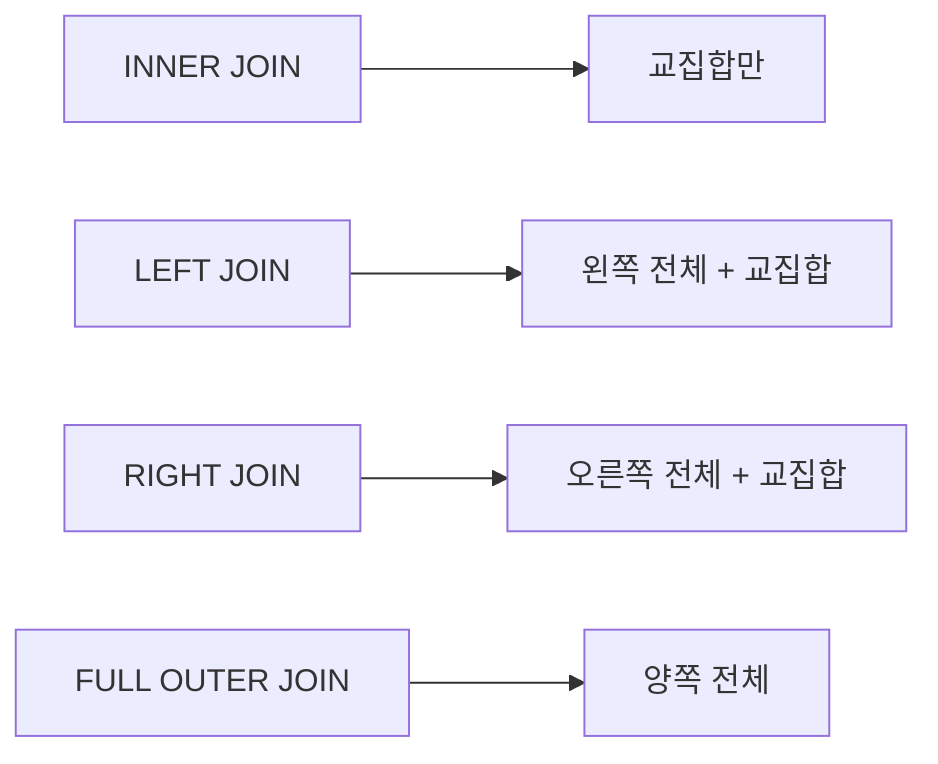

## 전체 흐름 요약

SQL (Structured Query Language)은 관계형 데이터베이스에서 데이터를 관리하고 조작하기 위한 표준 언어입니다. 본 문서에서는 SQL의 기본 개념부터 실전에서 활용할 수 있는 다양한 기법까지 단계별로 학습합니다.

먼저 SQL의 정의와 데이터 타입을 이해한 후, 데이터베이스 구조를 정의하는 DDL (Data Definition Language) 명령어를 학습합니다. 이어서 데이터를 조작하는 DML (Data Manipulation Language) 명령어와 다양한 연산자, 함수를 익힙니다.

중급 단계에서는 데이터 정렬, 그룹화, 여러 테이블을 연결하는 조인(Join) 기법을 학습하고, 고급 단계에서는 서브쿼리와 뷰(View)를 활용한 효율적인 데이터 관리 방법을 익힙니다.

각 개념마다 실제 실행 가능한 SQL 예제를 제공하여, 문서만으로도 완전히 따라하며 학습할 수 있도록 구성하였습니다.

---

## 1. SQL 기본 개념

### 1.1 SQL이란?

**SQL (Structured Query Language)**은 관계형 데이터베이스 관리 시스템(RDBMS)에서 데이터를 정의하고 조작하기 위한 표준 질의 언어입니다.

**SQL의 주요 특징:**
- **선언적 언어**: 원하는 결과를 명시하면 DBMS가 최적의 방법으로 실행
- **표준화**: ANSI/ISO 표준을 따르며, 다양한 DBMS에서 호환 가능
- **대소문자 구분 없음**: 명령어는 대소문자를 구분하지 않음 (데이터는 구분할 수 있음)

### 1.2 SQL의 분류

SQL 명령어는 기능에 따라 다음과 같이 분류됩니다:

| 분류 | 영문 | 설명 | 주요 명령어 |
|------|------|------|-------------|
| DDL | Data Definition Language | 데이터 정의 언어 - 데이터베이스 구조 정의 | CREATE, ALTER, DROP, TRUNCATE |
| DML | Data Manipulation Language | 데이터 조작 언어 - 데이터 검색 및 수정 | SELECT, INSERT, UPDATE, DELETE |
| DCL | Data Control Language | 데이터 제어 언어 - 권한 및 트랜잭션 제어 | GRANT, REVOKE, COMMIT, ROLLBACK |

---

## 2. 데이터 타입

MariaDB/MySQL에서 지원하는 주요 데이터 타입을 이해하는 것은 테이블 설계의 기본입니다.

### 2.1 숫자형 데이터 타입

| 타입 | 크기 | 범위 | 용도 |
|------|------|------|------|
| TINYINT | 1바이트 | -128 ~ 127 | 매우 작은 정수 |
| SMALLINT | 2바이트 | -32,768 ~ 32,767 | 작은 정수 |
| MEDIUMINT | 3바이트 | -8,388,608 ~ 8,388,607 | 중간 크기 정수 |
| INT | 4바이트 | -2,147,483,648 ~ 2,147,483,647 | 일반적인 정수 |
| BIGINT | 8바이트 | 매우 큰 범위 | 큰 정수 |
| FLOAT | 4바이트 | 단정밀도 부동소수점 | 실수 (정밀도 낮음) |
| DOUBLE | 8바이트 | 배정밀도 부동소수점 | 실수 (정밀도 높음) |
| DECIMAL(M,D) | 가변 | 고정 소수점 | 정확한 소수 표현 (금액 등) |

**예제:**
```sql
CREATE TABLE product (
    id INT,
    price DECIMAL(10,2),  -- 전체 10자리, 소수점 이하 2자리
    stock SMALLINT,
    rating FLOAT
);
```

### 2.2 문자형 데이터 타입

| 타입 | 최대 길이 | 특징 | 용도 |
|------|-----------|------|------|
| CHAR(M) | 255자 | 고정 길이 | 길이가 일정한 데이터 (예: 주민번호) |
| VARCHAR(M) | 65,535자 | 가변 길이 | 길이가 가변적인 데이터 (예: 이름, 주소) |
| TEXT | 65,535자 | 긴 텍스트 | 본문, 설명 등 |
| MEDIUMTEXT | 16MB | 매우 긴 텍스트 | 긴 문서 |
| LONGTEXT | 4GB | 초대형 텍스트 | 초대용량 텍스트 |

**CHAR vs VARCHAR 비교:**

```sql
-- CHAR: 고정 길이
name CHAR(10)  -- 'Kim' 입력 시 'Kim       ' (7칸 공백 추가)

-- VARCHAR: 가변 길이
name VARCHAR(10)  -- 'Kim' 입력 시 'Kim' (실제 길이만 사용)
```

### 2.3 날짜 및 시간 데이터 타입

| 타입 | 형식 | 범위 | 예제 |
|------|------|------|------|
| DATE | YYYY-MM-DD | 1000-01-01 ~ 9999-12-31 | 2025-01-04 |
| TIME | HH:MM:SS | -838:59:59 ~ 838:59:59 | 14:30:00 |
| DATETIME | YYYY-MM-DD HH:MM:SS | 1000-01-01 ~ 9999-12-31 | 2025-01-04 14:30:00 |
| TIMESTAMP | YYYY-MM-DD HH:MM:SS | 1970-01-01 ~ 2038-01-19 | 자동 업데이트 가능 |
| YEAR | YYYY | 1901 ~ 2155 | 2025 |

**예제:**
```sql
CREATE TABLE events (
    id INT PRIMARY KEY,
    event_date DATE,
    event_time TIME,
    created_at DATETIME DEFAULT CURRENT_TIMESTAMP,
    updated_at TIMESTAMP DEFAULT CURRENT_TIMESTAMP ON UPDATE CURRENT_TIMESTAMP
);
```

---

## 3. DDL (Data Definition Language)

DDL은 데이터베이스와 테이블의 구조를 정의하는 명령어입니다.

### 3.1 CREATE - 생성

#### 데이터베이스 생성

```sql
-- 데이터베이스 생성
CREATE DATABASE company;

-- 데이터베이스 생성 (이미 존재하면 무시)
CREATE DATABASE IF NOT EXISTS company;

-- 문자 집합 지정하여 생성
CREATE DATABASE company CHARACTER SET utf8mb4 COLLATE utf8mb4_unicode_ci;
```

#### 테이블 생성

**기본 문법:**
```sql
CREATE TABLE 테이블명 (
    컬럼명1 데이터타입 [제약조건],
    컬럼명2 데이터타입 [제약조건],
    ...
);
```

**실전 예제:**
```sql
CREATE TABLE employee (
    emp_id INT PRIMARY KEY AUTO_INCREMENT,
    name VARCHAR(50) NOT NULL,
    email VARCHAR(100) UNIQUE,
    department VARCHAR(50),
    salary DECIMAL(10,2),
    hire_date DATE,
    phone CHAR(13),
    age INT CHECK (age >= 18)
);
```

**제약조건 설명:**
- `PRIMARY KEY`: 기본키 (중복 불가, NULL 불가)
- `AUTO_INCREMENT`: 자동 증가 (숫자형 컬럼)
- `NOT NULL`: NULL 값 허용 안 함
- `UNIQUE`: 중복 값 허용 안 함
- `CHECK`: 조건 검사
- `DEFAULT`: 기본값 설정

**외래키가 포함된 테이블:**
```sql
-- 부서 테이블
CREATE TABLE department (
    dept_id INT PRIMARY KEY,
    dept_name VARCHAR(50) NOT NULL
);

-- 직원 테이블 (외래키 포함)
CREATE TABLE employee (
    emp_id INT PRIMARY KEY,
    name VARCHAR(50) NOT NULL,
    dept_id INT,
    FOREIGN KEY (dept_id) REFERENCES department(dept_id)
        ON DELETE CASCADE
        ON UPDATE CASCADE
);
```

**외래키 옵션:**
- `ON DELETE CASCADE`: 부모 레코드 삭제 시 자식 레코드도 삭제
- `ON DELETE SET NULL`: 부모 레코드 삭제 시 자식의 외래키를 NULL로 설정
- `ON UPDATE CASCADE`: 부모 키 값 변경 시 자식의 외래키도 변경

### 3.2 ALTER - 수정

기존 테이블의 구조를 변경하는 명령어입니다.

#### 컬럼 추가

```sql
-- 컬럼 추가
ALTER TABLE employee ADD COLUMN address VARCHAR(200);

-- 특정 위치에 컬럼 추가 (첫 번째)
ALTER TABLE employee ADD COLUMN emp_code VARCHAR(10) FIRST;

-- 특정 컬럼 뒤에 추가
ALTER TABLE employee ADD COLUMN birth_date DATE AFTER name;
```

#### 컬럼 수정

```sql
-- 컬럼 데이터 타입 변경
ALTER TABLE employee MODIFY COLUMN name VARCHAR(100);

-- 컬럼 이름 및 타입 변경
ALTER TABLE employee CHANGE COLUMN phone phone_number VARCHAR(20);

-- 컬럼 기본값 설정
ALTER TABLE employee ALTER COLUMN department SET DEFAULT 'General';

-- 컬럼 기본값 제거
ALTER TABLE employee ALTER COLUMN department DROP DEFAULT;
```

#### 컬럼 삭제

```sql
-- 컬럼 삭제
ALTER TABLE employee DROP COLUMN address;
```

#### 제약조건 추가/삭제

```sql
-- 기본키 추가
ALTER TABLE employee ADD PRIMARY KEY (emp_id);

-- 외래키 추가
ALTER TABLE employee
ADD CONSTRAINT fk_dept
FOREIGN KEY (dept_id) REFERENCES department(dept_id);

-- 외래키 삭제
ALTER TABLE employee DROP FOREIGN KEY fk_dept;
```

### 3.3 DROP - 삭제

데이터베이스나 테이블을 완전히 삭제합니다.

```sql
-- 테이블 삭제
DROP TABLE employee;

-- 테이블 존재 시에만 삭제
DROP TABLE IF EXISTS employee;

-- 데이터베이스 삭제
DROP DATABASE company;

-- 데이터베이스 존재 시에만 삭제
DROP DATABASE IF EXISTS company;
```

### 3.4 TRUNCATE - 테이블 초기화

테이블의 모든 데이터를 삭제하지만 구조는 유지합니다.

```sql
-- 테이블 데이터 전체 삭제 (구조는 유지)
TRUNCATE TABLE employee;
```

**TRUNCATE vs DELETE 비교:**

| 구분 | TRUNCATE | DELETE |
|------|----------|--------|
| 속도 | 빠름 | 느림 |
| WHERE 조건 | 불가능 | 가능 |
| 롤백 | 불가능 (일부 DBMS) | 가능 |
| AUTO_INCREMENT | 초기화됨 | 유지됨 |
| 트리거 발동 | 안 됨 | 됨 |

---

## 4. DML (Data Manipulation Language)

DML은 데이터를 조회, 삽입, 수정, 삭제하는 명령어입니다.

### 4.1 INSERT - 데이터 삽입

#### 기본 삽입

```sql
-- 모든 컬럼에 값 입력
INSERT INTO employee
VALUES (1, 'Kim Cheol-su', 'kim@company.com', 'Sales', 3500000, '2020-01-15', '010-1234-5678', 30);

-- 특정 컬럼만 입력
INSERT INTO employee (name, email, department, hire_date)
VALUES ('Lee Young-hee', 'lee@company.com', 'Marketing', '2021-03-10');

-- 여러 행 동시 삽입
INSERT INTO employee (name, department, salary) VALUES
('Park Min-su', 'IT', 4000000),
('Choi Ji-eun', 'HR', 3200000),
('Jung Tae-ho', 'Sales', 3500000);
```

#### 다른 테이블에서 데이터 복사

```sql
-- SELECT 결과를 다른 테이블에 삽입
INSERT INTO employee_backup
SELECT * FROM employee WHERE department = 'Sales';
```

### 4.2 SELECT - 데이터 조회

#### 기본 조회

```sql
-- 전체 컬럼 조회
SELECT * FROM employee;

-- 특정 컬럼만 조회
SELECT name, department, salary FROM employee;

-- 별칭(Alias) 사용
SELECT name AS '이름', salary AS '급여' FROM employee;

-- 중복 제거
SELECT DISTINCT department FROM employee;
```

#### WHERE 절 - 조건 검색

```sql
-- 단일 조건
SELECT * FROM employee WHERE department = 'Sales';

-- 범위 조건
SELECT * FROM employee WHERE salary >= 3000000 AND salary <= 5000000;

-- BETWEEN 사용
SELECT * FROM employee WHERE salary BETWEEN 3000000 AND 5000000;

-- IN 사용
SELECT * FROM employee WHERE department IN ('Sales', 'IT', 'Marketing');

-- LIKE 사용 (패턴 검색)
SELECT * FROM employee WHERE name LIKE 'Kim%';     -- Kim으로 시작
SELECT * FROM employee WHERE name LIKE '%su';      -- su로 끝남
SELECT * FROM employee WHERE name LIKE '%Young%';  -- Young 포함
SELECT * FROM employee WHERE email LIKE '___@%';   -- 3글자@로 시작

-- NULL 검색
SELECT * FROM employee WHERE phone IS NULL;
SELECT * FROM employee WHERE phone IS NOT NULL;
```

**LIKE 패턴 문자:**
- `%`: 0개 이상의 문자
- `_`: 정확히 1개의 문자

### 4.3 UPDATE - 데이터 수정

```sql
-- 전체 행 수정 (주의!)
UPDATE employee SET salary = salary * 1.1;

-- 조건부 수정
UPDATE employee
SET salary = salary * 1.1
WHERE department = 'Sales';

-- 여러 컬럼 동시 수정
UPDATE employee
SET department = 'IT', salary = 4500000
WHERE emp_id = 1;

-- 다른 테이블 값 참조하여 수정
UPDATE employee e
SET e.salary = (SELECT AVG(salary) FROM employee WHERE department = e.department)
WHERE e.salary < 3000000;
```

**주의사항:**
- WHERE 절이 없으면 모든 행이 수정됩니다
- 수정 전 SELECT로 대상 확인을 권장합니다

### 4.4 DELETE - 데이터 삭제

```sql
-- 조건부 삭제
DELETE FROM employee WHERE emp_id = 5;

-- 여러 조건으로 삭제
DELETE FROM employee
WHERE department = 'Sales' AND salary < 3000000;

-- 전체 삭제 (주의!)
DELETE FROM employee;
```

**주의사항:**
- WHERE 절이 없으면 모든 행이 삭제됩니다
- 삭제 전 SELECT로 대상 확인을 권장합니다
- 복구가 필요하면 TRUNCATE 대신 DELETE 사용

---

## 5. 연산자

SQL에서 다양한 연산을 수행하기 위한 연산자를 알아봅니다.

### 5.1 산술 연산자

| 연산자 | 설명 | 예제 |
|--------|------|------|
| + | 덧셈 | `SELECT salary + 500000 FROM employee` |
| - | 뺄셈 | `SELECT salary - 100000 FROM employee` |
| * | 곱셈 | `SELECT salary * 1.1 FROM employee` |
| / | 나눗셈 | `SELECT salary / 12 AS monthly_salary FROM employee` |
| % (MOD) | 나머지 | `SELECT emp_id % 2 FROM employee` |

**예제:**
```sql
-- 월급 계산 (연봉 / 12)
SELECT name, salary, salary / 12 AS monthly_salary FROM employee;

-- 급여 10% 인상 시뮬레이션
SELECT name, salary, salary * 1.1 AS increased_salary FROM employee;
```

### 5.2 비교 연산자

| 연산자 | 설명 | 예제 |
|--------|------|------|
| = | 같음 | `WHERE salary = 3500000` |
| != 또는 <> | 같지 않음 | `WHERE department != 'Sales'` |
| > | 크다 | `WHERE salary > 4000000` |
| < | 작다 | `WHERE age < 30` |
| >= | 크거나 같다 | `WHERE salary >= 3000000` |
| <= | 작거나 같다 | `WHERE age <= 40` |

### 5.3 논리 연산자

| 연산자 | 설명 | 예제 |
|--------|------|------|
| AND | 모든 조건 참 | `WHERE salary > 3000000 AND department = 'IT'` |
| OR | 하나 이상 조건 참 | `WHERE department = 'Sales' OR department = 'IT'` |
| NOT | 조건 부정 | `WHERE NOT department = 'HR'` |

**예제:**
```sql
-- 복합 조건
SELECT * FROM employee
WHERE (department = 'Sales' OR department = 'IT')
  AND salary >= 3500000;

-- NOT 사용
SELECT * FROM employee
WHERE NOT (department = 'HR' OR department = 'Admin');
```

### 5.4 기타 연산자

```sql
-- BETWEEN: 범위 검색
SELECT * FROM employee WHERE salary BETWEEN 3000000 AND 4000000;

-- IN: 목록 중 하나
SELECT * FROM employee WHERE department IN ('Sales', 'IT', 'Marketing');

-- IS NULL: NULL 검사
SELECT * FROM employee WHERE phone IS NULL;

-- LIKE: 패턴 매칭
SELECT * FROM employee WHERE name LIKE 'Kim%';
```

---

## 6. 함수

SQL에서 제공하는 다양한 내장 함수를 활용하여 데이터를 처리합니다.

### 6.1 집계 함수

집계 함수는 여러 행의 데이터를 하나의 결과로 반환합니다.

| 함수 | 설명 | 예제 |
|------|------|------|
| COUNT() | 행 개수 | `SELECT COUNT(*) FROM employee` |
| SUM() | 합계 | `SELECT SUM(salary) FROM employee` |
| AVG() | 평균 | `SELECT AVG(salary) FROM employee` |
| MAX() | 최대값 | `SELECT MAX(salary) FROM employee` |
| MIN() | 최소값 | `SELECT MIN(salary) FROM employee` |

**예제:**
```sql
-- 전체 직원 수
SELECT COUNT(*) AS total_employees FROM employee;

-- NULL이 아닌 전화번호 개수
SELECT COUNT(phone) FROM employee;

-- 부서별 평균 급여
SELECT department, AVG(salary) AS avg_salary
FROM employee
GROUP BY department;

-- 최고 급여와 최저 급여
SELECT MAX(salary) AS max_salary, MIN(salary) AS min_salary
FROM employee;

-- 전체 급여 합계
SELECT SUM(salary) AS total_salary FROM employee;
```

### 6.2 문자열 함수

| 함수 | 설명 | 예제 |
|------|------|------|
| CONCAT() | 문자열 연결 | `CONCAT(name, ' (', department, ')')` |
| LENGTH() | 문자열 길이 | `LENGTH(name)` |
| SUBSTRING() | 부분 문자열 추출 | `SUBSTRING(name, 1, 3)` |
| UPPER() | 대문자 변환 | `UPPER(name)` |
| LOWER() | 소문자 변환 | `LOWER(email)` |
| TRIM() | 공백 제거 | `TRIM(name)` |
| REPLACE() | 문자열 치환 | `REPLACE(phone, '-', '')` |

**예제:**
```sql
-- 이름과 부서 연결
SELECT CONCAT(name, ' - ', department) AS employee_info FROM employee;

-- 이메일 도메인 추출
SELECT name, SUBSTRING(email, LOCATE('@', email) + 1) AS domain
FROM employee;

-- 전화번호에서 하이픈 제거
SELECT name, REPLACE(phone, '-', '') AS phone_no_hyphen FROM employee;

-- 이름 대문자 변환
SELECT UPPER(name) AS upper_name FROM employee;
```

### 6.3 날짜 함수

| 함수 | 설명 | 예제 |
|------|------|------|
| NOW() | 현재 날짜와 시간 | `SELECT NOW()` |
| CURDATE() | 현재 날짜 | `SELECT CURDATE()` |
| CURTIME() | 현재 시간 | `SELECT CURTIME()` |
| DATE() | 날짜 부분 추출 | `DATE(NOW())` |
| YEAR() | 연도 추출 | `YEAR(hire_date)` |
| MONTH() | 월 추출 | `MONTH(hire_date)` |
| DAY() | 일 추출 | `DAY(hire_date)` |
| DATEDIFF() | 날짜 차이 | `DATEDIFF(NOW(), hire_date)` |
| DATE_ADD() | 날짜 더하기 | `DATE_ADD(NOW(), INTERVAL 7 DAY)` |
| DATE_FORMAT() | 날짜 형식 변환 | `DATE_FORMAT(NOW(), '%Y-%m-%d')` |

**예제:**
```sql
-- 근무 일수 계산
SELECT name, hire_date, DATEDIFF(CURDATE(), hire_date) AS work_days
FROM employee;

-- 근무 연수 계산
SELECT name, hire_date,
       YEAR(CURDATE()) - YEAR(hire_date) AS work_years
FROM employee;

-- 입사 연도별 직원 수
SELECT YEAR(hire_date) AS hire_year, COUNT(*) AS count
FROM employee
GROUP BY hire_year;

-- 날짜 형식 변환
SELECT name, DATE_FORMAT(hire_date, '%Y년 %m월 %d일') AS formatted_date
FROM employee;

-- 7일 후 날짜
SELECT DATE_ADD(CURDATE(), INTERVAL 7 DAY) AS next_week;
```

### 6.4 수학 함수

| 함수 | 설명 | 예제 |
|------|------|------|
| ROUND() | 반올림 | `ROUND(salary / 12, 2)` |
| CEIL() | 올림 | `CEIL(3.2)` → 4 |
| FLOOR() | 내림 | `FLOOR(3.8)` → 3 |
| ABS() | 절대값 | `ABS(-10)` → 10 |
| POWER() | 거듭제곱 | `POWER(2, 3)` → 8 |
| SQRT() | 제곱근 | `SQRT(16)` → 4 |

**예제:**
```sql
-- 월급 계산 (소수점 둘째 자리 반올림)
SELECT name, ROUND(salary / 12, 2) AS monthly_salary FROM employee;

-- 급여 천 단위 내림
SELECT name, FLOOR(salary / 1000) * 1000 AS rounded_salary FROM employee;
```

### 6.5 조건 함수

```sql
-- IF(조건, 참일 때 값, 거짓일 때 값)
SELECT name, salary,
       IF(salary >= 4000000, 'High', 'Normal') AS salary_level
FROM employee;

-- CASE WHEN (다중 조건)
SELECT name, salary,
       CASE
           WHEN salary >= 5000000 THEN 'High'
           WHEN salary >= 3500000 THEN 'Medium'
           ELSE 'Low'
       END AS salary_grade
FROM employee;

-- IFNULL(값, NULL일 때 대체값)
SELECT name, IFNULL(phone, 'No Phone') AS phone FROM employee;

-- COALESCE(값1, 값2, ...) - 첫 번째 NULL이 아닌 값 반환
SELECT name, COALESCE(phone, email, 'No Contact') AS contact FROM employee;
```

---

## 7. ORDER BY - 정렬

검색 결과를 특정 컬럼 기준으로 정렬합니다.

### 7.1 기본 정렬

```sql
-- 오름차순 정렬 (ASC는 생략 가능)
SELECT * FROM employee ORDER BY salary;
SELECT * FROM employee ORDER BY salary ASC;

-- 내림차순 정렬
SELECT * FROM employee ORDER BY salary DESC;

-- 문자열 정렬
SELECT * FROM employee ORDER BY name;  -- 가나다순
```

### 7.2 다중 컬럼 정렬

```sql
-- 부서별 오름차순, 같은 부서 내에서 급여 내림차순
SELECT * FROM employee
ORDER BY department ASC, salary DESC;

-- 3단계 정렬
SELECT * FROM employee
ORDER BY department, hire_date DESC, name;
```

### 7.3 표현식 정렬

```sql
-- 계산된 값으로 정렬
SELECT name, salary, salary * 12 AS annual_salary
FROM employee
ORDER BY annual_salary DESC;

-- 문자열 길이로 정렬
SELECT name FROM employee ORDER BY LENGTH(name);

-- 조건 함수 결과로 정렬
SELECT name, salary,
       CASE
           WHEN salary >= 4000000 THEN 1
           WHEN salary >= 3000000 THEN 2
           ELSE 3
       END AS priority
FROM employee
ORDER BY priority;
```

---

## 8. GROUP BY - 그룹화

특정 컬럼을 기준으로 데이터를 그룹화하여 집계합니다.

### 8.1 기본 그룹화

```sql
-- 부서별 직원 수
SELECT department, COUNT(*) AS employee_count
FROM employee
GROUP BY department;

-- 부서별 평균 급여
SELECT department, AVG(salary) AS avg_salary
FROM employee
GROUP BY department;

-- 부서별 최고/최저 급여
SELECT department,
       MAX(salary) AS max_salary,
       MIN(salary) AS min_salary
FROM employee
GROUP BY department;
```

### 8.2 HAVING - 그룹 조건

HAVING은 GROUP BY로 그룹화한 결과에 조건을 적용합니다.

**WHERE vs HAVING:**
- `WHERE`: 그룹화 전 개별 행에 조건 적용
- `HAVING`: 그룹화 후 그룹에 조건 적용

```sql
-- 직원 수가 3명 이상인 부서만
SELECT department, COUNT(*) AS count
FROM employee
GROUP BY department
HAVING count >= 3;

-- 평균 급여가 350만원 이상인 부서
SELECT department, AVG(salary) AS avg_salary
FROM employee
GROUP BY department
HAVING avg_salary >= 3500000;

-- WHERE와 HAVING 함께 사용
SELECT department, AVG(salary) AS avg_salary
FROM employee
WHERE hire_date >= '2020-01-01'  -- 2020년 이후 입사자만
GROUP BY department
HAVING avg_salary >= 3500000     -- 평균 급여 350만원 이상
ORDER BY avg_salary DESC;
```

### 8.3 다중 컬럼 그룹화

```sql
-- 부서별, 입사연도별 직원 수
SELECT department, YEAR(hire_date) AS hire_year, COUNT(*) AS count
FROM employee
GROUP BY department, hire_year;

-- 부서별, 급여 등급별 인원
SELECT department,
       CASE
           WHEN salary >= 4000000 THEN 'High'
           WHEN salary >= 3000000 THEN 'Medium'
           ELSE 'Low'
       END AS salary_grade,
       COUNT(*) AS count
FROM employee
GROUP BY department, salary_grade;
```

### 8.4 WITH ROLLUP - 소계/합계

```sql
-- 부서별 급여 합계 + 전체 합계
SELECT department, SUM(salary) AS total_salary
FROM employee
GROUP BY department WITH ROLLUP;

-- 다중 컬럼 ROLLUP
SELECT department, YEAR(hire_date) AS hire_year, COUNT(*) AS count
FROM employee
GROUP BY department, hire_year WITH ROLLUP;
```

---

## 9. JOIN - 테이블 결합

여러 테이블의 데이터를 연결하여 조회합니다.

### 9.1 테이블 준비

다음 예제 테이블을 사용합니다:

```sql
-- 부서 테이블
CREATE TABLE department (
    dept_id INT PRIMARY KEY,
    dept_name VARCHAR(50)
);

INSERT INTO department VALUES
(1, 'Sales'),
(2, 'IT'),
(3, 'HR'),
(4, 'Marketing');

-- 직원 테이블
CREATE TABLE employee (
    emp_id INT PRIMARY KEY,
    name VARCHAR(50),
    dept_id INT,
    salary DECIMAL(10,2)
);

INSERT INTO employee VALUES
(101, 'Kim', 1, 3500000),
(102, 'Lee', 2, 4000000),
(103, 'Park', 1, 3200000),
(104, 'Choi', NULL, 3000000);  -- 부서 없음
```

### 9.2 INNER JOIN - 내부 조인

양쪽 테이블 모두에 일치하는 데이터만 반환합니다.

```sql
-- 기본 INNER JOIN
SELECT e.name, e.salary, d.dept_name
FROM employee e
INNER JOIN department d ON e.dept_id = d.dept_id;

-- WHERE 조건 추가
SELECT e.name, e.salary, d.dept_name
FROM employee e
INNER JOIN department d ON e.dept_id = d.dept_id
WHERE e.salary >= 3500000;
```

**결과:**
```
name | salary   | dept_name
-----|----------|----------
Kim  | 3500000  | Sales
Lee  | 4000000  | IT
Park | 3200000  | Sales
```

**참고:** Choi는 dept_id가 NULL이므로 결과에 포함되지 않습니다.

### 9.3 LEFT OUTER JOIN - 왼쪽 외부 조인

왼쪽 테이블의 모든 데이터를 포함하고, 오른쪽 테이블은 일치하는 데이터만 포함합니다.

```sql
-- LEFT JOIN (OUTER 생략 가능)
SELECT e.name, e.salary, d.dept_name
FROM employee e
LEFT JOIN department d ON e.dept_id = d.dept_id;
```

**결과:**
```
name  | salary   | dept_name
------|----------|----------
Kim   | 3500000  | Sales
Lee   | 4000000  | IT
Park  | 3200000  | Sales
Choi  | 3000000  | NULL      -- 부서 없는 직원도 포함
```

**활용 예제 - 부서가 없는 직원 찾기:**
```sql
SELECT e.name
FROM employee e
LEFT JOIN department d ON e.dept_id = d.dept_id
WHERE d.dept_id IS NULL;
```

### 9.4 RIGHT OUTER JOIN - 오른쪽 외부 조인

오른쪽 테이블의 모든 데이터를 포함합니다.

```sql
-- RIGHT JOIN
SELECT e.name, d.dept_name
FROM employee e
RIGHT JOIN department d ON e.dept_id = d.dept_id;
```

**결과:**
```
name  | dept_name
------|----------
Kim   | Sales
Park  | Sales
Lee   | IT
NULL  | HR          -- 직원이 없는 부서도 포함
NULL  | Marketing
```

**활용 예제 - 직원이 없는 부서 찾기:**
```sql
SELECT d.dept_name
FROM employee e
RIGHT JOIN department d ON e.dept_id = d.dept_id
WHERE e.emp_id IS NULL;
```

### 9.5 FULL OUTER JOIN - 완전 외부 조인

양쪽 테이블의 모든 데이터를 포함합니다. (MariaDB/MySQL은 직접 지원하지 않아 UNION으로 구현)

```sql
-- FULL OUTER JOIN (UNION으로 구현)
SELECT e.name, d.dept_name
FROM employee e
LEFT JOIN department d ON e.dept_id = d.dept_id

UNION

SELECT e.name, d.dept_name
FROM employee e
RIGHT JOIN department d ON e.dept_id = d.dept_id;
```

### 9.6 SELF JOIN - 자기 자신 조인

같은 테이블을 두 번 참조하여 조인합니다.

```sql
-- 직원과 상사 관계 테이블
CREATE TABLE employee_hierarchy (
    emp_id INT PRIMARY KEY,
    name VARCHAR(50),
    manager_id INT
);

-- SELF JOIN으로 직원과 상사 이름 조회
SELECT e.name AS employee_name, m.name AS manager_name
FROM employee_hierarchy e
LEFT JOIN employee_hierarchy m ON e.manager_id = m.emp_id;
```

### 9.7 다중 테이블 JOIN

```sql
-- 3개 테이블 조인
CREATE TABLE project (
    project_id INT PRIMARY KEY,
    project_name VARCHAR(50),
    emp_id INT
);

SELECT e.name AS employee, d.dept_name AS department, p.project_name AS project
FROM employee e
INNER JOIN department d ON e.dept_id = d.dept_id
INNER JOIN project p ON e.emp_id = p.emp_id;
```

### 9.8 JOIN 시각화



---

## 10. 서브쿼리 (Subquery)

쿼리 안에 포함된 또 다른 쿼리를 서브쿼리라고 합니다.

### 10.1 단일 행 서브쿼리

서브쿼리가 하나의 값만 반환하는 경우입니다.

```sql
-- 평균 급여보다 높은 직원
SELECT name, salary
FROM employee
WHERE salary > (SELECT AVG(salary) FROM employee);

-- 최고 급여를 받는 직원
SELECT name, salary
FROM employee
WHERE salary = (SELECT MAX(salary) FROM employee);

-- 특정 부서의 평균 급여보다 높은 급여를 받는 모든 직원
SELECT name, salary
FROM employee
WHERE salary > (SELECT AVG(salary) FROM employee WHERE department = 'Sales');
```

### 10.2 다중 행 서브쿼리

서브쿼리가 여러 값을 반환하는 경우입니다.

**IN 연산자:**
```sql
-- Sales 또는 IT 부서 직원
SELECT name FROM employee
WHERE dept_id IN (SELECT dept_id FROM department WHERE dept_name IN ('Sales', 'IT'));
```

**ANY/SOME 연산자:**
```sql
-- Sales 부서의 어떤 직원보다 급여가 높은 직원
SELECT name, salary
FROM employee
WHERE salary > ANY (SELECT salary FROM employee WHERE department = 'Sales');
```

**ALL 연산자:**
```sql
-- Sales 부서의 모든 직원보다 급여가 높은 직원
SELECT name, salary
FROM employee
WHERE salary > ALL (SELECT salary FROM employee WHERE department = 'Sales');
```

### 10.3 인라인 뷰 (FROM 절 서브쿼리)

FROM 절에 서브쿼리를 사용하여 임시 테이블처럼 활용합니다.

```sql
-- 부서별 평균 급여 테이블을 만들고 조인
SELECT e.department, e.name, e.salary, dept_avg.avg_salary
FROM employee e
INNER JOIN (
    SELECT department, AVG(salary) AS avg_salary
    FROM employee
    GROUP BY department
) dept_avg ON e.department = dept_avg.department
WHERE e.salary >= dept_avg.avg_salary;
```

### 10.4 스칼라 서브쿼리 (SELECT 절 서브쿼리)

SELECT 절에 서브쿼리를 사용합니다.

```sql
-- 각 직원의 급여와 전체 평균 급여 비교
SELECT name,
       salary,
       (SELECT AVG(salary) FROM employee) AS avg_salary,
       salary - (SELECT AVG(salary) FROM employee) AS diff
FROM employee;

-- 각 직원이 속한 부서의 평균 급여
SELECT e.name,
       e.salary,
       (SELECT AVG(salary) FROM employee WHERE department = e.department) AS dept_avg
FROM employee e;
```

### 10.5 상관 서브쿼리

외부 쿼리의 값을 서브쿼리에서 참조하는 경우입니다.

```sql
-- 자신이 속한 부서의 평균 급여보다 높은 급여를 받는 직원
SELECT e1.name, e1.department, e1.salary
FROM employee e1
WHERE e1.salary > (
    SELECT AVG(e2.salary)
    FROM employee e2
    WHERE e2.department = e1.department
);
```

### 10.6 EXISTS 연산자

서브쿼리 결과가 존재하는지 확인합니다.

```sql
-- 직원이 있는 부서만 조회
SELECT dept_name
FROM department d
WHERE EXISTS (
    SELECT 1 FROM employee e WHERE e.dept_id = d.dept_id
);

-- 직원이 없는 부서 조회
SELECT dept_name
FROM department d
WHERE NOT EXISTS (
    SELECT 1 FROM employee e WHERE e.dept_id = d.dept_id
);
```

---

## 11. VIEW - 뷰

뷰(View)는 하나 이상의 테이블에서 유도된 가상 테이블입니다.

### 11.1 뷰의 개념

**뷰의 특징:**
- 실제 데이터를 저장하지 않음 (가상 테이블)
- 복잡한 쿼리를 단순화
- 보안 강화 (특정 컬럼만 노출)
- 데이터 독립성 제공

**뷰 vs 테이블:**

| 구분 | 뷰 (View) | 테이블 (Table) |
|------|-----------|----------------|
| 데이터 저장 | 저장 안 함 | 실제 저장 |
| 공간 사용 | 최소 | 실제 데이터 크기 |
| 속도 | 느림 (쿼리 실행) | 빠름 |
| 용도 | 조회 위주 | 모든 작업 |

### 11.2 뷰 생성

```sql
-- 기본 뷰 생성
CREATE VIEW employee_view AS
SELECT name, department, salary FROM employee;

-- 조건이 포함된 뷰
CREATE VIEW high_salary_view AS
SELECT name, department, salary
FROM employee
WHERE salary >= 4000000;

-- 조인을 포함한 뷰
CREATE VIEW employee_dept_view AS
SELECT e.name, e.salary, d.dept_name
FROM employee e
INNER JOIN department d ON e.dept_id = d.dept_id;

-- 집계 함수를 포함한 뷰
CREATE VIEW dept_salary_view AS
SELECT department,
       COUNT(*) AS emp_count,
       AVG(salary) AS avg_salary,
       SUM(salary) AS total_salary
FROM employee
GROUP BY department;
```

### 11.3 뷰 사용

뷰는 일반 테이블처럼 조회할 수 있습니다.

```sql
-- 뷰 조회
SELECT * FROM employee_view;

-- 뷰에 조건 추가
SELECT * FROM employee_view WHERE department = 'Sales';

-- 뷰 정렬
SELECT * FROM employee_dept_view ORDER BY salary DESC;
```

### 11.4 뷰 수정 및 삭제

```sql
-- 뷰 정의 변경 (OR REPLACE 사용)
CREATE OR REPLACE VIEW employee_view AS
SELECT name, department, salary, hire_date FROM employee;

-- 뷰 삭제
DROP VIEW employee_view;

-- 뷰가 존재하면 삭제
DROP VIEW IF EXISTS employee_view;
```

### 11.5 뷰를 통한 데이터 수정

특정 조건을 만족하면 뷰를 통해 데이터를 수정할 수 있습니다.

**수정 가능한 조건:**
- 단일 테이블로 구성
- 집계 함수 미사용
- DISTINCT, GROUP BY, HAVING 미사용
- UNION 미사용

```sql
-- 수정 가능한 뷰
CREATE VIEW simple_employee_view AS
SELECT emp_id, name, salary FROM employee;

-- 뷰를 통한 UPDATE
UPDATE simple_employee_view
SET salary = 4500000
WHERE emp_id = 101;

-- 뷰를 통한 INSERT
INSERT INTO simple_employee_view (emp_id, name, salary)
VALUES (105, 'Jung', 3800000);

-- 뷰를 통한 DELETE
DELETE FROM simple_employee_view WHERE emp_id = 105;
```

**주의사항:**
```sql
-- 수정 불가능한 뷰 (조인 포함)
CREATE VIEW complex_view AS
SELECT e.name, d.dept_name
FROM employee e
INNER JOIN department d ON e.dept_id = d.dept_id;

-- 아래 UPDATE는 오류 발생
-- UPDATE complex_view SET dept_name = 'New Dept' WHERE name = 'Kim';
```

### 11.6 WITH CHECK OPTION

뷰 생성 시 조건을 위반하는 데이터 수정을 방지합니다.

```sql
-- WITH CHECK OPTION 사용
CREATE VIEW high_salary_edit_view AS
SELECT emp_id, name, salary
FROM employee
WHERE salary >= 4000000
WITH CHECK OPTION;

-- 아래 UPDATE는 오류 발생 (급여가 400만원 미만이 되므로)
-- UPDATE high_salary_edit_view SET salary = 3000000 WHERE emp_id = 102;
```

### 11.7 뷰 활용 사례

```sql
-- 1. 보안: 민감한 정보 숨기기
CREATE VIEW public_employee_view AS
SELECT name, department
FROM employee;  -- 급여 정보 제외

-- 2. 복잡한 쿼리 단순화
CREATE VIEW employee_statistics AS
SELECT
    department,
    COUNT(*) AS total_employees,
    AVG(salary) AS avg_salary,
    MAX(salary) AS max_salary,
    MIN(salary) AS min_salary
FROM employee
GROUP BY department;

-- 뷰 사용
SELECT * FROM employee_statistics WHERE avg_salary > 3500000;

-- 3. 자주 사용하는 조인 저장
CREATE VIEW employee_full_info AS
SELECT
    e.emp_id,
    e.name,
    d.dept_name,
    e.salary,
    e.hire_date
FROM employee e
LEFT JOIN department d ON e.dept_id = d.dept_id;
```

---

## 주요 개념 요약표

| 구분 | 주요 개념 | 설명 |
|------|----------|------|
| **SQL 분류** | DDL | 데이터 정의 언어 (CREATE, ALTER, DROP, TRUNCATE) |
| | DML | 데이터 조작 언어 (SELECT, INSERT, UPDATE, DELETE) |
| | DCL | 데이터 제어 언어 (GRANT, REVOKE, COMMIT, ROLLBACK) |
| **데이터 타입** | 숫자형 | INT, BIGINT, DECIMAL, FLOAT, DOUBLE |
| | 문자형 | CHAR, VARCHAR, TEXT |
| | 날짜형 | DATE, TIME, DATETIME, TIMESTAMP |
| **제약조건** | PRIMARY KEY | 기본키 (중복 불가, NULL 불가) |
| | FOREIGN KEY | 외래키 (참조 무결성) |
| | NOT NULL | NULL 불가 |
| | UNIQUE | 중복 불가 |
| | CHECK | 조건 검사 |
| | DEFAULT | 기본값 |
| **함수** | 집계 함수 | COUNT, SUM, AVG, MAX, MIN |
| | 문자열 함수 | CONCAT, LENGTH, SUBSTRING, UPPER, LOWER |
| | 날짜 함수 | NOW, CURDATE, DATEDIFF, DATE_ADD, DATE_FORMAT |
| | 조건 함수 | IF, CASE WHEN, IFNULL, COALESCE |
| **정렬/그룹** | ORDER BY | 정렬 (ASC 오름차순, DESC 내림차순) |
| | GROUP BY | 그룹화 (집계 함수와 함께 사용) |
| | HAVING | 그룹 조건 (WHERE는 그룹화 전, HAVING은 그룹화 후) |
| **조인** | INNER JOIN | 양쪽 테이블 모두 일치하는 데이터 |
| | LEFT JOIN | 왼쪽 테이블 전체 + 일치 데이터 |
| | RIGHT JOIN | 오른쪽 테이블 전체 + 일치 데이터 |
| | FULL OUTER JOIN | 양쪽 테이블 전체 |
| | SELF JOIN | 자기 자신과 조인 |
| **서브쿼리** | 단일 행 | =, >, < 연산자 사용 |
| | 다중 행 | IN, ANY, ALL 연산자 사용 |
| | 인라인 뷰 | FROM 절에 서브쿼리 |
| | 스칼라 | SELECT 절에 서브쿼리 |
| | 상관 | 외부 쿼리 값 참조 |
| **뷰** | VIEW | 가상 테이블 (실제 데이터 저장 안 함) |
| | WITH CHECK OPTION | 뷰 조건 위반 방지 |

---

## 마무리

본 문서에서는 SQL의 기본 개념부터 실전 활용까지 체계적으로 학습하였습니다.

**핵심 내용 정리:**

1. **SQL 기초**: SQL은 관계형 데이터베이스를 다루는 표준 언어로, DDL/DML/DCL로 분류됩니다.

2. **데이터 타입**: 숫자형, 문자형, 날짜형 등 적절한 데이터 타입 선택이 데이터베이스 성능과 저장 효율성에 영향을 미칩니다.

3. **DDL**: CREATE, ALTER, DROP을 통해 데이터베이스와 테이블 구조를 정의하고 관리합니다.

4. **DML**: SELECT, INSERT, UPDATE, DELETE로 데이터를 조회하고 조작합니다.

5. **함수와 연산자**: 집계 함수, 문자열 함수, 날짜 함수, 조건 함수를 활용하여 복잡한 데이터 처리를 수행합니다.

6. **정렬과 그룹화**: ORDER BY로 결과를 정렬하고, GROUP BY와 HAVING으로 데이터를 그룹화하여 집계합니다.

7. **조인**: 여러 테이블의 데이터를 연결하여 의미 있는 정보를 추출합니다. INNER JOIN, LEFT JOIN, RIGHT JOIN 등의 차이를 이해하는 것이 중요합니다.

8. **서브쿼리**: 쿼리 안에 쿼리를 중첩하여 복잡한 조건을 처리합니다.

9. **뷰**: 복잡한 쿼리를 가상 테이블로 만들어 재사용성과 보안을 향상시킵니다.

**실무 활용 팁:**

- 복잡한 쿼리는 단계별로 나누어 작성하고 테스트합니다
- 대용량 데이터 수정/삭제 전 반드시 SELECT로 대상을 확인합니다
- 인덱스가 설정된 컬럼을 WHERE 절에 활용하면 검색 속도가 향상됩니다
- 조인 시 필요한 컬럼만 SELECT하여 성능을 최적화합니다
- 서브쿼리보다 JOIN이 성능이 좋은 경우가 많으므로 상황에 맞게 선택합니다

**다음 단계:**

본 문서에서 학습한 SQL 기본 문법을 바탕으로, 다음 Part 3에서는 고급 데이터베이스 기능을 학습합니다:
- 저장 프로시저 (Stored Procedure)
- 트리거 (Trigger)
- 커서 (Cursor)
- 인덱스 (Index)
- 트랜잭션 (Transaction)

실습을 통해 SQL 문법을 체득하고, 실무 프로젝트에 활용해 보시기 바랍니다.
