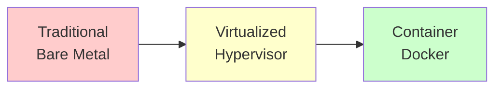
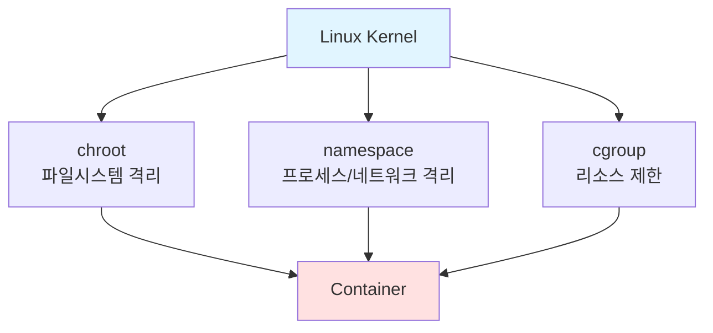

## 전체 흐름 요약

Docker는 애플리케이션을 컨테이너라는 격리된 환경에서 실행할 수 있게 해주는 오픈소스 플랫폼입니다. 전통적인 가상 머신(Virtual Machine)과 달리 컨테이너는 호스트 OS의 커널을 공유하여 더 가볍고 빠르게 동작합니다.

이 문서에서는 Virtual Machine과 Container의 차이점을 이해하고, Docker의 핵심 개념인 이미지와 컨테이너의 관계를 학습합니다. 또한 Linux 시스템에서 Docker를 설치하고 기본 설정을 확인하는 방법을 다룹니다.

Docker는 MSA(Micro Service Architecture)와 DevOps 환경에서 필수적인 기술로, 개발 환경과 운영 환경의 일관성을 보장하고 애플리케이션 배포를 간소화합니다.

---

## 1. Virtual Machine과 Container

### 1-1. 배포 방식의 진화

애플리케이션을 배포하는 방식은 시간이 지나면서 다음과 같이 발전해왔습니다.

#### Traditional Deployment (Bare Metal)
- 물리 서버에 직접 애플리케이션 설치
- 하나의 서버에서 여러 애플리케이션 실행 시 리소스 충돌 발생
- 확장성과 격리성 부족

#### Virtualized Deployment (Hypervisor)
- 하이퍼바이저를 통해 하나의 물리 서버에서 여러 개의 VM 실행
- 각 VM은 독립적인 Guest OS를 가짐
- 리소스 격리는 가능하지만 무겁고 느림

#### Container Deployment
- 호스트 OS의 커널을 공유하면서 애플리케이션을 격리
- VM보다 가볍고 빠른 시작 속도
- 일관된 실행 환경 제공



### 1-2. Virtual Machine vs Container

| 구분 | Virtual Machine | Container |
|------|----------------|-----------|
| **OS** | 각 VM마다 독립적인 Guest OS 필요 | 호스트 OS의 커널 공유 |
| **크기** | GB 단위 (OS 포함) | MB 단위 (애플리케이션만) |
| **시작 속도** | 수 분 (OS 부팅 필요) | 수 초 (프로세스 시작) |
| **리소스 사용** | 높음 (각 VM마다 OS 실행) | 낮음 (커널 공유) |
| **격리 수준** | 완전 격리 (하드웨어 가상화) | 프로세스 격리 (커널 기능) |
| **관리 도구** | VMware, VirtualBox, Hyper-V | Docker, Containerd |

#### Virtual Machine 구조
```
호스트 OS (Windows, Linux)
    ↓
Hypervisor (VMware, VirtualBox)
    ↓
[VM1: Guest OS + App] [VM2: Guest OS + App] [VM3: Guest OS + App]
```

**특징:**
- 호스트 OS 위에 **Hypervisor**를 설치
- Hypervisor 위에 **Guest OS**를 완전히 설치
- Guest OS 위에서 **Application** 실행
- 무겁고 자원을 많이 사용하지만 완전한 격리 제공

#### Container 구조
```
호스트 OS (Windows, Linux)
    ↓
Container Runtime (Docker)
    ↓
[Container1: App] [Container2: App] [Container3: App]
```

**특징:**
- 호스트 OS 위에 **Docker (Container Runtime)** 설치
- Docker 위에서 **Application**만 실행 (OS 불필요)
- 호스트 OS의 커널을 공유하여 사용
- 가볍고 빠르며 자원 효율적

### 1-3. 컨테이너의 핵심 기술

컨테이너는 리눅스 커널의 다음 기능들을 활용하여 동작합니다:

#### 1) chroot (독립된 공간 형성)
- 파일 시스템을 격리하여 독립적인 루트 디렉토리 제공
- 컨테이너마다 독립적인 파일 시스템 환경 구성

#### 2) namespace (isolate 기능 지원)
- 각 컨테이너가 독립된 공간을 가질 수 있도록 격리
- 프로세스, 네트워크, 마운트, 사용자 등을 격리

**주요 namespace 종류:**
- **PID namespace**: 프로세스 ID 격리
- **NET namespace**: 네트워크 인터페이스, IP 격리
- **MNT namespace**: 파일 시스템 마운트 포인트 격리
- **UTS namespace**: 호스트 이름, 도메인 격리
- **IPC namespace**: 프로세스 간 통신 격리
- **USER namespace**: 사용자 ID, 그룹 ID 격리

#### 3) cgroup (필요한 만큼 HW 할당)
- Control Groups의 약자
- 컨테이너가 사용할 수 있는 **리소스(CPU, 메모리, 디스크 I/O)를 제한**
- 특정 컨테이너가 과도한 리소스를 사용하는 것을 방지



---

## 2. Docker 개념

### 2-1. Docker란?

**Docker**는 리눅스 컨테이너를 기반으로 **특정 서비스를 패키징하고 배포**하는 오픈소스 프로그램입니다.

주요 특징:
- **경량화**: VM보다 훨씬 가볍고 빠름
- **이식성**: 어디서나 동일하게 실행 (개발 환경 = 운영 환경)
- **확장성**: Scale out/in이 용이함
- **버전 관리**: 이미지를 통한 버전 관리 가능
- **격리성**: 각 컨테이너는 독립적으로 실행

### 2-2. Docker 사용 시점

Docker(Container)는 다음과 같은 상황에서 적합합니다:

#### 1) 개발자 간 프로그램 공유의 편리성
- "내 컴퓨터에서는 되는데..."라는 문제 해결
- 개발 환경과 운영 환경의 일관성 보장
- 팀원 간 동일한 환경 공유 가능

#### 2) Scale out/in (확장/축소)
- 트래픽 증가 시 컨테이너를 쉽게 추가 (Scale out)
- 트래픽 감소 시 컨테이너를 쉽게 제거 (Scale in)
- MSA(Micro Service Architecture) 환경에 적합
- DevOps 환경에서 CI/CD 파이프라인 구축

### 2-3. MSA와 DevOps

#### MSA (Micro Service Architecture)
- **Application Service**를 작게 쪼개어 기능별로 만들어 서비스하는 것
- 각 서비스를 독립적으로 개발, 배포, 확장 가능
- 서비스 간 느슨한 결합(Loose Coupling)

**예시:**
```
Monolithic Application (단일 애플리케이션)
    ↓ 분해
MSA
├── 사용자 인증 서비스
├── 주문 처리 서비스
├── 결제 서비스
├── 배송 서비스
└── 알림 서비스
```

#### DevOps
- **Development**(개발)에서 **Operation**(운영)까지 이어지는 과정을 의미
- 개발과 운영의 경계를 허물고 협업을 강화
- 자동화된 배포 파이프라인 구축
- Docker는 DevOps의 핵심 도구


### 2-4. Windows/Mac에서 컨테이너 사용

**중요:** Windows와 Mac은 리눅스 커널(Kernel)이 없으므로 직접 Container를 운영할 수 없습니다.

#### 해결 방법
1. **Hypervisor**를 활용하여 Linux VM 생성
2. 그 위에 **Container**를 운영

```
Windows/Mac
    ↓
Hypervisor (Docker Desktop의 내장 Hypervisor)
    ↓
Linux VM (경량화된 Linux)
    ↓
Docker Container 운영
```

**따라서:**
- Windows/Mac에서는 무조건 **Linux 위에서 Container**를 사용
- Docker Desktop은 자동으로 경량화된 Linux VM을 생성하고 관리
- 사용자는 이를 의식하지 않고 Docker 명령어 사용 가능

---

## 3. Docker 설치

### 3-1. Docker 공식 설치 문서

Docker 설치는 공식 문서를 참고하는 것이 가장 안전합니다.

**공식 설치 가이드:**
- URL: [https://docs.docker.com/engine/install](https://docs.docker.com/engine/install)
- 각 OS별 설치 방법 상세 제공

### 3-2. Ubuntu에서 Docker 설치

#### 방법 1: APT 저장소를 이용한 설치 (권장)

**1) 기존 Docker 패키지 제거 (선택사항)**

```bash
sudo apt-get remove docker docker-engine docker.io containerd runc
```

**2) 필수 패키지 설치**

```bash
sudo apt-get update
sudo apt-get install -y \
    ca-certificates \
    curl \
    gnupg \
    lsb-release
```

**3) Docker 공식 GPG 키 추가**

```bash
sudo mkdir -m 0755 -p /etc/apt/keyrings
curl -fsSL https://download.docker.com/linux/ubuntu/gpg | sudo gpg --dearmor -o /etc/apt/keyrings/docker.gpg
```

**4) Docker 저장소 추가**

```bash
echo \
  "deb [arch=$(dpkg --print-architecture) signed-by=/etc/apt/keyrings/docker.gpg] https://download.docker.com/linux/ubuntu \
  $(lsb_release -cs) stable" | sudo tee /etc/apt/sources.list.d/docker.list > /dev/null
```

**5) Docker Engine 설치**

```bash
sudo apt-get update
sudo apt-get install -y docker-ce docker-ce-cli containerd.io docker-buildx-plugin docker-compose-plugin
```

#### 방법 2: 편리한 스크립트 사용 (테스트 환경)

Docker는 편의성을 위한 설치 스크립트를 제공합니다.

```bash
curl -fsSL https://get.docker.com -o get-docker.sh
sudo sh get-docker.sh
```

> **주의:** 이 방법은 개발/테스트 환경에서만 사용하고, 프로덕션 환경에서는 공식 저장소를 이용한 설치를 권장합니다.

### 3-3. Docker 서비스 시작 및 활성화

#### Docker 서비스 시작

```bash
sudo systemctl start docker
```

#### 부팅 시 자동 시작 설정

```bash
sudo systemctl enable docker
```

#### 시작과 활성화를 동시에

```bash
sudo systemctl enable --now docker.service
```

#### Docker 서비스 상태 확인

```bash
sudo systemctl status docker
```

**예상 출력:**
```
● docker.service - Docker Application Container Engine
     Loaded: loaded (/lib/systemd/system/docker.service; enabled; vendor preset: enabled)
     Active: active (running) since Mon 2024-01-20 10:00:00 KST; 2min ago
```

### 3-4. Docker 설치 확인

#### Docker 버전 확인

```bash
docker --version
```

**예상 출력:**
```
Docker version 24.0.7, build afdd53b
```

#### Docker Compose 버전 확인

```bash
docker compose version
```

**예상 출력:**
```
Docker Compose version v2.23.0
```

#### Docker 시스템 정보 확인

```bash
docker system info
```

또는

```bash
docker info
```

**주요 출력 내용:**
- Docker 버전
- 컨테이너 개수 (실행 중, 일시 중지, 중지됨)
- 이미지 개수
- 스토리지 드라이버
- Docker Root 디렉토리 경로

### 3-5. 일반 사용자 Docker 권한 부여 (선택사항)

기본적으로 Docker 명령어는 root 권한이 필요합니다. 일반 사용자가 `sudo` 없이 Docker를 사용하려면 다음과 같이 설정합니다.

#### 사용자를 docker 그룹에 추가

```bash
sudo usermod -aG docker $USER
```

#### 변경사항 적용 (재로그인 또는 다음 명령 실행)

```bash
newgrp docker
```

#### 권한 확인

```bash
docker run hello-world
```

---

## 4. Docker 디렉토리 구조

### 4-1. Docker Root 디렉토리

Docker는 모든 데이터를 특정 디렉토리에 저장합니다.

**기본 경로:**
```
/var/lib/docker
```

이 디렉토리에는 다음과 같은 정보가 저장됩니다:
- 이미지 레이어
- 컨테이너 데이터
- 볼륨
- 네트워크 설정

### 4-2. Docker Root 경로 확인

```bash
docker system info | grep "Docker Root Dir"
```

또는

```bash
docker info --format '{{.DockerRootDir}}'
```

### 4-3. Docker 디렉토리 구조 확인

#### tree 명령어 설치

```bash
sudo apt -y install tree
```

#### Docker 디렉토리 구조 확인

```bash
sudo tree -L 1 /var/lib/docker
```

**예상 출력:**
```
/var/lib/docker
├── buildkit
├── containers
├── image
├── network
├── overlay2
├── plugins
├── runtimes
├── swarm
├── tmp
└── volumes
```

**주요 디렉토리:**
- `containers/`: 실행 중인 컨테이너 정보
- `image/`: 이미지 메타데이터
- `overlay2/`: 이미지 레이어 데이터
- `volumes/`: Docker 볼륨 데이터
- `network/`: 네트워크 설정

### 4-4. Docker 설치 패키지 확인

#### Debian/Ubuntu 계열

```bash
dpkg -l | grep docker
```

**예상 출력:**
```
ii  containerd.io          1.6.25-1       amd64        An open and reliable container runtime
ii  docker-buildx-plugin   0.11.2-1~ubuntu amd64       Docker Buildx plugin
ii  docker-ce              24.0.7-1~ubuntu amd64       Docker: the open-source application container engine
ii  docker-ce-cli          24.0.7-1~ubuntu amd64       Docker CLI: the open-source application container engine
ii  docker-compose-plugin  2.23.0-1~ubuntu amd64       Docker Compose plugin
```

#### CentOS/RHEL 계열

```bash
rpm -qa | grep docker
```

### 4-5. Docker 디스크 사용량 확인

Docker는 이미지, 컨테이너, 볼륨 등이 쌓이면서 디스크 공간을 많이 사용할 수 있습니다.

#### 전체 디스크 사용량 확인

```bash
docker system df
```

**예상 출력:**
```
TYPE            TOTAL     ACTIVE    SIZE      RECLAIMABLE
Images          5         2         1.5GB     900MB (60%)
Containers      3         1         50MB      40MB (80%)
Local Volumes   2         1         200MB     100MB (50%)
Build Cache     10        0         500MB     500MB (100%)
```

#### 자세한 디스크 사용량 확인

```bash
docker system df -v
```

---

## 5. Docker 기본 테스트

### 5-1. Hello World 컨테이너 실행

Docker 설치가 제대로 되었는지 확인하기 위해 간단한 테스트를 수행합니다.

```bash
docker run hello-world
```

**실행 과정:**
1. 로컬에 `hello-world` 이미지가 있는지 확인
2. 없으면 Docker Hub에서 자동으로 다운로드
3. 이미지로부터 컨테이너 생성
4. 컨테이너 내부의 애플리케이션 실행
5. 메시지 출력 후 컨테이너 종료

**예상 출력:**
```
Unable to find image 'hello-world:latest' locally
latest: Pulling from library/hello-world
c1ec31eb5944: Pull complete
Digest: sha256:4bd78111b6914a99dbc560e6a20eab57ff6655aea4a80c50b0c5491968cbc2e6
Status: Downloaded newer image for hello-world:latest

Hello from Docker!
This message shows that your installation appears to be working correctly.
```

### 5-2. 이미지 확인

다운로드된 이미지를 확인합니다.

```bash
docker image ls
```

또는

```bash
docker images
```

**예상 출력:**
```
REPOSITORY    TAG       IMAGE ID       CREATED        SIZE
hello-world   latest    d2c94e258dcb   8 months ago   13.3kB
```

### 5-3. 컨테이너 확인

실행된 컨테이너를 확인합니다.

```bash
docker container ls -a
```

또는

```bash
docker ps -a
```

**예상 출력:**
```
CONTAINER ID   IMAGE         COMMAND    CREATED          STATUS                      PORTS     NAMES
a1b2c3d4e5f6   hello-world   "/hello"   2 minutes ago    Exited (0) 2 minutes ago              inspiring_tesla
```

**컬럼 설명:**
- **CONTAINER ID**: 컨테이너 고유 ID (짧은 형식)
- **IMAGE**: 사용된 이미지
- **COMMAND**: 컨테이너 내부에서 실행된 명령
- **CREATED**: 컨테이너 생성 시간
- **STATUS**: 현재 상태 (Up, Exited 등)
- **PORTS**: 포트 매핑 정보
- **NAMES**: 컨테이너 이름 (자동 생성 또는 지정)

---

## 주요 개념 요약표

| 구분 | 설명 | 특징 |
|------|------|------|
| **Virtual Machine** | Hypervisor 위에 Guest OS를 설치하여 실행 | 완전한 격리, 무겁고 느림 |
| **Container** | 호스트 OS의 커널을 공유하며 프로세스 격리 | 가볍고 빠름, 이식성 우수 |
| **Docker** | 컨테이너 기반 오픈소스 플랫폼 | 애플리케이션 패키징 및 배포 |
| **Docker Image** | 컨테이너를 실행하기 위한 템플릿 | 읽기 전용, 레이어 구조 |
| **Docker Container** | 이미지로부터 생성된 실행 인스턴스 | 격리된 환경에서 애플리케이션 실행 |
| **chroot** | 파일 시스템 격리 | 독립적인 루트 디렉토리 제공 |
| **namespace** | 프로세스, 네트워크 등 격리 | 각 컨테이너가 독립된 공간 확보 |
| **cgroup** | 리소스(CPU, 메모리) 제한 | 특정 컨테이너의 리소스 사용량 제어 |
| **MSA** | 마이크로 서비스 아키텍처 | 서비스를 작게 쪼개어 독립적으로 운영 |
| **DevOps** | 개발과 운영의 통합 | CI/CD 파이프라인 구축 |

---

## 마무리

이번 문서에서는 Docker의 기본 개념과 설치 방법을 학습했습니다.

**핵심 내용:**
1. **Virtual Machine vs Container**: Container는 호스트 OS의 커널을 공유하여 더 가볍고 빠릅니다.
2. **Docker 개념**: 컨테이너 기반 오픈소스 플랫폼으로 애플리케이션 패키징 및 배포를 간소화합니다.
3. **설치**: Ubuntu에서 공식 저장소를 통해 Docker를 설치하고 서비스를 활성화했습니다.
4. **구조**: Docker는 `/var/lib/docker` 디렉토리에 모든 데이터를 저장합니다.
5. **테스트**: `hello-world` 이미지를 통해 Docker 설치를 검증했습니다.

**다음 단계:**
- Part 2에서는 Docker 이미지와 컨테이너의 상세한 개념, 기본 명령어, 그리고 실제 웹 서버(nginx) 컨테이너를 실행하는 방법을 학습합니다.
- Docker Hub를 통한 이미지 관리 방법도 다룰 예정입니다.

Docker의 기본 개념을 이해했다면, 이제 실제로 이미지를 다운로드하고 컨테이너를 생성하여 애플리케이션을 실행하는 방법을 배워볼 차례입니다.
