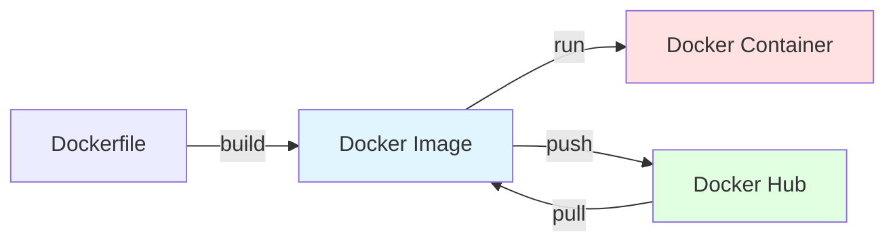
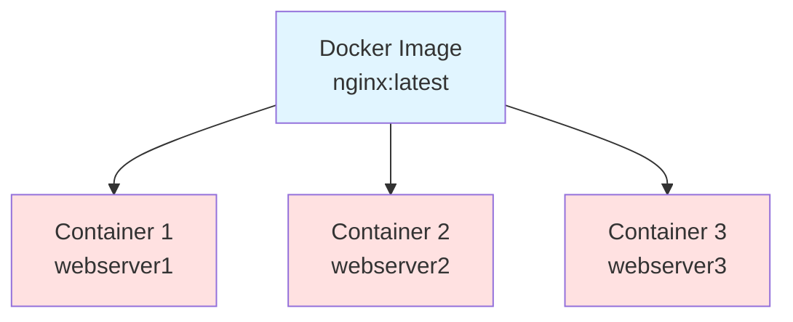

## 전체 흐름 요약

Docker의 핵심은 **이미지(Image)**와 **컨테이너(Container)**입니다. 이미지는 애플리케이션을 실행하기 위한 템플릿이며, 컨테이너는 이미지로부터 생성된 실행 인스턴스입니다.

이 문서에서는 이미지와 컨테이너의 개념과 차이점을 명확히 이해하고, Docker의 기본 명령어들을 학습합니다. 실습으로는 nginx 웹 서버 이미지를 다운로드하고, 컨테이너를 생성하여 실제 웹 서버를 실행해봅니다.

또한 Docker Hub를 통해 이미지를 검색하고 다운로드하는 방법, 이미지에 태그를 설정하고 관리하는 방법을 다룹니다. 마지막으로 이미지와 컨테이너를 삭제하고 관리하는 방법까지 학습합니다.

---

## 1. Docker 이미지와 컨테이너 개념

### 1-1. Docker 이미지 (Image)

**Docker 이미지**는 컨테이너를 실행하기 위해 필요한 **파일과 설정값 등을 포함하는 템플릿**입니다.

#### 주요 특징

**1) 읽기 전용 (Read-Only)**
- Docker 이미지는 한 번 만들어지면 **변경할 수 없습니다**
- 컨테이너를 실행할 때, 이미지를 바탕으로 읽기 전용 환경이 만들어집니다
- 수정이 필요하면 컨테이너를 새로운 이미지로 변환해야 합니다

**2) 레이어(Layer) 구조**
- 도커 이미지는 **여러 개의 레이어**로 구성됩니다
- 각 레이어는 이미지 생성 시 추가된 파일들입니다
- 레이어 구조 덕분에 이미지는 효율적으로 저장되고, 중복된 부분을 재사용할 수 있습니다

**예시:** 여러 개의 이미지가 동일한 Ubuntu 기본 이미지를 사용할 경우
```
Ubuntu Base Layer (공유)
    ↓
[이미지 A: nginx]  [이미지 B: apache]  [이미지 C: python]
```
- Ubuntu 부분은 한 번만 저장되고, 여러 이미지가 이를 공유합니다

**3) 이식성 (Portability)**
- 이미지는 Docker를 지원하는 **모든 시스템에서 동일하게 동작**합니다
- 개발 환경에서 만든 이미지가 다른 운영체제나 서버에서도 동일하게 실행됩니다
- **개발 환경과 배포 환경의 차이를 없애줍니다**

**4) Docker Hub**
- 도커 이미지를 공유하고 저장할 수 있는 **온라인 레지스트리**
- 개발자는 여기서 이미지를 다운로드하거나, 업로드하여 타인과 공유할 수 있습니다
- 다양한 공식 이미지를 제공하며, 필요한 소프트웨어 환경을 빠르게 구축 가능합니다



### 1-2. Docker 컨테이너 (Container)

**Docker 컨테이너**는 **이미지로부터 생성된 실행 가능한 인스턴스**입니다.

- 이미지가 애플리케이션을 실행할 수 있는 **'설계도'**라면
- 컨테이너는 실제로 애플리케이션이 동작하는 **'실행 환경'**입니다

#### 주요 특징

**1) 격리된 환경 (Isolation)**
- 호스트 시스템에서 **완전히 격리된 환경**에서 실행됩니다
- 다른 컨테이너나 호스트 시스템에 영향을 주지 않고, 독립적으로 동작합니다
- 격리 덕분에 하나의 시스템에서 여러 애플리케이션을 동시에 실행할 수 있습니다

**2) 빠른 실행 (Fast Startup)**
- 가상 머신처럼 전체 운영체제를 시뮬레이션하지 않습니다
- 이미지를 기반으로 필요한 파일과 라이브러리만 포함하여 빠르게 실행됩니다
- 컨테이너는 **시작과 종료가 매우 빠르며**, 수초 내에 새로운 환경을 만들어 실행할 수 있습니다

**3) 경량화 (Lightweight)**
- 가상 머신에 비해 **가벼운 실행 환경**을 제공합니다
- 도커 컨테이너는 호스트의 OS를 공유하고, 애플리케이션 실행에 필요한 것만 포함합니다

**4) 일관된 실행 환경 (Consistency)**
- **어디서나 똑같이 실행**될 수 있다는 장점이 있습니다
- "개발 환경과 운영 환경의 차이를 없애준다"는 중요한 장점이 있습니다

**5) 독립적인 네트워크 환경**
- 독립적인 네트워크 환경을 가질 수 있습니다
- 각 컨테이너는 **고유한 IP 주소**를 가지며, 다른 컨테이너와의 통신이 필요하다면 포트 매핑을 통해 서로 연결될 수 있습니다

### 1-3. 이미지와 컨테이너 요약

| 구분 | Docker 이미지 | Docker 컨테이너 |
|------|--------------|----------------|
| **정의** | 애플리케이션 실행을 위한 템플릿 | 이미지로부터 생성된 실행 인스턴스 |
| **역할** | 실행할 수 있는 환경을 만들기 위한 기반 제공 | 실제로 애플리케이션이 동작하는 실행 환경 |
| **상태** | 읽기 전용 (변경 불가) | 읽기/쓰기 가능 (실행 중 변경 가능) |
| **저장 위치** | `/var/lib/docker/image` | `/var/lib/docker/containers` |
| **비유** | 클래스 (Class) | 객체 (Object) |
| **관계** | 하나의 이미지로 여러 컨테이너 생성 가능 | 각 컨테이너는 독립적으로 실행 |



**예시:**
```bash
# 하나의 nginx 이미지로 여러 컨테이너 생성 가능
docker run -d --name web1 -p 8080:80 nginx
docker run -d --name web2 -p 8081:80 nginx
docker run -d --name web3 -p 8082:80 nginx
```

---

## 2. Docker 기본 명령어

### 2-1. Docker 명령어 구조

Docker 명령어는 다음과 같은 구조를 가집니다:

```bash
docker [관리대상] [명령] [옵션] [대상]
```

**예시:**
```bash
docker image pull nginx        # 이미지 다운로드
docker container run nginx     # 컨테이너 실행
docker container ls -a         # 컨테이너 목록 보기
```

### 2-2. Docker 이미지 관리 명령어

#### 이미지 다운로드 (pull)

Docker Hub에서 이미지를 다운로드합니다.

```bash
docker image pull [이미지명]:[태그]
```

**예시:**
```bash
# nginx 최신 버전 다운로드
docker image pull nginx

# nginx 특정 버전 다운로드
docker image pull nginx:1.25

# ubuntu 24.04 버전 다운로드
docker image pull ubuntu:24.04
```

#### 이미지 목록 보기 (ls)

로컬에 저장된 이미지 목록을 확인합니다.

```bash
docker image ls
```

또는 짧은 형식:

```bash
docker images
```

**예상 출력:**
```
REPOSITORY    TAG       IMAGE ID       CREATED        SIZE
nginx         latest    605c77e624dd   2 weeks ago    141MB
ubuntu        24.04     3b418d7b466a   3 weeks ago    77.9MB
hello-world   latest    d2c94e258dcb   8 months ago   13.3kB
```

**컬럼 설명:**
- **REPOSITORY**: 이미지 이름
- **TAG**: 이미지 버전 태그
- **IMAGE ID**: 이미지 고유 식별자
- **CREATED**: 이미지 생성 시간
- **SIZE**: 이미지 크기

#### 모든 이미지 보기 (중간 레이어 포함)

```bash
docker image ls -a
```

#### 이미지 삭제 (rm)

로컬에 저장된 이미지를 삭제합니다.

```bash
docker image rm [이미지명 또는 IMAGE ID]
```

**예시:**
```bash
# 이미지 이름으로 삭제
docker image rm nginx

# 이미지 ID로 삭제 (일부만 입력해도 식별 가능)
docker image rm 605c77e

# 강제 삭제 (-f, --force)
docker image rm -f nginx

# 중간 이미지 유지 (--no-prune)
docker image rm --no-prune nginx
```

**주의:** 이미지를 사용 중인 컨테이너가 있으면 삭제되지 않습니다. 강제 삭제하려면 `-f` 옵션을 사용합니다.

#### 이미지 검색 (search)

Docker Hub에서 이미지를 검색합니다.

```bash
docker search [검색어]
```

**예시:**
```bash
docker search nginx
```

**예상 출력:**
```
NAME                      DESCRIPTION                                     STARS     OFFICIAL
nginx                     Official build of Nginx.                        19000     [OK]
unit                      Official build of NGINX Unit                    18        [OK]
nginx/nginx-ingress       NGINX and  NGINX Plus Ingress Controllers       86
```

**주의:** 기본적으로 25개까지만 출력됩니다.

### 2-3. Docker 컨테이너 관리 명령어

#### 컨테이너 생성 및 실행 (run)

이미지를 이용해 컨테이너를 생성하고 실행합니다.

```bash
docker container run [옵션] [이미지명] [명령어]
```

**주요 옵션:**

| 옵션 | 설명 |
|------|------|
| `-d, --detach` | 백그라운드로 실행 |
| `-i, --interactive` | 컨테이너 표준 입력을 열어둠 (상호작용 가능) |
| `-t, --tty` | 가상 터미널 할당 (터미널 세션 실행) |
| `--name` | 컨테이너 이름 지정 |
| `-p, --publish` | 포트 매핑 (호스트포트:컨테이너포트) |
| `-v, --volume` | 볼륨 마운트 |
| `--rm` | 컨테이너 종료 시 자동 삭제 (일회성 작업) |
| `-e, --env` | 환경변수 설정 |
| `--network` | 네트워크 지정 |

**예시:**
```bash
# 백그라운드로 nginx 실행
docker container run -d nginx

# 이름을 지정하여 실행
docker container run -d --name webserver nginx

# 포트 매핑하여 실행 (호스트 8080 -> 컨테이너 80)
docker container run -d --name web1 -p 8080:80 nginx

# 인터랙티브 모드로 Ubuntu 실행
docker container run -it --name myubuntu ubuntu /bin/bash

# 일회성 명령 실행 후 자동 삭제
docker container run --rm ubuntu echo "Hello Docker"
```

#### 컨테이너 목록 보기 (ls)

실행 중인 컨테이너 목록을 확인합니다.

```bash
docker container ls
```

또는 짧은 형식:

```bash
docker ps
```

**모든 컨테이너 보기 (중지된 것 포함):**

```bash
docker container ls -a
```

또는

```bash
docker ps -a
```

**예상 출력:**
```
CONTAINER ID   IMAGE     COMMAND                  CREATED          STATUS          PORTS                  NAMES
a1b2c3d4e5f6   nginx     "/docker-entrypoint.…"   10 minutes ago   Up 10 minutes   0.0.0.0:8080->80/tcp   webserver
```

**컬럼 설명:**
- **CONTAINER ID**: 컨테이너 고유 ID (짧은 형식)
- **IMAGE**: 사용된 이미지
- **COMMAND**: 컨테이너 내부에서 실행 중인 명령
- **CREATED**: 컨테이너 생성 시간
- **STATUS**: 현재 상태 (Up: 실행 중, Exited: 종료됨)
- **PORTS**: 포트 매핑 정보
- **NAMES**: 컨테이너 이름

#### 컨테이너 시작/중지/재시작

```bash
# 컨테이너 시작
docker container start [컨테이너명 또는 ID]

# 컨테이너 중지
docker container stop [컨테이너명 또는 ID]

# 컨테이너 재시작
docker container restart [컨테이너명 또는 ID]
```

**예시:**
```bash
docker container start webserver
docker container stop webserver
docker container restart webserver
```

#### 컨테이너 삭제 (rm)

중지된 컨테이너를 삭제합니다.

```bash
docker container rm [컨테이너명 또는 ID]
```

**예시:**
```bash
# 컨테이너 삭제 (중지 상태여야 함)
docker container rm webserver

# 실행 중인 컨테이너 강제 삭제
docker container rm -f webserver

# 여러 컨테이너 삭제
docker container rm web1 web2 web3

# 모든 컨테이너 삭제 (중지된 것만)
docker container prune

# 모든 컨테이너 강제 삭제 (실행 중인 것 포함)
docker container rm -f $(docker container ls -aq)
```

**주의:**
- `-a`: 모든 컨테이너
- `-q`: ID만 출력 (quiet mode)

---

## 3. nginx 웹 서버 컨테이너 실습

### 3-1. nginx 이미지 다운로드

#### 이미지 검색

```bash
docker search nginx
```

**출력:**
```
NAME                      DESCRIPTION                                     STARS     OFFICIAL
nginx                     Official build of Nginx.                        19000     [OK]
```

#### 이미지 다운로드

```bash
docker image pull nginx
```

**실행 과정:**
```
Using default tag: latest
latest: Pulling from library/nginx
a2abf6c4d29d: Pull complete
a9edb18cadd1: Pull complete
589b7251471a: Pull complete
186b1aaa4aa6: Pull complete
b4df32aa5a72: Pull complete
a0bcbecc962e: Pull complete
Digest: sha256:0d17b565c37bcbd895e9d92315a05c1c3c9a29f762b011a10c54a66cd53c9b31
Status: Downloaded newer image for nginx:latest
docker.io/library/nginx:latest
```

#### 이미지 확인

```bash
docker image ls
```

**출력:**
```
REPOSITORY   TAG       IMAGE ID       CREATED       SIZE
nginx        latest    605c77e624dd   2 weeks ago   141MB
```

### 3-2. 이미지 상세 정보 확인

Docker는 이미지, 컨테이너, 네트워크의 상세 정보를 확인할 수 있는 `inspect` 명령어를 제공합니다.

#### 이미지 상세 확인

```bash
docker image inspect nginx
```

**출력:** JSON 형식으로 이미지의 모든 정보 출력

#### 컨테이너 상세 확인

```bash
docker container inspect [컨테이너명]
```

#### 네트워크 상세 확인

```bash
docker network inspect [네트워크명]
```

### 3-3. nginx 컨테이너 실행

#### 백그라운드로 nginx 실행

```bash
docker container run -d --name webserver -p 8080:80 nginx
```

**옵션 설명:**
- `-d`: detach, 백그라운드로 계속 실행
- `--name webserver`: 컨테이너 이름을 webserver로 지정
- `-p 8080:80`: 호스트의 8080 포트를 컨테이너의 80 포트로 매핑

#### 컨테이너 구동 확인

```bash
docker container ls
```

**출력:**
```
CONTAINER ID   IMAGE     COMMAND                  CREATED         STATUS         PORTS                  NAMES
a1b2c3d4e5f6   nginx     "/docker-entrypoint.…"   5 seconds ago   Up 4 seconds   0.0.0.0:8080->80/tcp   webserver
```

**STATUS 컬럼:**
- `Up`: 실행 중
- `Exited (0)`: 정상 종료됨
- `Exited (1)`: 오류로 종료됨

### 3-4. 웹 서버 작동 확인

#### curl 명령어로 확인

```bash
curl -I http://localhost:8080
```

또는 서버의 실제 IP 사용:

```bash
curl -I http://192.168.10.100:8080
```

**예상 출력:**
```
HTTP/1.1 200 OK
Server: nginx/1.25.3
Date: Sat, 20 Jan 2024 10:00:00 GMT
Content-Type: text/html
Content-Length: 615
Last-Modified: Tue, 24 Oct 2023 13:46:47 GMT
Connection: keep-alive
ETag: "6537cac7-267"
Accept-Ranges: bytes
```

#### 웹 브라우저로 확인

웹 브라우저에서 다음 주소로 접속:
```
http://localhost:8080
```

또는

```
http://192.168.10.100:8080
```

**결과:** "Welcome to nginx!" 페이지가 표시됩니다.

### 3-5. 컨테이너 상태 확인

#### 실시간 리소스 사용량 확인

```bash
docker container stats webserver
```

**예상 출력:**
```
CONTAINER ID   NAME        CPU %     MEM USAGE / LIMIT     MEM %     NET I/O           BLOCK I/O   PIDS
a1b2c3d4e5f6   webserver   0.00%     2.5MiB / 7.775GiB     0.03%     1.05kB / 0B      0B / 0B     3
```

**Ctrl + C**로 종료

#### 컨테이너 로그 확인

```bash
docker container logs webserver
```

**실시간 로그 확인 (-f 옵션):**

```bash
docker container logs -f webserver
```

**타임스탬프 포함 (-t 옵션):**

```bash
docker container logs -t webserver
```

### 3-6. 컨테이너 중지 및 삭제

#### 컨테이너 중지

```bash
docker container stop webserver
```

#### 컨테이너 상태 확인

```bash
docker container ls -a
```

**출력:**
```
CONTAINER ID   IMAGE     COMMAND                  CREATED          STATUS                     PORTS     NAMES
a1b2c3d4e5f6   nginx     "/docker-entrypoint.…"   10 minutes ago   Exited (0) 5 seconds ago             webserver
```

**STATUS**: `Exited (0)` - 정상 종료됨

#### 컨테이너 재시작

```bash
docker container start webserver
```

#### 컨테이너 삭제

컨테이너 실행 중지 후 삭제:

```bash
docker container stop webserver
docker container rm webserver
```

또는 강제 삭제:

```bash
docker container rm -f webserver
```

#### 삭제 확인

```bash
docker container ls -a
```

---

## 4. Docker Hub와 이미지 관리

### 4-1. Docker Hub

**Docker Hub**는 도커 이미지를 공유하고 저장할 수 있는 온라인 레지스트리입니다.

- **공식 사이트**: [https://hub.docker.com](https://hub.docker.com)
- GitHub처럼 소스 코드 관리 툴과 연계하여 코드를 빌드하거나, 실행 가능한 애플리케이션 이미지를 관리해주는 서비스
- 다양한 공식 이미지를 제공 (nginx, ubuntu, mysql, redis 등)

### 4-2. 이미지 태그 (Tag)

Docker 이미지는 **태그**를 이용하여 버전을 관리합니다.

#### 태그 형식

```
[이미지명]:[태그]
```

**예시:**
```
nginx:latest        # 최신 버전
nginx:1.25          # 1.25 버전
ubuntu:24.04        # Ubuntu 24.04
ubuntu:22.04        # Ubuntu 22.04
```

#### 태그 생략 시 기본값

태그를 생략하면 자동으로 `latest` 태그가 적용됩니다.

```bash
docker pull nginx
# docker pull nginx:latest 와 동일
```

### 4-3. 이미지에 태그 설정하기

기존 이미지에 새로운 태그를 설정할 수 있습니다.

#### 태그 설정 명령

```bash
docker image tag [원본이미지:태그] [계정명]/[이미지이름]:[태그]
```

**예시:**
```bash
# nginx 이미지에 사용자 태그 추가
docker image tag nginx:latest user1/mynginx:1.0

# ubuntu 이미지에 태그 추가
docker image tag ubuntu:24.04 itschool/myserver:1.0
```

#### 태그 설정 의미

이미지에 태그를 설정하면:
- **REPOSITORY 이름만 달라지는 것**이므로
- 태그를 설정한 이미지의 **IMAGE ID는 원본 이미지와 동일**합니다
- 즉, **이미지 ID가 같다는 것은 둘이 같은 이미지**라는 의미입니다

#### 확인

```bash
docker image ls
```

**예상 출력:**
```
REPOSITORY        TAG       IMAGE ID       CREATED       SIZE
nginx             latest    605c77e624dd   2 weeks ago   141MB
user1/mynginx     1.0       605c77e624dd   2 weeks ago   141MB
```

**IMAGE ID가 동일함을 확인!**

### 4-4. Docker Hub에 이미지 업로드

자신이 만든 이미지를 Docker Hub에 업로드하여 공유할 수 있습니다.

#### 1) Docker Hub 로그인

```bash
docker login -u [사용자명]
```

**예시:**
```bash
docker login -u user1
Password: [비밀번호 입력]

Login Succeeded
```

**로그인 정보 저장 위치:**
- `/root/.docker/config.json` 파일에 아이디/패스워드가 base64 형태로 저장됩니다
- `docker logout`을 하면 auth 정보는 사라집니다

#### 인코딩된 정보 확인

```bash
cat /root/.docker/config.json
```

**예상 출력:**
```json
{
    "auths": {
        "https://index.docker.io/v1/": {
            "auth": "dXNlcjE6cGFzc3dvcmQxMjM="
        }
    }
}
```

#### base64 디코딩

```bash
echo -n "dXNlcjE6cGFzc3dvcmQxMjM=" | base64 --decode
```

**출력:** `user1:password123`

#### 2) 이미지 태그 설정

Docker Hub에 업로드하려면 **이미지 이름에 반드시 Docker Hub 로그인 계정명**을 붙여야 합니다.

```bash
docker image tag nginx user1/mynginx:1.0
```

#### 3) Docker Hub에 업로드 (push)

```bash
docker image push user1/mynginx:1.0
```

**실행 과정:**
```
The push refers to repository [docker.io/user1/mynginx]
d874fd2bc83b: Pushed
32ce5f6a5106: Pushed
f1db227348d0: Pushed
b8d6e692a25e: Pushed
e379e8aedd4d: Pushed
2edcec3590a4: Pushed
1.0: digest: sha256:ee89b00528ff4f02f2405e4ee221743ebc3f8e8dd0bfd5c4c20a2fa2aaa7ede3 size: 1570
```

#### 4) Docker Hub 검색

```bash
docker search user1
```

#### 5) 로그아웃

```bash
docker logout
```

#### 6) 기존 이미지 삭제 후 다운로드 테스트

```bash
# 기존 이미지 삭제
docker image rm user1/mynginx:1.0

# Docker Hub에서 다운로드
docker image pull user1/mynginx:1.0
```

---

## 5. 실전 예제

### 5-1. 여러 개의 nginx 컨테이너 실행

하나의 이미지로 여러 개의 컨테이너를 생성할 수 있습니다.

```bash
# 첫 번째 웹 서버 (포트 8080)
docker container run -d --name web1 -p 8080:80 nginx

# 두 번째 웹 서버 (포트 8081)
docker container run -d --name web2 -p 8081:80 nginx

# 세 번째 웹 서버 (포트 8082)
docker container run -d --name web3 -p 8082:80 nginx
```

#### 컨테이너 확인

```bash
docker container ls
```

**출력:**
```
CONTAINER ID   IMAGE     COMMAND                  CREATED          STATUS          PORTS                  NAMES
a1b2c3d4e5f6   nginx     "/docker-entrypoint.…"   10 seconds ago   Up 9 seconds    0.0.0.0:8080->80/tcp   web1
b2c3d4e5f6a7   nginx     "/docker-entrypoint.…"   8 seconds ago    Up 7 seconds    0.0.0.0:8081->80/tcp   web2
c3d4e5f6a7b8   nginx     "/docker-entrypoint.…"   6 seconds ago    Up 5 seconds    0.0.0.0:8082->80/tcp   web3
```

#### 각각 접속 확인

```bash
curl -I http://localhost:8080
curl -I http://localhost:8081
curl -I http://localhost:8082
```

### 5-2. 컨테이너 일괄 삭제

#### 모든 컨테이너 강제 삭제

```bash
docker container rm -f $(docker container ls -aq)
```

**명령어 분석:**
- `docker container ls -aq`: 모든 컨테이너 ID 출력
- `-a`: 모든 컨테이너 (all)
- `-q`: ID만 출력 (quiet)
- `$()`: 명령어 치환 (출력 결과를 인자로 전달)
- `rm -f`: 강제 삭제 (force)

#### 정지된 컨테이너만 삭제

```bash
docker container prune
```

**확인 메시지:**
```
WARNING! This will remove all stopped containers.
Are you sure you want to continue? [y/N] y
```

### 5-3. alias 설정하여 편리하게 사용

자주 사용하는 명령어를 alias로 등록하여 사용할 수 있습니다.

#### .bashrc 파일 편집

```bash
vim ~/.bashrc
```

#### alias 추가

```bash
# Docker 관련 alias
alias dcrm='docker container rm -f $(docker container ls -aq)'
alias dirm='docker image rm -f $(docker image ls -aq)'
alias dcls='docker container ls -a'
alias dils='docker image ls -a'
```

#### 변경사항 적용

```bash
source ~/.bashrc
```

#### 사용

```bash
# 모든 컨테이너 삭제
dcrm

# 모든 이미지 삭제
dirm

# 컨테이너 목록 보기
dcls

# 이미지 목록 보기
dils
```

---

## 주요 개념 요약표

| 명령어 | 설명 | 예시 |
|--------|------|------|
| `docker image pull` | 이미지 다운로드 | `docker image pull nginx` |
| `docker image ls` | 이미지 목록 보기 | `docker image ls -a` |
| `docker image rm` | 이미지 삭제 | `docker image rm nginx` |
| `docker image tag` | 이미지 태그 설정 | `docker image tag nginx user1/mynginx:1.0` |
| `docker image push` | Docker Hub에 업로드 | `docker image push user1/mynginx:1.0` |
| `docker search` | Docker Hub 검색 | `docker search nginx` |
| `docker container run` | 컨테이너 생성 및 실행 | `docker container run -d -p 8080:80 nginx` |
| `docker container ls` | 컨테이너 목록 보기 | `docker container ls -a` |
| `docker container start` | 컨테이너 시작 | `docker container start web1` |
| `docker container stop` | 컨테이너 중지 | `docker container stop web1` |
| `docker container restart` | 컨테이너 재시작 | `docker container restart web1` |
| `docker container rm` | 컨테이너 삭제 | `docker container rm -f web1` |
| `docker container logs` | 컨테이너 로그 확인 | `docker container logs -f web1` |
| `docker container stats` | 컨테이너 리소스 사용량 | `docker container stats web1` |
| `docker login` | Docker Hub 로그인 | `docker login -u user1` |
| `docker logout` | Docker Hub 로그아웃 | `docker logout` |

---

## 마무리

이번 문서에서는 Docker 이미지와 컨테이너의 핵심 개념과 기본 명령어들을 학습했습니다.

**핵심 내용:**
1. **이미지 vs 컨테이너**: 이미지는 템플릿, 컨테이너는 실행 인스턴스
2. **기본 명령어**: pull, run, ls, rm, start, stop 등
3. **nginx 실습**: 웹 서버 이미지를 다운로드하고 컨테이너로 실행
4. **Docker Hub**: 이미지를 검색하고 공유하는 온라인 레지스트리
5. **태그 관리**: 이미지에 태그를 설정하고 버전 관리

**다음 단계:**
- Part 3에서는 Docker 볼륨과 네트워크에 대해 학습합니다
- 컨테이너 데이터를 영구적으로 저장하는 방법 (Volume vs Bind Mount)
- 컨테이너 간 통신을 위한 네트워크 설정 방법
- NFS 서버와 Docker 볼륨 연동 실습

Docker의 기본 명령어를 익혔다면, 이제 데이터 관리와 네트워크 구성을 통해 더 실전적인 컨테이너 환경을 구축할 준비가 되었습니다!
