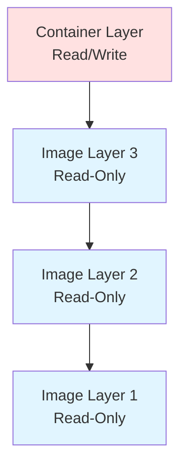
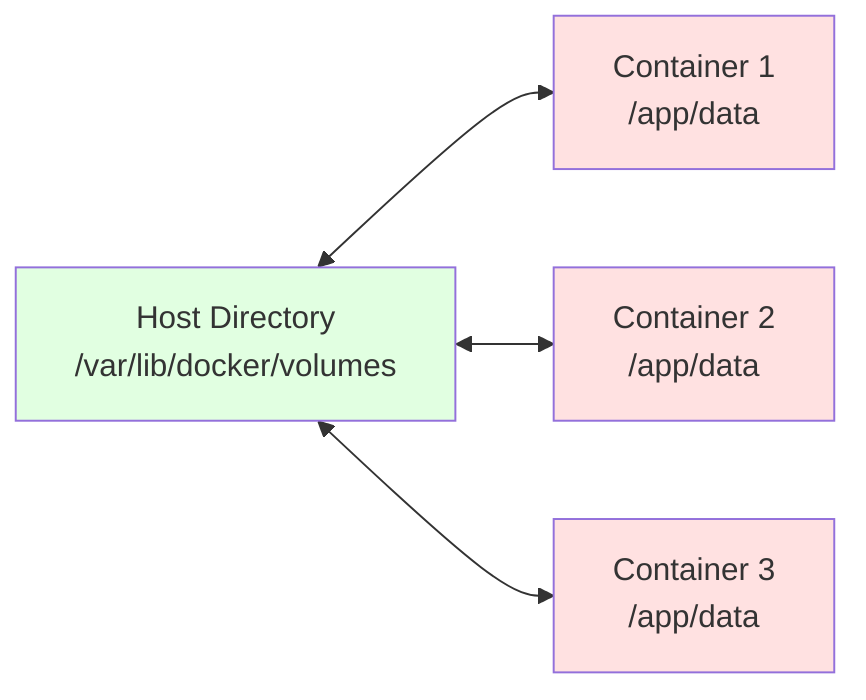

## 전체 흐름 요약

Docker 컨테이너는 기본적으로 일시적(ephemeral)입니다. 컨테이너를 삭제하면 내부 데이터도 함께 사라집니다. 이를 해결하기 위해 Docker는 **볼륨(Volume)** 기능을 제공하여 데이터를 영구적으로 보존할 수 있습니다.

이 문서에서는 Docker의 볼륨 개념과 두 가지 구성 방식(Volume 방식과 Bind Mount 방식)을 학습합니다. 또한 컨테이너 간 통신을 위한 네트워크 설정 방법과 Docker가 제공하는 세 가지 네트워크 드라이버(bridge, host, none)를 다룹니다.

실습으로는 nginx 컨테이너에 볼륨을 연결하여 웹 콘텐츠를 관리하고, 사용자 정의 네트워크를 생성하여 컨테이너 간 통신을 구성해봅니다. 마지막으로 NFS 서버와 Docker를 연동하는 실전 예제도 포함되어 있습니다.

---

## 1. Docker 볼륨 개념

### 1-1. 컨테이너의 데이터 기록 방식

#### 이미지와 컨테이너 레이어

Docker 컨테이너를 실행하면:
1. **이미지**는 **읽기 전용(Read-Only)**으로 동작합니다
2. **컨테이너**는 **읽기/쓰기(Read/Write)** 레이어를 생성합니다
3. 컨테이너에서 작업한 내용은 **컨테이너 레이어**에 기록됩니다
4. 컨테이너가 삭제되면 레이어에 기록된 **데이터도 함께 삭제**됩니다



#### 문제점

컨테이너를 삭제하면:
- 내부에 저장된 모든 데이터가 사라집니다
- 데이터베이스, 로그 파일, 사용자 업로드 파일 등이 손실됩니다
- 컨테이너를 새로 생성하면 처음부터 다시 시작해야 합니다

#### 해결책: Volume

**Volume**을 이용하면 컨테이너 레이어에 기록된 데이터를 호스트에 저장하여 보존할 수 있습니다.

### 1-2. 볼륨 구성

**볼륨(Volume)**은 컨테이너의 데이터를 호스트에 저장하는 기능입니다.

**주요 특징:**
- 호스트와 컨테이너 간 **데이터 공유** 가능
- 컨테이너에 기록된 데이터를 **호스트 볼륨에 저장** 가능
- 컨테이너를 삭제해도 **데이터는 보존**됨
- 여러 컨테이너가 **동일한 볼륨을 공유** 가능



### 1-3. 볼륨 구성 방식 (2가지)

Docker는 두 가지 볼륨 구성 방식을 제공합니다.

#### 1) Volume 방식 (상대경로)

Docker Root 디렉토리(`/var/lib/docker/volumes`)에 컨테이너 데이터 저장

**명령어 형식:**
```bash
-v [볼륨이름]:[컨테이너의 볼륨 디렉토리]
```

**특징:**
- Docker가 자동으로 볼륨 관리
- 볼륨 이름을 명시적으로 지정 가능
- 볼륨 이름 생략 시 해시값으로 자동 생성

#### 2) Bind Mount 방식 (절대경로)

호스트의 **특정 디렉토리**를 mount하여 컨테이너 데이터 저장

**명령어 형식:**
```bash
-v [호스트의 절대경로]:[컨테이너의 볼륨 디렉토리]
```

**특징:**
- 호스트의 원하는 위치에 데이터 저장
- 기존 디렉토리를 컨테이너와 직접 연결
- 호스트에서 직접 파일 수정 가능

**주의:** 볼륨으로 지정한 디렉토리가 없는 경우 **자동으로 생성**됩니다.

| 구분 | Volume 방식 | Bind Mount 방식 |
|------|------------|----------------|
| **경로** | 상대경로 (Docker Root) | 절대경로 (호스트 임의 경로) |
| **관리** | Docker가 관리 | 사용자가 관리 |
| **위치** | `/var/lib/docker/volumes` | 사용자 지정 경로 |
| **사용 예** | 데이터베이스 데이터 | 소스 코드, 설정 파일 |

---

## 2. Volume 방식 실습

### 2-1. Volume 방식 - 볼륨 이름 명시

#### 컨테이너 생성 (볼륨 지정)

```bash
docker container run -d --name web1 \
  -v myvol:/usr/share/nginx/html \
  -p 8080:80 \
  nginx
```

**옵션 설명:**
- `-v myvol:/usr/share/nginx/html`:
  - `myvol`이라는 볼륨을 생성
  - 컨테이너의 `/usr/share/nginx/html` 디렉토리와 연결

#### 컨테이너 확인

```bash
docker container ls -a
```

#### 볼륨 확인

```bash
docker volume ls
```

**예상 출력:**
```
DRIVER    VOLUME NAME
local     myvol
```

#### 볼륨 위치 확인

```bash
ls -l /var/lib/docker/volumes/
```

**예상 출력:**
```
drwx-----x 3 root root 4096 Jan 22 10:00 myvol
```

#### 볼륨 데이터 확인

```bash
ls -l /var/lib/docker/volumes/myvol/_data/
```

**예상 출력:**
```
-rw-r--r-- 1 root root  497 Oct 24 13:46 50x.html
-rw-r--r-- 1 root root  615 Oct 24 13:46 index.html
```

nginx 컨테이너의 기본 웹 페이지 파일들이 호스트에 저장되어 있습니다!

### 2-2. Volume 동기화

**myvol에 데이터가 비어 있는 경우:**
- 컨테이너의 `/usr/share/nginx/html` → `myvol`로 동기화
- 컨테이너 내부의 데이터가 볼륨으로 복사됩니다

**myvol에 데이터가 있는 경우:**
- `myvol` → 컨테이너의 `/usr/share/nginx/html`로 동기화
- 볼륨의 데이터가 컨테이너 내부로 복사됩니다

### 2-3. 볼륨 데이터 수정

#### 호스트에서 index.html 수정

```bash
echo "<h1>Hello Docker Volume!</h1>" > /var/lib/docker/volumes/myvol/_data/index.html
```

#### 웹 브라우저로 확인

```
http://localhost:8080
```

**결과:** "Hello Docker Volume!" 메시지가 표시됩니다.

컨테이너를 재시작하지 않아도 즉시 반영됩니다!

### 2-4. Volume 방식 - 볼륨 이름 생략

볼륨 이름을 지정하지 않으면 Docker가 **해시 값을 이름으로 하는 볼륨을 자동 생성**합니다.

#### 컨테이너 생성 (익명 볼륨)

```bash
docker container run -d --name web2 \
  -v /usr/share/nginx/html \
  -p 8081:80 \
  nginx
```

#### 볼륨 확인

```bash
docker volume ls
```

**예상 출력:**
```
DRIVER    VOLUME NAME
local     myvol
local     a1b2c3d4e5f6a7b8c9d0e1f2a3b4c5d6e7f8a9b0c1d2e3f4a5b6c7d8e9f0a1b2
```

두 번째 볼륨은 자동 생성된 **익명 볼륨(Anonymous Volume)**입니다.

### 2-5. 볼륨 삭제

#### 컨테이너 삭제

```bash
docker container rm -f web1 web2
```

#### 익명 볼륨 삭제

```bash
docker volume prune
```

**확인 메시지:**
```
WARNING! This will remove all local volumes not used by at least one container.
Are you sure you want to continue? [y/N] y
```

**결과:** 사용되지 않는 익명 볼륨이 모두 삭제됩니다.

#### 특정 볼륨 삭제

```bash
docker volume rm myvol
```

**주의:** 볼륨을 사용 중인 컨테이너가 있으면 삭제할 수 없습니다.

---

## 3. Bind Mount 방식 실습

### 3-1. Bind Mount 방식 기본

#### 호스트 디렉토리 생성

```bash
mkdir -p /www
```

#### 컨테이너 생성 (Bind Mount)

```bash
docker container run -d --name web1 \
  -v /www:/usr/share/nginx/html \
  -p 8080:80 \
  nginx
```

**옵션 설명:**
- `-v /www:/usr/share/nginx/html`:
  - 호스트의 `/www` 디렉토리를
  - 컨테이너의 `/usr/share/nginx/html`에 마운트

#### Bind Mount 동기화

**중요:** Bind Mount 방식은 Volume 방식과 동기화 방향이 다릅니다!

- `/www`에 데이터 **유무에 상관없이**
- **항상** `/www` → `/usr/share/nginx/html` 방향으로 동기화됩니다

**주의사항:**
- 컨테이너의 `/usr/share/nginx/html`에 기존 데이터가 있어도
- `/www`의 데이터로 **덮어씌워집니다**
- 빈 디렉토리를 마운트하면 컨테이너 내부 파일이 사라집니다!

### 3-2. 웹 콘텐츠 작성

#### index.html 생성

```bash
echo "<h1>Bind Mount Test</h1>" > /www/index.html
```

#### 웹 브라우저로 확인

```
http://localhost:8080
```

**결과:** "Bind Mount Test" 메시지가 표시됩니다.

### 3-3. 읽기 전용(Read-Only) 마운트

컨테이너 내부에서 파일을 수정하지 못하도록 **읽기 전용**으로 설정할 수 있습니다.

#### 읽기 전용 컨테이너 생성

```bash
docker container run -d --name web3 \
  -v /www:/usr/share/nginx/html:ro \
  -p 8181:80 \
  nginx
```

**옵션:**
- `:ro` - read only (읽기 전용)

#### 테스트

컨테이너 내부에서 파일 수정 시도:

```bash
docker container exec web3 sh -c "echo 'test' > /usr/share/nginx/html/test.txt"
```

**결과:**
```
sh: can't create /usr/share/nginx/html/test.txt: Read-only file system
```

**읽기 전용이므로 파일 생성/수정이 불가능합니다!**

웹 서버에서 호스트의 파일만 읽어야 하는 경우, 읽기 전용 옵션을 사용하여 **보안을 강화**할 수 있습니다.

### 3-4. 컨테이너 정리

```bash
docker container rm -f web1 web3
```

---

## 4. 도커, NFS 서버 연결 실습

### 4-1. 환경 구성

**시나리오:**
- **서버01 (NFS 서버)**: 192.168.10.128
- **우분투 (Docker 호스트)**: 192.168.10.100

**목표:**
- 서버01의 NFS 공유 디렉토리를 우분투에 마운트
- 마운트된 디렉토리를 Docker 컨테이너에 Bind Mount

### 4-2. 서버01에서 NFS 설정

#### NFS 서버 설치

```bash
# CentOS/RHEL
sudo yum install -y nfs-utils

# Ubuntu/Debian
sudo apt install -y nfs-kernel-server
```

#### 공유 디렉토리 생성

```bash
sudo mkdir -p /nfs_web
sudo chmod 777 /nfs_web
```

#### NFS 공유 설정

```bash
sudo vi /etc/exports
```

**추가 내용:**
```
/nfs_web    192.168.10.0/24(rw,sync,no_root_squash)
```

**옵션 설명:**
- `rw`: 읽기/쓰기 권한
- `sync`: 동기화 쓰기
- `no_root_squash`: root 권한 유지

#### NFS 서비스 재시작

```bash
# CentOS/RHEL
sudo systemctl restart nfs-server
sudo systemctl enable nfs-server

# Ubuntu/Debian
sudo systemctl restart nfs-kernel-server
sudo systemctl enable nfs-kernel-server
```

#### 방화벽 설정

```bash
# CentOS/RHEL (firewalld)
sudo firewall-cmd --permanent --add-service=nfs
sudo firewall-cmd --reload

# Ubuntu/Debian (ufw)
sudo ufw allow from 192.168.10.0/24 to any port nfs
```

### 4-3. 우분투에서 NFS 클라이언트 설치

```bash
sudo apt -y install nfs-common
```

### 4-4. 우분투에서 NFS 마운트

#### 마운트 포인트 생성

```bash
sudo mkdir -p /web
```

#### NFS 마운트

```bash
sudo mount 192.168.10.128:/nfs_web /web
```

**형식:**
```bash
mount [NFS서버IP]:[공유디렉토리] [마운트포인트]
```

#### 마운트 확인

```bash
df -h | grep nfs_web
```

**예상 출력:**
```
192.168.10.128:/nfs_web   50G  5.0G   45G  10% /web
```

### 4-5. Docker 컨테이너에 NFS 연결

#### 컨테이너 생성

```bash
docker container run -d --name nfs-web \
  -v /web:/usr/share/nginx/html \
  -p 80:80 \
  nginx
```

#### 서버01에서 웹 콘텐츠 작성

서버01에서:

```bash
echo "<h1>NFS + Docker Test</h1>" > /nfs_web/index.html
```

#### 우분투에서 확인

```bash
cat /web/index.html
```

**결과:** NFS를 통해 파일이 동기화되어 있습니다!

#### 웹 브라우저로 확인

```
http://192.168.10.100
```

**결과:** "NFS + Docker Test" 메시지가 표시됩니다.

### 4-6. 정리

#### 컨테이너 삭제

```bash
docker container rm -f nfs-web
```

#### NFS 마운트 해제

```bash
sudo umount /web
```

#### 마운트 포인트 삭제

```bash
sudo rm -rf /web
```

---

## 5. Docker 네트워크

### 5-1. Docker 네트워크 개념

Docker는 컨테이너 간 통신과 외부 통신을 위한 네트워크 기능을 제공합니다.

**기본 네트워크 확인:**

```bash
docker network ls
```

**예상 출력:**
```
NETWORK ID     NAME      DRIVER    SCOPE
a1b2c3d4e5f6   bridge    bridge    local
b2c3d4e5f6a7   host      host      local
c3d4e5f6a7b8   none      null      local
```

### 5-2. Docker 네트워크 종류

Docker는 세 가지 기본 네트워크 드라이버를 제공합니다.

#### 1) bridge 네트워크 (기본값)

**특징:**
- 컨테이너 구동 시 네트워크를 별도로 지정하지 않으면 **기본값인 bridge**로 구동됩니다
- `docker0` 브리지를 사용하며, docker0은 **컨테이너들의 게이트웨이** 역할을 합니다
- 각 컨테이너는 **독립적인 IP 주소**를 할당받습니다
- 컨테이너 간 통신이 가능하며, 호스트와도 통신 가능합니다

**확인:**

```bash
docker container run --rm --network=bridge centos ip address
```

**docker0 확인:**

```bash
ip addr show docker0
```

**예상 출력:**
```
docker0: <BROADCAST,MULTICAST,UP,LOWER_UP>
    inet 172.17.0.1/16 brd 172.17.255.255 scope global docker0
```

#### 2) host 네트워크

**특징:**
- 호스트의 네트워크 장치를 **컨테이너가 그대로 사용**합니다
- 컨테이너가 독립적인 IP를 가지지 않고, **호스트의 IP를 공유**합니다
- 네트워크 격리가 없으므로 **성능이 우수**하지만 보안에 취약합니다

**확인:**

```bash
docker container run --rm --network=host centos ip address
```

**결과:** 호스트와 동일한 네트워크 인터페이스가 표시됩니다.

#### 3) none 네트워크

**특징:**
- 컨테이너에 **loopback 네트워크 장치만 생성**됩니다
- 호스트 및 다른 컨테이너와 **통신할 수 없습니다**
- 완전히 격리된 환경이 필요한 경우 사용합니다

**확인:**

```bash
docker container run --rm --network=none centos ip address
```

**결과:** `lo` (loopback) 인터페이스만 표시됩니다.

### 5-3. 네트워크 종류 비교

| 네트워크 | IP 할당 | 외부 통신 | 컨테이너 간 통신 | 사용 사례 |
|---------|---------|----------|----------------|----------|
| **bridge** | 독립 IP | 포트 매핑 필요 | 가능 | 일반적인 컨테이너 (기본값) |
| **host** | 호스트 IP 공유 | 직접 가능 | 가능 | 고성능 네트워크 필요 시 |
| **none** | 없음 (lo만) | 불가능 | 불가능 | 완전 격리 환경 |

---

## 6. 사용자 정의 네트워크

### 6-1. 사용자 정의 네트워크 생성

Docker는 기본 네트워크 외에 **사용자 정의 네트워크**를 생성할 수 있습니다.

#### 네트워크 생성 명령어

```bash
docker network create [옵션] [네트워크이름]
```

**주요 옵션:**

| 옵션 | 설명 |
|------|------|
| `-d, --driver` | 네트워크 관리를 위한 driver (기본값: bridge) |
| `--subnet` | CIDR 형식의 네트워크 서브넷 표시 |
| `--gateway` | 게이트웨이 IP |
| `--ip-range` | 할당 IP 범위 |
| `--label` | 네트워크의 metadata 설정 |
| `--ipv6` | ipv6 활성화 |

#### subnet만 설정

```bash
docker network create -d bridge --subnet 192.168.50.0/24 mybr1
```

#### subnet 및 gateway 설정

```bash
docker network create -d bridge \
  --subnet 192.168.100.0/24 \
  --gateway 192.168.100.254 \
  mybr2
```

#### 네트워크 확인

```bash
docker network ls
```

**예상 출력:**
```
NETWORK ID     NAME      DRIVER    SCOPE
a1b2c3d4e5f6   bridge    bridge    local
b2c3d4e5f6a7   host      host      local
c3d4e5f6a7b8   none      null      local
d4e5f6a7b8c9   mybr1     bridge    local
e5f6a7b8c9d0   mybr2     bridge    local
```

### 6-2. 네트워크 정보 확인

```bash
docker network inspect mybr1
```

**주요 출력 내용:**
- Subnet, Gateway 정보
- 연결된 컨테이너 목록
- 각 컨테이너의 IP 주소

#### 특정 정보만 확인 (-f, --format 옵션)

```bash
# Subnet 정보 확인
docker network inspect --format '{{.IPAM.Config}}' mybr1

# 연결된 컨테이너 확인
docker network inspect --format '{{.Containers}}' mybr1
```

### 6-3. 컨테이너에 네트워크 연결

#### 컨테이너 생성 시 네트워크 지정

```bash
docker container run -d --name web1 \
  --network mybr1 \
  -p 8080:80 \
  nginx
```

#### 실행 중인 컨테이너에 네트워크 연결

```bash
# 네트워크 연결
docker network connect mybr1 web1

# 네트워크 연결 해제
docker network disconnect mybr1 web1
```

### 6-4. 네트워크 삭제

#### 특정 네트워크 삭제

```bash
docker network rm mybr1
```

**주의:** 네트워크를 사용 중인 컨테이너가 있으면 삭제할 수 없습니다.

#### 사용되지 않는 네트워크 삭제

```bash
docker network prune
```

---

## 7. 컨테이너 네트워크 실습

### 7-1. 사용자 정의 네트워크 생성

```bash
docker network create -d bridge \
  --subnet 172.18.0.0/16 \
  my-net
```

### 7-2. alpine 이미지 다운로드

```bash
docker image pull alpine
```

### 7-3. 컨테이너 생성

#### ubuntu 컨테이너 (my-net 연결)

```bash
docker container run -itd --name ubuntu1 \
  --network my-net \
  --privileged \
  ubuntu:latest

docker container run -itd --name ubuntu2 \
  --network my-net \
  --privileged \
  ubuntu:latest
```

**옵션 설명:**
- `--privileged`: system 관련 설정을 사용하기 위해 필요

#### ubuntu3 컨테이너 (라우터 역할)

```bash
docker container run -itd --name ubuntu3 \
  --privileged \
  ubuntu:latest

# my-net 네트워크 추가 연결
docker network connect my-net ubuntu3
```

ubuntu3는 **두 개의 네트워크**(bridge와 my-net)에 연결되어 **라우터 역할**을 합니다.

#### alpine 컨테이너 (bridge 연결)

```bash
docker container run -itd --name alpine1 \
  --privileged \
  alpine \
  ash
```

### 7-4. 컨테이너 확인

```bash
docker container ls -a
```

#### 네트워크 구조 확인

```bash
docker network inspect my-net
docker network inspect bridge
```

**네트워크 구조:**
```
my-net (172.18.0.0/16)
    ├── ubuntu1 (172.18.0.2)
    ├── ubuntu2 (172.18.0.3)
    └── ubuntu3 (172.18.0.4)

bridge (172.17.0.0/16)
    ├── ubuntu3 (172.17.0.2)
    └── alpine1 (172.17.0.3)
```

### 7-5. 필수 유틸리티 설치

#### ubuntu1, ubuntu2 컨테이너

```bash
docker container exec ubuntu1 bash -c "apt update && apt -y install net-tools iproute2 iputils-ping"
docker container exec ubuntu2 bash -c "apt update && apt -y install net-tools iproute2 iputils-ping"
```

#### ubuntu3 컨테이너

```bash
docker container exec ubuntu3 bash -c "apt update && apt -y install net-tools iproute2 iputils-ping"
```

#### alpine1 컨테이너

```bash
docker container exec alpine1 apk update
docker container exec alpine1 apk add openrc --no-cache
```

### 7-6. 컨테이너 간 통신 확인

#### ubuntu1에서 ubuntu2로 ping

```bash
docker container exec ubuntu1 ping -c 3 172.18.0.3
```

**결과:** 같은 네트워크(my-net)에 있으므로 통신 성공!

#### ubuntu1에서 alpine1로 ping

```bash
docker container exec ubuntu1 ping -c 3 172.17.0.3
```

**결과:** 다른 네트워크에 있으므로 통신 실패!

### 7-7. 라우팅 설정 (서로 다른 네트워크 통신)

ubuntu3를 라우터로 사용하여 my-net과 bridge 네트워크 간 통신을 가능하게 합니다.

#### ubuntu3의 IP 확인

```bash
docker container exec ubuntu3 ip addr
```

**결과:**
- `eth0`: 172.17.0.2 (bridge)
- `eth1`: 172.18.0.4 (my-net)

#### ubuntu1에 라우팅 추가

```bash
docker container exec ubuntu1 route add -net 172.17.0.0 netmask 255.255.0.0 gw 172.18.0.4
```

**의미:** 172.17.0.0/16 대역으로 가는 패킷은 172.18.0.4 (ubuntu3)를 통해 라우팅

#### ubuntu2에 라우팅 추가

```bash
docker container exec ubuntu2 route add -net 172.17.0.0 netmask 255.255.0.0 gw 172.18.0.4
```

#### alpine1에 라우팅 추가

```bash
docker container exec alpine1 route add -net 172.18.0.0 netmask 255.255.0.0 gw 172.17.0.2
```

**의미:** 172.18.0.0/16 대역으로 가는 패킷은 172.17.0.2 (ubuntu3)를 통해 라우팅

#### 통신 확인

ubuntu1에서 alpine1로 ping:

```bash
docker container exec ubuntu1 ping -c 3 172.17.0.3
```

**결과:** 라우팅을 통해 통신 성공!

alpine1에서 ubuntu1로 ping:

```bash
docker container exec alpine1 ping -c 3 172.18.0.2
```

**결과:** 통신 성공!

### 7-8. 정리

```bash
# 모든 컨테이너 삭제
docker container rm -f $(docker container ls -aq)

# 사용되지 않는 네트워크 삭제
docker network prune
```

---

## 8. 컨테이너 운영 명령어

### 8-1. attach - 프로세스 연결

실행 중인 컨테이너의 **COMMAND 프로세스에 연결**합니다.

#### COMMAND가 "/bin/bash"인 경우

```bash
docker container run -itd --name myubuntu ubuntu /bin/bash
docker container attach myubuntu
```

**결과:** bash 쉘에 접속됩니다.

**종료:**
- `exit` 또는 `Ctrl + C`: 컨테이너도 함께 종료됨
- `Ctrl + P + Q`: 컨테이너는 실행 상태 유지 (분리)

#### COMMAND가 "/bin/bash"가 아닌 경우

```bash
docker container run -d --name web1 nginx
docker container attach web1
```

**결과:** COMMAND에 입력된 명령(nginx)이 실행됨

### 8-2. exec - 프로세스 실행

실행 중인 컨테이너의 **특정 프로세스(명령)를 실행**합니다.

```bash
docker container exec [옵션] [컨테이너명] [실행할명령어]
```

**예시:**

```bash
# 파일 확인
docker container exec web1 tail -1 /etc/passwd

# bash 쉘 실행
docker container exec -it web1 /bin/bash
```

**exec로 실행한 프로세스를 종료해도 컨테이너는 계속 실행됩니다!**

### 8-3. attach vs exec 차이점

| 구분 | attach | exec |
|------|--------|------|
| **연결 대상** | 컨테이너의 메인 프로세스 (COMMAND) | 새로운 프로세스 실행 |
| **종료 시** | 컨테이너도 함께 종료 | 컨테이너는 계속 실행 |
| **로그 기록** | 로그에 기록됨 | 로그에 기록 안 됨 |
| **사용 목적** | 메인 프로세스 확인 | 디버깅, 명령 실행 |

### 8-4. cp - 파일 복사

호스트와 컨테이너 간 파일을 복사합니다.

```bash
docker container cp [옵션] [원본] [대상]
```

#### 호스트 → 컨테이너

```bash
echo "Hello" > test.txt
docker container cp test.txt web1:/tmp/
```

#### 컨테이너 → 호스트

```bash
docker container cp web1:/etc/nginx/nginx.conf ./nginx.conf
```

### 8-5. logs - 로그 확인

```bash
docker container logs [옵션] [컨테이너명]
```

**주요 옵션:**
- `-f`: 실시간 로그 확인 (follow)
- `-t`: 타임스탬프 표시
- `--tail N`: 마지막 N줄만 표시

**예시:**

```bash
# 로그 확인
docker container logs web1

# 실시간 로그 확인
docker container logs -f web1

# 타임스탬프 포함
docker container logs -t web1

# 마지막 10줄만
docker container logs --tail 10 web1
```

**로그 파일 경로 확인:**

```bash
docker container inspect --format '{{.LogPath}}' web1
```

**예상 출력:**
```
/var/lib/docker/containers/a1b2c3d4e5f6.../a1b2c3d4e5f6...-json.log
```

### 8-6. top, stats, port - 상태 확인

#### top - 프로세스 확인

```bash
docker container top [컨테이너명]
```

**예상 출력:**
```
UID     PID     PPID    C    STIME   TTY   TIME      CMD
root    12345   12344   0    10:00   ?     00:00:00  nginx: master process
nginx   12346   12345   0    10:00   ?     00:00:00  nginx: worker process
```

#### stats - 리소스 사용량 확인

```bash
docker container stats [컨테이너명]
```

**예상 출력:**
```
CONTAINER ID   NAME   CPU %   MEM USAGE / LIMIT   MEM %   NET I/O         BLOCK I/O   PIDS
a1b2c3d4e5f6   web1   0.00%   2.5MiB / 7.775GiB   0.03%   1.05kB / 0B    0B / 0B     3
```

#### port - 포트 매핑 확인

```bash
docker container port [컨테이너명]
```

**예상 출력:**
```
80/tcp -> 0.0.0.0:8080
```

### 8-7. rename - 이름 변경

```bash
docker container rename [기존이름] [새이름]
```

**예시:**

```bash
docker container rename web1 webserver
```

### 8-8. diff - 이미지와 컨테이너 차이 확인

컨테이너에서 변경된 파일을 확인합니다.

```bash
docker container diff [컨테이너명]
```

**예상 출력:**
```
C /etc
C /etc/nginx
C /etc/nginx/conf.d
C /etc/nginx/conf.d/default.conf
A /var/cache/nginx/client_temp
A /var/cache/nginx/fastcgi_temp
...
```

**구분:**
- **A**: 추가된 파일 (add)
- **C**: 변경된 파일 (change)
- **D**: 삭제된 파일 (delete)

---

## 주요 개념 요약표

| 구분 | 설명 | 명령어 예시 |
|------|------|------------|
| **Volume 방식** | Docker Root에 데이터 저장 (상대경로) | `-v myvol:/app/data` |
| **Bind Mount 방식** | 호스트 특정 경로에 데이터 저장 (절대경로) | `-v /www:/app/data` |
| **bridge** | 기본 네트워크, 독립 IP 할당 | `--network=bridge` |
| **host** | 호스트 네트워크 공유 | `--network=host` |
| **none** | 네트워크 격리 (loopback만) | `--network=none` |
| **docker network create** | 사용자 정의 네트워크 생성 | `docker network create my-net` |
| **docker volume ls** | 볼륨 목록 확인 | `docker volume ls` |
| **docker volume rm** | 볼륨 삭제 | `docker volume rm myvol` |
| **docker volume prune** | 미사용 볼륨 삭제 | `docker volume prune` |
| **docker network ls** | 네트워크 목록 확인 | `docker network ls` |
| **docker network inspect** | 네트워크 상세 정보 | `docker network inspect my-net` |
| **docker network connect** | 컨테이너에 네트워크 연결 | `docker network connect my-net web1` |
| **docker network disconnect** | 컨테이너에서 네트워크 해제 | `docker network disconnect my-net web1` |

---

## 마무리

이번 문서에서는 Docker 볼륨과 네트워크를 학습했습니다.

**핵심 내용:**
1. **볼륨**: 컨테이너 데이터를 영구적으로 보존하는 방법
   - Volume 방식: Docker가 관리하는 볼륨
   - Bind Mount 방식: 호스트 디렉토리 직접 연결
2. **NFS 연동**: 원격 스토리지를 Docker 컨테이너에 연결
3. **네트워크**: 컨테이너 간 통신 설정
   - bridge: 기본 네트워크 (독립 IP)
   - host: 호스트 네트워크 공유
   - none: 완전 격리
4. **사용자 정의 네트워크**: 서브넷과 게이트웨이를 직접 설정
5. **컨테이너 운영**: attach, exec, logs, stats 등

**다음 단계:**
- Part 4에서는 Dockerfile을 사용하여 커스텀 이미지를 빌드하는 방법을 학습합니다
- 이미지 레이어 구조, Dockerfile 명령어, 이미지 최적화 기법을 다룹니다
- commit, export/import, save/load를 통한 이미지 관리 방법도 포함됩니다

데이터 영속성과 네트워크를 이해했다면, 이제 자신만의 커스텀 이미지를 만들어 배포할 준비가 되었습니다!
