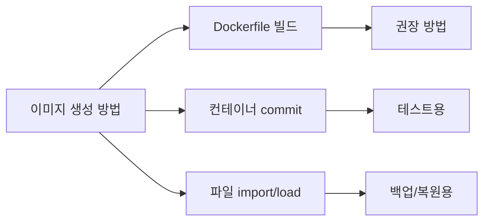
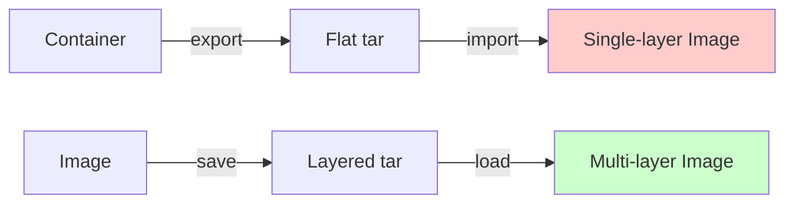
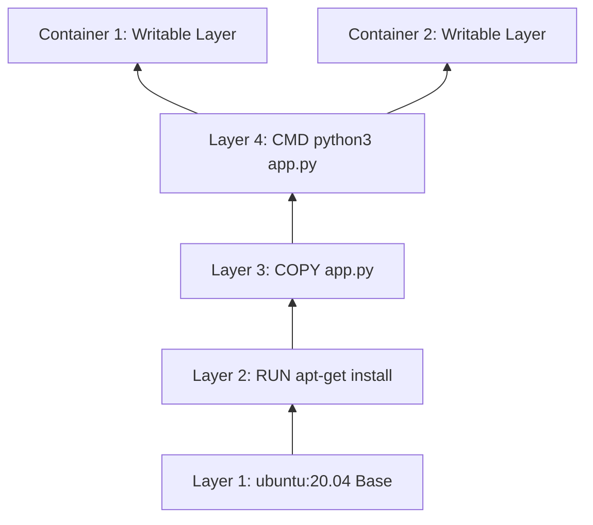

## 전체 흐름 요약

Docker를 활용한 컨테이너 기반 애플리케이션 배포의 핵심은 **사용자 정의 이미지를 효율적으로 생성하고 관리하는 것**입니다. Docker Hub에서 제공하는 공식 이미지를 그대로 사용하는 것도 가능하지만, 실제 프로젝트에서는 애플리케이션 코드, 설정 파일, 의존성 패키지 등을 포함한 **맞춤형 이미지가 필요**합니다.

이 과정에서는 Docker 이미지를 생성하는 여러 가지 방법을 학습합니다. **Dockerfile을 이용한 선언적 방식**이 가장 권장되는 방법이며, 이미지 빌드 과정을 코드로 관리하여 재현성과 버전 관리를 가능하게 합니다. Dockerfile의 다양한 명령어(FROM, RUN, COPY, CMD, ENTRYPOINT 등)를 이해하고, **이미지 레이어 구조**를 파악하여 효율적인 이미지를 구축하는 방법을 배웁니다.

또한 **commit 명령어를 통해 컨테이너의 현재 상태를 이미지로 저장하는 방법**, **export/import와 save/load를 이용한 이미지 백업 및 이전 방법**도 함께 다룹니다. 이러한 다양한 이미지 관리 기법을 익히면 개발, 테스트, 운영 환경 간의 일관성을 유지하고, 애플리케이션을 신속하게 배포할 수 있습니다.

이번 학습을 통해 **Dockerfile 작성 → 이미지 빌드 → 컨테이너 실행 → 이미지 관리**로 이어지는 전체 워크플로우를 완전히 이해하게 됩니다.

---

## 1. Dockerfile 개요

### 1-1. Dockerfile이란?

**Dockerfile**은 Docker 이미지를 생성하기 위한 **선언적 스크립트 파일**입니다. 이미지 빌드 과정을 단계별로 정의하여, 베이스 이미지부터 시작해 필요한 패키지 설치, 파일 복사, 환경 변수 설정, 실행 명령어 지정까지 모든 과정을 코드화합니다.

**Dockerfile의 장점:**

| 장점 | 설명 |
|------|------|
| **재현성** | 동일한 Dockerfile로 언제든지 같은 이미지 생성 가능 |
| **버전 관리** | Git 등의 VCS로 Dockerfile 버전 관리 |
| **자동화** | CI/CD 파이프라인에 통합하여 자동 빌드 |
| **투명성** | 이미지 구성 과정이 코드로 명확히 드러남 |
| **효율성** | 레이어 캐싱으로 빌드 시간 단축 |

### 1-2. 이미지 생성 방법 비교

Docker 이미지를 생성하는 방법은 크게 세 가지입니다:



| 방법 | 명령어 | 특징 | 용도 |
|------|--------|------|------|
| **Dockerfile** | `docker image build` | 재현 가능, 버전 관리 | **운영 환경 권장** |
| **commit** | `docker container commit` | 컨테이너 상태 저장 | 테스트, 임시 저장 |
| **import** | `docker image import` | tar 파일에서 이미지 생성 | 백업 복원 |
| **load** | `docker image load` | 레이어 포함 이미지 로드 | 이미지 이전 |

---

## 2. Dockerfile 기본 문법

### 2-1. Dockerfile 구조

Dockerfile은 **명령어(Instruction)**와 **인자(Argument)**로 구성됩니다. 각 명령어는 **대문자로 시작**하며, 한 줄에 하나의 명령어를 작성합니다.

**기본 구조:**

```dockerfile
# 주석: 베이스 이미지 지정
FROM ubuntu:20.04

# 메타데이터
LABEL maintainer="user@example.com"

# 패키지 설치
RUN apt-get update && apt-get install -y nginx

# 파일 복사
COPY index.html /var/www/html/

# 작업 디렉토리 설정
WORKDIR /app

# 환경 변수 설정
ENV APP_ENV=production

# 포트 노출
EXPOSE 80

# 컨테이너 시작 명령어
CMD ["nginx", "-g", "daemon off;"]
```

### 2-2. 주요 Dockerfile 명령어

#### 📟 `FROM` 명령어

**목적:** 베이스 이미지를 지정합니다. Dockerfile의 **첫 번째 명령어**로 반드시 필요합니다.

**기본 문법:**

```dockerfile
FROM <이미지>[:<태그>] [AS <별칭>]
```

**실행 예제:**

```dockerfile
# Ubuntu 20.04 베이스 이미지
FROM ubuntu:20.04

# 경량 Alpine Linux
FROM alpine:3.14

# 멀티 스테이지 빌드
FROM golang:1.17 AS builder
FROM alpine:3.14 AS runtime
```

**실무 팁:**
- 공식 이미지 사용 권장 (보안 업데이트 지원)
- 태그 명시 (latest 태그 사용 지양)
- 경량 이미지(alpine) 사용으로 이미지 크기 최소화

---

#### 📟 `RUN` 명령어

**목적:** 이미지 빌드 과정에서 명령어를 실행합니다. 각 RUN 명령어는 **새로운 레이어를 생성**합니다.

**기본 문법:**

```dockerfile
RUN <명령어>                          # shell 형식
RUN ["실행파일", "인자1", "인자2"]    # exec 형식
```

**주요 옵션:**

| 형식 | 설명 | 예시 |
|------|------|------|
| **shell** | 셸을 통해 실행 (`/bin/sh -c`) | `RUN apt-get update` |
| **exec** | 셸 없이 직접 실행 | `RUN ["apt-get", "update"]` |

**실행 예제:**

```dockerfile
# shell 형식 (파이프, 리다이렉션 사용 가능)
RUN apt-get update && \
    apt-get install -y nginx && \
    apt-get clean

# exec 형식 (변수 확장 불가)
RUN ["apt-get", "install", "-y", "nginx"]

# 여러 명령어를 &&로 연결하여 레이어 최소화
RUN apt-get update && \
    apt-get install -y \
        python3 \
        python3-pip \
        git && \
    rm -rf /var/lib/apt/lists/*
```

**예상 출력:**

```
Step 3/10 : RUN apt-get update && apt-get install -y nginx
 ---> Running in a3c4d5e6f7a8
Get:1 http://archive.ubuntu.com/ubuntu focal InRelease [265 kB]
...
Processing triggers for systemd (245.4-4ubuntu3) ...
Removing intermediate container a3c4d5e6f7a8
 ---> 9b8c7d6e5f4a
```

**실무 팁:**
- **레이어 최소화**: 관련 명령어를 `&&`로 연결
- **캐시 무효화 방지**: 자주 변경되는 명령어는 나중에 배치
- **패키지 캐시 삭제**: `rm -rf /var/lib/apt/lists/*`로 이미지 크기 감소

---

#### 📟 `COPY`와 `ADD` 명령어

**목적:** 호스트의 파일/디렉토리를 이미지로 복사합니다.

**기본 문법:**

```dockerfile
COPY <src>... <dest>
ADD <src>... <dest>
```

**COPY vs ADD 비교:**

| 명령어 | 기능 | 권장 사용 |
|--------|------|-----------|
| **COPY** | 단순 파일 복사 | **대부분의 경우 권장** |
| **ADD** | 복사 + tar 자동 압축 해제 + URL 다운로드 | tar 압축 해제 시에만 |

**실행 예제:**

```dockerfile
# 단일 파일 복사
COPY index.html /var/www/html/

# 여러 파일 복사
COPY *.conf /etc/nginx/conf.d/

# 디렉토리 복사
COPY ./app /opt/app

# 소유권 변경 (--chown)
COPY --chown=nginx:nginx ./html /var/www/html

# ADD로 tar 파일 자동 압축 해제
ADD archive.tar.gz /opt/
```

**.dockerignore 파일:**

빌드 컨텍스트에서 제외할 파일을 지정합니다.

```
# .dockerignore
node_modules
.git
*.log
.env
```

**실무 팁:**
- COPY 사용 권장 (명확한 의도)
- .dockerignore로 불필요한 파일 제외
- 자주 변경되는 파일은 나중에 COPY (캐시 활용)

---

#### 📟 `WORKDIR` 명령어

**목적:** 이후 명령어의 작업 디렉토리를 설정합니다.

**기본 문법:**

```dockerfile
WORKDIR <경로>
```

**실행 예제:**

```dockerfile
# 작업 디렉토리 설정
WORKDIR /app

# 상대 경로 사용 가능
WORKDIR /opt
WORKDIR myapp    # /opt/myapp

# 환경 변수 사용
ENV APPDIR=/app
WORKDIR ${APPDIR}
```

**WORKDIR 사용 전:**

```dockerfile
RUN cd /app && python3 setup.py install
RUN cd /app && python3 app.py    # 새로운 레이어, cd 효과 없음
```

**WORKDIR 사용 후:**

```dockerfile
WORKDIR /app
RUN python3 setup.py install
RUN python3 app.py    # /app에서 실행됨
```

**실무 팁:**
- 절대 경로 사용 권장
- `cd` 대신 WORKDIR 사용
- 디렉토리가 없으면 자동 생성

---

#### 📟 `ENV`와 `ARG` 명령어

**목적:** 환경 변수를 설정합니다.

**ENV vs ARG:**

| 명령어 | 범위 | 지속성 | 사용 시점 |
|--------|------|--------|-----------|
| **ENV** | 빌드 + 런타임 | 컨테이너에서 유지 | 애플리케이션 설정 |
| **ARG** | 빌드만 | 빌드 후 사라짐 | 빌드 시 변수 전달 |

**기본 문법:**

```dockerfile
ENV <key>=<value> [<key>=<value> ...]
ARG <name>[=<default value>]
```

**실행 예제:**

```dockerfile
# ENV: 런타임에도 사용 가능
ENV NODE_ENV=production \
    APP_PORT=3000

# ARG: 빌드 시에만 사용
ARG VERSION=1.0
ARG BUILD_DATE

# ARG를 ENV로 변환
ARG VERSION
ENV APP_VERSION=${VERSION}

# 빌드 시 ARG 전달
# docker image build --build-arg VERSION=2.0 .
```

**예상 출력:**

```bash
# 컨테이너에서 ENV 확인
$ docker container run myimage env
NODE_ENV=production
APP_PORT=3000
APP_VERSION=1.0
```

**실무 팁:**
- 민감한 정보는 ENV 대신 secret 사용
- ARG는 빌드 시 유연성 제공 (버전, 날짜 등)
- ENV는 애플리케이션 설정용

---

#### 📟 `EXPOSE` 명령어

**목적:** 컨테이너가 리스닝할 포트를 문서화합니다. 실제 포트 바인딩은 **`-p` 옵션으로 별도 지정**해야 합니다.

**기본 문법:**

```dockerfile
EXPOSE <port> [<port>/<protocol>...]
```

**실행 예제:**

```dockerfile
# HTTP 포트
EXPOSE 80

# 여러 포트
EXPOSE 80 443

# TCP/UDP 프로토콜 명시
EXPOSE 53/tcp
EXPOSE 53/udp
```

**컨테이너 실행 시:**

```bash
# EXPOSE는 문서화일 뿐, 실제로는 -p 옵션 필요
$ docker container run -d -p 8080:80 myimage
```

**실무 팁:**
- EXPOSE는 **메타데이터**일 뿐 실제 바인딩 아님
- 문서화 목적으로 사용
- `-P` 옵션으로 EXPOSE된 모든 포트 자동 매핑

---

#### 📟 `CMD`와 `ENTRYPOINT` 명령어

**목적:** 컨테이너 시작 시 실행할 명령어를 지정합니다.

**CMD vs ENTRYPOINT:**

| 명령어 | 역할 | 오버라이드 |
|--------|------|------------|
| **CMD** | 기본 실행 명령어 | `docker run` 인자로 대체 가능 |
| **ENTRYPOINT** | 고정 실행 명령어 | `--entrypoint` 옵션으로만 대체 가능 |

**기본 문법:**

```dockerfile
CMD ["실행파일", "인자1", "인자2"]         # exec 형식 (권장)
CMD 명령어 인자1 인자2                      # shell 형식

ENTRYPOINT ["실행파일", "인자1"]
```

**실행 예제:**

```dockerfile
# CMD만 사용
FROM ubuntu:20.04
CMD ["echo", "Hello Docker"]

# ENTRYPOINT만 사용
FROM ubuntu:20.04
ENTRYPOINT ["echo"]

# ENTRYPOINT + CMD 조합
FROM ubuntu:20.04
ENTRYPOINT ["echo"]
CMD ["Hello Docker"]
```

**동작 비교:**

| Dockerfile | 실행 명령어 | 결과 |
|------------|-------------|------|
| `CMD ["echo", "A"]` | `docker run myimage` | `echo A` |
| `CMD ["echo", "A"]` | `docker run myimage echo B` | `echo B` (CMD 무시) |
| `ENTRYPOINT ["echo"]`<br>`CMD ["A"]` | `docker run myimage` | `echo A` |
| `ENTRYPOINT ["echo"]`<br>`CMD ["A"]` | `docker run myimage B` | `echo B` (CMD만 대체) |

**실무 팁:**
- **ENTRYPOINT**: 실행 파일 지정
- **CMD**: 기본 인자 제공
- 조합 사용으로 유연성 확보

---

#### 📟 `USER` 명령어

**목적:** 이후 명령어를 실행할 사용자를 지정합니다.

**기본 문법:**

```dockerfile
USER <user>[:<group>]
USER <UID>[:<GID>]
```

**실행 예제:**

```dockerfile
FROM ubuntu:20.04

# 사용자 생성
RUN groupadd -r appuser && \
    useradd -r -g appuser appuser

# 사용자 전환
USER appuser

# 이후 명령어는 appuser로 실행
WORKDIR /home/appuser
COPY --chown=appuser:appuser ./app ./

CMD ["python3", "app.py"]
```

**실무 팁:**
- **보안**: root 대신 일반 사용자 사용
- 파일 소유권은 `--chown` 옵션으로 설정
- UID/GID 직접 지정 가능

---

#### 📟 `VOLUME` 명령어

**목적:** 컨테이너의 특정 경로를 볼륨으로 마운트합니다.

**기본 문법:**

```dockerfile
VOLUME ["<경로1>", "<경로2>"]
VOLUME <경로>
```

**실행 예제:**

```dockerfile
FROM nginx:alpine

# 데이터 영속성이 필요한 디렉토리
VOLUME ["/var/www/html", "/var/log/nginx"]
```

**컨테이너 실행 시:**

```bash
# Dockerfile의 VOLUME은 익명 볼륨 생성
$ docker container run -d myimage

# 명시적 볼륨 지정 권장
$ docker container run -d -v mydata:/var/www/html myimage
```

**실무 팁:**
- Dockerfile의 VOLUME은 **문서화** 목적
- 실행 시 `-v` 옵션으로 명시적 볼륨 지정 권장

---

#### 📟 기타 명령어

**LABEL:** 메타데이터 추가

```dockerfile
LABEL version="1.0" \
      description="My Application" \
      maintainer="user@example.com"
```

**ONBUILD:** 자식 이미지 빌드 시 실행

```dockerfile
# 베이스 이미지에서
ONBUILD COPY . /app
ONBUILD RUN make

# 자식 이미지에서 FROM 시 자동 실행됨
```

**SHELL:** 기본 셸 변경

```dockerfile
SHELL ["/bin/bash", "-c"]
```

**STOPSIGNAL:** 컨테이너 종료 시그널 설정

```dockerfile
STOPSIGNAL SIGTERM
```

**HEALTHCHECK:** 컨테이너 상태 확인

```dockerfile
HEALTHCHECK --interval=30s --timeout=3s \
  CMD curl -f http://localhost/ || exit 1
```

---

## 3. 이미지 빌드 실습

### 3-1. 간단한 웹 서버 이미지 만들기

**목표:** Ubuntu 베이스에 Apache2를 설치하고 커스텀 HTML 페이지를 서빙하는 이미지를 생성합니다.

#### 작업 디렉토리 준비

```bash
$ mkdir ~/mywebserver && cd ~/mywebserver
```

#### HTML 파일 작성

```bash
$ cat > index.html <<'EOF'
<!DOCTYPE html>
<html>
<head>
    <title>My Web Server</title>
</head>
<body>
    <h1>Docker Custom Image</h1>
    <p>This is a custom Apache web server running in Docker.</p>
</body>
</html>
EOF
```

#### Dockerfile 작성

```dockerfile
# ~/mywebserver/Dockerfile
FROM ubuntu:20.04

# 메타데이터
LABEL maintainer="user@example.com" \
      version="1.0"

# 비대화형 설치
ENV DEBIAN_FRONTEND=noninteractive

# Apache2 설치
RUN apt-get update && \
    apt-get install -y apache2 && \
    apt-get clean && \
    rm -rf /var/lib/apt/lists/*

# 커스텀 HTML 복사
COPY index.html /var/www/html/

# 작업 디렉토리
WORKDIR /var/www/html

# 포트 노출
EXPOSE 80

# Apache2 포그라운드 실행
CMD ["apachectl", "-D", "FOREGROUND"]
```

#### 이미지 빌드

```bash
$ docker image build -t mywebserver:1.0 .
```

**예상 출력:**

```
Sending build context to Docker daemon  3.072kB
Step 1/8 : FROM ubuntu:20.04
 ---> 7e0aa2d69a15
Step 2/8 : LABEL maintainer="user@example.com" version="1.0"
 ---> Running in a1b2c3d4e5f6
 ---> 9a8b7c6d5e4f
Step 3/8 : ENV DEBIAN_FRONTEND=noninteractive
 ---> Running in b2c3d4e5f6a7
 ---> 8b9c0d1e2f3a
Step 4/8 : RUN apt-get update && apt-get install -y apache2 && apt-get clean && rm -rf /var/lib/apt/lists/*
 ---> Running in c3d4e5f6a7b8
...
Step 8/8 : CMD ["apachectl", "-D", "FOREGROUND"]
 ---> Running in f6a7b8c9d0e1
 ---> 5e4f3a2b1c0d
Successfully built 5e4f3a2b1c0d
Successfully tagged mywebserver:1.0
```

#### 이미지 확인

```bash
$ docker image ls mywebserver
```

**예상 출력:**

```
REPOSITORY     TAG       IMAGE ID       CREATED          SIZE
mywebserver    1.0       5e4f3a2b1c0d   2 minutes ago    224MB
```

#### 컨테이너 실행 및 테스트

```bash
# 컨테이너 실행
$ docker container run -d --name web1 -p 8080:80 mywebserver:1.0

# 테스트
$ curl http://localhost:8080
<!DOCTYPE html>
<html>
<head>
    <title>My Web Server</title>
</head>
<body>
    <h1>Docker Custom Image</h1>
    <p>This is a custom Apache web server running in Docker.</p>
</body>
</html>
```

---

### 3-2. 멀티 스테이지 빌드

**목적:** 빌드 환경과 런타임 환경을 분리하여 **최종 이미지 크기를 최소화**합니다.

**Dockerfile 예제 (Go 애플리케이션):**

```dockerfile
# ========== 빌드 스테이지 ==========
FROM golang:1.17 AS builder

WORKDIR /build

# 소스 복사 및 빌드
COPY main.go .
RUN go build -o myapp main.go

# ========== 런타임 스테이지 ==========
FROM alpine:3.14

# 빌드 스테이지에서 바이너리만 복사
COPY --from=builder /build/myapp /usr/local/bin/

# 실행
CMD ["myapp"]
```

**이미지 크기 비교:**

| 빌드 방식 | 이미지 크기 |
|----------|------------|
| 단일 스테이지 (golang:1.17 베이스) | ~800MB |
| 멀티 스테이지 (alpine:3.14 베이스) | ~10MB |

**빌드 및 확인:**

```bash
$ docker image build -t myapp:multistage .
$ docker image ls myapp
```

**실무 팁:**
- 컴파일 언어(Go, Java, C++)에서 효과적
- 개발 도구, 소스 코드는 최종 이미지에 불포함
- `--from` 옵션으로 특정 스테이지에서 파일 복사

---

### 3-3. 빌드 컨텍스트와 .dockerignore

**빌드 컨텍스트:** `docker image build` 실행 시 Docker 데몬에 전송되는 파일들입니다.

```bash
# 현재 디렉토리의 모든 파일이 빌드 컨텍스트
$ docker image build -t myimage .
```

**문제:**

```bash
# node_modules, .git 등 불필요한 파일도 전송
Sending build context to Docker daemon  523.4MB
```

**해결: .dockerignore 작성**

```
# .dockerignore
node_modules
.git
.env
*.log
.vscode
__pycache__
*.pyc
.DS_Store
```

**효과:**

```bash
# 빌드 컨텍스트 크기 감소
Sending build context to Docker daemon  12.8MB
```

**실무 팁:**
- .dockerignore는 .gitignore와 유사
- 빌드 속도 향상
- 민감한 파일(.env) 제외

---

## 4. 컨테이너를 이미지로 변환 (commit)

### 4-1. commit 명령어

**목적:** 실행 중인 컨테이너의 현재 상태를 새로운 이미지로 저장합니다.

**기본 문법:**

```bash
docker container commit [OPTIONS] CONTAINER [REPOSITORY[:TAG]]
```

**주요 옵션:**

| 옵션 | 의미 | 예시 |
|------|------|------|
| `-a` | 작성자 정보 | `-a "user@example.com"` |
| `-m` | 커밋 메시지 | `-m "Add custom config"` |
| `-c` | Dockerfile 명령어 적용 | `-c 'CMD ["/start.sh"]'` |
| `-p` | 커밋 중 컨테이너 일시 정지 | `-p` |

### 4-2. commit 실습

#### 베이스 컨테이너 실행

```bash
# Ubuntu 컨테이너 실행
$ docker container run -it --name myubuntu ubuntu:20.04 /bin/bash
```

#### 컨테이너 내부에서 작업

```bash
# 컨테이너 내부
root@a1b2c3d4e5f6:/# apt-get update
root@a1b2c3d4e5f6:/# apt-get install -y curl vim
root@a1b2c3d4e5f6:/# echo "Custom Configuration" > /etc/myconfig.txt
root@a1b2c3d4e5f6:/# exit
```

#### 컨테이너를 이미지로 커밋

```bash
$ docker container commit \
  -a "user@example.com" \
  -m "Added curl, vim, and custom config" \
  myubuntu \
  myubuntu:custom

sha256:9a8b7c6d5e4f3a2b1c0d9e8f7a6b5c4d3e2f1a0b9c8d7e6f5a4b3c2d1e0f
```

#### 새 이미지 확인

```bash
$ docker image ls myubuntu
```

**예상 출력:**

```
REPOSITORY   TAG       IMAGE ID       CREATED          SIZE
myubuntu     custom    9a8b7c6d5e4f   10 seconds ago   178MB
ubuntu       20.04     7e0aa2d69a15   2 weeks ago      72.8MB
```

#### 이미지 히스토리 확인

```bash
$ docker image history myubuntu:custom
```

**예상 출력:**

```
IMAGE          CREATED              CREATED BY          SIZE      COMMENT
9a8b7c6d5e4f   About a minute ago   /bin/bash           105MB     Added curl, vim, and custom config
7e0aa2d69a15   2 weeks ago          /bin/sh -c #(nop)   72.8MB
```

### 4-3. commit vs Dockerfile

| 항목 | commit | Dockerfile |
|------|--------|------------|
| **재현성** | 낮음 (수동 작업) | 높음 (자동화) |
| **버전 관리** | 어려움 | 용이 (Git) |
| **투명성** | 불명확 (블랙박스) | 명확 (코드로 표현) |
| **사용 사례** | 테스트, 임시 저장 | **운영 환경 권장** |

**실무 팁:**
- commit은 **개발/테스트 목적**으로만 사용
- 운영 이미지는 반드시 **Dockerfile로 관리**
- commit 후 Dockerfile로 변환 권장

---

## 5. 이미지 백업 및 복원

### 5-1. export/import (컨테이너 → tar → 이미지)

**export:** 컨테이너의 파일시스템을 tar 파일로 내보냅니다.
**import:** tar 파일을 이미지로 가져옵니다.

#### 📟 `docker container export` 명령어

**목적:** 컨테이너의 파일시스템을 tar 아카이브로 저장합니다.

**기본 문법:**

```bash
docker container export CONTAINER > file.tar
docker container export -o file.tar CONTAINER
```

**실행 예제:**

```bash
# 컨테이너 실행 및 작업
$ docker container run -d --name web nginx:alpine
$ docker container exec web sh -c "echo 'Custom' > /tmp/data.txt"

# 컨테이너를 tar 파일로 내보내기
$ docker container export -o web-backup.tar web

# 파일 확인
$ ls -lh web-backup.tar
-rw-r--r-- 1 user user 7.8M Dec  3 10:30 web-backup.tar
```

#### 📟 `docker image import` 명령어

**목적:** tar 파일을 Docker 이미지로 가져옵니다.

**기본 문법:**

```bash
docker image import [OPTIONS] file|URL|- [REPOSITORY[:TAG]]
```

**주요 옵션:**

| 옵션 | 의미 | 예시 |
|------|------|------|
| `-c` | Dockerfile 명령어 적용 | `-c 'CMD ["/start.sh"]'` |
| `-m` | 커밋 메시지 | `-m "Imported from backup"` |

**실행 예제:**

```bash
# tar 파일을 이미지로 가져오기
$ docker image import \
  -c 'CMD ["/bin/sh"]' \
  -m "Restored from web-backup.tar" \
  web-backup.tar \
  web:restored

sha256:1a2b3c4d5e6f7a8b9c0d1e2f3a4b5c6d7e8f9a0b1c2d3e4f5a6b7c8d9e0f

# 이미지 확인
$ docker image ls web
```

**예상 출력:**

```
REPOSITORY   TAG        IMAGE ID       CREATED          SIZE
web          restored   1a2b3c4d5e6f   5 seconds ago    7.8MB
```

#### export/import 특징

| 특징 | 설명 |
|------|------|
| **레이어 손실** | 모든 레이어가 하나로 합쳐짐 (flatten) |
| **메타데이터 손실** | CMD, ENTRYPOINT, ENV 등 손실 → `-c` 옵션으로 재지정 필요 |
| **용도** | 컨테이너 상태 백업, 파일시스템 이전 |

---

### 5-2. save/load (이미지 → tar → 이미지)

**save:** 이미지를 레이어와 메타데이터를 포함한 tar 파일로 저장합니다.
**load:** tar 파일을 이미지로 로드합니다.

#### 📟 `docker image save` 명령어

**목적:** 이미지를 tar 파일로 저장합니다. **레이어와 메타데이터 모두 보존**됩니다.

**기본 문법:**

```bash
docker image save [OPTIONS] IMAGE [IMAGE...]
```

**주요 옵션:**

| 옵션 | 의미 | 예시 |
|------|------|------|
| `-o` | 출력 파일 지정 | `-o myimage.tar` |

**실행 예제:**

```bash
# 단일 이미지 저장
$ docker image save -o nginx-alpine.tar nginx:alpine

# 여러 이미지 동시 저장
$ docker image save -o myimages.tar nginx:alpine ubuntu:20.04 redis:alpine

# 파일 확인
$ ls -lh nginx-alpine.tar
-rw------- 1 user user 42M Dec  3 10:35 nginx-alpine.tar
```

#### 📟 `docker image load` 명령어

**목적:** tar 파일에서 이미지를 로드합니다.

**기본 문법:**

```bash
docker image load [OPTIONS]
```

**주요 옵션:**

| 옵션 | 의미 | 예시 |
|------|------|------|
| `-i` | 입력 파일 지정 | `-i myimage.tar` |
| `-q` | 출력 최소화 | `-q` |

**실행 예제:**

```bash
# 이미지 삭제 (테스트)
$ docker image rm nginx:alpine

# tar 파일에서 이미지 로드
$ docker image load -i nginx-alpine.tar
```

**예상 출력:**

```
Loaded image: nginx:alpine
```

#### save/load 특징

| 특징 | 설명 |
|------|------|
| **레이어 보존** | 모든 레이어 정보 유지 |
| **메타데이터 보존** | CMD, ENTRYPOINT, ENV 등 모두 보존 |
| **용도** | 이미지 백업, 오프라인 환경 이전 |

---

### 5-3. export/import vs save/load 비교



| 항목 | export/import | save/load |
|------|---------------|-----------|
| **대상** | 컨테이너 파일시스템 | 이미지 |
| **레이어** | 손실 (flatten) | 보존 |
| **메타데이터** | 손실 (재지정 필요) | 보존 |
| **파일 크기** | 상대적으로 작음 | 상대적으로 큼 |
| **사용 사례** | 컨테이너 상태 백업 | **이미지 백업/이전** |

**실무 권장:**
- **이미지 백업/이전**: save/load 사용
- **컨테이너 파일시스템 이전**: export/import 사용

---

## 6. 이미지 레이어 구조

### 6-1. 레이어 시스템

Docker 이미지는 **여러 개의 읽기 전용 레이어**가 쌓인 구조입니다. 각 Dockerfile 명령어는 새로운 레이어를 생성합니다.



**레이어 시스템 장점:**

| 장점 | 설명 |
|------|------|
| **저장 공간 효율** | 동일 베이스 이미지를 여러 이미지가 공유 |
| **빌드 속도 향상** | 변경되지 않은 레이어는 캐시 활용 |
| **배포 효율** | 변경된 레이어만 전송 |

### 6-2. 레이어 확인

```bash
# 이미지 레이어 보기
$ docker image history mywebserver:1.0
```

**예상 출력:**

```
IMAGE          CREATED        CREATED BY                                      SIZE      COMMENT
5e4f3a2b1c0d   10 minutes ago CMD ["apachectl" "-D" "FOREGROUND"]             0B
4f3a2b1c0d9e   10 minutes ago EXPOSE 80                                       0B
3a2b1c0d9e8f   10 minutes ago COPY index.html /var/www/html/                  2.1kB
2b1c0d9e8f7a   10 minutes ago RUN apt-get update && apt-get install -y ...    151MB
1c0d9e8f7a6b   10 minutes ago ENV DEBIAN_FRONTEND=noninteractive              0B
0d9e8f7a6b5c   10 minutes ago LABEL maintainer=user@example.com version=1.0   0B
7e0aa2d69a15   2 weeks ago    /bin/sh -c #(nop) CMD ["/bin/bash"]             0B
<missing>      2 weeks ago    /bin/sh -c #(nop) ADD file:...                  72.8MB
```

### 6-3. 레이어 캐싱 최적화

**나쁜 예 (캐시 미활용):**

```dockerfile
FROM ubuntu:20.04
COPY . /app                # 소스 코드 변경 시 아래 레이어 모두 재빌드
RUN apt-get update && \
    apt-get install -y python3 python3-pip
WORKDIR /app
RUN pip3 install -r requirements.txt
CMD ["python3", "app.py"]
```

**좋은 예 (캐시 활용):**

```dockerfile
FROM ubuntu:20.04

# 의존성 설치 먼저 (자주 변경 안 됨)
RUN apt-get update && \
    apt-get install -y python3 python3-pip

WORKDIR /app

# requirements.txt만 먼저 복사
COPY requirements.txt .
RUN pip3 install -r requirements.txt

# 소스 코드는 나중에 복사 (자주 변경됨)
COPY . .

CMD ["python3", "app.py"]
```

**캐싱 원칙:**
1. **자주 변경되지 않는 명령어를 앞에 배치**
2. **의존성 파일과 소스 코드 분리**
3. **RUN 명령어 최소화**

---

## 7. 실전 Dockerfile 예제

### 7-1. Node.js 애플리케이션

```dockerfile
# ========== 베이스 이미지 ==========
FROM node:16-alpine AS base

# 작업 디렉토리
WORKDIR /app

# 의존성 파일 복사
COPY package*.json ./

# ========== 개발 환경 ==========
FROM base AS development
ENV NODE_ENV=development
RUN npm install
COPY . .
EXPOSE 3000
CMD ["npm", "run", "dev"]

# ========== 프로덕션 빌드 ==========
FROM base AS builder
RUN npm ci --only=production

# ========== 프로덕션 환경 ==========
FROM node:16-alpine AS production
ENV NODE_ENV=production
WORKDIR /app

# 빌드 결과만 복사
COPY --from=builder /app/node_modules ./node_modules
COPY . .

# 일반 사용자로 실행
USER node

EXPOSE 3000
CMD ["node", "server.js"]
```

**빌드:**

```bash
# 개발 환경
$ docker image build --target development -t myapp:dev .

# 프로덕션 환경
$ docker image build --target production -t myapp:prod .
```

---

### 7-2. Python Flask 애플리케이션

```dockerfile
FROM python:3.9-slim

# 시스템 패키지 업데이트
RUN apt-get update && \
    apt-get install -y --no-install-recommends gcc && \
    apt-get clean && \
    rm -rf /var/lib/apt/lists/*

# 작업 디렉토리
WORKDIR /app

# 의존성 설치
COPY requirements.txt .
RUN pip install --no-cache-dir -r requirements.txt

# 애플리케이션 코드 복사
COPY . .

# 일반 사용자 생성 및 전환
RUN useradd -m appuser && chown -R appuser:appuser /app
USER appuser

# 환경 변수
ENV FLASK_APP=app.py \
    FLASK_ENV=production

EXPOSE 5000

# 헬스체크
HEALTHCHECK --interval=30s --timeout=3s --start-period=5s --retries=3 \
  CMD python -c "import requests; requests.get('http://localhost:5000/health')"

# 실행
CMD ["gunicorn", "--bind", "0.0.0.0:5000", "app:app"]
```

---

### 7-3. Java Spring Boot 애플리케이션

```dockerfile
# ========== 빌드 스테이지 ==========
FROM maven:3.8-openjdk-17 AS builder

WORKDIR /build

# pom.xml 먼저 복사 (의존성 캐싱)
COPY pom.xml .
RUN mvn dependency:go-offline

# 소스 코드 복사 및 빌드
COPY src ./src
RUN mvn clean package -DskipTests

# ========== 런타임 스테이지 ==========
FROM openjdk:17-jdk-slim

WORKDIR /app

# 빌드 결과물만 복사
COPY --from=builder /build/target/*.jar app.jar

# JVM 옵션
ENV JAVA_OPTS="-Xmx512m -Xms256m"

EXPOSE 8080

# 헬스체크
HEALTHCHECK --interval=30s --timeout=3s \
  CMD curl -f http://localhost:8080/actuator/health || exit 1

# 실행
ENTRYPOINT ["sh", "-c", "java $JAVA_OPTS -jar app.jar"]
```

---

## 주요 개념 요약표

| 구분 | 주요 개념 | 설명 |
|------|----------|------|
| **Dockerfile 명령어** | FROM | 베이스 이미지 지정 |
| | RUN | 빌드 시 명령어 실행 (레이어 생성) |
| | COPY / ADD | 파일 복사 (COPY 권장) |
| | WORKDIR | 작업 디렉토리 설정 |
| | ENV / ARG | 환경 변수 설정 (ENV: 런타임, ARG: 빌드) |
| | EXPOSE | 포트 노출 (문서화) |
| | CMD / ENTRYPOINT | 컨테이너 시작 명령어 |
| | USER | 실행 사용자 지정 |
| **이미지 빌드** | docker image build | Dockerfile로 이미지 생성 |
| | 빌드 컨텍스트 | 빌드 시 전송되는 파일들 |
| | .dockerignore | 빌드 컨텍스트에서 제외할 파일 지정 |
| | 멀티 스테이지 빌드 | 빌드/런타임 환경 분리로 이미지 크기 최소화 |
| **이미지 관리** | docker container commit | 컨테이너 → 이미지 (테스트용) |
| | export / import | 컨테이너 파일시스템 백업/복원 (레이어 손실) |
| | save / load | 이미지 백업/복원 (레이어 보존) |
| **레이어 시스템** | 레이어 구조 | 읽기 전용 레이어 + 쓰기 가능 레이어 |
| | 레이어 캐싱 | 변경되지 않은 레이어 재사용 |
| | 캐싱 최적화 | 자주 변경되는 명령어는 뒤에 배치 |

---

## 마무리

이번 Part 4에서는 **Dockerfile을 이용한 사용자 정의 이미지 생성 방법**을 심도 있게 학습했습니다. Dockerfile의 다양한 명령어(FROM, RUN, COPY, CMD, ENTRYPOINT 등)를 이해하고, 실습을 통해 웹 서버 이미지를 직접 만들어보았습니다. 또한 **멀티 스테이지 빌드**를 활용하여 이미지 크기를 최소화하는 기법과, **레이어 캐싱**을 최적화하여 빌드 속도를 향상시키는 방법을 익혔습니다.

**commit, export/import, save/load** 등 다양한 이미지 관리 방법을 비교하며, 각각의 용도와 특징을 명확히 이해했습니다. 운영 환경에서는 **Dockerfile을 통한 선언적 이미지 관리**가 필수이며, commit은 테스트 목적으로만 제한적으로 사용해야 함을 알게 되었습니다.

실전 예제(Node.js, Python Flask, Java Spring Boot)를 통해 **언어별 Dockerfile 작성 패턴**을 파악하고, 보안(USER 명령어), 헬스체크(HEALTHCHECK), 멀티 스테이지 빌드 등 **프로덕션 환경에 적합한 베스트 프랙티스**를 배웠습니다.

다음 Part 5에서는 여러 컨테이너를 조합하여 애플리케이션 스택을 구성하는 **Docker Compose**를 학습하여, 복잡한 멀티 컨테이너 환경을 선언적으로 관리하는 방법을 익히게 됩니다. Docker Compose를 활용하면 웹 서버, 데이터베이스, 캐시 서버 등을 하나의 설정 파일로 통합 관리할 수 있습니다.
