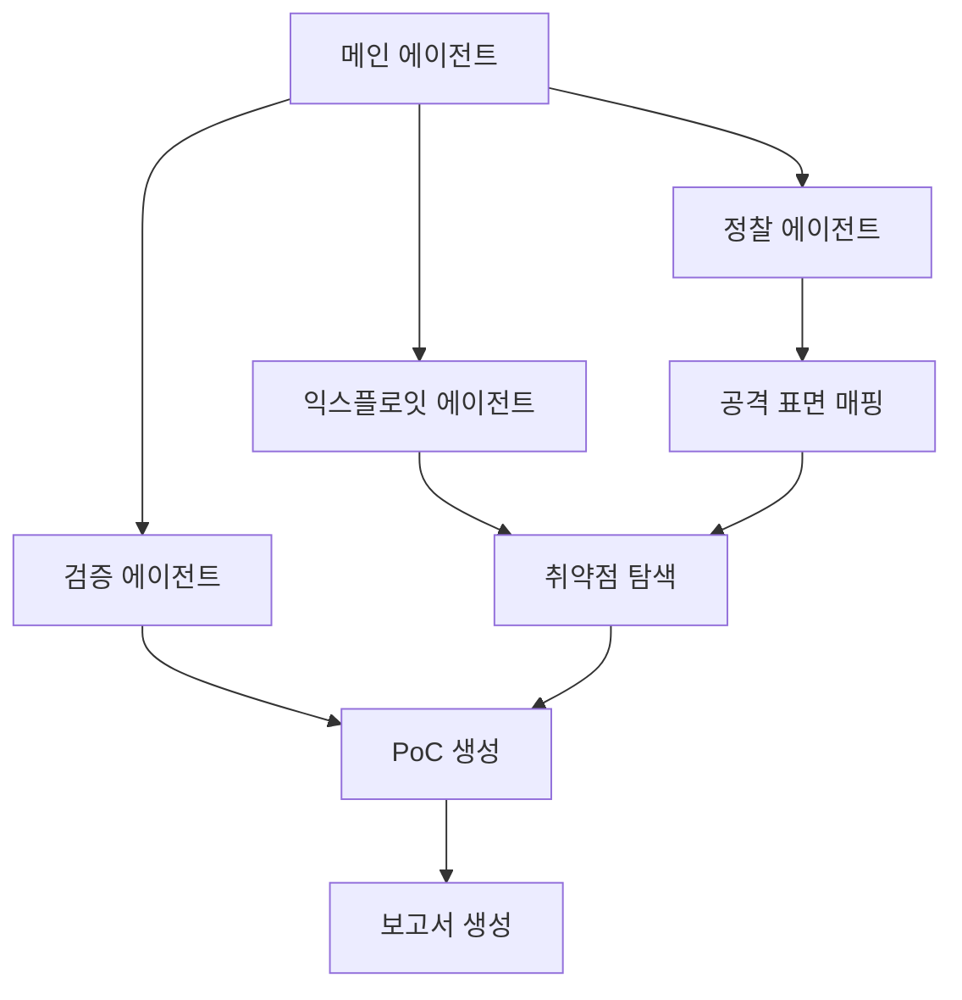

## 들어가며

보안 테스팅은 항상 딜레마가 있었습니다. 정적 분석 도구는 빠르지만 오탐률이 높고, 수동 펜테스팅은 정확하지만 시간과 비용이 많이 듭니다. 그렇다면 AI가 실제 해커처럼 동작하면서 자동으로 취약점을 찾고 검증할 수 있다면 어떨까요?

오늘 소개할 **Strix**는 바로 이런 문제를 해결하기 위한 도구입니다. AI 에이전트가 실제로 코드를 실행하고, 취약점을 찾아내고, PoC(Proof of Concept)로 검증하는 자동화된 보안 테스팅 도구입니다.

## Strix란?

Strix는 자율적으로 작동하는 AI 해커 에이전트들의 집합체입니다. 단순히 코드를 스캔하는 것이 아니라, 실제 해커가 하는 것처럼 애플리케이션을 동적으로 실행하고, 취약점을 찾아내고, 실제 공격이 가능한지 검증합니다.

### 기존 도구들과의 차이점

**정적 분석 도구(SAST)의 문제**
- 높은 오탐률 (False Positive)
- 실제 공격 가능 여부를 알 수 없음
- 비즈니스 로직 취약점 탐지 어려움

**수동 펜테스팅의 문제**
- 높은 비용과 긴 소요 시간
- 전문가 의존도가 높음
- 규모 확장이 어려움

**Strix의 접근 방식**
- 실시간으로 취약점을 검증
- PoC를 자동 생성하여 오탐률 최소화
- 시간과 비용을 대폭 절감
- CI/CD 파이프라인에 통합 가능

## 주요 기능 및 특징

### 1. 강력한 에이전트 도구킷

Strix 에이전트들은 다음과 같은 도구들을 갖추고 있습니다:

- **Full HTTP Proxy**: 요청/응답 조작 및 분석
- **브라우저 자동화**: XSS, CSRF, 인증 플로우 테스팅을 위한 멀티탭 브라우저
- **터미널 환경**: 명령 실행 및 테스팅을 위한 대화형 셸
- **Python 런타임**: 커스텀 익스플로잇 개발 및 검증
- **정찰 도구**: 자동화된 OSINT 및 공격 표면 매핑
- **코드 분석**: 정적 및 동적 분석 기능
- **지식 관리**: 구조화된 발견 사항 및 공격 문서화

### 2. 포괄적인 취약점 탐지

Strix가 탐지할 수 있는 취약점 유형:

- **접근 제어**: IDOR, 권한 상승, 인증 우회
- **인젝션 공격**: SQL, NoSQL, 명령 인젝션
- **서버 사이드**: SSRF, XXE, 역직렬화 취약점
- **클라이언트 사이드**: XSS, 프로토타입 오염, DOM 취약점
- **비즈니스 로직**: 레이스 컨디션, 워크플로우 조작
- **인증**: JWT 취약점, 세션 관리
- **인프라**: 설정 오류, 노출된 서비스

### 3. Graph of Agents

고급 멀티 에이전트 오케스트레이션:



- **분산 워크플로우**: 다양한 공격과 자산에 특화된 에이전트들
- **확장 가능한 테스팅**: 빠른 포괄적 커버리지를 위한 병렬 실행
- **동적 협업**: 에이전트들이 발견 사항을 공유하고 협력

## 설치 및 설정

### 사전 요구사항

- Docker (실행 중이어야 함)
- Python 3.12 이상
- LLM 프로바이더 API 키 (OpenAI, Anthropic 등)

### 설치 과정

```bash
# Strix 설치
pipx install strix-agent

# AI 프로바이더 설정
export STRIX_LLM="openai/gpt-5"
export LLM_API_KEY="your-api-key"

# 첫 번째 보안 평가 실행
strix --target ./app-directory
```

> **참고**: 첫 실행 시 자동으로 샌드박스 Docker 이미지를 다운로드합니다. 결과는 `strix_runs/<run-name>` 디렉토리에 저장됩니다.

### 환경 변수 설정

```bash
export STRIX_LLM="openai/gpt-5"
export LLM_API_KEY="your-api-key"

# 선택사항
export LLM_API_BASE="your-api-base-url"  # 로컬 모델 사용 시 (Ollama, LMStudio)
export PERPLEXITY_API_KEY="your-api-key"  # 검색 기능 사용 시
```

**추천 모델**:
- OpenAI의 GPT-5 (`openai/gpt-5`)
- Anthropic의 Claude Sonnet 4.5 (`anthropic/claude-sonnet-4-5`)

## 실습 및 시연

### 기본 사용법

```bash
# 로컬 코드베이스 스캔
strix --target ./app-directory

# GitHub 저장소 보안 검토
strix --target https://github.com/org/repo

# 블랙박스 웹 애플리케이션 평가
strix --target https://your-app.com
```

### 고급 테스팅 시나리오

```bash
# 그레이박스 인증 테스팅
strix --target https://your-app.com --instruction "Perform authenticated testing using credentials: user:pass"

# 멀티 타겟 테스팅 (소스 코드 + 배포된 앱)
strix -t https://github.com/org/app -t https://your-app.com

# 특정 영역에 집중하는 테스팅
strix --target api.your-app.com --instruction "Focus on business logic flaws and IDOR vulnerabilities"
```

### Headless 모드

서버나 자동화 작업에 적합한 비대화형 모드:

```bash
strix -n --target https://your-app.com
```

취약점이 발견되면 0이 아닌 종료 코드를 반환하여 CI/CD 파이프라인에서 활용할 수 있습니다.

## CI/CD 통합

GitHub Actions를 사용한 자동화된 보안 테스팅:

```yaml
name: strix-penetration-test

on:
  pull_request:

jobs:
  security-scan:
    runs-on: ubuntu-latest
    steps:
      - uses: actions/checkout@v4

      - name: Install Strix
        run: pipx install strix-agent

      - name: Run Strix
        env:
          STRIX_LLM: ${{ secrets.STRIX_LLM }}
          LLM_API_KEY: ${{ secrets.LLM_API_KEY }}

        run: strix -n -t ./
```

이렇게 설정하면 모든 Pull Request에서 자동으로 보안 테스팅이 실행되며, 취약점이 발견되면 배포 전에 차단할 수 있습니다.

## 활용 팁 및 주의사항

### 효과적인 사용을 위한 팁

1. **명확한 지시사항 제공**: `--instruction` 플래그로 테스팅 범위나 중점 영역을 명시
2. **적절한 모델 선택**: GPT-5나 Claude Sonnet 4.5 추천
3. **인증 정보 제공**: 그레이박스 테스팅 시 크레덴셜 제공으로 더 깊은 테스팅 가능
4. **CI/CD 초기 단계에 통합**: 개발 초기에 취약점을 잡을수록 수정 비용 감소

### 윤리적/법적 주의사항

⚠️ **매우 중요**: Strix는 강력한 도구이지만 책임감 있게 사용해야 합니다.

- **허가받은 대상만 테스트**: 본인이 소유하거나 명시적 허가를 받은 애플리케이션만 테스팅
- **법적 책임**: Strix의 윤리적이고 합법적인 사용은 전적으로 사용자의 책임
- **프로덕션 환경 주의**: 가능하면 개발/스테이징 환경에서 먼저 테스트
- **데이터 민감성**: 실제 사용자 데이터가 있는 환경에서는 각별히 주의

## 실제 사용 사례

### 1. 애플리케이션 보안 테스팅
정기적인 보안 점검과 취약점 탐지에 활용

### 2. 신속한 펜테스팅
몇 주가 아닌 몇 시간 만에 펜테스트 완료 및 컴플라이언스 보고서 생성

### 3. 버그 바운티 자동화
버그 바운티 리서치를 자동화하고 빠른 PoC 생성으로 보고 가속화

### 4. CI/CD 통합
프로덕션 도달 전 취약점을 차단하는 파이프라인 구축

## 장단점 분석

### 장점
- ✅ 실제 PoC 검증으로 낮은 오탐률
- ✅ 수동 펜테스팅 대비 빠른 속도와 낮은 비용
- ✅ CI/CD 통합으로 지속적인 보안 테스팅 가능
- ✅ 멀티 에이전트 협업으로 포괄적인 커버리지
- ✅ 개발자 친화적인 CLI 및 실용적인 보고서

### 단점/고려사항
- ⚠️ LLM API 비용 발생 (클라우드 버전으로 해결 가능)
- ⚠️ Docker 환경 필요
- ⚠️ AI 모델 성능에 따른 결과 품질 차이
- ⚠️ 복잡한 비즈니스 로직은 여전히 수동 검증 필요할 수 있음

## 마치며

Strix는 AI와 보안 테스팅의 결합이 얼마나 강력할 수 있는지를 보여주는 도구입니다. 정적 분석 도구의 속도와 수동 펜테스팅의 정확성을 모두 갖춘 혁신적인 접근 방식을 제공합니다.

특히 DevSecOps 환경에서 CI/CD 파이프라인에 통합하여 "시프트 레프트(Shift Left)" 보안 전략을 실현할 수 있다는 점이 큰 장점입니다. 취약점을 프로덕션 배포 전에 자동으로 탐지하고 차단할 수 있습니다.

다만, 강력한 만큼 윤리적이고 책임감 있는 사용이 필수적입니다. 항상 허가받은 대상에 대해서만 사용하시기 바랍니다.

## 참고 자료

- [Strix GitHub Repository](https://github.com/usestrix/strix)
- [Strix 공식 웹사이트](https://usestrix.com)
- [Strix Discord 커뮤니티](https://discord.gg/YjKFvEZSdZ)
- [Prompt Modules 문서](https://github.com/usestrix/strix/tree/main/strix/prompts)
- [Contributing Guide](https://github.com/usestrix/strix/blob/main/CONTRIBUTING.md)
