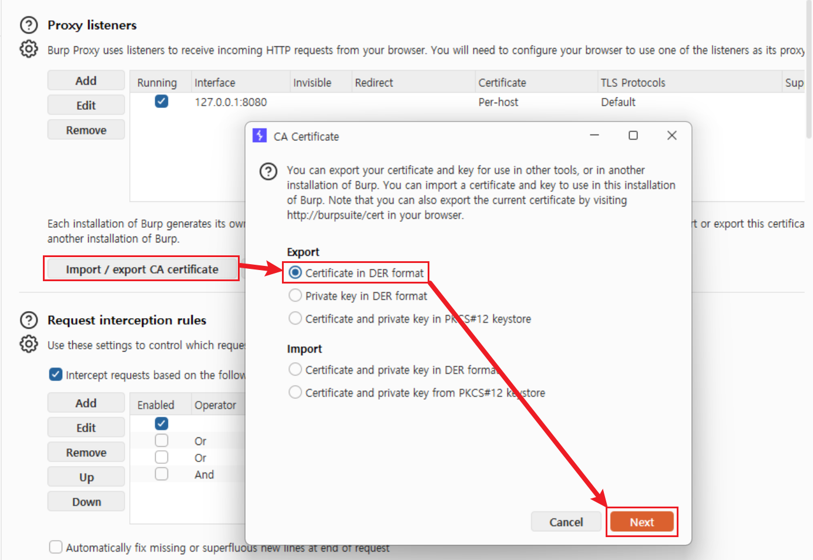
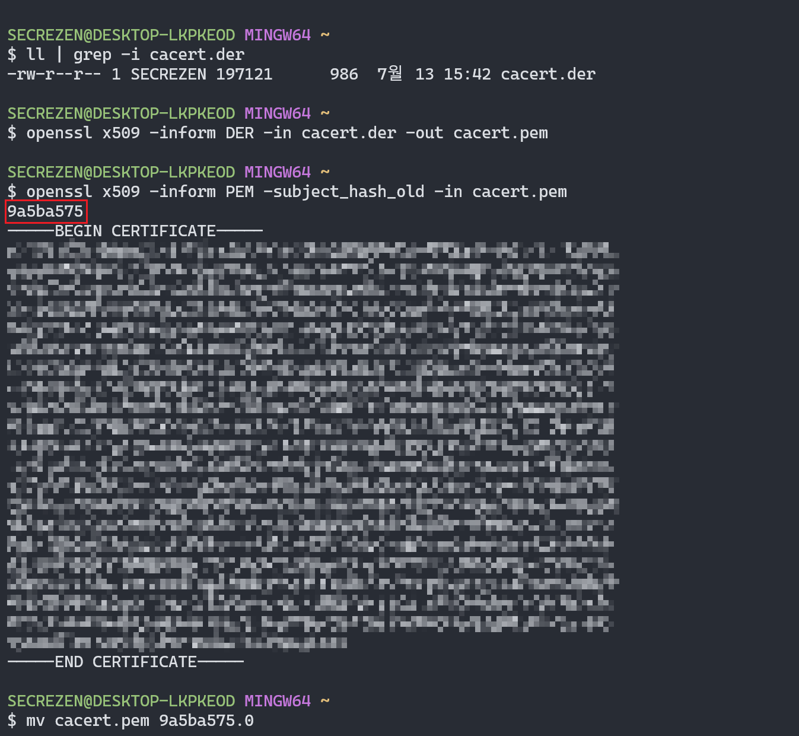
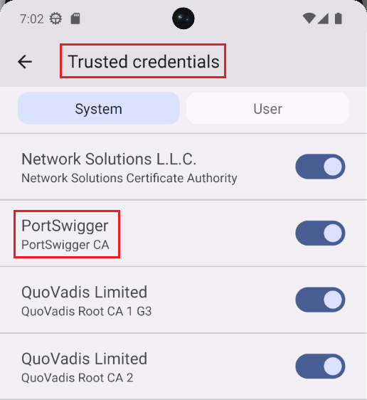
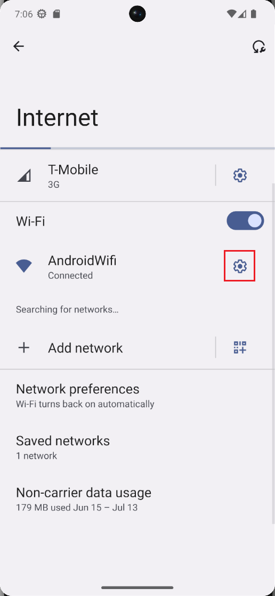
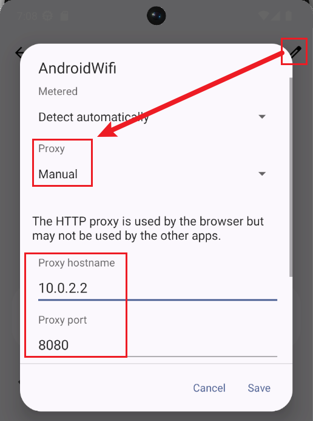
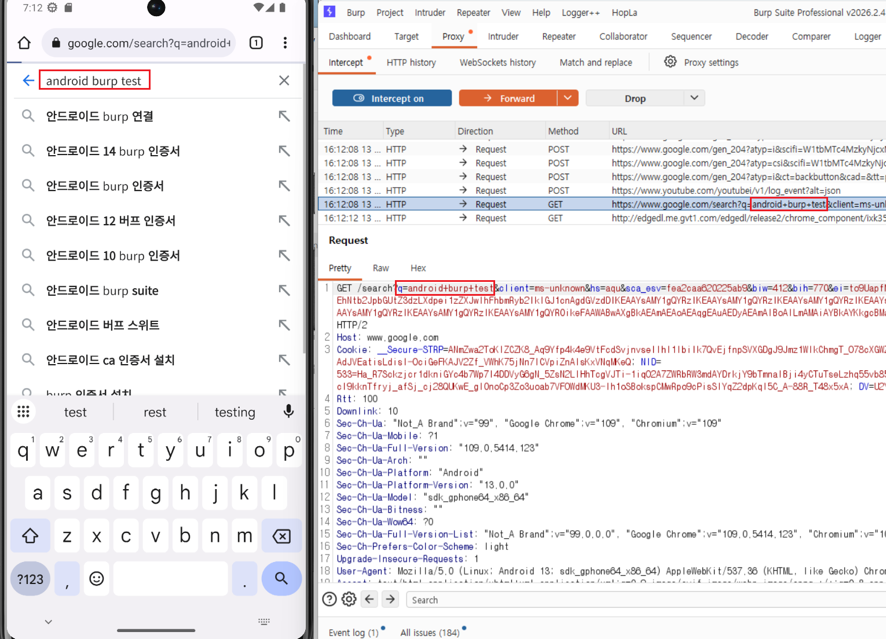

모바일 기기의 웹/앱 트래픽을 분석하려면 PC의 Burp Suite를 거쳐가도록 프록시(Proxy)를 설정해야 한다. 하지만 안드로이드 7.0(Nougat) 버전부터 보안 정책이 강화되어, 사용자가 임의로 설치한 인증서(User CA)를 앱들이 기본적으로 신뢰하지 않게 되었다.

따라서 Android 7.0 이상에서 사용자 CA를 신뢰하도록 별도 설정하지 않은 앱을 분석하려면 **Burp Suite 인증서를 시스템(System) 신뢰 저장소에 등록**하는 과정이 필요할 수 있다. 이번 글에서는 **Pixel 6 Pro, API 33, Google APIs, x86_64 AVD**에서 확인한 시스템 인증서 설치 과정을 정리한다.

> **시스템 CA와 SSL Pinning은 다른 통제이다.**  
> 시스템 CA 설치는 Android의 사용자 CA 신뢰 제한을 해결한다. 앱이 인증서 또는 공개키를 별도로 고정한 SSL Pinning까지 해제하지는 않는다. 브라우저 HTTPS는 보이지만 특정 앱의 요청만 실패한다면 환경 문제로 단정하지 않고 Pinning 적용 여부를 확인한다.

---

## 1. Burp Suite 인증서 추출

가장 먼저 PC의 Burp Suite에서 고유한 CA 인증서를 추출해야 한다.

1. Burp Suite를 실행하고 **Proxy > Proxy settings**로 이동한다.
2. `Import / export CA certificate` 버튼을 클릭한다.
3. **Export** 항목에서 `Certificate in DER format`을 선택하고 **[Next]**를 누른다.
4. 파일 이름을 `cacert.der`로 지정하여 적당한 경로에 저장한다.



---

## 2. 인증서 형식 변환 및 파일명 변경 (OpenSSL)

안드로이드 시스템 영역에 인증서를 넣으려면, 추출한 DER 형식의 파일을 PEM 형식으로 변환하고 안드로이드가 인식할 수 있는 특정 해시(Hash) 값으로 파일 이름을 변경해야 한다. 이를 위해 OpenSSL 도구가 필요하다. (Git Bash나 리눅스 환경에서는 기본 내장되어 있으며, 윈도우에서는 별도 설치가 필요하다.)

> **Burp에서 바로 PEM 포맷으로 내보내면 안 될까?**  
> 이 글에서 사용한 Burp Suite 내보내기 항목은 인증서를 `DER` 형식으로 제공한다. 다른 방법으로 `PEM` 형식을 확보했더라도 Android 시스템이 요구하는 `<고유 해시값>.0` 이름을 만들려면 OpenSSL의 `-subject_hash_old` 결과가 필요하다. 따라서 아래에서는 형식 변환과 해시 확인을 연속해서 진행한다.

1. Git Bash를 열고 `cacert.der` 파일이 있는 폴더로 이동한다.
2. 아래 명령어를 입력하여 DER 형식을 PEM 형식으로 변환한다.
   
   ```bash
   openssl x509 -inform DER -in cacert.der -out cacert.pem
   ```

3. 변환된 PEM 파일의 주체 해시(Subject Hash) 값을 추출한다.
   
   ```bash
   openssl x509 -inform PEM -subject_hash_old -in cacert.pem
   ```
   - 명령어 실행 결과 가장 첫 줄에 `9a5ba575` 와 같은 8자리 해시 문자열이 출력된다.

4. 해당 해시값을 사용하여 파일의 이름을 `<해시값>.0` 으로 변경한다.
   
   ```bash
   # 출력된 해시값이 9a5ba575 일 경우
   mv cacert.pem 9a5ba575.0
   ```



---

## 3. 시스템(System) 영역에 인증서 삽입 (ADB)

이제 이름이 변경된 인증서 파일(`9a5ba575.0`)을 에뮬레이터의 시스템 폴더(`/system/etc/security/cacerts/`)에 밀어 넣어야 한다. 안드로이드 최신 버전(API 30 이상)은 보안상 `/system` 파티션이 읽기 전용으로 굳게 잠겨 있으므로, 아래의 과정으로 잠금을 해제해야 한다.

1. **에뮬레이터 쓰기 권한 부팅 (`-writable-system`)**
   안드로이드 스튜디오의 일반 재생(Play) 버튼 대신, 터미널에서 `-writable-system` 옵션을 주어 에뮬레이터를 켜야 한다.
   
   - 기존에 켜져 있던 에뮬레이터를 완전히 종료한다.
   - 터미널에서 `emulator` 툴이 있는 경로로 이동하여 기기를 켠다.
   
   ```bash
   cd ~/AppData/Local/Android/Sdk/emulator
   ./emulator -list-avds
   # 출력된 기기 이름으로 에뮬레이터 부팅
   ./emulator -avd Pixel_6_Pro -writable-system
   ```
   
2. **시스템 파티션 잠금 해제 및 재부팅**
   에뮬레이터가 켜진 상태에서 **새로운 Git Bash 창**을 열어 Root 권한을 획득하고 리마운트(Remount)한다. 첫 글에서 ADB 경로를 PATH에 등록했으므로 현재 폴더 실행을 의미하는 `./adb` 대신 `adb`를 사용한다.
   
   ```bash
   adb root
   adb remount
   ```
   
   - API 33 AVD에서는 처음 `remount`할 때 `Disabling verity for /system` 메시지와 함께 재부팅을 요구할 수 있다. 이 메시지가 출력되면 아래 명령어로 기기를 재부팅한 뒤, 홈 화면이 나타나면 `adb root`와 `adb remount`를 다시 실행한다.
   
   ```bash
   adb reboot
   # 부팅 완료 후 홈 화면을 확인한 뒤 다시 실행한다.
   adb root
   adb remount
   ```

3. **인증서 파일 복사 및 권한 설정**
   `adb push` 명령어로 인증서를 넣고, `chmod 644`로 읽기 권한을 부여한다.
   
   - **Git Bash 경로 변환**: Git Bash는 `/system`으로 시작하는 경로를 Windows 절대 경로로 변환할 수 있다. 이를 막기 위해 이 글에서는 경로 앞에 슬래시를 두 번(`//system`) 사용한다. PowerShell 또는 명령 프롬프트에서는 `/system/...` 경로를 그대로 사용한다.
   
   ```bash
   adb push 9a5ba575.0 //system/etc/security/cacerts/
   adb shell chmod 644 //system/etc/security/cacerts/9a5ba575.0
   ```
   
4. **최종 재부팅 및 확인**
   모든 작업이 끝났으므로 에뮬레이터를 한 번 더 재부팅하여 설정을 적용한다.
   
   ```bash
   adb reboot
   ```

에뮬레이터가 다시 켜진 후 Android의 **[설정] - [보안] - [암호화 및 사용자 인증 정보] - [신뢰할 수 있는 사용자 인증 정보]** 메뉴로 이동한다. 기기 언어와 제조사 UI에 따라 메뉴 이름은 달라질 수 있다. `시스템` 탭에서 `PortSwigger` 인증서가 표시되는지 확인한다.



---

## 4. 에뮬레이터 프록시 연동 및 패킷 확인

인증서 설치가 완료되었으므로 기기의 트래픽이 PC의 Burp Suite를 거치도록 설정한다.

먼저 Burp Suite의 **Proxy > Proxy settings > Proxy listeners**에서 `8080` 포트의 리스너가 실행 중인지 확인한다. AVD에서 연결되지 않으면 리스너의 Bind address를 `All interfaces` 또는 테스트에 사용하는 호스트 주소로 설정한다. 실기기나 공용망에서는 불필요한 인터페이스에 리스너를 노출하지 않는다.

1. 안드로이드 홈 화면에서 **[설정] - [Network & internet] - [Internet]** 으로 이동한다.
2. 연결된 와이파이(AndroidWifi) 우측의 톱니바퀴 아이콘을 누르고, 우측 상단의 **연필 모양(Edit)** 버튼을 클릭한다.
   <div style="display: flex; justify-content: center; align-items: center; gap: 20px;">
      
      
   </div>


3. Proxy 옵션을 `Manual(수동)`로 변경하고 다음과 같이 입력한 뒤 저장한다.
   - **Proxy hostname**: `10.0.2.2` (에뮬레이터에서 바라보는 로컬 PC의 기본 IP)
   - **Proxy port**: `8080` (Burp Suite 리스너 포트)
4. PC의 Burp Suite에서 `Intercept is off`로 두고 에뮬레이터의 Chrome에서 `https://example.com`에 접속한다.
5. 인증서 경고 없이 페이지가 열리고 **Proxy > HTTP history**에서 HTTPS 요청과 응답 본문이 평문으로 확인되면 프록시 기준선이 확보된 것이다.

브라우저 기준선은 정상이지만 점검 대상 앱만 통신하지 못하면 다음 항목을 분리해 확인한다.

- 앱의 Network Security Config가 시스템 CA를 신뢰하는지 확인한다.
- SSL Pinning 적용 여부와 구현 위치를 정적 분석으로 확인한다.
- HTTP/3·QUIC, 별도 네트워크 스택, 프록시 탐지 여부를 확인한다.


Burp Suite 패킷 캡처 확인:


