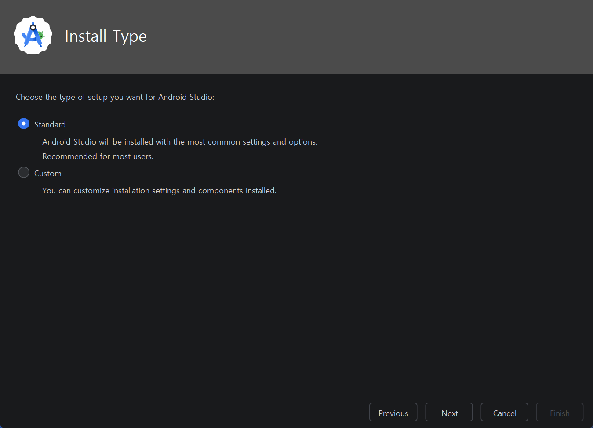
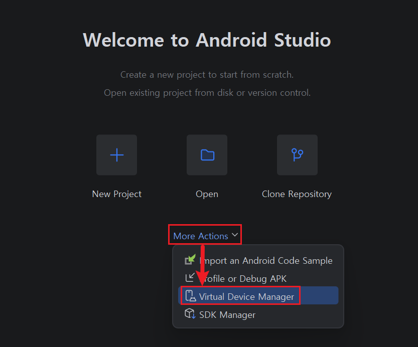
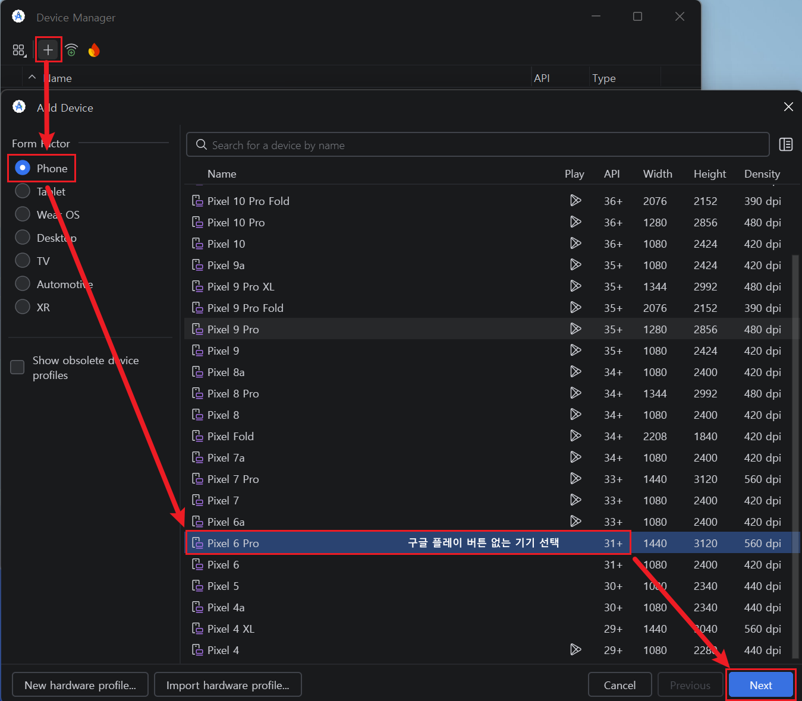
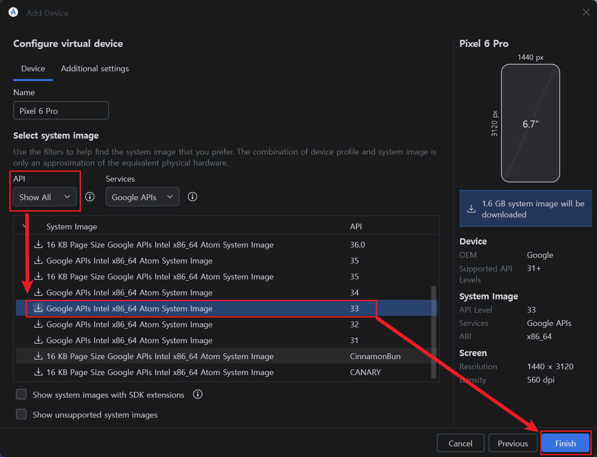
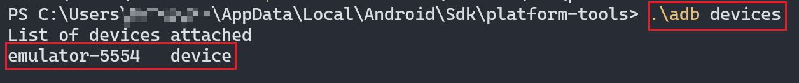
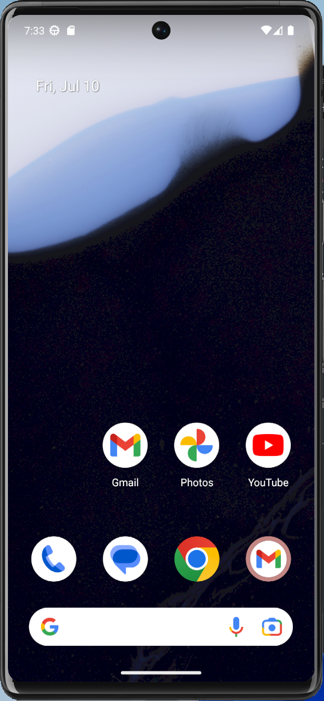

모바일 앱은 비루팅 단말에서도 정적 분석, 일반 프록시 분석, 허용된 범위의 ADB 점검이 가능하다. 다만 **루팅 또는 이에 준하는 권한을 가진 분석 환경**은 시스템 영역 접근과 동적 분석의 제약을 크게 줄여준다. 실물 기기를 루팅해 사용할 수도 있지만, 반복 실습과 복구 편의성을 고려하면 에뮬레이터가 좋은 출발점이다.

이번 글에서는 에뮬레이터 중 **Android Studio AVD**를 활용하여 분석 환경을 구축하는 방법을 정리한다.

---

## 1. AVD 선정 이유

안드로이드 에뮬레이터로는 녹스(Nox), LD플레이어, 미뮤 등 다양한 서드파티 툴이 존재하지만 아래의 이유로 **Android Studio AVD**를 추천한다.

- **Nox / LDPlayer의 한계**: 설치와 루팅이 간편하지만 지원 Android 버전, 불필요한 기본 앱, 시스템 변경 내역을 분석자가 정확히 통제하기 어려울 수 있다.
- **AVD의 장점**: Google이 제공하는 표준 에뮬레이터이며, 원하는 API Level과 하드웨어 프로필을 선택할 수 있다. 스냅샷을 이용한 복구와 반복 실습에도 적합하다.

> **AVD와 실기기의 차이**  
> AVD는 1차 분석과 도구 숙련에 적합하지만 실제 단말을 완전히 재현하지는 못한다. Play Integrity, TEE/StrongBox, 생체인증, 제조사 보안 기능, ARM 전용 네이티브 라이브러리, Anti-Emulator 탐지는 실기기에서 결과가 달라질 수 있다. 따라서 AVD에서 분석한 결과도 필요한 경우 승인된 실기기에서 다시 확인한다.

---

## 2. Android Studio AVD 설치 및 가상 기기 생성

### 2.1. Android Studio 설치
[Android Studio 공식 홈페이지](https://developer.android.com/studio)에서 설치 파일을 다운로드한 뒤, 기본 설정(Default)으로 설치를 마친다. 처음 실행 시 뜨는 초기 세팅을 **모두 기본값**으로 진행하여 SDK를 설치한다.



### 2.2. 모의해킹용 에뮬레이터(AVD) 생성
1. Android Studio 메인 화면에서 **[More Actions] (점 3개 아이콘) -> [Virtual Device Manager]**를 클릭한다.
	

2. 좌측 상단의 **[Create device]**를 눌러 하드웨어 프로필을 선택한다. 화면이 넉넉한 **Pixel 5** 또는 **Pixel 6** 계열을 사용하면 실습하기 편하다.


3. **System Image 선택**
   
   - `x86 Images` 또는 `x86_64` 계열에서 호스트 PC와 목적에 맞는 ABI를 선택한다.
   - 이 실습에서는 재현 기준을 고정하기 위해 **API 33(Android 13), x86_64** 이미지를 사용한다.
	- Target은 **`Google APIs`** 이미지를 선택한다. Play Store 로고가 있는 `Google Play` 이미지는 production 성격이므로 일반적으로 `adb root`가 제한된다. 이미지 이름만 믿지 않고 생성 후 `adb root` 결과로 실제 권한을 확인한다.
	

---

## 3. 에뮬레이터 부팅 및 ADB 환경 세팅

기기 생성을 마쳤다면, Device Manager 목록에서 **▶(Play 버튼)**을 눌러 안드로이드를 부팅한다.

### 3.1. ADB(Android Debug Bridge) 인식 확인
PC와 에뮬레이터가 통신하기 위해서는 `adb`라는 도구가 필요하다. Windows 환경 변수에 등록해 두면 편하지만, 우선 Git Bash에서 기본 설치 경로로 이동해 실행한다.

1. **Git Bash**를 열고 아래 경로로 이동한다.

   ```bash
   cd ~/AppData/Local/Android/Sdk/platform-tools
   ```
   
2. 아래 명령어를 입력하여 에뮬레이터가 정상적으로 인식되는지 확인한다.

   ```bash
   ./adb devices
   ```
   
   - 목록에 `emulator-5554   device` 형태로 기기가 뜬다면 성공적으로 연결된 것이다.

> **ADB 환경 변수(PATH) 등록**  
> 매번 긴 경로로 이동해서 실행하는 것은 매우 번거로우므로, 윈도우 환경 변수에 등록해 두면 어느 경로에서든 터미널을 열고 `adb` 명령어만으로 실행이 가능하다.
> 1. 윈도우 키를 누르고 **'시스템 환경 변수 편집'**을 검색하여 실행한다.
> 2. 하단의 **[환경 변수(N)...]** 버튼을 클릭한다.
> 3. 사용자 변수(또는 시스템 변수) 목록에서 **`Path`** 항목을 찾아 더블 클릭한다.
> 4. 우측의 **[새로 만들기]**를 누르고 `%LOCALAPPDATA%\Android\Sdk\platform-tools` 경로를 그대로 입력한 후 모든 창의 **[확인]**을 누른다.
> 5. 열려있던 터미널 창을 완전히 껐다가 다시 켜면, 이제부터 폴더 이동 없이 곧바로 `adb devices` 명령어를 사용할 수 있다.


### 3.2. adbd Root 권한 획득
시스템 인증서 설치와 Frida Server 구동 등에는 높은 권한이 필요하다. Google APIs AVD처럼 `userdebug` 성격의 이미지에서는 다음 명령으로 ADB 데몬(adbd)을 Root 권한으로 다시 실행할 수 있다.

```bash
adb root
```

`restarting adbd as root`가 출력된 뒤 다음 명령으로 실제 사용자 ID를 확인한다.

```bash
adb shell id
# uid=0(root) gid=0(root) ...
```

> **`adb root`와 Magisk 루팅의 차이**  
> `adb root`는 Root 권한으로 adbd를 재시작하는 방식이며, 일반 실기기에 Magisk를 설치해 `su` 권한을 얻는 방식과 동일하지 않다. Root Detection, Play Integrity, Zygisk 등은 동작 조건이 다르므로 이후 보호기법 우회 실습에서 두 환경을 구분한다.



이제 Android 앱의 트래픽을 관찰하기 위한 **Burp Suite 프록시 및 시스템 인증서 설정**을 진행할 준비가 끝났다.
