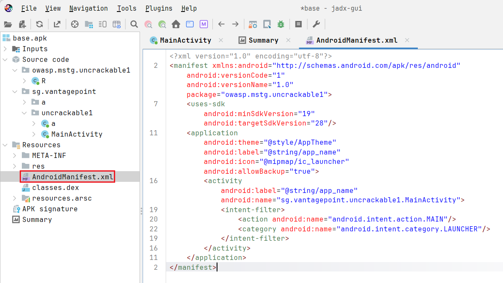
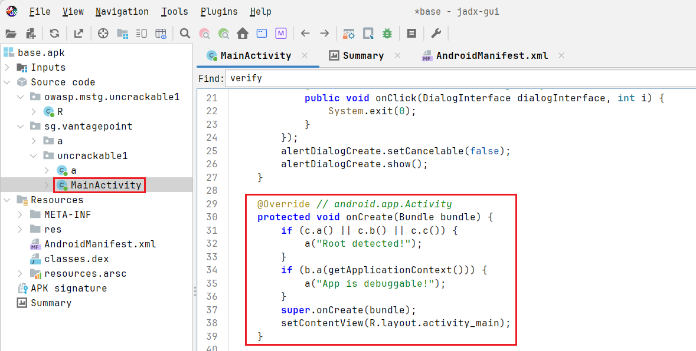
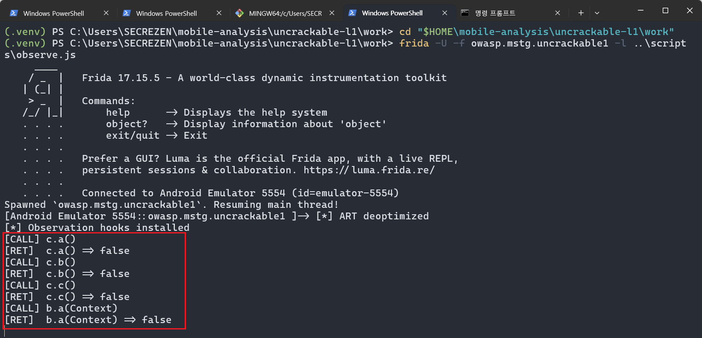
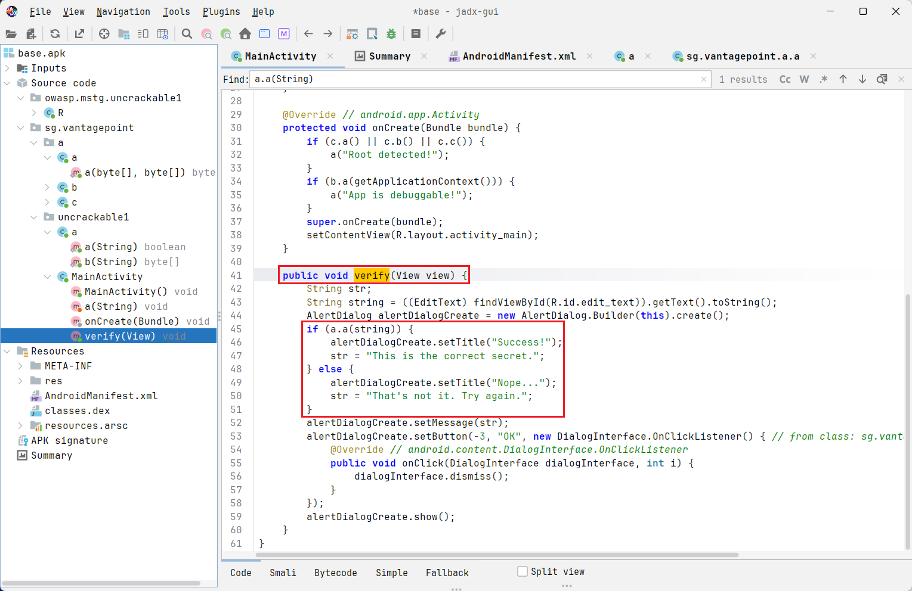
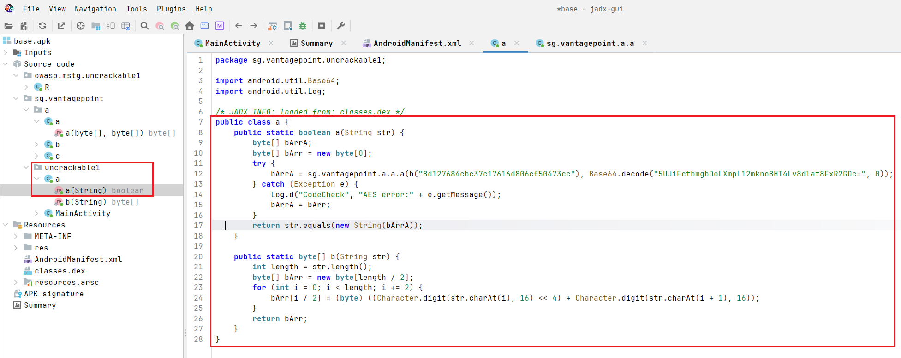
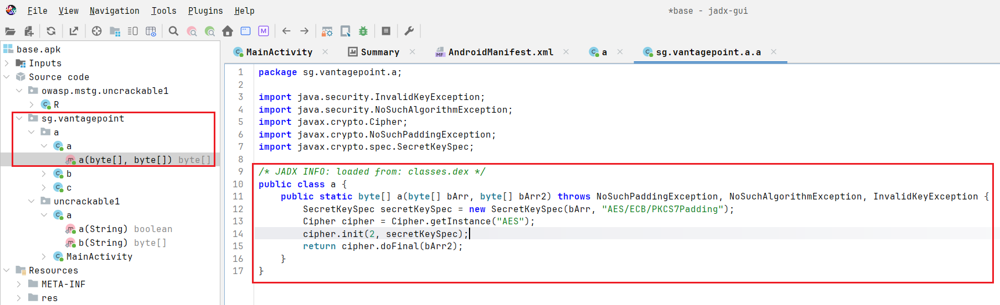
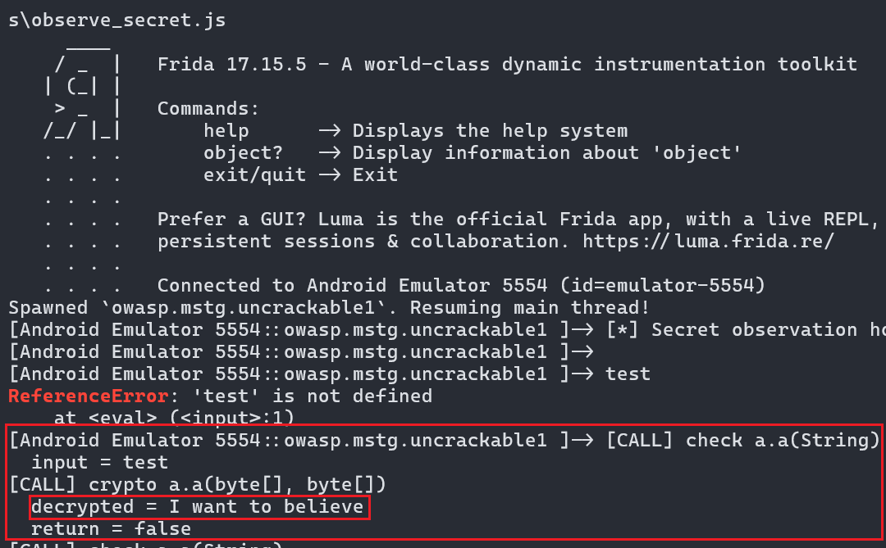
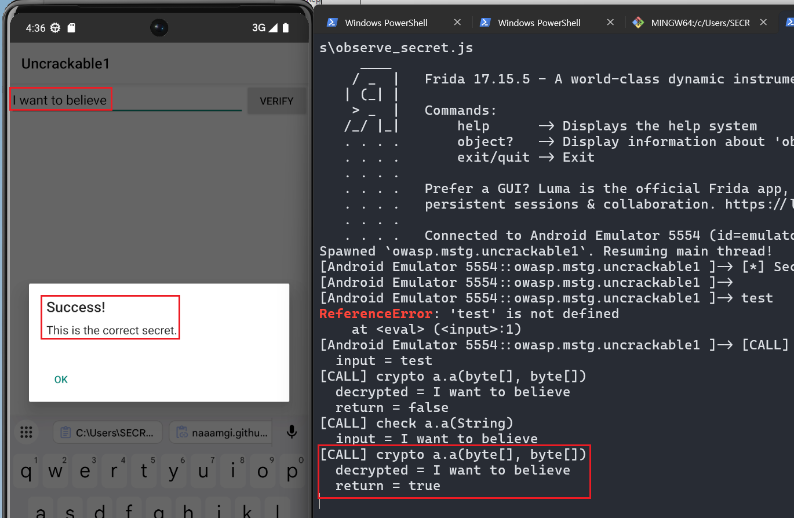
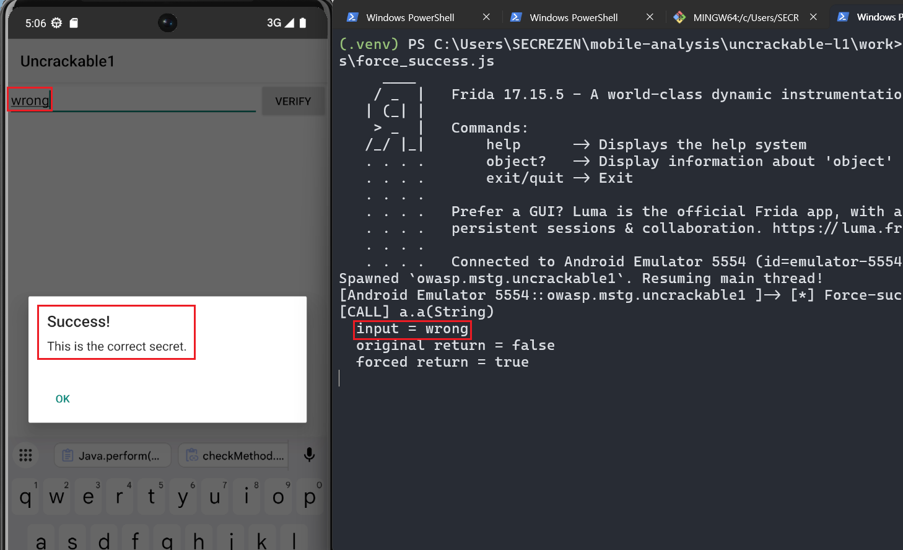

이번 글에서는 OWASP MASTG에서 제공하는 연습용 앱인 **Android UnCrackable Level 1**을 분석한다.

실제 서비스 앱이 아니라 학습 목적으로 만들어진 앱이다. 그래서 목표는 "취약점이라고 단정하기"가 아니라, 정적 분석과 동적 분석을 연결해서 앱이 어떤 흐름으로 동작하는지 직접 확인하는 것이다.

이번 실습에서 실제로 진행한 흐름은 다음과 같다.

```text
공식 APK 다운로드
→ 앱 설치와 base.apk 추출
→ JADX로 Manifest와 MainActivity 확인
→ 루팅/디버그 탐지 흐름 추적
→ Frida Server 준비
→ 탐지 함수 호출과 반환값 관찰
→ 입력 검증 함수와 AES 복호화 흐름 추적
→ Frida로 복호화 결과 확인
→ 앱에서 Success 다이얼로그 확인
```

실습 범위는 공식 연습용 앱으로 한정했다. 공개된 우회 스크립트를 먼저 복사하기보다, JADX에서 확인한 지점을 Frida로 직접 관찰하는 방식으로 진행했다.

---

## 1. 실습 환경

이번 실습은 Windows와 PowerShell 기준으로 진행했다. 처음에는 Git Bash를 사용했지만, Android 경로인 `/data/local/tmp`가 Windows 경로로 변환되는 문제가 있어 이후 주요 명령은 PowerShell로 실행했다.

주요 환경은 다음과 같다.

- 대상 패키지명: `owasp.mstg.uncrackable1`
- AVD ABI: `x86_64`
- Frida Tools: `17.15.5`
- Frida Server: `frida-server-17.15.5-android-x86_64`

분석 폴더는 다음처럼 나누었다.

```text
uncrackable-l1/
├── original/    원본 APK
├── extracted/   추출 또는 디컴파일 결과
├── scripts/     Frida 스크립트
├── notes/       분석 메모
└── work/        frida-server 등 작업 파일
```

PowerShell에서는 분석 폴더로 이동한 뒤 진행했다.

```powershell
cd "$HOME\mobile-analysis\uncrackable-l1"
```

---

## 2. 원본 APK 준비와 설치 APK 추출

먼저 OWASP MAS Crackmes의 Android UnCrackable L1 APK를 내려받았다. 실습 앱은 반드시 공식 연습용 앱이나 허가받은 앱만 사용한다.

분석 폴더에서는 원본과 추출본을 분리했다.

```powershell
cd "$HOME\mobile-analysis\uncrackable-l1"

New-Item -ItemType Directory -Force original, extracted, work, scripts, notes
Copy-Item "$HOME\Downloads\UnCrackable-Level1.apk" .\original\
```

원본 파일은 이후 비교 기준이 되므로 해시를 먼저 기록했다.

```powershell
Get-FileHash -Algorithm SHA256 .\original\UnCrackable-Level1.apk
```

그 다음 AVD 연결 상태를 확인하고 앱을 설치했다.

```powershell
adb devices
adb install -r .\original\UnCrackable-Level1.apk
```

설치 후 패키지명을 확인했다.

```powershell
adb shell pm list packages | Select-String "uncrackable|owasp|mstg"
```

확인한 패키지명은 다음과 같다.

```text
owasp.mstg.uncrackable1
```

설치된 앱의 APK 경로는 `pm path`로 확인했다.

```powershell
adb shell pm path owasp.mstg.uncrackable1
```

출력은 보통 다음처럼 `package:` 접두어가 붙은 형태다.

```text
package:/data/app/.../base.apk
```

`adb pull`에는 실제 파일 경로만 필요하므로 `package:`를 제거해서 추출한다. PowerShell에서는 다음처럼 한 번에 처리할 수 있다.

```powershell
$apkPath = (adb shell pm path owasp.mstg.uncrackable1).Trim().Replace("package:", "")
adb pull $apkPath .\extracted\base.apk
Get-FileHash -Algorithm SHA256 .\extracted\base.apk
```

이후 JADX에서는 `extracted\base.apk`를 열어 분석했다. 원본 APK와 설치 후 추출한 `base.apk`를 분리해두면, 나중에 패치·재서명·재설치 실습을 하더라도 어느 파일이 원본인지 헷갈리지 않는다.

Git Bash를 사용한다면 Android 경로가 Windows 경로로 자동 변환될 수 있다. 이 경우 `adb pull /data/...` 명령 앞에 `MSYS_NO_PATHCONV=1`을 붙인다. 이번 글에서는 경로 혼동을 줄이기 위해 PowerShell 기준으로 진행했다.

---

## 3. JADX로 APK 열기

JADX GUI로 `extracted\base.apk`를 열었다. 처음부터 모든 클래스를 읽지 않고, 먼저 `AndroidManifest.xml`에서 앱의 시작 지점과 기본 설정을 확인했다.

처음에는 `AndroidManifest.xml`과 앱 자체 패키지인 `sg.vantagepoint.*` 위주로 확인했다. 외부 라이브러리나 리소스를 전부 읽기보다, 앱의 시작 지점과 직접 작성된 코드부터 따라가는 편이 훨씬 효율적이었다.

---

## 4. Manifest 확인

`Resources > AndroidManifest.xml`에서 다음 내용을 확인했다.

```xml
<manifest
    android:versionCode="1"
    android:versionName="1.0"
    package="owasp.mstg.uncrackable1">

    <uses-sdk
        android:minSdkVersion="19"
        android:targetSdkVersion="28" />

    <application
        android:theme="@style/AppTheme"
        android:label="@string/app_name"
        android:icon="@mipmap/ic_launcher"
        android:allowBackup="true">

        <activity
            android:label="@string/app_name"
            android:name="sg.vantagepoint.uncrackable1.MainActivity">

            <intent-filter>
                <action android:name="android.intent.action.MAIN" />
                <category android:name="android.intent.category.LAUNCHER" />
            </intent-filter>
        </activity>
    </application>
</manifest>
```

확인한 값은 다음과 같다.

| 확인 항목 | 확인 결과 |
| --- | --- |
| Package Name | `owasp.mstg.uncrackable1` |
| Main Activity | `sg.vantagepoint.uncrackable1.MainActivity` |
| `android:debuggable` | 명시되어 있지 않음. 일반적으로 기본값은 `false` |
| `android:allowBackup` | `true` |
| 요청 권한 | `<uses-permission>` 선언 없음 |
| Exported Component | `MainActivity`에 `MAIN`/`LAUNCHER` intent-filter가 있음 |
| Native Library 사용 흔적 | Manifest만으로는 확인되지 않음 |

여기서 `allowBackup="true"` 같은 설정을 바로 취약점이라고 단정하지 않았다. 이번 단계에서는 앱의 시작 지점과 구성요소를 파악하는 데 사용했다.



---

## 5. 시작 Activity와 루팅 탐지 흐름

Manifest에서 확인한 시작 Activity는 다음 클래스다.

```text
sg.vantagepoint.uncrackable1.MainActivity
```

JADX에서 `MainActivity.onCreate()`를 확인했다.

```java
@Override
protected void onCreate(Bundle bundle) {
    if (c.a() || c.b() || c.c()) {
        a("Root detected!");
    }
    if (b.a(getApplicationContext())) {
        a("App is debuggable!");
    }
    super.onCreate(bundle);
    setContentView(R.layout.activity_main);
}
```

앱이 실행될 때 먼저 루팅 탐지 함수 세 개가 호출된다.

```java
c.a() || c.b() || c.c()
```

이 중 하나라도 `true`를 반환하면 `a("Root detected!")`가 호출된다. 그 다음에는 앱이 디버그 가능 상태인지 확인한다.

```java
b.a(getApplicationContext())
```

정적 분석으로 세운 1차 가설은 다음과 같다.

| 코드 | 정적 분석 해석 |
| --- | --- |
| `sg.vantagepoint.a.c.a()` | 루팅 탐지 후보 |
| `sg.vantagepoint.a.c.b()` | 루팅 탐지 후보 |
| `sg.vantagepoint.a.c.c()` | 루팅 탐지 후보 |
| `sg.vantagepoint.a.b.a(Context)` | 앱 디버그 가능 여부 확인 후보 |
| `MainActivity.a(String)` | 경고 다이얼로그 출력 후보 |

이 단계에서는 아직 우회하지 않았다. 어떤 함수가 언제 호출되고 어떤 값을 반환하는지 관찰할 지점만 기록했다.



---

## 6. Frida Server 준비

PC의 Frida Tools 버전과 AVD ABI를 먼저 확인했다.

```powershell
frida --version
adb shell getprop ro.product.cpu.abi
adb shell getprop ro.product.cpu.abilist
```

확인 결과 Frida Tools는 `17.15.5`, AVD ABI는 `x86_64`였다. 처음에는 `frida-core-devkit-17.15.5-android-x86_64.tar.xz`를 받았는데, 이것은 앱에 올려 실행하는 `frida-server`가 아니었다. AVD에 올릴 파일은 다음 파일이다.

```text
frida-server-17.15.5-android-x86_64.xz
```

`work` 폴더에 받은 뒤 압축을 해제하고 이름을 정리했다.

```powershell
cd "$HOME\mobile-analysis\uncrackable-l1\work"
unxz -v frida-server-17.15.5-android-x86_64.xz
mv frida-server-17.15.5-android-x86_64 frida-server
ls -lh frida-server
```

압축을 해제한 `frida-server` 파일 크기는 약 `107M`였다.

Git Bash에서는 Android 경로가 Windows 경로처럼 변환되어 다음과 같은 문제가 발생할 수 있다.

```text
chmod: C:/Program: No such file or directory
chmod: Files/Git/data/local/tmp/frida-server: No such file or directory
```

Git Bash를 계속 쓴다면 `MSYS_NO_PATHCONV=1`을 붙여야 한다. 이번 실습에서는 혼동을 줄이기 위해 PowerShell로 진행했다.

PowerShell 기준으로는 다음처럼 Frida Server를 올리고 실행했다.

```powershell
adb devices
adb root
adb push .\frida-server /data/local/tmp/frida-server
adb shell chmod 755 /data/local/tmp/frida-server
adb shell "/data/local/tmp/frida-server >/dev/null 2>&1 &"
```

실행 후 Frida 연결을 확인했다.

```powershell
frida-ps -U
```

대상 앱 설치 여부는 ADB로 확인했다.

```powershell
adb shell pm list packages | Select-String "uncrackable|owasp|mstg"
```

---

## 7. 루팅·디버그 탐지 함수 관찰

JADX에서 찾은 함수를 Frida로 관찰하기 위해 `scripts\observe.js`를 작성했다. 핵심은 반환값을 바꾸지 않고 원래 호출과 결과만 출력하는 것이다.

초기에는 `c.a()`와 `b.a(Context)`만 보이고 `c.b()`, `c.c()`가 보이지 않았다. JADX 코드상으로는 `c.a() || c.b() || c.c()`가 분명히 보이는데, Frida 로그에는 일부 호출이 빠져 보인 것이다.

이때 의심할 수 있는 원인 중 하나가 ART 최적화다. ART(Android Runtime)는 앱 실행 성능을 높이기 위해 작은 함수 호출을 실제 메서드 호출 형태로 남겨두지 않고 호출한 쪽 코드에 합쳐버릴 수 있다. 이런 최적화를 인라이닝이라고 한다. 메서드가 인라이닝되면 Frida가 해당 메서드의 경계에 hook을 걸어도 기대한 로그가 나오지 않을 수 있다.

그래서 이번 실습에서는 `Java.deoptimizeEverything()`을 적용했다. 이 함수는 ART 최적화 영향을 줄여 Frida가 Java 메서드 호출을 더 잘 관찰할 수 있게 해준다. 성능에는 불리할 수 있지만, 실습처럼 호출 흐름을 확인하는 상황에서는 도움이 된다.

`observe.js`는 다음과 같이 작성했다.

```javascript
Java.perform(function () {
    // ART 최적화/인라이닝 영향으로 일부 hook이 보이지 않을 수 있어 비활성화한다.
    Java.deoptimizeEverything();
    console.log('[*] ART deoptimized');

    const RootCheck = Java.use('sg.vantagepoint.a.c');
    const DebugCheck = Java.use('sg.vantagepoint.a.b');

    // c.a(), c.b(), c.c()는 모두 인자가 없는 boolean 루팅 탐지 함수다.
    function observeRootMethod(methodName) {
        const method = RootCheck[methodName].overload();

        method.implementation = function () {
            console.log('[CALL] c.' + methodName + '()');

            const result = method.call(this);

            console.log('[RET]  c.' + methodName + '() => ' + result);
            return result;
        };
    }

    observeRootMethod('a');
    observeRootMethod('b');
    observeRootMethod('c');

    // b.a(Context)는 앱이 debuggable 상태인지 확인하는 함수다.
    const debugMethod = DebugCheck.a.overload('android.content.Context');

    debugMethod.implementation = function (context) {
        console.log('[CALL] b.a(Context)');

        const result = debugMethod.call(this, context);

        console.log('[RET]  b.a(Context) => ' + result);
        return result;
    };

    console.log('[*] Observation hooks installed');
});
```

실행 명령은 다음과 같다.

```powershell
cd "$HOME\mobile-analysis\uncrackable-l1\work"
frida -U -f owasp.mstg.uncrackable1 -l ..\scripts\observe.js
```

최종 관찰 결과:

```text
Spawned `owasp.mstg.uncrackable1`. Resuming main thread!
[*] ART deoptimized
[*] Observation hooks installed
[CALL] c.a()
[RET]  c.a() => false
[CALL] c.b()
[RET]  c.b() => false
[CALL] c.c()
[RET]  c.c() => false
[CALL] b.a(Context)
[RET]  b.a(Context) => false
```

정리하면 현재 AVD 환경에서는 세 개의 루팅 탐지 함수가 모두 `false`를 반환했고, 디버그 탐지 함수도 `false`를 반환했다. 따라서 앱은 `"Root detected!"`나 `"App is debuggable!"` 경고 분기로 들어가지 않았다.

`adb root`를 실행했는데도 앱의 루팅 탐지가 `false`인 점이 처음에는 헷갈릴 수 있다. 이 앱은 `adbd`가 root로 동작하는지 직접 보는 것이 아니라, 특정 파일이나 시스템 흔적을 확인하는 단순한 탐지 로직을 사용한다. 그래서 현재 AVD 환경에서는 탐지되지 않은 것으로 해석했다.



---

## 8. 입력 검증 흐름 찾기

앱 화면에는 문자열을 입력하고 VERIFY 버튼을 누르는 흐름이 있다. JADX에서 `MainActivity.verify(View view)` 메서드를 찾았다.

```java
public void verify(View view) {
    String str;
    String string = ((EditText) findViewById(R.id.edit_text)).getText().toString();
    AlertDialog alertDialogCreate = new AlertDialog.Builder(this).create();
    if (a.a(string)) {
        alertDialogCreate.setTitle("Success!");
        str = "This is the correct secret.";
    } else {
        alertDialogCreate.setTitle("Nope...");
        str = "That's not it. Try again.";
    }
    alertDialogCreate.setMessage(str);
    alertDialogCreate.setButton(-3, "OK", new DialogInterface.OnClickListener() {
        @Override
        public void onClick(DialogInterface dialogInterface, int i) {
            dialogInterface.dismiss();
        }
    });
    alertDialogCreate.show();
}
```

흐름은 다음과 같다.

1. `R.id.edit_text`에서 사용자가 입력한 문자열을 가져온다.
2. `a.a(string)`으로 입력값을 검증한다.
3. 반환값이 `true`면 `Success!` 다이얼로그를 띄운다.
4. 반환값이 `false`면 `Nope...` 다이얼로그를 띄운다.

즉 실제 검증 로직은 `verify()` 내부가 아니라 다음 함수에 있다.

```text
sg.vantagepoint.uncrackable1.a.a(String)
```



---

## 9. 검증 함수 내부 확인

`sg.vantagepoint.uncrackable1.a` 클래스의 `a(String)` 메서드는 다음과 같았다.

```java
public static boolean a(String str) {
    byte[] bArrA;
    byte[] bArr = new byte[0];
    try {
        bArrA = sg.vantagepoint.a.a.a(
            b("8d127684cbc37c17616d806cf50473cc"),
            Base64.decode("5UJiFctbmgbDoLXmpL12mkno8HT4Lv8dlat8FxR2GOc=", 0)
        );
    } catch (Exception e) {
        Log.d("CodeCheck", "AES error:" + e.getMessage());
        bArrA = bArr;
    }
    return str.equals(new String(bArrA));
}
```

처음에는 단순 문자열 비교를 예상할 수 있지만, 실제로는 하드코딩된 값 두 개를 사용해 AES 복호화를 수행한 뒤 그 결과를 사용자 입력값과 비교한다.

| 값 | 역할 |
| --- | --- |
| `8d127684cbc37c17616d806cf50473cc` | hex 문자열. `b(String)`을 거쳐 byte 배열로 변환됨 |
| `5UJiFctbmgbDoLXmpL12mkno8HT4Lv8dlat8FxR2GOc=` | Base64 문자열. `Base64.decode()`로 byte 배열로 변환됨 |
| `sg.vantagepoint.a.a.a(byte[], byte[])` | AES 복호화 함수 후보 |
| `str.equals(new String(bArrA))` | 사용자 입력값과 복호화 결과 비교 |

`b(String)`은 hex 문자열을 byte 배열로 바꾸는 유틸리티 함수다.

```java
public static byte[] b(String str) {
    int length = str.length();
    byte[] bArr = new byte[length / 2];
    for (int i = 0; i < length; i += 2) {
        bArr[i / 2] = (byte) (
            (Character.digit(str.charAt(i), 16) << 4)
            + Character.digit(str.charAt(i + 1), 16)
        );
    }
    return bArr;
}
```

여기까지 보면 정답 문자열은 코드에 평문으로 직접 적혀 있는 것이 아니라, 복호화 결과로 만들어진다는 것을 알 수 있다.



---

## 10. AES 복호화 함수 확인

다음으로 `sg.vantagepoint.a.a.a(byte[], byte[])` 메서드를 확인했다.

```java
public static byte[] a(byte[] bArr, byte[] bArr2)
        throws NoSuchPaddingException, NoSuchAlgorithmException, InvalidKeyException {
    SecretKeySpec secretKeySpec = new SecretKeySpec(bArr, "AES/ECB/PKCS7Padding");
    Cipher cipher = Cipher.getInstance("AES");
    cipher.init(2, secretKeySpec);
    return cipher.doFinal(bArr2);
}
```

`cipher.init(2, secretKeySpec)`에서 `2`는 decrypt 모드다. 따라서 첫 번째 인자는 AES key, 두 번째 인자는 암호문으로 해석할 수 있다.

정리하면 입력 검증 흐름은 다음과 같다.

```text
사용자 입력
→ MainActivity.verify(View)
→ sg.vantagepoint.uncrackable1.a.a(String)
→ sg.vantagepoint.a.a.a(byte[], byte[])
→ AES 복호화 결과와 사용자 입력 비교
```

JADX 코드에서 `SecretKeySpec(bArr, "AES/ECB/PKCS7Padding")`처럼 보이지만, `SecretKeySpec`의 두 번째 인자는 보통 `"AES"`가 들어간다. 디컴파일 결과가 원본 코드와 100% 동일하다고 보기보다, 앱의 동작을 이해하기 위한 힌트로 보는 편이 안전하다.



---

## 11. Frida로 secret 관찰

이제 `a.a(String)`과 AES 복호화 함수를 Frida로 관찰했다. 목적은 값을 강제로 바꾸는 것이 아니라, 입력값과 복호화 결과를 확인하는 것이다.

`scripts\observe_secret.js`는 다음과 같이 작성했다.

```javascript
Java.perform(function () {
    // 앞선 관찰과 동일하게 최적화 영향을 줄인다.
    Java.deoptimizeEverything();

    const Check = Java.use('sg.vantagepoint.uncrackable1.a');
    const Crypto = Java.use('sg.vantagepoint.a.a');

    // 사용자가 입력한 문자열이 검증 함수로 들어오는지 확인한다.
    const checkMethod = Check.a.overload('java.lang.String');

    checkMethod.implementation = function (input) {
        console.log('[CALL] check a.a(String)');
        console.log('  input = ' + input);

        const result = checkMethod.call(this, input);

        console.log('  return = ' + result);
        return result;
    };

    // AES 복호화 함수의 반환 byte[]를 문자열로 변환해 확인한다.
    const decryptMethod = Crypto.a.overload('[B', '[B');

    decryptMethod.implementation = function (keyBytes, cipherBytes) {
        console.log('[CALL] crypto a.a(byte[], byte[])');

        const resultBytes = decryptMethod.call(this, keyBytes, cipherBytes);
        const SecretString = Java.use('java.lang.String');
        const secret = SecretString.$new(resultBytes);

        console.log('  decrypted = ' + secret);
        return resultBytes;
    };

    console.log('[*] Secret observation hooks installed');
});
```

실행 명령:

```powershell
cd "$HOME\mobile-analysis\uncrackable-l1\work"
frida -U -f owasp.mstg.uncrackable1 -l ..\scripts\observe_secret.js
```

Frida 프롬프트에 `test`를 직접 입력하면 앱 입력창에 들어가는 것이 아니라 Frida JavaScript 콘솔에서 `test`라는 변수를 실행하려고 한다.

```text
test
ReferenceError: 'test' is not defined
```

실제 테스트 입력은 에뮬레이터 앱 화면의 입력칸에 넣어야 한다.

앱 입력창에 `test`를 입력하고 VERIFY 버튼을 누르자 다음 로그가 출력됐다.

```text
[CALL] check a.a(String)
  input = test
[CALL] crypto a.a(byte[], byte[])
  decrypted = I want to believe
  return = false
```

`test`는 복호화 결과와 다르기 때문에 `false`가 반환됐다. 하지만 AES 복호화 결과가 `I want to believe`라는 사실을 확인했다.



---

## 12. 성공 화면 확인

Frida 로그에서 확인한 값을 앱 입력창에 그대로 입력했다.

```text
I want to believe
```

VERIFY 버튼을 누르자 성공 다이얼로그가 표시됐다.

```text
Success!
This is the correct secret.
```

이번 실습에서는 반환값을 강제로 `true`로 바꾸지 않았다. JADX로 입력 검증 흐름을 따라가고, Frida로 런타임 복호화 결과를 관찰한 뒤, 실제 앱에 올바른 값을 입력해 성공 여부를 확인했다.



---

## 13. 정적·동적 분석 결과 비교

| 분석 질문 | JADX에서 예상한 내용 | Frida에서 확인한 내용 | 최종 판단 |
| --- | --- | --- | --- |
| 앱 시작 시 어떤 점검이 실행되는가? | `c.a()`, `c.b()`, `c.c()`, `b.a(Context)` 호출 | 네 함수가 모두 호출됨 | 가설 확인 |
| 루팅 탐지는 현재 환경에서 동작했는가? | 하나라도 `true`면 경고 발생 | 모두 `false` | 현재 AVD에서는 미탐지 |
| 디버그 탐지는 현재 환경에서 동작했는가? | `b.a(Context)`가 `true`면 경고 발생 | `false` | 디버그 경고 없음 |
| 입력값은 어디서 검증되는가? | `a.a(String)`에서 검증 | 입력값 `test`가 그대로 전달됨 | 가설 확인 |
| secret은 어디서 만들어지는가? | AES 복호화 함수 반환값 | `decrypted = I want to believe` | 가설 확인 |
| 성공 조건은 무엇인가? | 입력값이 복호화 결과와 같아야 함 | 해당 값을 입력하면 Success 표시 | 가설 확인 |

이번 실습의 핵심은 "성공 화면을 띄웠다"가 아니라, 정적 분석에서 세운 가설을 런타임에서 확인했다는 점이다.

---

## 14. 이번 실습에서 배운 점

이번 실습에서 가장 중요한 점은 도구를 실행하는 것보다 확인할 지점을 스스로 찾는 것이었다.

JADX에서 Manifest를 확인해 시작 Activity를 찾고, `onCreate()`에서 루팅/디버그 탐지 흐름을 확인했다. 그 다음 사용자가 입력한 값이 `verify(View)`를 거쳐 `a.a(String)`으로 전달된다는 사실을 찾았다.

Frida에서는 처음부터 값을 조작하지 않고, 함수 호출과 반환값을 먼저 관찰했다. 특히 `Java.deoptimizeEverything()`을 적용한 뒤에야 `c.b()`, `c.c()` 호출까지 확인할 수 있었다. ART 최적화나 인라이닝 때문에 hook 관찰 결과가 달라질 수 있다는 점도 중요한 학습 포인트였다.

정리하면 이번 단계의 핵심은 다음과 같다.

- Manifest는 앱의 시작 지점을 찾는 첫 번째 지도다.
- `onCreate()`는 앱 실행 직후의 보안 체크 흐름을 파악하기 좋은 위치다.
- UI 문자열과 버튼 핸들러를 따라가면 입력 검증 지점을 찾을 수 있다.
- `verify(View)`에서 실제 검증 함수인 `a.a(String)`까지 따라가야 한다.
- 복호화 함수까지 따라가면 secret이 만들어지는 위치를 이해할 수 있다.
- 정적 분석 결과는 Frida 관찰 지점으로 이어져야 한다.

---

## 15. 다음 단계

다음 단계에서는 같은 앱을 대상으로 반환값 조작 방식도 실습해볼 수 있다. 예를 들어 `a.a(String)`의 반환값을 강제로 `true`로 바꾸면 입력값이 틀려도 성공 화면이 뜨는지 확인할 수 있다.


반환값 조작 예시:




---

## 참고자료

- [OWASP MAS Crackmes - Android](https://mas.owasp.org/crackmes/Android/)
- [OWASP Reference Applications](https://mas.owasp.org/MASTG/apps/)
- [OWASP MASTG - Android Security Testing](https://mas.owasp.org/MASTG/0x05b-Android-Security-Testing/)
- [Frida Android 공식 문서](https://frida.re/docs/android/)
- [Frida JavaScript API](https://frida.re/docs/javascript-api/)
- [jadx 공식 GitHub](https://github.com/skylot/jadx)
