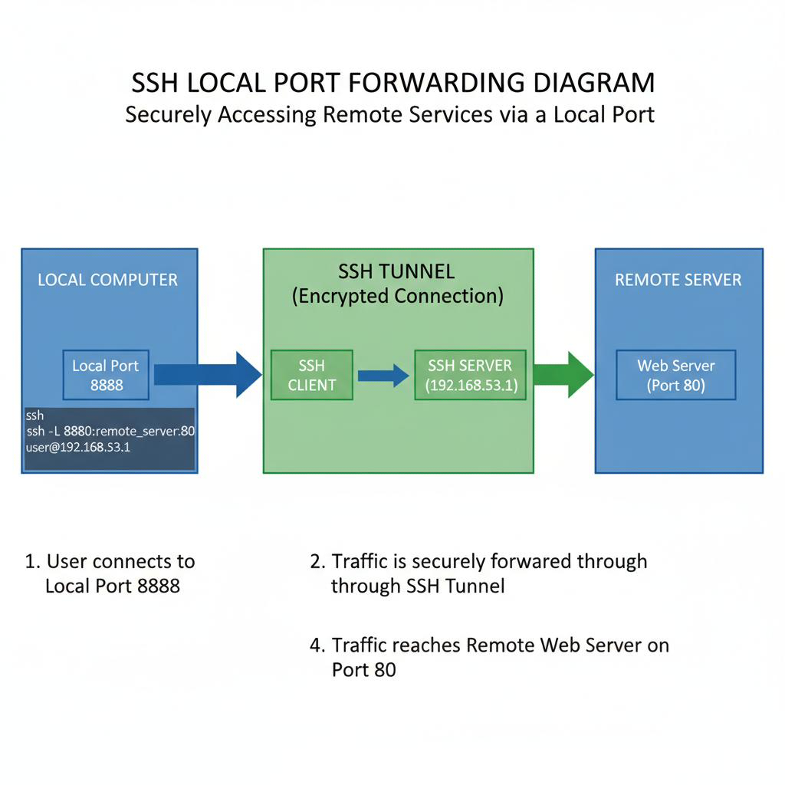

**☀️<u>공지 사항</u>☀️** 해당 페이지는 `Red Raccoon - PNT` 학습 후 추가적인 개인 공부를 통해 재구성 및 실습한 내용입니다.  필자의 환경에 맞게 공부 및 실습을 진행하여 이 점 참고 바랍니다.
{: .notice--danger}

# Local Port Forwarding
## 개요
로컬 포트 포워딩(Local Port Forwading)은 현재 사용중인 로컬 호스트로 들어오는 네트워크 트래픽을 대상 호스트의 특정 포트로 SSH Tenneling을 통해 전달해주는 기술이다.

-> 쉽게 말해, **사용자/공격자**의 로컬 호스트의 **포트**를 **대상 호스트의 포트**로 포워딩 

보통 방화벽 때문에 대상 호스트의 특정 포트에 접근이 불가능할 때, 다른 종류의 프로토콜을 이용해 해당 포트에 접근하기 위해서 사용된다.

- Local Port Forwarding 을 사용하는 이유
  1. 내부 네트워크나 방화벽 등으로 직접 접근이 불가능한 원격 서버의 특정 포트에 안전하게 접속하기 위해서 로컬 포트에 들어오는 트래픽을 암호화된 SSH 터널을 통해 원격 서버로 전달함으로써, 차단된 서비스에 우회 접근이 가능하다.
  2. 원격에 위치한 데이터베이스, 웹 서비스 등 내부 자원에 로컬 환경에서 편리하게 접근하여 테스트하거나 관리할 때 유용하다. 로컬 포트 포워딩을 설정하면 마치 로컬에서 해당 서비스가 실행되는 것처럼 연결할 수 있다.


## 사용하는 방법


1. SSH 클라이언트에서 로컬 포트 포워딩 설정 명령어를 사용한다. 기본 명령어 구문은 다음과 같다.  

```bash
ssh -L [로컬_IP:]로컬_포트:목적지_IP:목적지_포트 [사용자@]SSH_서버
```

- 로컬_IP는 생략해도 되며 기본으로 로컬호스트(127.0.0.1)에 바인딩된다.  
- 로컬_포트는 로컬 머신에서 열 포트 번호를 의미한다.  
- 목적지_IP와 목적지_포트는 SSH 서버를 통해 접근하고자 하는 원격 호스트와 서비스 포트이다.  


2. 예를 들어 로컬 8888번 포트를 통해 원격 SSH 서버(예: 192.168.53.1)에 접속하여, 해당 서버의 80번 포트(웹서버)에 접근하는 경우 명령어는 다음과 같다.  


```bash
ssh -L 8888:127.0.0.1:80 user@192.168.53.1
```
- 이렇게 하면 로컬 머신에서 `localhost:8888`로 접속 시 원격 서버의 80번 포트로 트래픽이 전달된다.  


3. 연결 후 로컬 브라우저나 애플리케이션에서 `localhost:로컬_포트`로 접속하면 원격 서버의 서비스에 마치 로컬에서 접속하는 것처럼 사용할 수 있다.  


4. 로컬 포트 포워딩은 방화벽으로 막힌 네트워크 내 서비스 접속, 원격 데이터베이스 접근, 원격 웹 테스트 등 다양한 상황에서 활용할 수 있다.
