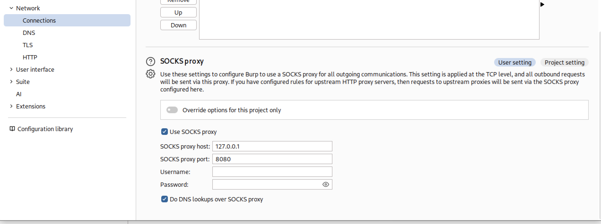

**☀️<u>공지 사항</u>☀️** 해당 페이지는 `Red Raccoon - PNT` 학습 후 추가적인 개인 공부를 통해 재구성 및 실습한 내용입니다. 필자의 환경에 맞게 공부 및 실습을 진행하여 이 점 참고 바랍니다. [Red Raccoon - PNT 강의 사이트로 이동하기](https://www.inflearn.com/course/pnt-%ED%94%BC%EB%B2%84%ED%8C%85-%ED%84%B0%EB%84%90%EB%A7%81)
{: .notice--danger}

# 다이나믹 포트 포워딩

## 개요
다이나믹 포트 포워딩은 지정된 로컬 포트에 SOCKS 프록시 서버를 생성하여, 애플리케이션이 이 프록시와 SSH 터널을 통해 다양한 목적지로 트래픽을 라우팅할 수 있게 하는 기술이다.

다이나믹 포트 포워딩의 경우 특정 포트로 1:1 포워딩하는 로컬과 리모트 포트 포워딩 방식과는 다르게 동적으로 트래픽을 전달해야하기 때문에 SSH 클라이언트 호스트를 SOCKS 프록시 서버로 설정하여 프록시 서버의 리스너 포트로 들어오는 모든 트래픽을 대상 호스트로 전달해준다.

즉, 특정 포트와 목적지를 미리 정하지 않고, 사용자의 요청에 따라 **동적으로** 목적지를 지정해 트래픽을 전달하는 방식을 말한다. 

### 다이나믹 포트 포워딩을 사용하는 이유
로컬 및 리모트 포트 포워딩은 고정된 특정 포트를 1:1로 포워딩하며, 1개의 대상 호스트를 대상으로 이뤄진다는 단점이 존재한다. 예를 들어 `10.1.20.0/24` 네트워크에 데이터베이스 서버가 50개가 있다면, 로컬 포트 포워딩을 50번 반복해야한다.

또한 대상 호스트의 접근하고자 하는 포트 번호를 사전에 알아놔야한다는 단점도 존재한다.  데이터베이스 서비스가 3306이 아니라 33060에서 실행중이라면, 포트 스캔이 불가하기 때문에 로컬 포트 포워딩을 33060번 반복해야한다.

이러한 문제를 해결하기 위해 다이나믹 포트 포워딩이 사용된다. 다이나믹 포트 포워딩은 SOCKS 프록시를 활용하여 포트 번호를 **동적으로 할당**함으로써, 다양한 대상 호스트 목적지로 트래픽을 **유연하게** 전달할 수 있습니다.

위의 장정에도 불구하고 `로컬 포트 포워딩`과 `리모트 포트 포워딩`을 사용하는 경우는 다음과 같다.

**로컬 포트 포워딩의 이유**
- 정해진 목적지 포트에만 트래픽을 전달: 내부에 숨겨진 DB, 내부 웹 서비스 등 특정 서버의 특정 포트에만 접근이 필요할 때 간단하게 설정 가능.
- 간결성·보안성: 지정한 포트만 터널링하기 때문에, 트래픽 범위가 제한되어 실수나 오용 위험이 감소함.
- 권한 분리와 서비스 운영: DB 관리툴, 내부 API 등 접근 대상이 명확할 때 불필요한 오픈 없이 운영이 가능함.

**리모트 포트 포워딩의 이유**
- 원격지에서 내 로컬 포트에 바로 접근 필요: 외부 서버에서 내 로컬의 특정 서비스(예: 개발용 웹서버)에 접근해야 할 때 사용.
- 클라이언트가 아닌 서버가 포트 오픈: 역방향 터널이나 클라이언트에서 서버로 접근이 불가능할 때, 서버가 직접 포트 오픈하여 터널링 가능.
- 특정 외부 서비스 노출: 내부망 서비스(예: 내부 DB, 웹, 관리툴 등)를 외부에 한시적으로 공개하려는 경우에 적합.

### 다이나믹 포트 포워딩의 특징
- SOCKS 프로토콜을 이용해 클라이언트와 서버 간 네트워크 패킷을 다양한 목적지로 라우팅한다.
- 로컬 머신에 SOCKS 프록시 서버를 만들어 지정된 포트(예: 1080)에서 요청을 수신하고 SSH 터널을 통해 원격 서버가 최종 목적지로 트래픽을 전달한다.
- 방화벽 우회, 인터넷 검열 우회, 보안 연결 등이 주된 사용 목적이다.
- 애플리케이션의 필요에 따라 목적지를 동적으로 지정할 수 있어 매우 유연하다.

### SOCKS Proxy 사용시 유의점
- **TCP Connect Scan (`-sT`)** 만 가능 -> Raw 소켓 변형 불가
- **SOCKS aware** 툴만 사용 가능
- 속도가 느림
- (SOCKS4) 사용자 인증 없음, TCP만 가능, DNS 프록시 불가
- (SOCKS5) 사용자 인증 있음, TCP+UDP, DNS 프록시 가능


## 다이나믹 포트 포워딩 사용법 - 기본 명령어와 단계별 예시

다이나믹 포트 포워딩(Dynamic Port Forwarding)은 SSH의 `-D` 옵션을 사용해 로컬에서 SOCKS 프록시 서버를 생성한 뒤, 해당 프록시를 거쳐 다양한 목적지로 트래픽을 보낼 수 있게 하는 방식이다.

### 0. 프록시 설정 파일 확인
```bash
# ProxyList에 SOCKS 프록시 추가
sudo vim /etc/proxychains4.conf

157 [ProxyList]
161 socks5  127.0.0.1 8080				// 해당 부분 처럼 수정


# 일반적으로 `dynamic_chain`의 주석을 풀고, `strict_chain`과 `random_chain`은 주석 처리

dynamic_chain
#strict_chain
#random_chain
```
#### 체인 방식 참고사항
- strict_chain: SOCKS 프록시(SSH 다이나믹 포트포워딩)만 ProxyList에 하나 등록해 사용하면 정상적으로 동작한다. 다만, 프록시를 여러 개 사용할 경우 체인 중 하나라도 장애가 있으면 전체가 실패함.
- 일반적으로 한 개의 SSH SOCKS 프록시만 등록한다면, strict_chain/dynamic_chain 모두 동작에 차이 없다.
- 여러 프록시를 체인에 넣어 불안정할 수 있다면, dynamic_chain으로 바꾸는 것이 더 실용적이지만, 단일 SSH 다이나믹 포트포워딩만 등록하고 사용한다면 strict_chain 상태로도 작동한다.


### 1. SSH로 SOCKS 프록시 서버 생성

아래 명령어로 로컬 컴퓨터의 특정 포트(예: 8080)에 SOCKS 프록시 생성:

```bash
ssh -D 8080 user@example.com
```
- `-D 8080`: 로컬에 8080 포트 SOCKS 프록시 생성
- `user@example.com`: SSH 접속 계정 및 서버 주소

고급 옵션 예시:
```bash
ssh -D 8080 -C -q -N user@example.com
```
- `-C`: 데이터 전송 압축(브라우징 속도 향상)
- `-q`: 출력을 최소화
- `-N`: 원격 명령 실행 없이 터널만 생성

### 2. 브라우저 또는 애플리케이션 SOCKS 프록시 설정

BurpSuit 예시:
- 설정 → Network → Connections → SOCKS proxy


***

파이어폭스 예시:
- 네트워크 설정에서 '수동 프록시 설정' → SOCKS 호스트: `127.0.0.1`, 포트: `8080` 입력
- SOCKS v5 선택

크롬 등 다른 브라우저는 확장기능이나 시스템 프록시를 통해 설정 가능

### 3. 프록시를 통한 트래픽 확인 예시
- BurpSuit에서 확인하는 방법
	- `ipinfo.io/ip` 접속한 뒤 아이피 확인하기


- 터미널에서 다음과 같이 테스트:

```bash
└─$ sudo proxychains4 nmap -p 3389,5985 -Pn -sT [타겟IP]

curl --socks5-hostname localhost:8080 ifconfig.me
```
- 프록시 경유시 외부에서 확인되는 IP가 SSH 서버의 IP로 바뀌는 것을 볼 수 있음

## 실제 활용 시나리오

- **공용 와이파이 등 불안정한 환경**에서 인터넷 접속시 안전한 터널 보장
- **국가 제한 우회** (SSH 서버가 있는 국가의 IP로 인터넷 트래픽 전달)
- **내부망 리소스 접근**: 접근 제한된 서버에 SOCKS 프록시 통해 다양하게 트래픽 전달

