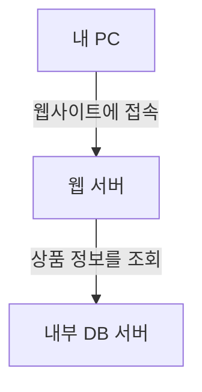
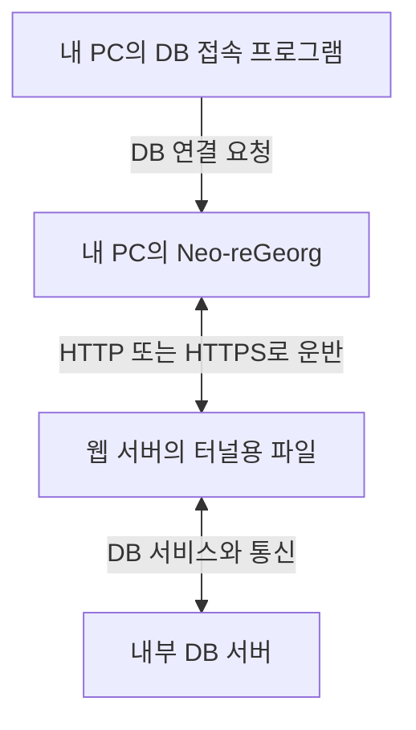

Neo-reGeorg는 **웹 서버를 중간에 두고, 내 PC에서 직접 접속할 수 없는 내부 서비스와 통신하게 해주는 도구**다.

이 설명만으로는 조금 추상적이다. 특히 “웹쉘을 생성한다”, “SOCKS 프록시를 연다”, “Proxychains를 붙인다”는 말이 한꺼번에 나오면 어느 부분이 무슨 일을 하는지 헷갈리기 쉽다.

그래서 이번 글에서는 웹 서버와 내부 데이터베이스가 있는 간단한 상황을 놓고, 요청 하나가 어떻게 전달되는지 따라가 본다. 공개된 공식 문서를 바탕으로 정리한 개념 설명이며, 아래 구성은 이해를 돕기 위한 예시다.

## 1. 내 PC에서는 안 되는데, 웹 서버에서는 된다면?

쇼핑몰을 생각해보자. 사용자는 인터넷으로 쇼핑몰 웹사이트에 접속한다. 웹 서버는 상품 목록을 보여주기 위해 회사 내부의 데이터베이스(DB)에 상품 정보를 요청한다.

여기서 **웹 서버**는 웹 요청을 처리하는 컴퓨터이고, **DB 서버**는 상품이나 주문 정보를 저장하고 조회하는 컴퓨터다. 둘을 분리해서 운영하는 구성이다.



웹사이트가 공개되어 있다고 DB까지 인터넷에 공개할 필요는 없다. 오히려 DB에는 웹 서버처럼 필요한 시스템만 연결할 수 있도록 제한하는 것이 일반적인 설계다.

예시의 접속 조건을 이렇게 정해보자.

- 내 PC에서 웹 서버로 접속할 수 있다.
- 웹 서버에서 내부 DB로 접속할 수 있다.
- 내 PC에서 내부 DB로 직접 접속할 수는 없다.

이때 웹 서버에 **데이터를 대신 전달해주는 프로그램**을 실행할 수 있다면 어떨까?

내 PC가 보낸 데이터를 웹 서버가 받아 DB로 전달하고, DB의 응답을 다시 내 PC로 보내는 구조를 생각할 수 있다. Neo-reGeorg는 이런 중계를 웹 통신을 통해 수행한다.

물론 쇼핑몰 웹사이트에 접속할 수 있다는 사실만으로 이 기능을 사용할 수 있는 것은 아니다. 웹 서버에서 터널용 코드가 실행될 수 있다는 조건이 추가로 필요하다. 이 조건은 뒤에서 다시 살펴본다.

## 2. 프록시·터널링·피벗팅부터 구분하자

세 단어는 같은 상황을 서로 다른 관점에서 설명한다.

### 프록시: 목적지에 대신 연결해주는 중간 지점

내 PC가 DB에 직접 연결하는 대신, 중간 프로그램에 “이 DB로 연결해줘”라고 요청하는 방식이다. 중간 프로그램이 연결을 만들고 데이터를 전달한다.

여기서는 **누가 대신 연결하는가**에 초점을 맞추면 된다.

### 터널링: 다른 통신 안에 데이터를 담아 운반하는 방식

보통 웹 통신이라고 하면 HTML 페이지나 이미지가 오가는 모습을 생각한다. 하지만 HTTP 요청과 응답에는 다른 데이터도 담을 수 있다.

Neo-reGeorg는 전달할 데이터를 웹 요청·응답에 담아 운반한다. 웹 서버 쪽 프로그램은 그것을 해석해 목적지로 전달하고, 돌아온 데이터도 같은 방식으로 보내준다.

DB의 통신 내용이 웹 요청·응답이라는 운반 수단을 이용하는 셈이다. 이때 **데이터를 어떻게 운반하는가**를 설명하는 말이 터널링이다.

### 피벗팅: 접근 가능한 서버를 거쳐 다른 시스템으로 이동하는 방식

처음에는 웹 서버까지만 접근할 수 있었는데, 그 서버를 경유해 내부 DB와도 통신하게 됐다. 이렇게 이미 접근할 수 있는 시스템을 중간 지점으로 활용하는 것을 피벗팅이라고 한다.

정리하면, **프록시는 중계 역할, 터널링은 운반 방식, 피벗팅은 그 경로를 활용하는 접근 방식**이다.

## 3. 그렇다면 왜 “웹쉘을 생성한다”고 할까?

웹쉘은 보통 웹 요청으로 서버의 파일을 다루거나 명령을 실행하는 서버 측 프로그램을 가리킨다. 이름에 ‘쉘’이 들어가지만 반드시 터미널처럼 생긴 화면이 있는 것은 아니다.

[Neo-reGeorg의 공식 문서](https://github.com/L-codes/Neo-reGeorg/blob/master/README-en.md#basic-usage)는 서버용 파일을 생성하는 기능을 제공하며, 도움말에서는 이 파일 생성을 webshell 생성이라고 표현한다. 다만 이 도구의 중심 기능은 **네트워크 연결을 중계하는 것**이다.

예를 들어 PHP 환경용 `tunnel.php`나 JSP 환경용 `tunnel.jsp` 같은 파일을 만들 수 있다. PHP와 JSP는 웹 서버 쪽에서 코드를 실행하는 데 사용하는 기술이다. 해당 서버가 처리할 수 있는 파일 형식이 필요하다.

여기서 세 단계를 분리해야 한다.

**① 파일 생성**

내 PC에서 서버용 파일을 만든다. 이 시점에는 파일이 내 PC에 있을 뿐, 다른 서버에서 무언가 실행된 것은 아니다.

**② 서버에 배치**

만든 파일을 웹 서버에 저장한다. 정상적인 배포 권한이 있거나, 취약한 업로드 기능처럼 서버에 파일을 쓸 수 있는 별도의 조건이 있어야 한다.

**③ 서버에서 실행**

그 파일에 웹 요청을 보냈을 때 웹 서버가 내용을 코드로 처리해야 한다. 업로드한 파일을 그대로 내려받게만 하는 저장소라면 이 조건을 충족하지 못한다.

즉, **“파일을 만들었다 → 올렸다 → 실행됐다”는 각각 다른 단계**다. Neo-reGeorg의 생성 기능 하나로 이 세 단계가 모두 해결되지는 않는다.

## 4. DB 접속 요청 하나를 따라가 보자

이제 웹 서버에 터널용 파일이 배치되어 실행될 수 있다고 가정하자. 내 PC에는 DB 접속 프로그램과 Neo-reGeorg 클라이언트가 있다.

여기서 **클라이언트**는 요청을 보내는 쪽의 프로그램이라는 뜻이다. DB 접속 프로그램은 DB에 요청하고, Neo-reGeorg 클라이언트는 웹 서버의 터널용 파일과 통신한다.



흐름을 문장으로 풀면 다음과 같다.

1. **DB 접속 프로그램이 목적지를 알려준다.** 내 PC에서 Neo-reGeorg에 “이 주소의 DB 서비스에 연결하고 싶다”고 요청한다.
2. **Neo-reGeorg가 웹 서버에 요청한다.** 목적지 정보와 전달할 데이터를 HTTP 또는 HTTPS로 보낸다.
3. **웹 서버가 DB에 연결한다.** 서버에서 실행되는 터널용 코드가 내부 DB로 연결을 만든다.
4. **DB의 응답이 되돌아온다.** 웹 서버가 받은 데이터를 웹 응답으로 돌려주고, 내 PC의 Neo-reGeorg가 DB 접속 프로그램에 전달한다.

주소와 함께 등장하는 **포트**는 한 컴퓨터에서 어떤 서비스에 연결할지 구분하는 번호다. ‘건물 주소’와 ‘찾아갈 창구’를 함께 지정한다고 생각하면 된다.

이 과정에서 DB와 실제로 연결하는 쪽은 웹 서버다. 그래서 내 PC에서 직접 연결할 때와 다른 접근 경로가 생긴다.

다만 아직 DB의 로그인 절차는 남아 있다. 통신이 도착했다는 것과 올바른 DB 계정으로 인증됐다는 것은 다르다. **터널은 접속 경로를 만들어주고, DB는 여전히 계정과 권한을 검사한다.**

## 5. SOCKS와 Proxychains는 어디에 쓰일까?

앞에서는 DB 접속 프로그램이 Neo-reGeorg에 목적지를 알려준다고 설명했다. 서로 다른 프로그램끼리 이 요청을 주고받으려면 정해진 약속이 필요하다. 그중 하나가 **SOCKS**다.

SOCKS를 지원하는 프로그램은 프록시에 목적지 주소와 포트를 알려주고 연결을 요청할 수 있다. Neo-reGeorg는 내 PC에 SOCKS5 프록시를 제공한다.

이때 설정에서 자주 보이는 `127.0.0.1`은 **현재 프로그램이 실행 중인 자기 컴퓨터**를 뜻한다. 내 PC의 프로그램에서 `127.0.0.1`을 지정하면 내 PC를 가리킨다. 내부 DB의 주소가 아니다.

따라서 연결에는 서로 다른 두 목적지가 등장한다.

- **프록시 주소:** 우선 요청을 전달할 내 PC의 Neo-reGeorg.
- **최종 목적지:** 실제로 이용하려는 내부 DB의 주소와 서비스 포트.

프로그램에 SOCKS 설정 기능이 있다면 그 설정으로 프록시를 지정할 수 있다. 그런 설정이 없을 때 함께 등장하는 도구가 [Proxychains-ng](https://github.com/rofl0r/proxychains-ng)다. 지원되는 프로그램의 네트워크 연결을 프록시로 보내도록 도와준다.

**Neo-reGeorg가 중계 통로를 제공한다면, Proxychains는 프로그램의 연결을 그 통로 입구로 안내하는 역할**이다. 둘은 경쟁 도구라기보다 함께 사용할 수 있는 도구다.

다만 Proxychains가 모든 프로그램과 모든 통신을 처리하는 것은 아니다. 프로그램 실행 방식에 따른 제약이 있고, TCP 연결을 지원한다. 이 글의 DB 연결 예시는 TCP 통신으로 생각하면 된다.

## 6. 외부로 연결할 수 없다는데, 어떻게 통신할까?

여기서는 “누가 먼저 연결을 시작하느냐”가 중요하다.

예를 들어 웹 서버가 내 PC로 새로운 연결을 시작하는 것은 차단되어 있지만, 내 PC에서 웹 서버로 접속하는 것은 허용되어 있다고 하자. 웹 서버는 들어온 웹 요청에 응답할 수 있다.

```text
내 PC → 웹 서버에 새 연결 시작: 허용
웹 서버 → 그 연결로 응답 보내기: 허용
웹 서버 → 내 PC로 별도의 새 연결 시작: 차단
```

이 정책에서는 웹 서버가 내 PC 쪽으로 연결을 시작하는 **리버스 쉘** 방식은 막힐 수 있다. 리버스 쉘은 원격 서버 쪽에서 연결을 걸어, 그 연결로 명령과 결과를 주고받는 형태의 쉘이다.

반면 위에서 설명한 HTTP 터널은 내 PC가 시작한 웹 요청·응답을 사용한다. 응답에 담겨오는 데이터도 활용하므로, 웹 서버가 내 PC에 별도의 새 연결을 시작할 필요가 없다.

이것이 해당 구성에서 Neo-reGeorg를 이해하는 중요한 지점이다. “방화벽을 무조건 통과한다”는 뜻은 아니다. **내 PC에서 웹 서버로 연결할 수 있고, 웹 서버에서 내부 목적지로 연결할 수 있어야 한다.** 요청을 중간에서 차단하거나 실행 시간을 제한하는 설정도 결과에 영향을 줄 수 있다.

## 7. Chisel·Ligolo-ng·SSH와는 무엇이 다를까?

비슷한 도구들도 중간 시스템을 이용해 통신 경로를 만든다. 차이는 주로 **어떤 프로그램을 실행해야 하는지, 어떤 연결이 이미 가능한지, 내 PC에서 경로를 어떻게 이용하는지**에 있다.

### Neo-reGeorg: 웹 서버에서 실행되는 파일을 활용

이 글에서 살펴본 기본 방식은 웹 서버의 PHP·JSP 같은 실행 환경을 이용한다. 내 PC는 그 파일의 웹 주소로 요청을 보낸다.

따라서 웹 서버에서 터널용 코드를 실행할 수 있고 그 웹 주소에 접근할 수 있다는 것이 출발점이다. 일반적인 웹 서버 설정과 요청 처리 제약의 영향을 받는다. 프로젝트에는 별도 실행 형태도 있지만, 여기서는 웹 파일을 이용하는 방식에 초점을 맞춘다.

### Chisel: 별도의 터널 프로그램을 실행

[Chisel](https://github.com/jpillora/chisel)은 클라이언트와 서버 역할을 수행하는 별도 실행 프로그램을 사용한다. PHP나 JSP를 처리하는 웹 서버가 필수인 구조는 아니다.

HTTP를 운반 수단으로 쓰고 SSH 프로토콜로 터널 통신을 보호한다. 여기서 SSH를 사용한다는 말은 기존 SSH 서버에 로그인해야 한다는 뜻이 아니라, Chisel 내부에서 그 프로토콜을 이용한다는 뜻이다. 특정 서비스 연결을 전달하는 포트 포워딩과 SOCKS 기능 등을 제공한다.

Neo-reGeorg와 비교할 때 핵심 질문은 **“웹 파일을 실행할 수 있는가, 아니면 별도 프로그램을 실행할 수 있는가?”**다. Chisel 프로그램을 실행할 수 있어도 클라이언트와 서버 사이의 통신 경로가 막혀 있으면 터널은 성립하지 않는다.

### Ligolo-ng: 프로그램별 프록시 대신 네트워크 경로를 설정

[Ligolo-ng](https://docs.ligolo.ng/)는 원격 호스트에 에이전트를 실행하고, 중계 측에서 가상 네트워크 인터페이스인 **TUN**을 이용한다. 에이전트는 원격 호스트에서 중계 작업을 수행하는 프로그램이다.

TUN은 소프트웨어로 만든 네트워크 입구라고 생각하면 된다. 운영체제에 “이 목적지 대역으로 가는 통신은 이 입구로 보내라”고 설정하는 방식이다. 그래서 프로그램마다 SOCKS를 지정하거나 Proxychains로 감쌀 필요가 줄어든다.

사용하는 느낌은 VPN과 비슷한 부분이 있지만, 모든 패킷을 그대로 전달하는 일반적인 VPN과 완전히 같지는 않다. 원격 에이전트는 관리자 권한 없이 실행할 수 있고, 중계 측에서는 TUN을 만들 수 있는 권한이 필요하다.

### SSH 터널링: 이미 가능한 SSH 접속을 활용

[SSH](https://man.openbsd.org/ssh#D)는 원격 서버에 안전하게 접속하는 데 널리 쓰이지만, 접속 통로 안으로 다른 서비스의 연결을 전달하는 기능도 있다. 특정 포트를 연결하거나 SOCKS 프록시를 제공할 수 있다.

이미 중간 서버에 SSH로 접속할 수 있고 서버 설정에서 포워딩을 허용한다면, 기존 SSH 기능으로 필요한 경로를 만들 수 있다. 추가 웹 파일을 배치할 필요도 없다.

반대로 SSH 계정이 없거나 SSH 서비스에 도달할 수 없다면 이 전제가 성립하지 않는다. 웹사이트에 접속할 수 있다고 SSH 접속도 가능하다고 볼 수는 없다.

### Sliver도 터널링 도구일까?

[Sliver](https://sliver.sh/docs/?name=Reverse+SOCKS)도 SOCKS 프록시 기능을 제공하지만, 목적이 더 넓다. 원격 에이전트와 통신하고 세션을 관리하는 **C2(Command and Control) 프레임워크**다. C2는 원격 프로그램에 작업을 전달하고 결과를 받는 통신·제어 체계를 뜻한다.

따라서 “Neo-reGeorg의 더 강력한 버전”이라고 보기보다, 에이전트를 관리하는 여러 기능 중에 내부 연결을 중계하는 기능도 있다고 이해하면 된다. 실제로 사용하려면 에이전트 실행과 제어 서버 사이의 통신이 가능해야 한다.

### 한눈에 비교하기

아래 표는 각 도구의 대표적인 사용 구조를 비교한 것이다.

| 도구 | 출발점 | 내 프로그램이 경로를 이용하는 방식 | 먼저 확인할 조건 |
|---|---|---|---|
| Neo-reGeorg | 웹 서버의 터널용 파일 | 주로 SOCKS 프록시 | 웹 파일 실행과 웹 주소 접근 |
| Chisel | 별도 클라이언트·서버 프로그램 | 포트 포워딩 또는 SOCKS | 프로그램 실행과 양쪽 통신 |
| Ligolo-ng | 원격 에이전트와 중계 프로그램 | 가상 인터페이스로 보내는 경로 | 에이전트 실행과 TUN 구성 |
| SSH | 기존 SSH 접속 | 포트 포워딩 또는 SOCKS | SSH 인증과 포워딩 허용 |
| Sliver | 원격 에이전트와 C2 | 세션의 프록시 기능 등 | 에이전트 실행과 C2 통신 |

이 비교에서는 속도나 탐지 회피 성능의 순위를 매기지 않았다. 실제 선택에서는 **현재 확보한 실행 환경과 가능한 연결 방향**이 먼저다. 웹 서버에 코드를 실행하는 상황과 SSH로 로그인한 상황은 출발 조건부터 다르기 때문이다.

## 8. 연결에 성공해도 그대로 남는 것

터널링을 처음 공부하면 “내부망에 들어갔다”는 표현이 모든 권한을 얻었다는 뜻처럼 들릴 수 있다. 실제로는 아래 문제가 각각 남는다.

**DB에 연결할 수 있어도 로그인은 필요하다.** 계정이 맞아도 해당 DB 사용자가 조회만 할 수 있다면 데이터 변경까지 허용되는 것은 아니다.

**웹 서버에 코드를 실행해도 자동으로 root가 되지 않는다.** root는 Linux의 관리자 계정이다. 일반 웹 서비스 계정으로 실행되던 프로그램이 터널을 만들었다는 이유만으로 관리자 권한을 얻지는 않는다.

**웹 서버가 접근할 수 없는 다른 서버까지 연결되지는 않는다.** 중계 지점에서 목적지로 갈 수 있는 경로와 서비스가 있어야 한다.

방어할 때도 이 구분이 도움이 된다. 업로드 파일이 실행되지 않도록 하고, 웹 서버가 필요한 내부 서비스에만 연결하도록 제한하며, DB 계정에는 필요한 작업 권한만 부여한다. 각각 실행·통신·서비스 권한이라는 다른 단계를 제한하는 조치다.

## 9. 이 예시에서 기억할 흐름

처음에는 내 PC에서 내부 DB로 직접 연결할 수 없었다. 웹 서버가 대신 DB로 연결하고, 내 PC와 웹 서버가 HTTP 요청·응답으로 데이터를 주고받으면서 새로운 통신 경로가 생겼다.

이 흐름에서 **Neo-reGeorg는 중계 통로를 제공하고, SOCKS는 프로그램이 그 통로에 연결을 요청하는 약속이며, Proxychains는 지원되는 프로그램의 연결을 프록시로 보내주는 도구**다.

영상에서 세 이름이 함께 나오면 “어떤 취약점을 공격하는 명령인가?”에 앞서, **“지금 이 단계는 서버에서 코드를 실행하는 단계인가, 이미 실행 가능한 서버를 이용해 통신 경로를 만드는 단계인가?”**를 구분해보면 이해하기가 훨씬 쉽다.
