C2: Public IP: 15.164.245.225 , Private IP: 10.0.5.185
Redirector: Public IP: 3.36.114.150 , Private IP: 10.0.3.0
Operator: Public IP: 3.34.51.39, Private IP: 10.0.2.39


# RTL 프로젝트: 레드팀 공격자 인프라 구축기 (1) - AWS 기반 3-Tier 인프라 구축

## 📋 목차
1. [프로젝트 개요](#프로젝트-개요)
2. [인프라 아키텍처 설계](#인프라-아키텍처-설계)
3. [사전 준비: 로컬 환경 구성](#사전-준비-로컬-환경-구성)
4. [도메인 전략 및 획득](#도메인-전략-및-획득)
5. [AWS 인프라 구축](#aws-인프라-구축)
6. [검증 및 다음 단계](#검증-및-다음-단계)
7. [학습 포인트 & 트러블슈팅](#학습-포인트--트러블슈팅)

---

## 프로젝트 개요

### RTL(Red Team Lite)이란?

RTL은 실제 APT(Advanced Persistent Threat) 공격자의 TTP(Tactics, Techniques, and Procedures)를 시뮬레이션하는 **교육용 풀체인 레드팀 작전 프로젝트**입니다. 가상 회사인 "라쿤테크(RaccoonTech)"를 대상으로 초기 침투부터 권한 상승, 횡적 이동, 목표 달성까지 전체 공격 체인을 학습합니다.

### 왜 공격자 인프라가 필요한가?

실제 공격자나 레드팀은 자신의 집 IP에서 직접 공격하지 않습니다. 그 이유는:

1. **작전보안(OPSEC)**: 신원 특정 방지
2. **콜백(Callback) 수신**: 대부분의 가정/회사 IP는 CGNAT/NAT로 인해 공인 IP가 없어 외부에서 직접 콜백 수신 불가
3. **탐지 회피**: 지리적/디지털 위치를 실시간으로 변경하여 추적 회피

> 💡 **핵심 개념**: 공격자는 VPS, 클라우드, 이전에 장악한 서버 등을 활용하여 자신의 실제 위치를 숨기고, 다양한 지점에서 공격을 수행합니다.

---

## 인프라 아키텍처 설계

### 전체 구조 개요

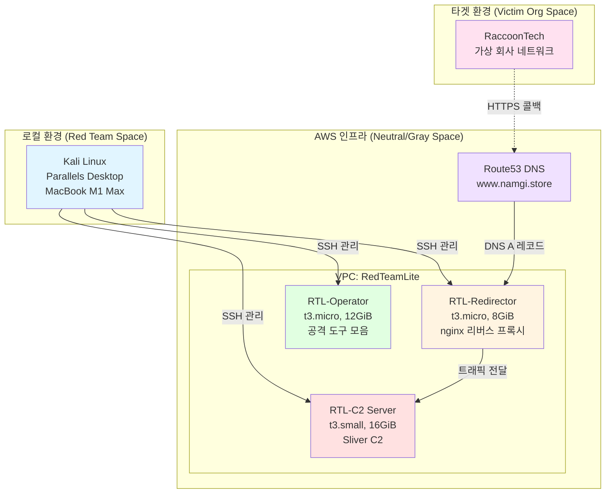

### 3-Tier 아키텍처 구성

| 서버 타입 | 역할 | 스펙 | 주요 기능 |
|---------|------|------|----------|
| **C2 서버** | Command & Control | t3.small, 16GiB | Sliver 프레임워크 실행, 에이전트 관리, 명령 전송 |
| **Redirector 서버** | 트래픽 중계 | t3.micro, 8GiB | nginx 리버스 프록시, SSL/TLS 종단, C2 IP 은닉 |
| **Operator 서버** | 공격 수행 | t3.micro, 12GiB | 정찰 도구, 터널링, 컴파일러, 클라우드 CLI |

### 네트워크 플로우

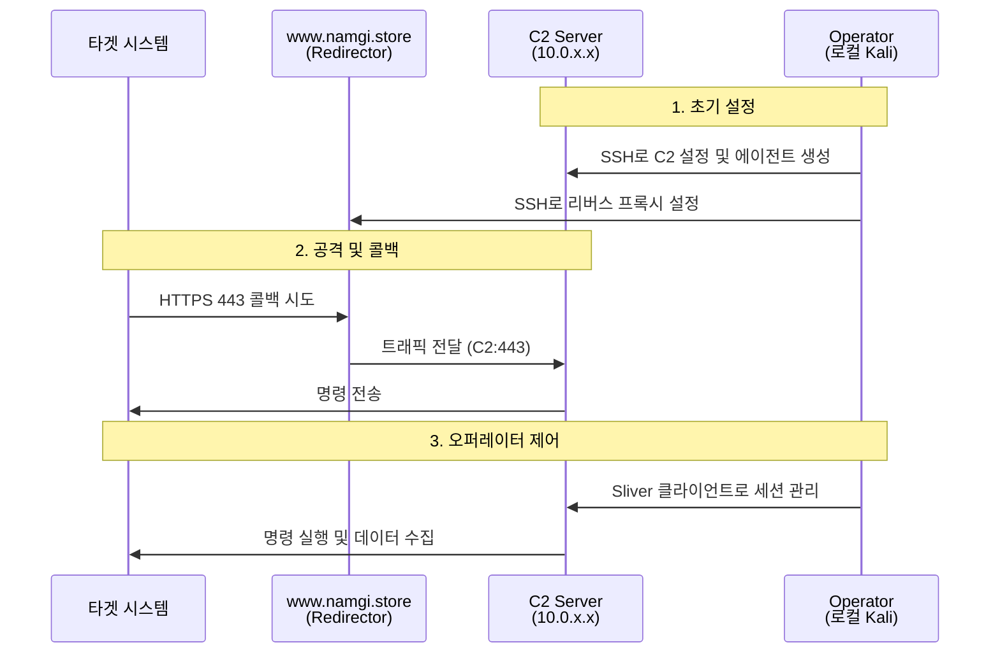

### 레드팀 공간 구분

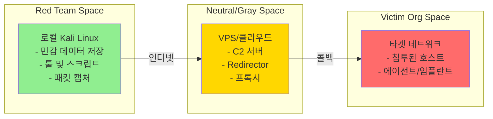

> ⚠️ **중요**: 민감한 데이터(고객 정보, API 키, 비밀번호)는 절대 Red Team Space(로컬 환경) 밖으로 나가면 안 됩니다!

---

## 사전 준비: 로컬 환경 구성

### 환경 스펙

- **하드웨어**: MacBook M1 Max
- **하이퍼바이저**: Parallels Desktop
- **게스트 OS**: Kali Linux 2025.03 (최신 버전)
- **네트워킹**: NAT (인터넷 접근 가능)

### 필수 도구 설치

```bash
# Kali Linux 패키지 업데이트
sudo apt update -y

# 기본 도구 설치
sudo apt install -y pipx freerdp3-x11

# Docker 설치 (Kali 공식 방법)
echo "deb [arch=amd64 signed-by=/etc/apt/keyrings/docker.gpg] https://download.docker.com/linux/debian bookworm stable" | \
  sudo tee /etc/apt/sources.list.d/docker.list

curl -fsSL https://download.docker.com/linux/debian/gpg | \
  sudo gpg --dearmor -o /etc/apt/keyrings/docker.gpg

sudo apt update -y
sudo apt install -y docker-ce docker-ce-cli containerd.io

# Sublime Text 설치 (선택 사항)
wget -qO - https://download.sublimetext.com/sublimehq-pub.gpg | \
  sudo tee /etc/apt/keyrings/sublimehq-pub.asc > /dev/null

echo -e 'Types: deb\nURIs: https://download.sublimetext.com/\nSuites: apt/stable/\nSigned-By: /etc/apt/keyrings/sublimehq-pub.asc' | \
  sudo tee /etc/apt/sources.list.d/sublime-text.sources

sudo apt update -y
sudo apt install -y sublime-text

# 설치 확인
docker --version
pipx --version
```

### 작전 원칙

> 📌 **하나의 작전 = 하나의 VM 환경**
> 
> 매 작전마다 새로운 VM을 생성하고, 작전 종료 후 삭제하여 작전 간 격리를 유지합니다.

---

## 도메인 전략 및 획득

### 기존 도메인 활용 결정

RTL 프로젝트를 위해 새 도메인을 구매하는 대신, **기존에 보유하고 있던 `namgi.store` 도메인을 재활용**하기로 결정했습니다.

**이유:**
- 이미 Netlify에서 웹 서버 연습용으로 사용하던 도메인
- WHOIS 등록 이력이 있어 도메인 나이(age) 확보
- 새 도메인 구매 비용 절감
- DNS 관리만 변경하면 바로 사용 가능

### Gabia → AWS Route53 DNS 관리 이전

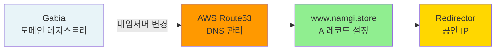

**진행 과정:**

1. **AWS Route53 호스팅 영역 생성**
   - AWS Console → Route53 → 호스팅 영역 생성
   - 도메인 이름: `namgi.store`
   - 타입: 퍼블릭 호스팅 영역

2. **Route53 네임서버 정보 확인**
   ```
   ns-xxxx.awsdns-xx.org
   ns-xxxx.awsdns-xx.co.uk
   ns-xxxx.awsdns-xx.com
   ns-xxxx.awsdns-xx.net
   ```

3. **Gabia 도메인 관리 콘솔에서 네임서버 변경**
   - Gabia 로그인 → 도메인 관리 → `namgi.store` 선택
   - 네임서버 설정 → 네임서버 변경
   - Route53의 4개 네임서버 입력
   - 적용 (전파 시간: 최대 48시간, 보통 1-2시간)

4. **DNS 전파 확인**
   ```bash
   # 네임서버 확인
   nslookup -type=NS namgi.store
   
   # 또는 dig 사용
   dig namgi.store NS
   ```

> 💡 **참고**: 도메인 소유권은 여전히 Gabia에 있으며, DNS 관리만 Route53로 이관했습니다. 이를 통해 AWS 생태계 내에서 통합 관리가 가능해집니다.

### 도메인 카테고리 검증 (선택 사항)

새 도메인을 구매할 경우, 다음 사이트에서 카테고리를 확인해야 합니다:
- **Cloudflare Radar**: https://radar.cloudflare.com/domains/feedback
- **McAfee**: https://sitelookup.mcafee.com/
- **Symantec**: https://sitereview.bluecoat.com/

**선호 카테고리**: Health & Fitness, Education, Finance, Personal Blog

기존 도메인인 경우 이미 사용 이력이 있으므로 생략 가능합니다.

---

## AWS 인프라 구축

### 구축 프로세스 타임라인

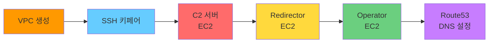

### 1단계: VPC 생성

**AWS Console → VPC → VPC 생성**

| 설정 항목 | 값 |
|----------|-----|
| VPC 설정 | VPC 등 |
| 이름 | RedTeamLite |
| IPv4 CIDR 블록 | 10.0.0.0/16 |
| IPv6 CIDR 블록 | 없음 |
| 테넌시 | 기본값 |
| 가용 영역(AZ) 수 | 1 |
| 퍼블릭 서브넷 수 | 1 |
| 프라이빗 서브넷 수 | 0 |
| NAT 게이트웨이 | 없음 |
| VPC 엔드포인트 | 없음 |
| DNS 옵션 | DNS 호스트 이름 활성화 ✅<br/>DNS 확인 활성화 ✅ |

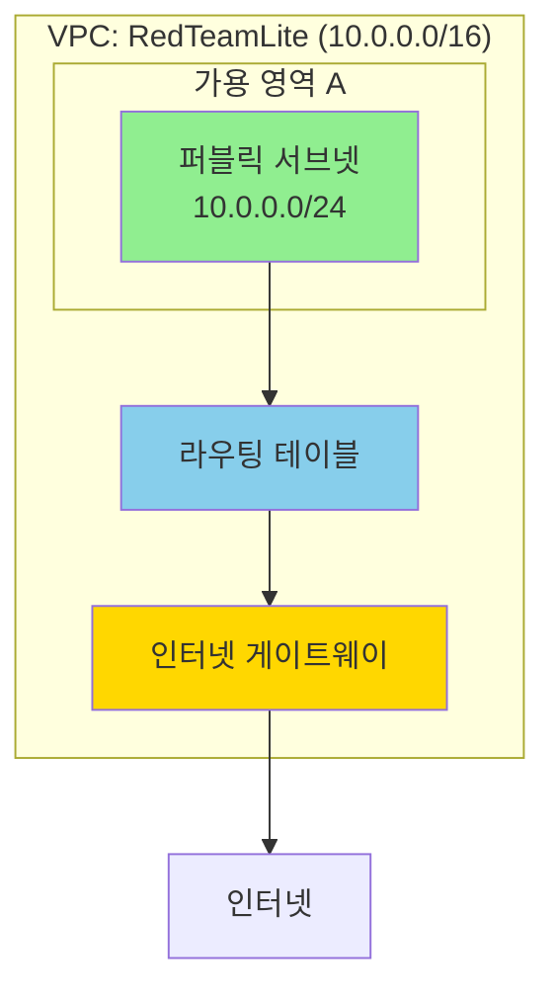

> ⚠️ **중요**: NAT 게이트웨이는 비용이 발생하므로 RTL에서는 사용하지 않습니다. 모든 서버가 퍼블릭 서브넷에 위치합니다.

### 2단계: SSH 키페어 생성 및 등록

**로컬 Kali Linux에서 키 생성:**

```bash
# RSA 2048 키페어 생성
ssh-keygen -t rsa -b 2048 -f ~/.ssh/redteamlite -C "redteamlite course" -N ""

# 공개키 내용 확인 (복사 필요)
cat ~/.ssh/redteamlite.pub
```

**AWS Console → EC2 → 키 페어 → 작업 → 키 페어 가져오기**

- 이름: `redteamlite`
- 키 파일 콘텐츠: `~/.ssh/redteamlite.pub`의 내용 붙여넣기
- 가져오기 클릭

```bash
# 키 권한 설정 (필수)
chmod 600 ~/.ssh/redteamlite
chmod 644 ~/.ssh/redteamlite.pub
```

> 💡 **보안 팁**: 프라이빗 키(`~/.ssh/redteamlite`)는 절대 외부에 공유하면 안 됩니다!

### 3단계: C2 서버 구축

**AWS Console → EC2 → 인스턴스 시작**

| 설정 항목 | 값 |
|----------|-----|
| 이름 | RTL-C2 |
| AMI | Ubuntu Server 24.04 LTS (HVM), SSD |
| 아키텍처 | 64-bit (x86) |
| 인스턴스 유형 | t3.small (2 vCPU, 2 GiB RAM) |
| 키 페어 | redteamlite |
| VPC | RedTeamLite |
| 서브넷 | RedTeamLite-subnet-public1 |
| 퍼블릭 IP 자동 할당 | 활성화 ✅ |
| 스토리지 | 16 GiB (gp3) |

**보안 그룹 (방화벽) 설정:**

| 타입 | 프로토콜 | 포트 | 소스 | 설명 |
|-----|---------|------|------|------|
| SSH | TCP | 22 | 내 IP | 관리용 SSH 접근 |
| 모든 트래픽 | All | All | 10.0.0.0/8 | VPC 내부 통신 |

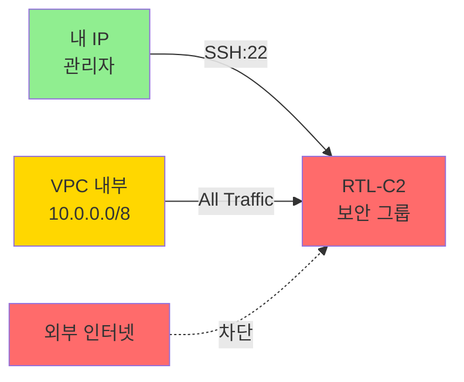

**SSH 접속 테스트:**

```bash
# EC2 대시보드에서 공인 IP 확인 (예: 13.115.71.210)
ssh -i ~/.ssh/redteamlite ubuntu@<C2-공인-IP>

# 예시
ssh -i ~/.ssh/redteamlite ubuntu@13.115.71.210
```

### 4단계: Redirector 서버 구축

**C2 서버와 동일하게 설정하되, 보안 그룹만 변경:**

| 설정 항목 | 값 |
|----------|-----|
| 이름 | RTL-Redirector |
| 인스턴스 유형 | t3.micro (2 vCPU, 1 GiB RAM) |
| 스토리지 | 8 GiB (gp3) |

**보안 그룹 차이점:**

| 타입 | 프로토콜 | 포트 | 소스 | 설명 |
|-----|---------|------|------|------|
| SSH | TCP | 22 | 내 IP | 관리용 SSH |
| HTTP | TCP | 80 | 0.0.0.0/0 | 웹 트래픽 (전 세계) |
| HTTPS | TCP | 443 | 0.0.0.0/0 | 웹 트래픽 (전 세계) |

> ❗ **핵심**: Redirector는 타겟의 콜백을 받아야 하므로 포트 80/443을 전체 인터넷(`0.0.0.0/0`)에 개방합니다.

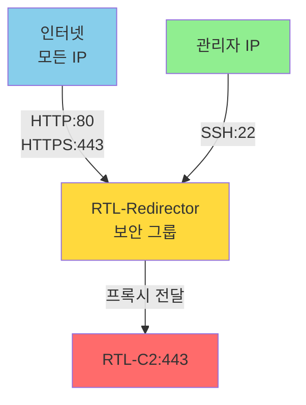

### 5단계: Operator 서버 구축

**Redirector와 유사하게 설정:**

| 설정 항목 | 값 |
|----------|-----|
| 이름 | RTL-Operator |
| 인스턴스 유형 | t3.micro |
| 스토리지 | 12 GiB (gp3) |

**보안 그룹:**

| 타입 | 프로토콜 | 포트 | 소스 |
|-----|---------|------|------|
| SSH | TCP | 22 | 내 IP |
| HTTP | TCP | 80 | 0.0.0.0/0 |
| HTTPS | TCP | 443 | 0.0.0.0/0 |

> 💡 **용도**: Operator 서버는 정찰 도구(Nmap, Nuclei), 터널링(Chisel), 컴파일러(gcc, mingw) 등을 설치하여 실제 공격 작업을 수행합니다.

### 6단계: Route53 DNS A 레코드 설정

**AWS Console → Route53 → 호스팅 영역 → namgi.store → 레코드 생성**

| 설정 항목 | 값 |
|----------|-----|
| 레코드 이름 | www |
| 레코드 유형 | A - IPv4 주소 |
| 값 | `<Redirector 서버의 공인 IP>` |
| TTL | 300 (기본값) |
| 라우팅 정책 | 단순 라우팅 |

**예시:**
```
레코드 이름: www.namgi.store
값: 13.231.162.162 (Redirector 공인 IP)
```

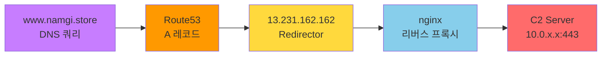

---

## 검증 및 다음 단계

### 인프라 구축 검증 체크리스트

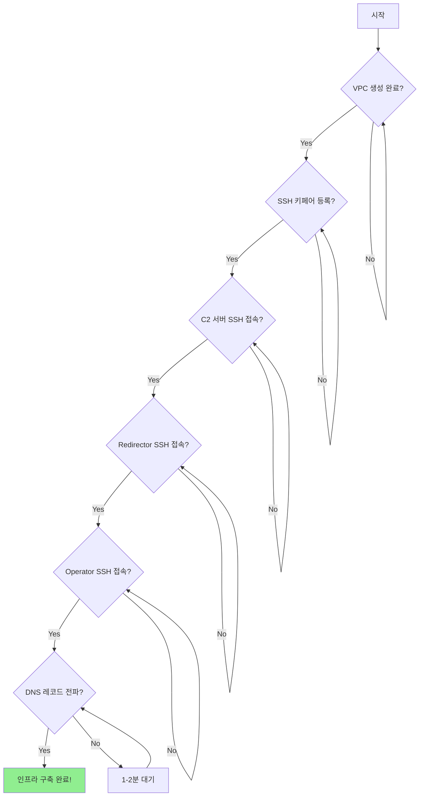

### 1. SSH 접속 테스트

```bash
# C2 서버
ssh -i ~/.ssh/redteamlite ubuntu@<C2-공인-IP>

# Redirector 서버
ssh -i ~/.ssh/redteamlite ubuntu@<Redirector-공인-IP>

# Operator 서버
ssh -i ~/.ssh/redteamlite ubuntu@<Operator-공인-IP>
```

**성공 예시:**
```
ubuntu@ip-10-0-11-236:~$ echo "C2 Server Ready"
C2 Server Ready

ubuntu@ip-10-0-12-45:~$ echo "Redirector Ready"
Redirector Ready

ubuntu@ip-10-0-13-78:~$ echo "Operator Ready"
Operator Ready
```

### 2. DNS 레코드 전파 확인

```bash
# nslookup 사용
nslookup www.namgi.store

# dig 사용 (더 상세한 정보)
dig www.namgi.store A

# 예상 출력
# Server:         192.168.40.1
# Address:        192.168.40.1#53
#
# Non-authoritative answer:
# Name:   www.namgi.store
# Address: 13.231.162.162  # <- Redirector 공인 IP
```

### 3. 웹 브라우저 테스트 (선택 사항)

```bash
# Redirector 서버에서 간단한 웹 서버 실행 (테스트용)
python3 -m http.server 80

# 로컬에서 접속 테스트
curl http://www.namgi.store
```

> ⚠️ **주의**: 아직 nginx를 설정하지 않았으므로 웹 페이지는 표시되지 않습니다. 다음 단계에서 설정합니다.

### 현재까지 구축된 인프라 요약

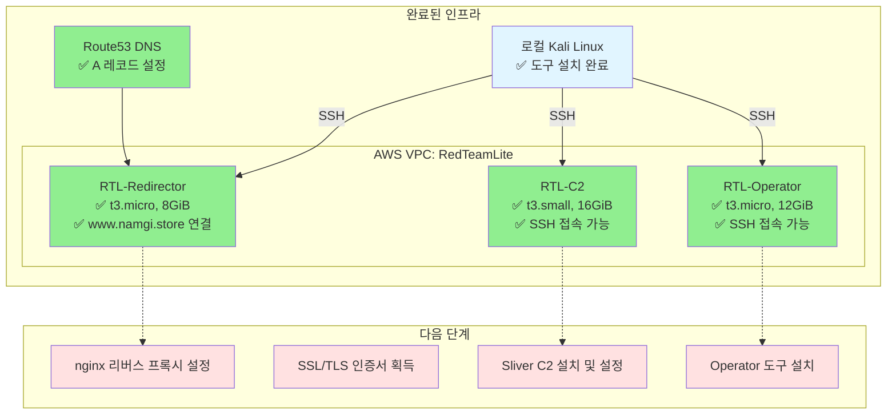

### 다음 단계: Redirector 서버 설정

다음 포스팅에서는 **Redirector 서버에 nginx 리버스 프록시를 설정**하고, **Let's Encrypt를 통해 SSL/TLS 인증서를 발급**받아 HTTPS 트래픽을 C2 서버로 전달하는 과정을 다룰 예정입니다.

**주요 작업:**
1. nginx 설치 및 리버스 프록시 설정
2. Certbot으로 SSL/TLS 인증서 자동 발급
3. C2 서버로 트래픽 전달 설정
4. HTTPS 트래픽 테스트

---

## 학습 포인트 & 트러블슈팅

### 핵심 개념 정리

#### 1. 레드팀 공간 구분

| 공간 | 위치 | 역할 | 데이터 보안 |
|-----|------|------|-----------|
| **Red Team Space** | 로컬 Kali Linux | 민감 데이터 저장, 툴 실행 | 🔒 최고 보안 |
| **Neutral/Gray Space** | AWS 클라우드 | C2, Redirector, Operator | ⚠️ 중간 보안 |
| **Victim Org Space** | 타겟 네트워크 | 침투된 호스트, 에이전트 | ⚡ 위험 영역 |

#### 2. 주요 용어 설명

**C2 (Command & Control)**
- 공격자가 타겟 시스템을 제어하기 위한 서버
- 에이전트/임플란트에게 명령을 전송하고 결과를 수신
- 예: Sliver, Cobalt Strike, Mythic

**Callback (콜백)**
- 타겟 시스템의 에이전트가 C2 서버로 연결을 시도하는 아웃바운드 통신
- 대부분의 방화벽은 아웃바운드 트래픽을 허용하므로 탐지 회피에 유리

**Redirector (리다이렉터)**
- C2 서버의 실제 IP를 숨기기 위한 중간 프록시
- 타겟이 차단하거나 분석하더라도 실제 C2 위치가 노출되지 않음

**Operator (오퍼레이터)**
- 레드팀 작전을 실제로 수행하는 공격자
- 정찰, 익스플로잇, 데이터 추출 등 다양한 작업 수행

**OPSEC (Operational Security)**
- 작전 중 공격자의 신원이나 인프라가 노출되지 않도록 하는 보안 원칙
- 예: IP 숨기기, 도메인 에이징, 트래픽 암호화

### 트러블슈팅 가이드

#### SSH 접속 실패

```bash
# 문제 1: Permission denied (publickey)
# 원인: 키 파일 권한 문제
# 해결:
chmod 600 ~/.ssh/redteamlite

# 문제 2: Connection timeout
# 원인: 보안 그룹에서 내 IP가 허용되지 않음
# 해결: AWS Console에서 보안 그룹의 SSH 규칙 확인
# - 소스가 "내 IP"로 설정되어 있는지 확인
# - 현재 IP 주소가 변경되었을 수 있음 (공유기 재부팅 등)

# 문제 3: Host key verification failed
# 원인: EC2 인스턴스를 재생성했거나 IP가 변경됨
# 해결:
ssh-keygen -R <EC2-공인-IP>
```

#### DNS 레코드 전파 안 됨

```bash
# 문제: nslookup에서 도메인이 안 나옴
# 원인: DNS 전파 시간 필요 또는 설정 오류

# 해결 1: 1-2분 대기 후 재시도
sleep 120
nslookup www.namgi.store

# 해결 2: Route53 레코드 설정 확인
# - AWS Console에서 A 레코드가 올바르게 생성되었는지 확인
# - TTL 값이 너무 크지 않은지 확인 (300초 권장)

# 해결 3: 다른 DNS 서버로 테스트
nslookup www.namgi.store 8.8.8.8  # Google DNS
nslookup www.namgi.store 1.1.1.1  # Cloudflare DNS
```

#### EC2 인스턴스 IP 변경 문제

```bash
# 문제: EC2 재부팅 후 공인 IP가 바뀜
# 원인: Elastic IP를 할당하지 않은 기본 EC2는 재부팅 시 IP 변경

# 해결책 1: 재부팅하지 않기 (RTL 권장)
# - 2-4주 작전 기간 동안 서버를 계속 켜두기

# 해결책 2: Elastic IP 할당 (비용 발생 가능)
# AWS Console → EC2 → 네트워크 및 보안 → 탄력적 IP
# - Elastic IP 주소 할당 → EC2 인스턴스와 연결

# 주의: IP 변경 시 Route53 DNS 레코드도 업데이트 필요!
```

#### VPC 서브넷 라우팅 문제

```bash
# 문제: 인스턴스끼리 통신이 안 됨
# 원인: 라우팅 테이블 설정 오류

# 확인 사항:
# 1. AWS Console → VPC → 라우팅 테이블
# 2. RedTeamLite 서브넷과 연결된 라우팅 테이블 확인
# 3. 다음 규칙이 있는지 확인:
#    - 대상: 10.0.0.0/16 → 로컬
#    - 대상: 0.0.0.0/0 → 인터넷 게이트웨이

# 해결: 인터넷 게이트웨이 라우팅 추가
# 라우팅 테이블 → 라우팅 편집 → 라우팅 추가
# - 대상: 0.0.0.0/0
# - 대상: igw-xxxxx (인터넷 게이트웨이)
```

### 보안 주의사항

#### 절대 하지 말아야 할 것들

❌ **프라이빗 SSH 키 공유**
```bash
# 절대 하지 마세요!
# - GitHub에 커밋
# - Slack/Discord에 업로드
# - 클라우드 스토리지에 암호화 없이 저장
```

❌ **Root 비밀번호로 SSH 접근 허용**
```bash
# /etc/ssh/sshd_config에서 절대 활성화하지 마세요
# PermitRootLogin yes  # 위험!
# PasswordAuthentication yes  # 위험!
```

❌ **보안 그룹 0.0.0.0/0 남용**
```bash
# SSH(22)를 전체 인터넷에 개방하지 마세요!
# 허용: HTTP(80), HTTPS(443)를 0.0.0.0/0으로 개방
# 금지: SSH(22), RDP(3389)를 0.0.0.0/0으로 개방
```

#### 권장 보안 설정

✅ **SSH 키 파일 권한 설정**
```bash
chmod 700 ~/.ssh
chmod 600 ~/.ssh/redteamlite
chmod 644 ~/.ssh/redteamlite.pub
```

✅ **AWS 리소스 태그 관리**
```bash
# EC2 인스턴스에 태그 추가 (비용 추적 및 관리)
Project: RTL
Environment: Red Team
Owner: <your-name>
```

✅ **정기적인 보안 그룹 검토**
```bash
# 주기적으로 불필요한 규칙 제거
# 예: 테스트용으로 열어둔 포트 닫기
```

### 추가로 공부하면 좋은 주제

#### 네트워크 보안
- **포워드 프록시 vs 리버스 프록시**: 기업 환경에서의 역할 차이
- **DPI (Deep Packet Inspection)**: 패킷 내용 분석 기술
- **Domain Fronting**: CDN을 활용한 C2 트래픽 은닉 기법 (현재는 대부분 차단됨)

#### 클라우드 보안
- **AWS IAM 정책**: 최소 권한 원칙 적용
- **VPC 피어링**: 여러 VPC 간 안전한 통신
- **AWS CloudTrail**: 인프라 활동 로깅 및 감사

#### 레드팀 기법
- **C2 프레임워크 비교**: Sliver vs Cobalt Strike vs Mythic
- **OPSEC 모범 사례**: 인프라 격리, 익명화, 로그 관리
- **Domain Aging**: 새 도메인의 신뢰도 향상 전략
- **LOTS (Living Off Trusted Sites)**: GitHub, Discord 등을 C2로 활용

#### DevOps & IaC
- **Terraform**: AWS 인프라 코드화 및 자동 배포
- **Ansible**: 서버 설정 자동화
- **Docker**: 컨테이너 기반 C2 및 도구 관리
- **Tailscale/WireGuard**: VPN/Mesh 네트워크 구축

---

## 마치며

이번 포스팅에서는 RTL 프로젝트의 첫 번째 단계인 **AWS 기반 레드팀 인프라 구축**을 완료했습니다.

**구축한 인프라:**
- ✅ VPC 네트워크 (RedTeamLite)
- ✅ C2 서버 (Sliver 프레임워크 실행 예정)
- ✅ Redirector 서버 (nginx 설정 예정)
- ✅ Operator 서버 (공격 도구 설치 예정)
- ✅ DNS 레코드 (www.namgi.store → Redirector)

**다음 포스팅 예고:**
- 📌 Redirector 서버에 nginx 리버스 프록시 설정
- 📌 Let's Encrypt SSL/TLS 인증서 자동 발급
- 📌 C2 서버로 HTTPS 트래픽 전달 설정
- 📌 정상 작동 테스트 (curl, 웹 브라우저)

실제 공격자처럼 생각하고, 방어자의 관점도 함께 고려하면서 레드팀 인프라를 구축하는 과정이 매우 흥미로웠습니다. 다음 단계에서 이어집니다.

---

## 참고 자료

- [AWS VPC 공식 문서](https://docs.aws.amazon.com/vpc/)
- [Sliver C2 GitHub](https://github.com/BishopFox/sliver)
- [LOTS Project](https://lots-project.com/)
- [Red Team Infrastructure Wiki](https://github.com/bluscreenofjeff/Red-Team-Infrastructure-Wiki)
- [AWS EC2 보안 그룹 가이드](https://docs.aws.amazon.com/AWSEC2/latest/UserGuide/ec2-security-groups.html)

---

**태그**: #RTL #RedTeam #AWS #Sliver #C2 #인프라구축 #보안 #침투테스트 #OPSEC