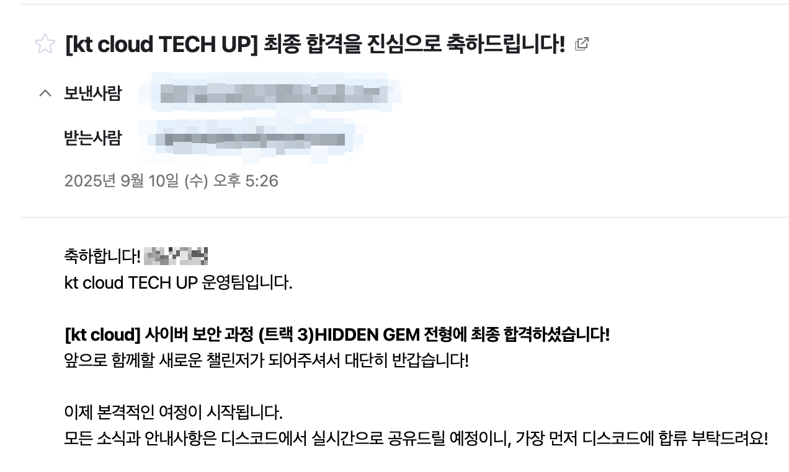
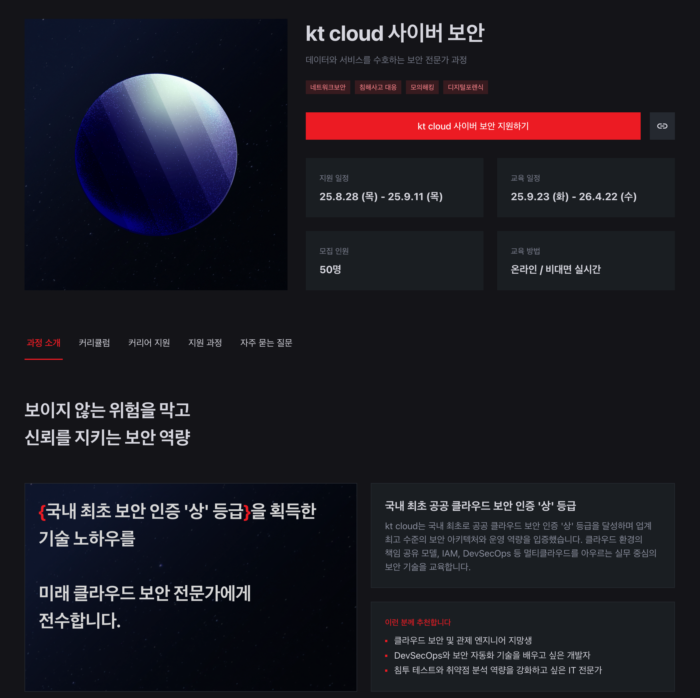

**☀️<u>공지 사항</u>☀️** 해당 게시글은 `kt cloud TECH UP 사이버 보안` 과정을 설명 및 리뷰하는 글입니다. 자세한 교육 정보는  [kt cloud TECH UP 홈페이지](https://ktcloud-techup.com/cybersecurity) 를 확인해주세요.
{: .notice--danger}

## **합격 소식 & 과정 소개**

### 합격 소식

kt cloud TECH UP 사이버 보안 1회차에 최종 합격을 하였다.

교육 일정: 25.9.23 (화) - 26.4.22 (수)

모집 인원: 50명

교육 방법: 온라인 / 비대면 실시간

---

### 교육 과정
이번 교육 과정은 다음과 같다.
#### 1개월차: 기초 보안 개념 및 실무 전략
- 오리엔테이션  
  과정 목표와 방향성을 설명하고, 상세 커리큘럼 및 학습 일정 소개합니다.  
- 사이버 시큐리티 개요  
  정보보안 핵심 개념, 위협 모델, 공격 유형(DDoS 등), 보안 정책, 거버넌스 및 규제(ISO 27001, GDPR 등)를 학습합니다.  
- 네트워크 보안  
  방화벽, IDS/IPS 실습과 네트워크 패킷 분석, 취약점 대응 전략을 익히고 VLAN/VPN 등 네트워크 아키텍처 설계 기술을 학습합니다.  
- 클라우드 보안  
  클라우드 책임 공유 모델, CSP 보안 서비스 실습(AWS, Azure), 클라우드 네이티브 보안 전략, IAM 정책 설정 및 감사를 학습합니다.  
- 최신 사이버 보안 기술  
  제로 트러스트, EDR/XDR 위협 탐지, Threat Intelligence, 머신러닝 기반 보안 분석 등 최신 보안 기술 트렌드를 실습과 함께 학습합니다.  
- 침투 테스트  
  침투 테스트 절차, Metasploit/Nmap 툴 실습, 웹/네트워크 취약점 공격 사례 분석, 보고서 작성 및 대응 방안을 학습합니다.  
- 취업 준비 역량 테스트 대비  
  매월 과정 별 역량 평가 및 피드백을 진행합니다. 최신 구직 동향 및 사례를 연구하며, 자기 PR을 위한 효과적인 취업 전략을 학습합니다.  

***

#### 2개월차: 심화 보안 기술 및 대응
- 암호학  
  대칭/비대칭 키 암호화, 해시 함수(MD5, SHA 등), PKI 인증서, TLS/SSL 통신 보안 등 암호화 기법과 양자 암호화 기술 동향을 학습합니다.  
- 보안 관제 및 로그 분석  
  SIEM 개념, 로그 수집/정규화 및 상관분석, 탐지 규칙 설정, 알림 시스템 구성, 침해 사고 대응 시나리오와 포렌식 연계를 실습합니다.  
- 취약점 진단 및 대응  
  취약점 스캐너(Nessus, OpenVAS) 활용, CVE 기반 위험도 평가, 패치 관리와 구성 오류 점검, 취약점 리포트 작성 및 대응 프로세스를 학습합니다.  
- 특강1  
  기업 연사 또는 전문가를 초빙하여 심화 주제를 다루는 특강을 진행합니다.  
- 취업 준비 역량 테스트 대비  
  매월 과정 별 역량 평가 및 피드백 진행.  
- 기본 프로젝트  
  네트워크 보안 설정, 침투 테스트, 클라우드 IAM 및 정책 수립, 보안 관제 시스템 구축, 로그 분석 실습을 진행합니다.  

***

#### 3개월차: 기본 프로젝트 시작
- 기본 프로젝트  
  네트워크 보안 설정, 침투 테스트, 클라우드 보안 운영 실습, 로그 분석을 통한 위협 대응 실습 진행.  
- 심화 프로젝트  
  고급 네트워크 및 클라우드 보안 강화, SIEM 및 암호학 기반 보안 솔루션 구현, 팀 단위 협업 프로젝트.  
- 특강2  
  전문가 초빙 특강.  
- 취업 준비 역량 테스트 대비  

***

#### 4개월차: 심화 프로젝트 및 해커톤
- 심화 프로젝트  
  팀 단위로 복합 보안 시스템을 설계/운영하며 심화된 실무 경험을 쌓습니다.  
- 해커톤  
  제한된 시간 내에 팀별 아이디어 구상과 제품 설계를 진행하며 협업 능력과 창의적 문제 해결을 학습합니다.  
- 특강3  
  전문가 초빙 특강.  
- 취업 준비 역량 테스트 대비  

***

#### 5개월차: 실무 통합 프로젝트 시작
- 실무 통합 프로젝트  
  멀티클라우드 환경을 고려한 통합 보안 아키텍처 설계, DevSecOps 위협 대응 시스템 구축, 종합 보안 솔루션 구현.  
- 특강4  
- 취업 준비 역량 테스트 대비  
- 커리어 성장 전략  
  개인 학습 로드맵, 목표 설계, 멘토링, 네트워크 확장 전략 학습.  
- 협업 및 커뮤니케이션  
  팀워크 강화, 갈등 해결 기법 실습.  

***

#### 6개월차: 실무 통합 프로젝트 집중 개발
- 실무 통합 프로젝트  
  보안 아키텍처 실무 개발, DevSecOps 환경 확장.  
- 특강5  
- 취업 준비 역량 테스트 대비  
- 제품 개발 프로세스와 문화  
  애자일 기반 제품 개발, 시장 출시 과정 학습.  
- 포트폴리오 기획 및 구성  
  효과적인 포트폴리오 설계와 성공 사례 분석.  

***

#### 7개월차: 프로젝트 마무리 및 최종 발표
- 실무 통합 프로젝트  
- 특강6  
- 취업 준비 역량 테스트 대비  
- 이력서 작성 및 자기 PR  
  자기 강점 부각, 효과적인 자기 PR 전략 학습.  
- 프로젝트 발표회  
  프로젝트 결과물 발표 및 전문가 피드백.  
- 수료식  
  7개월 과정 회고 및 향후 계획 공유.  

***

### 커리어 지원
1. kt cloud 현직자 멘토링, 특강 및 코드 리뷰
2. TECH UP 연합 해커톤: 훈련생들이 모여 아이디어를 구체화하고 팀워크로 완성하며 실전 같은 프로젝트 경험을 쌓는 대규모 해커톤
3. 우수 수료생 채용 지원 시 우대
4. 이력서, 포트폴리오 컨설팅

### 학습 지원(요약)
1. 오프라인 & 메타버스 교육장
2. AWS 인프라 지원: 실무 프로젝트 AWS 비용 지원
3. 생성형 AI 도구 지원
4. 합격 시점부터 한 달 간 인프런 강의 무제한 수강 가능
5. 성장 격려금 제공: 대회 수상 시 최대 100만원
6. 훈련장려금: 최대 316,000원
7. 학습용 맥북 무료 대여: MacBook M2 Pro / 16GB RAM, 512GB SSD, 16Core GPU - 현장 수령만 가능

## **지원 계기와 준비 과정**
### 지원 계기 및 과정
필자는 이전 대전 정보보안학원에서 국비지원 과정으로 6개월간 교육을 수강했지만, 비전공자이기도 하고 아직 배워야할 내용이 많기 때문에 개인적인 공부를 이어가던 중이었다.

우연히 인스타그램에서 kt cloud 에서 사이버 보안 과정이 열린다는 광고 글을 보고 커리큘럼을 확인해보았는데 역량을 업그레이드 시킬 수 있을 것 같아 지원하게되었다. 특히 요즘 수요가 많아지는 클라우드 보안과 다른 교육 팀과 협업할 수 있는 프로젝트를 진행할 수 있다는 것에 매력을 느꼈다.

지원할 때 포트폴리오 전형으로 제출 했던 것은
1. 학원에서 진행했던 프로젝트 제출 
2. 개인적으로 작성했던 가상 머신 모의해킹 보고서 
3. 공부 블로그 주소 

를 제출 했는데, 포트폴리오가 부족했던 탓인지 포트폴리오 전형이 아니라 Hidden Gem 전형(면접 진행)으로 면접을 보고 이틀 뒤 합격 메일이 왔다.

## **기대와 목표**

### **KT Cloud TECH UP 사이버 보안 프로그램에서 배우고 싶은 것**  
앞으로 7개월간 KT Cloud의 인프라 환경을 직접 경험하며 클라우드 보안 실무 감각을 익히고 싶다. 단순히 도구 사용법만 배우는 것이 아니라 인프라 진단부터 취약점 분석, 대응 전략 수립까지 전 과정을 몸에 익히고 싶다. 팀 프로젝트와 협업을 통해 보고서 작성, 커뮤니케이션, 문제 해결 능력도 한 단계 성장시키고 싶다. 이번 과정을 통해 실무에서 바로 활용할 수 있는 역량을 확실히 쌓고자 한다.

### **앞으로의 성장 목표 및 장기 계획**  
내 장기적인 목표는 국내 레드팀 업계에서 활동하는 보안 전문가가 되는 것이다. 이번 KT Cloud TECH UP 사이버 보안 프로그램이 그 목표로 나아가는 확실한 발판이 되었으면 한다. 단기적으로는 이번 교육을 들으면서 블루팀 관점에서의 개념 학습 및 웹·모바일 모의해킹과 인프라 보안 진단 역량을 강화하고, 중장기적으로는 공격과 방어를 모두 이해하는 전문성을 바탕으로 국내 레드팀 분야에서 의미 있는 성과를 내는 사람이 되고싶다..!  

앞으로 교육 받은 내용 꾸준히 블로그에 정리하겠습니다. 감사합니다.
