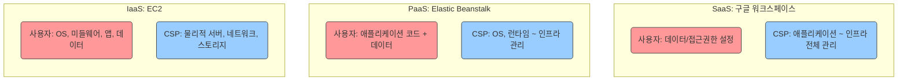
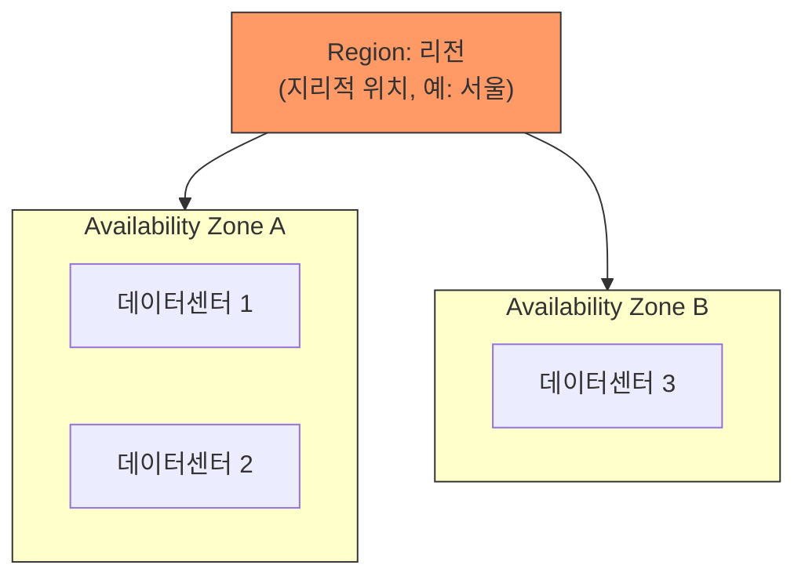
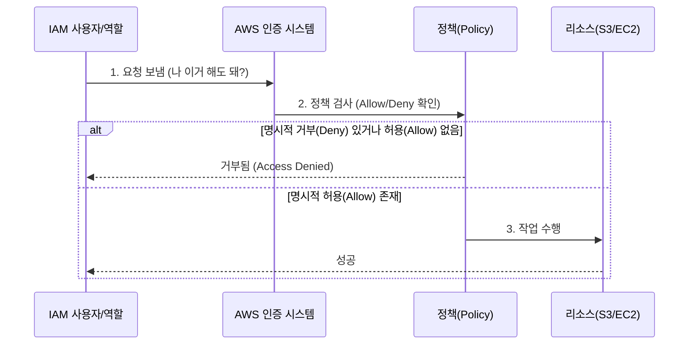
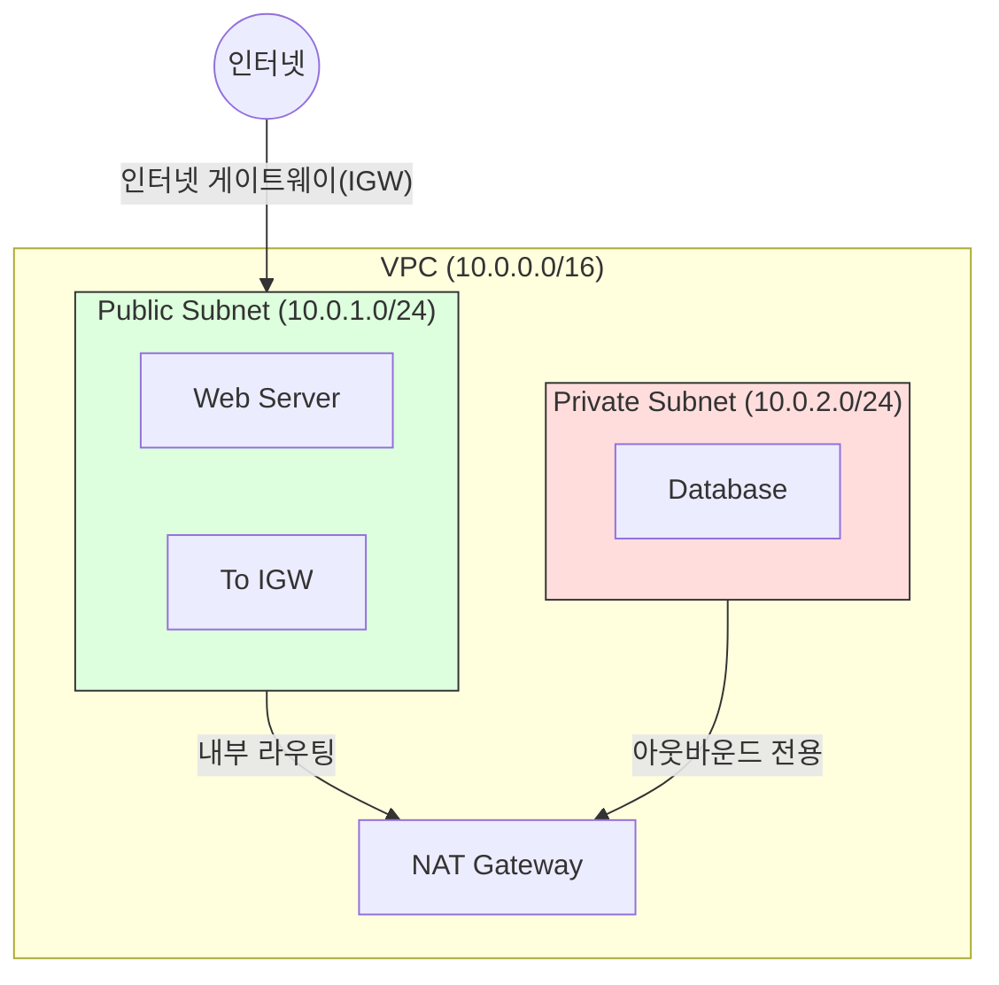

# 학습 가이드:

이 문서는 **AWS의 기본 뼈대**를 잡는 내용을 담고 있습니다.

### 1. 학습 목표:
* **클라우드의 본질:** 단순히 '인터넷 저장소'가 아닌, **NIST가 정의한 5가지 핵심 특성**을 배웁니다.
* **AWS의 물리적 구조:** 전 세계에 흩어진 데이터센터(리전, 가용영역)가 어떻게 구성되는지 이해합니다.
* **핵심 서비스 3대장:**
    1.  **컴퓨팅 (EC2):** 가상 서버를 빌리고 관리하는 법
    2.  **네트워크 (VPC):** 나만의 안전한 통신망을 구축하는 법
    3.  **보안 (IAM):** 누가 무엇을 할 수 있는지 권한을 제어하는 법

### 2. 왜 중요한가?
이 기초가 없으면 클라우드를 쓰더라도 **"비싼 온프레미스(전통적 서버실)"**처럼 비효율적으로 사용하게 됩니다. **비용을 절감**하고, **보안 사고를 예방**하며, **서비스 중단 없이 운영**하기 위한 필수 지식입니다.

### 3. 학습 로드맵
```mermaid
graph LR
    A[1. 클라우드 개념] --> B[2. 글로벌 인프라]
    B --> C[3. 보안 및 권한 Identity]
    C --> D[4. 가상 네트워크 VPC]
    D --> E[5. 컴퓨팅 및 스토리지]
    E --> F[6. 운영 및 비용 최적화]
    
    style A fill:#f9f,stroke:#333,stroke-width:2px
    style F fill:#bbf,stroke:#333,stroke-width:2px
````

## 1\. 클라우드 컴퓨팅의 정의와 핵심 특성

**클라우드 컴퓨팅**은 IT 리소스를 인터넷을 통해 필요할 때 가져다 쓰고, 쓴 만큼만 돈을 내는 서비스입니다. NIST(미국 국립표준기술연구소)는 다음 5가지가 충족되어야 클라우드라고 정의합니다.

### 1.1. NIST 5대 핵심 특성 (시각화)

```mermaid
mindmap
  root((클라우드 5대 특성))
    주문형 셀프서비스
      (관리자 요청 없이 즉시 사용)
    광범위한 네트워크 접근
      (모바일, PC 어디서든 접속)
    리소스 풀링
      (여러 고객이 자원을 공유 - 멀티테넌시)
    빠른 탄력성
      (필요에 따라 고무줄처럼 확장/축소)
    측정 가능한 서비스
      (수도요금처럼 사용량 계측)
```

## 2\. 서비스 모델과 책임의 범위

클라우드는 "어디까지 내가 관리하느냐"에 따라 3가지 모델로 나뉩니다. 오른쪽(SaaS)으로 갈수록 사용자가 편해지지만 제어권은 줄어듭니다.

### 2.1. 책임 분담 모델 (Shared Responsibility)



  * **IaaS (Infrastructure as a Service):** 하드웨어만 빌립니다. (예: AWS EC2)
  * **PaaS (Platform as a Service):** 개발 환경까지 빌립니다. (예: AWS Lambda, Heroku)
  * **SaaS (Software as a Service):** 완성된 소프트웨어를 씁니다. (예: Slack, Dropbox)

## 3\. AWS 글로벌 인프라 구조

AWS는 물리적 재해에 대비하기 위해 **격리**를 최우선으로 설계되었습니다.

### 3.1. 인프라 계층도



1.  **리전 (Region):** 완전히 분리된 지리적 영역. (법적 규제와 속도를 고려해 선택)
2.  **가용 영역 (AZ):** 리전 내에서 물리적으로 격리된 데이터센터 그룹. **하나가 셧다운 되어도 다른 AZ가 살아있어야 함(Multi-AZ 전략)**.
3.  **엣지 로케이션:** 사용자에게 더 빨리 콘텐츠를 배달하기 위한 캐시 서버(CDN) 위치.

## 4\. 계정 및 권한 관리 (IAM)

보안의 시작은 \*\*"너 누구니?(인증)"\*\*와 \*\*"뭐 할 수 있니?(권한)"\*\*를 가리는 것입니다.

  * **Root Account:** 모든 권한을 가진 신(God) 계정. **절대 사용 금지 (MFA 설정 후 봉인).**
  * **IAM User/Role:** 실제 작업을 수행하는 주체.

### 4.1. IAM 작동 원리



> **핵심 원칙:** 최소 권한의 원칙 (Principle of Least Privilege). 필요한 만큼만 권한을 줍니다.

## 5\. 네트워크 (VPC) 기초

가장 어렵지만 중요한 부분입니다. 클라우드 안에 \*\*'나만의 비공개 네트워크'\*\*를 만드는 과정입니다.

### 5.1. VPC 아키텍처 다이어그램



  * **Public Subnet:** 인터넷과 직접 연결됨 (웹 서버용).
  * **Private Subnet:** 인터넷에서 직접 접근 불가, 보안이 중요함 (데이터베이스용).
  * **Security Group:** 인스턴스 앞을 지키는 가상 방화벽 (포트 열기/닫기).

## 6\. 컴퓨팅과 스토리지 (EC2 & S3)

### 6.1. EC2 (가상 서버)

  * **정의:** 원하는 사양(CPU, RAM)의 서버를 빌리는 것.
  * **Auto Scaling:** 사용자가 몰리면 서버를 자동으로 늘리고, 없으면 줄여서 비용을 아끼는 기술.

### 6.2. 스토리지 비교 (S3 vs EBS)

| 특성 | EBS (Elastic Block Store) | S3 (Simple Storage Service) |
| :--- | :--- | :--- |
| **비유** | 외장 하드디스크 (USB) | 구글 드라이브 / 웹하드 |
| **연결** | 특정 EC2 인스턴스에 장착 | 인터넷 어디서나 URL로 접근 |
| **용도** | OS 설치, DB 데이터 저장 | 이미지 파일, 로그, 백업 저장 |
| **속도** | 매우 빠름 (IOPS 중요) | 전송 속도 위주 |

## 7\. 실습 가이드: CLI 및 SDK 활용

### 7.1. AWS CLI 설정 (`aws configure`)

터미널에서 AWS를 제어하려면 자격증명(열쇠)을 등록해야 합니다.

```bash
$ aws configure
AWS Access Key ID [None]: AKIA... (발급받은 키 ID)
AWS Secret Access Key [None]: wJalr... (비밀 키)
Default region name [None]: ap-northeast-2 (서울 리전)
Default output format [None]: json
```

> **주의:** Access Key는 깃허브(GitHub) 등에 절대 올리면 안 됩니다. 해킹의 지름길입니다.

### 7.2. Python(boto3)으로 S3 조회하기

개발자라면 코드로 인프라를 제어하는 법을 익혀야 합니다.

```python
import boto3

def list_buckets():
    # S3 서비스에 연결하는 클라이언트 객체 생성
    s3 = boto3.client('s3')
    
    # 버킷 목록 가져오기
    response = s3.list_buckets()
    
    print("=== 내 S3 버킷 목록 ===")
    for bucket in response['Buckets']:
        print(f"- {bucket['Name']}")

if __name__ == "__main__":
    list_buckets()
```

```
```