## 전체 흐름 요약

이번 학습에서는 AWS VPC의 고급 네트워크 연결 기술을 다룹니다. 단일 VPC 구성을 넘어 **여러 VPC 간 연결, 온프레미스 네트워크와의 하이브리드 연결, AWS 서비스와의 안전한 프라이빗 통신**을 구현하는 방법을 학습합니다.

**Part 1 - VPC 간 연결**에서는 VPC 피어링의 1:1 연결 방식과 제약사항(전이적 연결 불가, CIDR 중복 불가)을 이해하고, 다수의 네트워크를 허브 앤 스포크(Hub and Spoke) 방식으로 중앙 집중 관리할 수 있는 Transit Gateway의 장점을 비교 분석합니다. VPC 피어링은 소규모 연결에 적합하나 네트워크가 복잡해질수록 관리가 어려워지므로, Transit Gateway를 사용하면 수십 개의 VPC와 온프레미스 네트워크를 단일 게이트웨이로 통합 관리할 수 있습니다.

**Part 2 - 하이브리드 클라우드 연결**에서는 온프레미스 데이터센터와 AWS 클라우드를 연결하는 두 가지 주요 방법을 학습합니다. AWS VPN은 인터넷을 통한 암호화된 터널 연결로 빠르게 구축 가능하며 비용이 저렴하지만, 인터넷 품질에 의존합니다. AWS Direct Connect는 물리적 전용선 연결로 안정적이고 높은 대역폭을 제공하지만 초기 구축 비용과 시간이 필요합니다. 실무에서는 두 방법을 이중화하여 고가용성을 확보하는 아키텍처를 자주 사용합니다.

**Part 3 - VPC 엔드포인트**에서는 VPC 내부 리소스가 S3, DynamoDB, Systems Manager 등의 AWS 서비스에 접근할 때 인터넷 게이트웨이를 거치지 않고 AWS 내부 네트워크를 통해 프라이빗하게 통신하는 방법을 다룹니다. 게이트웨이 엔드포인트(S3, DynamoDB)와 인터페이스 엔드포인트(대부분의 AWS 서비스)의 차이를 이해하고, AWS PrivateLink를 활용하여 보안성과 성능을 동시에 향상시키는 설계 패턴을 학습합니다.

모든 개념은 실무 시나리오와 함께 설명되며, 각 기술의 비용, 성능, 관리 복잡도를 비교하여 상황에 맞는 최적의 선택을 할 수 있도록 안내합니다.

---

## Part 1: VPC 간 연결

### 1.1. VPC 피어링 (VPC Peering)

#### VPC 피어링이란?

**VPC 피어링**은 두 개의 VPC를 프라이빗 네트워크로 연결하여, 마치 하나의 네트워크처럼 통신할 수 있게 하는 기술입니다.

**핵심 특징:**

1. **1:1 연결**
   - 두 VPC 간에만 직접 연결 가능
   - VPC A ↔ VPC B는 하나의 피어링 연결

2. **프라이빗 IP 통신**
   - 인터넷 게이트웨이 불필요
   - AWS 내부 네트워크를 통한 통신
   - 낮은 지연 시간, 높은 보안

3. **리전 간 피어링 지원**
   - 같은 리전뿐 아니라 다른 리전 간에도 가능
   - 예: 서울 리전 VPC ↔ 도쿄 리전 VPC

4. **계정 간 피어링 지원**
   - 다른 AWS 계정 소유 VPC와도 연결 가능
   - 파트너사, 자회사와의 네트워크 연동에 활용

#### VPC 피어링 동작 방식

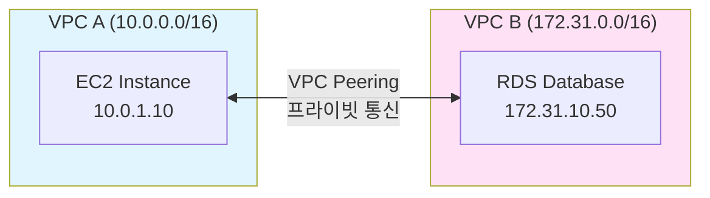

**통신 흐름:**
1. VPC A의 EC2 인스턴스에서 172.31.10.50으로 패킷 전송
2. VPC A의 라우팅 테이블에서 172.31.0.0/16 → Peering Connection 규칙 매칭
3. AWS 백본 네트워크를 통해 VPC B로 전달
4. VPC B의 RDS 응답을 같은 경로로 반환

#### VPC 피어링 제약사항

**1. 전이적 연결 불가 (Transitive Routing)**

```
예시:
VPC A ↔ VPC B (피어링 O)
VPC B ↔ VPC C (피어링 O)

VPC A → VPC C 직접 통신 불가능!
(VPC A와 C 간에도 별도 피어링 필요)
```

**시각화:**

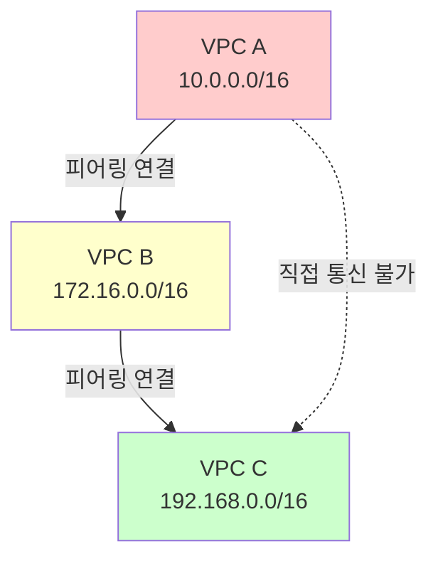

**해결 방법:**
- 모든 VPC 쌍에 대해 개별 피어링 연결 생성
- 또는 Transit Gateway 사용 (권장)

**2. 중복된 CIDR 주소 연결 불가**

```
불가능한 예:
VPC A: 10.0.0.0/16
VPC B: 10.0.0.0/16  ← CIDR 중복

VPC A ↔ VPC B 피어링 불가!
```

**이유:**
- 라우팅 테이블에서 목적지를 구분할 수 없음
- 패킷이 어느 VPC로 전송되어야 하는지 모호

**해결 방법:**
- VPC 설계 시 CIDR 블록이 겹치지 않도록 사전 계획
- 예: 10.0.0.0/16, 10.1.0.0/16, 10.2.0.0/16 처럼 분리

#### VPC 피어링의 장단점

**장점:**
```
✅ 설정이 간단함
✅ 추가 비용 없음 (데이터 전송 비용만)
✅ 낮은 지연 시간
✅ 높은 대역폭
✅ 리전 간, 계정 간 지원
```

**단점:**
```
❌ 1:1 연결만 가능
❌ 전이적 라우팅 불가
❌ 많은 VPC 연결 시 관리 복잡도 증가
❌ 중복 CIDR 불가
```

**피어링 연결 개수 계산:**

```
VPC 개수에 따른 피어링 연결 수:
- 3개 VPC: 3개 피어링 (A-B, B-C, A-C)
- 4개 VPC: 6개 피어링
- 5개 VPC: 10개 피어링
- n개 VPC: n(n-1)/2 개 피어링

→ VPC가 많아질수록 기하급수적 증가!
```

#### 실무 사용 사례

**사례 1: 개발/스테이징/프로덕션 환경 분리**
```
VPC-Dev (10.0.0.0/16)
VPC-Staging (10.1.0.0/16)
VPC-Prod (10.2.0.0/16)

Dev ↔ Staging 피어링 (테스트용)
Staging ↔ Prod 피어링 (배포 검증)
Dev ↔ Prod 피어링 없음 (격리)
```

**사례 2: 부서별 VPC 분리**
```
VPC-Engineering (10.10.0.0/16)
VPC-DataScience (10.20.0.0/16)
VPC-SharedServices (10.100.0.0/16)

Engineering ↔ SharedServices (공통 도구 접근)
DataScience ↔ SharedServices (공통 도구 접근)
Engineering ↔ DataScience 피어링 없음 (보안 격리)
```

---

### 1.2. Transit Gateway

#### Transit Gateway란?

**AWS Transit Gateway**는 다수의 VPC와 온프레미스 네트워크를 **허브 앤 스포크(Hub and Spoke)** 방식으로 중앙 집중식 연결하는 네트워크 전송 허브입니다.

**핵심 개념:**

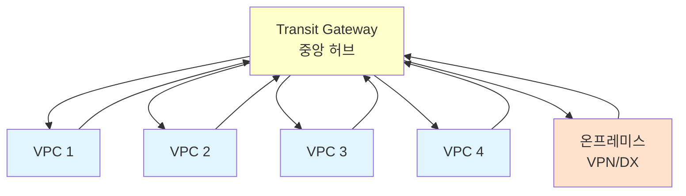

**VPC 피어링 vs Transit Gateway 비교:**

| 구분 | VPC 피어링 | Transit Gateway |
|------|-----------|----------------|
| 연결 방식 | 1:1 (메시 구조) | Hub and Spoke (중앙 집중) |
| 전이적 라우팅 | 불가능 | **가능** |
| 연결 개수 (10개 VPC) | 45개 | 10개 |
| 관리 복잡도 | 높음 (n² 증가) | 낮음 (n 증가) |
| 라우팅 테이블 | 각 VPC마다 설정 | Transit Gateway에서 중앙 관리 |
| 비용 | 무료 (전송 비용만) | 시간당 요금 + 전송 비용 |
| 대역폭 | 제한 없음 | 최대 50 Gbps (버스트 가능) |

#### Transit Gateway 연결 대상

Transit Gateway는 다음 네트워크들을 연결할 수 있습니다:

**1. VPC**
```
- 같은 리전의 여러 VPC
- Transit Gateway Peering을 통한 다른 리전 VPC
```

**2. VPN Connection**
```
- Site-to-Site VPN을 통한 온프레미스 연결
- IPsec 암호화 터널
```

**3. Direct Connect Gateway**
```
- AWS Direct Connect 전용선 연결
- 고대역폭, 저지연 온프레미스 연결
```

**4. Transit Gateway Peering**
```
- 다른 리전의 Transit Gateway와 연결
- 글로벌 네트워크 구성
```

#### Transit Gateway 라우팅 테이블

Transit Gateway는 자체 라우팅 테이블을 가지고 있어 중앙에서 트래픽을 제어할 수 있습니다.

**예시: 보안 격리 설계**

```
Transit Gateway Route Table 1 (Production):
- 10.0.0.0/8 → VPC-Prod-1
- 10.1.0.0/8 → VPC-Prod-2
- 192.168.0.0/16 → OnPrem (VPN)

Transit Gateway Route Table 2 (Development):
- 172.16.0.0/12 → VPC-Dev-1
- 172.17.0.0/12 → VPC-Dev-2

→ Production과 Development는 서로 격리됨
```

#### Transit Gateway 장단점

**장점:**
```
✅ 전이적 라우팅 가능
✅ 중앙 집중 관리
✅ 확장성 우수 (수천 개 연결 지원)
✅ 리전 간 연결 지원 (Peering)
✅ 복잡한 네트워크 토폴로지 단순화
✅ 멀티캐스트 지원
```

**단점:**
```
❌ 시간당 요금 발생 (약 $0.05/시간)
❌ 데이터 전송 비용 (GB당 과금)
❌ VPC 피어링보다 약간 높은 지연 시간 (1-2ms 차이)
❌ 초기 설정이 다소 복잡
```

#### 실무 사용 사례

**사례 1: 대규모 다중 계정 환경**
```
AWS Organizations:
├─ 계정 1: Prod VPC (10.0.0.0/16)
├─ 계정 2: Dev VPC (10.1.0.0/16)
├─ 계정 3: Staging VPC (10.2.0.0/16)
├─ 계정 4: Security VPC (10.100.0.0/16)
└─ 계정 5: Shared Services VPC (10.200.0.0/16)

→ Transit Gateway로 모든 VPC 연결
→ RAM (Resource Access Manager)으로 계정 간 공유
```

**사례 2: 하이브리드 클라우드**
```
AWS Cloud (Transit Gateway)
├─ VPC-Seoul (10.0.0.0/16)
├─ VPC-Tokyo (10.1.0.0/16)
└─ OnPrem-Datacenter (192.168.0.0/16)
    └─ Direct Connect + VPN 백업

→ 모든 네트워크가 Transit Gateway를 통해 상호 통신
```

---

## Part 2: 하이브리드 클라우드 연결

### 2.1. AWS VPN (Virtual Private Network)

#### AWS Site-to-Site VPN이란?

**Site-to-Site VPN**은 온프레미스 네트워크와 AWS VPC를 **인터넷을 통한 암호화된 IPsec 터널**로 연결하는 서비스입니다.

**구성 요소:**

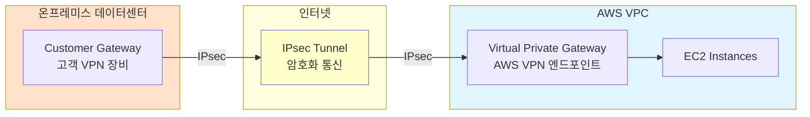

**1. Virtual Private Gateway (VGW)**
- AWS VPC에 연결되는 VPN 엔드포인트
- AWS 측 VPN 장비 역할
- 자동으로 고가용성 구성 (2개 터널)

**2. Customer Gateway (CGW)**
- 온프레미스에 설치되는 VPN 장비
- 물리적 장비 또는 소프트웨어 VPN
- 고정 공인 IP 필요

**3. VPN Connection**
- VGW와 CGW 사이의 IPsec 터널
- 기본적으로 2개 터널 생성 (고가용성)

#### VPN 터널 이중화

AWS는 기본적으로 **2개의 IPsec 터널**을 생성하여 고가용성을 제공합니다.

```
VPN Connection:
├─ Tunnel 1 (Active)
│  ├─ AWS Endpoint 1: 52.12.34.56
│  └─ 터널 상태: UP
└─ Tunnel 2 (Standby)
   ├─ AWS Endpoint 2: 54.98.76.54
   └─ 터널 상태: UP (대기)

→ Tunnel 1 장애 시 자동으로 Tunnel 2로 전환
```

#### VPN 연결 속도 및 제약

**대역폭:**
```
- 단일 VPN 터널: 최대 1.25 Gbps
- 2개 터널 사용: 최대 2.5 Gbps (ECMP 라우팅)
```

**지연 시간:**
```
- 인터넷 품질에 의존
- 일반적으로 50-200ms
- 트래픽 폭주 시 증가 가능
```

**제약사항:**
```
❌ 인터넷 품질에 영향받음
❌ 대역폭 제한 (1.25 Gbps)
❌ 암호화 오버헤드
❌ 패킷 손실 가능
```

#### VPN 장단점

**장점:**
```
✅ 빠른 구축 (수 분~수 시간)
✅ 저렴한 비용 ($0.05/시간 + 데이터 전송)
✅ 유연한 구성 (필요 시 즉시 생성/삭제)
✅ 암호화 통신 (IPsec)
✅ 기존 인터넷 회선 활용
```

**단점:**
```
❌ 인터넷 품질 의존
❌ 제한된 대역폭
❌ 예측 불가능한 지연 시간
❌ 보안성이 Direct Connect보다 낮음
```

#### VPN 사용 사례

**사례 1: 초기 하이브리드 연결**
```
상황: 온프레미스 → AWS 마이그레이션 초기
목적: 빠르게 연결 구축, Direct Connect 대기 중
기간: 1-3개월 (임시)
```

**사례 2: 재해 복구 (DR)**
```
평소: 사용 안 함 (비용 절감)
재해 시: VPN 즉시 활성화하여 백업 사이트 접근
```

**사례 3: 소규모 지사 연결**
```
대역폭: ~100 Mbps
트래픽: 낮음
비용: 중요
→ VPN으로 충분
```

---

### 2.2. AWS Direct Connect

#### Direct Connect란?

**AWS Direct Connect**는 온프레미스 데이터센터와 AWS를 **물리적 전용선**으로 연결하는 서비스입니다. 인터넷을 거치지 않고 AWS 백본 네트워크에 직접 연결됩니다.

**구조:**

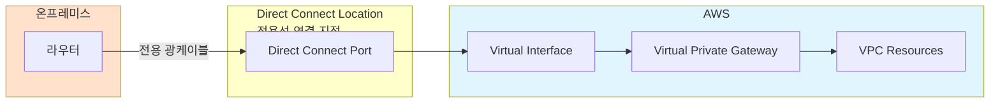

**주요 구성 요소:**

**1. Direct Connect Location**
- AWS와 파트너 통신사가 운영하는 데이터센터
- 한국: 서울 (가산, 평촌 등)
- 고객의 라우터와 AWS를 물리적으로 연결

**2. Connection (전용선)**
- 1 Gbps, 10 Gbps, 100 Gbps 옵션
- 물리적 광케이블 연결
- 월 정액 요금

**3. Virtual Interface (VIF)**
- Private VIF: VPC 연결용
- Public VIF: S3, DynamoDB 등 퍼블릭 서비스 연결용
- Transit VIF: Transit Gateway 연결용

#### Direct Connect 속도 옵션

| 속도 | 용도 | 월 비용 (예상) |
|------|------|-------------|
| 50 Mbps | 소규모 지사 | ~$50 |
| 100 Mbps | 중소기업 | ~$100 |
| 200 Mbps | 중견기업 | ~$200 |
| 500 Mbps | 대기업 지사 | ~$500 |
| 1 Gbps | 대기업 본사 | ~$1,000 |
| 10 Gbps | 대규모 데이터 전송 | ~$10,000 |
| 100 Gbps | 초대용량 | ~$100,000 |

**참고:** 실제 비용은 지역, 파트너사에 따라 다름

#### Direct Connect 장단점

**장점:**
```
✅ 안정적인 네트워크 성능
✅ 예측 가능한 지연 시간 (1-10ms)
✅ 높은 대역폭 (최대 100 Gbps)
✅ 데이터 전송 비용 절감 (대용량 시)
✅ 인터넷 품질에 영향받지 않음
✅ 보안성 높음 (물리적 격리)
```

**단점:**
```
❌ 구축 시간 오래 걸림 (수 주~수 개월)
❌ 초기 비용 높음
❌ 월 정액 요금 발생
❌ 물리적 장애 시 복구 시간 필요
❌ 유연성 낮음 (계약 기간)
```

#### Direct Connect 사용 사례

**사례 1: 대용량 데이터 전송**
```
상황: 온프레미스 DB → AWS S3로 매일 1TB 전송
VPN: 1.25 Gbps → 약 2시간 소요, 인터넷 혼잡 시 더 오래
DX 10 Gbps: 약 15분 소요, 안정적
→ Direct Connect 선택
```

**사례 2: 레이턴시 민감 애플리케이션**
```
상황: 온프레미스 ERP ↔ AWS RDS 실시간 동기화
요구: 10ms 이하 지연 시간
VPN: 50-200ms (불안정)
DX: 1-5ms (안정)
→ Direct Connect 필수
```

**사례 3: 규제 준수**
```
상황: 금융권, 의료 데이터
요구: 인터넷 경유 금지
→ Direct Connect만 가능
```

---

### 2.3. VPN + Direct Connect 이중화

#### 하이브리드 고가용성 아키텍처

실무에서는 **Direct Connect (주)와 VPN (백업)**을 함께 사용하여 고가용성을 확보합니다.

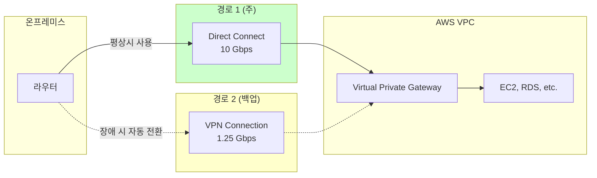

**동작 방식:**

**평상시:**
```
1. Direct Connect를 통한 트래픽 전송 (BGP 우선순위 높음)
2. VPN 터널은 UP 상태 유지하되 트래픽 없음
3. 정기적인 헬스 체크
```

**Direct Connect 장애 시:**
```
1. BGP 경로 변경 감지 (수 초 내)
2. VPN 경로로 자동 페일오버
3. 트래픽 계속 유지 (다운타임 없음)
4. Direct Connect 복구 시 자동 복귀
```

**라우팅 우선순위 설정:**

```
BGP AS-Path Prepending으로 우선순위 조정:

Direct Connect:
- AS Path: 65001
- 우선순위: 높음 (짧은 경로)

VPN:
- AS Path: 65001 65001 65001 (인위적으로 길게)
- 우선순위: 낮음 (백업용)
```

#### 비용 비교

**시나리오: 월 1TB 데이터 전송**

| 옵션 | 월 비용 | 장점 | 단점 |
|------|--------|------|------|
| VPN 단독 | ~$100 | 저렴, 유연 | 불안정, 느림 |
| DX 1Gbps | ~$1,200 | 안정, 빠름 | 비쌈, 단일 장애점 |
| DX + VPN | ~$1,300 | 안정 + 백업 | 약간 비쌈 |

**권장사항:**
```
소규모 (~100 Mbps): VPN만
중규모 (100-500 Mbps): VPN (주) + DX 검토
대규모 (500 Mbps+): DX (주) + VPN (백업)
미션 크리티컬: DX 이중화 + VPN
```

---

### 2.4. 온프레미스와 VPC 연결 방법 (4가지 정리)

#### 방법 1: VPN to Virtual Private Gateway

**구성:**
```
온프레미스 → VPN → Virtual Private Gateway → VPC
```

**특징:**
- 가장 간단한 방법
- VPC 하나에만 연결 가능
- 빠른 구축

**사용 사례:**
- 단일 VPC 환경
- 소규모 연결

---

#### 방법 2: VPN to Transit Gateway

**구성:**
```
온프레미스 → VPN → Transit Gateway → 여러 VPC
```

**특징:**
- 여러 VPC에 동시 연결
- 중앙 집중 관리
- VPC 추가 시 용이

**사용 사례:**
- 다중 VPC 환경
- 확장 가능성 중요

---

#### 방법 3: Direct Connect to Virtual Private Gateway

**구성:**
```
온프레미스 → Direct Connect → VGW → VPC
```

**특징:**
- 전용선 연결
- 고성능, 안정적
- VPC 하나만 연결

**사용 사례:**
- 단일 VPC에 고성능 연결 필요
- 대용량 데이터 전송

---

#### 방법 4: Direct Connect to Transit Gateway (권장)

**구성:**
```
온프레미스 → Direct Connect → Transit Gateway → 여러 VPC
```

**특징:**
- 최고 성능 + 확장성
- 여러 VPC, 다른 리전까지 연결
- 중앙 관리

**사용 사례:**
- 대규모 엔터프라이즈
- 글로벌 네트워크
- **실무 표준 아키텍처**

---

## Part 3: VPC와 AWS 서비스 연결

### 3.1. VPC 엔드포인트 개요

#### VPC 엔드포인트란?

**VPC 엔드포인트**는 VPC 내부 리소스가 **인터넷 게이트웨이, NAT 게이트웨이, VPN을 거치지 않고** AWS 서비스에 프라이빗하게 접근할 수 있게 하는 기능입니다.

**VPC 엔드포인트 없이 S3 접근 (기존 방식):**

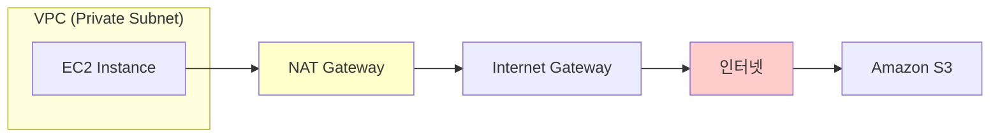

**문제점:**
```
❌ NAT Gateway 비용 발생 (시간당 + 데이터 처리)
❌ 인터넷 경유 (보안 위험)
❌ 지연 시간 증가
❌ 대역폭 제한 (NAT GW: 최대 45 Gbps)
```

**VPC 엔드포인트 사용 (개선):**

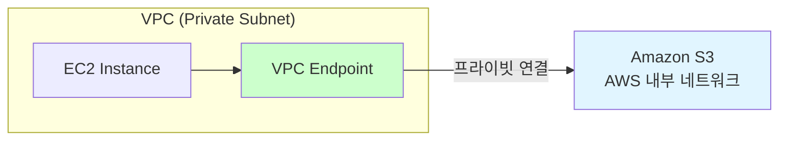

**장점:**
```
✅ NAT Gateway 불필요 (비용 절감)
✅ AWS 내부 네트워크 사용 (빠름, 안전)
✅ 무제한 대역폭
✅ 낮은 지연 시간
✅ 인터넷 노출 없음 (보안 강화)
```

---

### 3.2. VPC 엔드포인트 종류

#### 1. 게이트웨이 엔드포인트 (Gateway Endpoint)

**지원 서비스:**
- Amazon S3
- Amazon DynamoDB

**특징:**

```
동작 방식: 라우팅 테이블 기반
비용: 무료!
대역폭: 무제한
```

**설정 방법:**

1. VPC 엔드포인트 생성 (Gateway 타입 선택)
2. 라우팅 테이블에 자동으로 경로 추가됨

**라우팅 테이블 예시:**

```
Before (엔드포인트 없음):
Destination         Target
10.0.0.0/16        local
0.0.0.0/0          nat-xxxxx

After (엔드포인트 생성):
Destination         Target
10.0.0.0/16        local
0.0.0.0/0          nat-xxxxx
pl-xxxxx (S3)      vpce-xxxxx  ← 자동 추가!
```

**pl-xxxxx**: Prefix List (S3의 IP 대역 목록)

**동작 흐름:**

```
1. EC2에서 S3 API 호출 (예: s3.ap-northeast-2.amazonaws.com)
2. VPC DNS가 S3 엔드포인트의 프라이빗 IP 반환
3. 라우팅 테이블에서 pl-xxxxx 매칭
4. VPC 엔드포인트를 통해 AWS 내부망으로 전송
5. S3 응답
```

---

#### 2. 인터페이스 엔드포인트 (Interface Endpoint)

**지원 서비스:**
- 대부분의 AWS 서비스 (200개 이상)
- 예: EC2, SNS, SQS, CloudWatch, Systems Manager, Secrets Manager 등

**특징:**

```
동작 방식: ENI (Elastic Network Interface) 생성
비용: 시간당 $0.01 + 데이터 처리 비용
대역폭: 10 Gbps (버스트 가능)
기술: AWS PrivateLink 기반
```

**동작 구조:**

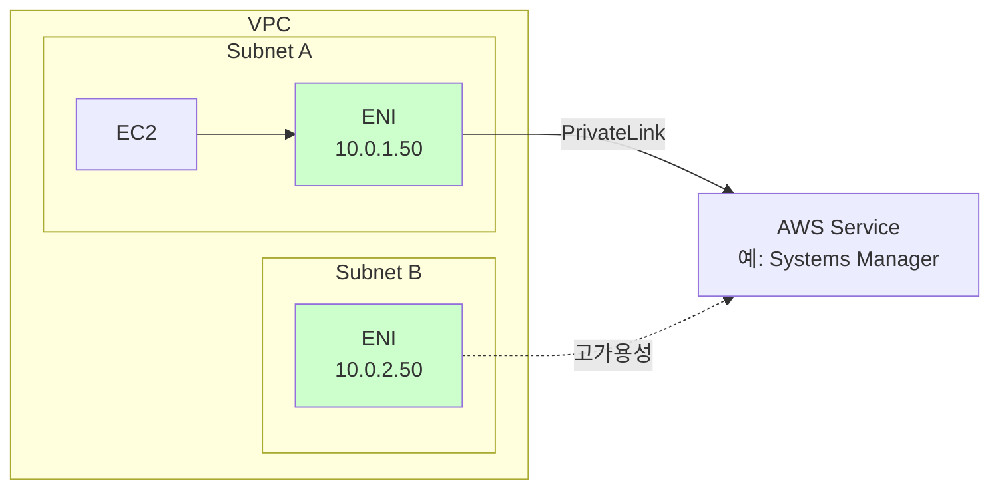

**설정 방법:**

1. VPC 엔드포인트 생성 (Interface 타입)
2. 서비스 선택 (예: com.amazonaws.ap-northeast-2.ssm)
3. 서브넷 선택 (AZ당 1개 ENI 생성)
4. 보안 그룹 설정 (HTTPS 443 허용)

**DNS 설정:**

인터페이스 엔드포인트는 **프라이빗 DNS**를 지원합니다:

```
활성화 시:
ssm.ap-northeast-2.amazonaws.com
→ 10.0.1.50 (VPC 엔드포인트 프라이빗 IP)

비활성화 시:
ssm.ap-northeast-2.amazonaws.com
→ 54.xxx.xxx.xxx (퍼블릭 IP, 인터넷 경유)

vpce-xxxxx-yyyyy.ssm.ap-northeast-2.vpce.amazonaws.com
→ 10.0.1.50 (VPC 엔드포인트 전용 DNS)
```

**권장사항:** 프라이빗 DNS 활성화 (코드 수정 불필요)

---

### 3.3. Gateway vs Interface 엔드포인트 비교

| 구분 | Gateway Endpoint | Interface Endpoint |
|------|-----------------|-------------------|
| 지원 서비스 | S3, DynamoDB만 | 대부분의 AWS 서비스 |
| 기술 | 라우팅 테이블 | ENI + PrivateLink |
| 비용 | **무료** | 시간당 $0.01 + 데이터 |
| 대역폭 | 무제한 | 10 Gbps |
| AZ 장애 대응 | 자동 (AWS 관리) | 수동 (서브넷 선택) |
| 온프레미스 접근 | 불가 | **가능** (DX/VPN 통해) |
| 보안 그룹 | 불필요 | 필요 |

**선택 기준:**

```
S3 또는 DynamoDB 사용:
→ Gateway Endpoint (무료, 무제한)

다른 AWS 서비스:
→ Interface Endpoint (유일한 선택지)

온프레미스에서 접근 필요:
→ Interface Endpoint (Gateway는 VPC 내부만)
```

---

### 3.4. AWS PrivateLink

#### PrivateLink란?

**AWS PrivateLink**는 VPC, AWS 서비스, 온프레미스 네트워크 간에 **인터넷을 거치지 않고** 안전한 비공개 연결을 제공하는 기술입니다.

**주요 사용 사례:**

**1. VPC → AWS 서비스 (Interface Endpoint)**
```
앞서 설명한 인터페이스 엔드포인트가 PrivateLink 기반
```

**2. VPC → 다른 VPC의 서비스 (서비스 공유)**
```
상황: 회사 A가 회사 B에게 API 서비스 제공

기존 방식:
- 인터넷 공개 (보안 위험)
- VPC 피어링 (CIDR 중복 문제, 복잡)

PrivateLink 방식:
- 회사 A: Network Load Balancer + VPC Endpoint Service 생성
- 회사 B: Interface Endpoint로 연결
- 프라이빗 IP로 안전한 통신
```

**3. 온프레미스 → AWS 서비스**
```
Direct Connect/VPN + Interface Endpoint
→ 온프레미스에서 AWS 서비스를 내부망처럼 사용
```

**PrivateLink 장점:**

```
✅ 인터넷 노출 없음
✅ CIDR 중복 문제 없음
✅ 보안 그룹으로 접근 제어
✅ 확장 가능 (수천 개 연결)
✅ 크로스 계정 지원
```

---

## Part 4: 실무 아키텍처 예제

### 4.1. VPC 내 웹서비스 + CloudFront

**시나리오:** 글로벌 사용자에게 빠른 웹 서비스 제공

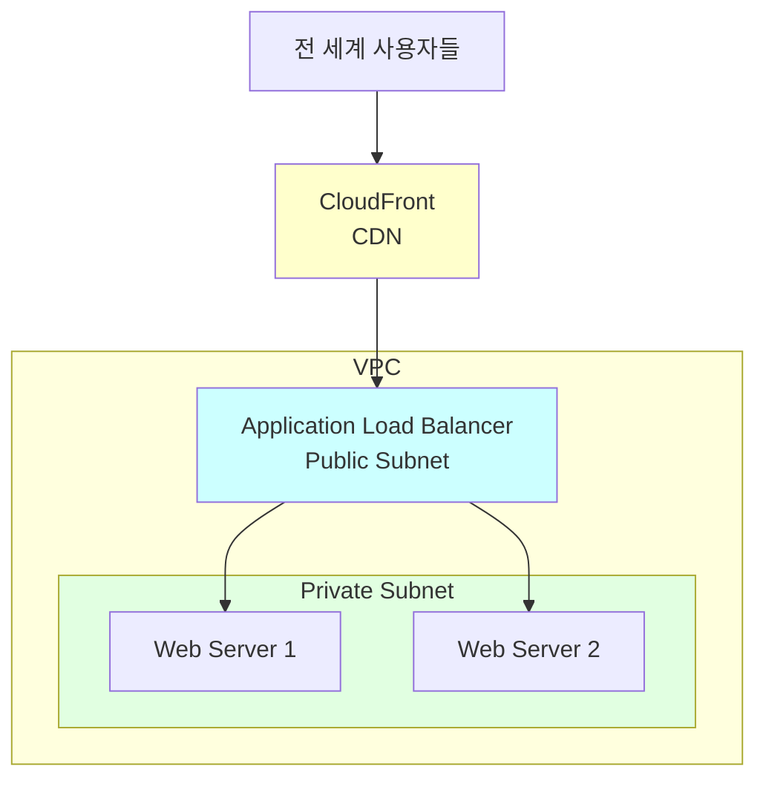

**구성 요소:**
1. CloudFront: 정적 콘텐츠 캐싱 (이미지, CSS, JS)
2. ALB: 동적 요청 로드 밸런싱
3. Web Server: Private Subnet에 배치 (보안)

**장점:**
- 전 세계 지연 시간 최소화
- DDoS 보호 (CloudFront + Shield)
- Origin 서버 부하 감소

---

### 4.2. VPC 엔드포인트로 S3 연결

**시나리오:** 프라이빗 서브넷의 EC2가 S3에 대용량 데이터 업로드

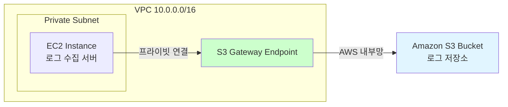

**설정:**
1. Gateway Endpoint 생성 (S3 선택)
2. 라우팅 테이블 자동 업데이트
3. S3 버킷 정책 (선택사항):

```json
{
  "Version": "2012-10-17",
  "Statement": [
    {
      "Effect": "Deny",
      "Principal": "*",
      "Action": "s3:*",
      "Resource": [
        "arn:aws:s3:::my-logs-bucket/*"
      ],
      "Condition": {
        "StringNotEquals": {
          "aws:SourceVpce": "vpce-1234567890abcdef"
        }
      }
    }
  ]
}
```

**효과:**
- VPC 엔드포인트를 통한 접근만 허용
- 인터넷에서 S3 접근 차단 (보안 강화)

**비용 절감:**
```
Before (NAT Gateway):
- NAT GW 시간당: $0.045
- 데이터 처리: $0.045/GB
- 월 1TB 전송: $0.045 * 730h + $0.045 * 1000GB ≈ $78

After (Gateway Endpoint):
- 엔드포인트: $0
- 데이터 전송: $0
- 월 1TB 전송: $0

→ 월 $78 절감!
```

---

## 주요 개념 요약표

| 구분 | 기술 | 설명 | 주요 특징 | 사용 사례 |
|------|------|------|----------|----------|
| **VPC 간 연결** | VPC 피어링 | 두 VPC 간 1:1 프라이빗 연결 | 전이적 라우팅 불가, CIDR 중복 불가 | 소규모 VPC 연결 (2-3개) |
| | Transit Gateway | 허브 앤 스포크 중앙 집중 연결 | 전이적 라우팅 가능, 다중 VPC/온프레미스 | 대규모 다중 VPC 환경 |
| **온프레미스 연결** | VPN | 인터넷 기반 암호화 터널 | 빠른 구축, 저렴, 대역폭 제한 (1.25 Gbps) | 초기 연결, 소규모, 백업용 |
| | Direct Connect | 물리적 전용선 연결 | 안정적, 고대역폭 (최대 100 Gbps), 비쌈 | 대용량 전송, 레이턴시 민감 |
| | DX + VPN 이중화 | 주/백업 구성 | 고가용성, 자동 페일오버 | 미션 크리티컬 환경 |
| **VPC 엔드포인트** | Gateway Endpoint | S3/DynamoDB 라우팅 기반 | 무료, 무제한 대역폭 | S3, DynamoDB 접근 |
| | Interface Endpoint | ENI 기반 PrivateLink | 대부분 AWS 서비스 지원, 온프레미스 접근 가능 | EC2 API, SSM, Secrets Manager 등 |
| | AWS PrivateLink | VPC 간 프라이빗 서비스 공유 | 인터넷 미경유, CIDR 중복 문제 없음 | 크로스 계정 API 제공 |

---

## 마무리

### 학습 내용 정리

**Part 1 - VPC 간 연결:**
- VPC 피어링의 1:1 제약과 Transit Gateway의 허브 앤 스포크 장점 이해
- 네트워크 규모에 따른 적절한 선택 기준 파악

**Part 2 - 하이브리드 클라우드:**
- VPN과 Direct Connect의 차이점 및 사용 사례 학습
- 고가용성을 위한 이중화 아키텍처 설계 방법 이해

**Part 3 - VPC 엔드포인트:**
- Gateway vs Interface 엔드포인트 비교
- AWS PrivateLink를 활용한 안전한 서비스 연결
- 비용 절감 및 보안 강화 방법

### 다음 학습 주제 (Section 2 예고)

- EC2 인스턴스 생성 및 관리
- AMI (Amazon Machine Image) 생성
- 웹 서버 구축 실습
- SSH/Session Manager를 통한 인스턴스 접근

### 실무 체크리스트

**네트워크 설계 시:**
```
☐ VPC 개수가 3개 이하면 VPC 피어링 검토
☐ VPC 개수가 4개 이상이면 Transit Gateway 사용
☐ 온프레미스 연결 시 대역폭/지연시간 요구사항 확인
☐ 미션 크리티컬 환경은 DX + VPN 이중화
```

**VPC 엔드포인트 사용 시:**
```
☐ S3, DynamoDB는 Gateway Endpoint (무료)
☐ 다른 서비스는 Interface Endpoint
☐ 프라이빗 DNS 활성화 (코드 수정 불필요)
☐ 보안 그룹에서 443 포트 허용
```

**비용 최적화:**
```
☐ NAT Gateway 대신 S3 Gateway Endpoint 사용
☐ 불필요한 데이터 전송 최소화
☐ VPN으로 충분한 경우 Direct Connect 미사용
```
