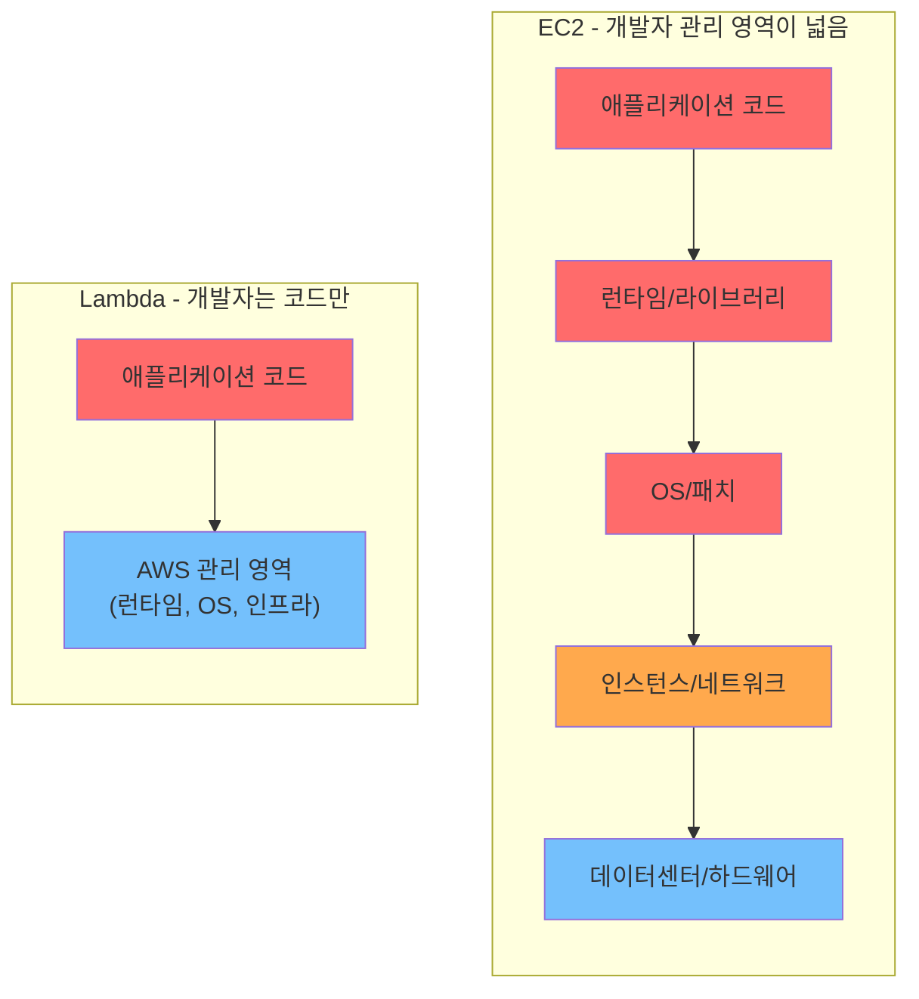
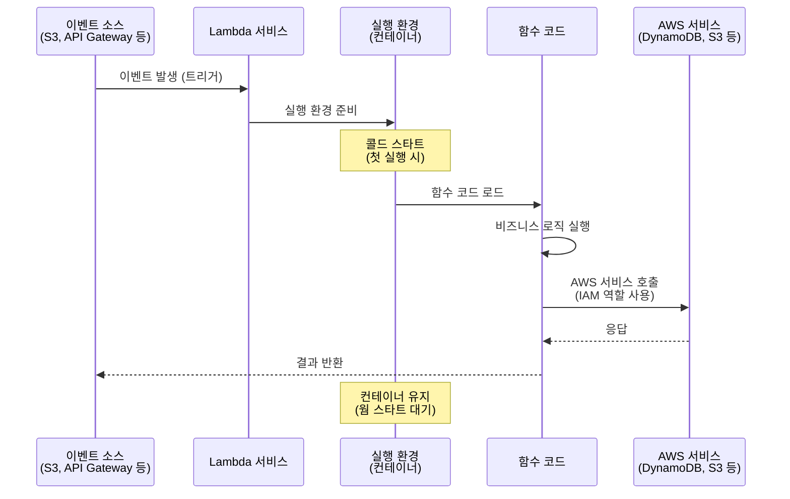
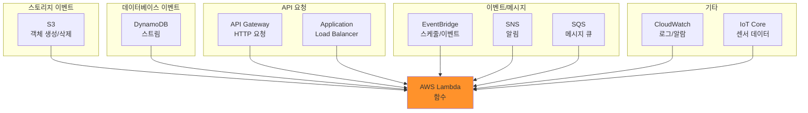
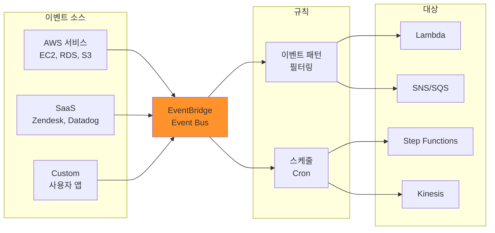
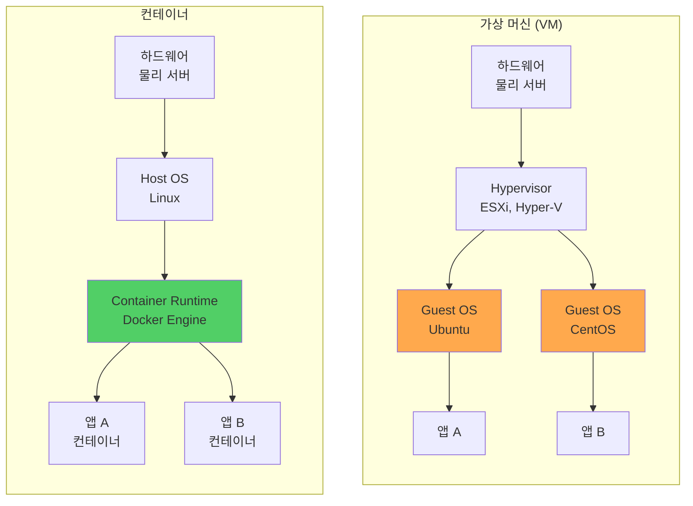
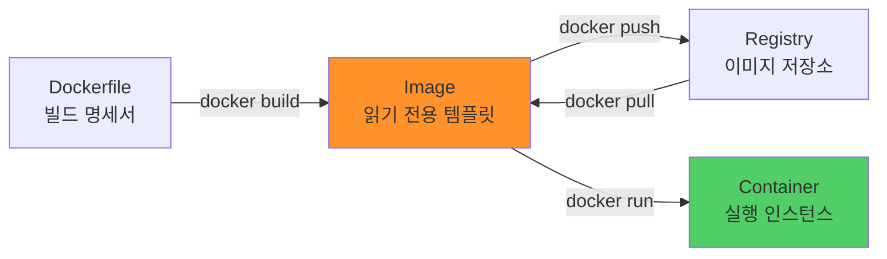
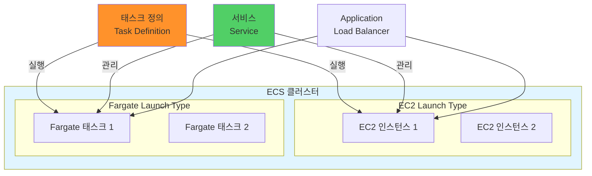
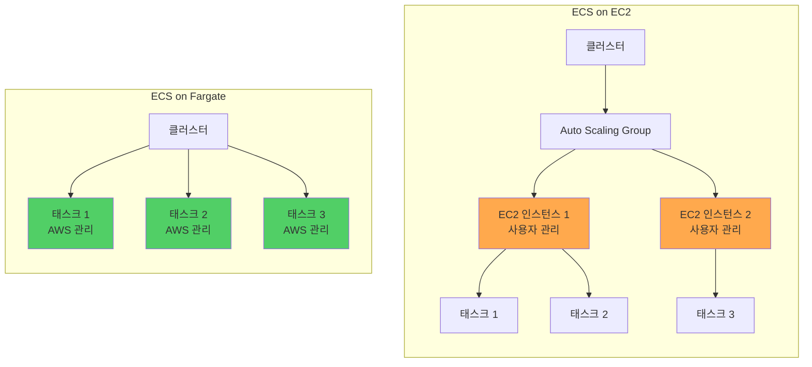

## 전체 흐름 요약

이번 학습에서는 AWS의 **서버리스 컴퓨팅(Serverless Computing)**과 **컨테이너 기반 서비스**를 학습합니다. 전통적인 EC2 인스턴스 관리에서 벗어나 코드 실행에만 집중할 수 있는 Lambda와, 애플리케이션을 컨테이너로 패키징하여 실행하는 ECS/Fargate를 다룹니다.

**Part 1 - 서버리스 개념**에서는 서버리스 컴퓨팅의 정의와 핵심 가치를 학습합니다. 서버리스는 "서버가 없다"가 아니라 "서버를 관리하지 않는다"는 의미로, 개발자는 코드 작성에만 집중하고 인프라 관리는 AWS가 담당합니다. EC2와 Lambda의 관리 책임을 비교하며 서버리스의 장점(서버 관리 불필요, 자동 확장, 종량 과금)과 단점(콜드 스타트, 실행 시간 제한, 상태 비저장)을 명확히 이해합니다.

**Part 2 - AWS Lambda**에서는 Lambda의 핵심 구성 요소와 동작 방식을 상세히 학습합니다. Lambda 함수는 이벤트에 의해 트리거되어 실행되며, 최대 15분까지 실행 가능하고 10GB 메모리를 할당할 수 있습니다. Lambda를 트리거하는 다양한 이벤트 소스(S3 객체 생성, DynamoDB 스트림, API Gateway 요청, EventBridge 스케줄 등)를 이해하고, 실행 환경(컨테이너), 동시 실행 제어, IAM 역할을 통한 권한 관리를 학습합니다. Lambda의 요금 체계는 요청 수와 실행 시간(GB-초)을 기반으로 하며, 매월 백만 건 요청과 40만 GB-초가 무료입니다.

**Part 3 - Amazon EventBridge**에서는 서버리스 이벤트 버스 서비스를 학습합니다. EventBridge는 AWS 서비스, SaaS 애플리케이션, 사용자 정의 애플리케이션 간의 이벤트를 라우팅하는 중앙 이벤트 허브 역할을 합니다. 이벤트 패턴 매칭을 통해 특정 이벤트만 필터링하여 대상(Lambda, SNS, SQS, Step Functions 등)으로 전달할 수 있으며, Cron 표현식을 사용한 스케줄링도 지원합니다.

**Part 4 - 컨테이너 기초**에서는 컨테이너 기술의 필요성과 동작 원리를 학습합니다. 컨테이너는 애플리케이션과 모든 종속성을 하나의 패키지로 묶어 어디서든 동일하게 실행할 수 있게 합니다. 가상 머신(VM)과 비교하여 컨테이너의 경량성(OS 커널 공유), 빠른 시작 시간(수 초), 이식성(이미지 기반 배포)을 이해합니다. Docker는 컨테이너 이미지를 빌드하고 실행하는 표준 도구입니다.

**Part 5 - Amazon ECS**에서는 AWS의 관리형 컨테이너 오케스트레이션 서비스를 학습합니다. ECS는 클러스터(컨테이너 실행 인프라), 태스크 정의(컨테이너 실행 청사진), 서비스(태스크 실행 관리자)로 구성됩니다. EC2 기반 ECS는 사용자가 EC2 인스턴스를 관리하며 비용이 저렴하지만 인프라 관리 부담이 있고, Fargate는 서버리스 방식으로 인프라 관리 없이 컨테이너만 실행하지만 비용이 더 높습니다. ECR(Elastic Container Registry)은 컨테이너 이미지를 저장하는 프라이빗 레지스트리입니다.

**Part 6 - AWS Lightsail**에서는 간편한 VPS(Virtual Private Server) 서비스를 학습합니다. Lightsail은 WordPress, LAMP 스택, Magento 등 사전 구성된 블루프린트를 제공하여 클릭 몇 번으로 애플리케이션을 배포할 수 있습니다. 예측 가능한 고정 요금제($3.50/월부터)와 단순한 관리 인터페이스로 초보자에게 적합합니다.

이번 섹션을 통해 EC2(IaaS), Lambda(FaaS), ECS/Fargate(컨테이너) 등 다양한 컴퓨팅 옵션을 비교하고 각 워크로드에 적합한 서비스를 선택할 수 있는 능력을 기릅니다.

---

## 주요 개념 요약표

| 구분 | AWS Lambda | ECS (EC2) | ECS (Fargate) | EC2 |
|------|-----------|----------|--------------|-----|
| **서비스 모델** | FaaS (Function as a Service) | CaaS (Container as a Service) | CaaS (서버리스) | IaaS (Infrastructure) |
| **관리 대상** | 코드만 | OS + 컨테이너 런타임 + 컨테이너 | 컨테이너만 | OS + 애플리케이션 전체 |
| **실행 단위** | 함수 (Function) | 컨테이너 (Container) | 컨테이너 (Container) | 인스턴스 (VM) |
| **확장 방식** | 자동 동시 실행 | 수동/Auto Scaling | 자동/Auto Scaling | Auto Scaling Group |
| **시작 시간** | 밀리초 ~ 수 초 | 수 초 | 수 초 | 수 분 |
| **최대 실행 시간** | 15분 | 무제한 | 무제한 | 무제한 |
| **상태 저장** | 불가 (Stateless) | 가능 | 가능 | 가능 |
| **과금 방식** | 요청 수 + 실행 시간 | EC2 인스턴스 시간 | vCPU 시간 + 메모리 시간 | 인스턴스 시간 |
| **유휴 비용** | 없음 (실행 시에만) | 있음 (24시간 과금) | 없음 (실행 시에만) | 있음 (24시간 과금) |
| **사용 사례** | 이벤트 처리, 간단한 API, 백그라운드 작업 | 장기 실행 컨테이너 애플리케이션 | 컨테이너 앱 (서버 관리 불필요) | 레거시 앱, 상태 저장 워크로드 |

---

## Part 1: 서버리스 개념

### 1.1. 서버리스란?

**서버리스(Serverless)**는 "서버가 없다"가 아니라 **"서버를 관리하지 않는다"**는 의미입니다. 물리적 서버는 존재하지만, 인프라 관리는 클라우드 제공자(AWS)가 담당하고 개발자는 코드에만 집중합니다.

#### 전통적인 방식 vs 서버리스 비교

**전통적인 EC2 방식에서 개발자가 관리해야 할 것들:**

**1. 인프라 프로비저닝**
- EC2 인스턴스 선택 (t3.medium? m5.large?)
- 네트워크 구성 (VPC, 서브넷, 보안 그룹)
- 스토리지 설정 (EBS 볼륨 크기, 타입)

**2. 운영 체제 관리**
- OS 설치 및 초기 설정
- 보안 패치 정기 적용
- 시스템 모니터링

**3. 애플리케이션 런타임**
- Python, Node.js, Java 등 설치
- 의존성 패키지 관리
- 환경 설정 파일 관리

**4. 확장성 및 가용성**
- Auto Scaling 그룹 설정
- 로드 밸런서 구성
- 장애 대응 계획 수립

**5. 비즈니스 로직**
- 실제 코드 작성

결과: 코드 작성 외에 너무 많은 것들을 관리해야 함!

**서버리스 Lambda 방식에서 개발자가 관리해야 할 것:**

**개발자 책임:**
- 비즈니스 로직 코드 작성 (이것만!)

**AWS가 자동으로 관리:**
- 인프라 프로비저닝 (자동)
- OS 패치 및 업데이트 (자동)
- 런타임 환경 구성 (자동)
- 확장성 (자동으로 수천 개 동시 실행)
- 고가용성 (여러 AZ에 자동 분산)
- 보안 (AWS 책임 공유 모델)

결과: 코드 작성과 비즈니스 로직에만 집중!

**관리 책임 시각화:**



---

### 1.2. 서버리스의 핵심 특징

#### 1) 서버 관리 불필요

**EC2 방식:**
- 서버 용량 계획 필요
- 피크 시간대 대비 과도한 프로비저닝
- 유휴 리소스 낭비

**Lambda 방식:**
- 용량 계획 불필요
- 요청이 들어올 때만 실행
- 유휴 리소스 제로

#### 2) 자동 확장 (Auto Scaling)

**시나리오: 이벤트 기간 동안 트래픽 급증**

**EC2의 경우:**
- 시작: 100 TPS → 서버 10대 필요
- 급증: 10,000 TPS 발생!
- Auto Scaling 발동하지만 수 분 소요
- 새 인스턴스 부팅 대기
- 일부 요청 타임아웃 발생

**Lambda의 경우:**
- 시작: 100 TPS → Lambda 100개 동시 실행
- 급증: 10,000 TPS 발생!
- 즉시 Lambda 10,000개 동시 실행
- 밀리초 단위 확장
- 모든 요청 처리 성공

**동시 실행 제한:**
- 리전당 기본 1,000개 동시 실행
- 요청 시 증가 가능 (수만 ~ 수십만)

#### 3) 종량 과금 (Pay-as-you-go)

**비용 계산 예시:**

**EC2 t3.medium 비용:**
- 시간당 요금: $0.0416 (서울 리전)
- 하루 24시간 실행: $0.0416 × 24 = $0.9984
- 한 달(30일): $0.9984 × 30 = $29.95
- 트래픽 유무와 관계없이 항상 과금

**Lambda 비용:**
- 요청 당 비용: $0.20 / 100만 요청
- 실행 시간 비용: $0.0000166667 / GB-초
- 예시: 하루 1만 건 요청, 각 512MB로 200ms 실행
  - 요청 비용: (10,000 × 30) / 1,000,000 × $0.20 = $0.06
  - 실행 비용: (0.5 GB × 0.2초 × 10,000 × 30) × $0.0000166667 = $0.50
  - 총 $0.56/월
- 유휴 시간 비용 = $0

**결론:** 트래픽이 적을수록 Lambda가 훨씬 저렴!

#### 4) 이벤트 기반 실행

Lambda는 "이벤트"에 반응하여 실행됩니다.

**이벤트 예시:**
- S3 버킷에 이미지 업로드 → 썸네일 생성 Lambda 실행
- DynamoDB 테이블에 데이터 추가 → 알림 Lambda 실행
- API Gateway 요청 수신 → 비즈니스 로직 Lambda 실행
- CloudWatch 알람 발생 → 자동 복구 Lambda 실행
- 매일 오전 9시 → 일일 리포트 Lambda 실행

---

### 1.3. 서버리스의 장점

**1. 운영 부담 감소**
- 서버 패치, OS 업데이트, 보안 관리를 AWS가 담당
- 개발팀은 코드 작성에만 집중

**2. 비용 효율성**
- 유휴 리소스 비용 없음
- 실행한 만큼만 과금
- 프리 티어: 매월 100만 요청 무료

**3. 빠른 개발 및 배포**
- 인프라 구성 없이 바로 코드 배포
- 함수 단위 업데이트 가능

**4. 무한 확장성**
- 트래픽 급증 시 자동 확장
- 확장 한계 걱정 불필요

**5. 고가용성 내장**
- 여러 AZ에 자동 배포
- 장애 조치 자동화

---

### 1.4. 서버리스의 제약사항

#### 1) 콜드 스타트 (Cold Start)

**콜드 스타트란?**
- Lambda 함수가 처음 실행되거나 일정 시간 유휴 상태 후 재실행 시 발생
- 실행 환경(컨테이너) 초기화 시간 필요
- 첫 요청 응답 시간이 느림 (수백 ms ~ 수 초)

**웜 스타트 (Warm Start):**
- 최근에 실행된 Lambda는 컨테이너가 재사용됨
- 응답 시간 빠름 (수 ms ~ 수십 ms)

**콜드 스타트 최소화 방법:**

**1. Provisioned Concurrency**
- 미리 초기화된 실행 환경 유지
- 콜드 스타트 제거 (추가 비용 발생)

**2. 주기적 호출 (Keep Warm)**
- CloudWatch Events로 5분마다 호출
- 실행 환경 유지

**3. 런타임 선택**
- Python, Node.js: 빠른 시작
- Java, .NET: 느린 시작

#### 2) 실행 시간 제한

**Lambda 제약:**
- 최대 실행 시간: 15분
- 메모리: 128MB ~ 10,240MB (10GB)
- 임시 디스크 (/tmp): 최대 10GB
- 페이로드 크기: 요청/응답 각 6MB

**부적합한 워크로드:**
- 장기 실행 배치 작업 (15분 초과)
- 실시간 스트리밍
- 상태 저장이 필요한 애플리케이션
- 대용량 파일 처리 (메모리 부족)

이런 경우 EC2, ECS, Batch 서비스 사용 권장

#### 3) 상태 비저장 (Stateless)

Lambda는 상태를 저장하지 않습니다.

**예시 상황:**
- Function 1 실행: 변수 counter = 0, counter += 1, 결과: counter = 1
- Function 2 실행 (같은 Lambda): counter는 다시 0부터 시작 (이전 실행 값 유지 안 됨)

**상태 저장이 필요하면 별도 서비스 사용:**
- DynamoDB: Key-Value 저장소
- ElastiCache: 인메모리 캐시
- S3: 파일 저장소
- RDS: 관계형 데이터베이스

#### 4) 디버깅 및 모니터링 어려움

**EC2의 경우:**
- SSH 접속하여 로그 직접 확인
- 디버거 연결 가능

**Lambda의 경우:**
- SSH 접속 불가
- CloudWatch Logs로만 확인
- 로컬 개발 환경과 차이 발생 가능

**해결책:**
- AWS SAM (Serverless Application Model)으로 로컬 테스트
- X-Ray로 분산 추적
- CloudWatch Logs Insights로 로그 분석

---

### 1.5. 서버리스 사용 사례

**Lambda가 적합한 경우:**

**1. 이벤트 기반 처리**
- S3 업로드 시 이미지 리사이징
- DynamoDB 변경 시 알림 전송
- IoT 센서 데이터 처리

**2. 간단한 API 백엔드**
- 사용자 인증 API
- 데이터 조회 API
- 단순 CRUD 작업

**3. 스케줄 작업**
- 일일 리포트 생성
- 로그 파일 압축 및 아카이빙
- 데이터베이스 백업

**4. 실시간 데이터 처리**
- 로그 스트림 분석
- 실시간 알림
- Webhook 처리

**5. 챗봇 및 음성 비서**
- Alexa Skills
- Slack 봇
- 자동 응답 시스템

**Lambda가 부적합한 경우:**

**1. 장기 실행 작업 (15분 초과)**
- 대용량 비디오 인코딩
- 빅데이터 배치 처리
- 대안: EC2, ECS, AWS Batch

**2. 상태 저장 애플리케이션**
- 웹소켓 서버
- 게임 서버
- 대안: EC2, ECS

**3. 고성능 컴퓨팅 (HPC)**
- 과학 시뮬레이션
- 머신러닝 학습
- 대안: EC2 (GPU 인스턴스)

**4. 레거시 애플리케이션**
- 모놀리식 구조
- 복잡한 의존성
- 대안: EC2, Lightsail

---

## Part 2: AWS Lambda

### 2.1. Lambda 핵심 개념

#### Lambda 함수란?

**Lambda 함수**는 이벤트에 응답하여 실행되는 독립적인 코드 조각입니다.

**Lambda 함수 구성 요소:**

**1. 함수 코드**
- 실행할 프로그래밍 코드
- 지원 언어: Python, Node.js, Java, Go, C#, Ruby, PowerShell 등

**2. 핸들러 (Handler)**
- 함수의 진입점
- 예: `lambda_handler(event, context)`

**3. 런타임**
- 코드 실행 환경
- 예: Python 3.12, Node.js 20.x

**4. 메모리 설정**
- 128MB ~ 10,240MB
- 메모리에 비례하여 CPU도 증가

**5. 타임아웃**
- 최대 실행 시간 설정 (3초 ~ 15분)
- 기본값: 3초

**6. 환경 변수**
- 설정 값 저장 (DB 주소, API 키 등)
- 암호화 가능

**7. IAM 역할**
- Lambda가 다른 AWS 서비스에 접근할 권한

#### Lambda 실행 모델



**실행 흐름 설명:**

**1. 이벤트 발생**
- S3에 파일 업로드, API 요청 등

**2. Lambda 서비스 트리거**
- 이벤트가 Lambda로 전달됨

**3. 실행 환경 준비 (콜드 스타트)**
- 새 컨테이너 생성 및 초기화
- 런타임 로드
- 함수 코드 다운로드 및 압축 해제
- 시간 소요: 수백 ms ~ 수 초

**4. 함수 실행**
- handler 함수 호출
- event 객체로 입력 데이터 전달
- context 객체로 실행 환경 정보 제공

**5. AWS 서비스 호출 (선택적)**
- IAM 역할의 권한으로 다른 서비스 접근
- 예: DynamoDB에 데이터 저장, SNS로 알림 전송

**6. 결과 반환**
- 성공: 결과 반환
- 실패: 에러 발생

**7. 컨테이너 유지 (웜 스타트 대기)**
- 다음 요청을 위해 컨테이너 재사용 준비
- 수 분간 유휴 후 삭제

---

### 2.2. Lambda 함수 구조

#### 기본 구조

**Python Lambda 예시:**

```python
def lambda_handler(event, context):
    """
    Lambda 함수의 진입점 (핸들러)
    
    Parameters:
    - event: 이벤트 데이터 (딕셔너리)
    - context: 실행 환경 정보 (런타임 정보, 요청 ID 등)
    
    Returns:
    - 응답 데이터 (딕셔너리, 문자열, 숫자 등)
    """
    
    # 1. 이벤트 데이터 추출
    name = event.get('name', 'World')
    
    # 2. 비즈니스 로직 실행
    message = f'Hello, {name}!'
    
    # 3. 결과 반환
    return {
        'statusCode': 200,
        'body': message
    }
```

**event 객체 예시:**

```python
# S3 이벤트
{
    'Records': [{
        's3': {
            'bucket': {'name': 'my-bucket'},
            'object': {'key': 'photo.jpg'}
        }
    }]
}

# API Gateway 이벤트
{
    'httpMethod': 'GET',
    'path': '/users/123',
    'queryStringParameters': {'page': '1'},
    'headers': {'Content-Type': 'application/json'},
    'body': '{"name": "John"}'
}
```

**context 객체 주요 속성:**

```python
context.function_name        # Lambda 함수 이름
context.function_version     # 버전 (예: $LATEST)
context.invoked_function_arn # 함수 ARN
context.memory_limit_in_mb   # 할당된 메모리 (MB)
context.request_id           # 요청 고유 ID
context.log_group_name       # CloudWatch 로그 그룹
context.log_stream_name      # CloudWatch 로그 스트림

# 남은 실행 시간 확인 (밀리초)
remaining_time = context.get_remaining_time_in_millis()
```

---

### 2.3. Lambda 트리거 (이벤트 소스)

Lambda는 다양한 AWS 서비스의 이벤트에 반응하여 실행됩니다.

**주요 트리거 서비스:**



#### 1) S3 이벤트 트리거

**사용 사례:**
- 이미지 업로드 시 썸네일 생성
- 로그 파일 압축 및 아카이빙
- CSV 파일 파싱 및 DB 저장

**이벤트 타입:**
- `s3:ObjectCreated:*` (모든 생성 이벤트)
- `s3:ObjectCreated:Put` (PUT으로 생성)
- `s3:ObjectCreated:Post` (POST로 생성)
- `s3:ObjectRemoved:*` (삭제 이벤트)

**예시 설정:**
- S3 버킷: my-photos
- 이벤트: 객체 생성
- 접두사: uploads/
- 접미사: .jpg

결과: `uploads/photo.jpg` 업로드 시 Lambda 실행

#### 2) DynamoDB Streams

**사용 사례:**
- 데이터 변경 시 실시간 알림
- 데이터 복제 (다른 테이블/리전)
- 감사 로그 생성

**이벤트 타입:**
- INSERT: 새 항목 추가
- MODIFY: 기존 항목 수정
- REMOVE: 항목 삭제

**예시:**
- DynamoDB 테이블: Orders
- 스트림 활성화: ON
- Lambda 트리거: 주문 생성 시 확인 이메일 발송

#### 3) API Gateway

**사용 사례:**
- RESTful API 백엔드
- 서버리스 웹 애플리케이션
- 마이크로서비스 API

**흐름:**
클라이언트 → API Gateway → Lambda → 응답

**예시:**
- `POST /users` 요청
- API Gateway가 Lambda 호출
- Lambda가 DynamoDB에 사용자 생성
- API Gateway가 클라이언트에 응답 반환

#### 4) EventBridge (CloudWatch Events)

**사용 사례:**
- 정기적인 배치 작업 (Cron)
- AWS 서비스 이벤트 처리
- 사용자 정의 이벤트 처리

**스케줄 예시:**
- `rate(5 minutes)`: 5분마다 실행
- `rate(1 day)`: 하루에 한 번
- `cron(0 9 * * ? *)`: 매일 오전 9시 (UTC)

**이벤트 패턴 예시:**
- EC2 인스턴스 상태 변경
- RDS 스냅샷 생성
- CloudTrail API 호출

#### 5) SQS (Simple Queue Service)

**사용 사례:**
- 비동기 작업 처리
- 트래픽 버퍼링
- 마이크로서비스 간 통신

**흐름:**
Producer → SQS 큐 → Lambda (Poller) → 처리

**배치 처리:**
- Lambda가 SQS에서 메시지를 배치로 가져옴
- 한 번에 최대 10개 메시지 처리
- 처리 성공 시 메시지 자동 삭제

---

### 2.4. Lambda 환경 변수

**환경 변수**는 코드를 변경하지 않고 설정 값을 관리하는 방법입니다.

**환경 변수 설정 예시:**
- DB_HOST = mydb.abc123.ap-northeast-2.rds.amazonaws.com
- DB_PORT = 5432
- API_KEY = (암호화됨)

**Python 코드에서 사용:**

```python
import os

db_host = os.environ['DB_HOST']
db_port = os.environ['DB_PORT']
api_key = os.environ['API_KEY']

# 데이터베이스 연결
connection = connect_to_db(host=db_host, port=db_port)
```

**장점:**
- 개발/스테이징/프로덕션 환경별 설정 분리
- 민감 정보 암호화 (KMS)
- 코드 변경 없이 설정 업데이트

---

### 2.5. Lambda 권한 관리 (IAM 역할)

Lambda 함수는 **실행 역할(Execution Role)**을 통해 다른 AWS 서비스에 접근합니다.

**실행 역할 개념:**
- Lambda 함수가 "누구"인지 정의
- 어떤 AWS 서비스에 접근할 수 있는지 권한 부여

**기본 권한:**
- CloudWatch Logs에 로그 쓰기

**추가 권한 예시:**
- S3 버킷 읽기/쓰기
- DynamoDB 테이블 조회/삽입
- SNS 토픽 퍼블리시
- SES 이메일 발송

**IAM 정책 예시:**

```json
{
  "Version": "2012-10-17",
  "Statement": [
    {
      "Effect": "Allow",
      "Action": [
        "s3:GetObject",
        "s3:PutObject"
      ],
      "Resource": "arn:aws:s3:::my-bucket/*"
    },
    {
      "Effect": "Allow",
      "Action": [
        "dynamodb:PutItem",
        "dynamodb:GetItem"
      ],
      "Resource": "arn:aws:dynamodb:ap-northeast-2:123456789012:table/MyTable"
    }
  ]
}
```

---

### 2.6. Lambda 요금

**Lambda 요금 = 요청 수 + 실행 시간(GB-초)**

#### 요금 구성

**1. 요청 요금:**
- $0.20 / 100만 요청
- 프리 티어: 매월 100만 요청 무료

**2. 실행 시간 요금 (GB-초):**
- $0.0000166667 / GB-초
- 프리 티어: 매월 400,000 GB-초 무료

**GB-초 계산:**
- GB-초 = (할당 메모리 GB) × (실행 시간 초)
- 예: 512MB 메모리, 200ms 실행 = 0.5 GB × 0.2초 = 0.1 GB-초

#### 요금 계산 예시

**시나리오:** 매월 300만 요청, 각 512MB, 200ms 실행

**1. 요청 요금:**
- 총 요청: 3,000,000
- 프리 티어 차감: 3,000,000 - 1,000,000 = 2,000,000
- 비용: 2,000,000 / 1,000,000 × $0.20 = **$0.40**

**2. 실행 시간 요금:**
- GB-초: 0.5 GB × 0.2초 × 3,000,000 = 300,000 GB-초
- 프리 티어 범위 내 (400,000)
- 비용: **$0**

**총 비용: $0.40/월**

**비교:** EC2 t3.micro ($0.0104/시간 = $7.49/월)보다 훨씬 저렴!

---

### 2.7. Lambda 동시 실행 제어

**동시 실행(Concurrency)**은 동시에 실행되는 Lambda 함수의 수입니다.

**기본 동시 실행 한도:**
- 리전당: 1,000개 동시 실행
- 계정 전체 공유

**예약 동시 실행 (Reserved Concurrency):**
- 특정 함수에 동시 실행 수 예약
- 다른 함수가 사용할 수 없음
- 중요한 함수 보호

**프로비저닝된 동시 실행 (Provisioned Concurrency):**
- 미리 초기화된 실행 환경 유지
- 콜드 스타트 제거
- 추가 비용 발생

**동시 실행 초과 시:**
- 초과 요청은 스로틀링 (Throttling)
- 비동기 호출: 재시도 큐에 저장
- 동기 호출: 429 에러 반환

---

## Part 3: Amazon EventBridge

### 3.1. EventBridge 개요

**Amazon EventBridge**는 AWS 서비스, SaaS 애플리케이션, 사용자 정의 애플리케이션 간의 이벤트를 연결하는 서버리스 이벤트 버스 서비스입니다.

**EventBridge 역할:**
- 이벤트 소스에서 이벤트 수신
- 규칙(Rule)에 따라 이벤트 필터링
- 대상(Target)으로 이벤트 전달

**예시:**
EC2 인스턴스 중지 → EventBridge → SNS 알림 전송

**EventBridge 아키텍처:**



---

### 3.2. EventBridge 핵심 구성 요소

#### 1) 이벤트 버스 (Event Bus)

**이벤트 버스 = 이벤트가 흐르는 파이프라인**

**기본 버스:**
- default: AWS 서비스 이벤트 수신
- 계정당 자동 생성

**사용자 정의 버스:**
- 특정 애플리케이션용 버스
- 다른 계정과 공유 가능
- 예: payment-events, order-events

#### 2) 규칙 (Rule)

**규칙 = 이벤트 필터 + 대상 설정**

**규칙 구성:**
- 이벤트 패턴 또는 스케줄
- 대상 (Lambda, SNS 등)

**예시 규칙:**
- 이름: ec2-state-change-alert
- 패턴: EC2 인스턴스가 'stopped' 상태로 변경
- 대상: SNS 토픽 (알림 전송)

#### 3) 이벤트 패턴 (Event Pattern)

**EC2 인스턴스 상태 변경 이벤트만 필터링:**

```json
{
  "source": ["aws.ec2"],
  "detail-type": ["EC2 Instance State-change Notification"],
  "detail": {
    "state": ["stopped"]
  }
}
```

**S3 객체 생성 이벤트:**

```json
{
  "source": ["aws.s3"],
  "detail-type": ["Object Created"],
  "detail": {
    "bucket": {
      "name": ["my-bucket"]
    }
  }
}
```

#### 4) 대상 (Target)

**EventBridge가 이벤트를 전달할 수 있는 AWS 서비스:**
- Lambda: 함수 실행
- SNS: 알림 발송
- SQS: 메시지 큐 전달
- Step Functions: 워크플로우 시작
- Kinesis: 스트림 전송
- ECS Task: 컨테이너 실행
- Systems Manager: 자동화 실행
- API Gateway: HTTP 엔드포인트 호출

---

### 3.3. EventBridge 스케줄

**Cron 표현식**으로 정기적인 작업을 스케줄링할 수 있습니다.

**Cron 표현식 형식:**
`cron(분 시 일 월 요일 년)`

**예시:**

**1. 매일 오전 9시 (UTC)**
`cron(0 9 * * ? *)`

**2. 평일 오후 6시 (UTC)**
`cron(0 18 ? * MON-FRI *)`

**3. 매월 1일 오전 0시**
`cron(0 0 1 * ? *)`

**4. 15분마다**
`rate(15 minutes)`

**5. 하루에 한 번**
`rate(1 day)`

**주의사항:** EventBridge는 UTC 시간대 사용
- 한국 시간(KST) = UTC + 9시간

---

### 3.4. EventBridge 사용 사례

#### 1) AWS 서비스 이벤트 처리

**시나리오: EC2 인스턴스 중지 시 Slack 알림**

**흐름:**
1. EC2 인스턴스 중지
2. EventBridge (이벤트 패턴 매칭)
3. Lambda 함수 실행
4. Slack API 호출
5. "인스턴스 i-abc123이 중지되었습니다" 메시지 전송

#### 2) 정기 작업 스케줄링

**시나리오: 매일 오전 9시 일일 리포트 생성**

**흐름:**
1. EventBridge (Cron: 매일 0시 UTC = 오전 9시 KST)
2. Lambda 함수 실행
3. RDS에서 데이터 조회
4. 리포트 생성
5. S3에 저장
6. SNS로 이메일 발송

#### 3) 마이크로서비스 통합

**시나리오: 주문 생성 시 여러 마이크로서비스 통지**

**흐름:**
1. 주문 서비스 → EventBridge (커스텀 이벤트 발행)
2. 규칙 1: 재고 서비스 Lambda (재고 차감)
3. 규칙 2: 배송 서비스 Lambda (배송 준비)
4. 규칙 3: 알림 서비스 Lambda (고객 이메일 발송)

**장점:**
- 서비스 간 느슨한 결합
- 새 서비스 추가 용이
- 장애 격리

---

## Part 4: 컨테이너 기초

### 4.1. 컨테이너란?

**컨테이너**는 애플리케이션과 모든 종속성(라이브러리, 설정 파일 등)을 하나의 패키지로 묶어 어디서든 동일하게 실행할 수 있게 하는 기술입니다.

**컨테이너의 핵심 아이디어:**
"내 로컬에서는 되는데, 서버에서는 안 돼요" 문제 해결

**문제 상황:**
- 로컬: Python 3.11, PostgreSQL 14
- 서버: Python 3.8, MySQL 8

**컨테이너 해결책:**
- 애플리케이션 + Python 3.11 + PostgreSQL 14 모두 컨테이너 이미지에 포함
- 어디서든 동일하게 실행

---

### 4.2. 가상 머신 vs 컨테이너



**비교표:**

| 구분 | 가상 머신 (VM) | 컨테이너 |
|------|--------------|---------|
| **격리 수준** | 하드웨어 레벨 가상화 | 프로세스 레벨 격리 |
| **OS** | 각 VM마다 독립 OS | Host OS 커널 공유 |
| **크기** | 수 GB ~ 수십 GB | 수 MB ~ 수백 MB |
| **시작 시간** | 수 분 | 수 초 |
| **리소스 효율** | 낮음 (OS 오버헤드) | 높음 (커널 공유) |
| **이식성** | 낮음 (Hypervisor 의존) | 높음 (이미지 기반) |
| **사용 사례** | 완전한 OS 필요, 보안 중요 | 마이크로서비스, CI/CD |

---

### 4.3. Docker 기본 개념

**Docker**는 컨테이너를 빌드, 실행, 배포하는 플랫폼입니다.

#### 핵심 구성 요소

**1. Dockerfile**
- 컨테이너 이미지 빌드 명세서
- 베이스 이미지, 의존성, 실행 명령 정의

**2. 이미지 (Image)**
- 컨테이너 실행을 위한 읽기 전용 템플릿
- 레이어 구조 (변경 사항만 추가)
- 버전 관리 가능 (태그)

**3. 컨테이너 (Container)**
- 이미지를 실행한 인스턴스
- 격리된 프로세스
- 생성/시작/중지/삭제 가능

**4. 레지스트리 (Registry)**
- 이미지 저장소
- Docker Hub (공개), Amazon ECR (프라이빗)

**Docker 워크플로우:**



---

### 4.4. 컨테이너의 장점

#### 1) 이식성 (Portability)

같은 이미지를 다양한 환경에서 동일하게 실행 가능:
- 개발자 로컬 (MacOS)
- 테스트 서버 (Windows)
- 프로덕션 (AWS Linux)

환경 차이 문제 해결!

#### 2) 빠른 시작 시간

**EC2 인스턴스:**
- 부팅 시간: 수 분
- OS 초기화 필요

**컨테이너:**
- 시작 시간: 수 초
- 프로세스만 시작

결과: 빠른 확장, 빠른 배포

#### 3) 리소스 효율성

**시나리오: 10개 애플리케이션 실행**

**VM 방식:**
- 10개 VM × 2GB OS = 20GB 오버헤드
- 10개 VM × 512MB 앱 = 5GB
- 총: 25GB

**컨테이너 방식:**
- 1개 Host OS = 2GB
- 10개 컨테이너 × 512MB = 5GB
- 총: 7GB

결과: 3배 이상 효율적!

#### 4) 마이크로서비스 아키텍처 적합

**모놀리식 (하나의 큰 애플리케이션):**
- 전체를 하나의 서버에 배포
- 일부 수정 시 전체 재배포
- 확장 어려움

**마이크로서비스 (작은 서비스들):**
- 각 서비스를 독립 컨테이너로 배포
- 서비스별 독립 업데이트
- 서비스별 독립 확장

**예시:**
- 사용자 서비스 컨테이너
- 주문 서비스 컨테이너
- 결제 서비스 컨테이너
- 알림 서비스 컨테이너

---

### 4.5. 컨테이너 사용 사례

**1. 웹 애플리케이션**
- Node.js, Python Flask, Ruby on Rails
- Nginx, Apache 웹 서버

**2. 마이크로서비스**
- 서비스별 독립 배포
- Kubernetes, ECS로 오케스트레이션

**3. CI/CD 파이프라인**
- 테스트 환경 일관성
- 빌드 환경 재현성

**4. 데이터 처리**
- 배치 작업
- ETL 파이프라인

**5. 개발 환경**
- 로컬 개발 환경 통일
- 팀원 간 환경 차이 제거

---

## Part 5: Amazon ECS

### 5.1. ECS 개요

**Amazon ECS (Elastic Container Service)**는 컨테이너를 쉽게 실행, 중지 및 관리할 수 있는 관리형 컨테이너 오케스트레이션 서비스입니다.

**ECS 역할:**
- 컨테이너 배포 자동화
- 컨테이너 상태 모니터링
- 장애 발생 시 자동 재시작
- 로드 밸런서 통합
- Auto Scaling 지원

**ECS vs Kubernetes:**

| 구분 | Amazon ECS | Kubernetes |
|------|-----------|------------|
| **관리 주체** | AWS 완전 관리 | 사용자 또는 EKS |
| **학습 곡선** | 낮음 (간단) | 높음 (복잡) |
| **AWS 통합** | 깊은 통합 | 일부 통합 |
| **이식성** | AWS 종속 | 클라우드 중립적 |
| **비용** | 무료 (인프라만 과금) | EKS $0.10/시간 |
| **사용 사례** | AWS 환경, 간단한 컨테이너 앱 | 멀티 클라우드, 복잡한 앱 |

---

### 5.2. ECS 핵심 구성 요소



#### 1) 클러스터 (Cluster)

**클러스터 = 컨테이너가 실행되는 논리적 그룹**

**역할:**
- 컨테이너 실행 인프라 관리
- 리소스 격리
- 권한 관리

**예시:**
- dev-cluster (개발 환경)
- staging-cluster (스테이징 환경)
- prod-cluster (프로덕션 환경)

#### 2) 태스크 정의 (Task Definition)

**태스크 정의 = 컨테이너 실행 청사진 (설계도)**

**포함 내용:**
- 컨테이너 이미지 (ECR 또는 Docker Hub)
- CPU 및 메모리 할당
- 포트 매핑
- 환경 변수
- 로그 설정
- IAM 역할

**예시 구조:**

태스크 정의: my-web-app:v1
- 컨테이너 1: nginx (프록시)
  - 이미지: nginx:latest
  - 포트: 80
  - 메모리: 512MB
- 컨테이너 2: app (백엔드)
  - 이미지: my-app:v1.0
  - 포트: 8080
  - 메모리: 1024MB

#### 3) 태스크 (Task)

**태스크 = 태스크 정의의 실행 인스턴스**

태스크 정의가 "설계도"라면, 태스크는 "실제로 실행 중인 컨테이너"

**예시:**

태스크 정의: my-web-app:v1

실행 중인 태스크:
- 태스크 1 (EC2 인스턴스 1에서 실행)
- 태스크 2 (EC2 인스턴스 2에서 실행)
- 태스크 3 (Fargate에서 실행)

#### 4) 서비스 (Service)

**서비스 = 태스크 실행 관리자**

**역할:**
- 원하는 태스크 수 유지 (Desired Count)
- 태스크 장애 시 자동 재시작
- 로드 밸런서 통합
- Auto Scaling 지원

**예시 설정:**

서비스: web-service
- 태스크 정의: my-web-app:v1
- 원하는 태스크 수: 3개
- 로드 밸런서: ALB
- 배포 전략: Rolling Update

결과: 항상 3개의 태스크가 실행 중이며, 1개 장애 시 자동으로 새 태스크 시작

---

### 5.3. ECS 시작 유형

#### EC2 Launch Type

**EC2 기반 ECS = 사용자가 EC2 인스턴스 관리**

**특징:**
- EC2 인스턴스에 컨테이너 실행
- 사용자가 인스턴스 프로비저닝
- 인스턴스 타입/수 직접 선택
- ECS Agent 자동 설치

**관리 책임:**
- EC2 인스턴스 관리 (패치, 보안)
- Auto Scaling Group 설정
- 인스턴스 모니터링

**장점:**
- 비용 효율적 (Reserved Instance, Spot)
- 인스턴스 접근 가능 (SSH)
- 세밀한 제어

**단점:**
- 인프라 관리 부담
- 용량 계획 필요

**사용 사례:**
- 비용 최적화 중요
- 특정 인스턴스 타입 필요
- 장기 실행 워크로드

#### Fargate Launch Type

**Fargate = 서버리스 컨테이너**

**특징:**
- 서버 관리 불필요
- 컨테이너만 정의하면 AWS가 인프라 관리
- 태스크 단위로 CPU/메모리 할당

**관리 책임:**
- 컨테이너만 관리
- AWS가 인프라 자동 관리

**장점:**
- 인프라 관리 제로
- 빠른 시작
- 태스크 단위 과금 (유휴 비용 없음)

**단점:**
- EC2보다 비용 높음
- 인스턴스 접근 불가
- 일부 고급 기능 제한

**사용 사례:**
- 서버 관리 부담 제거
- 간헐적 워크로드
- 마이크로서비스

**EC2 vs Fargate 비교:**



---

### 5.4. Amazon ECR

**Amazon ECR (Elastic Container Registry)**는 컨테이너 이미지를 저장하고 관리하는 프라이빗 레지스트리입니다.

**ECR 특징:**
- 완전 관리형
- IAM 통합 (권한 관리)
- ECS/Fargate와 깊은 통합
- 이미지 스캔 (보안 취약점 탐지)
- 이미지 암호화
- 수명 주기 정책 (오래된 이미지 자동 삭제)

**워크플로우:**
1. 로컬에서 Docker 이미지 빌드
2. ECR에 로그인
3. 이미지 푸시 (docker push)
4. ECS 태스크 정의에서 ECR 이미지 참조
5. ECS가 ECR에서 이미지 풀 (docker pull)
6. 컨테이너 실행

**이미지 URL 형식:**

`<account-id>.dkr.ecr.<region>.amazonaws.com/<repo-name>:<tag>`

**예시:**
`123456789012.dkr.ecr.ap-northeast-2.amazonaws.com/my-app:v1.0`

---

### 5.5. ECS 네트워킹

#### 네트워크 모드

**1. awsvpc (권장):**
- 각 태스크마다 ENI 할당
- 독립적인 IP 주소
- Security Group 직접 적용
- Fargate 필수 사용

**2. bridge (레거시):**
- Docker 기본 브리지 네트워크
- 포트 매핑 필요
- EC2만 지원

**3. host:**
- 호스트 네트워크 직접 사용
- 포트 충돌 가능
- EC2만 지원

#### 로드 밸런서 통합

**ECS는 ALB/NLB와 자동 통합:**

**1. ALB (Application Load Balancer):**
- HTTP/HTTPS 트래픽
- 경로 기반 라우팅
- 동적 포트 매핑

**2. NLB (Network Load Balancer):**
- TCP/UDP 트래픽
- 초저지연
- 고성능

**설정:**
ECS 서비스 → 대상 그룹 지정 → ALB가 자동으로 태스크 등록/해제

---

### 5.6. ECS Auto Scaling

**ECS 서비스는 트래픽에 따라 태스크 수를 자동으로 조절할 수 있습니다.**

**Auto Scaling 정책:**

**1. Target Tracking:**
- 목표 메트릭 유지
- 예: CPU 사용률 70% 유지

**2. Step Scaling:**
- 단계별 확장
- 예: CPU > 80% → 태스크 2개 추가

**3. Scheduled Scaling:**
- 시간 기반 확장
- 예: 평일 오전 9시 → 태스크 10개

**예시 설정:**

서비스: web-service
- 최소 태스크: 2개
- 최대 태스크: 10개
- 목표 CPU: 70%

**트래픽 증가:**
- CPU 80% → 태스크 추가 (2 → 4 → 6)
- CPU 70% 도달 → 안정화

**트래픽 감소:**
- CPU 50% → 태스크 제거 (6 → 4 → 2)

---

## Part 6: AWS Lightsail

### 6.1. Lightsail 개요

**AWS Lightsail**은 가상 프라이빗 서버(VPS), 스토리지, 데이터베이스, 네트워킹을 간단하게 사용할 수 있는 서비스입니다.

**Lightsail 특징:**
- 예측 가능한 고정 요금
- 사전 구성된 애플리케이션 블루프린트
- 단순한 관리 인터페이스
- 빠른 시작 (클릭 몇 번)

**vs EC2:**
- EC2: 유연하지만 복잡
- Lightsail: 간단하지만 제한적

**대상:**
- 개인 블로그, 소규모 웹사이트
- 개발/테스트 환경
- 클라우드 초보자

---

### 6.2. Lightsail 주요 기능

#### 1) 블루프린트 (Blueprints)

**블루프린트 = 사전 구성된 애플리케이션 템플릿**

**OS 전용:**
- Amazon Linux 2
- Ubuntu
- Debian
- FreeBSD
- Windows Server

**애플리케이션:**
- WordPress
- LAMP Stack (Linux + Apache + MySQL + PHP)
- MEAN Stack (MongoDB + Express + Angular + Node.js)
- Node.js
- Django
- Magento
- GitLab

클릭 몇 번으로 설치 완료!

#### 2) 인스턴스 플랜

**고정 요금제:**

**Linux/Unix:**
- $3.50/월: 512MB RAM, 1 vCPU, 20GB SSD
- $5/월: 1GB RAM, 1 vCPU, 40GB SSD
- $10/월: 2GB RAM, 1 vCPU, 60GB SSD
- $20/월: 4GB RAM, 2 vCPU, 80GB SSD

**Windows:**
- $8/월: 512MB RAM, 1 vCPU, 30GB SSD
- $12/월: 1GB RAM, 1 vCPU, 40GB SSD

**포함 사항:**
- 정적 IP
- DNS 관리
- SSH 키 관리
- 일정량의 데이터 전송

결과: 추가 비용 없는 예측 가능한 요금

#### 3) 관리 데이터베이스

**Lightsail에서 MySQL/PostgreSQL 데이터베이스 제공:**

**플랜:**
- $15/월: 1GB RAM, 40GB SSD
- $30/월: 2GB RAM, 60GB SSD

**특징:**
- 자동 백업 (7일 보존)
- 고가용성 옵션
- 프라이빗 네트워킹
- 암호화

결과: RDS보다 간단하고 저렴

---

### 6.3. Lightsail 사용 사례

**1. WordPress 블로그**
- WordPress 블루프린트 선택
- 5분 안에 블로그 시작
- 도메인 연결

**2. 개발 환경**
- LAMP 스택으로 빠른 테스트 환경 구축
- 팀원 간 공유

**3. 소규모 비즈니스 웹사이트**
- Node.js 또는 Django 앱 배포
- 예측 가능한 비용

**4. 학습 및 실험**
- 저렴한 비용으로 클라우드 학습
- 다양한 기술 스택 테스트

---

### 6.4. Lightsail vs EC2

| 구분 | Lightsail | EC2 |
|------|----------|-----|
| **대상** | 초보자, 간단한 워크로드 | 전문가, 복잡한 워크로드 |
| **요금** | 고정 요금 (예측 가능) | 종량 과금 (복잡) |
| **인터페이스** | 간단한 웹 콘솔 | 복잡한 AWS 콘솔 |
| **네트워킹** | 자동 구성 | VPC, 서브넷 수동 설정 |
| **확장성** | 제한적 | 무제한 |
| **통합** | 기본 AWS 서비스 | 모든 AWS 서비스 |
| **마이그레이션** | Lightsail → EC2 가능 | - |

**선택 기준:**

**Lightsail 선택:**
- 월 트래픽 예측 가능
- 간단한 웹/앱 서버
- 빠른 시작 필요
- 비용 예측 필요

**EC2 선택:**
- 복잡한 아키텍처
- Auto Scaling 필요
- 고급 네트워킹 필요
- 다른 AWS 서비스 깊은 통합

---

## 마무리

이번 섹션에서는 AWS의 서버리스 및 컨테이너 서비스를 학습했습니다.

**Lambda:** 서버 관리 없이 코드 실행, 이벤트 기반, 종량 과금
**EventBridge:** 이벤트 라우팅, 스케줄링, 서비스 간 통합
**컨테이너:** 애플리케이션 패키징, 이식성, 빠른 시작
**ECS:** 컨테이너 오케스트레이션, EC2/Fargate, Auto Scaling
**ECR:** 프라이빗 컨테이너 레지스트리, 이미지 관리
**Lightsail:** 간편한 VPS, 고정 요금, 블루프린트

EC2, Lambda, ECS/Fargate, Lightsail 중 워크로드에 적합한 컴퓨팅 옵션을 선택하여 효율적인 클라우드 아키텍처를 설계할 수 있습니다.
