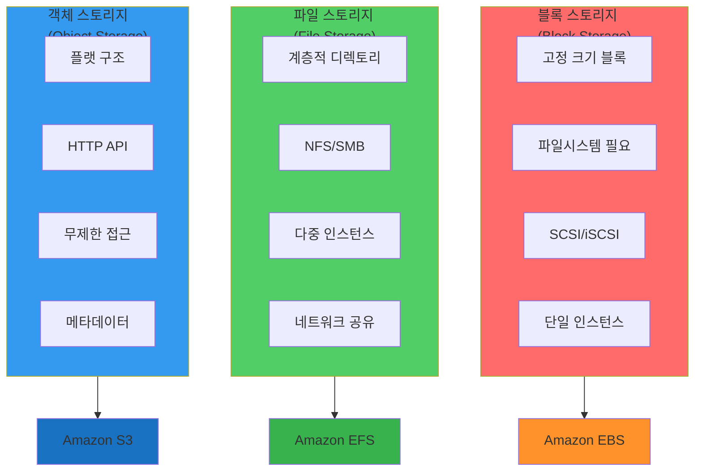
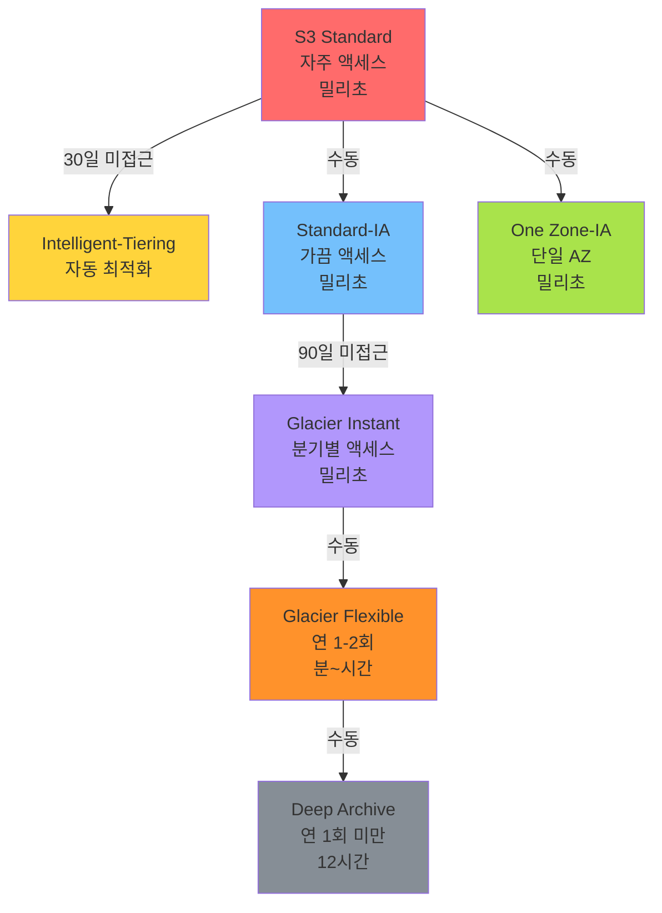
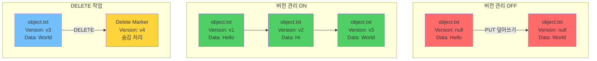
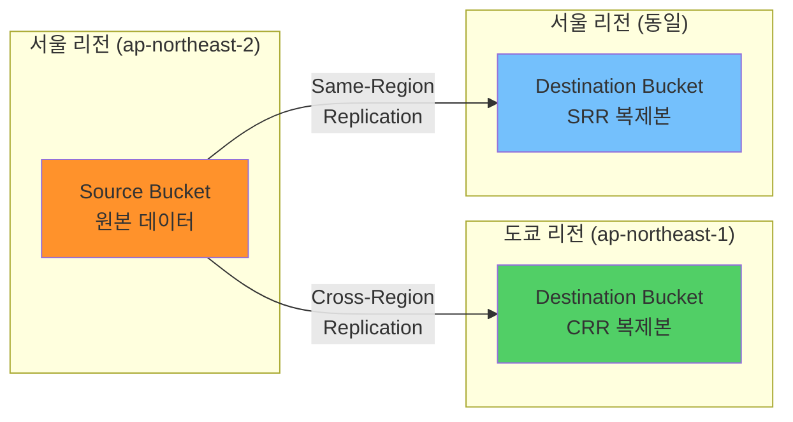

## 전체 흐름 요약

이번 학습에서는 AWS의 다양한 **스토리지 서비스**를 이해하고, 각 스토리지 타입의 특성과 적합한 사용 사례를 파악합니다. 블록(Block), 파일(File), 객체(Object) 스토리지의 차이를 명확히 이해하고, AWS가 제공하는 S3, EBS, EFS 서비스의 핵심 기능을 학습합니다.

**Part 1 - 스토리지 타입 이해**에서는 블록, 파일, 객체 스토리지의 근본적인 차이와 각 타입이 해결하는 문제를 학습합니다. 데이터 접근 방식, I/O 패턴, 메타데이터 관리 방법의 차이를 이해하고, 어떤 상황에서 어떤 스토리지를 선택해야 하는지 판단 기준을 세웁니다.

**Part 2 - Amazon S3 기본**에서는 AWS의 대표적인 객체 스토리지 서비스인 S3의 기본 개념을 학습합니다. 버킷과 객체의 관계, S3 URI 및 URL 구조, 리전별 버킷 생성 원칙을 이해합니다. S3의 무제한 저장 용량과 11 9's(99.999999999%)의 내구성이 어떻게 구현되는지 학습합니다.

**Part 3 - S3 스토리지 클래스**에서는 데이터 액세스 패턴에 따라 비용을 최적화할 수 있는 다양한 스토리지 클래스를 학습합니다. Standard, Intelligent-Tiering, Standard-IA, One Zone-IA, Glacier, Deep Archive 등 각 클래스의 특징과 사용 시나리오를 비교합니다. Lifecycle Policy를 통한 자동 티어 전환 방법도 다룹니다.

**Part 4 - S3 접근 제어**에서는 S3의 강력한 보안 기능을 학습합니다. 기본 비공개 원칙, IAM 사용자 정책, 버킷 정책, ACL의 차이와 우선순위를 이해합니다. 퍼블릭 액세스 차단, Pre-signed URL을 통한 임시 접근 권한 부여 방법을 학습합니다.

**Part 5 - S3 데이터 보호**에서는 데이터의 안전한 저장과 복구를 위한 기능들을 학습합니다. 서버 측 암호화(SSE-S3, SSE-KMS, SSE-C), 버전 관리를 통한 실수 방지, MFA Delete로 중요 데이터 보호, 복제(CRR, SRR)를 통한 재해 복구 전략을 다룹니다.

**Part 6 - S3 고급 기능**에서는 S3의 추가 기능들을 학습합니다. 정적 웹사이트 호스팅, S3 Transfer Acceleration을 통한 빠른 업로드, S3 Select로 대용량 데이터 필터링, 이벤트 알림을 통한 자동화 구축 방법을 이해합니다.

**Part 7 - EFS와 데이터 전송 서비스**에서는 여러 EC2 인스턴스가 동시에 접근 가능한 파일 스토리지 EFS를 학습합니다. NFS 프로토콜 기반의 EFS 특징과 사용 사례를 이해하고, Storage Gateway와 Transfer Family를 통한 하이브리드 클라우드 데이터 연동 방법을 학습합니다.

모든 내용은 개념 위주로 구성되며, 각 서비스의 특징과 사용 시나리오를 명확히 이해하여 실제 업무에 적용할 수 있는 능력을 기릅니다.

---

## 주요 개념 요약표

| 구분 | 블록 스토리지 (EBS) | 파일 스토리지 (EFS) | 객체 스토리지 (S3) |
|------|-------------------|-------------------|-------------------|
| **데이터 단위** | Block (섹터) | File (파일/디렉토리) | Object (파일+메타데이터) |
| **접근 방식** | 블록 I/O (SCSI) | 파일 I/O (NFS, CIFS) | HTTP API (REST) |
| **마운트 방식** | 파일시스템 필요 | 직접 마운트 가능 | API 호출 |
| **동시 접근** | 단일 인스턴스 | 다중 인스턴스 | 무제한 |
| **용량 확장** | 수동 크기 조정 | 자동 확장 | 무제한 자동 확장 |
| **성능** | 매우 빠름 (밀리초) | 빠름 (밀리초~초) | 보통 (초) |
| **사용 사례** | OS, 데이터베이스 | 공유 파일 시스템 | 백업, 아카이브, 정적 콘텐츠 |
| **가격** | GB/월 | GB/월 | GB/월 + 요청 수 |
| **내구성** | 4 9's | 11 9's | 11 9's |

---

## Part 1: 스토리지 타입 이해

### 1.1. 스토리지 분류

클라우드 스토리지는 데이터를 저장하고 관리하는 방식에 따라 세 가지 타입으로 분류됩니다.

**스토리지 타입 비교:**



#### 블록 스토리지 (Block Storage)

```
┌──────────────────┐
│       OS         │
├──────────────────┤
│  File System     │ ← mount 필요
├──────────────────┤
│  Block I/O       │ ← SCSI, iSCSI, Fiber Channel
├──────────────────┤
│  Block Storage   │
│  [■][■][■][■]   │ ← 고정 크기 블록
└──────────────────┘

특징:
- 고정 크기 블록으로 데이터 저장
- 파일 시스템 구축 필요
- 매우 빠른 I/O 성능
- 단일 인스턴스 연결

사용 사례:
- 루트 및 APP data 볼륨
- 데이터베이스 (MySQL, Oracle 등)
- 트랜잭션 처리 시스템

AWS 서비스: Amazon EBS
```

**블록 스토리지의 장점:**
- 낮은 지연 시간 (Low Latency)
- 빠른 랜덤 액세스
- 데이터베이스 워크로드에 최적화

**블록 스토리지의 제약:**
- 하나의 인스턴스만 연결 가능 (Multi-Attach 제외)
- 파일 시스템 관리 필요
- 용량 확장 시 수동 작업 필요

---

#### 파일 스토리지 (File Storage)

```
┌──────────────────┐
│    OS (Client)   │
├──────────────────┤
│     mount        │ ← 네트워크 마운트
├──────────────────┤
│  File I/O        │ ← NFS, CIFS/SMB
├──────────────────┤
│      NAS         │
├──────────────────┤
│  Block Storage   │
│  [■][■][■][■]   │
└──────────────────┘

특징:
- 계층적 디렉토리 구조
- 네트워크를 통한 파일 공유
- 여러 클라이언트 동시 접근
- POSIX 호환

사용 사례:
- NAS, 원도우 파일서버
- 공유 디렉토리, 홈 디렉토리
- 콘텐츠 관리, APP 소스 등

AWS 서비스: 
- Amazon EFS (Linux용)
- Amazon FSx for Windows File Server
```

**파일 스토리지의 장점:**
- 여러 서버에서 동시 접근
- 친숙한 파일 시스템 인터페이스
- 권한 관리 용이 (chmod, chown)

**파일 스토리지의 특징:**
- 네트워크 기반이라 블록보다 느림
- 공유 스토리지로 협업에 적합
- 자동 용량 확장 (EFS의 경우)

---

#### 객체 스토리지 (Object Storage)

```
┌──────────────────┐
│     Client       │
├──────────────────┤
│ API Request/     │ ← HTTP/HTTPS
│    Response      │
├──────────────────┤
│  API Handler     │ ← REST API
│    Mapping       │
├──────────────────┤
│  Object Storage  │
│ ┌──┐ ┌──┐ ┌──┐  │
│ │O │ │O │ │O │  │ ← Object (data + metadata)
│ └──┘ └──┘ └──┘  │
└──────────────────┘

특징:
- 플랫(Flat) 구조 (폴더 없음)
- 고유 ID로 객체 관리
- 메타데이터 풍부
- 무제한 확장 가능

사용 사례:
- 여러 요청을 동시 다발 처리(쓰기보다 읽기에 적합)
- 정적 데이터 보관, 백업데이터 저장용

AWS 서비스: Amazon S3
```

**객체 스토리지의 장점:**
- 무제한 확장성
- 11 9's 내구성
- HTTP API로 쉬운 접근
- 메타데이터 활용 가능

**객체 스토리지의 특징:**
- 파일 수정 불가 (덮어쓰기만 가능)
- 블록/파일보다 느린 I/O
- 저렴한 비용
- 버전 관리 내장

---

### 1.2. 스토리지 타입 비교

#### 접근 방식 비교

| 항목 | 블록 | 파일 | 객체 |
|------|------|------|------|
| **프로토콜** | SCSI, iSCSI | NFS, SMB | HTTP/HTTPS |
| **인터페이스** | 블록 디바이스 | 파일 시스템 | REST API |
| **경로 표기** | /dev/xvdf | /mnt/share/file.txt | s3://bucket/key |
| **권한 관리** | 볼륨 레벨 | 파일/디렉토리 레벨 | 객체 레벨 |

#### 성능 비교

```
처리 속도 (지연 시간):
블록 스토리지: 1ms 미만
파일 스토리지: 1~10ms
객체 스토리지: 100~1000ms

IOPS (초당 작업 수):
블록 스토리지: 최대 256,000 IOPS (io2 Block Express)
파일 스토리지: 수만 IOPS
객체 스토리지: 수천~수만 요청/초 (자동 스케일)
```

#### 비용 비교 (예시)

```
블록 (EBS gp3):
- $0.08/GB/월
- IOPS 추가 비용

파일 (EFS Standard):
- $0.30/GB/월
- 자동 확장

객체 (S3 Standard):
- $0.023/GB/월
- 요청당 추가 비용
```

---

### 1.3. 스토리지 선택 가이드

#### 워크로드별 추천

**데이터베이스:**
```
선택: 블록 스토리지 (EBS)

이유:
✓ 낮은 지연 시간 필요
✓ 빠른 랜덤 액세스
✓ 트랜잭션 일관성 중요

예: MySQL, PostgreSQL, Oracle
```

**공유 파일 시스템:**
```
선택: 파일 스토리지 (EFS)

이유:
✓ 여러 서버 동시 접근
✓ POSIX 호환 필요
✓ 표준 파일 API 사용

예: WordPress, Drupal, 공유 홈 디렉토리
```

**백업 및 아카이브:**
```
선택: 객체 스토리지 (S3)

이유:
✓ 저렴한 비용
✓ 무제한 용량
✓ 높은 내구성

예: 로그 아카이브, 백업 데이터
```

**정적 웹 콘텐츠:**
```
선택: 객체 스토리지 (S3)

이유:
✓ HTTP 직접 제공
✓ 높은 동시 접속 처리
✓ CloudFront 통합

예: 이미지, CSS, JavaScript
```

---

## Part 2: Amazon S3 기본

### 2.1. S3란?

**Amazon S3 (Simple Storage Service)**는 객체 기반 클라우드 스토리지 서비스로, 데이터 저장 및 관리에 특화되어 있습니다.

#### S3의 핵심 특징

**1. 무제한 저장 용량**
```
제한 없음:
- 버킷당 용량 제한 없음
- 계정당 버킷 수: 기본 100개 (확장 가능)
- 객체 크기: 0바이트 ~ 5TB

자동 확장:
- 용량 계획 불필요
- 사용한 만큼만 과금
```

**2. 뛰어난 내구성**
```
11 9's (99.999999999%) 내구성:
- 1,000만 개 객체 저장 시
- 10,000년에 1개 손실 가능
- 연간 손실률: 0.0000001%

구현 방식:
- 최소 3개 AZ에 데이터 복제
- 자동 체크섬 검증
- 손상 데이터 자동 복구
```

**3. 높은 가용성**
```
99.99% 가용성 (Standard):
- 연간 다운타임: 약 52분
- 여러 AZ 분산 저장
- 자동 페일오버
```

**4. 다양한 종류의 데이터 저장 가능**
```
지원 파일 타입:
- 텍스트: .txt, .csv, .json, .xml
- 이미지: .jpg, .png, .gif, .webp
- 동영상: .mp4, .avi, .mov
- 음성: .mp3, .wav, .flac
- 문서: .pdf, .docx, .pptx
- 압축: .zip, .tar, .gz
- 실행: .exe, .sh, .jar
- 기타: 모든 바이너리 데이터
```

---

### 2.2. S3 버킷과 객체

#### 버킷 (Bucket)

**버킷은 객체를 저장하는 최상위 컨테이너입니다.**

```
버킷의 특징:
- 전역적으로 고유한 이름 (전 세계에서 유일)
- 리전별로 생성 (데이터 위치 제어)
- 버킷 수: 계정당 100개 (기본값)
```

**버킷 이름 규칙:**
```
허용:
✓ 소문자 a-z
✓ 숫자 0-9
✓ 하이픈 -
✓ 3~63자 길이

금지:
✗ 대문자 (ABC)
✗ 언더스코어 (_)
✗ 연속된 점 (..)
✗ IP 주소 형식 (192.168.1.1)
✗ xn-- 으로 시작

예시:
올바른 이름: my-company-data, logs-2025, backup-bucket
잘못된 이름: MyBucket, test_bucket, test..bucket
```

**리전 선택 고려사항:**
```
1. 지연 시간:
   - 사용자와 가까운 리전 선택
   - 예: 한국 사용자 → ap-northeast-2 (서울)

2. 규정 준수:
   - 데이터 주권 법률 확인
   - 예: EU GDPR → EU 리전 사용

3. 비용:
   - 리전별 가격 차이 존재
   - 예: 버지니아(us-east-1)가 일반적으로 저렴

4. 서비스 가용성:
   - 일부 AWS 서비스는 특정 리전에서만 제공
```

---

#### 객체 (Object)

**객체는 S3에 저장되는 기본 단위입니다.**

```
객체 구성:
┌─────────────────────┐
│       Object        │
├─────────────────────┤
│  Key (식별자)        │ ← folder/file.txt
├─────────────────────┤
│  Data (실제 데이터)  │ ← 파일 내용
├─────────────────────┤
│  Metadata (메타정보) │ ← Content-Type 등
└─────────────────────┘
```

**객체 키 (Object Key):**
```
키는 버킷 내 객체의 고유 식별자:

예시:
- photos/2025/vacation.jpg
- logs/app-2025-01-01.log
- documents/report.pdf

특징:
- 슬래시(/)로 폴더 구조 시뮬레이션
- 실제로는 플랫(Flat) 구조
- 키 길이: 최대 1,024 bytes
- UTF-8 인코딩
```

**메타데이터:**
```
시스템 정의 메타데이터:
- Content-Type: 파일 MIME 타입
- Content-Length: 파일 크기
- Last-Modified: 마지막 수정 시간
- ETag: 객체 해시값

사용자 정의 메타데이터:
- x-amz-meta-author: "John Doe"
- x-amz-meta-project: "Website-Redesign"
- x-amz-meta-department: "Marketing"

활용:
- 검색 및 필터링
- 애플리케이션 로직
- 자동화 워크플로우
```

---

### 2.3. S3 URI와 URL

#### S3 URI 형식

**S3 URI는 버킷과 키로 객체 위치를 나타냅니다.**

```
형식:
s3://버킷이름/키

예시:
s3://test-bucket/folder/object.txt
     ↑           ↑
  버킷 이름      키 이름

구조 설명:
┌──────────┬───────────────────────────┐
│ s3://    │ test-bucket/folder/object.txt
│          │     ↑            ↑
│ 프로토콜  │  버킷 이름    객체 이름
└──────────┴───────────────────────────┘

버킷 이름과 키 이름으로 객체(데이터)의 위치를 나타냅니다
```

**AWS CLI에서 사용:**
```bash
# 객체 업로드
aws s3 cp myfile.txt s3://my-bucket/folder/myfile.txt

# 객체 다운로드
aws s3 cp s3://my-bucket/folder/myfile.txt ./

# 객체 복사
aws s3 cp s3://bucket-a/file.txt s3://bucket-b/file.txt

# 버킷 내용 조회
aws s3 ls s3://my-bucket/folder/
```

---

#### S3 URL 형식

**S3 URL은 HTTP/HTTPS를 통해 객체에 접근하는 경로입니다.**

```
형식:
https://버킷이름.s3.리전코드.amazonaws.com/객체키

예시:
https://bucketname.s3.regioncode.amazonaws.com/objectkey
        ↑              ↑                      ↑
   버킷 이름        리전 코드              객체 키

실제 예:
https://my-photos.s3.ap-northeast-2.amazonaws.com/vacation/beach.jpg
```

**URL 구조 상세:**
```
┌─────────────────────────────────────────────────────────┐
│ https://bucketname.s3.regioncode.amazonaws.com/objectkey│
│  ↑      ↑           ↑  ↑          ↑              ↑      │
│  │      │           │  │          │              │      │
│  │      │           │  │          │              └─ 객체 경로
│  │      │           │  │          └─ AWS 도메인     │
│  │      │           │  └─ 리전 코드                 │
│  │      │           └─ S3 서비스 지정               │
│  │      └─ 버킷 이름                                │
│  └─ 프로토콜                                        │
└─────────────────────────────────────────────────────────┘
```

**사용 사례:**
```
웹 브라우저 접근:
- 퍼블릭 객체는 URL로 직접 다운로드 가능
- 이미지, CSS, JS 파일 등 웹 리소스 호스팅

프로그래밍 접근:
- curl, wget 등 HTTP 클라이언트
- 웹 애플리케이션에서 리소스 참조
```

---

### 2.4. 파일 스토리지 vs 객체 스토리지

#### 개념적 차이

**파일 스토리지 (예: Windows 파일 서버):**
```
┌─────────────────────────┐
│  폴더 구조 (실제 존재)   │
├─────────────────────────┤
│  📁 Documents           │
│    📁 2025              │
│      📄 report.docx     │
│    📁 2024              │
│      📄 budget.xlsx     │
└─────────────────────────┘

특징:
- 물리적 폴더 구조
- 계층적 디렉토리
- 폴더 자체도 메타데이터 가짐
```

**객체 스토리지 (S3):**
```
┌─────────────────────────┐
│  플랫 구조 (ID로 관리)   │
├─────────────────────────┤
│ ID: Documents/2025/report.docx
│ ID: Documents/2024/budget.xlsx
│ ID: Photos/vacation.jpg
└─────────────────────────┘

특징:
- 플랫(Flat) 네임스페이스
- 폴더는 키의 일부 (시뮬레이션)
- ID(키)로만 데이터 관리
```

---

#### 콘솔 UI에서의 표현

**S3 콘솔은 사용자 편의를 위해 폴더처럼 보이게 표시:**

```
실제 데이터:
Key: "folder-a/file1.txt"  → 객체
Key: "folder-a/file2.txt"  → 객체
Key: "folder-b/data.json"  → 객체

콘솔 표시:
📁 folder-a/
  📄 file1.txt
  📄 file2.txt
📁 folder-b/
  📄 data.json

주의:
- 폴더 A, 폴더 B는 실제로 존재하지 않음
- 슬래시(/)로 구분된 키의 시각적 표현
- "빈 폴더" 생성 시 실제로는 키가 "folder-a/"인 
  크기 0 바이트 객체 생성
```

**API 관점:**
```python
# 실제로는 이렇게 동작:
import boto3

s3 = boto3.client('s3')

# "폴더" 생성 (실제로는 0바이트 객체)
s3.put_object(Bucket='my-bucket', Key='folder-a/')

# 파일 업로드 (폴더 없이도 가능)
s3.put_object(
    Bucket='my-bucket',
    Key='folder-a/file.txt',  # 폴더가 자동으로 "생성"된 것처럼 보임
    Body=b'Hello World'
)

# 폴더 내 파일 나열
response = s3.list_objects_v2(
    Bucket='my-bucket',
    Prefix='folder-a/'  # "폴더" 필터링
)
```

---

## Part 3: S3 스토리지 클래스

### 3.1. 스토리지 클래스 개요

S3는 데이터 액세스 패턴에 따라 비용을 최적화할 수 있는 다양한 스토리지 클래스를 제공합니다.

#### 스토리지 클래스 분류

**S3 스토리지 클래스 전환 흐름:**



```
┌─────────────────────────────────────────────────────┐
│              자주 액세스하는 데이터                  │
├─────────────────────────────────────────────────────┤
│  S3 Standard                                        │
│  - 밀리초 단위 액세스                                │
│  - 높은 처리량                                       │
│  - 가장 비싼 스토리지 비용                           │
└─────────────────────────────────────────────────────┘
                      ↓
┌─────────────────────────────────────────────────────┐
│            가끔 액세스하는 데이터                     │
├─────────────────────────────────────────────────────┤
│  S3 Intelligent-Tiering (자동 최적화)               │
│  S3 Standard-IA                                     │
│  S3 One Zone-IA                                     │
│  - 밀리초 단위 액세스                                │
│  - 검색 비용 추가                                    │
│  - 저렴한 스토리지 비용                              │
└─────────────────────────────────────────────────────┘
                      ↓
┌─────────────────────────────────────────────────────┐
│           거의 액세스하지 않는 데이터                 │
├─────────────────────────────────────────────────────┤
│  S3 Glacier Instant Retrieval                      │
│  - 밀리초 단위 액세스                                │
│  - 분기별 액세스                                     │
└─────────────────────────────────────────────────────┘
                      ↓
┌─────────────────────────────────────────────────────┐
│              아카이브 데이터                          │
├─────────────────────────────────────────────────────┤
│  S3 Glacier Flexible Retrieval                     │
│  - 분~시간 단위 액세스                               │
│  - 연 1-2회 액세스                                   │
│                                                     │
│  S3 Glacier Deep Archive                            │
│  - 12시간 단위 액세스                                │
│  - 연 1회 미만 액세스                                │
│  - 가장 저렴한 스토리지                              │
└─────────────────────────────────────────────────────┘
```

---

### 3.2. 주요 스토리지 클래스

#### S3 Standard

```
설명:
- 기본 스토리지 클래스
- 빈번한 액세스에 최적화

특징:
- 밀리초 단위 첫 바이트 지연 시간
- 99.99% 가용성
- 최소 3개 AZ에 데이터 저장

가격 (서울 리전):
- 저장: $0.025/GB/월
- GET 요청: $0.0004/1,000건
- PUT 요청: $0.005/1,000건

사용 사례:
- 활성 웹사이트 콘텐츠
- 모바일 앱 데이터
- 빅데이터 분석
- 콘텐츠 배포
```

---

#### S3 Intelligent-Tiering

```
설명:
- 액세스 패턴에 따라 자동으로 계층 이동
- ML 기반 자동 최적화

작동 방식:
┌──────────────────────────────────────────┐
│  Frequent Access Tier                    │
│  (접근 시 자동 이동)                      │
│  - Standard와 동일한 가격                │
└──────────────────────────────────────────┘
              ↓ 30일간 미접근
┌──────────────────────────────────────────┐
│  Infrequent Access Tier                  │
│  (자동 이동)                              │
│  - 40% 저렴                               │
└──────────────────────────────────────────┘
              ↓ 90일간 미접근
┌──────────────────────────────────────────┐
│  Archive Instant Access Tier             │
│  (옵션, 자동 이동)                        │
│  - 68% 저렴                               │
└──────────────────────────────────────────┘

추가 비용:
- 모니터링: $0.0025/1,000 객체/월
- 자동화: 무료

사용 사례:
- 예측 불가능한 액세스 패턴
- 수명이 긴 데이터
- 액세스 패턴 변경 가능 데이터
```

---

#### S3 Standard-IA (Infrequent Access)

```
설명:
- 자주 액세스하지 않지만 빠른 액세스 필요

특징:
- 밀리초 단위 액세스
- 99.9% 가용성
- 최소 3개 AZ 저장
- 최소 보관 기간: 30일
- 최소 객체 크기: 128KB

가격 (서울 리전):
- 저장: $0.0138/GB/월 (Standard 대비 45% 저렴)
- GET 요청: $0.001/1,000건
- PUT 요청: $0.01/1,000건
- 검색: $0.01/GB

비용 계산 예시:
1GB 파일, 월 1회 접근:
- 저장: $0.0138
- 검색: $0.01
- 합계: $0.0238

1GB 파일, 월 10회 접근:
- 저장: $0.0138
- 검색: $0.10
- 합계: $0.1138 (Standard보다 비쌈!)

사용 사례:
- 백업 데이터
- 재해 복구 파일
- 오래된 미디어 자산
- 월 1-2회 액세스하는 데이터
```

---

#### S3 One Zone-IA

```
설명:
- 단일 AZ에만 저장
- Standard-IA보다 20% 저렴

특징:
- 99.5% 가용성 (낮음)
- 단일 AZ 저장 (AZ 장애 시 데이터 손실)
- 밀리초 액세스
- 최소 보관 기간: 30일

가격:
- 저장: $0.011/GB/월

사용 사례:
- 재생 가능한 데이터
- 복사본이 있는 데이터
- 썸네일 이미지
- 트랜스코딩 결과물

주의사항:
⚠ 중요 데이터에는 사용 금지
⚠ AZ 장애 시 복구 불가능
```

---

#### S3 Glacier 클래스

**Glacier Instant Retrieval:**
```
설명:
- 분기별 액세스하는 아카이브
- 즉시 검색 가능

특징:
- 밀리초 액세스
- 최소 보관: 90일
- Standard-IA 대비 68% 저렴

가격:
- 저장: $0.004/GB/월
- 검색: $0.03/GB

사용 사례:
- 의료 영상 아카이브
- 뉴스 미디어 자산
- 분기별 액세스 데이터
```

**Glacier Flexible Retrieval:**
```
설명:
- 연 1-2회 액세스
- 검색 시간 선택 가능

검색 옵션:
1. Expedited: 1-5분 ($0.033/GB)
2. Standard: 3-5시간 ($0.011/GB)
3. Bulk: 5-12시간 ($0.0025/GB)

특징:
- 최소 보관: 90일
- Standard 대비 80% 저렴

가격:
- 저장: $0.004/GB/월

사용 사례:
- 규제 준수 아카이브
- 디지털 미디어 보관
- 오래된 로그 파일
```

**Deep Archive:**
```
설명:
- 가장 저렴한 스토리지
- 장기 보관용

검색 옵션:
1. Standard: 12시간 ($0.02/GB)
2. Bulk: 48시간 ($0.0025/GB)

특징:
- 최소 보관: 180일
- Standard 대비 95% 저렴

가격:
- 저장: $0.00099/GB/월 (~$1/TB/월)

사용 사례:
- 7-10년 보관 데이터
- 금융 규제 데이터
- 의료 기록
- 영구 아카이브
```

---

### 3.3. Lifecycle Policy (수명 주기 정책)

**Lifecycle Policy는 객체를 자동으로 다른 스토리지 클래스로 전환하거나 삭제하는 규칙입니다.**

#### Lifecycle 규칙 예시

```
시나리오: 로그 파일 관리

Day 0: S3 Standard
  ↓ (업로드)
  
Day 30: S3 Standard-IA로 전환
  ↓ (30일 경과)
  
Day 90: Glacier Flexible Retrieval로 전환
  ↓ (90일 경과)
  
Day 365: 객체 삭제
  ↓ (1년 경과)
```

**규칙 설정 예시:**
```json
{
  "Rules": [
    {
      "Id": "LogArchiving",
      "Status": "Enabled",
      "Filter": {
        "Prefix": "logs/"
      },
      "Transitions": [
        {
          "Days": 30,
          "StorageClass": "STANDARD_IA"
        },
        {
          "Days": 90,
          "StorageClass": "GLACIER"
        }
      ],
      "Expiration": {
        "Days": 365
      }
    }
  ]
}
```

**사용 사례:**
```
1. 로그 관리:
   30일: Standard → Standard-IA
   90일: Standard-IA → Glacier
   1년: 삭제

2. 백업 데이터:
   즉시: Standard → Glacier Instant Retrieval
   90일: Glacier IR → Deep Archive

3. 미디어 콘텐츠:
   7일: Standard → Intelligent-Tiering
   (자동 최적화)
```

---

## Part 4: S3 접근 제어

### 4.1. S3 보안 원칙

**S3의 기본 원칙: 모든 버킷과 객체는 기본적으로 비공개(Private)입니다.**

```
┌────────────────────────────────┐
│         보안 주체               │
│      (누가 접근하는가?)         │
├────────────────────────────────┤
│  - IAM 사용자                  │
│  - IAM 역할                    │
│  - AWS 계정                    │
│  - 익명 사용자 (Public)         │
└────────────────────────────────┘
           ↓
┌────────────────────────────────┐
│        접근 제어 메커니즘       │
│      (어떻게 허용하는가?)       │
├────────────────────────────────┤
│  1. IAM 정책                   │
│  2. 버킷 정책                   │
│  3. ACL (Access Control List)  │
│  4. 퍼블릭 액세스 차단 설정     │
└────────────────────────────────┘
           ↓
┌────────────────────────────────┐
│           리소스               │
│       (무엇에 접근하는가?)      │
├────────────────────────────────┤
│  - 버킷                        │
│  - 객체                        │
└────────────────────────────────┘
```

---

### 4.2. S3 접근 제어 방법

#### 1. 사용자 정책 (IAM Policy)

**IAM 사용자, 역할에 부여된 권한을 통해 접근 제어**

```
특징:
- AWS 보안 주체(IAM 사용자/역할)에게 권한 부여
- "이 사용자가 어떤 S3 버킷에 접근할 수 있는가?"

예시 정책:
{
  "Version": "2012-10-17",
  "Statement": [
    {
      "Effect": "Allow",
      "Action": [
        "s3:GetObject",
        "s3:PutObject"
      ],
      "Resource": "arn:aws:s3:::my-bucket/*"
    },
    {
      "Effect": "Allow",
      "Action": "s3:ListBucket",
      "Resource": "arn:aws:s3:::my-bucket"
    }
  ]
}

사용 사례:
- 개발자에게 특정 버킷 접근 권한 부여
- EC2 인스턴스(IAM 역할)에 S3 접근 권한
- Lambda 함수가 S3 읽기/쓰기
```

---

#### 2. 버킷 정책 (Bucket Policy)

**버킷 리소스에 직접 적용되는 접근 정책**

```
특징:
- 버킷에 연결된 정책
- "누가 이 버킷에 접근할 수 있는가?"
- 크로스 계정 접근 가능
- 퍼블릭 액세스 설정 가능

예시 정책:
{
  "Version": "2012-10-17",
  "Statement": [
    {
      "Sid": "PublicReadGetObject",
      "Effect": "Allow",
      "Principal": "*",
      "Action": "s3:GetObject",
      "Resource": "arn:aws:s3:::my-public-bucket/*"
    }
  ]
}

Principal 설명:
- "*": 모든 사용자 (퍼블릭)
- "AWS": "arn:aws:iam::123456789012:user/Alice"
  → 특정 IAM 사용자
- "AWS": "123456789012"
  → 특정 AWS 계정

사용 사례:
- 정적 웹사이트 호스팅 (퍼블릭 읽기)
- 다른 AWS 계정과 버킷 공유
- 특정 IP에서만 접근 허용
- VPC 엔드포인트에서만 접근
```

---

#### 3. ACL (Access Control List)

**객체 또는 버킷 단위로 접근 제어**

```
특징:
- 레거시 방식 (권장하지 않음)
- 객체별 세밀한 제어
- 단순한 권한만 부여 가능

권한 종류:
- READ: 객체 읽기, 버킷 객체 목록 조회
- WRITE: 버킷에 객체 쓰기
- READ_ACP: ACL 읽기
- WRITE_ACP: ACL 쓰기
- FULL_CONTROL: 모든 권한

그룹:
- All Users: 모든 사용자 (퍼블릭)
- Authenticated Users: AWS 계정 소유자
- Log Delivery: S3 로그 배포 그룹

권장사항:
⚠ 신규 프로젝트에서는 버킷 정책 사용 권장
⚠ ACL은 하위 호환성을 위해 유지
```

---

### 4.3. 접근 제어 우선순위

**여러 정책이 충돌할 때 평가 순서:**

```
1단계: 명시적 거부 확인
   ↓
  Deny가 있는가? → Yes → 접근 거부 ❌
   ↓ No
   
2단계: 명시적 허용 확인
   ↓
  Allow가 있는가? → Yes → 접근 허용 ✅
   ↓ No
   
3단계: 기본 거부
   ↓
  접근 거부 ❌ (기본값)
```

**정책 평가 순서:**
```
1. IAM 사용자 정책
2. 버킷 정책
3. ACL

예시:
- IAM 정책: Allow s3:GetObject
- 버킷 정책: Deny from IP 1.2.3.4
- ACL: Allow

→ 결과: 1.2.3.4에서 접근 시 거부 (Deny 우선)
→ 다른 IP에서 접근 시 허용
```

---

### 4.4. 퍼블릭 액세스 차단

**S3는 실수로 데이터가 공개되는 것을 방지하기 위한 추가 보안 계층을 제공합니다.**

```
설정 항목:

1. BlockPublicAcls
   - 새로운 퍼블릭 ACL 차단
   - 기존 객체 업로드 시 퍼블릭 ACL 불가

2. IgnorePublicAcls
   - 기존 퍼블릭 ACL 무시
   - ACL은 유지되지만 효과 없음

3. BlockPublicPolicy
   - 새로운 퍼블릭 버킷 정책 차단

4. RestrictPublicBuckets
   - 퍼블릭 버킷 정책이 있어도
   - AWS 계정 및 서비스만 접근 가능

기본 설정:
- 신규 버킷: 모두 활성화 ✅
- 기존 버킷: 계정 생성 시기에 따라 다름

권장사항:
⚠ 정적 웹사이트 호스팅 등 명확한 이유가 없으면
  모든 차단 설정 활성화 유지
```

**계정 레벨 설정:**
```
S3 콘솔 → Block Public Access settings for this account

- 전체 계정의 모든 버킷에 적용
- 버킷 레벨 설정보다 우선
- 조직 전체 보안 정책 시행 시 유용
```

---

### 4.5. Pre-signed URL

**Pre-signed URL은 임시로 객체에 접근할 수 있는 URL을 생성합니다.**

```
작동 방식:
1. IAM 자격 증명으로 URL 서명
2. 만료 시간 설정 (최대 7일)
3. URL 공유
4. 받은 사람은 AWS 자격 증명 없이 접근

생성 예시 (AWS CLI):
aws s3 presign s3://my-bucket/private-file.pdf \
    --expires-in 3600

결과:
https://my-bucket.s3.amazonaws.com/private-file.pdf?
X-Amz-Algorithm=AWS4-HMAC-SHA256&
X-Amz-Credential=...&
X-Amz-Date=20250109T120000Z&
X-Amz-Expires=3600&
X-Amz-SignedHeaders=host&
X-Amz-Signature=...

사용 사례:
- 로그인한 사용자에게 다운로드 링크 제공
- 파일 업로드 링크 제공
- 임시 파일 공유
- 프리미엄 콘텐츠 접근

장점:
✓ AWS 자격 증명 노출 없음
✓ 시간 제한 가능
✓ 특정 작업만 허용 (GET, PUT 등)
```

---

## Part 5: S3 데이터 보호

### 5.1. 데이터 암호화

S3는 저장 중인 데이터와 전송 중인 데이터를 보호하기 위한 다양한 암호화 옵션을 제공합니다.

#### 전송 중 암호화 (Encryption in Transit)

```
HTTPS (TLS) 사용:
- 모든 S3 API 호출은 HTTPS 지원
- 기본적으로 암호화된 연결 사용 권장

강제 설정:
버킷 정책에서 HTTP 요청 거부:
{
  "Effect": "Deny",
  "Principal": "*",
  "Action": "s3:*",
  "Resource": "arn:aws:s3:::my-bucket/*",
  "Condition": {
    "Bool": {
      "aws:SecureTransport": "false"
    }
  }
}
```

---

#### 저장 데이터 암호화 (Encryption at Rest)

**서버 측 암호화 (Server-Side Encryption, SSE):**

```
1. SSE-S3 (S3 Managed Keys):
   ┌──────────┐
   │  데이터   │ + 키 데이터
   └──────────┘    ↓
        ↓        암호화
   ┌──────────┐
   │ 암호화    │
   │  데이터   │
   └──────────┘
   
   특징:
   - S3가 키 관리
   - AES-256 암호화
   - 가장 간단
   - 추가 비용 없음
   - 기본 암호화로 설정 가능

   활성화:
   PUT 요청 헤더에 포함:
   x-amz-server-side-encryption: AES256

2. SSE-KMS (KMS Managed Keys):
   ┌──────────┐
   │  데이터   │
   └──────────┘
        ↓
   ┌──────────┐
   │   KMS    │ ← Data Key 생성
   └──────────┘
        ↓
   ┌──────────┐
   │ 암호화    │ ← 암호화된 Data Key 저장
   │  데이터   │
   └──────────┘
   
   특징:
   - AWS KMS로 키 관리
   - 키 사용 감사 가능 (CloudTrail)
   - 키 교체 정책 설정
   - 추가 비용 발생 (KMS 요청당)
   - 세밀한 권한 제어
   
   암호화 방식:
   - 암호화 키방식: 키를 관리하는 방식의 총칭
   - 암호화 주제: 키를 소유하는 주체
   - 암호화 키관리: 키를 관리하는 방식
   
   활성화:
   x-amz-server-side-encryption: aws:kms
   x-amz-server-side-encryption-aws-kms-key-id: key-id

3. SSE-C (Customer-Provided Keys):
   ┌──────────┐
   │  데이터   │ + 고객이 제공한 키
   └──────────┘    ↓
        ↓        암호화
   ┌──────────┐
   │ 암호화    │ (키는 저장하지 않음)
   │  데이터   │
   └──────────┘
   
   특징:
   - 고객이 키 관리
   - AWS는 키를 저장하지 않음
   - 모든 요청에 키 제공 필요
   - HTTPS 필수
   
   사용법:
   - 요청 시마다 키를 헤더에 포함
   - x-amz-server-side-encryption-customer-algorithm
   - x-amz-server-side-encryption-customer-key
   - x-amz-server-side-encryption-customer-key-MD5
```

**클라이언트 측 암호화:**
```
업로드 전 암호화:
1. 클라이언트가 로컬에서 데이터 암호화
2. 암호화된 데이터를 S3에 업로드
3. S3는 암호화된 데이터만 저장

특징:
- 가장 강력한 보안
- AWS는 암호화 키를 전혀 모름
- 애플리케이션 복잡도 증가

라이브러리:
- AWS Encryption SDK
- S3 Encryption Client
```

---

#### 버킷 단위 암호화 설정

```
Default Encryption 설정:
- 버킷 속성에서 기본 암호화 활성화
- 암호화 헤더 없이 업로드해도 자동 암호화
- SSE-S3 또는 SSE-KMS 선택 가능

예시:
┌─────────────────────────────────┐
│ Default encryption              │
├─────────────────────────────────┤
│ ○ SSE-S3                        │
│   (Amazon S3 managed keys)      │
│                                 │
│ ● SSE-KMS                       │
│   (AWS Key Management Service)  │
│   - KMS Key: [선택]             │
│   - Bucket Key: [활성화]        │
└─────────────────────────────────┘

Bucket Key (S3 Bucket Key):
- KMS 요청 횟수 99% 감소
- 비용 절감
- 성능 향상
```

---

### 5.2. 버전 관리 (Versioning)

**S3 버전 관리는 객체의 모든 버전을 보존하여 실수로 삭제하거나 덮어쓴 데이터를 복구할 수 있습니다.**

#### 버전 관리 작동 방식

**버전 관리 흐름:**



```
버전 관리 OFF 상태:
┌─────────────────────────┐
│ Key=object.txt          │
│ Data: "Hello"           │
│ Version: null           │
└─────────────────────────┘
   ↓ PUT (덮어쓰기)
┌─────────────────────────┐
│ Key=object.txt          │
│ Data: "World"           │
│ Version: null           │
└─────────────────────────┘
→ 이전 데이터 영구 손실

버전 관리 ON 상태:
┌─────────────────────────┐
│ Key=object.txt          │
│ Data: "Hello"           │
│ Version: vyyy2          │ ← 최신 버전
└─────────────────────────┘
   ↑
┌─────────────────────────┐
│ Key=object.txt          │
│ Data: "Hi"              │
│ Version: vxxx1          │ ← 이전 버전
└─────────────────────────┘
→ 모든 버전 보존
```

#### 버전 관리 상태

```
3가지 상태:

1. Unversioned (기본값):
   - 버전 관리 비활성화
   - 버전 ID = null

2. Enabled:
   - 버전 관리 활성화
   - 각 객체에 고유 버전 ID 부여
   - 삭제 시 Delete Marker 생성

3. Suspended:
   - 버전 관리 일시 중지
   - 기존 버전 유지
   - 새 업로드는 버전 ID = null
```

---

#### 버전 삭제 동작

```
DELETE 요청 (버전 ID 지정 안 함):
┌─────────────────────────┐
│ Key=object.txt          │
│ Delete Marker           │ ← 삭제 마커 생성
│ Version: zzz3           │
└─────────────────────────┘
   ↑ (숨김 처리)
┌─────────────────────────┐
│ Key=object.txt          │
│ Data: "World"           │
│ Version: yyy2           │
└─────────────────────────┘
   ↑ (계속 존재)
┌─────────────────────────┐
│ Key=object.txt          │
│ Data: "Hello"           │
│ Version: xxx1           │
└─────────────────────────┘

GET 요청 시:
- 404 Not Found 반환
- 실제 데이터는 여전히 존재

Delete Marker 삭제 시:
- 객체 복원 (이전 버전 모두 삭제)
- 데이터를 완전히 삭제하려면
  각 버전을 개별적으로 삭제해야 함
```

---

#### 버전 관리 비용

```
스토리지 비용:
- 모든 버전이 스토리지를 차지
- 100MB 파일을 10번 수정 → 1GB 비용

예시:
파일: report.pdf (10MB)
수정 횟수: 100회
월 스토리지 비용:
10MB × 100 버전 = 1GB = $0.023

비용 절감 전략:
1. Lifecycle Policy로 오래된 버전 삭제
2. 중요 파일만 버전 관리
3. Intelligent-Tiering으로 오래된 버전 아카이브
```

---

### 5.3. MFA Delete

**MFA Delete는 중요한 데이터 삭제 시 추가 인증을 요구합니다.**

```
설정 조건:
- 버전 관리 활성화 필수
- 버킷 소유자만 설정 가능
- AWS CLI 또는 SDK로만 설정 (콘솔 불가)

보호 작업:
1. 객체 버전 영구 삭제
2. 버전 관리 상태 변경

설정 예시 (AWS CLI):
aws s3api put-bucket-versioning \
    --bucket my-bucket \
    --versioning-configuration \
    Status=Enabled,MFADelete=Enabled \
    --mfa "arn:aws:iam::123456789012:mfa/user 123456"

삭제 시:
aws s3api delete-object \
    --bucket my-bucket \
    --key important-file.pdf \
    --version-id abc123 \
    --mfa "serial-number mfa-code"

사용 사례:
- 금융 데이터
- 법적 기록
- 백업 데이터
- 규제 준수 데이터
```

---

### 5.4. 복제 (Replication)

**S3 복제는 버킷 간 객체를 자동으로 복사합니다.**

#### 복제 종류

**S3 복제 아키텍처:**



**CRR (Cross-Region Replication):**
```
다른 리전으로 복제:

Source Bucket (서울)
    ↓ 자동 복제
Destination Bucket (도쿄)

사용 사례:
- 재해 복구 (DR)
- 지연 시간 최소화
- 규정 준수 (데이터 지역 요구사항)

예시:
원본: s3://kr-data (ap-northeast-2)
  → 복제본: s3://jp-backup (ap-northeast-1)
```

**SRR (Same-Region Replication):**
```
동일 리전 내 복제:

Source Bucket
    ↓ 자동 복제
Destination Bucket (같은 리전)

사용 사례:
- 프로덕션/개발 계정 간 데이터 동기화
- 로그 집계
- 규정 준수 (데이터 사본 유지)
```

---

#### 복제 설정

```
필수 조건:
1. 원본 버킷: 버전 관리 활성화
2. 대상 버킷: 버전 관리 활성화
3. IAM 역할: S3 복제 권한 필요

설정 항목:
- 복제할 객체: 전체 또는 Prefix 필터
- 스토리지 클래스: 변경 가능
- 암호화: 원본과 동일 또는 변경
- 소유권: 원본 계정 유지 또는 대상 계정으로 이전

복제 시점:
- 설정 후 업로드된 객체만 복제
- 기존 객체는 S3 Batch Replication 사용

복제 시간:
- 대부분 15분 이내
- S3 RTC (Replication Time Control): 99.99% 15분 이내 보장
```

**복제 예시 (JSON):**
```json
{
  "Role": "arn:aws:iam::123456789012:role/S3ReplicationRole",
  "Rules": [
    {
      "Status": "Enabled",
      "Priority": 1,
      "Filter": {
        "Prefix": "documents/"
      },
      "Destination": {
        "Bucket": "arn:aws:s3:::backup-bucket",
        "StorageClass": "GLACIER"
      }
    }
  ]
}
```

---

## Part 6: S3 고급 기능

### 6.1. 정적 웹사이트 호스팅

**S3는 HTML, CSS, JavaScript 등 정적 콘텐츠를 웹사이트로 호스팅할 수 있습니다.**

#### 설정 방법

```
1. 버킷 생성:
   - 버킷 이름: 도메인과 동일 (선택사항)
   - 예: www.example.com

2. 정적 웹사이트 호스팅 활성화:
   Properties → Static website hosting → Enable
   - Index document: index.html
   - Error document: error.html (선택)

3. 퍼블릭 액세스 허용:
   - Block Public Access: 비활성화
   - 버킷 정책: 퍼블릭 읽기 허용

4. 파일 업로드:
   - index.html, style.css, script.js 등

5. 웹사이트 URL:
   http://bucket-name.s3-website-region.amazonaws.com
```

**버킷 정책 예시:**
```json
{
  "Version": "2012-10-17",
  "Statement": [
    {
      "Sid": "PublicReadGetObject",
      "Effect": "Allow",
      "Principal": "*",
      "Action": "s3:GetObject",
      "Resource": "arn:aws:s3:::my-website-bucket/*"
    }
  ]
}
```

---

#### 사용 사례

```
적합한 사례:
✓ 개인 블로그
✓ 포트폴리오 사이트
✓ 제품 랜딩 페이지
✓ 문서 사이트
✓ 단일 페이지 애플리케이션 (SPA)

부적합한 사례:
✗ 서버 측 코드 실행 (PHP, Python 등)
✗ 데이터베이스 연동
✗ 사용자 인증
✗ 동적 콘텐츠 생성

해결 방법:
- API는 Lambda + API Gateway
- 인증은 Cognito
- 동적 부분은 JavaScript로 클라이언트에서 처리
```

---

#### CloudFront와 통합

```
S3 단독 사용:
s3-website 엔드포인트로 직접 접근
- HTTPS 지원 안 됨
- 속도 제한
- 커스텀 도메인 어려움

CloudFront 통합:
CloudFront → S3 버킷
- HTTPS 지원
- 전 세계 CDN 캐싱
- 커스텀 도메인 + SSL 인증서
- DDoS 보호
- 액세스 로그

권장 아키텍처:
사용자 → Route 53 (www.example.com)
         ↓
     CloudFront (CDN)
         ↓
   S3 Bucket (Origin)
```

---

### 6.2. S3 Transfer Acceleration

**S3 Transfer Acceleration은 CloudFront의 엣지 로케이션을 활용하여 빠른 업로드를 제공합니다.**

```
일반 업로드:
사용자 (서울) → 인터넷 → S3 (버지니아)
- 공용 인터넷 경로
- 느린 속도
- 패킷 손실 가능

Transfer Acceleration:
사용자 (서울) → 엣지 로케이션 (도쿄)
                  ↓ AWS 백본 네트워크
                S3 (버지니아)
- AWS 전용 네트워크
- 최적화된 경로
- 빠른 속도

성능 향상:
- 50~500% 빠른 업로드
- 지리적 거리가 멀수록 효과 큼

활성화 방법:
1. 버킷 속성에서 Transfer Acceleration 활성화
2. 엔드포인트 변경:
   일반: my-bucket.s3.amazonaws.com
   가속: my-bucket.s3-accelerate.amazonaws.com

비용:
- 표준 전송 대비 추가 비용 발생
- GB당 $0.04 (ap-northeast-2 → us-east-1)
```

---

### 6.3. S3 Select

**S3 Select는 객체 전체를 다운로드하지 않고 SQL로 필요한 데이터만 추출합니다.**

```
일반 방식:
1. 10GB CSV 파일 다운로드
2. 로컬에서 필터링
3. 100MB 데이터만 사용

→ 10GB 전송 비용 + 시간 소요

S3 Select:
1. SQL 쿼리 전송
2. S3에서 필터링 수행
3. 100MB 결과만 반환

→ 100MB 전송 비용 + 80% 빠른 속도
```

**지원 형식:**
- CSV
- JSON
- Apache Parquet
- GZIP, BZIP2 압축 파일

**쿼리 예시:**
```python
import boto3

s3 = boto3.client('s3')

response = s3.select_object_content(
    Bucket='my-bucket',
    Key='data.csv',
    ExpressionType='SQL',
    Expression="""
        SELECT * FROM s3object s
        WHERE s.age > 30 AND s.country = 'Korea'
    """,
    InputSerialization={
        'CSV': {"FileHeaderInfo": "Use"},
        'CompressionType': 'GZIP'
    },
    OutputSerialization={'CSV': {}}
)

# 스트리밍 결과 처리
for event in response['Payload']:
    if 'Records' in event:
        print(event['Records']['Payload'].decode())
```

**사용 사례:**
- 대용량 로그 분석
- 데이터 레이크 쿼리
- 서버리스 데이터 처리
- 비용 절감

---

### 6.4. S3 이벤트 알림

**S3 이벤트 알림은 버킷에서 발생하는 이벤트를 다른 AWS 서비스로 전송합니다.**

#### 지원 이벤트

```
객체 생성:
- s3:ObjectCreated:*
- s3:ObjectCreated:Put
- s3:ObjectCreated:Post
- s3:ObjectCreated:Copy

객체 삭제:
- s3:ObjectRemoved:*
- s3:ObjectRemoved:Delete
- s3:ObjectRemoved:DeleteMarkerCreated

기타:
- s3:ObjectRestore:Post (Glacier 복원 시작)
- s3:ObjectRestore:Completed (복원 완료)
- s3:Replication:*
```

---

#### 알림 대상

```
1. SNS (Simple Notification Service):
   S3 → SNS Topic → 이메일/SMS/Lambda 등
   
   사용 사례:
   - 관리자에게 업로드 알림
   - 여러 구독자에게 팬아웃

2. SQS (Simple Queue Service):
   S3 → SQS Queue → Worker 처리
   
   사용 사례:
   - 비동기 처리 큐
   - 배치 작업 트리거

3. Lambda:
   S3 → Lambda 함수 직접 실행
   
   사용 사례:
   - 이미지 썸네일 생성
   - 파일 형식 변환
   - 메타데이터 추출
```

**설정 예시:**
```json
{
  "LambdaFunctionConfigurations": [
    {
      "LambdaFunctionArn": "arn:aws:lambda:region:account:function:thumbnail",
      "Events": ["s3:ObjectCreated:*"],
      "Filter": {
        "Key": {
          "FilterRules": [
            {
              "Name": "prefix",
              "Value": "images/"
            },
            {
              "Name": "suffix",
              "Value": ".jpg"
            }
          ]
        }
      }
    }
  ]
}
```

**실전 예시:**
```
이미지 처리 파이프라인:

사용자 → S3 (원본) → Lambda (썸네일 생성)
                         ↓
                    S3 (썸네일)
                         ↓
                    DynamoDB (메타데이터)
```

---

## Part 7: EFS와 데이터 전송 서비스

### 7.1. Amazon EFS

**Amazon EFS (Elastic File System)**는 여러 EC2 인스턴스가 동시에 접근할 수 있는 완전 관리형 파일 스토리지입니다.

#### EFS 특징

```
1. 공유 파일 시스템:
   ┌──────────┐
   │  EC2-1   │ ─┐
   └──────────┘  │
                 ├→ EFS
   ┌──────────┐  │
   │  EC2-2   │ ─┤
   └──────────┘  │
                 │
   ┌──────────┐  │
   │  EC2-3   │ ─┘
   └──────────┘

2. 자동 확장:
   - 용량 계획 불필요
   - PB 단위까지 자동 확장
   - 사용한 만큼만 과금

3. NFS 프로토콜:
   - Linux 표준 파일 시스템
   - POSIX 호환
   - mount 명령으로 연결

4. 고가용성:
   - 여러 AZ에 데이터 저장
   - 단일 장애점 없음
```

---

#### EFS 퍼포먼스 모드

```
1. General Purpose (기본값):
   - 낮은 지연 시간
   - 대부분의 워크로드에 적합
   - 최대 7,000 IOPS

2. Max I/O:
   - 높은 처리량
   - 약간 높은 지연 시간
   - 수만 개 인스턴스 동시 연결
```

#### EFS 처리량 모드

```
1. Bursting (기본값):
   - 저장된 데이터 크기에 비례한 처리량
   - 1TB = 50 MiB/s 기준 처리량
   - 버스트: 최대 100 MiB/s

2. Provisioned:
   - 고정 처리량 예약
   - 저장 용량과 무관
   - 높은 처리량 필요 시 사용

3. Elastic (권장):
   - 워크로드에 따라 자동 조정
   - 최대 3 GiB/s 읽기, 1 GiB/s 쓰기
   - 가장 비용 효율적
```

---

#### EFS 스토리지 클래스

```
Standard:
- 자주 액세스하는 파일
- 밀리초 단위 지연 시간

Infrequent Access (IA):
- 30일간 미접근 시 자동 이동
- 90% 저렴한 스토리지 비용
- 액세스 시 검색 비용 발생

Lifecycle Management:
- 자동 티어 이동
- 비용 최적화
```

---

#### EFS vs EBS

| 항목 | EBS | EFS |
|------|-----|-----|
| **연결** | 단일 인스턴스 | 다중 인스턴스 |
| **AZ** | 단일 AZ | 다중 AZ |
| **프로토콜** | 블록 디바이스 | NFS |
| **용량** | 수동 확장 | 자동 확장 |
| **가격** | $0.08/GB/월 | $0.30/GB/월 |
| **사용 사례** | 데이터베이스 | 공유 파일 |

---

### 7.2. Storage Gateway

**AWS Storage Gateway는 온프레미스와 클라우드 스토리지를 연결하는 하이브리드 서비스입니다.**

#### Storage Gateway 종류

**1. S3 File Gateway:**
```
┌──────────────┐
│  온프레미스   │
│   서버        │
└──────────────┘
       ↓ NFS/SMB
┌──────────────┐
│ File Gateway │ ← 가상 어플라이언스
└──────────────┘
       ↓ HTTPS
┌──────────────┐
│      S3      │
└──────────────┘

특징:
- NFS 또는 SMB 파일 서버로 설치
- 파일을 S3 객체로 저장
- 로컬 캐시로 빠른 액세스

사용 사례:
- 파일 공유 및 백업
- 클라우드로 데이터 마이그레이션
```

**2. FSx File Gateway:**
```
온프레미스 → FSx File Gateway → FSx for Windows
- SMB 프로토콜
- Windows 파일 서버 대체
- Active Directory 통합
```

**3. Volume Gateway:**
```
온프레미스 → Volume Gateway → S3 (EBS 스냅샷)
- iSCSI 블록 스토리지
- 로컬 캐시 또는 전체 저장
- 재해 복구용
```

**4. Tape Gateway:**
```
온프레미스 → Tape Gateway → S3/Glacier
- 가상 테이프 라이브러리
- 백업 소프트웨어 통합
- 물리 테이프 대체
```

---

### 7.3. AWS Transfer Family

**Transfer Family는 FTP 프로토콜을 통해 S3 또는 EFS에 파일을 전송할 수 있는 관리형 서비스입니다.**

```
지원 프로토콜:
- SFTP (SSH File Transfer Protocol)
- FTPS (FTP over SSL)
- FTP (File Transfer Protocol)

아키텍처:
┌──────────────┐
│   클라이언트  │
│  FTP Client  │
└──────────────┘
       ↓ SFTP/FTPS/FTP
┌──────────────┐
│  Transfer    │
│   Family     │ ← 관리형 엔드포인트
└──────────────┘
       ↓
┌──────────────┐
│   S3 / EFS   │
└──────────────┘

특징:
- 완전 관리형
- 자동 확장
- 고가용성
- 사용자 인증 (IAM, Active Directory, 커스텀)

사용 사례:
- 레거시 시스템 통합
- 파트너사 파일 교환
- 데이터 마이그레이션
- 규제 준수 (SFTP 필수)
```

---

## 마무리

이번 섹션에서는 AWS의 다양한 **스토리지 서비스**를 학습했습니다.

**핵심 요약:**

**스토리지 타입:**
- 블록: EBS (데이터베이스, OS)
- 파일: EFS (공유 파일 시스템)
- 객체: S3 (백업, 정적 콘텐츠)

**S3 핵심 개념:**
- 무제한 용량, 11 9's 내구성
- 버킷과 객체로 데이터 관리
- 다양한 스토리지 클래스로 비용 최적화

**S3 보안:**
- 기본 비공개 원칙
- IAM 정책, 버킷 정책, ACL
- 암호화 (SSE-S3, SSE-KMS)
- 버전 관리, MFA Delete

**고급 기능:**
- 정적 웹사이트 호스팅
- Transfer Acceleration
- S3 Select, 이벤트 알림
- Lifecycle Policy

**데이터 전송:**
- Storage Gateway (하이브리드)
- Transfer Family (FTP)
- EFS (다중 인스턴스 공유)

다음 섹션에서는 AWS의 네트워크 및 콘텐츠 전송 서비스(Route53, CloudFront 등)를 학습하겠습니다.
