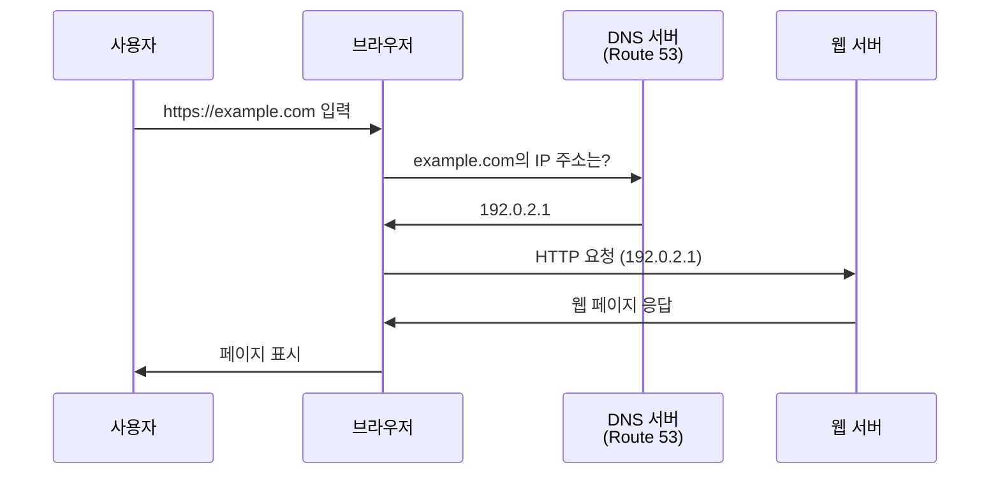
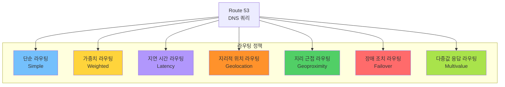
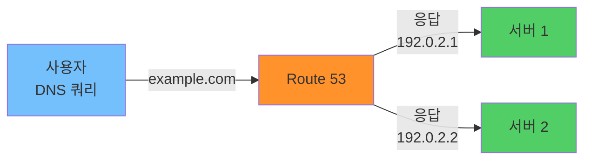
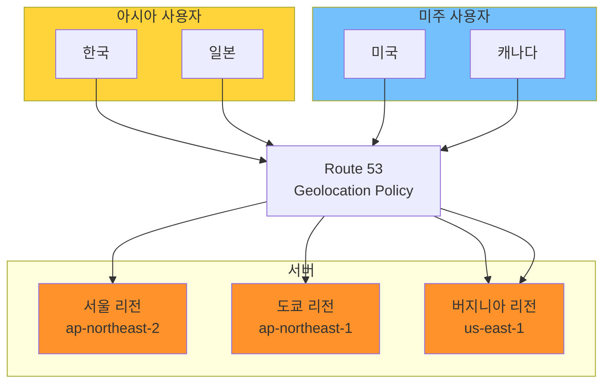
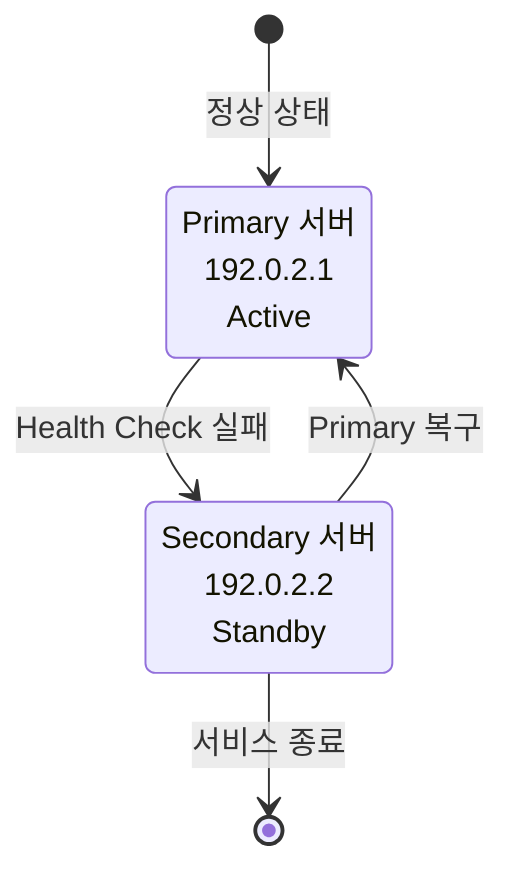
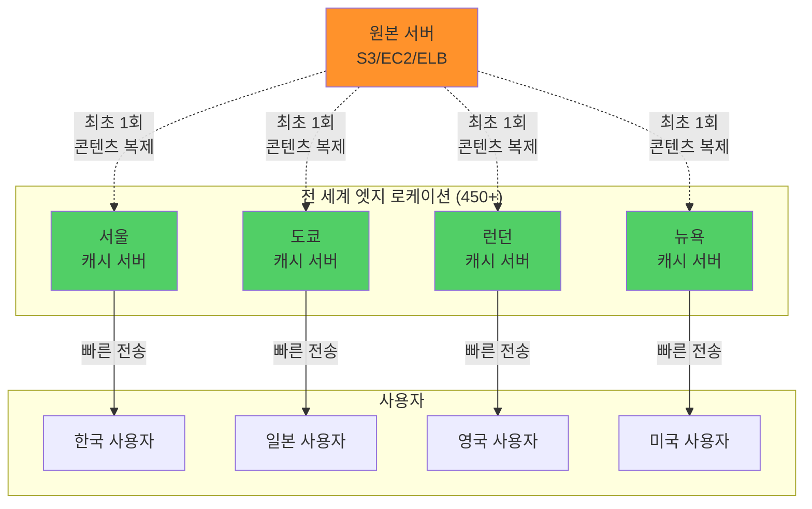
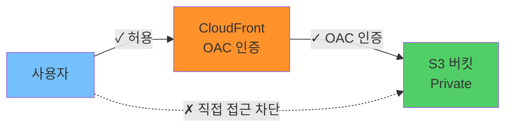
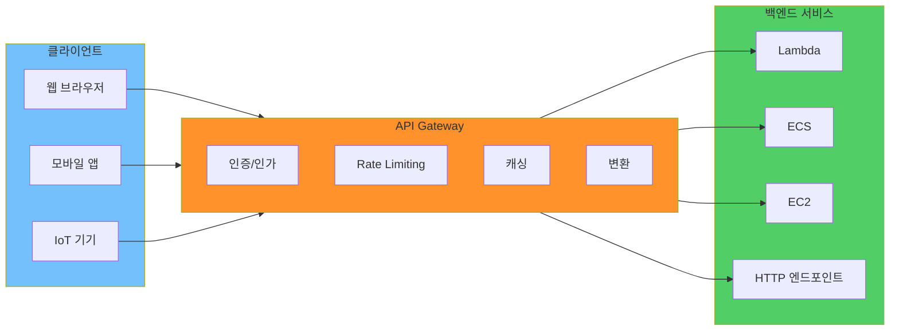
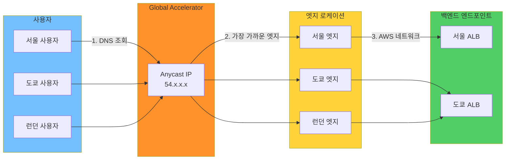
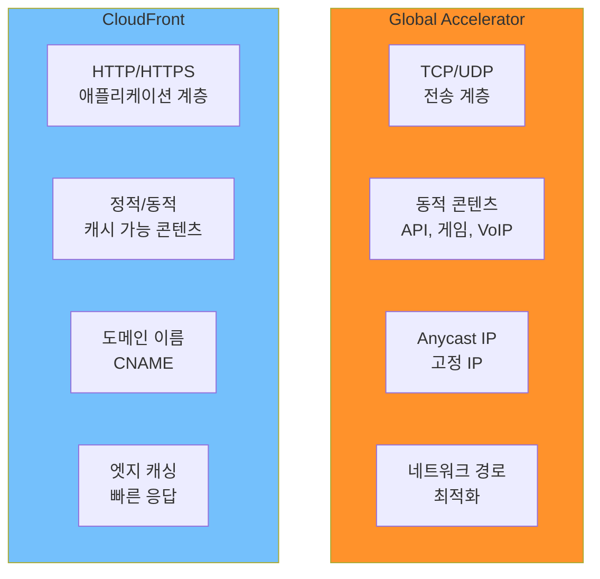

## 전체 흐름 요약

이번 학습에서는 AWS의 **네트워크 및 콘텐츠 전송 서비스**를 중심으로 글로벌 사용자에게 빠르고 안정적인 서비스를 제공하는 방법을 이해합니다. DNS 기반 트래픽 라우팅, CDN을 통한 콘텐츠 캐싱, API 관리, 네트워크 경로 최적화 등 다양한 서비스를 학습합니다.

**Part 1 - Amazon Route 53**에서는 AWS의 관리형 DNS 서비스를 학습합니다. 도메인 등록 및 관리, DNS 레코드 설정, 다양한 라우팅 정책(단순, 가중치, 지리적 위치, 지연 시간, 장애 조치 등)을 이해하고, 상황에 맞는 트래픽 라우팅 전략을 수립합니다. Route 53의 상태 확인 기능을 통한 자동 장애 조치도 학습합니다.

**Part 2 - Amazon CloudFront**에서는 AWS의 CDN(Contents Delivery Network) 서비스를 학습합니다. 전 세계 엣지 로케이션을 활용한 콘텐츠 캐싱, Origin 설정(S3, EC2, ELB), OAC(Origin Access Control)를 통한 보안 강화, Signed URL/Cookie를 활용한 콘텐츠 접근 제어를 다룹니다. CloudFront의 캐시 정책, 지리적 제한, 무효화(Invalidation) 기능도 학습합니다.

**Part 3 - Amazon API Gateway**에서는 API 트래픽을 관리하는 프록시 서비스를 학습합니다. REST API, HTTP API, WebSocket API 지원, Rate Limiting(스로틀링), API 응답 캐싱, 인증/인가 통합, 프로토콜 변환 등의 기능을 이해하고, Lambda, ECS, EC2 등 백엔드 서비스와의 통합 방법을 학습합니다.

**Part 4 - AWS Global Accelerator**에서는 AWS 글로벌 네트워크를 활용한 네트워크 성능 최적화 서비스를 학습합니다. Anycast IP 주소를 통한 고정 진입점, 엣지 로케이션에서의 최적 경로 선택, 상태 확인 및 장애 조치 기능을 다룹니다. CloudFront와의 차이점(계층 4 vs 계층 7, 동적 vs 정적 콘텐츠)을 명확히 비교합니다.

이번 섹션을 통해 글로벌 규모의 애플리케이션을 위한 DNS 관리, 콘텐츠 전송, API 관리, 네트워크 최적화 전략을 이해하고, 사용자에게 빠르고 안정적인 서비스를 제공하는 아키텍처를 설계할 수 있습니다.

---

## 주요 개념 요약표

| 구분 | Route 53 | CloudFront | API Gateway | Global Accelerator |
|------|---------|-----------|------------|-------------------|
| **목적** | DNS 관리 및 라우팅 | 콘텐츠 전송 및 캐싱 | API 트래픽 관리 | 네트워크 성능 최적화 |
| **계층** | 애플리케이션 계층 (DNS) | 애플리케이션 계층 (HTTP/HTTPS) | 애플리케이션 계층 (HTTP/HTTPS) | 전송 계층 (TCP/UDP) |
| **진입점** | 도메인 이름 | 도메인 이름 (CNAME) | API 엔드포인트 URL | Anycast IP 주소 (고정) |
| **글로벌 분산** | - | 450+ 엣지 로케이션 | 리전별 배포 | 엣지 로케이션 활용 |
| **캐싱** | - | 지원 (엣지 캐싱) | 지원 (API 응답 캐싱) | 미지원 |
| **주요 기능** | 라우팅 정책, 상태 확인 | 콘텐츠 캐싱, OAC, Signed URL | Rate Limiting, 인증/인가 | 고정 IP, Health Check |
| **백엔드** | AWS 리소스, 외부 IP | S3, EC2, ELB, 외부 서버 | Lambda, ECS, EC2, HTTP | NLB, ALB, EC2, EIP |
| **사용 사례** | 트래픽 분산, 장애 조치 | 정적/동적 콘텐츠 전송 | REST/WebSocket API | 게임, API, 미디어 스트리밍 |

---

## Part 1: Amazon Route 53

### 1.1. Route 53 개요

**Amazon Route 53**는 AWS의 관리형 DNS(Domain Name System) 웹 서비스로, 도메인 이름을 IP 주소로 변환하고, 다양한 라우팅 정책을 통해 트래픽을 제어합니다.

**이름의 유래:**
```
"Route 53" = "DNS Port 53번"
- DNS는 UDP/TCP 포트 53번을 사용
- AWS의 DNS 서비스임을 의미
```

**Route 53의 핵심 기능:**

```
1. 도메인 등록 및 관리
   - 공인 도메인 이름 등록
   - 도메인 이전 관리
   - 자동 갱신 설정

2. DNS 레코드 관리
   - 호스팅 영역(Hosted Zone) 관리
   - DNS 레코드 CRUD
   - TTL(Time To Live) 설정

3. 트래픽 라우팅
   - 다양한 라우팅 정책
   - 상태 확인(Health Check)
   - 자동 장애 조치(Failover)
```

---

### 1.2. DNS 기본 개념

#### DNS 작동 원리

**DNS 질의 흐름:**



```
1️⃣ 사용자가 브라우저에 도메인 입력
   - 예: https://example.com

2️⃣ 브라우저가 DNS 서버에 질의
   - "example.com의 IP 주소는?"

3️⃣ DNS 서버(Route 53)가 IP 주소 반환
   - "192.0.2.1 입니다"

4️⃣ 브라우저가 해당 IP로 HTTP 요청
   - 실제 웹 서버 접속

5️⃣ 웹 서버가 콘텐츠 응답
   - 사용자에게 페이지 표시
```

---

#### 호스팅 영역 (Hosted Zone)

```
호스팅 영역:
- 도메인과 해당 하위 도메인에 대한 DNS 레코드 컨테이너
- 도메인별로 하나씩 생성

구성 요소:
- NS(Name Server) 레코드: Route 53 네임서버 4개
- SOA(Start of Authority) 레코드: 영역 정보
- 사용자 정의 레코드: A, AAAA, CNAME, MX 등

비용:
- 호스팅 영역당 $0.50/월
- 쿼리당 $0.40/백만 건 (처음 10억 건)
```

---

#### DNS 레코드 타입

**주요 DNS 레코드:**

```
A 레코드 (Address Record):
- 도메인 → IPv4 주소 매핑
- 예: example.com → 192.0.2.1

AAAA 레코드 (IPv6 Address Record):
- 도메인 → IPv6 주소 매핑
- 예: example.com → 2001:0db8::1

CNAME 레코드 (Canonical Name):
- 도메인 → 다른 도메인 별칭
- 예: www.example.com → example.com
- 제약: 루트 도메인(example.com)에는 사용 불가

MX 레코드 (Mail Exchange):
- 이메일 서버 지정
- 예: example.com → mail.example.com (우선순위 10)

TXT 레코드 (Text Record):
- 텍스트 정보 저장
- SPF, DKIM, 도메인 소유권 인증 등에 사용

Alias 레코드 (AWS 전용):
- AWS 리소스에 직접 연결
- 루트 도메인에도 사용 가능
- CloudFront, ELB, S3 등과 통합
- 쿼리 비용 무료
```

**Alias vs CNAME 비교:**

```
CNAME:
example.com → alb-1234.us-east-1.elb.amazonaws.com
- 루트 도메인 불가
- 쿼리 비용 발생
- 표준 DNS 레코드

Alias:
example.com → alb-1234.us-east-1.elb.amazonaws.com
- 루트 도메인 가능
- 쿼리 비용 무료
- AWS 전용 기능
- 자동 IP 업데이트
```

---

### 1.3. Route 53 라우팅 정책

Route 53는 다양한 라우팅 정책을 제공하여 트래픽을 제어할 수 있습니다.

#### 라우팅 정책 개요

**라우팅 정책 분류:**



---

#### 1. 단순 라우팅 (Simple Routing)

**가장 기본적인 라우팅 방식으로, 하나의 레코드에 하나 또는 여러 IP 주소를 지정합니다.**

```
작동 방식:
example.com → [192.0.2.1, 192.0.2.2]

특징:
- 여러 IP 반환 시 클라이언트가 랜덤 선택
- 상태 확인 미지원
- 가장 간단한 설정

사용 사례:
- 단일 리소스
- 간단한 웹사이트
- 로드밸런싱 불필요한 경우
```

**다이어그램:**



---

#### 2. 가중치 기반 라우팅 (Weighted Routing)

**각 리소스에 가중치를 부여하여 트래픽 비율을 조정합니다.**

```
작동 방식:
example.com:
├── 서버 A (가중치 70) → 70% 트래픽
└── 서버 B (가중치 30) → 30% 트래픽

계산:
특정 레코드의 가중치 / 전체 가중치 합

예시:
- 서버 A: 70 / (70 + 30) = 70%
- 서버 B: 30 / (70 + 30) = 30%

특징:
- 정확한 비율 제어
- 상태 확인 지원
- A/B 테스팅에 적합

사용 사례:
- 점진적 배포 (Canary Deployment)
- A/B 테스팅
- 블루/그린 배포
- 리전별 트래픽 분산
```

**A/B 테스팅 예시:**

```
신규 버전 테스트:
1단계: 신규 10% + 기존 90%
2단계: 신규 30% + 기존 70%
3단계: 신규 50% + 기존 50%
4단계: 신규 100%

설정:
- v1.example.com (가중치 90)
- v2.example.com (가중치 10)
```

---

#### 3. 지리적 위치 라우팅 (Geolocation Routing)

**사용자의 지리적 위치(국가, 대륙, 주/도)에 따라 트래픽을 라우팅합니다.**

```
작동 방식:
example.com:
├── 한국 사용자 → 서울 리전 서버
├── 미국 사용자 → 버지니아 리전 서버
├── 일본 사용자 → 도쿄 리전 서버
└── 기타 지역 → 기본 서버

우선순위:
1. 주/도 (가장 구체적)
2. 국가
3. 대륙
4. 기본(Default)

특징:
- 지리적 규정 준수
- 콘텐츠 지역화
- 상태 확인 지원

사용 사례:
- 지역별 콘텐츠 제공
- 언어별 사이트
- 저작권 제한
- 규정 준수 (GDPR 등)
```

**지역별 라우팅 다이어그램:**



---

#### 4. 지연 시간 기반 라우팅 (Latency-Based Routing)

**사용자와 리소스 간의 네트워크 지연 시간이 가장 낮은 리소스로 트래픽을 라우팅합니다.**

```
작동 방식:
1. Route 53이 사용자 위치 감지
2. 각 리전까지의 지연 시간 측정
3. 가장 낮은 지연 시간의 리전 선택

예시:
서울 사용자:
- 서울 리전: 5ms ✓ (선택)
- 도쿄 리전: 30ms
- 버지니아 리전: 180ms

특징:
- 실제 네트워크 성능 기반
- 리전별 설정 필요
- 동적으로 최적 경로 선택

사용 사례:
- 글로벌 서비스
- 게임 서버
- 실시간 애플리케이션
- 최저 지연 시간 요구
```

---

#### 5. 다중값 응답 라우팅 (Multivalue Answer Routing)

**여러 IP 주소를 반환하되, 각각 상태 확인을 수행합니다.**

```
작동 방식:
example.com:
├── 서버 1 (192.0.2.1) - Healthy ✓
├── 서버 2 (192.0.2.2) - Unhealthy ✗
├── 서버 3 (192.0.2.3) - Healthy ✓
└── 서버 4 (192.0.2.4) - Healthy ✓

응답: [192.0.2.1, 192.0.2.3, 192.0.2.4]
      (Unhealthy 서버 제외)

단순 라우팅과의 차이:
- 단순: 상태 확인 없음, 모든 IP 반환
- 다중값: 상태 확인 있음, Healthy IP만 반환

특징:
- 최대 8개 레코드 반환
- 각 레코드별 상태 확인
- ELB의 간단한 대안

사용 사례:
- 간단한 로드밸런싱
- DNS 기반 장애 제거
```

---

#### 6. 장애 조치 라우팅 (Failover Routing)

**Primary 리소스가 실패하면 자동으로 Secondary 리소스로 전환합니다.**

```
작동 방식:
Primary (192.0.2.1) - Healthy
   ↓ Health Check 실패
Secondary (192.0.2.2) - Healthy (장애 조치)

구성:
1. Primary 레코드:
   - Type: Primary
   - Health Check: 활성화

2. Secondary 레코드:
   - Type: Secondary
   - Standby 상태 유지

상태 확인 설정:
- Health Check 주기: 30초 (기본)
- 연속 실패 임계값: 3회
- 프로토콜: HTTP, HTTPS, TCP

특징:
- Active-Standby 구성
- 자동 장애 조치
- 상태 확인 필수

사용 사례:
- 재해 복구 (DR)
- 고가용성 아키텍처
- 백업 사이트
```

**장애 조치 흐름:**



---

### 1.4. Route 53 상태 확인 (Health Check)

**Route 53는 리소스의 상태를 모니터링하고 장애 발생 시 트래픽을 자동으로 다른 리소스로 전환할 수 있습니다.**

#### 상태 확인 타입

```
1. 엔드포인트 상태 확인:
   - IP 주소 또는 도메인 모니터링
   - HTTP, HTTPS, TCP 프로토콜 지원
   - 전 세계 여러 위치에서 확인

2. 계산된 상태 확인:
   - 여러 상태 확인 결과를 조합
   - AND, OR 논리 연산
   - 복잡한 조건 설정 가능

3. CloudWatch 알람 상태 확인:
   - CloudWatch 알람 상태 기반
   - 커스텀 메트릭 활용
```

**상태 확인 설정:**

```
기본 설정:
- 확인 간격: 30초 (Fast: 10초)
- 실패 임계값: 3회 연속 실패
- 확인자 위치: 전 세계 15개 이상 위치

HTTP/HTTPS:
- 응답 코드: 2xx, 3xx
- 응답 시간: 4초 이내
- 문자열 검색: 선택사항

TCP:
- 연결 성공 여부만 확인
- 3초 이내 연결

비용:
- 기본 상태 확인: $0.50/월
- 선택적 기능(Fast interval, String matching): 추가 비용
```

---

### 1.5. Route 53 활용 예시

#### 예시 1: 글로벌 애플리케이션 배포

```
요구사항:
- 전 세계 사용자 대상
- 최저 지연 시간 제공
- 장애 조치 필요

아키텍처:
1. 지연 시간 기반 라우팅:
   - 서울 리전 (Primary)
   - 도쿄 리전 (Primary)
   - 버지니아 리전 (Primary)

2. 각 리전별 장애 조치:
   - Primary: 메인 ALB
   - Secondary: 백업 ALB

3. 상태 확인:
   - HTTP 엔드포인트 모니터링
   - 30초 간격, 3회 실패 시 장애 조치
```

#### 예시 2: A/B 테스팅

```
시나리오:
- 신규 버전 점진적 배포
- 사용자 피드백 수집

설정:
1. 가중치 기반 라우팅:
   - v1.example.com (가중치 90) → 기존 버전
   - v2.example.com (가중치 10) → 신규 버전

2. 단계별 전환:
   Week 1: 90% vs 10%
   Week 2: 70% vs 30%
   Week 3: 50% vs 50%
   Week 4: 0% vs 100%

3. 모니터링:
   - CloudWatch로 에러율 추적
   - 문제 발생 시 즉시 롤백
```

---

## Part 2: Amazon CloudFront

### 2.1. CloudFront 개요

**Amazon CloudFront**는 AWS의 CDN(Contents Delivery Network) 관리형 서비스로, 전 세계 엣지 로케이션을 활용하여 콘텐츠를 빠르게 전송합니다.

**CDN이란?**

```
CDN (Contents Delivery Network):
- 콘텐츠 전송 네트워크
- 사용자와 가까운 서버에 콘텐츠 캐싱
- 빠른 콘텐츠 전송 및 원본 서버 부하 감소

전통적 방식:
사용자 (서울) → 원본 서버 (버지니아) : 200ms
      긴 지연 시간, 네트워크 비용 높음

CDN 방식:
사용자 (서울) → 엣지 서버 (서울) : 5ms
      짧은 지연 시간, 네트워크 비용 절감
```

**CloudFront 글로벌 인프라:**



**CloudFront의 핵심 가치:**

```
1. 속도 향상:
   - 엣지 로케이션 캐싱
   - 사용자와 가까운 위치에서 전송
   - 평균 50-80% 지연 시간 감소

2. 원본 서버 보호:
   - 부하 감소 (캐시 히트율 90% 이상 가능)
   - DDoS 공격 방어 (AWS Shield 통합)
   - 원본 서버 숨김 (OAC)

3. 비용 절감:
   - 데이터 전송 비용 감소
   - 원본 서버 용량 감소
   - Auto Scaling 부담 완화

4. 보안 강화:
   - SSL/TLS 암호화
   - Signed URL/Cookie
   - 지리적 제한
   - WAF 통합
```

---

### 2.2. CloudFront 주요 개념

#### Distribution (배포)

```
Distribution:
- CloudFront 설정의 기본 단위
- 도메인 이름 자동 생성: dxxxxx.cloudfront.net
- 커스텀 도메인 연결 가능 (CNAME)

타입:
1. Web Distribution:
   - HTTP/HTTPS 콘텐츠
   - 일반적인 웹 사이트/API

2. RTMP Distribution (deprecated):
   - 실시간 스트리밍 (더 이상 권장하지 않음)
   - AWS Elemental MediaStore 사용 권장
```

---

#### Origin (원본)

**CloudFront가 콘텐츠를 가져오는 원본 서버입니다.**

```
지원되는 Origin 타입:

1. S3 버킷:
   - 정적 콘텐츠 (HTML, CSS, JS, 이미지)
   - OAC로 보안 강화
   - 가장 일반적인 사용

2. EC2 인스턴스:
   - 동적 콘텐츠
   - 커스텀 애플리케이션
   - Public IP 필요

3. ELB (ALB/NLB):
   - 고가용성 백엔드
   - 다중 EC2 부하 분산
   - 추천하는 구성

4. 외부 웹 서버:
   - 온프레미스 서버
   - 다른 클라우드 서버
   - HTTP/HTTPS 접근 가능한 모든 서버

Origin 설정:
- Protocol: HTTP, HTTPS, Match Viewer
- Custom Headers: 헤더 추가 가능
- Origin Path: 기본 경로 설정
```

---

#### OAC (Origin Access Control)

**CloudFront만 S3 버킷에 접근할 수 있도록 제한하는 보안 기능입니다.**

```
OAC 작동 방식:

없을 때:
사용자 → S3 버킷 (퍼블릭 액세스 필요)
         ↓
      보안 취약

OAC 사용:
사용자 → CloudFront → S3 버킷 (프라이빗)
         ↓ OAC 인증
      보안 강화

설정 방법:
1. CloudFront에서 OAC 생성
2. S3 버킷 정책 자동 생성 (콘솔 사용 시)
3. S3 퍼블릭 액세스 차단

S3 버킷 정책 예시:
{
  "Version": "2012-10-17",
  "Statement": [
    {
      "Effect": "Allow",
      "Principal": {
        "Service": "cloudfront.amazonaws.com"
      },
      "Action": "s3:GetObject",
      "Resource": "arn:aws:s3:::my-bucket/*",
      "Condition": {
        "StringEquals": {
          "AWS:SourceArn": "arn:aws:cloudfront::123456789012:distribution/EDFDVBD6EXAMPLE"
        }
      }
    }
  ]
}

이점:
- S3 버킷을 프라이빗으로 유지
- CloudFront를 통해서만 접근
- 직접 S3 URL 접근 차단
- 비용 절감 (CloudFront를 통한 전송)
```

**OAC 다이어그램:**



---

### 2.3. CloudFront 설정

#### Cache Behavior (캐시 동작)

**특정 경로 패턴에 대한 캐싱 규칙을 정의합니다.**

```
Path Pattern:
- 기본: * (모든 요청)
- 예시: /images/*, /api/*, /videos/*.mp4

Cache Key 구성:
- URL
- Query String (선택)
- Headers (선택)
- Cookies (선택)

TTL (Time To Live):
- Minimum TTL: 최소 캐시 시간
- Maximum TTL: 최대 캐시 시간
- Default TTL: 기본 캐시 시간 (86400초 = 24시간)

예시:
/images/* → 1주일 캐싱 (정적 콘텐츠)
/api/* → 캐싱 안 함 (동적 콘텐츠)
*.html → 1시간 캐싱
```

---

#### Signed URL & Signed Cookie

**특정 사용자만 콘텐츠에 접근할 수 있도록 제한하는 기능입니다.**

```
Signed URL:
- 개별 파일 접근 제어
- URL에 서명 포함
- 만료 시간 설정 가능

예시:
https://d111111abcdef8.cloudfront.net/premium.mp4?
  Expires=1609459200&
  Signature=abc123...&
  Key-Pair-Id=APKAEXAMPLE

사용 사례:
- 유료 콘텐츠
- 프라이빗 파일
- 시간 제한 다운로드

Signed Cookie:
- 여러 파일 접근 제어
- 쿠키로 서명 전달
- 동적 콘텐츠에 적합

사용 사례:
- 구독 기반 콘텐츠
- 로그인 사용자만 접근
- HLS 스트리밍

구현 단계:
1. CloudFront Key Pair 생성
2. Trusted Key Groups 설정
3. 애플리케이션에서 서명 생성
4. URL 또는 Cookie 전달
```

---

#### Geographic Restrictions (지리적 제한)

**특정 국가의 사용자만 콘텐츠에 접근하거나 차단할 수 있습니다.**

```
Whitelist (허용 목록):
- 지정된 국가만 접근 허용
- 예: 한국, 일본, 미국만 허용

Blacklist (차단 목록):
- 지정된 국가 접근 차단
- 예: 특정 국가 차단

동작 방식:
1. CloudFront가 요청자의 IP 주소 확인
2. 국가 판별 (GeoIP 데이터베이스)
3. 허용/차단 결정
4. 차단 시 HTTP 403 Forbidden 응답

사용 사례:
- 저작권 제한
- 규정 준수 (GDPR 등)
- 라이선스 지역 제한
```

---

#### Invalidation (무효화)

**캐시된 콘텐츠를 강제로 삭제하여 최신 콘텐츠를 제공합니다.**

```
무효화 필요 상황:
- 원본 파일 업데이트
- 긴급 버그 수정
- 정책 변경

무효화 방법:
1. 특정 파일:
   /images/logo.png

2. 디렉토리:
   /images/*

3. 전체:
   /*

비용:
- 매월 1,000개 경로 무료
- 이후 경로당 $0.005

무효화 시간:
- 일반적으로 10-30분 소요
- 모든 엣지 로케이션 전파

대안:
- Versioned URL 사용 (권장)
  /images/logo_v1.png → /images/logo_v2.png
- Cache-Control 헤더 활용
  Cache-Control: max-age=3600
```

---

### 2.4. CloudFront 장점

```
1. 대용량 콘텐츠의 빠른 배포:
   - 동영상, 이미지, 소프트웨어 다운로드
   - 초당 수백만 요청 처리
   - 자동 확장

2. 보안 향상:
   - SSL/TLS 암호화 수행 (HTTPS)
   - AWS Shield 통합 (DDoS 방어)
   - AWS WAF 통합 (웹 방화벽)
   - Signed URL/Cookie 지원
   - 지리적 제한 기능

3. 가용성 향상:
   - 원본 서버 부하 감소
   - 전 세계 엣지 로케이션 분산
   - 원본 서버 장애 시에도 캐시 제공
   - 자동 장애 조치

4. 비용 효율:
   - 데이터 전송 비용 절감
   - 원본 서버 트래픽 감소
   - 프리 티어: 매월 1TB 전송, 1,000만 HTTP/HTTPS 요청
```

---

### 2.5. CloudFront 활용 예시

#### 예시 1: 정적 웹사이트 가속

```
아키텍처:
S3 버킷 (Origin) → CloudFront → 사용자

설정:
1. S3 버킷:
   - 정적 웹사이트 호스팅 활성화
   - OAC로 프라이빗 유지

2. CloudFront:
   - Default TTL: 86400초 (24시간)
   - Compress Objects: 활성화 (Gzip)
   - Price Class: Use All Edge Locations

3. Route 53:
   - Alias 레코드 생성
   - www.example.com → CloudFront

결과:
- 전 세계 빠른 로딩
- S3 비용 절감
- HTTPS 자동 제공
```

#### 예시 2: 동적 콘텐츠 가속

```
아키텍처:
ALB + EC2 (Origin) → CloudFront → 사용자

설정:
1. Origin:
   - ALB 공개 DNS
   - Protocol: HTTPS

2. Cache Behavior:
   - /api/* → TTL 0 (캐싱 안 함)
   - /static/* → TTL 86400 (24시간)
   - /*.html → TTL 3600 (1시간)

3. 헤더 전달:
   - Host, User-Agent, Authorization

결과:
- API는 항상 최신 데이터
- 정적 리소스는 캐싱
- 전체적인 성능 향상
```

---

## Part 3: Amazon API Gateway

### 3.1. API Gateway 개요

**Amazon API Gateway**는 백엔드 서비스에 대한 API 트래픽을 수락, 변환, 관리하는 완전관리형 서비스입니다.

**API Gateway의 역할:**

```
API Gateway = API의 "현관문"

클라이언트 → API Gateway → 백엔드 서비스
                ↓
            [ 프록시 역할 ]
            - 인증/인가
            - Rate Limiting
            - 캐싱
            - 변환
            - 모니터링
```

**API Gateway 아키텍처:**



---

### 3.2. API Gateway 주요 기능

#### 1. API Management (API 관리)

```
API 생성 및 관리:
- REST API, HTTP API, WebSocket API 지원
- 리소스 및 메서드 정의
- 버전 관리 (Stage 개념)
- API 문서 자동 생성

Stage (스테이지):
- dev, test, prod 등 환경 구분
- 각 Stage별 독립적인 설정
- Stage 변수 활용

예시:
https://api.example.com/dev/users
https://api.example.com/prod/users
```

---

#### 2. Rate Limiting (스로틀링)

**API 호출 횟수를 제한하여 백엔드 서비스를 보호합니다.**

```
Throttling 설정:
- Rate: 초당 요청 수 (requests per second)
- Burst: 동시 요청 수 (concurrent requests)

기본 제한:
- Account Level: 10,000 RPS
- Stage Level: 커스텀 설정 가능
- Method Level: 세부 설정

예시:
Rate = 1000 RPS
Burst = 2000

동작:
- 평균 초당 1000건 허용
- 순간적으로 최대 2000건 버스트 허용
- 초과 시 HTTP 429 (Too Many Requests)

Usage Plan:
- API 키 기반 사용량 제한
- 구독 계층별 차등 적용
- 예: Free (100 RPS), Pro (1000 RPS)
```

---

#### 3. Caching (캐싱)

**API 응답을 캐싱하여 백엔드 호출을 줄이고 성능을 향상시킵니다.**

```
캐시 설정:
- Stage Level: Stage 전체 캐싱
- Method Level: 특정 메서드만 캐싱
- 캐시 용량: 0.5GB ~ 237GB

캐시 키:
- Query String
- HTTP Headers
- Path Parameters

TTL (Time To Live):
- 기본: 300초 (5분)
- 최대: 3600초 (1시간)
- Method Level에서 재정의 가능

예시:
GET /products?category=electronics
↓ 첫 요청
백엔드 호출 → 응답 → 캐시 저장
↓ 두 번째 요청 (5분 이내)
캐시에서 즉시 응답 (백엔드 호출 없음)

비용:
- 0.5GB: $0.02/시간
- 237GB: $3.80/시간
```

---

#### 4. Authentication & Authorization (인증 및 인가)

**API 접근을 제어하고 사용자를 인증합니다.**

```
지원되는 인증 방식:

1. AWS IAM:
   - AWS 자격 증명
   - SigV4 서명
   - AWS 내부 서비스 간 통신

2. Cognito User Pools:
   - 사용자 풀 기반 인증
   - JWT 토큰 검증
   - 소셜 로그인 통합

3. Lambda Authorizer:
   - 커스텀 인증 로직
   - OAuth, SAML 등 지원
   - Bearer 토큰 검증

4. API Key:
   - 간단한 API 키 기반
   - Usage Plan과 연동
   - 주로 파트너 API

예시 (Cognito):
1. 사용자 로그인 → Cognito
2. Cognito → JWT 토큰 발급
3. 클라이언트 → API Gateway (Authorization 헤더)
4. API Gateway → JWT 검증
5. 검증 성공 → 백엔드 호출
```

---

#### 5. Logging & Monitoring (로깅 및 모니터링)

```
CloudWatch Logs:
- API 호출 로그
- 요청/응답 본문
- 에러 추적

CloudWatch Metrics:
- API 호출 수
- 지연 시간
- 4xx/5xx 에러
- 캐시 히트율

X-Ray:
- 분산 추적
- 병목 지점 파악
- 서비스 맵 시각화

Access Logs:
- $context 변수 활용
- 커스텀 로그 포맷
- S3 또는 CloudWatch로 전송
```

---

### 3.3. API Gateway 타입

#### REST API vs HTTP API

| 구분 | REST API | HTTP API |
|------|---------|---------|
| **프로토콜** | HTTP/HTTPS | HTTP/HTTPS |
| **지연 시간** | ~100ms | ~70ms (30% 빠름) |
| **비용** | $3.50/백만 요청 | $1.00/백만 요청 (70% 저렴) |
| **API 키** | 지원 | 미지원 |
| **Usage Plans** | 지원 | 미지원 |
| **캐싱** | 지원 | 미지원 |
| **WAF 통합** | 지원 | 미지원 |
| **Lambda Authorizer** | 지원 | 지원 |
| **Cognito** | 지원 | 지원 (JWT만) |
| **CORS** | 수동 설정 | 자동 설정 |
| **권장 사용** | 엔터프라이즈 API | 마이크로서비스, 간단한 API |

**선택 가이드:**

```
HTTP API를 선택하는 경우:
- 비용 절감 우선
- 간단한 API
- 캐싱 불필요
- 마이크로서비스 아키텍처

REST API를 선택하는 경우:
- API 키 필요
- Usage Plans 필요
- 캐싱 필요
- WAF 연동 필요
- 복잡한 인증/인가
```

---

#### WebSocket API

**실시간 양방향 통신을 지원하는 API입니다.**

```
특징:
- 지속적인 연결 유지
- 서버에서 클라이언트로 푸시 가능
- 낮은 지연 시간

연결 관리:
1. $connect: 연결 수립
2. $disconnect: 연결 종료
3. Custom Routes: 메시지 라우팅

사용 사례:
- 실시간 채팅
- 알림 시스템
- 게임 서버
- 협업 도구
- 주식 시세

아키텍처:
클라이언트 ↔ WebSocket API ↔ Lambda
             ↓
         DynamoDB (연결 ID 저장)
```

---

### 3.4. API Gateway 활용 예시

#### 예시 1: 서버리스 API

```
아키텍처:
API Gateway → Lambda → DynamoDB

설정:
1. API Gateway:
   - HTTP API (비용 절감)
   - JWT Authorizer (Cognito)
   - CORS 활성화

2. Lambda:
   - CRUD 함수
   - 환경 변수: DynamoDB 테이블 이름

3. DynamoDB:
   - 사용자 데이터 저장

엔드포인트:
GET /users → Lambda (ListUsers)
POST /users → Lambda (CreateUser)
GET /users/{id} → Lambda (GetUser)
PUT /users/{id} → Lambda (UpdateUser)
DELETE /users/{id} → Lambda (DeleteUser)

비용 효율:
- 서버 관리 불필요
- 사용한 만큼만 과금
- Auto Scaling 자동
```

#### 예시 2: 마이크로서비스 통합

```
아키텍처:
API Gateway → 여러 백엔드 서비스

통합:
/auth → Lambda (인증 서비스)
/users → ECS (사용자 서비스)
/products → EC2 (제품 서비스)
/orders → HTTP (외부 주문 서비스)

장점:
- 단일 진입점
- 백엔드 구현 숨김
- 독립적 확장
- 버전 관리 용이
```

---

## Part 4: AWS Global Accelerator

### 4.1. Global Accelerator 개요

**AWS Global Accelerator**는 AWS 글로벌 네트워크 인프라를 활용하여 애플리케이션의 가용성과 성능을 향상시키는 네트워킹 서비스입니다.

**핵심 개념:**

```
Global Accelerator = "네트워크 가속기"

일반 인터넷 경로:
사용자 → 여러 ISP → 여러 홉 → AWS 리전
         (불안정한 경로, 높은 지연)

Global Accelerator:
사용자 → 가장 가까운 엣지 → AWS 글로벌 네트워크 → AWS 리전
         (최적화된 경로, 낮은 지연)
```

**Global Accelerator 흐름:**



---

### 4.2. Global Accelerator 주요 기능

#### 1. Anycast IP 주소

**전 세계 어디서나 동일한 IP 주소로 접근할 수 있습니다.**

```
Anycast IP:
- 고정 IP 주소 2개 제공
- 전 세계 엣지 로케이션에 공지
- 가장 가까운 엣지로 자동 라우팅

장점:
- DNS 전파 불필요
- IP 화이트리스트 용이
- 간단한 클라이언트 설정

예시:
IP 1: 54.231.123.45
IP 2: 54.231.123.46

전 세계 어디서든:
curl https://54.231.123.45
→ 가장 가까운 엣지로 연결
```

---

#### 2. Health Check & Failover

**엔드포인트의 상태를 지속적으로 확인하고 장애 발생 시 자동으로 다른 엔드포인트로 전환합니다.**

```
상태 확인:
- 30초 간격
- TCP, HTTP/HTTPS 프로토콜
- 3회 연속 실패 시 Unhealthy

장애 조치:
1. Primary Endpoint (서울 ALB) - Healthy
   ↓ Health Check 실패
2. Secondary Endpoint (도쿄 ALB) - Healthy
   ↓ 트래픽 자동 전환
3. 30-60초 내 전환 완료

구성:
Endpoint Group:
├── 서울 리전 (가중치 100)
│   ├── ALB-1 (가중치 50)
│   └── ALB-2 (가중치 50)
└── 도쿄 리전 (가중치 0, 백업)
    └── ALB-3 (가중치 100)
```

---

#### 3. Traffic Dial (트래픽 다이얼)

**리전별로 전달되는 트래픽 비율을 조정할 수 있습니다.**

```
Traffic Dial:
- 0% ~ 100% 조정
- 리전별 독립 설정

사용 사례:
1. 점진적 배포:
   - 서울: 100% → 80% → 50%
   - 도쿄: 0% → 20% → 50%

2. 리전 유지보수:
   - 도쿄: 100% → 0% (유지보수)
   - 서울: 0% → 100% (트래픽 이전)

3. 비용 최적화:
   - 저렴한 리전으로 더 많은 트래픽
```

---

#### 4. Client IP Address Preservation

**원본 클라이언트 IP 주소를 백엔드에 전달할 수 있습니다.**

```
활성화 방법:
- Endpoint: ALB, EC2 인스턴스
- 설정: Client IP Preservation 활성화

전달 방식:
- NLB/EC2: 클라이언트 IP 그대로 전달
- ALB: X-Forwarded-For 헤더에 추가

사용 사례:
- 지역별 맞춤 콘텐츠
- IP 기반 접근 제어
- 로깅 및 분석
```

---

### 4.3. Global Accelerator vs CloudFront

**두 서비스 모두 엣지 로케이션을 활용하지만, 목적과 작동 방식이 다릅니다.**

**상세 비교:**



| 구분 | Global Accelerator | CloudFront |
|------|-------------------|-----------|
| **목표** | 네트워크 성능 및 가용성 향상 | 콘텐츠 전송 및 캐싱 |
| **프로토콜** | TCP/UDP (전송 계층) | HTTP/HTTPS (애플리케이션 계층) |
| **트래픽 종류** | 동적 및 비캐시성 콘텐츠 (API, 게임, VoIP) | 정적 및 동적 캐시 가능 콘텐츠 (이미지, 비디오, API) |
| **진입점** | 고정 Anycast IP 주소 | 도메인 이름 (CNAME) |
| **최적화 대상** | 최적의 네트워크 경로를 통한 트래픽 라우팅 | 엣지 로케이션에서의 캐싱 및 빠른 응답 |
| **캐싱** | 미지원 | 지원 (핵심 기능) |
| **백엔드 엔드포인트** | NLB, ALB, EC2 인스턴스, EIP (IP 주소 기반) | S3 버킷, EC2, ELB, 외부 웹 서버 (도메인 이름 기반) |
| **IP 고정** | 2개 고정 Anycast IP | 동적 IP (CloudFront 도메인) |
| **사용 사례** | 게임 서버, API 게이트웨이, 미디어 스트리밍, 재해 복구 | 웹사이트 콘텐츠 전송, API 캐싱, 보안 헤더 추가 |
| **비용** | 시간당 요금 + 데이터 전송 | 데이터 전송 + 요청 수 |

**선택 가이드:**

```
Global Accelerator를 선택하는 경우:
✓ TCP/UDP 애플리케이션
✓ 실시간 게임
✓ VoIP 또는 미디어 스트리밍
✓ 고정 IP 필요
✓ IoT 연결
✓ 네트워크 경로 최적화 필요

CloudFront를 선택하는 경우:
✓ HTTP/HTTPS 콘텐츠
✓ 정적 웹사이트
✓ REST API
✓ 동영상 스트리밍 (캐시 가능)
✓ 이미지/파일 다운로드
✓ 캐싱 필요

둘 다 사용하는 경우:
✓ CloudFront (콘텐츠 캐싱)
  → Global Accelerator (네트워크 가속)
✓ 최고의 성능과 가용성
```

---

### 4.4. Global Accelerator 활용 예시

#### 예시 1: 글로벌 게임 서버

```
요구사항:
- 낮은 지연 시간
- 고정 IP (방화벽 화이트리스트)
- 리전 간 장애 조치

아키텍처:
Global Accelerator
├── 서울 리전 (Primary)
│   ├── NLB
│   └── EC2 인스턴스 (게임 서버)
└── 도쿄 리전 (Secondary)
    ├── NLB
    └── EC2 인스턴스 (게임 서버)

설정:
- Anycast IP: 54.x.x.x
- Health Check: TCP 포트 7777
- Traffic Dial: 서울 100%, 도쿄 0%

결과:
- 전 세계 사용자가 동일한 IP로 접속
- 서울 리전 장애 시 도쿄로 자동 전환
- 30-60초 내 장애 조치
```

#### 예시 2: API 가속 및 재해 복구

```
요구사항:
- REST API 성능 향상
- 멀티 리전 장애 조치
- 클라이언트 IP 보존

아키텍처:
Global Accelerator
├── 미국 동부 (Primary)
│   ├── ALB
│   └── ECS 클러스터
└── 유럽 (Secondary)
    ├── ALB
    └── ECS 클러스터

설정:
- Client IP Preservation: 활성화
- Health Check: HTTP /health
- Failover: 자동

결과:
- 글로벌 사용자 지연 시간 50% 감소
- 리전 장애 자동 복구
- 클라이언트 IP 기반 로깅
```

---

## 추가 보충 설명

### 1. Route 53 레코드 예시

```bash
# A 레코드
example.com.  IN  A  192.0.2.1

# AAAA 레코드
example.com.  IN  AAAA  2001:0db8::1

# CNAME 레코드
www.example.com.  IN  CNAME  example.com.

# Alias 레코드 (AWS 콘솔 JSON)
{
  "Name": "example.com",
  "Type": "A",
  "AliasTarget": {
    "HostedZoneId": "Z2FDTNDATAQYW2",
    "DNSName": "dxxxxx.cloudfront.net",
    "EvaluateTargetHealth": false
  }
}

# MX 레코드
example.com.  IN  MX  10  mail.example.com.
example.com.  IN  MX  20  mail2.example.com.

# TXT 레코드 (SPF)
example.com.  IN  TXT  "v=spf1 include:_spf.google.com ~all"
```

---

### 2. CloudFront 캐시 정책 JSON

```json
{
  "CachePolicyConfig": {
    "Name": "MyCustomCachePolicy",
    "Comment": "Custom cache policy for my application",
    "DefaultTTL": 86400,
    "MaxTTL": 31536000,
    "MinTTL": 1,
    "ParametersInCacheKeyAndForwardedToOrigin": {
      "EnableAcceptEncodingGzip": true,
      "EnableAcceptEncodingBrotli": true,
      "QueryStringsConfig": {
        "QueryStringBehavior": "whitelist",
        "QueryStrings": {
          "Items": ["product_id", "category"]
        }
      },
      "HeadersConfig": {
        "HeaderBehavior": "whitelist",
        "Headers": {
          "Items": ["CloudFront-Viewer-Country"]
        }
      },
      "CookiesConfig": {
        "CookieBehavior": "none"
      }
    }
  }
}
```

---

### 3. API Gateway OpenAPI 정의 예시

```yaml
openapi: 3.0.0
info:
  title: User API
  version: 1.0.0
paths:
  /users:
    get:
      summary: List users
      x-amazon-apigateway-integration:
        type: aws_proxy
        httpMethod: POST
        uri: arn:aws:apigateway:us-east-1:lambda:path/2015-03-31/functions/arn:aws:lambda:us-east-1:123456789012:function:ListUsers/invocations
      responses:
        '200':
          description: Successful response
    post:
      summary: Create user
      x-amazon-apigateway-integration:
        type: aws_proxy
        httpMethod: POST
        uri: arn:aws:apigateway:us-east-1:lambda:path/2015-03-31/functions/arn:aws:lambda:us-east-1:123456789012:function:CreateUser/invocations
      responses:
        '201':
          description: User created
```

---

### 4. Global Accelerator 엔드포인트 그룹 설정

```json
{
  "EndpointGroupRegion": "ap-northeast-2",
  "TrafficDialPercentage": 100,
  "HealthCheckIntervalSeconds": 30,
  "HealthCheckPath": "/health",
  "HealthCheckPort": 80,
  "HealthCheckProtocol": "HTTP",
  "ThresholdCount": 3,
  "EndpointConfigurations": [
    {
      "EndpointId": "arn:aws:elasticloadbalancing:ap-northeast-2:123456789012:loadbalancer/app/my-alb/1234567890abcdef",
      "Weight": 100,
      "ClientIPPreservationEnabled": true
    }
  ]
}
```

---

## 마무리

이번 섹션에서는 AWS의 네트워크 및 콘텐츠 전송 서비스를 학습했습니다:

**Route 53:**
- DNS 관리 및 다양한 라우팅 정책
- 상태 확인 및 자동 장애 조치
- Alias 레코드를 통한 AWS 리소스 통합

**CloudFront:**
- 전 세계 엣지 로케이션을 활용한 CDN
- OAC를 통한 S3 보안 강화
- Signed URL/Cookie로 콘텐츠 접근 제어
- 캐싱, 압축, 지리적 제한 기능

**API Gateway:**
- API 트래픽 관리 및 프록시
- Rate Limiting, 캐싱, 인증/인가
- Lambda, ECS, EC2 등 백엔드 통합
- REST, HTTP, WebSocket API 지원

**Global Accelerator:**
- AWS 글로벌 네트워크 활용
- Anycast IP로 고정 진입점 제공
- 네트워크 경로 최적화
- TCP/UDP 애플리케이션 가속

이러한 서비스를 조합하여 글로벌 규모의 고성능, 고가용성 애플리케이션을 구축할 수 있습니다.
