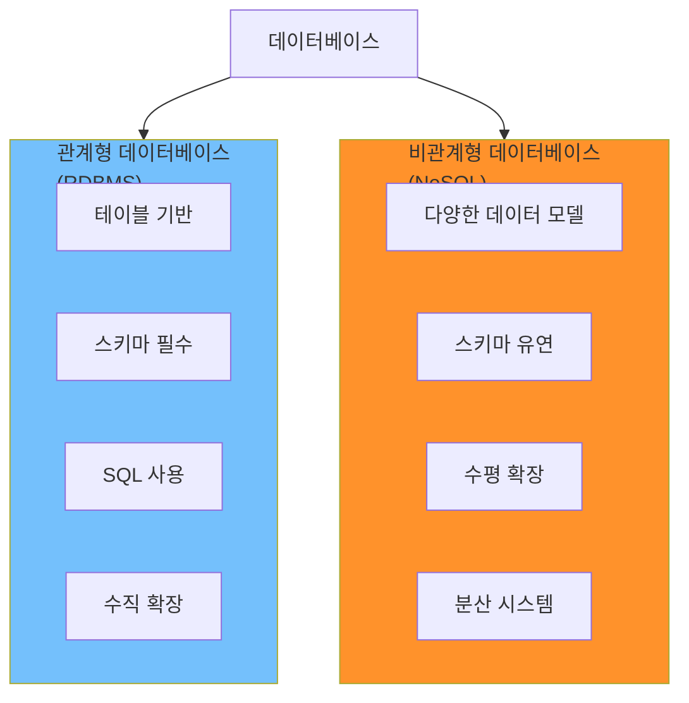
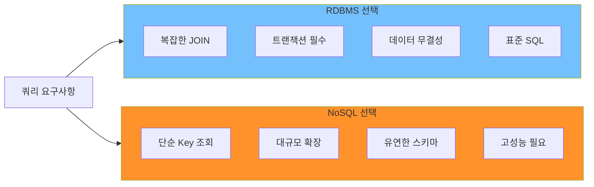
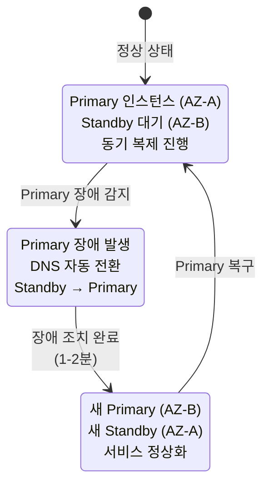
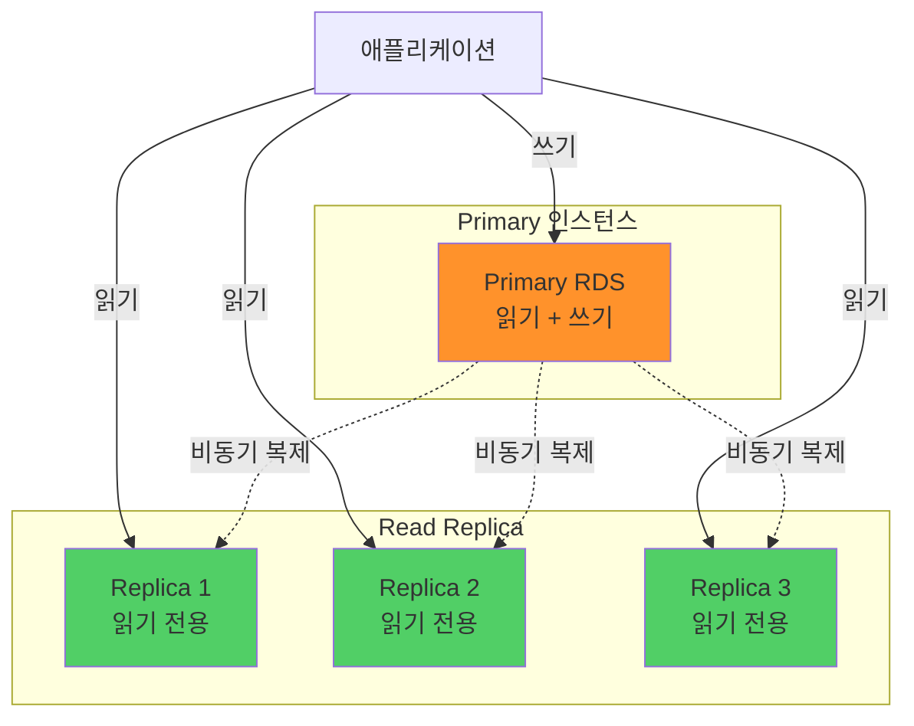
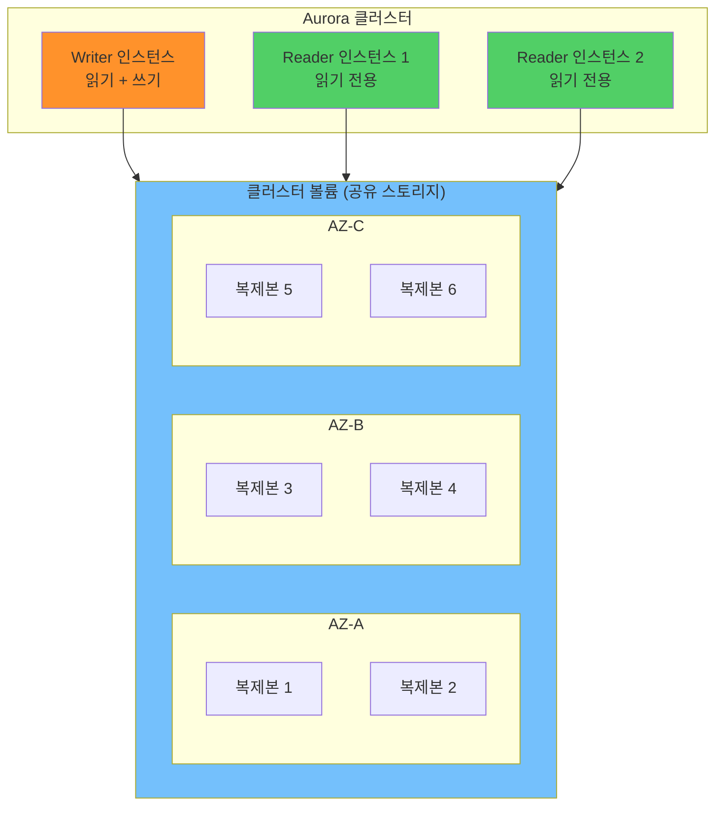
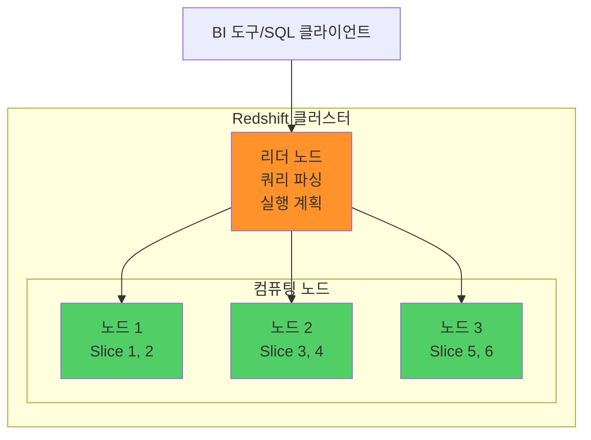
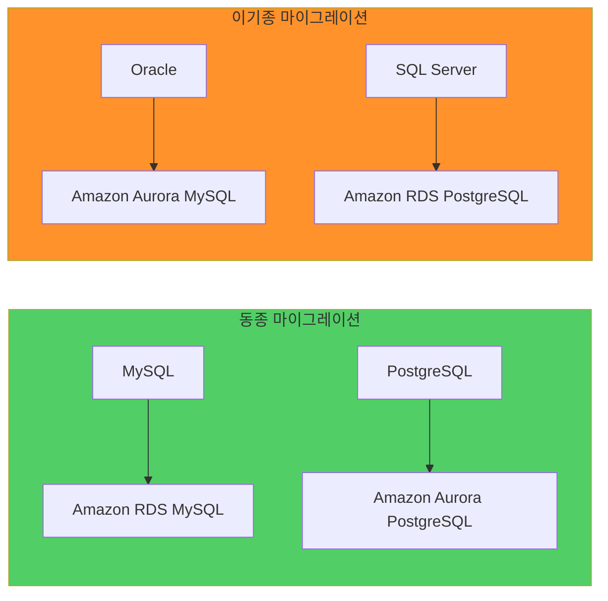

## 전체 흐름 요약

이번 학습에서는 AWS의 **데이터베이스 서비스**를 중심으로 관계형 데이터베이스(RDS, Aurora), NoSQL 데이터베이스(DynamoDB), 데이터 웨어하우스(Redshift), 그리고 데이터베이스 마이그레이션 방법을 학습합니다.

**Part 1 - 데이터베이스 기초**에서는 관계형 데이터베이스(RDBMS)와 비관계형 데이터베이스(NoSQL)의 차이를 이해합니다. 테이블과 스키마 기반의 SQL 데이터베이스와, 유연한 데이터 구조를 가진 NoSQL의 특징을 비교하고, 각각의 확장 방식(수직 vs 수평)과 사용 사례를 학습합니다.

**Part 2 - Amazon RDS**에서는 AWS의 관리형 관계형 데이터베이스 서비스를 학습합니다. MySQL, PostgreSQL, Oracle, SQL Server 등 다양한 엔진 지원, Multi-AZ 배포를 통한 고가용성, Read Replica를 통한 읽기 성능 향상, 자동 백업 및 특정 시점 복원(PITR), 유지보수 자동화 등 RDS의 핵심 기능을 다룹니다.

**Part 3 - Amazon Aurora**에서는 MySQL과 PostgreSQL 호환 클라우드 네이티브 데이터베이스를 학습합니다. 3개 AZ에 6개 복제본을 유지하는 높은 내결함성, 클러스터 볼륨 공유 아키텍처, 쿼럼 모델을 통한 복제 관리, Aurora Serverless를 통한 자동 확장 등 Aurora만의 고급 기능을 이해합니다.

**Part 4 - Amazon DynamoDB**에서는 AWS의 완전관리형 NoSQL 데이터베이스를 학습합니다. Key-Value 데이터 모델, 파티션 키와 정렬 키 개념, 서버리스 특성, 10ms 미만의 일관된 성능, 프로비저닝 모드와 온디맨드 모드, 자동 백업 및 특정 시점 복원 기능을 다룹니다.

**Part 5 - Amazon Redshift**에서는 페타바이트 규모의 데이터 웨어하우스 서비스를 학습합니다. 열 지향 스토리지, 대규모 데이터 분석, 리더 노드와 컴퓨팅 노드 아키텍처, S3와의 통합을 통한 데이터 레이크 구축 방법을 이해합니다.

**Part 6 - 데이터베이스 마이그레이션**에서는 온프레미스 또는 다른 클라우드에서 AWS로 데이터베이스를 마이그레이션하는 방법을 학습합니다. AWS DMS(Database Migration Service)를 활용한 최소 다운타임 마이그레이션, 동종 및 이기종 마이그레이션, 지속적 데이터 복제(CDC) 기능을 다룹니다.

이번 섹션을 통해 다양한 데이터베이스 워크로드에 적합한 AWS 데이터베이스 서비스를 선택하고, 고가용성과 확장성을 갖춘 데이터베이스 아키텍처를 설계할 수 있습니다.

---

## 주요 개념 요약표

| 구분 | RDS | Aurora | DynamoDB | Redshift |
|------|-----|--------|----------|----------|
| **타입** | 관계형 (RDBMS) | 관계형 (RDBMS) | NoSQL (Key-Value) | 데이터 웨어하우스 |
| **엔진** | MySQL, PostgreSQL, Oracle, SQL Server, MariaDB | MySQL/PostgreSQL 호환 | 독자 엔진 | 독자 엔진 |
| **확장 방식** | 수직 확장 (인스턴스 크기) | 수직 + 자동 스토리지 | 수평 확장 (자동) | 수평 확장 (노드 추가) |
| **고가용성** | Multi-AZ (2개 AZ) | 3개 AZ, 6개 복제본 | 3개 AZ 자동 복제 | Multi-AZ (선택) |
| **읽기 확장** | Read Replica (최대 15개) | Read Replica (최대 15개) | DAX 캐싱 | - |
| **성능** | 표준 RDBMS 성능 | MySQL 5배, PostgreSQL 3배 | 10ms 미만 지연 | 페타바이트급 분석 |
| **관리** | 관리형 (패치 자동) | 관리형 (패치 자동) | 완전 관리형 (서버리스) | 관리형 |
| **백업** | 자동 백업 (35일) | 자동 백업 (35일) | 자동 백업 (PITR) | 자동 스냅샷 |
| **사용 사례** | 웹 앱, ERP, CRM | 고성능 트랜잭션 | 모바일, 게임, IoT | 비즈니스 인텔리전스, 분석 |
| **과금** | 인스턴스 시간 + 스토리지 | 인스턴스 시간 + I/O | 처리량(RCU/WCU) + 스토리지 | 노드 시간 + 스토리지 |

---

## Part 1: 데이터베이스 기초

### 1.1. 데이터베이스 개요

**데이터베이스(Database)**는 검색이나 등록을 쉽게 할 수 있게 정리된 데이터의 집합체입니다.

**데이터베이스 분류:**



---

### 1.2. 관계형 데이터베이스 (RDBMS)

**관계형 데이터베이스는 테이블 단위로 데이터를 관리하며, 정형화된 스키마를 사용합니다.**

```
핵심 특징:

1. 테이블 구조:
   - 행(Row): 개별 레코드
   - 열(Column): 속성/필드
   - 스키마: 데이터 타입, 제약 조건 정의

2. 관계 (Relationship):
   - 외래 키(Foreign Key)로 테이블 연결
   - 정규화를 통한 데이터 중복 제거
   - JOIN 연산으로 관련 데이터 조회

3. SQL (Structured Query Language):
   - 표준 쿼리 언어
   - DDL, DML, DCL 명령어
   - 복잡한 쿼리 및 집계 가능

4. ACID 속성:
   - Atomicity (원자성): 트랜잭션 All or Nothing
   - Consistency (일관성): 데이터 무결성 유지
   - Isolation (격리성): 동시 트랜잭션 간섭 방지
   - Durability (지속성): 영구 저장 보장

5. 수직 확장 (Scale-Up):
   - CPU, 메모리, 디스크 증설
   - 단일 서버 성능 향상
   - 확장 한계 존재
```

**예시 스키마:**

```sql
-- 사용자 테이블
CREATE TABLE users (
    user_id INT PRIMARY KEY,
    username VARCHAR(50) NOT NULL,
    email VARCHAR(100) UNIQUE,
    created_at TIMESTAMP DEFAULT CURRENT_TIMESTAMP
);

-- 주문 테이블 (외래 키로 users 테이블 참조)
CREATE TABLE orders (
    order_id INT PRIMARY KEY,
    user_id INT NOT NULL,
    order_date TIMESTAMP,
    total_amount DECIMAL(10,2),
    FOREIGN KEY (user_id) REFERENCES users(user_id)
);

-- JOIN 쿼리
SELECT 
    u.username,
    o.order_id,
    o.total_amount
FROM users u
INNER JOIN orders o ON u.user_id = o.user_id
WHERE o.order_date >= '2025-01-01';
```

---

### 1.3. 비관계형 데이터베이스 (NoSQL)

**NoSQL 데이터베이스는 유연한 스키마와 수평 확장이 가능한 분산 시스템입니다.**

```
핵심 특징:

1. 다양한 데이터 모델:
   - Key-Value: Redis, DynamoDB
   - Document: MongoDB, DocumentDB
   - Column Family: Cassandra, HBase
   - Graph: Neo4j, Neptune

2. 스키마 유연성:
   - 스키마 정의 불필요
   - 필드 추가/삭제 자유
   - 비정형 데이터 저장 가능

3. 수평 확장 (Scale-Out):
   - 서버 추가로 용량 확장
   - 데이터 샤딩 (Sharding)
   - 무제한 확장 가능

4. BASE 속성:
   - Basically Available: 기본 가용성
   - Soft state: 유연한 일관성
   - Eventually consistent: 최종 일관성

5. 고성능:
   - 단순 쿼리에 최적화
   - 낮은 지연 시간
   - 높은 처리량
```

**NoSQL 데이터 모델 예시:**

```json
// Key-Value (DynamoDB)
{
  "user_id": "12345",
  "username": "john_doe",
  "email": "john@example.com",
  "preferences": {
    "theme": "dark",
    "language": "ko"
  },
  "tags": ["premium", "verified"]
}

// 장점: 스키마 변경 없이 필드 추가 가능
{
  "user_id": "67890",
  "username": "jane_smith",
  "email": "jane@example.com",
  "phone": "+82-10-1234-5678",  // 새로운 필드
  "address": {                   // 새로운 객체
    "city": "Seoul",
    "country": "Korea"
  }
}
```

---

### 1.4. RDBMS vs NoSQL 비교

**선택 기준:**



| 구분 | RDBMS | NoSQL |
|------|-------|-------|
| **데이터 구조** | 테이블 (행, 열) | Key-Value, Document 등 |
| **스키마** | 고정 스키마 필수 | 유연한 스키마 |
| **관계** | 외래 키로 관계 정의 | 중첩 데이터 또는 참조 |
| **쿼리** | SQL (복잡한 JOIN 가능) | API 호출 (단순 쿼리) |
| **확장** | 수직 확장 (한계 있음) | 수평 확장 (무제한) |
| **트랜잭션** | ACID 보장 | BASE (최종 일관성) |
| **일관성** | 강력한 일관성 | 최종 일관성 (선택 가능) |
| **사용 사례** | ERP, CRM, 금융 시스템 | 소셜 미디어, IoT, 실시간 분석 |
| **AWS 서비스** | RDS, Aurora | DynamoDB, DocumentDB, ElastiCache |

---

## Part 2: Amazon RDS

### 2.1. RDS 개요

**Amazon RDS (Relational Database Service)**는 클라우드에서 관계형 데이터베이스를 쉽게 설정, 운영 및 확장할 수 있는 관리형 서비스입니다.

**지원 엔진:**

```
1. 상용 엔진:
   - Oracle Database
   - Microsoft SQL Server
   - IBM DB2

2. 오픈소스 엔진:
   - MySQL (가장 인기)
   - MariaDB (MySQL 호환)
   - PostgreSQL (고급 기능)

3. 클라우드 전용:
   - Amazon Aurora (MySQL/PostgreSQL 호환)
```

**RDS의 핵심 가치:**

```
관리형 서비스 = AWS가 운영 부담 처리

사용자 책임:
- 스키마 설계
- 쿼리 최적화
- 애플리케이션 로직

AWS 책임:
- 하드웨어 프로비저닝
- 데이터베이스 설정
- 패치 및 백업
- 장애 조치 (Failover)
- 인프라 관리

→ 개발자는 애플리케이션에만 집중 가능
```

---

### 2.2. RDS 인스턴스

#### 인스턴스 유형

**RDS는 다양한 인스턴스 타입을 제공하여 워크로드에 맞는 성능을 선택할 수 있습니다.**

```
인스턴스 클래스:

1. 범용 (T, M 클래스):
   - T: 버스트 가능, 개발/테스트
     예: db.t3.micro, db.t4g.medium
   - M: 균형 잡힌 성능, 프로덕션
     예: db.m6i.large, db.m6g.xlarge

2. 메모리 최적화 (R, X 클래스):
   - R: 높은 메모리, 대규모 데이터
     예: db.r6i.2xlarge, db.r6g.4xlarge
   - X: 초대형 메모리, 인메모리 DB
     예: db.x2iedn.32xlarge

3. 컴퓨팅 최적화 (C 클래스):
   - 고성능 CPU, 쓰기 집약적
     예: db.c6i.4xlarge

인스턴스 크기:
- micro, small, medium
- large, xlarge, 2xlarge
- 4xlarge, 8xlarge, 16xlarge

유연한 수직 확장:
- 언제든지 인스턴스 타입 변경 가능
- 변경 시 짧은 다운타임 발생 (수 분)
- Multi-AZ 사용 시 다운타임 최소화
```

---

#### 스토리지 타입

```
1. General Purpose SSD (gp3, gp2):
   - 균형 잡힌 성능과 비용
   - gp3: 3,000 IOPS 기본, 최대 16,000 IOPS
   - gp2: 볼륨 크기에 비례 IOPS (100GB = 300 IOPS)
   - 대부분의 워크로드에 적합

2. Provisioned IOPS SSD (io1, io2):
   - 고성능, 낮은 지연 시간
   - io2: 최대 64,000 IOPS
   - io1: 최대 40,000 IOPS
   - 트랜잭션 집약적 애플리케이션

3. Magnetic (표준 스토리지):
   - 레거시, 신규 사용 비권장
   - 낮은 비용, 낮은 성능

스토리지 자동 확장:
- 활성화 시 자동으로 용량 증가
- 최대 스토리지 임계값 설정
- 무중단 확장
```

---

### 2.3. RDS 고가용성: Multi-AZ

**Multi-AZ 배포는 자동 장애 조치를 통해 고가용성을 제공합니다.**

**Multi-AZ 아키텍처:**



**Multi-AZ 동작 방식:**

```
정상 상태:
┌─────────────────┐      동기 복제      ┌─────────────────┐
│   AZ-A (서울)   │ ──────────────────> │   AZ-C (서울)   │
│                 │                     │                 │
│  Primary RDS    │  실시간 데이터 복제  │  Standby RDS    │
│  (Active)       │                     │  (Passive)      │
└─────────────────┘                     └─────────────────┘
        ↑
        │
   애플리케이션
   (db1.abc.rds.amazonaws.com)

장애 발생:
┌─────────────────┐                     ┌─────────────────┐
│   AZ-A (서울)   │                     │   AZ-C (서울)   │
│                 │                     │                 │
│  Primary RDS    │  ✗ 장애 발생        │  Standby RDS    │
│  (Failed) ✗     │                     │  → Primary 승격 │
└─────────────────┘                     └─────────────────┘
                                                ↑
                                                │
                                      DNS 자동 전환
                                   (db1.abc.rds.amazonaws.com)

장애 조치 완료:
                                        ┌─────────────────┐
                                        │   AZ-C (서울)   │
                                        │                 │
   애플리케이션 ────────────────────────> │  New Primary    │
   (연결 끊김 없음)                      │  (Active)       │
                                        └─────────────────┘
```

**Multi-AZ 특징:**

```
1. 동기식 복제:
   - Primary에 쓴 데이터가 즉시 Standby로 복제
   - 데이터 손실 없음 (RPO = 0)
   - 약간의 쓰기 지연 증가 (네트워크 왕복)

2. 자동 장애 조치:
   - Primary 인스턴스 장애 감지
   - 1-2분 내 Standby로 자동 전환
   - RTO (Recovery Time Objective) = 1-2분

3. DNS 엔드포인트:
   - db1.abc.region.rds.amazonaws.com
   - 장애 조치 시 DNS 자동 업데이트
   - 애플리케이션 코드 변경 불필요

4. 유지보수 최소화:
   - OS 패치 시 Standby 먼저 적용
   - Standby를 Primary로 승격
   - 기존 Primary 패치 후 Standby로 전환
   - 다운타임 최소화

5. 백업 영향 없음:
   - Standby에서 백업 수행
   - Primary 성능 영향 없음

비용:
- Multi-AZ 활성화 시 인스턴스 비용 2배
- Standby는 읽기 불가 (순수 대기)
- 프로덕션 환경에서 필수
```

---

### 2.4. RDS 읽기 성능: Read Replica

**Read Replica는 읽기 전용 복제본을 생성하여 읽기 부하를 분산합니다.**

**Read Replica 아키텍처:**



**Read Replica 특징:**

```
1. 비동기 복제:
   - Primary에서 Replica로 비동기 복제
   - 약간의 복제 지연 (Replication Lag)
   - 일반적으로 수 초 이내

2. 읽기 전용:
   - SELECT 쿼리만 가능
   - INSERT, UPDATE, DELETE 불가
   - 독립적인 엔드포인트 제공

3. 확장성:
   - 최대 15개 Read Replica 생성
   - 리전 내 또는 교차 리전 가능
   - Replica에서 또 다른 Replica 생성 가능 (Chaining)

4. 사용 사례:
   - 읽기 집약적 애플리케이션
   - 보고서 및 분석 쿼리
   - 비즈니스 인텔리전스 (BI)
   - Primary 부하 분산

5. 승격 (Promotion):
   - Read Replica를 독립 DB 인스턴스로 승격
   - 재해 복구 시나리오
   - 리전 간 마이그레이션

비용:
- Replica 인스턴스별 비용 발생
- 같은 리전: 데이터 전송 무료
- 교차 리전: 데이터 전송 비용 발생
```

---

### 2.5. Multi-AZ vs Read Replica

**두 기능은 목적이 다르며, 함께 사용할 수 있습니다.**

| 구분 | Multi-AZ | Read Replica |
|------|----------|--------------|
| **목적** | 고가용성 (HA) | 읽기 성능 확장 |
| **복제 방식** | 동기식 | 비동기식 |
| **Standby 읽기** | 불가 (순수 대기) | 가능 (읽기 전용) |
| **자동 장애 조치** | 지원 | 미지원 (수동 승격) |
| **엔드포인트** | Primary와 동일 (DNS 자동 전환) | 별도 엔드포인트 |
| **최대 개수** | 1개 Standby | 15개 Replica |
| **데이터 지연** | 없음 (동기) | 수 초 (비동기) |
| **리전 지원** | 동일 리전 내 다른 AZ | 교차 리전 가능 |
| **사용 시나리오** | 장애 대비, 다운타임 최소화 | 읽기 부하 분산, 지역별 서비스 |
| **비용** | 인스턴스 2배 | Replica 개수만큼 |

**함께 사용하는 아키텍처:**

```
                  ┌───────────────────┐
                  │  Primary (AZ-A)   │ ← 쓰기
                  │  Multi-AZ: ON     │
                  └─────────┬─────────┘
                            │
                            │ 동기 복제
                            ↓
                  ┌───────────────────┐
                  │  Standby (AZ-C)   │ ← 대기
                  │  (읽기 불가)       │
                  └───────────────────┘
                  
                  ┌───────────────────┐
                  │  Primary (AZ-A)   │
                  └─────────┬─────────┘
                            │
                ┌───────────┼───────────┐
                │           │           │
                │ 비동기    │ 비동기    │ 비동기
                ↓           ↓           ↓
        ┌───────────┐ ┌───────────┐ ┌───────────┐
        │ Replica 1 │ │ Replica 2 │ │ Replica 3 │ ← 읽기
        │  (AZ-A)   │ │  (AZ-C)   │ │ 도쿄 리전 │
        └───────────┘ └───────────┘ └───────────┘

장점:
- Multi-AZ: 고가용성 보장
- Read Replica: 읽기 성능 확장
- 최고 수준의 가용성과 확장성
```

---

### 2.6. RDS 백업

**RDS는 자동 백업과 수동 스냅샷을 모두 지원합니다.**

#### 자동 백업

```
설정:
- 보존 기간: 0~35일 (기본 7일)
- 0으로 설정 시 자동 백업 비활성화
- 백업 시간대 지정 가능

동작 방식:
1. 첫 번째 백업: 전체 스냅샷
2. 이후 백업: 증분식 (변경분만 저장)
3. Multi-AZ: Standby에서 백업 (Primary 영향 없음)

특정 시점 복원 (PITR):
- Point-in-Time Recovery
- 보존 기간 내 임의 시점으로 복원
- 최소 5분 전까지 복원 가능
- 트랜잭션 로그 기반

예시:
- 백업 보존: 7일
- 현재 시각: 2025-12-09 15:00
- 복원 가능: 2025-12-02 00:00 ~ 2025-12-09 14:55
```

#### 수동 스냅샷

```
특징:
- 사용자가 수동으로 생성
- 보존 기간 제한 없음 (영구 보관)
- 35일 이상 백업 필요 시 사용
- 리전 간 복사 가능

사용 사례:
- 프로덕션 배포 전 백업
- 장기 보관 요구사항
- 규정 준수
- 재해 복구 계획

비용:
- 스냅샷 저장 비용 발생
- S3와 유사한 가격
- gp2: $0.095/GB/월 (서울 리전)
```

---

### 2.7. RDS 보안

**RDS는 다양한 보안 기능을 제공합니다.**

```
1. 네트워크 격리:
   - VPC 내 배포
   - Security Group으로 접근 제어
   - NACL 추가 제어
   - 퍼블릭 액세스 비활성화 권장

Security Group 예시:
Type: MySQL/Aurora
Protocol: TCP
Port: 3306
Source: 10.0.1.0/24 (애플리케이션 서브넷)

2. 암호화:
   - 저장 데이터 암호화 (KMS)
   - 전송 중 암호화 (SSL/TLS)
   - 암호화 활성화 시 백업/스냅샷도 암호화

3. IAM 인증:
   - 데이터베이스 비밀번호 대신 IAM 토큰 사용
   - 15분 유효 토큰
   - MySQL, PostgreSQL, Aurora 지원

4. Enhanced Monitoring:
   - 실시간 OS 메트릭
   - 프로세스 목록
   - CPU, 메모리, 디스크 I/O

5. Performance Insights:
   - 쿼리 성능 분석
   - 대기 이벤트 추적
   - 병목 지점 파악
```

---

### 2.8. RDS 유지보수

**AWS가 자동으로 데이터베이스 유지보수를 수행합니다.**

```
유지보수 항목:

1. OS 패치:
   - 보안 패치 자동 적용
   - 유지보수 시간대에 수행

2. 데이터베이스 엔진 업데이트:
   - 마이너 버전: 자동 적용 가능
   - 메이저 버전: 수동 업그레이드 필요

3. 유지보수 시간대 설정:
   - 주 단위 4시간 창
   - 예: 화요일 03:00-07:00 (KST)
   - 트래픽이 적은 시간대 선택

다운타임 최소화:
- Multi-AZ: 수 초 다운타임
- Single-AZ: 수 분 다운타임

유지보수 연기:
- 최대 1주일까지 연기 가능
- 중요 패치는 강제 적용
```

---

## Part 3: Amazon Aurora

### 3.1. Aurora 개요

**Amazon Aurora**는 MySQL 및 PostgreSQL과 호환되는 클라우드 네이티브 관계형 데이터베이스입니다.

**Aurora의 혁신:**

```
MySQL 대비:
- 5배 빠른 성능
- 1/10 비용

PostgreSQL 대비:
- 3배 빠른 성능
- 1/10 비용

핵심 차별점:
1. 클라우드 네이티브 아키텍처
2. 스토리지와 컴퓨팅 분리
3. 3개 AZ에 6개 복제본
4. 10GB 단위 자동 확장 (최대 128TB)
5. 읽기 성능 최적화
```

---

### 3.2. Aurora 아키텍처

**Aurora 클러스터 구조:**



**Aurora vs 일반 RDS 비교:**

```
일반 RDS:
┌───────────────┐
│ RDS 인스턴스  │
├───────────────┤
│ 데이터베이스  │
├───────────────┤
│ EBS 스토리지  │  ← 인스턴스마다 독립적인 스토리지
└───────────────┘

Aurora:
┌───────────────┐  ┌───────────────┐  ┌───────────────┐
│ Writer 인스턴스│  │ Reader 인스턴스│  │ Reader 인스턴스│
└───────┬───────┘  └───────┬───────┘  └───────┬───────┘
        │                  │                  │
        └──────────────────┴──────────────────┘
                           ↓
                ┌─────────────────────┐
                │  클러스터 볼륨      │  ← 모든 인스턴스가 공유
                │  (3 AZ, 6 복제본)  │
                └─────────────────────┘

장점:
- 스토리지 복제 불필요 (공유)
- 빠른 장애 조치
- 자동 스토리지 확장
- 스토리지 비용 절감
```

---

### 3.3. Aurora 고가용성

**Aurora는 여러 계층에서 고가용성을 제공합니다.**

```
1. 스토리지 레벨:
   - 3개 AZ에 6개 복제본
   - 쿼럼 모델: 쓰기 4/6, 읽기 3/6
   - 2개 복제본 손실까지 쓰기 가능
   - 3개 복제본 손실까지 읽기 가능

쿼럼 모델 예시:
쓰기 요청:
- 6개 복제본 중 4개에 쓰기 완료 시 성공
- 2개 복제본 실패해도 계속 운영 가능

읽기 요청:
- 6개 복제본 중 3개에서 읽기 가능
- 3개 복제본 실패해도 계속 운영 가능

2. 인스턴스 레벨:
   - Writer 장애 시 Reader가 자동 승격
   - 장애 조치 시간: 30초 이내
   - 우선순위 설정 가능 (Tier 0-15)

3. 자가 치유 (Self-Healing):
   - 손상된 블록 자동 감지
   - S3 백업에서 자동 복구
   - 사용자 개입 불필요

4. 백트랙 (Backtrack):
   - 특정 시점으로 빠른 복원
   - 전체 백업/복원 불필요
   - 수 분 내 복원 완료
   - MySQL 호환 버전만 지원
```

---

### 3.4. Aurora Read Replica

**Aurora의 Read Replica는 RDS보다 더 강력합니다.**

```
특징:

1. 동일 스토리지 공유:
   - 복제 지연 최소화 (수 ms)
   - 일반 RDS보다 훨씬 빠름

2. 자동 장애 조치:
   - Reader가 Writer로 자동 승격
   - 우선순위(Priority) 설정 가능

우선순위 예시:
Tier 0: reader-1 (최우선 승격)
Tier 1: reader-2
Tier 15: reader-3 (마지막 승격)

3. 엔드포인트:
   - Writer Endpoint: 쓰기 전용
   - Reader Endpoint: 모든 Reader로 자동 분산
   - Custom Endpoint: 특정 Reader 그룹 지정

4. 최대 15개 Replica:
   - Writer 1개 + Reader 15개
   - 읽기 성능 무제한 확장

5. Aurora Auto Scaling:
   - 부하에 따라 Reader 자동 증감
   - CPU 사용률 기반
   - 최소/최대 Reader 설정

Auto Scaling 설정 예시:
- 최소 Reader: 2개
- 최대 Reader: 10개
- 목표 CPU: 70%
- Scale-out: CPU > 70% 5분 유지
- Scale-in: CPU < 40% 15분 유지
```

---

### 3.5. Aurora Serverless

**Aurora Serverless는 자동으로 데이터베이스 용량을 조정하는 온디맨드 구성입니다.**

```
특징:

1. 자동 시작/종료:
   - 사용하지 않을 때 자동 종료
   - 연결 시 자동 시작

2. 자동 확장:
   - ACU (Aurora Capacity Unit) 기반
   - 1 ACU = 2GB RAM + CPU
   - 최소/최대 ACU 설정

3. 사용 사례:
   - 간헐적 워크로드
   - 개발/테스트 환경
   - 신규 애플리케이션
   - 예측 불가능한 워크로드

4. 비용 효율:
   - 사용한 ACU x 시간만 과금
   - 유휴 시간 비용 없음

버전:
- v1: MySQL 5.6, PostgreSQL 10.x
- v2: MySQL 5.7+, PostgreSQL 13+ (권장)

v2 개선사항:
- 더 빠른 확장 (수 초)
- 세밀한 ACU 단위 (0.5 ACU)
- 다중 AZ 지원
- Read Replica 지원
```

---

## Part 4: Amazon DynamoDB

### 4.1. DynamoDB 개요

**Amazon DynamoDB**는 완전관리형 NoSQL 데이터베이스 서비스로, Key-Value 및 Document 데이터 모델을 지원합니다.

**DynamoDB 핵심 특징:**

```
1. 서버리스:
   - 서버 관리 불필요
   - 프로비저닝 불필요
   - 자동 확장

2. 고성능:
   - 10ms 미만 지연 시간
   - 무제한 처리량
   - 수백만 TPS 지원

3. 완전 관리형:
   - 자동 백업
   - 자동 스케일링
   - 다중 AZ 복제

4. 유연한 스키마:
   - 스키마 정의 불필요
   - 각 항목이 다른 속성 가능
   - 동적 속성 추가/제거
```

---

### 4.2. DynamoDB 데이터 모델

**DynamoDB는 테이블, 항목, 속성으로 구성됩니다.**

```
계층 구조:
Table (테이블)
  ├── Item (항목 = 행)
  │     ├── Attribute (속성 = 열)
  │     ├── Attribute
  │     └── Attribute
  ├── Item
  └── Item

필수 구성 요소:
- Primary Key (기본 키): 각 항목을 고유하게 식별

Primary Key 타입:
1. Partition Key (파티션 키):
   - 단일 속성
   - 해시 함수로 파티션 결정
   - 예: user_id

2. Composite Key (복합 키):
   - Partition Key + Sort Key
   - 같은 파티션 내에서 정렬
   - 예: user_id (파티션) + timestamp (정렬)
```

**데이터 예시:**

```json
// 파티션 키만 사용 (Simple Primary Key)
Table: Users
{
  "user_id": "12345",           // Partition Key
  "username": "john_doe",
  "email": "john@example.com",
  "age": 30
}

// 복합 키 사용 (Composite Primary Key)
Table: GameScores
{
  "user_id": "12345",           // Partition Key
  "game_date": "2025-12-09",    // Sort Key
  "score": 9850,
  "level": 42
}

// 같은 user_id로 여러 게임 기록 저장 가능
{
  "user_id": "12345",           // 동일한 Partition Key
  "game_date": "2025-12-08",    // 다른 Sort Key
  "score": 8200,
  "level": 38
}
```

---

### 4.3. DynamoDB 파티션 키

**파티션 키는 데이터 저장 위치와 검색 성능을 결정합니다.**

```
파티션 키의 역할:

1. 데이터 분산:
   - 해시 함수로 파티션 결정
   - 고르게 분산된 키 선택 중요

좋은 파티션 키:
✓ user_id: 사용자마다 고유, 고르게 분산
✓ device_id: IoT 기기 ID, 고르게 분산
✓ session_id: 세션마다 고유

나쁜 파티션 키:
✗ status: "active", "inactive" (2개 값만)
✗ date: "2025-12-09" (핫 파티션 발생)
✗ country: "KR", "US" (일부 값에 편중)

2. 데이터 검색:
   - Partition Key는 필수
   - Sort Key는 선택적
   - 둘 다 없으면 Scan (비효율적)

쿼리 예시:
Query (효율적):
- 조건: user_id = "12345"
- 결과: 해당 파티션만 검색

Scan (비효율적):
- 조건: age > 30
- 결과: 전체 테이블 스캔
```

---

### 4.4. DynamoDB 처리량

**DynamoDB는 읽기/쓰기 용량 단위로 처리량을 관리합니다.**

```
용량 단위:

RCU (Read Capacity Unit):
- 1 RCU = 강력한 일관된 읽기 4KB/초
- 1 RCU = 최종 일관된 읽기 8KB/초

예시:
- 10KB 항목 읽기 (강력한 일관성): 3 RCU
- 10KB 항목 읽기 (최종 일관성): 1.5 RCU

WCU (Write Capacity Unit):
- 1 WCU = 1KB 쓰기/초

예시:
- 3KB 항목 쓰기: 3 WCU
- 0.5KB 항목 쓰기: 1 WCU (최소)

용량 모드:

1. Provisioned Mode (프로비저닝):
   - RCU/WCU를 미리 예약
   - 예측 가능한 워크로드
   - 비용 절감 (Auto Scaling 활용)

설정 예시:
- Read: 100 RCU
- Write: 50 WCU
- Auto Scaling: CPU > 70% 시 증가

2. On-Demand Mode (온디맨드):
   - 용량 예약 불필요
   - 자동으로 확장/축소
   - 예측 불가능한 워크로드
   - 사용한 만큼만 과금

비용 비교 (서울 리전):
Provisioned: $0.00013/RCU/시간
On-Demand: $0.25/백만 읽기 요청

선택 기준:
- 안정적인 트래픽 → Provisioned
- 급격한 트래픽 변화 → On-Demand
```

---

## 추가 보충 설명 (Part 1)

### 1. RDS Multi-AZ 장애 조치 시나리오

```python
# 애플리케이션 코드 (변경 불필요)
import pymysql

# RDS 엔드포인트 (DNS)
endpoint = "mydb.abc123.ap-northeast-2.rds.amazonaws.com"

# 연결
connection = pymysql.connect(
    host=endpoint,
    user="admin",
    password="password",
    database="myapp"
)

# 정상 상태: Primary로 연결
# 장애 발생: DNS가 자동으로 Standby IP로 전환
# 애플리케이션은 재연결만 하면 됨
```

### 2. Aurora 클러스터 엔드포인트

```bash
# Writer Endpoint (쓰기)
mydb-cluster.cluster-abc123.ap-northeast-2.rds.amazonaws.com

# Reader Endpoint (읽기, 자동 로드밸런싱)
mydb-cluster.cluster-ro-abc123.ap-northeast-2.rds.amazonaws.com

# 개별 인스턴스 엔드포인트
mydb-instance-1.abc123.ap-northeast-2.rds.amazonaws.com
mydb-instance-2.abc123.ap-northeast-2.rds.amazonaws.com

# Custom Endpoint (특정 인스턴스 그룹)
mydb-analytics.cluster-custom-abc123.ap-northeast-2.rds.amazonaws.com
```

이 파일이 Section 7의 Part 1입니다. Part 2를 계속 작성할까요?
### 4.5. DynamoDB 고급 기능

#### Global Tables (글로벌 테이블)

**여러 리전에 걸쳐 완전 복제된 테이블을 생성합니다.**

```
특징:
- 다중 리전 복제
- 양방향 복제
- 활성-활성 구성
- 최종 일관성

사용 사례:
- 글로벌 애플리케이션
- 재해 복구
- 낮은 지연 시간 (로컬 액세스)

설정:
Seoul (Primary) ↔ Tokyo (Replica)
                 ↔ Singapore (Replica)
                 
모든 리전에서 읽기/쓰기 가능
```

#### DAX (DynamoDB Accelerator)

```
DAX = DynamoDB 전용 인메모리 캐시

성능:
- 밀리초 → 마이크로초 지연 시간
- 10배 성능 향상
- 읽기 집약적 워크로드 최적화

아키텍처:
애플리케이션 → DAX → DynamoDB

캐시 히트: DAX에서 즉시 반환
캐시 미스: DynamoDB 조회 → DAX 저장
```

#### Streams

```
DynamoDB Streams = 데이터 변경 캡처

특징:
- 테이블 변경사항 실시간 스트림
- 24시간 보존
- Lambda 트리거 가능

사용 사례:
- 실시간 분석
- 데이터 동기화
- 변경 이벤트 처리
```

---

## Part 5: Amazon Redshift

### 5.1. Redshift 개요

**Amazon Redshift**는 페타바이트 규모의 데이터 웨어하우스 서비스입니다.

```
특징:
- 열 지향 스토리지 (Columnar Storage)
- MPP (Massively Parallel Processing)
- SQL 쿼리 지원
- 압축 및 분산 처리

사용 사례:
- 비즈니스 인텔리전스 (BI)
- 데이터 분석 및 리포팅
- 대규모 데이터 집계
- 데이터 레이크 쿼리
```

---

### 5.2. Redshift 아키텍처



```
리더 노드:
- SQL 요청 수신
- 쿼리 파싱 및 최적화
- 실행 계획 생성
- 컴퓨팅 노드 조율

컴퓨팅 노드:
- 데이터 저장
- 쿼리 실행
- 병렬 처리
- 결과 집계
```

---

### 5.3. Redshift Spectrum

```
Redshift Spectrum = S3 데이터 직접 쿼리

특징:
- S3에 저장된 데이터 쿼리
- 데이터 이동 불필요
- Redshift + S3 통합 분석
- 페타바이트급 확장

아키텍처:
Redshift 테이블 (Hot 데이터)
    +
S3 외부 테이블 (Cold 데이터)
    ↓
통합 쿼리 가능
```

---

## Part 6: 데이터베이스 마이그레이션

### 6.1. AWS DMS

**AWS Database Migration Service**는 데이터베이스를 AWS로 마이그레이션하는 관리형 서비스입니다.

```
DMS 특징:
- 최소 다운타임
- 지속적 데이터 복제 (CDC)
- 동종/이기종 마이그레이션
- 무료 (소스 또는 대상이 AWS인 경우)

지원 소스:
- Oracle, SQL Server, MySQL, PostgreSQL
- MongoDB, SAP, DB2
- Azure SQL Database

지원 대상:
- RDS, Aurora, Redshift, DynamoDB, S3
```

**마이그레이션 유형:**



---

### 6.2. AWS SCT

**AWS Schema Conversion Tool**은 이기종 마이그레이션 시 스키마를 자동 변환합니다.

```
SCT 기능:
- 스키마 자동 변환
- 코드 변환 (프로시저, 함수)
- 평가 보고서 생성

예시:
Oracle → Aurora PostgreSQL
- 테이블 구조 변환
- 데이터 타입 매핑
- PL/SQL → PL/pgSQL
```

---

## Part 7: 기타 데이터베이스 서비스

### 7.1. Amazon ElastiCache

```
ElastiCache = 관리형 인메모리 캐시

지원 엔진:
- Redis: 데이터 구조, 영속성, 클러스터
- Memcached: 단순 Key-Value, 멀티스레드

사용 사례:
- 데이터베이스 캐싱
- 세션 스토어
- 실시간 리더보드
```

---

### 7.2. 전문 데이터베이스

```
DocumentDB:
- MongoDB 호환
- JSON 문서 저장

Neptune:
- 그래프 데이터베이스
- 소셜 네트워크, 추천 시스템

QLDB:
- 원장 데이터베이스
- 변경 불가능한 이력

Timestream:
- 시계열 데이터베이스
- IoT, 모니터링
```

---

## 마무리

이번 섹션에서는 AWS 데이터베이스 서비스를 학습했습니다:

**RDS:** 관리형 관계형 DB, Multi-AZ, Read Replica
**Aurora:** 고성능 클라우드 네이티브, 6개 복제본
**DynamoDB:** NoSQL Key-Value, 서버리스, 10ms 지연
**Redshift:** 데이터 웨어하우스, 페타바이트급 분석
**DMS:** 데이터베이스 마이그레이션, 최소 다운타임

워크로드에 맞는 데이터베이스를 선택하고 고가용성 아키텍처를 설계할 수 있습니다.
