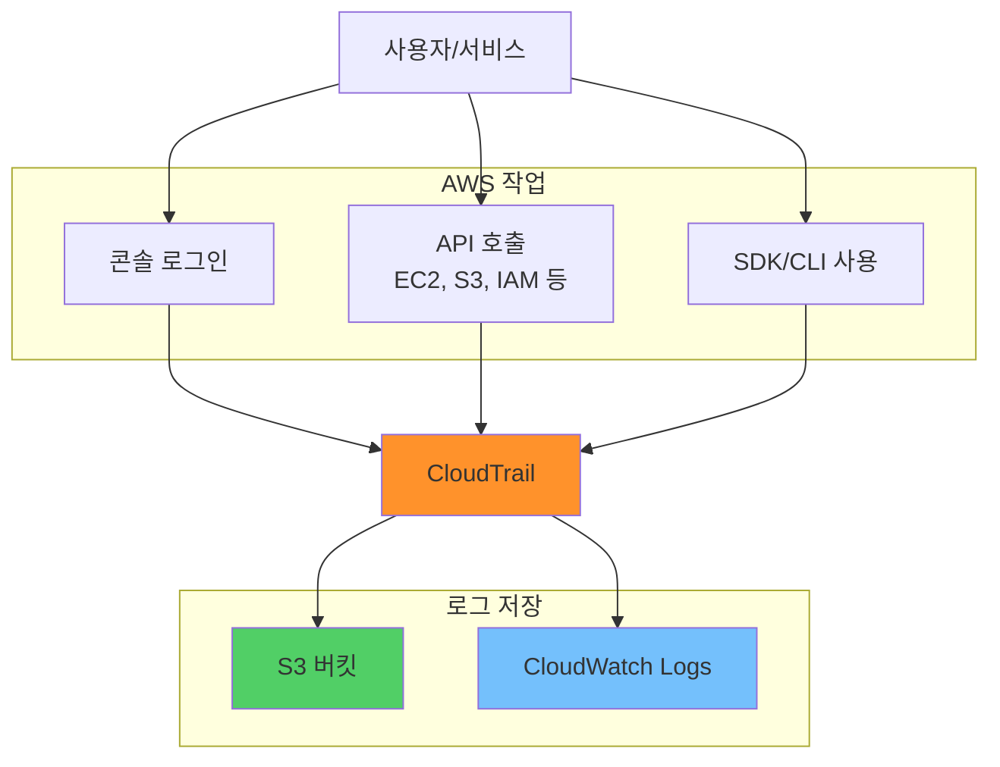
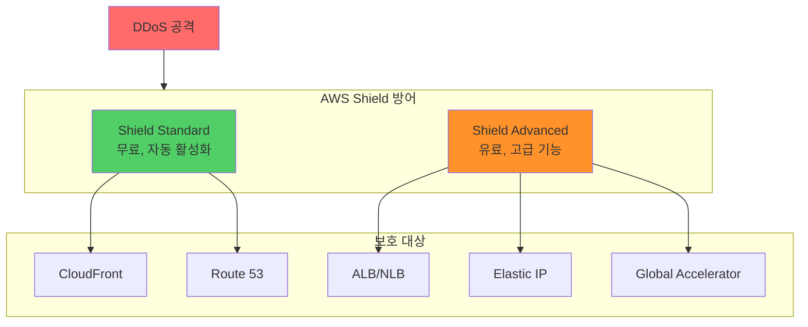
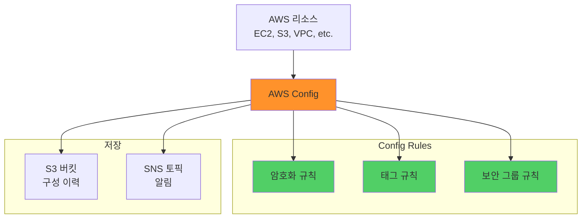
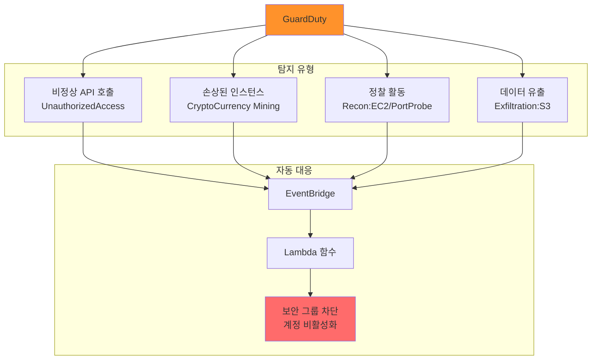

## 전체 흐름 요약

이번 학습에서는 AWS의 **보안 및 모니터링 서비스**와 **데이터 분석 서비스**를 학습합니다. 로그 수집부터 위협 탐지, 규정 준수, 데이터 레이크 구축까지 전반적인 운영 보안과 데이터 분석 아키텍처를 이해합니다.

**Part 1 - AWS 로그 수집**에서는 AWS 환경의 모든 활동을 추적하는 로깅 서비스를 학습합니다. CloudTrail을 통한 API 호출 기록(Who, When, What), VPC Flow Logs를 통한 네트워크 트래픽 분석, S3 액세스 로그, ELB 액세스 로그 등 다양한 로그 소스와 로그 보호 방법(암호화, 무결성 검증, 접근 제어)을 다룹니다.

**Part 2 - AWS Shield & WAF**에서는 DDoS 공격 방어와 웹 애플리케이션 방화벽을 학습합니다. AWS Shield Standard/Advanced를 통한 네트워크 계층 보호, AWS WAF를 통한 애플리케이션 계층 보호, Web ACL 규칙 설정, OWASP Top 10 대응, SQL Injection 및 XSS 공격 차단 방법을 이해합니다.

**Part 3 - AWS Config**에서는 리소스 구성 변경 추적과 규정 준수 관리를 학습합니다. 리소스 인벤토리 관리, Config Rules를 통한 자동 점검, 규정 준수/미준수 리소스 식별, 구성 변경 이력 추적 기능을 다룹니다.

**Part 4 - Amazon GuardDuty**에서는 지능형 위협 탐지 서비스를 학습합니다. 머신러닝 기반 위협 탐지, CloudTrail/VPC Flow Logs/DNS Logs 분석, 악성 활동 자동 감지, EventBridge를 통한 자동 대응 구성 방법을 이해합니다.

**Part 5 - 기타 보안 서비스**에서는 추가 보안 서비스를 학습합니다. Network Firewall(상태 저장 방화벽), Inspector(취약점 스캔), Security Hub(통합 보안 대시보드), Cognito(사용자 인증), Directory Service(Active Directory 통합) 등을 다룹니다.

**Part 6 - 데이터 분석 서비스**에서는 AWS의 데이터 레이크 및 분석 서비스를 학습합니다. Amazon Athena를 통한 S3 데이터 SQL 쿼리, AWS Glue를 통한 ETL 자동화, Amazon EMR을 통한 빅데이터 분산 처리, OpenSearch를 통한 로그 분석 및 시각화 방법을 이해합니다.

이번 섹션을 통해 보안 이벤트 탐지, 규정 준수 유지, 대규모 데이터 분석을 수행하는 종합적인 AWS 운영 아키텍처를 설계할 수 있습니다.

---

## 주요 개념 요약표

| 구분 | CloudTrail | WAF | GuardDuty | Config | Athena |
|------|-----------|-----|-----------|--------|---------|
| **목적** | API 호출 로깅 | 웹 공격 방어 | 위협 탐지 | 구성 관리 | 데이터 분석 |
| **대상** | AWS API 활동 | HTTP/HTTPS 트래픽 | 계정 전체 활동 | 리소스 구성 | S3 데이터 |
| **주요 기능** | Who, When, What | SQL Injection, XSS 차단 | ML 기반 이상 탐지 | 규정 준수 점검 | SQL 쿼리 |
| **적용 위치** | 계정 전체 | ALB, CloudFront, API GW | 계정/리전 | 리전별 | S3 |
| **로그 저장** | S3, CloudWatch Logs | CloudWatch Logs | 자체 관리 | 자체 관리 | 스키마 정의 |
| **실시간 탐지** | 미지원 | 지원 | 지원 | 지연 (수 분) | 쿼리 시점 |
| **비용** | 무료 (첫 추적), 이후 유료 | Web ACL + 규칙 | 계정당 과금 | 리소스당 과금 | 쿼리당 과금 |
| **사용 사례** | 감사, 규정 준수 | 웹 공격 방어 | 침해 사고 탐지 | 구성 표준화 | 로그 분석, BI |

---

## Part 1: AWS 로그 수집

### 1.1. 로그 수집의 중요성

**로그 수집은 보안 사고 대응, 문제 해결, 규정 준수의 핵심입니다.**

```
로그 수집 기본 원칙:

1. 최대한 오래, 많이 수집:
   - 법적 기준이 있다면 그 기준을 따름
   - 일반적으로 최소 90일 ~ 1년 이상 보존
   - 장기 보존 시 S3 Glacier로 비용 절감

2. 로그 보호 및 접근 제한:
   - 암호화 저장 (KMS 활용)
   - 위변조 방지 (CloudTrail 로그 파일 검증)
   - 권한 있는 사용자만 접근 (IAM 정책)
   - S3 객체 잠금 (Object Lock) 활용

3. 다양한 로그 활성화:
   - CloudTrail: API 호출 로그
   - VPC Flow Logs: 네트워크 트래픽
   - S3 액세스 로그: 버킷 접근 기록
   - ELB 액세스 로그: 로드밸런서 요청
   - CloudWatch Logs: 애플리케이션 로그
```

---

### 1.2. AWS CloudTrail

**AWS CloudTrail**은 AWS 계정의 모든 API 호출을 기록하는 서비스입니다.

**CloudTrail 핵심 개념:**



**CloudTrail이 기록하는 3가지 핵심 정보:**

```
1. Who (누가):
   - userIdentity: IAM 사용자, 역할, AWS 서비스
   - accountId: AWS 계정 ID
   - principalId: 고유 식별자
   - userName: 사용자 이름

2. When (언제):
   - eventTime: 이벤트 발생 시간 (UTC)
   - 예: "2025-12-09T15:30:45Z"

3. What (무엇을):
   - eventSource: AWS 서비스 (예: ec2.amazonaws.com)
   - eventName: API 작업 (예: StopInstances)
   - requestParameters: 요청 파라미터
   - responseElements: 응답 내용
   - sourceIPAddress: 요청 IP 주소
   - userAgent: 클라이언트 정보
```

**CloudTrail 로그 예시:**

```json
{
  "Records": [{
    "eventVersion": "1.08",
    "userIdentity": {
      "type": "IAMUser",
      "principalId": "AIDAI123456789EXAMPLE",
      "arn": "arn:aws:iam::123456789012:user/Alice",
      "accountId": "123456789012",
      "accessKeyId": "AKIAI123456789EXAMPLE",
      "userName": "Alice"
    },
    "eventTime": "2025-12-09T15:30:45Z",
    "eventSource": "ec2.amazonaws.com",
    "eventName": "StopInstances",
    "awsRegion": "ap-northeast-2",
    "sourceIPAddress": "203.0.113.45",
    "userAgent": "aws-cli/2.9.0",
    "requestParameters": {
      "instancesSet": {
        "items": [
          {"instanceId": "i-0abc123def456789"}
        ]
      },
      "force": false
    },
    "responseElements": {
      "instancesSet": {
        "items": [{
          "instanceId": "i-0abc123def456789",
          "currentState": {"code": 64, "name": "stopping"},
          "previousState": {"code": 16, "name": "running"}
        }]
      }
    }
  }]
}
```

**CloudTrail 활성화:**

```
추적(Trail) 생성:
- 추적 이름: my-organization-trail
- 적용 범위: 모든 리전 (권장) 또는 단일 리전
- 이벤트 타입:
  * 관리 이벤트 (Management Events): API 호출
  * 데이터 이벤트 (Data Events): S3 객체, Lambda 실행
  * Insights 이벤트: 비정상 활동 탐지

로그 저장 위치:
- S3 버킷: 장기 보존, 비용 효율
- CloudWatch Logs: 실시간 모니터링, 알람 설정

로그 파일 무결성 검증:
- 활성화 시 SHA-256 해시 생성
- 다이제스트 파일로 위변조 검증 가능
- 법적 증거 자료로 활용 가능

비용:
- 첫 번째 추적: 무료 (관리 이벤트)
- 추가 추적: $2.00/100,000 이벤트
- 데이터 이벤트: $0.10/100,000 이벤트
```

---

### 1.3. VPC Flow Logs

**VPC Flow Logs**는 VPC 내 네트워크 인터페이스를 오가는 IP 트래픽 정보를 기록합니다.

```
Flow Logs 수집 레벨:
- VPC: VPC 전체
- Subnet: 특정 서브넷
- ENI: 개별 네트워크 인터페이스

기록 내용:
- account-id: 계정 ID
- src_addr: 소스 IP 주소
- dst_addr: 대상 IP 주소
- src_port: 소스 포트
- dst_port: 대상 포트
- protocol: 프로토콜 번호 (6=TCP, 17=UDP)
- packets: 패킷 수
- bytes: 바이트 수
- action: ACCEPT 또는 REJECT
- log-status: OK, NODATA, SKIPDATA

로그 게시 대상:
- CloudWatch Logs: 실시간 모니터링
- S3: 장기 보존 및 분석
- Kinesis Data Firehose: 실시간 스트리밍

사용 사례:
- 네트워크 트래픽 패턴 분석
- 보안 그룹 규칙 검증
- 침입 시도 탐지
- 트래픽 비용 분석
```

**Flow Logs 예시:**

```
2 123456789012 eni-0abc123def456789 203.0.113.45 10.0.1.5 443 54321 6 25 4000 1670581800 1670581860 ACCEPT OK
2 123456789012 eni-0abc123def456789 192.0.2.100 10.0.1.5 22 12345 6 10 1200 1670581800 1670581860 REJECT OK

해석:
첫 번째 로그:
- 203.0.113.45:443 → 10.0.1.5:54321
- TCP (프로토콜 6)
- 25개 패킷, 4000바이트
- ACCEPT (허용됨)

두 번째 로그:
- 192.0.2.100:22 → 10.0.1.5:12345
- TCP
- 10개 패킷, 1200바이트
- REJECT (차단됨, Security Group 규칙)
```

---

### 1.4. 기타 로그 소스

#### S3 액세스 로그

```
S3 버킷 접근 기록:
- 요청자 계정
- 버킷 이름
- 요청 시간
- 원격 IP 주소
- 요청 타입 (GET, PUT, DELETE)
- HTTP 상태 코드
- 에러 코드

활성화:
버킷 속성 → 서버 액세스 로깅 활성화
→ 대상 버킷 지정
```

#### ELB 액세스 로그

```
로드밸런서 요청 기록:
- 클라이언트 IP
- 백엔드 인스턴스 IP
- 요청/응답 시간
- HTTP 상태 코드
- SSL 프로토콜/Cipher
- User-Agent

사용 사례:
- 트래픽 패턴 분석
- 느린 요청 식별
- 보안 이벤트 조사
```

---

## Part 2: AWS Shield & WAF

### 2.1. DDoS 공격과 AWS Shield

**DDoS (Distributed Denial of Service) 공격**은 대량의 트래픽으로 서비스를 마비시키는 공격입니다.

```
DDoS 공격 유형:

1. 볼륨 기반 공격:
   - UDP Flood
   - ICMP Flood
   - DNS Amplification

2. 프로토콜 공격:
   - SYN Flood
   - Ping of Death
   - Smurf Attack

3. 애플리케이션 계층 공격:
   - HTTP Flood
   - Slowloris
   - DNS Query Flood
```

**AWS Shield:**



**Shield Standard vs Advanced:**

| 구분 | Shield Standard | Shield Advanced |
|------|----------------|-----------------|
| **비용** | 무료 | $3,000/월 + 데이터 전송 |
| **보호 대상** | CloudFront, Route 53 | Standard + ALB, NLB, EC2, Global Accelerator |
| **보호 계층** | 네트워크 계층 (L3/L4) | 네트워크 + 애플리케이션 계층 (L7) |
| **DDoS 대응팀** | 미지원 | 24x7 DDoS Response Team (DRT) |
| **비용 보호** | 없음 | DDoS로 인한 급증 비용 보호 |
| **실시간 알림** | 없음 | CloudWatch 메트릭 + 알림 |
| **사용 사례** | 기본 DDoS 방어 | 미션 크리티컬 애플리케이션 |

---

### 2.2. AWS WAF

**AWS WAF (Web Application Firewall)**는 웹 애플리케이션을 보호하는 방화벽 서비스입니다.

**WAF 핵심 개념:**

```
Web ACL (Web Access Control List):
- 규칙 모음
- 허용/차단/카운트 액션
- 우선순위 순서로 평가

규칙 (Rule):
- 조건 정의
- 일치 시 액션 수행

규칙 그룹 (Rule Group):
- 재사용 가능한 규칙 세트
- AWS 관리형 / 사용자 정의
```

**적용 대상:**

```
WAF 연결 가능:
- Application Load Balancer (ALB)
- Amazon CloudFront
- Amazon API Gateway
- AWS AppSync
```

**WAF 규칙 예시:**

```
1. IP 기반 차단:
   - IP Set 생성: 악성 IP 목록
   - 규칙: IP Set에 포함된 IP 차단

2. SQL Injection 방어:
   - SQL 패턴 탐지
   - 예: ' OR 1=1 --, UNION SELECT

3. XSS (Cross-Site Scripting) 방어:
   - JavaScript 패턴 탐지
   - 예: <script>, onerror=, javascript:

4. Rate Limiting:
   - 5분 동안 IP당 2000 요청 제한
   - 초과 시 차단

5. Geo-blocking:
   - 특정 국가에서의 접근 차단
   - 예: 북한, 이란, 시리아

6. User-Agent 필터링:
   - 악성 봇 차단
   - 예: 특정 크롤러, 스캐너
```

---

### 2.3. AWS 관리형 규칙

**AWS Managed Rules는 즉시 사용 가능한 규칙 그룹을 제공합니다.**

```
주요 AWS 관리형 규칙 그룹:

1. Core Rule Set:
   - OWASP Top 10 포함
   - SQL Injection, XSS
   - 모든 웹 앱에 권장

2. IP Reputation List:
   - Amazon 인텔리전스 기반
   - 봇넷, 스캐너 IP 차단

3. Anonymous IP List:
   - VPN, Tor, 프록시 차단
   - 익명 접근 차단

4. SQL Database Protection:
   - SQL Injection 전문 방어
   - 다양한 SQL 패턴

5. Known Bad Inputs:
   - 명확한 악성 입력 차단
   - Null Byte, 비 ASCII

6. Linux/Windows Rule Set:
   - OS 특화 공격 방어
   - Command Injection

7. PHP/WordPress Rule Set:
   - CMS 특화 보호
   - 플러그인 취약점
```

---

### 2.4. WAF 구성 예시

```
Web ACL 구성:
┌─────────────────────────────────┐
│ Web ACL: production-web-acl     │
├─────────────────────────────────┤
│ Priority 0: AWS-AWSManagedRules │
│             CoreRuleSet         │
│ Action: Block                   │
├─────────────────────────────────┤
│ Priority 1: RateLimit           │
│ Condition: 2000 req/5min        │
│ Action: Block                   │
├─────────────────────────────────┤
│ Priority 2: GeoBlocking         │
│ Countries: KP, IR, SY           │
│ Action: Block                   │
├─────────────────────────────────┤
│ Priority 3: IPSet-Blacklist     │
│ IPs: 악성 IP 목록              │
│ Action: Block                   │
├─────────────────────────────────┤
│ Default Action: Allow           │
└─────────────────────────────────┘
```

---

## Part 3: AWS Config

### 3.1. AWS Config 개요

**AWS Config**는 AWS 리소스 구성을 지속적으로 모니터링하고 평가하는 서비스입니다.

```
AWS Config 핵심 기능:

1. 리소스 인벤토리:
   - 계정 내 모든 리소스 추적
   - 리소스 관계 매핑
   - 구성 이력 기록

2. Config Rules:
   - 규정 준수 자동 점검
   - AWS 관리형 / 사용자 정의
   - 리소스 생성/변경 시 자동 평가

3. 구성 변경 추적:
   - 누가, 언제, 무엇을 변경
   - 타임라인 시각화
   - 특정 시점 구성 확인

4. 규정 준수 대시보드:
   - 준수/미준수 리소스 표시
   - 규칙별 통계
   - 자동 수정 (Remediation)
```

**Config 아키텍처:**



---

### 3.2. AWS Config Rules

**Config Rules는 리소스 구성이 원하는 설정을 충족하는지 평가합니다.**

```
AWS 관리형 규칙 예시:

1. encrypted-volumes:
   - EBS 볼륨이 암호화되었는지 확인
   - 미준수: 암호화되지 않은 볼륨

2. s3-bucket-public-read-prohibited:
   - S3 버킷이 공개 읽기로 설정되지 않았는지 확인
   - 미준수: 퍼블릭 액세스 허용 버킷

3. required-tags:
   - 리소스에 필수 태그가 있는지 확인
   - 예: Environment, Owner, CostCenter

4. approved-amis-by-id:
   - EC2 인스턴스가 승인된 AMI를 사용하는지 확인
   - 미준수: 승인되지 않은 AMI

5. restricted-ssh:
   - 보안 그룹이 0.0.0.0/0에서 SSH(22)를 허용하지 않는지 확인
   - 미준수: 전 세계 SSH 허용

사용자 정의 규칙:
- Lambda 함수로 구현
- 복잡한 비즈니스 규칙
- 예: "프로덕션 EC2는 t3.large 이상"
```

---

### 3.3. 자동 수정 (Remediation)

```
Config Rules + SSM Automation:
미준수 리소스 자동 수정

예시:
규칙: s3-bucket-server-side-encryption-enabled
미준수: 암호화되지 않은 S3 버킷 발견
자동 수정: SSM Automation으로 암호화 활성화

설정:
1. Config Rule 생성
2. Remediation Action 설정
   - SSM Automation Document 선택
   - 파라미터 입력
3. 자동 수정 활성화
4. 미준수 발생 → 자동 수정 실행
```

---

## Part 4: Amazon GuardDuty

### 4.1. GuardDuty 개요

**Amazon GuardDuty**는 머신러닝을 활용한 지능형 위협 탐지 서비스입니다.

```
GuardDuty 특징:

1. 지속적 모니터링:
   - 24x7 자동 위협 탐지
   - 에이전트 설치 불필요
   - 계정 전체 보호

2. 다양한 데이터 소스:
   - CloudTrail 이벤트 로그
   - VPC Flow Logs
   - DNS 로그
   - S3 데이터 이벤트 (선택)
   - EKS Audit Logs (선택)

3. 머신러닝 기반:
   - AWS 인텔리전스
   - 알려진 악성 IP/도메인
   - 비정상 행동 패턴

4. 실시간 알림:
   - 심각도별 분류 (Low, Medium, High)
   - EventBridge 통합
   - SNS, Lambda 트리거
```

**GuardDuty 탐지 유형:**



---

### 4.2. GuardDuty 탐지 예시

```
1. UnauthorizedAccess:IAMUser/InstanceCredentialExfiltration:
   - EC2 인스턴스 자격 증명이 외부에서 사용됨
   - 심각도: High
   - 대응: 즉시 자격 증명 무효화

2. CryptoCurrency:EC2/BitcoinTool.B!DNS:
   - EC2 인스턴스가 비트코인 마이닝 풀에 연결
   - 심각도: High
   - 대응: 인스턴스 격리 및 조사

3. Recon:EC2/PortProbeUnprotectedPort:
   - 외부에서 EC2 인스턴스 포트 스캔 시도
   - 심각도: Low
   - 대응: 보안 그룹 검토

4. Trojan:EC2/DNSDataExfiltration:
   - DNS 쿼리를 통한 데이터 유출 시도
   - 심각도: High
   - 대응: 네트워크 차단 및 포렌식
```

---

### 4.3. GuardDuty 자동 대응

**EventBridge + Lambda로 자동 대응 구현:**

```
시나리오: 손상된 인스턴스 자동 격리

1. GuardDuty Finding 생성:
   - CryptoCurrency:EC2/BitcoinTool

2. EventBridge 규칙:
   - 이벤트 소스: GuardDuty
   - 이벤트 타입: Finding
   - 심각도: High

3. Lambda 함수 트리거:
   - 인스턴스 ID 추출
   - 보안 그룹 변경 (모든 트래픽 차단)
   - SNS 알림 발송
   - S3에 Finding 저장

4. 결과:
   - 손상된 인스턴스 즉시 격리
   - 보안팀 알림
   - 추가 피해 방지
```

---

## Part 5: 기타 보안 서비스

### 5.1. AWS Network Firewall

```
Network Firewall = 상태 저장 방화벽

특징:
- VPC 레벨 방화벽
- 상태 저장/비저장 규칙 지원
- IPS (침입 방지 시스템)
- Suricata 호환 규칙

규칙 타입:
1. 도메인 필터링:
   - 악성 도메인 차단
   - 예: *.malware.com

2. IP/Port 필터링:
   - 5-tuple 기반
   - Stateful inspection

3. IPS 규칙:
   - Suricata 형식
   - CVE 기반 탐지

사용 사례:
- 중앙 집중식 트래픽 필터링
- 멀티 VPC 보호
- 송신 트래픽 검사
```

---

### 5.2. Amazon Inspector

```
Inspector = 자동 보안 평가

특징:
- EC2, ECR, Lambda 스캔
- CVE 취약점 탐지
- 네트워크 도달성 분석
- CIS 벤치마크 점검

스캔 타입:
1. 네트워크 평가:
   - 포트 스캐닝
   - 인터넷 노출 확인

2. 호스트 평가:
   - CVE 취약점
   - 소프트웨어 패키지
   - OS 하드닝

자동 재스캔:
- 새 소프트웨어 설치 시
- 새 CVE 공개 시
- 지속적 모니터링
```

---

### 5.3. AWS Security Hub

```
Security Hub = 통합 보안 대시보드

기능:
- 여러 보안 서비스 통합
- 중앙 집중식 뷰
- 보안 점수 (Security Score)
- 자동 수정 워크플로우

통합 서비스:
- GuardDuty
- Inspector
- IAM Access Analyzer
- Macie
- Firewall Manager
- Config

보안 표준:
- AWS Foundational Security Best Practices
- CIS AWS Foundations Benchmark
- PCI DSS
```

---

### 5.4. Amazon Cognito

```
Cognito = 사용자 인증/인가

구성 요소:
1. User Pools:
   - 사용자 디렉토리
   - 가입/로그인
   - MFA, 비밀번호 정책

2. Identity Pools:
   - AWS 자격 증명 제공
   - 소셜 로그인 통합
   - IAM 역할 매핑

사용 사례:
- 모바일/웹 앱 인증
- API Gateway 인증
- SSO 구현
```

---

## Part 6: 데이터 분석 서비스

### 6.1. 데이터 레이크 개념

```
데이터 레이크 vs 데이터 웨어하우스:

데이터 레이크 (Data Lake):
- 원시 데이터 저장
- 비정형/반정형 데이터
- 스키마 없음 (Schema-on-Read)
- S3 기반
- 저렴한 비용

데이터 웨어하우스 (Data Warehouse):
- 가공된 데이터
- 정형 데이터
- 스키마 필수 (Schema-on-Write)
- Redshift 기반
- 고성능 쿼리

AWS 데이터 레이크 아키텍처:
원시 데이터 → S3 → Glue (ETL) → Athena (쿼리)
                    ↓
                 Redshift (분석)
```

---

### 6.2. Amazon Athena

**Amazon Athena**는 S3의 데이터를 SQL로 쿼리하는 서버리스 서비스입니다.

```
Athena 특징:
- 서버리스 (인프라 관리 불필요)
- 표준 SQL (ANSI SQL)
- S3 데이터 직접 쿼리
- 다양한 포맷 지원 (CSV, JSON, Parquet, ORC)
- 쿼리당 과금 (스캔 데이터량 기반)

사용 방법:
1. S3에 데이터 저장
2. Glue Data Catalog에 스키마 정의
3. Athena에서 SQL 실행

쿼리 예시:
CREATE EXTERNAL TABLE cloudtrail_logs (
  eventversion STRING,
  useridentity STRUCT<
    type:STRING,
    principalid:STRING,
    arn:STRING,
    accountid:STRING,
    username:STRING
  >,
  eventtime STRING,
  eventname STRING
)
STORED AS PARQUET
LOCATION 's3://my-cloudtrail-logs/';

SELECT 
  useridentity.username,
  eventname,
  COUNT(*) as event_count
FROM cloudtrail_logs
WHERE eventtime BETWEEN '2025-12-01' AND '2025-12-09'
GROUP BY useridentity.username, eventname
ORDER BY event_count DESC
LIMIT 10;

비용 최적화:
- 파티셔닝 (연/월/일)
- 컬럼 압축 (Parquet, ORC)
- 불필요한 컬럼 제외
```

---

### 6.3. AWS Glue

**AWS Glue**는 ETL(Extract, Transform, Load) 자동화 서비스입니다.

```
Glue 구성 요소:

1. Data Catalog:
   - 메타데이터 저장소
   - 테이블, 스키마 정의
   - Crawler로 자동 스키마 추출

2. Crawler:
   - S3, RDS, DynamoDB 스캔
   - 스키마 자동 생성
   - 파티션 자동 인식

3. ETL Jobs:
   - PySpark 또는 Python Shell
   - 데이터 변환
   - 스케줄 실행

사용 사례:
- 로그 파일 ETL
- 데이터 포맷 변환 (CSV → Parquet)
- 데이터 정제 및 통합
```

---

### 6.4. Amazon EMR

```
EMR (Elastic MapReduce) = 빅데이터 프레임워크

지원 프레임워크:
- Apache Spark
- Apache Hadoop
- Apache Hive
- Presto
- Apache HBase

특징:
- 관리형 클러스터
- 자동 확장
- Spot 인스턴스 지원
- S3 통합

사용 사례:
- 대규모 로그 분석
- 머신러닝 학습
- 데이터 변환
- 클릭스트림 분석
```

---

### 6.5. Amazon OpenSearch

```
OpenSearch = Elasticsearch 호환 검색/분석

특징:
- 전문 검색 (Full-Text Search)
- 로그 분석
- 대시보드 (Kibana 호환)
- 실시간 집계

사용 사례:
- 애플리케이션 로그 분석
- 보안 이벤트 모니터링
- 사용자 행동 분석
- 검색 엔진 구축

ELK 스택:
Beats/Logstash → OpenSearch → Kibana Dashboard
```

---

## 마무리

이번 섹션에서는 AWS 보안 및 데이터 분석 서비스를 학습했습니다:

**보안 서비스:**
- **CloudTrail:** API 호출 로깅 (Who, When, What)
- **Shield & WAF:** DDoS 방어 및 웹 공격 차단
- **GuardDuty:** 지능형 위협 탐지
- **Config:** 리소스 구성 관리 및 규정 준수
- **Inspector, Security Hub:** 취약점 스캔 및 통합 대시보드

**데이터 분석:**
- **Athena:** S3 데이터 SQL 쿼리
- **Glue:** ETL 자동화
- **EMR:** 빅데이터 분산 처리
- **OpenSearch:** 로그 분석 및 시각화

보안 사고 탐지, 규정 준수 유지, 대규모 데이터 분석을 수행하는 종합적인 AWS 운영 체계를 구축할 수 있습니다.
