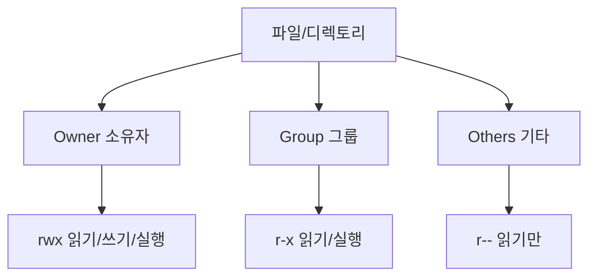

## 전체 흐름 요약

이 글은 리눅스 텍스트 처리와 권한 관리를 다룹니다. 리눅스에서 가장 강력한 텍스트 처리 도구인 grep, sed, awk를 중심으로 다양한 텍스트 조작 명령어를 학습하고, 파일과 디렉토리의 권한 시스템을 이해합니다. 각 명령어는 개별 옵션 설명과 함께 실무에서 자주 사용하는 조합 예시를 포함하여 즉시 활용할 수 있도록 구성했습니다.

---

## 텍스트 처리 명령어

리눅스의 텍스트 처리 도구들은 파이프(`|`)를 통해 연결되어 강력한 데이터 처리 파이프라인을 구성할 수 있습니다.

**텍스트 처리 파이프라인 예시:**


### grep - 패턴 검색

파일 내용에서 특정 패턴을 검색하는 명령어입니다. Global Regular Expression Print의 약자로, 정규표현식을 사용한 강력한 텍스트 검색 도구입니다.

**주요 옵션**
- `-i` : 대소문자 구분 없이 검색
- `-v` : 패턴과 일치하지 않는 줄 표시 (반대 검색)
- `-n` : 줄 번호 표시
- `-c` : 매칭된 줄 개수 표시
- `-l` : 매칭된 파일 이름만 표시
- `-w` : 단어 전체 매칭
- `-r` : 디렉토리 재귀 검색
- `-A N` : 매칭된 줄 이후 N줄 표시
- `-B N` : 매칭된 줄 이전 N줄 표시
- `-C N` : 매칭된 줄 전후 N줄 표시
- `-E` : 확장 정규표현식 사용
- `--color` : 검색 결과 색상 강조

**예시**
```bash
# 파일에서 "error" 검색
grep "error" log.txt

# 대소문자 구분 없이 검색
grep -i "error" log.txt

# 디렉토리 내 모든 파일에서 검색
grep -r "TODO" .

# 줄 번호와 함께 표시
grep -n "error" log.txt

# error가 없는 줄만 표시
grep -v "error" log.txt

# 매칭된 줄 개수만 표시
grep -c "error" log.txt

# 패턴이 포함된 파일 이름만 출력
grep -l "error" *.log

# 매칭된 줄의 전후 3줄씩 표시
grep -C 3 "error" log.txt

# 확장 정규표현식 (OR 조건)
grep -E "error|warning" log.txt
```

**실무 조합 예시**
```bash
# 대소문자 무시 + 줄 번호 + 색상 강조
grep -in --color "error" /var/log/syslog

# 재귀 검색 + 줄 번호
grep -rn "TODO" /project/src

# 특정 확장자만 검색 + 컨텍스트
grep -i --include="*.log" -C 3 "error" /var/log/

# 특정 디렉토리 제외하고 재귀 검색
grep -r --exclude-dir={node_modules,.git} "function" .

# 여러 패턴 동시 검색
grep -E "error|warning|critical" /var/log/syslog

# 빈 줄과 주석 제외
grep -v "^#" config.conf | grep -v "^$"

# 로그에서 특정 시간대의 에러만 추출
grep "2024-01-15" log.txt | grep -i "error"
```

### sed - 스트림 편집기

텍스트를 변환하고 편집하는 스트림 편집기입니다. Stream Editor의 약자로, 파일을 직접 수정하지 않고 스트림 형태로 처리합니다.

**주요 옵션**
- `-e` : 여러 개의 편집 명령 지정
- `-i` : 파일을 직접 수정 (원본 파일 변경)
- `-i.bak` : 원본을 .bak으로 백업하고 수정
- `-n` : 자동 출력 억제 (p 명령과 함께 사용)

**주요 명령어**
- `s/pattern/replacement/` : 첫 번째 매칭 치환
- `s/pattern/replacement/g` : 모든 매칭 치환
- `d` : 삭제
- `p` : 출력

**예시**
```bash
# 첫 번째 매칭만 치환
sed 's/old/new/' file.txt

# 모든 매칭 치환
sed 's/old/new/g' file.txt

# 파일 직접 수정
sed -i 's/old/new/g' file.txt

# 백업 후 수정
sed -i.bak 's/old/new/g' file.txt

# 특정 줄만 치환 (3번째 줄)
sed '3s/old/new/' file.txt

# 특정 줄 삭제 (3번째 줄)
sed '3d' file.txt

# 패턴 매칭 줄 삭제
sed '/pattern/d' file.txt

# 빈 줄 삭제
sed '/^$/d' file.txt

# 여러 명령 실행
sed -e 's/old/new/g' -e 's/foo/bar/g' file.txt
```

**실무 조합 예시**
```bash
# 설정 파일에서 주석과 빈 줄 제거
sed -e '/^#/d' -e '/^$/d' config.conf

# IP 주소 일괄 변경 + 백업
sed -i.bak 's/192\.168\.1\./10.0.0./g' network.conf

# 여러 단어 동시 치환
sed -e 's/foo/bar/g' -e 's/old/new/g' file.txt

# 로그에서 민감 정보 마스킹
sed 's/password=.*/password=***REDACTED***/g' app.log

# HTML 태그 제거
sed 's/<[^>]*>//g' page.html

# 줄 끝 공백 제거
sed -i 's/[[:space:]]*$//' file.txt
```

### awk - 텍스트 처리 및 패턴 스캐닝

텍스트 파일을 처리하고 분석하는 강력한 프로그래밍 언어입니다. 주로 컬럼 기반 데이터 처리에 탁월합니다.

**기본 구조**
```bash
awk 'pattern { action }' file
```

**내장 변수**
- `$0` : 전체 줄
- `$1, $2, ...` : 첫 번째, 두 번째 필드
- `NR` : 현재 줄 번호
- `NF` : 현재 줄의 필드 개수
- `FS` : 필드 구분자 (기본값 공백)

**주요 옵션**
- `-F` : 필드 구분자 지정
- `-v` : 변수 값 지정

**주요 패턴**
- `BEGIN` : 파일 처리 전 실행
- `END` : 파일 처리 후 실행

**예시**
```bash
# 첫 번째 필드만 출력
awk '{print $1}' file.txt

# 첫 번째와 세 번째 필드 출력
awk '{print $1, $3}' file.txt

# 마지막 필드 출력
awk '{print $NF}' file.txt

# 줄 번호와 함께 출력
awk '{print NR, $0}' file.txt

# 필드 구분자 지정 (쉼표)
awk -F',' '{print $1}' data.csv

# 조건부 출력 (3번째 필드가 100 이상)
awk '$3 >= 100' data.txt

# 패턴 매칭 줄만 출력
awk '/error/ {print}' log.txt

# BEGIN/END 블록
awk 'BEGIN {print "Name\tScore"} {print $1, $2}' data.txt

# 합계 계산
awk '{sum += $1} END {print "Total:", sum}' numbers.txt
```

**실무 조합 예시**
```bash
# CSV에서 특정 컬럼 추출 및 합계
awk -F',' '{sum += $3} END {print "Total:", sum}' sales.csv

# 로그에서 IP 주소와 요청 수 카운트
awk '{count[$1]++} END {for(ip in count) print ip, count[ip]}' access.log

# 중복 제거 (첫 번째 필드 기준)
awk '!seen[$1]++' file.txt

# 조건부 평균 계산 (60 이상인 것만)
awk '$2 >= 60 {sum += $2; count++} END {print "Avg:", sum/count}' scores.txt

# 로그 파일에서 에러 통계
awk '/ERROR/ {errors++} /WARNING/ {warnings++} END {print "Errors:", errors, "Warnings:", warnings}' app.log

# CPU 사용률 top 5
ps aux | awk 'NR>1 {print $3, $11}' | sort -rn | head -5
```

### cut - 텍스트 필드 추출

파일의 각 줄에서 특정 부분(필드나 문자)을 추출하는 명령어입니다.

**주요 옵션**
- `-f` : 추출할 필드 번호 지정
- `-d` : 필드 구분자 지정 (기본값 탭)
- `-c` : 문자 위치로 추출

**예시**
```bash
# 첫 번째 필드 추출 (탭 구분)
cut -f1 file.txt

# 쉼표로 구분된 첫 번째 필드
cut -d',' -f1 data.csv

# 여러 필드 추출 (1번과 3번)
cut -d',' -f1,3 data.csv

# 범위 지정 (2-5번째 필드)
cut -d',' -f2-5 data.csv

# 문자 위치로 추출 (1-10번째 문자)
cut -c1-10 file.txt
```

**실무 조합 예시**
```bash
# /etc/passwd에서 사용자명만 추출
cut -d':' -f1 /etc/passwd

# CSV에서 특정 컬럼만 추출
cut -d',' -f1,3,5 data.csv > extracted.csv

# 로그에서 IP 주소만 추출
cut -d' ' -f1 access.log | sort -u
```

### sort - 정렬

텍스트 파일의 줄을 정렬하는 명령어입니다.

**주요 옵션**
- `-r` : 역순 정렬
- `-n` : 숫자로 정렬
- `-k` : 특정 키(필드)로 정렬
- `-t` : 필드 구분자 지정
- `-u` : 중복 제거

**예시**
```bash
# 알파벳 순 정렬
sort file.txt

# 역순 정렬
sort -r file.txt

# 숫자 정렬
sort -n numbers.txt

# 중복 제거하며 정렬
sort -u file.txt

# 두 번째 필드로 정렬
sort -k2 file.txt

# 쉼표로 구분된 세 번째 필드로 숫자 정렬
sort -t',' -k3 -n data.csv
```

**실무 조합 예시**
```bash
# 로그 파일 정렬 후 중복 제거
sort -u access.log

# IP 주소별 접속 횟수 카운트 및 정렬
cut -d' ' -f1 access.log | sort | uniq -c | sort -rn

# 역순 숫자 정렬 (가장 큰 것부터)
sort -rn numbers.txt
```

### uniq - 중복 제거

연속된 중복 줄을 제거하거나 카운트하는 명령어입니다. **주의**: 연속된 줄만 처리하므로 보통 sort와 함께 사용합니다.

**주요 옵션**
- `-c` : 각 줄의 출현 횟수 표시
- `-d` : 중복된 줄만 표시
- `-u` : 중복되지 않은 줄만 표시

**예시**
```bash
# 연속된 중복 제거
uniq file.txt

# 출현 횟수와 함께 표시
uniq -c file.txt

# 중복된 줄만 표시
uniq -d file.txt
```

**실무 조합 예시**
```bash
# 모든 중복 제거 (정렬 필수)
sort file.txt | uniq

# 가장 많이 나타나는 항목 순으로 정렬
sort file.txt | uniq -c | sort -rn

# IP 접속 통계 (상위 10개)
cut -d' ' -f1 access.log | sort | uniq -c | sort -rn | head -10
```

### tr - 문자 변환 및 삭제

문자를 변환하거나 삭제하는 명령어입니다. Translate의 약자입니다.

**주요 옵션**
- `-d` : 문자 삭제
- `-s` : 연속된 문자를 하나로 압축

**예시**
```bash
# 소문자를 대문자로 변환
tr 'a-z' 'A-Z' < file.txt

# 공백을 탭으로 변환
tr ' ' '\t' < file.txt

# 특정 문자 삭제
tr -d 'aeiou' < file.txt

# 연속된 공백을 하나로 압축
tr -s ' ' < file.txt
```

**실무 조합 예시**
```bash
# 파일 내용을 모두 대문자로 변환
cat file.txt | tr 'a-z' 'A-Z'

# DOS 줄바꿈(CRLF)을 유닉스 줄바꿈(LF)으로
tr -d '\r' < dos_file.txt > unix_file.txt

# 연속된 공백을 하나의 공백으로
tr -s ' ' < file.txt
```

### paste - 파일 병합

여러 파일의 줄을 나란히 병합하는 명령어입니다.

**주요 옵션**
- `-d` : 구분자 지정 (기본값 탭)
- `-s` : 세로 대신 가로로 병합

**예시**
```bash
# 두 파일을 탭으로 구분하여 병합
paste file1.txt file2.txt

# 쉼표로 구분하여 병합
paste -d',' file1.txt file2.txt

# 파일을 한 줄로 (세로를 가로로)
paste -s file.txt
```

**실무 조합 예시**
```bash
# 두 컬럼을 합쳐서 CSV 생성
paste -d',' names.txt ages.txt > people.csv

# 줄 번호 추가
paste <(seq 1 10) file.txt
```

---

## 파일 권한 관리

### 리눅스 권한 시스템

리눅스는 파일과 디렉토리에 대한 접근을 제어하기 위해 권한 시스템을 사용합니다. 각 파일과 디렉토리는 **소유자(Owner)**, **그룹(Group)**, **기타 사용자(Others)**에 대한 권한을 가집니다.

**권한 구조 시각화:**



**권한 종류 (rwx)**
- **r (read)** : 읽기 권한
  - 파일: 파일 내용을 읽을 수 있음
  - 디렉토리: 디렉토리 내 파일 목록을 볼 수 있음
- **w (write)** : 쓰기 권한
  - 파일: 파일 내용을 수정할 수 있음
  - 디렉토리: 디렉토리 내에서 파일 생성/삭제 가능
- **x (execute)** : 실행 권한
  - 파일: 파일을 실행할 수 있음 (스크립트, 바이너리)
  - 디렉토리: 디렉토리에 접근(cd)할 수 있음

**권한 표기 방법**

1. **기호 표기법** (Symbolic notation)
```
-rwxr-xr--
│││││││││
│└┴┴┴┴┴┴┴── 권한 비트
└────────── 파일 타입 (- = 일반파일, d = 디렉토리, l = 심볼릭링크)

-rwxr-xr--
 ││││││││
 │││││││└── Others: read (읽기만 가능)
 ││││││└─── Others: write (없음)
 │││││└──── Others: execute (없음)
 ││││└───── Group: read (읽기 가능)
 │││└────── Group: write (없음)
 ││└─────── Group: execute (실행 가능)
 │└──────── Owner: read (읽기 가능)
 └───────── Owner: write (쓰기 가능)
           Owner: execute (실행 가능)
```

2. **숫자 표기법** (Octal notation)
각 권한을 숫자로 표현합니다:
- **r (read)** = 4
- **w (write)** = 2
- **x (execute)** = 1

조합하여 각 사용자 그룹의 권한을 표현:
- **7 (rwx)** = 4 + 2 + 1 = 읽기 + 쓰기 + 실행
- **6 (rw-)** = 4 + 2 = 읽기 + 쓰기
- **5 (r-x)** = 4 + 1 = 읽기 + 실행
- **4 (r--)** = 4 = 읽기만
- **3 (-wx)** = 2 + 1 = 쓰기 + 실행
- **2 (-w-)** = 2 = 쓰기만
- **1 (--x)** = 1 = 실행만
- **0 (---)** = 0 = 권한 없음

**일반적인 권한 조합**
- **755** (rwxr-xr-x) : 실행 파일, 디렉토리 (소유자는 모든 권한, 다른 사용자는 읽기/실행만)
- **644** (rw-r--r--) : 일반 파일 (소유자는 읽기/쓰기, 다른 사용자는 읽기만)
- **600** (rw-------) : 개인 파일 (소유자만 읽기/쓰기)
- **700** (rwx------) : 개인 디렉토리/스크립트 (소유자만 모든 권한)
- **666** (rw-rw-rw-) : 모든 사용자 읽기/쓰기 (일반적으로 권장하지 않음)
- **777** (rwxrwxrwx) : 모든 사용자 모든 권한 (보안상 위험, 특별한 경우만 사용)

**특수 권한**
- **SUID (Set User ID)** : 4000, 실행 시 파일 소유자 권한으로 실행
- **SGID (Set Group ID)** : 2000, 실행 시 파일 그룹 권한으로 실행, 디렉토리에서는 생성 파일이 디렉토리 그룹 상속
- **Sticky Bit** : 1000, 디렉토리에서 파일 소유자만 삭제 가능 (/tmp 디렉토리에 사용)

### chmod - 권한 변경

파일이나 디렉토리의 권한을 변경하는 명령어입니다. Change Mode의 약자입니다.

**주요 옵션**
- `-R` : 재귀적으로 권한 변경

**기호 모드**
- `u` : 소유자, `g` : 그룹, `o` : 기타, `a` : 모두
- `+` : 권한 추가, `-` : 권한 제거, `=` : 권한 설정

**예시**
```bash
# 숫자 모드로 권한 설정
chmod 755 file.sh
chmod 644 file.txt

# 소유자에게 실행 권한 추가
chmod u+x file.sh

# 그룹에서 쓰기 권한 제거
chmod g-w file.txt

# 모든 사용자에게 읽기 권한 추가
chmod a+r file.txt

# 디렉토리와 하위 모든 파일 권한 변경
chmod -R 755 directory/
```

**실무 조합 예시**
```bash
# 스크립트 파일 실행 가능하게
chmod +x script.sh

# 웹 디렉토리 권한 설정 (디렉토리 755, 파일 644)
find /var/www -type d -exec chmod 755 {} \;
find /var/www -type f -exec chmod 644 {} \;

# 설정 파일 보안 강화 (소유자만 읽기/쓰기)
chmod 600 config.ini

# SUID 비트 설정 (4755)
chmod 4755 /usr/bin/program

# Sticky Bit 설정 (1777)
chmod 1777 /tmp/shared
```

### chown - 소유자 변경

파일이나 디렉토리의 소유자와 그룹을 변경하는 명령어입니다. Change Owner의 약자입니다. **주의**: 일반적으로 root 권한 필요합니다.

**주요 옵션**
- `-R` : 재귀적으로 소유자 변경

**사용 형식**
- `chown user file` : 소유자만 변경
- `chown user:group file` : 소유자와 그룹 동시 변경
- `chown :group file` : 그룹만 변경

**예시**
```bash
# 소유자 변경
chown john file.txt

# 소유자와 그룹 변경
chown john:developers file.txt

# 그룹만 변경
chown :developers file.txt

# 디렉토리와 하위 모든 파일 소유자 변경
chown -R www-data:www-data /var/www/html
```

**실무 조합 예시**
```bash
# 웹 서버 디렉토리 소유자 변경
sudo chown -R www-data:www-data /var/www/mysite

# 사용자 홈 디렉토리 소유권 복구
sudo chown -R john:john /home/john

# 로그 디렉토리 권한 설정 (소유자 변경 + 권한 설정)
sudo chown -R syslog:adm /var/log/myapp
sudo chmod -R 750 /var/log/myapp
```

### chgrp - 그룹 변경

파일이나 디렉토리의 그룹을 변경하는 명령어입니다. Change Group의 약자입니다.

**주요 옵션**
- `-R` : 재귀적으로 그룹 변경

**예시**
```bash
# 그룹 변경
chgrp developers file.txt

# 재귀적으로 그룹 변경
chgrp -R developers project/
```

**실무 조합 예시**
```bash
# 협업 디렉토리 그룹 설정
sudo chgrp -R developers /opt/shared_project
sudo chmod -R g+w /opt/shared_project
```

### umask - 기본 권한 설정

새로 생성되는 파일과 디렉토리의 기본 권한을 설정하는 명령어입니다.

**개념**
- 파일 기본 권한: 666 - umask
- 디렉토리 기본 권한: 777 - umask

**일반적인 umask 값**
- **022** : 파일 644, 디렉토리 755 (일반적인 설정)
- **002** : 파일 664, 디렉토리 775 (그룹 협업)
- **077** : 파일 600, 디렉토리 700 (개인 전용)

**예시**
```bash
# 현재 umask 확인
umask

# umask 설정 (022)
umask 022

# 테스트
touch testfile
mkdir testdir
ls -l
```

**실무 조합 예시**
```bash
# ~/.bashrc에 추가하여 영구 적용
echo "umask 022" >> ~/.bashrc
```

---

## 주요 개념 요약표

| 개념 | 설명 | 주요 명령어/옵션 |
|------|------|-----------------|
| **패턴 검색** | 텍스트에서 패턴 찾기 | grep, grep -r, grep -i |
| **스트림 편집** | 텍스트 변환 및 수정 | sed, sed 's///g', sed -i |
| **텍스트 처리** | 컬럼 기반 데이터 처리 | awk, awk -F |
| **필드 추출** | 특정 필드/문자 추출 | cut, cut -d -f |
| **정렬** | 줄 정렬 | sort, sort -n, sort -r |
| **중복 제거** | 연속된 중복 제거 | uniq, uniq -c |
| **문자 변환** | 문자 치환 및 삭제 | tr, tr -d, tr -s |
| **파일 병합** | 파일 가로로 결합 | paste, paste -d |
| **권한 표기** | 기호(rwx) 또는 숫자(755) | - |
| **권한 변경** | 파일/디렉토리 권한 수정 | chmod, chmod -R |
| **소유자 변경** | 소유자/그룹 변경 | chown, chown user:group |
| **그룹 변경** | 그룹만 변경 | chgrp |
| **기본 권한** | 새 파일 기본 권한 설정 | umask |
| **특수 권한** | SUID(4), SGID(2), Sticky(1) | chmod 4755, chmod 2755 |

---
