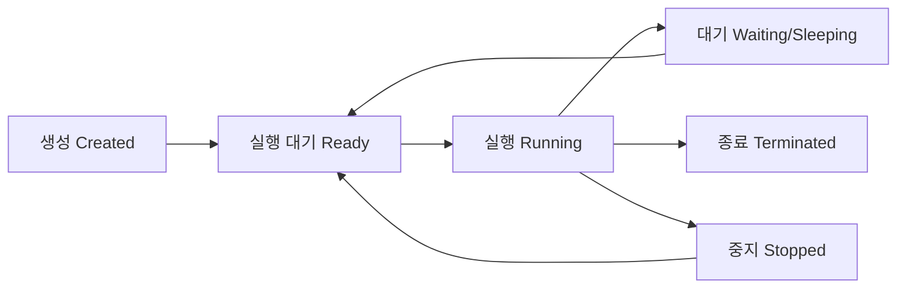

## 전체 흐름 요약

이 글은 리눅스 프로세스 관리와 시스템 모니터링을 다룹니다. 실행 중인 프로세스를 확인하고 제어하는 방법부터 시스템 리소스를 모니터링하고 관리하는 핵심 명령어들을 학습합니다. 각 명령어는 개별 옵션 설명과 함께 실무에서 자주 사용하는 조합 예시를 포함하여 즉시 활용할 수 있도록 구성했습니다.

---

## 프로세스 관리

### 프로세스 개념

**프로세스(Process)**는 실행 중인 프로그램의 인스턴스입니다. 리눅스는 멀티태스킹 시스템으로 여러 프로세스를 동시에 실행할 수 있습니다.

**프로세스 상태 전환:**



**프로세스 상태 종류:**
- **R (Running)** : 실행 중이거나 실행 대기 중
- **S (Sleeping)** : 인터럽트 가능한 대기 상태
- **D (Disk Sleep)** : 인터럽트 불가능한 대기 (디스크 I/O 등)
- **T (Stopped)** : 정지 상태 (Ctrl+Z 또는 SIGSTOP)
- **Z (Zombie)** : 종료되었지만 부모 프로세스가 상태를 회수하지 않은 상태
- **I (Idle)** : 유휴 커널 스레드

**프로세스 ID:**
- **PID (Process ID)** : 각 프로세스의 고유 식별 번호
- **PPID (Parent Process ID)** : 부모 프로세스의 PID
- **UID (User ID)** : 프로세스 소유자의 사용자 ID

### ps - 프로세스 상태 확인

현재 실행 중인 프로세스를 확인하는 명령어입니다. Process Status의 약자입니다.

**주요 옵션**
- `a` : 모든 사용자의 프로세스 표시
- `u` : 사용자 중심 형식으로 표시
- `x` : 터미널에 연결되지 않은 프로세스도 표시
- `f` : 프로세스 트리 형식으로 표시
- `-e` : 모든 프로세스 표시
- `-f` : 전체 형식으로 표시
- `-p` : 특정 PID의 프로세스만 표시
- `-u` : 특정 사용자의 프로세스만 표시

**예시**
```bash
# 현재 터미널의 프로세스
ps

# 모든 프로세스 (상세 정보)
ps aux

# 모든 프로세스 (계층 구조)
ps auxf

# 특정 프로세스 검색
ps aux | grep nginx

# 특정 PID 확인
ps -p 1234

# 특정 사용자 프로세스
ps -u john

# 전체 형식 표시
ps -ef
```

**실무 조합 예시**
```bash
# 메모리 사용량 많은 프로세스 Top 10
ps aux --sort=-%mem | head -10

# CPU 사용량 많은 프로세스 Top 10
ps aux --sort=-%cpu | head -10

# 특정 프로그램의 모든 프로세스
ps aux | grep -i apache

# 프로세스 트리로 확인
ps auxf | grep -A 5 nginx

# 좀비 프로세스 찾기
ps aux | awk '$8 == "Z"'

# 특정 사용자의 프로세스 개수
ps -u www-data | wc -l
```

### top - 실시간 프로세스 모니터링

시스템의 프로세스를 실시간으로 모니터링하는 대화형 명령어입니다.

**주요 옵션**
- `-d` : 갱신 간격 지정 (초 단위)
- `-u` : 특정 사용자의 프로세스만 표시
- `-p` : 특정 PID만 모니터링

**대화형 명령 (top 실행 중)**
- `h` : 도움말 표시
- `k` : 프로세스 종료 (PID 입력 필요)
- `r` : 프로세스 우선순위 변경
- `M` : 메모리 사용량 순 정렬
- `P` : CPU 사용량 순 정렬
- `q` : 종료
- `1` : 각 CPU 코어별로 표시
- `c` : 전체 명령 경로 표시
- `u` : 특정 사용자 필터링

**예시**
```bash
# 기본 실행
top

# 1초마다 갱신
top -d 1

# 특정 사용자만 표시
top -u www-data

# 특정 프로세스만 모니터링
top -p 1234,5678
```

**실무 조합 예시**
```bash
# 배치 모드로 3회 실행 후 종료 (로그 기록용)
top -b -n 3 > top_log.txt

# CPU 사용률 높은 프로세스 찾기
top -b -n 1 | head -20

# 특정 프로세스 모니터링
top -p $(pgrep -d',' nginx)
```

### htop - 향상된 프로세스 모니터링

top의 개선 버전으로 더 직관적인 인터페이스를 제공합니다. (설치 필요: `apt install htop`)

**주요 기능**
- 마우스 지원
- 컬러풀한 UI
- 프로세스 트리 보기
- 프로세스 검색 및 필터링

**주요 단축키**
- `F3` : 검색
- `F4` : 필터링
- `F5` : 트리 뷰
- `F6` : 정렬 기준 선택
- `F9` : 프로세스 종료
- `F10` : 종료

**예시**
```bash
# htop 실행
htop

# 특정 사용자만 표시
htop -u john
```

### kill - 프로세스 종료

프로세스에 신호(signal)를 보내는 명령어입니다. 주로 프로세스 종료에 사용됩니다.

**주요 시그널**
- **SIGTERM (15)** : 정상 종료 요청 (기본값, 안전)
- **SIGKILL (9)** : 강제 종료 (즉시 종료, 위험)
- **SIGHUP (1)** : 재시작 (설정 파일 다시 읽기)
- **SIGSTOP (19)** : 일시 정지
- **SIGCONT (18)** : 재개

**예시**
```bash
# 정상 종료 (SIGTERM)
kill 1234

# 강제 종료 (SIGKILL)
kill -9 1234
kill -KILL 1234

# 재시작 (SIGHUP)
kill -1 1234
kill -HUP 1234

# 여러 프로세스 동시 종료
kill 1234 5678 9012
```

**실무 조합 예시**
```bash
# 프로세스 이름으로 종료
kill $(pgrep nginx)

# 특정 프로그램의 모든 프로세스 종료
pkill nginx

# 강제 종료
pkill -9 hung_process

# 특정 사용자의 모든 프로세스 종료
pkill -u john

# 패턴 매칭으로 종료
pkill -f "python.*script.py"
```

### killall - 프로세스 이름으로 종료

프로세스 이름으로 여러 프로세스를 한번에 종료하는 명령어입니다.

**주요 옵션**
- `-i` : 종료 전 확인
- `-u` : 특정 사용자의 프로세스만 종료
- `-9` : 강제 종료

**예시**
```bash
# 이름으로 모든 프로세스 종료
killall firefox

# 강제 종료
killall -9 chrome

# 확인 후 종료
killall -i httpd

# 특정 사용자의 프로세스 종료
killall -u john bash
```

**실무 조합 예시**
```bash
# 웹 서버 안전하게 재시작
killall -HUP nginx

# 응답 없는 프로그램 강제 종료
killall -9 frozen_app
```

### pgrep - 프로세스 검색

프로세스 이름으로 PID를 검색하는 명령어입니다.

**주요 옵션**
- `-l` : 프로세스 이름도 함께 표시
- `-u` : 특정 사용자의 프로세스만 검색
- `-f` : 전체 명령줄에서 검색

**예시**
```bash
# 프로세스 이름으로 PID 검색
pgrep nginx

# 프로세스 이름도 함께 표시
pgrep -l nginx

# 특정 사용자의 프로세스
pgrep -u www-data

# 전체 명령줄에서 검색
pgrep -f "python script.py"
```

**실무 조합 예시**
```bash
# 프로세스 존재 여부 확인
pgrep nginx > /dev/null && echo "Nginx is running"

# 프로세스 모니터링
top -p $(pgrep -d',' nginx)

# 프로세스 개수 세기
pgrep nginx | wc -l
```

### bg / fg - 백그라운드/포어그라운드 작업 제어

프로세스를 백그라운드와 포어그라운드 간에 전환하는 명령어입니다.

**기본 개념**
- **포어그라운드** : 터미널에서 직접 실행, 입력 가능
- **백그라운드** : 백그라운드에서 실행, 터미널 사용 가능
- `Ctrl + Z` : 현재 프로세스 일시 정지 (Stopped 상태)
- `&` : 명령 끝에 붙여서 백그라운드 실행

**예시**
```bash
# 백그라운드에서 실행
sleep 100 &

# 프로세스 일시 정지 (Ctrl + Z 입력)
# 그 후 백그라운드로 재개
bg

# 작업 목록 확인
jobs

# 특정 작업을 포어그라운드로 전환
fg %1

# 특정 작업을 백그라운드로 전환
bg %1
```

**실무 조합 예시**
```bash
# 긴 작업을 백그라운드로 실행
find / -name "*.log" 2>/dev/null > results.txt &

# 백그라운드 작업 상태 확인
jobs -l

# 마지막 백그라운드 작업을 포어그라운드로
fg

# 백그라운드 작업 종료
kill %1
```

### nohup - 로그아웃 후에도 실행 유지

터미널 세션이 종료되어도 프로세스가 계속 실행되도록 하는 명령어입니다.

**예시**
```bash
# nohup으로 실행 (출력은 nohup.out에 저장)
nohup python script.py &

# 출력 파일 지정
nohup python script.py > output.log 2>&1 &

# 에러만 별도 파일로
nohup ./program > stdout.log 2> stderr.log &
```

**실무 조합 예시**
```bash
# 장시간 작업을 백그라운드로 안전하게 실행
nohup ./long_running_task.sh > task.log 2>&1 &

# 실행 후 PID 확인
echo $!

# nohup 작업 확인
ps aux | grep long_running_task
```

---

## 시스템 모니터링

### df - 디스크 사용량 확인

파일 시스템의 디스크 사용량을 확인하는 명령어입니다. Disk Free의 약자입니다.

**주요 옵션**
- `-h` : 사람이 읽기 쉬운 형태 (1K, 234M, 2G)
- `-T` : 파일 시스템 타입 표시
- `-i` : inode 사용량 표시

**예시**
```bash
# 기본 디스크 사용량
df

# 읽기 쉬운 형태
df -h

# 파일 시스템 타입 포함
df -Th

# inode 사용량
df -i

# 특정 디렉토리가 속한 파일 시스템
df /home
```

**실무 조합 예시**
```bash
# 사용률 80% 이상인 파일 시스템 찾기
df -h | awk '$5 > 80 {print $0}'

# 특정 타입만 확인 (ext4)
df -Th | grep ext4

# 용량 순 정렬
df -h | sort -k5 -rn
```

### du - 디렉토리/파일 크기 확인

디렉토리나 파일의 디스크 사용량을 확인하는 명령어입니다. Disk Usage의 약자입니다.

**주요 옵션**
- `-h` : 사람이 읽기 쉬운 형태
- `-s` : 요약 정보만 표시 (전체 크기만)
- `-a` : 파일도 포함하여 표시
- `-c` : 총합 표시
- `--max-depth=N` : 하위 디렉토리 깊이 제한

**예시**
```bash
# 현재 디렉토리 크기
du -h

# 요약 정보만
du -sh

# 현재 디렉토리의 하위 항목별 크기
du -sh *

# 1단계 하위까지만
du -h --max-depth=1

# 총합 포함
du -ch
```

**실무 조합 예시**
```bash
# 큰 디렉토리 Top 10 찾기
du -sh * | sort -rh | head -10

# 100MB 이상 디렉토리 찾기
du -h --max-depth=2 | grep -E '^[0-9.]+G|^[5-9][0-9][0-9]M'

# 특정 디렉토리 크기 확인
du -sh /var/log

# 숨김 파일 포함 현재 디렉토리 크기
du -sh .[^.]* * 2>/dev/null
```

### free - 메모리 사용량 확인

시스템의 메모리 사용 현황을 확인하는 명령어입니다.

**주요 옵션**
- `-h` : 사람이 읽기 쉬운 형태
- `-m` : MB 단위로 표시
- `-g` : GB 단위로 표시
- `-s` : 지정한 간격으로 계속 표시 (초 단위)

**예시**
```bash
# 기본 메모리 정보
free

# 읽기 쉬운 형태
free -h

# MB 단위
free -m

# 3초마다 갱신
free -h -s 3
```

**실무 조합 예시**
```bash
# 메모리 사용률 계산
free | awk '/Mem:/ {printf "Memory Usage: %.2f%%\n", $3/$2 * 100}'

# 스왑 사용 여부 확인
free -h | grep Swap

# 지속적 모니터링 (5초 간격)
watch -n 5 free -h
```

### uptime - 시스템 가동 시간 및 부하

시스템의 가동 시간과 평균 부하를 확인하는 명령어입니다.

**예시**
```bash
# 시스템 가동 시간 및 부하
uptime
```

**출력 정보**
- 현재 시간
- 시스템 가동 시간
- 현재 로그인 사용자 수
- 평균 부하 (1분, 5분, 15분)

**실무 조합 예시**
```bash
# 부하 정보만 추출
uptime | awk -F'load average:' '{print $2}'

# 부하가 높은지 확인 (1분 평균 > 4)
uptime | awk '{if ($(NF-2) > 4) print "High load detected!"}'
```

### vmstat - 가상 메모리 통계

시스템의 프로세스, 메모리, 스왑, I/O, CPU 활동에 대한 정보를 표시하는 명령어입니다.

**주요 옵션**
- `간격 횟수` : 지정한 간격(초)으로 횟수만큼 표시

**예시**
```bash
# 기본 정보
vmstat

# 2초 간격으로 5회 표시
vmstat 2 5

# 메모리 통계 상세
vmstat -s
```

**실무 조합 예시**
```bash
# CPU와 메모리 지속 모니터링
vmstat 5

# 디스크 I/O 상세 정보
vmstat -d
```

### iostat - I/O 통계

CPU와 디스크 I/O 통계를 표시하는 명령어입니다. (설치 필요: `apt install sysstat`)

**주요 옵션**
- `-x` : 확장 통계 표시
- `-h` : 사람이 읽기 쉬운 형태

**예시**
```bash
# 기본 I/O 통계
iostat

# 2초 간격으로 표시
iostat 2

# 확장 통계
iostat -x 2
```

### uname - 시스템 정보

시스템의 정보를 확인하는 명령어입니다.

**주요 옵션**
- `-a` : 모든 정보 표시
- `-r` : 커널 버전
- `-m` : 하드웨어 아키텍처
- `-n` : 호스트명

**예시**
```bash
# 모든 시스템 정보
uname -a

# 커널 버전만
uname -r

# 아키텍처 확인
uname -m
```

### lsof - 열린 파일 확인

시스템에서 열린 파일과 그 파일을 사용 중인 프로세스를 확인하는 명령어입니다. List Open Files의 약자입니다.

**주요 옵션**
- `-u` : 특정 사용자가 연 파일
- `-p` : 특정 프로세스가 연 파일
- `-i` : 네트워크 연결 확인

**예시**
```bash
# 모든 열린 파일
lsof

# 특정 사용자
lsof -u john

# 특정 프로세스
lsof -p 1234

# 특정 파일을 사용하는 프로세스
lsof /var/log/syslog

# 네트워크 연결
lsof -i

# 특정 포트 사용 프로세스
lsof -i :80

# 특정 디렉토리에서 열린 파일
lsof +D /var/log
```

**실무 조합 예시**
```bash
# 80 포트를 사용하는 프로세스 찾기
lsof -i :80

# 삭제되었지만 여전히 열린 파일 (디스크 공간 회수)
lsof | grep deleted

# 특정 디렉토리를 사용 중인 프로세스 확인 (unmount 전)
lsof +D /mnt/external

# 네트워크 연결 개수
lsof -i | wc -l
```

---

## 주요 개념 요약표

| 개념 | 설명 | 주요 명령어 |
|------|------|------------|
| **프로세스 확인** | 실행 중인 프로세스 조회 | ps, ps aux, ps -ef |
| **실시간 모니터링** | 프로세스 실시간 감시 | top, htop |
| **프로세스 종료** | 프로세스에 신호 전송 | kill, killall, pkill |
| **프로세스 검색** | 이름으로 PID 찾기 | pgrep |
| **작업 제어** | 백그라운드/포어그라운드 | bg, fg, jobs, &, Ctrl+Z |
| **세션 독립 실행** | 로그아웃 후에도 실행 | nohup |
| **디스크 사용량** | 파일 시스템 용량 확인 | df, df -h |
| **디렉토리 크기** | 디렉토리/파일 크기 | du, du -sh |
| **메모리 확인** | RAM 사용 현황 | free, free -h |
| **시스템 부하** | 가동 시간 및 부하 | uptime |
| **가상 메모리** | 메모리/CPU/I/O 통계 | vmstat |
| **I/O 통계** | 디스크 I/O 성능 | iostat |
| **시스템 정보** | 커널 및 하드웨어 정보 | uname |
| **열린 파일** | 프로세스별 파일 사용 | lsof |

---