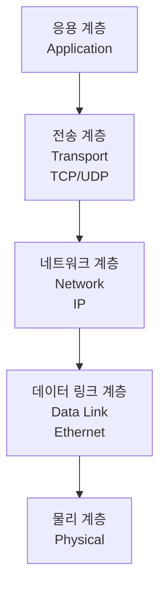
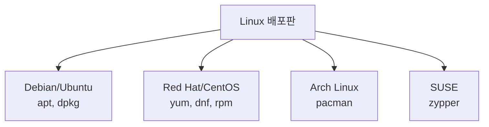

## 전체 흐름 요약

이 글은 리눅스 네트워크 관리와 패키지 관리를 다룹니다. 네트워크 상태를 확인하고 진단하는 방법부터 원격 접속, 파일 전송, 그리고 소프트웨어 패키지를 설치하고 관리하는 핵심 명령어들을 학습합니다. 또한 파이프, 리다이렉션, 환경변수 등 고급 기능도 함께 다룹니다. 각 명령어는 개별 옵션 설명과 함께 실무에서 자주 사용하는 조합 예시를 포함하여 즉시 활용할 수 있도록 구성했습니다.

---

## 네트워크 명령어

### 네트워크 계층 구조



### ifconfig / ip - 네트워크 인터페이스 설정

네트워크 인터페이스 정보를 확인하고 설정하는 명령어입니다. 최신 시스템에서는 `ip` 명령어를 권장합니다.

**ifconfig (구형)**
```bash
# 모든 인터페이스 정보
ifconfig

# 특정 인터페이스
ifconfig eth0

# 인터페이스 활성화
ifconfig eth0 up

# 인터페이스 비활성화
ifconfig eth0 down
```

**ip (최신, 권장)**

**주요 옵션**
- `addr` : IP 주소 관리
- `link` : 네트워크 인터페이스 관리
- `route` : 라우팅 테이블 관리

```bash
# 모든 인터페이스 정보
ip addr show
ip a

# 특정 인터페이스
ip addr show eth0

# 인터페이스 링크 상태
ip link show

# 인터페이스 활성화/비활성화
ip link set eth0 up
ip link set eth0 down

# IP 주소 추가
ip addr add 192.168.1.100/24 dev eth0

# IP 주소 삭제
ip addr del 192.168.1.100/24 dev eth0
```

**실무 조합 예시**
```bash
# 활성화된 인터페이스만 확인
ip link show up

# IP 주소만 간단히 확인
ip -br addr

# 특정 인터페이스의 IP만 추출
ip addr show eth0 | grep "inet " | awk '{print $2}'
```

### ping - 네트워크 연결 테스트

목적지 호스트와의 네트워크 연결을 테스트하는 명령어입니다. ICMP 프로토콜을 사용합니다.

**주요 옵션**
- `-c` : 패킷 전송 횟수 지정
- `-i` : 패킷 전송 간격 (초)
- `-s` : 패킷 크기 지정 (바이트)
- `-W` : 응답 대기 시간 (초)

**예시**
```bash
# 기본 ping (Ctrl+C로 중지)
ping google.com

# 4번만 전송
ping -c 4 google.com

# 0.5초 간격으로 10번
ping -c 10 -i 0.5 google.com

# 큰 패킷으로 테스트 (1000 바이트)
ping -s 1000 google.com

# IP 주소로 직접 테스트
ping 8.8.8.8
```

**실무 조합 예시**
```bash
# 빠른 연결 테스트 (1번만)
ping -c 1 google.com

# 응답 시간만 추출
ping -c 5 google.com | tail -1 | awk '{print $4}'

# 연결 여부만 확인 (스크립트용)
ping -c 1 -W 1 google.com > /dev/null 2>&1 && echo "Online" || echo "Offline"

# 여러 호스트 동시 테스트
for host in google.com github.com; do
  ping -c 1 -W 1 $host > /dev/null && echo "$host: OK" || echo "$host: FAIL"
done
```

### netstat - 네트워크 상태 확인

네트워크 연결, 라우팅 테이블, 인터페이스 통계를 확인하는 명령어입니다.

**주요 옵션**
- `-a` : 모든 소켓 표시 (listening + established)
- `-t` : TCP 연결만 표시
- `-u` : UDP 연결만 표시
- `-n` : 주소를 숫자로 표시 (DNS 조회 안 함)
- `-l` : listening 상태만 표시
- `-p` : 프로세스 정보 표시
- `-r` : 라우팅 테이블 표시

**예시**
```bash
# 모든 연결 확인
netstat -a

# TCP listening 포트
netstat -tln

# UDP listening 포트
netstat -uln

# 프로세스 정보 포함
netstat -tlnp

# established 연결만
netstat -tn

# 라우팅 테이블
netstat -r
```

**실무 조합 예시**
```bash
# 특정 포트 사용 여부 확인
netstat -tln | grep :80

# 연결 상태별 통계
netstat -an | awk '/tcp/ {print $6}' | sort | uniq -c

# 가장 많은 연결을 가진 IP Top 10
netstat -tn | awk '{print $5}' | cut -d: -f1 | sort | uniq -c | sort -rn | head -10

# listening 포트 목록
netstat -tln | grep LISTEN
```

### ss - 소켓 통계 (netstat 대체)

`netstat`의 현대적 대체 명령어로 더 빠르고 상세한 정보를 제공합니다.

**주요 옵션**
- `-a` : 모든 소켓
- `-t` : TCP
- `-u` : UDP
- `-n` : 숫자로 표시
- `-l` : listening 상태
- `-p` : 프로세스 정보

**예시**
```bash
# 모든 연결
ss -a

# TCP listening 포트
ss -tln

# 프로세스 정보 포함
ss -tlnp

# established TCP 연결
ss -tn state established
```

**실무 조합 예시**
```bash
# 특정 포트 확인
ss -tln | grep :443

# 연결 수 세기
ss -tn | wc -l

# 특정 IP와의 연결 확인
ss -tn dst 192.168.1.100
```

### curl - URL 데이터 전송

URL을 통해 데이터를 전송하고 받는 명령어입니다. HTTP, HTTPS, FTP 등 다양한 프로토콜 지원합니다.

**주요 옵션**
- `-o` : 출력을 파일로 저장
- `-O` : URL의 파일명으로 저장
- `-L` : 리다이렉트 따라가기
- `-I` : 헤더 정보만 가져오기
- `-X` : HTTP 메소드 지정 (GET, POST, PUT, DELETE 등)
- `-d` : POST 데이터 전송
- `-H` : 헤더 추가
- `-u` : 인증 정보 (username:password)
- `-s` : 진행 상황 숨김 (silent)

**예시**
```bash
# 웹 페이지 내용 가져오기
curl https://example.com

# 파일로 저장
curl -o page.html https://example.com

# URL 파일명으로 저장
curl -O https://example.com/file.zip

# 리다이렉트 따라가기
curl -L https://short.url

# 헤더 정보만
curl -I https://example.com

# POST 요청
curl -X POST -d "key=value" https://api.example.com

# JSON 데이터 전송
curl -X POST -H "Content-Type: application/json" -d '{"key":"value"}' https://api.example.com

# 파일 업로드
curl -F "file=@image.jpg" https://upload.example.com

# Basic 인증
curl -u username:password https://secure.example.com
```

**실무 조합 예시**
```bash
# API 응답 시간 측정
curl -o /dev/null -s -w "Time: %{time_total}s\n" https://api.example.com

# 여러 URL 동시 다운로드
curl -O https://example.com/file1.zip -O https://example.com/file2.zip

# 헤더와 본문 모두 저장
curl -D headers.txt -o body.html https://example.com

# REST API 테스트 (JSON 응답 포맷팅)
curl -s https://api.example.com/data | python -m json.tool

# 특정 IP로 요청 (DNS 무시)
curl --resolve example.com:443:192.168.1.100 https://example.com

# 연결 재시도
curl --retry 3 --retry-delay 5 https://unreliable.example.com
```

### wget - 파일 다운로드

웹에서 파일을 다운로드하는 명령어입니다.

**주요 옵션**
- `-O` : 다른 이름으로 저장
- `-c` : 중단된 다운로드 재개
- `-r` : 재귀적 다운로드
- `-P` : 저장 디렉토리 지정
- `-q` : 조용한 모드
- `--limit-rate` : 다운로드 속도 제한

**예시**
```bash
# 파일 다운로드
wget https://example.com/file.zip

# 다른 이름으로 저장
wget -O myfile.zip https://example.com/file.zip

# 중단된 다운로드 재개
wget -c https://example.com/large.iso

# 특정 디렉토리에 저장
wget -P /downloads https://example.com/file.zip

# 속도 제한 (1MB/s)
wget --limit-rate=1m https://example.com/file.zip

# 전체 웹사이트 다운로드 (미러링)
wget -r -np -k https://example.com
```

**실무 조합 예시**
```bash
# 백그라운드 다운로드
wget -b https://example.com/large.iso

# 여러 파일 다운로드 (목록 파일 사용)
wget -i urls.txt

# User-Agent 지정
wget --user-agent="Mozilla/5.0" https://example.com/file.zip
```

### ssh - 원격 접속

원격 서버에 안전하게 접속하는 명령어입니다. Secure Shell의 약자입니다.

**주요 옵션**
- `-p` : 포트 번호 지정 (기본 22)
- `-i` : 개인키 파일 지정
- `-l` : 사용자 이름 지정
- `-X` : X11 포워딩 활성화
- `-C` : 압축 활성화

**예시**
```bash
# 기본 접속
ssh user@192.168.1.100

# 다른 포트로 접속
ssh -p 2222 user@example.com

# 개인키 사용
ssh -i ~/.ssh/id_rsa user@example.com

# 원격 명령 실행
ssh user@example.com "ls -la"

# X11 포워딩 (GUI 애플리케이션 실행)
ssh -X user@example.com
```

**실무 조합 예시**
```bash
# SSH 터널링 (로컬 포트 포워딩)
ssh -L 8080:localhost:80 user@remote-server

# 리모트 포트 포워딩
ssh -R 9090:localhost:3000 user@remote-server

# 백그라운드 SSH 터널
ssh -f -N -L 8080:localhost:80 user@remote-server

# SSH 키 복사 (비밀번호 없이 로그인)
ssh-copy-id user@remote-server

# SSH config 사용 (~/.ssh/config)
# Host myserver
#   HostName 192.168.1.100
#   User john
#   Port 2222
#   IdentityFile ~/.ssh/id_rsa
ssh myserver
```

### scp - 원격 파일 복사

SSH를 통해 원격 서버와 파일을 안전하게 복사하는 명령어입니다. Secure Copy의 약자입니다.

**주요 옵션**
- `-r` : 디렉토리 재귀 복사
- `-P` : 포트 번호 지정
- `-i` : 개인키 파일 지정
- `-C` : 압축 전송

**예시**
```bash
# 로컬 → 원격
scp file.txt user@remote:/path/to/destination/

# 원격 → 로컬
scp user@remote:/path/to/file.txt ./

# 디렉토리 복사
scp -r directory/ user@remote:/path/to/destination/

# 다른 포트 사용
scp -P 2222 file.txt user@remote:/path/

# 여러 파일 복사
scp file1.txt file2.txt user@remote:/path/
```

**실무 조합 예시**
```bash
# 압축하여 전송 (속도 향상)
scp -C large_file.zip user@remote:/backup/

# 두 원격 서버 간 복사
scp user1@server1:/path/file.txt user2@server2:/path/

# 진행 상황 없이 조용하게
scp -q file.txt user@remote:/path/
```

### rsync - 동기화 및 증분 복사

파일과 디렉토리를 효율적으로 동기화하는 명령어입니다. 변경된 부분만 전송합니다.

**주요 옵션**
- `-a` : 아카이브 모드 (권한, 타임스탬프 보존, 재귀)
- `-v` : 상세 출력
- `-z` : 압축 전송
- `-h` : 사람이 읽기 쉬운 형태
- `--delete` : 소스에 없는 파일 삭제
- `--progress` : 진행 상황 표시
- `-n` : 실제 실행 안 함 (dry-run)

**예시**
```bash
# 로컬 디렉토리 동기화
rsync -av source/ destination/

# 원격 서버로 동기화
rsync -avz source/ user@remote:/path/destination/

# 원격에서 로컬로
rsync -avz user@remote:/path/source/ ./destination/

# 진행 상황 표시
rsync -avz --progress source/ destination/

# 삭제도 동기화 (미러링)
rsync -avz --delete source/ destination/

# dry-run (테스트)
rsync -avzn source/ destination/
```

**실무 조합 예시**
```bash
# 백업 (타임스탬프 보존, 압축)
rsync -avzh --progress /important/data/ /backup/data/

# SSH 포트 지정
rsync -avz -e "ssh -p 2222" source/ user@remote:/path/

# 특정 파일 제외
rsync -avz --exclude='*.log' --exclude='temp/' source/ destination/

# 대역폭 제한 (1MB/s)
rsync -avz --bwlimit=1000 source/ user@remote:/path/

# 부분 전송 재개 가능
rsync -avz --partial --progress large_file user@remote:/path/
```

---

## 패키지 관리

### 패키지 관리자 종류

리눅스 배포판마다 다른 패키지 관리자를 사용합니다.



### apt - 패키지 관리 (Debian/Ubuntu)

Debian 계열 리눅스의 패키지 관리 도구입니다. Advanced Package Tool의 약자입니다.

**주요 명령어**
- `update` : 패키지 목록 업데이트
- `upgrade` : 설치된 패키지 업그레이드
- `install` : 패키지 설치
- `remove` : 패키지 제거
- `purge` : 패키지 및 설정 파일 완전 제거
- `search` : 패키지 검색
- `show` : 패키지 정보 표시
- `autoremove` : 불필요한 패키지 제거

**예시**
```bash
# 패키지 목록 업데이트
sudo apt update

# 전체 업그레이드
sudo apt upgrade

# 특정 패키지 설치
sudo apt install nginx

# 여러 패키지 설치
sudo apt install vim git curl

# 패키지 제거
sudo apt remove nginx

# 완전 제거 (설정 파일 포함)
sudo apt purge nginx

# 패키지 검색
apt search nginx

# 패키지 정보 확인
apt show nginx

# 불필요한 패키지 정리
sudo apt autoremove

# 캐시 정리
sudo apt clean
```

**실무 조합 예시**
```bash
# 업데이트 후 업그레이드
sudo apt update && sudo apt upgrade -y

# 특정 버전 설치
sudo apt install nginx=1.18.0-0ubuntu1

# 설치된 패키지 목록
apt list --installed

# 업그레이드 가능한 패키지
apt list --upgradable

# 패키지 의존성 확인
apt depends nginx

# 패키지가 설치되었는지 확인
dpkg -l | grep nginx
```

### yum / dnf - 패키지 관리 (Red Hat/CentOS)

Red Hat 계열 리눅스의 패키지 관리 도구입니다. `dnf`는 `yum`의 차세대 버전입니다.

**주요 명령어**
```bash
# 패키지 목록 업데이트
sudo yum update
sudo dnf update

# 패키지 설치
sudo yum install httpd
sudo dnf install httpd

# 패키지 제거
sudo yum remove httpd
sudo dnf remove httpd

# 패키지 검색
yum search nginx
dnf search nginx

# 패키지 정보
yum info nginx
dnf info nginx

# 설치된 패키지 목록
yum list installed
dnf list installed

# 그룹 설치
sudo yum groupinstall "Development Tools"
sudo dnf groupinstall "Development Tools"
```

### dpkg - 저수준 패키지 관리 (Debian/Ubuntu)

`.deb` 패키지 파일을 직접 설치/제거하는 저수준 도구입니다.

**주요 옵션**
- `-i` : 패키지 설치
- `-r` : 패키지 제거
- `-P` : 패키지 및 설정 파일 제거
- `-l` : 설치된 패키지 목록
- `-L` : 패키지가 설치한 파일 목록
- `-S` : 파일이 어느 패키지에 속하는지 확인

**예시**
```bash
# .deb 파일 설치
sudo dpkg -i package.deb

# 패키지 제거
sudo dpkg -r package-name

# 완전 제거
sudo dpkg -P package-name

# 설치된 패키지 목록
dpkg -l

# 특정 패키지 검색
dpkg -l | grep nginx

# 패키지가 설치한 파일 목록
dpkg -L nginx

# 파일이 속한 패키지 찾기
dpkg -S /usr/bin/nginx
```

**실무 조합 예시**
```bash
# .deb 설치 후 의존성 해결
sudo dpkg -i package.deb
sudo apt install -f

# 깨진 패키지 수정
sudo dpkg --configure -a
```

### rpm - 저수준 패키지 관리 (Red Hat/CentOS)

`.rpm` 패키지 파일을 직접 관리하는 저수준 도구입니다.

**주요 옵션**
```bash
# 패키지 설치
sudo rpm -ivh package.rpm

# 패키지 업그레이드
sudo rpm -Uvh package.rpm

# 패키지 제거
sudo rpm -e package-name

# 설치된 패키지 목록
rpm -qa

# 패키지 정보
rpm -qi package-name

# 패키지 파일 목록
rpm -ql package-name

# 파일이 속한 패키지
rpm -qf /usr/bin/httpd
```

---

## 고급 기능

### 파이프와 리다이렉션

**파이프 (`|`)**
한 명령의 출력을 다른 명령의 입력으로 연결합니다.


**예시**
```bash
# 프로세스 검색 후 카운트
ps aux | grep nginx | wc -l

# 정렬 후 중복 제거
cat file.txt | sort | uniq

# 로그에서 에러 추출 후 통계
cat log.txt | grep ERROR | cut -d' ' -f1 | sort | uniq -c

# 용량 큰 파일 찾기
du -sh * | sort -rh | head -5
```

**리다이렉션**

- `>` : 표준 출력을 파일로 (덮어쓰기)
- `>>` : 표준 출력을 파일로 (추가)
- `<` : 파일을 표준 입력으로
- `2>` : 표준 에러를 파일로
- `2>&1` : 표준 에러를 표준 출력으로
- `&>` : 표준 출력과 에러 모두 파일로

**예시**
```bash
# 출력을 파일로 저장
ls -la > output.txt

# 파일에 추가
echo "new line" >> output.txt

# 에러만 파일로
command 2> error.log

# 출력과 에러 모두
command > output.log 2>&1
command &> output.log

# 에러 무시
command 2> /dev/null

# 입력 리다이렉션
wc -l < file.txt

# Here Document
cat << EOF > config.txt
line 1
line 2
EOF
```

**실무 조합 예시**
```bash
# 로그 필터링 후 저장
grep ERROR /var/log/syslog > errors.txt 2>&1

# 백업하며 출력 확인
tar -czf backup.tar.gz /data | tee backup.log

# 여러 명령 파이프라인
ps aux | grep nginx | awk '{print $2}' | xargs kill -9
```

### 환경 변수

환경 변수는 시스템 전역적으로 사용되는 설정 값입니다.

**주요 환경 변수**
- `PATH` : 실행 파일 검색 경로
- `HOME` : 사용자 홈 디렉토리
- `USER` : 현재 사용자 이름
- `SHELL` : 현재 사용 중인 쉘
- `PWD` : 현재 작업 디렉토리
- `LANG` : 시스템 언어 설정

**명령어**
```bash
# 환경 변수 확인
env

# 특정 변수 확인
echo $PATH
echo $HOME

# 변수 설정 (현재 세션만)
export MY_VAR="value"

# 변수 해제
unset MY_VAR

# PATH에 경로 추가
export PATH=$PATH:/new/path
```

**영구 설정**
```bash
# 사용자별 설정 (~/.bashrc 또는 ~/.bash_profile)
echo 'export MY_VAR="value"' >> ~/.bashrc
source ~/.bashrc

# 시스템 전체 설정 (/etc/environment 또는 /etc/profile)
sudo echo 'MY_VAR="value"' >> /etc/environment
```

**실무 조합 예시**
```bash
# 임시 PATH 수정 후 명령 실행
PATH=$PATH:/opt/custom/bin ./script.sh

# 특정 프로그램용 환경 변수
export JAVA_HOME=/usr/lib/jvm/java-11
export PATH=$JAVA_HOME/bin:$PATH

# 환경 변수 확인 후 스크립트 실행
if [ -z "$API_KEY" ]; then
  echo "API_KEY not set"
  exit 1
fi
```

### 쉘 스크립트 기초

여러 명령을 자동화하는 스크립트 작성 기초입니다.

**기본 구조**
```bash
#!/bin/bash
# 스크립트 설명

# 변수 선언
NAME="John"
COUNT=10

# 조건문
if [ $COUNT -gt 5 ]; then
  echo "Count is greater than 5"
fi

# 반복문
for i in {1..5}; do
  echo "Number: $i"
done

# 함수
function greet() {
  echo "Hello, $1"
}

greet "World"
```

**실무 예시**
```bash
#!/bin/bash
# 백업 스크립트

# 설정
BACKUP_DIR="/backup"
SOURCE_DIR="/data"
DATE=$(date +%Y%m%d)

# 백업 실행
tar -czf $BACKUP_DIR/backup_$DATE.tar.gz $SOURCE_DIR

# 7일 이상 된 백업 삭제
find $BACKUP_DIR -name "backup_*.tar.gz" -mtime +7 -delete

echo "Backup completed: backup_$DATE.tar.gz"
```

### 작업 스케줄링 (cron)

주기적으로 명령을 자동 실행하는 cron 데몬입니다.

**crontab 형식**
```
분 시 일 월 요일 명령
(0-59) (0-23) (1-31) (1-12) (0-7)
```

**명령어**
```bash
# crontab 편집
crontab -e

# crontab 목록 확인
crontab -l

# crontab 삭제
crontab -r
```

**예시**
```bash
# 매일 오전 2시에 백업
0 2 * * * /home/user/backup.sh

# 매시 정각에 실행
0 * * * * /home/user/hourly_task.sh

# 매주 일요일 오전 3시
0 3 * * 0 /home/user/weekly_cleanup.sh

# 5분마다 실행
*/5 * * * * /home/user/monitor.sh

# 평일 오전 9시
0 9 * * 1-5 /home/user/workday_task.sh
```

---

## 주요 개념 요약표

| 개념 | 설명 | 주요 명령어 |
|------|------|------------|
| **네트워크 인터페이스** | IP 주소 및 네트워크 설정 | ifconfig, ip addr |
| **연결 테스트** | 네트워크 연결 확인 | ping |
| **네트워크 상태** | 연결 및 포트 확인 | netstat, ss |
| **데이터 전송** | URL 통한 데이터 송수신 | curl, wget |
| **원격 접속** | 안전한 원격 쉘 접속 | ssh |
| **파일 전송** | 원격 파일 복사 | scp, rsync |
| **패키지 관리** | 소프트웨어 설치/제거 | apt, yum, dnf |
| **저수준 패키지** | 패키지 파일 직접 관리 | dpkg, rpm |
| **파이프** | 명령 출력 연결 | command1 \| command2 |
| **리다이렉션** | 입출력 방향 변경 | >, >>, <, 2>, &> |
| **환경 변수** | 시스템 전역 설정 | export, env, echo $ |
| **스크립트** | 명령 자동화 | bash, sh |
| **작업 스케줄링** | 주기적 작업 실행 | cron, crontab |

---
