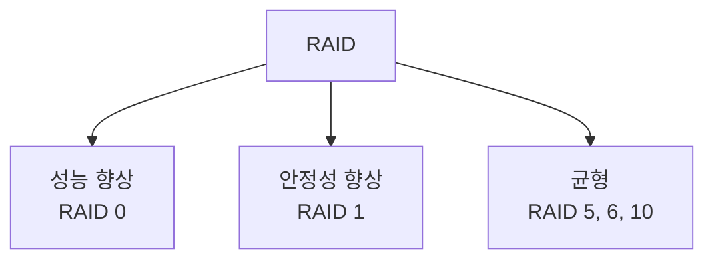

## 전체 흐름 요약

이 글은 리눅스 학습 시리즈의 여섯 번째 파트로, RAID (Redundant Array of Inexpensive Disks) 구성과 관리를 다룹니다. 여러 하드디스크를 하나처럼 사용하여 성능 향상과 데이터 안정성을 확보하는 방법을 학습합니다. RAID 레벨별 특징부터 실제 구성, 관리, 문제 해결까지 실무에서 필요한 모든 내용을 포함합니다.

---

## RAID 개념

### RAID란?

**RAID (Redundant Array of Inexpensive Disks)**
- 여러 하드디스크를 하나의 디스크처럼 사용하는 기술
- **목적**: 비용 절감 + 신뢰성 향상 + 성능 향상

**RAID의 3가지 효과**
1. **비용 절감**: 저렴한 디스크 여러 개로 고가 디스크 대체
2. **신뢰성 향상**: 데이터 복제로 장애 대응
3. **성능 향상**: 여러 디스크에 분산 저장으로 속도 증가



---

## RAID 레벨별 특징

### Linear RAID (= LVM)

**특징**
- 2개 이상의 하드디스크를 1개의 볼륨으로 사용
- 앞 디스크부터 차례로 저장
- 100% 공간 효율성 = 비용 저렴
- 성능 향상 없음, 복구 기능 없음

**용도**
- 단순히 용량 확장이 목적일 때
- 저렴한 비용으로 대용량 저장소 구성

### RAID 0 (Striping)

**특징**
- 데이터를 여러 디스크에 **분산 저장**
- **빠른 입출력 속도** (병렬 처리)
- 데이터 복구 기능 없음
- 하나의 디스크 장애 시 **전체 데이터 손실**

**공간 효율성**: 100% (모든 디스크 용량 사용)

**용도**
- 속도가 중요하고 데이터 손실 위험 감수 가능한 경우
- 임시 작업 공간, 캐시 등

```
디스크1: [A1][A3][A5]
디스크2: [A2][A4][A6]
→ 병렬 읽기/쓰기로 속도 2배
```

### RAID 1 (Mirroring)

**특징**
- 동일한 데이터를 **2개 이상의 디스크에 동시 저장**
- 하나의 디스크 장애 발생해도 데이터 온전히 복구
- **안정성 최우선**
- 속도는 RAID 0보다 느림

**공간 효율성**: 50% (디스크 2개 사용 시)

**용도**
- 데이터 안정성이 최우선인 경우
- 중요한 시스템 파일, 데이터베이스

```
디스크1: [A][B][C]
디스크2: [A][B][C] ← 완전히 동일
→ 디스크1 장애 시 디스크2로 복구
```

### RAID 5

**특징**
- 데이터와 **패리티 정보**를 Sector 단위로 분산 저장
- 하나의 디스크 장애 시 패리티로 데이터 복구 가능
- 최소 3개의 디스크 필요
- **현재 가장 많이 사용**되는 레벨

**공간 효율성**: (n-1)/n × 100% (3개 디스크 시 66.7%)

**용도**
- 성능과 안정성의 균형
- 일반적인 서버 환경

```
디스크1: [A1][B2][C3][P4]
디스크2: [A2][P1][C4][D4]
디스크3: [P0][B1][P2][D5]
→ 패리티(P)로 데이터 복구 가능
```

### RAID 6

**특징**
- RAID 5와 유사하지만 **이중 패리티** 구성
- 2개의 디스크 동시 장애까지 복구 가능
- 최소 4개의 디스크 필요
- 대용량 하드 사용 시 복구 시간이 길어져 복구 중 추가 장애 대비

**공간 효율성**: (n-2)/n × 100% (4개 디스크 시 50%)

**용도**
- 고가용성이 필요한 환경
- 대용량 데이터 저장

### RAID 10 (1+0)

**특징**
- RAID 1 (미러링) + RAID 0 (스트라이핑) 조합
- **RAID 1로 묶은 디스크 쌍**을 **RAID 0으로 구성**
- RAID 0의 빠른 속도 + RAID 1의 안정성
- 최소 4개의 디스크 필요

**공간 효율성**: 50%

**용도**
- 성능과 안정성 모두 중요한 환경
- 데이터베이스 서버, 고성능 스토리지

```
[디스크1 - 디스크2] ← RAID 1 (미러링)
[디스크3 - 디스크4] ← RAID 1 (미러링)
        ↓
   RAID 0 (스트라이핑)
```

---

## RAID 레벨 비교표

| 레벨 | 최소 디스크 | 공간 효율 | 성능 | 안정성 | 용도 |
|------|-------------|-----------|------|--------|------|
| **Linear** | 2개 | 100% | 낮음 | 없음 | 단순 용량 확장 |
| **RAID 0** | 2개 | 100% | 매우 높음 | 없음 | 속도 우선 |
| **RAID 1** | 2개 | 50% | 중간 | 높음 | 안정성 우선 |
| **RAID 5** | 3개 | 66~80% | 높음 | 높음 | 균형 (가장 많이 사용) |
| **RAID 6** | 4개 | 50~75% | 중간 | 매우 높음 | 고가용성 |
| **RAID 10** | 4개 | 50% | 매우 높음 | 매우 높음 | 고성능 + 고가용성 |

---

## RAID 구성 실습

### 1. 하드디스크 추가 및 파티션 생성

```bash
# 하드디스크 목록 확인
lsblk

# fdisk로 파티션 생성
fdisk /dev/sdb

# fdisk 명령 순서:
# n : 새 파티션 생성
# p : primary 파티션
# 1 : 파티션 번호
# Enter : 시작 섹터 (기본값)
# Enter : 종료 섹터 (기본값, 전체 사용)
# t : 파티션 타입 변경
# fd : Linux raid autodetect
# w : 저장 및 종료

# 같은 방식으로 /dev/sdc도 파티션 생성
fdisk /dev/sdc
```

### 2. RAID 구성 (mdadm)

**mdadm 명령어 형식**
```bash
mdadm -C [RAID장치명] -l [level] -n [디스크개수] [구성원디스크1] [구성원디스크2] ...
```

**Linear RAID 구성**
```bash
# Linear RAID 생성
mdadm -C /dev/md9 -l linear -n 2 /dev/sdb1 /dev/sdc1

# 또는 긴 옵션 사용
mdadm --create /dev/md9 --level=linear --raid-devices=2 /dev/sdb1 /dev/sdc1
```

**RAID 0 구성**
```bash
# RAID 0 생성
mdadm -C /dev/md0 -l 0 -n 2 /dev/sdb1 /dev/sdc1
```

**RAID 1 구성**
```bash
# RAID 1 생성
mdadm -C /dev/md1 -l 1 -n 2 /dev/sdb1 /dev/sdc1
```

**RAID 5 구성**
```bash
# RAID 5 생성 (최소 3개 디스크)
mdadm -C /dev/md5 -l 5 -n 3 /dev/sdb1 /dev/sdc1 /dev/sdd1
```

### 3. RAID 상태 확인

```bash
# RAID 상세 정보 확인
mdadm -D /dev/md9
mdadm --detail /dev/md9

# 모든 RAID 장치 스캔
mdadm -D -s
mdadm --detail --scan

# /proc 파일시스템으로 확인
cat /proc/mdstat
```

### 4. 파일 시스템 포맷

```bash
# ext4 파일 시스템으로 포맷
mkfs -t ext4 /dev/md9

# 또는
mkfs.ext4 /dev/md9
```

### 5. 마운트

```bash
# 마운트 포인트 생성
mkdir /linearraid

# 마운트
mount /dev/md9 /linearraid

# 마운트 확인
df -h
mount | grep md9
```

### 6. 자동 마운트 설정

```bash
# /etc/fstab 편집
vi /etc/fstab

# 다음 줄 추가
/dev/md9    /linearraid    ext4    defaults    0    0

# 저장 후 테스트
umount /linearraid
mount -a
df -h
```

### 7. RAID 정보를 설정 파일에 추가

```bash
# RAID 설정 정보를 mdadm.conf에 저장
mdadm -D -s /dev/md9 >> /etc/mdadm.conf

# 또는 직접 편집
mdadm -D -s /dev/md9
vi /etc/mdadm.conf
# 위 명령 결과를 복사하여 붙여넣기
```

---

## RAID 관리

### RAID 상태 모니터링

```bash
# 실시간 상태 확인
watch -n 1 cat /proc/mdstat

# RAID 상태 요약
mdadm --detail /dev/md9

# 모든 RAID 장치 확인
cat /proc/mdstat
```

### 디스크 장애 시뮬레이션 및 복구

**디스크를 고장(fault) 상태로 설정**
```bash
# 특정 디스크를 고장 상태로 표시
mdadm /dev/md9 -f /dev/sdb1
mdadm --manage /dev/md9 --fail /dev/sdb1

# 상태 확인
mdadm -D /dev/md9
```

**고장난 디스크 제거**
```bash
# RAID에서 디스크 제거
mdadm /dev/md9 -r /dev/sdb1
mdadm --manage /dev/md9 --remove /dev/sdb1
```

**새 디스크 추가**
```bash
# 새 디스크를 RAID에 추가
mdadm /dev/md9 -a /dev/sde1
mdadm --manage /dev/md9 --add /dev/sde1

# 리빌드 과정 확인
watch cat /proc/mdstat
```

### RAID 삭제

```bash
# 1. 현재 디렉토리가 마운트 포인트 안이면 나가기
cd ..

# 2. 언마운트
umount /dev/md9

# 3. RAID 중지
mdadm --stop /dev/md9
mdadm -S /dev/md9

# 4. 슈퍼블록 제거 (디스크 초기화)
mdadm --zero-superblock /dev/sdb1 /dev/sdc1

# 5. /etc/fstab에서 항목 삭제
vi /etc/fstab
# /dev/md9 관련 줄 삭제

# 6. 파티션 삭제 (필요시)
fdisk /dev/sdb
# 명령: d (delete), w (write)
```

---

## 실무 시나리오

### 시나리오 1: 웹 서버용 RAID 1 구성

```bash
# 목적: /var/www 데이터의 안정성 확보

# 1. RAID 1 생성
mdadm -C /dev/md1 -l 1 -n 2 /dev/sdb1 /dev/sdc1

# 2. 포맷 및 마운트
mkfs.ext4 /dev/md1
mkdir /raid_www
mount /dev/md1 /raid_www

# 3. 기존 데이터 복사
rsync -avz /var/www/ /raid_www/

# 4. 자동 마운트 설정
echo "/dev/md1 /var/www ext4 defaults 0 0" >> /etc/fstab

# 5. RAID 정보 저장
mdadm -D -s /dev/md1 >> /etc/mdadm.conf
```

### 시나리오 2: 데이터베이스용 RAID 10 구성

```bash
# 목적: 고성능 + 고가용성

# 1. RAID 10 생성 (4개 디스크 필요)
mdadm -C /dev/md10 -l 10 -n 4 /dev/sdb1 /dev/sdc1 /dev/sdd1 /dev/sde1

# 2. 포맷 및 마운트
mkfs.ext4 /dev/md10
mkdir /raid_db
mount /dev/md10 /raid_db

# 3. 자동 마운트
echo "/dev/md10 /raid_db ext4 defaults 0 0" >> /etc/fstab

# 4. 소유권 설정 (MySQL 예시)
chown -R mysql:mysql /raid_db
```

### 시나리오 3: 백업 서버용 RAID 5 구성

```bash
# 목적: 용량 효율 + 안정성

# 1. RAID 5 생성 (3개 이상 디스크)
mdadm -C /dev/md5 -l 5 -n 3 /dev/sdb1 /dev/sdc1 /dev/sdd1

# 2. 포맷 및 마운트
mkfs.ext4 /dev/md5
mkdir /backup
mount /dev/md5 /backup

# 3. 자동 마운트
echo "/dev/md5 /backup ext4 defaults 0 0" >> /etc/fstab

# 4. 백업 스크립트 작성
vi /usr/local/bin/backup.sh
```

---

## mdadm 주요 옵션 요약

| 옵션 | 의미 | 사용 예 |
|------|------|---------|
| `-C` | Create, RAID 생성 | mdadm -C /dev/md0 |
| `-l` | Level, RAID 레벨 지정 | -l 5 |
| `-n` | Number, 디스크 개수 | -n 3 |
| `-D` | Detail, 상세 정보 | mdadm -D /dev/md0 |
| `-S` | Stop, RAID 중지 | mdadm -S /dev/md0 |
| `-f` | Fail, 디스크 고장 표시 | mdadm /dev/md0 -f /dev/sdb1 |
| `-r` | Remove, 디스크 제거 | mdadm /dev/md0 -r /dev/sdb1 |
| `-a` | Add, 디스크 추가 | mdadm /dev/md0 -a /dev/sde1 |
| `--zero-superblock` | 슈퍼블록 제거 | mdadm --zero-superblock /dev/sdb1 |

---

## 주요 개념 요약표

| 개념 | 설명 | 핵심 키워드 |
|------|------|-------------|
| **RAID** | 여러 디스크를 하나로 사용 | 비용절감, 성능, 안정성 |
| **RAID 0** | 스트라이핑, 속도 우선 | 복구 불가, 빠른 속도 |
| **RAID 1** | 미러링, 안정성 우선 | 데이터 복제, 50% 효율 |
| **RAID 5** | 패리티 분산, 균형 | 가장 많이 사용, 1개 복구 |
| **RAID 6** | 이중 패리티 | 2개 동시 복구 |
| **RAID 10** | 미러링 + 스트라이핑 | 고성능 + 고가용성 |
| **mdadm** | RAID 관리 도구 | 생성, 관리, 모니터링 |
| **패리티** | 데이터 복구용 정보 | RAID 5, 6에서 사용 |

---