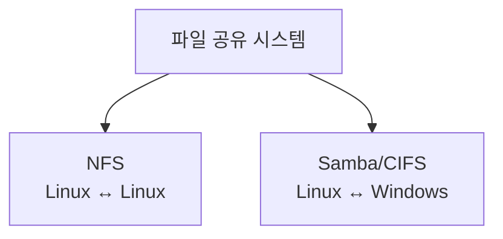

## 전체 흐름 요약

이 글은 리눅스 학습 시리즈의 여덟 번째 파트로, 네트워크를 통한 파일 공유를 다룹니다. 리눅스 간 파일 공유를 위한 NFS와 윈도우와의 파일 공유를 위한 Samba를 모두 학습합니다. 서버 설정부터 클라이언트 접속, 자동 마운트 설정까지 실무에서 필요한 모든 내용을 포함합니다.

---

## 파일 공유 개요

### 파일 공유란?

네트워크를 통해 여러 시스템이 하나의 저장 공간을 공유하는 기술입니다.



### 파일 공유 프로토콜 비교

| 프로토콜 | 용도 | 운영체제 | 포트 |
|----------|------|----------|------|
| **NFS** | 리눅스 간 공유 | Linux/Unix | 2049, 111 |
| **Samba/CIFS** | 윈도우 호환 공유 | Linux ↔ Windows | 445, 139 |

---

## NFS (Network File System)

### NFS 개념

**NFS (Network File System)**
- Linux/Unix 시스템 간 저장 공간을 네트워크로 공유하는 시스템
- 원격 디렉토리를 로컬 디렉토리처럼 사용
- RPC (Remote Procedure Call) 기반

**NFS 특징**
- 상태 정보를 저장하지 않음 (Stateless)
- 마운트 시 쿠키를 부여하여 디렉토리 인식
- portmap/rpcbind를 통한 동적 포트 할당
- NFSv3, NFSv4 버전 존재

**주요 구성 요소**
- **서버**: 디렉토리를 공유하는 시스템
- **클라이언트**: 공유 디렉토리를 마운트하는 시스템
- **portmap/rpcbind**: RPC 서비스 포트 관리

### NFS 서버 설정 (Debian/Ubuntu)

**1. 패키지 설치**
```bash
# NFS 서버 설치
sudo apt update
sudo apt install nfs-kernel-server

# Debian/Ubuntu
sudo apt install nfs-kernel-server nfs-common

# CentOS/RHEL
sudo yum install nfs-utils
```

**2. 공유할 디렉토리 생성**
```bash
# 공유 디렉토리 생성
sudo mkdir -p /srv/nfs/share1
sudo mkdir -p /srv/nfs/share2

# 권한 설정
sudo chmod 755 /srv/nfs/share1
sudo chown nobody:nogroup /srv/nfs/share1
```

**3. NFS 설정 파일 수정**
```bash
# /etc/exports 파일 편집
sudo vi /etc/exports

# 다음 형식으로 추가:
# [공유할 디렉토리] [접근 허용 호스트/네트워크] [옵션]
```

**exports 설정 예시**
```bash
# 특정 IP에게 읽기/쓰기 권한
/srv/nfs/share1    192.168.1.100(rw,sync,no_subtree_check)

# 특정 네트워크 대역에 권한
/srv/nfs/share2    192.168.1.0/24(rw,sync,no_subtree_check)

# 여러 호스트 설정
/srv/nfs/public    192.168.1.100(rw) 192.168.1.101(ro)

# 읽기 전용
/srv/nfs/readonly  *(ro,sync,no_subtree_check)
```

**NFS 옵션 설명**

| 옵션 | 설명 |
|------|------|
| `rw` | 읽기/쓰기 권한 |
| `ro` | 읽기 전용 |
| `sync` | 동기화 (안전하지만 느림) |
| `async` | 비동기화 (빠르지만 위험) |
| `no_subtree_check` | 하위 디렉토리 체크 안 함 (성능 향상) |
| `root_squash` | root를 nobody로 매핑 (기본값, 보안) |
| `no_root_squash` | root 권한 유지 (위험) |
| `all_squash` | 모든 사용자를 nobody로 매핑 |

**4. NFS 서비스 시작**

**Debian/Ubuntu:**
```bash
# exports 파일 다시 로드
sudo exportfs -ra

# 설정 확인
sudo exportfs -v

# NFS 서버 시작
sudo systemctl start nfs-kernel-server
sudo systemctl enable nfs-kernel-server

# 상태 확인
sudo systemctl status nfs-kernel-server
```

**CentOS/RHEL:**
```bash
# exports 파일 다시 로드
sudo exportfs -ra

# 설정 확인
sudo exportfs -v

# NFS 서버 시작
sudo systemctl start nfs-server
sudo systemctl enable nfs-server

# 상태 확인
sudo systemctl status nfs-server
```

**5. 방화벽 설정**

**Debian/Ubuntu (UFW):**
```bash
# NFS 포트 열기
sudo ufw allow from 192.168.1.0/24 to any port nfs
sudo ufw allow from 192.168.1.0/24 to any port 111
```

**CentOS/RHEL (firewalld):**
```bash
# NFS 서비스 허용
sudo firewall-cmd --permanent --add-service=nfs
sudo firewall-cmd --permanent --add-service=nfs3
sudo firewall-cmd --permanent --add-service=rpc-bind

# 또는 한번에
sudo firewall-cmd --permanent --add-service={nfs,nfs3,rpc-bind}

# 적용
sudo firewall-cmd --reload

# 확인
sudo firewall-cmd --list-all
```

**6. 공유 확인**
```bash
# 현재 공유 중인 디렉토리 확인
sudo exportfs -v

# 또는
sudo showmount -e localhost
```

### NFS 클라이언트 설정 (Debian/Ubuntu)

**1. 패키지 설치**
```bash
# Debian/Ubuntu
sudo apt install nfs-common

# CentOS/RHEL
sudo yum install nfs-utils
```

**2. NFS 서버의 공유 목록 확인**
```bash
# 서버의 공유 디렉토리 확인
showmount -e 192.168.1.100

# 예상 출력:
# Export list for 192.168.1.100:
# /srv/nfs/share1 192.168.1.0/24
# /srv/nfs/share2 192.168.1.0/24
```

**3. 마운트 포인트 생성**
```bash
# 마운트 포인트 생성
sudo mkdir -p /mnt/nfs/share1
sudo mkdir -p /mnt/nfs/share2
```

**4. 수동 마운트**
```bash
# NFS 마운트
sudo mount -t nfs 192.168.1.100:/srv/nfs/share1 /mnt/nfs/share1

# 마운트 확인
df -h | grep nfs
mount | grep nfs

# 테스트
cd /mnt/nfs/share1
touch test.txt
ls -l
```

**5. 자동 마운트 설정**
```bash
# /etc/fstab 편집
sudo vi /etc/fstab

# 다음 줄 추가:
192.168.1.100:/srv/nfs/share1  /mnt/nfs/share1  nfs  defaults  0  0
192.168.1.100:/srv/nfs/share2  /mnt/nfs/share2  nfs  defaults  0  0

# 테스트 (모든 fstab 항목 마운트)
sudo mount -a

# 확인
df -h
```

**6. 언마운트**
```bash
# 언마운트
sudo umount /mnt/nfs/share1

# 강제 언마운트 (사용 중일 때)
sudo umount -f /mnt/nfs/share1

# 지연 언마운트 (더 이상 사용하지 않을 때 자동)
sudo umount -l /mnt/nfs/share1
```

### NFS 실무 예시

**시나리오 1: 웹 서버 데이터 공유**
```bash
# 서버: /var/www/html 공유
sudo vi /etc/exports
/var/www/html  192.168.1.0/24(rw,sync,no_subtree_check,no_root_squash)

sudo exportfs -ra
sudo systemctl restart nfs-kernel-server

# 클라이언트: 마운트
sudo mount -t nfs 192.168.1.100:/var/www/html /var/www/html
```

**시나리오 2: 백업 서버 구성**
```bash
# 서버: 백업 디렉토리 공유
sudo mkdir /backup
sudo vi /etc/exports
/backup  192.168.1.0/24(rw,sync,no_subtree_check)

sudo exportfs -ra

# 클라이언트: 자동 백업 스크립트
#!/bin/bash
mount -t nfs 192.168.1.100:/backup /mnt/backup
tar czf /mnt/backup/backup_$(date +%Y%m%d).tar.gz /important/data
umount /mnt/backup
```

---

## Samba (Windows 호환 파일 공유)

### Samba 개념

**Samba란?**
- SMB/CIFS 프로토콜을 사용하여 Linux와 Windows 간 파일 공유
- 윈도우 네트워크에 리눅스를 통합
- 프린터 공유도 지원

**프로토콜**
- **SMB (Server Message Block)**: 윈도우 파일 공유 프로토콜 (포트 445, 139)
- **CIFS (Common Internet File System)**: SMB의 확장 버전, 더 안정적

**Samba 구성**
- **서버 → 클라이언트 방향**:
  - Linux Samba 서버 → Windows/Linux 클라이언트
  - Windows 공유 → Linux 클라이언트 (CIFS)

### Samba 서버 설정 (Linux → Windows/Linux)

**1. 패키지 설치**
```bash
# Debian/Ubuntu
sudo apt update
sudo apt install samba samba-common-bin

# CentOS/RHEL
sudo yum install samba samba-client
```

**2. Samba 설정 파일 백업**
```bash
# 원본 백업
sudo cp /etc/samba/smb.conf /etc/samba/smb.conf.backup
```

**3. Samba 설정 파일 수정**
```bash
# 설정 파일 편집
sudo vi /etc/samba/smb.conf
```

**기본 설정 예시**
```ini
[global]
   workgroup = WORKGROUP
   server string = Samba Server %v
   netbios name = ubuntu-server
   security = user
   map to guest = bad user
   dns proxy = no

[public]
   comment = Public Shared Folder
   path = /srv/samba/public
   browsable = yes
   writable = yes
   guest ok = yes
   read only = no
   create mask = 0755

[private]
   comment = Private Shared Folder
   path = /srv/samba/private
   valid users = @sambagroup
   browsable = yes
   writable = yes
   read only = no
   create mask = 0700
```

**설정 옵션 설명**

| 옵션 | 설명 |
|------|------|
| `[공유이름]` | 공유 폴더 이름 |
| `comment` | 공유 설명 |
| `path` | 실제 디렉토리 경로 |
| `browsable` | 목록에 표시 여부 |
| `writable` | 쓰기 가능 여부 |
| `read only` | 읽기 전용 (writable과 반대) |
| `guest ok` | 게스트 접속 허용 |
| `valid users` | 접근 가능 사용자 |
| `create mask` | 생성 파일 권한 |

**4. 공유 디렉토리 생성**
```bash
# 디렉토리 생성
sudo mkdir -p /srv/samba/public
sudo mkdir -p /srv/samba/private

# 권한 설정
sudo chmod 777 /srv/samba/public
sudo chmod 770 /srv/samba/private

# 그룹 생성 및 설정
sudo groupadd sambagroup
sudo chgrp sambagroup /srv/samba/private
```

**5. Samba 사용자 추가**
```bash
# 리눅스 사용자 생성 (이미 있으면 생략)
sudo useradd -M -s /usr/sbin/nologin sambauser

# Samba 비밀번호 설정
sudo smbpasswd -a sambauser
# 비밀번호 입력 요구됨

# Samba 사용자 활성화
sudo smbpasswd -e sambauser

# Samba 사용자를 그룹에 추가
sudo usermod -aG sambagroup sambauser

# Samba 사용자 목록 확인
sudo pdbedit -L
```

**6. 설정 파일 검증**
```bash
# 문법 오류 확인
testparm

# 간단히 확인
testparm -s
```

**7. Samba 서비스 시작**

**Debian/Ubuntu:**
```bash
# Samba 시작
sudo systemctl start smbd
sudo systemctl enable smbd

# 상태 확인
sudo systemctl status smbd
```

**CentOS/RHEL:**
```bash
# Samba 시작
sudo systemctl start smb
sudo systemctl enable smb

# 상태 확인
sudo systemctl status smb
```

**8. 방화벽 설정**

**Debian/Ubuntu (UFW):**
```bash
# Samba 포트 열기
sudo ufw allow samba
# 또는
sudo ufw allow 445/tcp
sudo ufw allow 139/tcp
```

**CentOS/RHEL (firewalld):**
```bash
# Samba 서비스 허용
sudo firewall-cmd --permanent --add-service=samba
sudo firewall-cmd --reload
```

### Samba 클라이언트 (Linux → Windows 공유 접속)

**1. 필요 패키지 설치**
```bash
# Debian/Ubuntu
sudo apt install cifs-utils smbclient

# CentOS/RHEL
sudo yum install cifs-utils samba-client
```

**2. Windows 공유 폴더 확인**
```bash
# Windows 공유 목록 확인
smbclient -L //192.168.1.200 -U username

# 예시 출력:
# Sharename       Type      Comment
# ---------       ----      -------
# SharedFolder    Disk      My Shared Folder
# IPC$            IPC       Remote IPC
```

**3. Windows 공유 폴더 마운트**
```bash
# 마운트 포인트 생성
sudo mkdir /mnt/windows_share

# 수동 마운트
sudo mount -t cifs //192.168.1.200/SharedFolder /mnt/windows_share -o username=윈도우사용자,password=비밀번호

# 또는 인증 정보 입력 방식
sudo mount -t cifs //192.168.1.200/SharedFolder /mnt/windows_share -o username=윈도우사용자
# 비밀번호 입력 프롬프트 표시됨

# 확인
df -h | grep cifs
```

**4. 자동 마운트 설정**
```bash
# 인증 파일 생성 (보안)
sudo vi /root/.smbcredentials

# 내용:
username=윈도우사용자
password=비밀번호

# 권한 설정
sudo chmod 600 /root/.smbcredentials

# /etc/fstab 편집
sudo vi /etc/fstab

# 추가:
//192.168.1.200/SharedFolder  /mnt/windows_share  cifs  credentials=/root/.smbcredentials,uid=1000,gid=1000  0  0

# 테스트
sudo mount -a
df -h
```

**5. 언마운트**
```bash
# 언마운트
sudo umount /mnt/windows_share

# 강제 언마운트
sudo umount -f /mnt/windows_share
```

### Windows에서 Linux Samba 접속

**Windows 탐색기에서 접속**
```
1. Windows 탐색기 열기
2. 주소창에 입력: \\192.168.1.100\public
3. 사용자 인증 필요 시:
   - 사용자: sambauser
   - 비밀번호: (설정한 비밀번호)
```

**네트워크 드라이브 연결**
```
1. 내 PC > 네트워크 드라이브 연결
2. 폴더: \\192.168.1.100\public
3. 다른 자격 증명 사용
4. 완료
```

### Samba 실무 예시

**시나리오 1: 부서 공유 폴더 설정**
```bash
# 부서별 디렉토리 생성
sudo mkdir -p /srv/samba/{dev,sales,hr}

# 그룹 생성
sudo groupadd dev_team
sudo groupadd sales_team

# 설정 파일
sudo vi /etc/samba/smb.conf

[Development]
   path = /srv/samba/dev
   valid users = @dev_team
   writable = yes
   browsable = yes
   create mask = 0770

[Sales]
   path = /srv/samba/sales
   valid users = @sales_team
   writable = yes
   browsable = yes
   create mask = 0770
```

**시나리오 2: 읽기 전용 공용 자료실**
```bash
# 공용 자료 디렉토리
sudo mkdir /srv/samba/docs

# 설정
[Documents]
   path = /srv/samba/docs
   browsable = yes
   read only = yes
   guest ok = yes
```

---

## NFS vs Samba 비교

| 특성 | NFS | Samba |
|------|-----|-------|
| **주 용도** | Linux ↔ Linux | Linux ↔ Windows |
| **프로토콜** | NFS | SMB/CIFS |
| **포트** | 2049, 111 | 445, 139 |
| **성능** | 빠름 | 보통 |
| **설정** | 간단 | 복잡 |
| **인증** | 호스트 기반 | 사용자 기반 |
| **사용 예** | 서버 간 데이터 공유 | 윈도우 호환 필요 시 |

---

## 주요 개념 요약표

| 개념 | 설명 | 핵심 명령어 |
|------|------|-------------|
| **NFS** | Linux 간 파일 공유 | exports, exportfs, mount |
| **Samba** | Windows 호환 파일 공유 | smb.conf, smbpasswd |
| **exports** | NFS 공유 설정 파일 | /etc/exports |
| **showmount** | NFS 공유 목록 확인 | showmount -e |
| **CIFS** | Windows 공유 마운트 | mount -t cifs |
| **smbclient** | Samba 클라이언트 도구 | smbclient -L |
| **testparm** | Samba 설정 검증 | testparm |
| **rw/ro** | 읽기쓰기/읽기전용 | NFS, Samba 옵션 |

---