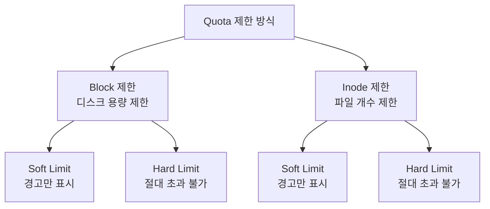
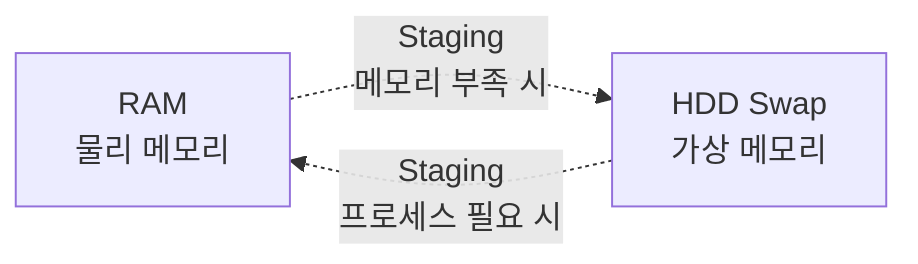

## 전체 흐름 요약

이번 Part 9에서는 리눅스 시스템 관리의 필수 기능들을 다룹니다.

먼저 **작업 스케줄링(cron/at)**을 통해 시스템 작업을 자동화하는 방법을 배웁니다. 시스템에서 주기적으로 실행해야 하는 백업 작업, 파일 다운로드, 로그 정리, 시스템 점검 등의 작업을 cron 데몬과 crontab 명령어로 예약합니다. `/etc/crontab` 파일과 사용자별 crontab 설정의 차이를 이해하고, `run-parts` 메커니즘으로 주기별 디렉토리 관리를 학습합니다. 또한 cron.allow/cron.deny를 통한 사용자 접근 제어와 at 명령어를 활용한 일회성 작업 예약도 다룹니다.

다음으로 **LVM(Logical Volume Manager)**을 학습합니다. 하드 디스크를 더 효율적이고 유연하게 관리할 수 있는 프로그램입니다. 전통적인 파티션 방식과 달리 LVM은 물리 디스크를 논리적으로 관리하여 파티션 크기를 동적으로 조정할 수 있습니다. 파티션 나누기 → PV(Physical Volume) 생성 → VG(Volume Group) 구성 → LV(Logical Volume) 생성 → 포맷 → 마운트의 전체 작업 흐름을 실습합니다.

**Quota(디스크 할당량)** 설정을 통해 사용자별 또는 그룹별로 디스크 사용을 제한하는 방법을 배웁니다. 파일 시스템마다 사용자나 그룹이 생성할 수 있는 파일의 용량 또는 개수를 제한합니다. inode 제한(파일 개수)과 block 제한(용량)의 차이를 이해하고, soft limit과 hard limit의 개념, grace period 설정을 학습합니다. `/etc/fstab`에 quota 옵션을 추가하고, `quotacheck`, `edquota`, `repquota` 명령어로 quota를 관리합니다.

마지막으로 **Swap 메모리(가상 메모리)** 관리를 학습합니다. HDD를 RAM처럼 사용하는 Swap 메모리는 물리 메모리가 부족할 때 디스크 공간을 임시 메모리로 활용합니다. 보통 메인 메모리의 1.5배에서 2배 정도 설정하며, staging(프로그램이 RAM ↔ HDD 간 이동되는 현상)의 개념을 이해합니다. Swap 파티션 설정 방법과 Swap 파일 설정 방법 두 가지를 모두 학습합니다.

---

## 1. 작업 스케줄링 (Cron & At)

### 1.1 Cron 개요 및 작업 스케줄 지정

시스템에서 프로세스를 실행할 때 주기적으로 해야 하는 일이거나, 파일을 다운받는 작업과 같이 시간이 오래 걸리는 작업들, 혹은 새벽에 작업을 실행해야 하는 경우 주로 cron을 사용합니다.

**주기적, 반복적인 작업을 자동으로 실행할 수 있도록 시스템 작업을 예약해 놓은 것을 cron**이라 부르며, **cron과 관련된 데몬(서비스)은 crond**입니다. 이와 관련된 파일은 `/etc/crontab` 입니다.

```mermaid
graph LR
    A[cron 데몬<br/>crond] --> B[/etc/crontab<br/>시스템 전체 설정]
    A --> C[/var/spool/cron/<br/>사용자별 crontab]
    A --> D[/etc/cron.d/<br/>애플리케이션별 설정]
    B --> E[run-parts 실행]
    E --> F[/etc/cron.hourly/]
    E --> G[/etc/cron.daily/]
    E --> H[/etc/cron.weekly/]
    E --> I[/etc/cron.monthly/]
```

### 1.2 Crontab 명령어

crontab은 주기적, 반복적 작업을 실행하는 명령어입니다.

#### 기본 문법

```bash
crontab [-u user] file
crontab [-u user] [option]
crontab [option]

# 특정 사용자의 crontab 목록 확인 예시
crontab -u isec_admin -l
```

#### 주요 옵션

| 옵션 | 설명 | 예시 |
|------|------|------|
| `-e` | 작업할 내용 작성, 수정하기 | `crontab -e` |
| `-l` | 현재 설정되어 있는 예약 확인 | `crontab -l` |
| `-r` | 설정되어 있는 작업 삭제 | `crontab -r` |
| `-u` | 특정 사용자의 crontab 관리 | `crontab -u isec_admin -l` |

### 1.3 Crontab 스크립트 파일 형식

crontab 스크립트는 다음과 같은 형식으로 작성합니다:

```
분 시 일 월 요일 [사용자] 명령어

* * * * * command
│ │ │ │ │
│ │ │ │ └─ 요일 (0-7, 0과 7은 일요일, 1=월요일, ..., 6=토요일)
│ │ │ └─── 월 (1-12)
│ │ └───── 일 (1-31)
│ └─────── 시 (0-23)
└───────── 분 (0-59)
```

#### 실습 예시

```bash
# 매 시간 50분에 시스템 재부팅
50 * * * * shutdown -r now

# 매일 새벽 5시에 /home 디렉토리를 /backup으로 백업
0 5 * * * /bin/cp -r /home /backup

# 매월 1일 새벽 5시에 /home 디렉토리 백업 (root 계정으로 실행)
0 5 1 * * root cp -r /home /backup
```

#### 복잡한 cron 예시

매주 일요일 오전 03:00에 동작하며, `/bin/rm -rf` 명령어를 사용하여 `/home/isec_admin` 디렉토리 밑에 있는 모든 디렉토리 및 파일을 삭제하는 crontab 작성. 단, 표준 출력은 `/dev/null`로 보내 출력하지 않게 하고, 표준 에러는 표준출력으로 재입력하도록 설정합니다.

```bash
0 3 * * 0 /bin/rm -rf /home/isec_admin/* > /dev/null 2>&1
```

**설명:**
- `0 3 * * 0`: 매주 일요일(0) 오전 3시 0분
- `> /dev/null`: 표준 출력을 /dev/null로 리다이렉트 (출력 숨김)
- `2>&1`: 표준 에러(2)를 표준 출력(1)으로 리다이렉트

### 1.4 Crontab 설정 방법

#### 방법 1: crontab -e 실행

```bash
# crontab 편집 모드로 진입
crontab -e

# PATH 설정 (명령어의 절대경로를 지정하지 않으려면 PATH 설정)
PATH=/sbin:/bin:/usr/bin

# 매 시간 50분에 시스템 재부팅
50 * * * * shutdown -r now
```

**특징:**
- 계정명을 입력하지 않습니다 (현재 사용자 기준)
- 각 사용자의 crontab은 `/var/spool/cron/사용자명` 파일로 자동 저장됩니다

```bash
# 사용자별 crontab 파일 확인
ls -l /var/spool/cron/

# 크론탭이 만들어지면 사용자 이름으로 파일이 자동 생성됩니다
```

#### 방법 2: 데몬으로 실행 (/etc/crontab 직접 수정)

```bash
# 시스템 전체 crontab 파일 편집
vi /etc/crontab

# 매 시간 50분에 시스템 재부팅 (계정명까지 입력)
50 * * * * root shutdown -r now

# 매월 1일 새벽 5시에 /home 백업
0 5 1 * * root cp -r /home /backup

# 설정 후 반드시 데몬 재시작
systemctl restart crond
```

**특징:**
- **계정명까지 반드시 입력해야 합니다**
- 변경 후 crond 데몬을 재시작해야 적용됩니다

### 1.5 /etc/crontab 파일 관련 디렉토리 구조 (run-parts)

`/etc/crontab` 파일은 `run-parts`를 사용하여 주기별 디렉토리의 스크립트를 자동으로 실행합니다.

```mermaid
graph TD
    A[/etc/crontab] --> B[run-parts 메커니즘]
    B --> C[/etc/cron.hourly/<br/>매시간 실행]
    B --> D[/etc/cron.daily/<br/>매일 실행]
    B --> E[/etc/cron.weekly/<br/>매주 실행]
    B --> F[/etc/cron.monthly/<br/>매월 실행]
```

#### /etc/crontab 파일 내용 예시

```bash
# /etc/crontab 파일 내용 확인
cat /etc/crontab

# 예시:
SHELL=/bin/bash
PATH=/sbin:/bin:/usr/sbin:/usr/bin

# 분 시 일 월 요일  사용자  명령어

# 매시간 cron.hourly 디렉토리의 스크립트 실행
01 * * * * root run-parts /etc/cron.hourly

# 매일 새벽 4시 2분에 cron.daily 디렉토리의 스크립트 실행
02 4 * * * root run-parts /etc/cron.daily

# 매주 일요일 새벽 4시 22분에 cron.weekly 디렉토리의 스크립트 실행
22 4 * * 0 root run-parts /etc/cron.weekly

# 매월 1일 새벽 4시 42분에 cron.monthly 디렉토리의 스크립트 실행
42 4 1 * * root run-parts /etc/cron.monthly
```

**run-parts란?**
- 지정된 디렉토리 내의 실행 가능한 모든 스크립트를 순차적으로 실행하는 명령어입니다
- 주기적인 시스템 관리 작업을 디렉토리 단위로 간편하게 관리할 수 있습니다

### 1.6 Cron 사용자 제한

cron 명령은 기본적으로 시스템에 허용된 계정 사용자 모두 사용 가능합니다. crontab 명령 접근 제한을 위해서는 `/etc/cron.allow`, `/etc/cron.deny` 설정 파일을 사용합니다.

#### 접근 제어 파일

| 파일 | 설명 |
|------|------|
| **/etc/cron.allow** | 등록된 사용자만 crontab 명령 사용 가능 |
| **/etc/cron.deny** | 등록된 사용자는 crontab 사용 불가 |

#### 우선순위 규칙

1. **cron.allow만 존재**: 등록된 사용자만 crontab 사용 가능
2. **cron.deny만 존재**: 등록된 사용자 crontab 사용 불가
3. **두 파일 동시 존재**: cron.allow 파일이 우선, 접근권한은 640 이하로 부여 권장 (그룹은 주지 말고 소유자쪽으로만 주라는 의미)

#### 계정별 사용자 제한

`/etc/cron.deny` 또는 `/etc/cron.allow` 파일에 제한 또는 허용할 계정명을 한 줄씩 입력합니다.

```bash
# isec_admin 사용자만 cron 사용 허용
echo isec_admin > /etc/cron.allow

# 또는 여러 사용자 추가
echo "root" >> /etc/cron.allow
echo "admin" >> /etc/cron.allow

# 특정 사용자 차단
echo "guest" > /etc/cron.deny
```

### 1.7 At 명령어 - 일회성 작업 예약

at 명령어는 특정 시간에 **한 번만** 명령어를 실행합니다.

#### 기본 사용법

```bash
# 내일 새벽 3시에 명령 실행
at 3:00 am tomorrow

# 특정 날짜와 시간에 명령 실행
at 11:00 pm January 30

# 1시간 후에 명령 실행
at now + 1 hours
```

#### 실습 예시

```bash
# 내일 새벽 3시에 작업 예약
at 3:00 am tomorrow
at> /usr/local/bin/backup.sh
at> <Ctrl+D>   # 입력 종료

# 예약된 작업 목록 확인
atq
# 또는
at -l

# 특정 작업 삭제
atrm [작업번호]
# 또는
at -d [작업번호]
```

---

## 2. LVM (Logical Volume Manager)

### 2.1 LVM 개요

**LVM(Logical Volume Manager)**은 하드 디스크를 좀 더 효율적이고 유연하게 관리할 수 있는 프로그램입니다.

전통적인 파티션 방식에서는 한 번 파티션을 나누면 크기를 변경하기 매우 어렵습니다. 하지만 LVM을 사용하면 다음과 같은 장점이 있습니다:

- 파티션 크기를 동적으로 조정할 수 있습니다
- 여러 개의 물리 디스크를 하나의 논리 볼륨으로 통합할 수 있습니다
- 시스템 운영 중에도 볼륨 크기를 변경할 수 있습니다
- 스냅샷 기능으로 특정 시점의 데이터 백업이 가능합니다

### 2.2 LVM 작업 Flow

LVM 구성은 다음과 같은 순서로 진행됩니다:


**단계별 설명:**
1. **파티션 나누기**: `fdisk`로 물리 디스크에 파티션 생성 (타입: 8e = Linux LVM)
2. **PV (Physical Volume)**: 파티션을 LVM에서 사용할 수 있는 물리 볼륨으로 초기화
3. **VG (Volume Group)**: 여러 PV를 묶어서 하나의 스토리지 풀 생성
4. **LV (Logical Volume)**: VG에서 필요한 만큼 논리 볼륨을 할당
5. **포맷**: 파일시스템 생성 (ext4, xfs 등)
6. **마운트**: 디렉토리에 마운트하여 사용

### 2.3 LVM 실습

#### 1단계: 하드 디스크 추가

```bash
# 컴퓨터를 끄고 하드를 추가한 후 다시 부팅합니다
# VMware 또는 VirtualBox 환경에서 가상 하드 추가

# 추가된 디스크 확인
lsblk
fdisk -l

# 출력 예시:
# /dev/sdb: 10GB
# /dev/sdc: 10GB
```

#### 2단계: 파티션 나누기

LVM 파티션의 속성 코드는 **8e (Linux LVM)**입니다.

```bash
# fdisk로 /dev/sdb 파티션 생성
fdisk /dev/sdb

# fdisk 명령 순서:
# n : 새 파티션 생성
# p : primary 파티션
# 1 : 파티션 번호
# enter : 시작 섹터 (기본값)
# enter : 종료 섹터 (기본값, 전체 사용)
# t : 파티션 타입 변경
# 8e : Linux LVM 타입
# p : 파티션 테이블 출력 (확인)
# w : 저장 및 종료
```

**실습 명령어:**

```bash
fdisk /dev/sdb

# 입력 순서:
n
p
1
[Enter]
[Enter]
t
8e
p
w

# 파티션 테이블 갱신
partprobe /dev/sdb

# 생성된 파티션 확인
lsblk
fdisk -l /dev/sdb
```

#### 3단계: PV (Physical Volume) 구성

```bash
# PV 생성 문법
pvcreate [장치명] [장치명] [장치명] ...

# 실습: /dev/sdb1, /dev/sdc1에 PV 생성
pvcreate /dev/sdb1 /dev/sdc1

# PV 확인
pvdisplay
# 또는
pvscan

# 출력 예시:
# PV         VG   Fmt  Attr PSize  PFree
# /dev/sdb1       lvm2 ---  10.00g 10.00g
# /dev/sdc1       lvm2 ---  10.00g 10.00g
```

#### 4단계: VG (Volume Group) 구성

```bash
# VG 생성 문법
vgcreate [VG명] [장치명] [장치명] ...

# 실습: vg라는 이름의 VG 생성
vgcreate vg /dev/sdb1 /dev/sdc1

# VG 확인
vgdisplay

# 출력 예시:
# VG Name         vg
# VG Size         19.99 GiB
# PE Size         4.00 MiB
# Total PE        5118
# Free PE         5118
```

#### 5단계: LV (Logical Volume) 구성

##### LV 생성

```bash
# LV 생성 문법
lvcreate -L [크기(용량)] -n [LV명] [VG명]

# 실습 1: 300MB 크기의 lv1 생성
lvcreate -L 300MB -n lv1 vg

# 실습 2: 1GB 크기의 lv2 생성
lvcreate --size 1G --name lv2 vg
# 또는
lvcreate -L 1G -n lv2 vg

# 실습 3: 남은 공간 100% 사용하여 lv3 생성
lvcreate --extents 100%FREE --name lv3 vg
# 또는
lvcreate -l 100%FREE -n lv3 vg

# LV 확인
lvdisplay
lvscan

# 출력 예시:
# LV Path         /dev/vg/lv1
# LV Name         lv1
# VG Name         vg
# LV Size         300.00 MiB
```

#### 6단계: 파일시스템 포맷

```bash
# ext4 파일시스템으로 포맷
mkfs -t ext4 /dev/vg/lv1
mkfs -t ext4 /dev/vg/lv2
mkfs -t ext4 /dev/vg/lv3

# 또는 mkfs.ext4 명령어 사용
mkfs.ext4 /dev/vg/lv1
```

#### 7단계: 마운트 포인트 생성 및 마운트

```bash
# 마운트 포인트 생성
mkdir /lvm1 /lvm2 /lvm3

# 또는 한 번에 생성
mkdir /lvm{1..3}

# 생성 확인
ls -ld /lvm*

# LV를 마운트
mount /dev/vg/lv1 /lvm1
mount /dev/vg/lv2 /lvm2
mount /dev/vg/lv3 /lvm3

# 마운트 확인
df -hT | grep lvm
```

#### 8단계: 부팅 시 자동 마운트 설정

```bash
# /etc/fstab 파일 편집
vi /etc/fstab

# 다음 내용 추가:
/dev/vg/lv1  /lvm1  ext4  defaults  0  0
/dev/vg/lv2  /lvm2  ext4  defaults  0  0
/dev/vg/lv3  /lvm3  ext4  defaults  0  0

# fstab 설정 테스트 (오류 확인)
mount -a

# 마운트 확인
df -h
```

### 2.4 LV 크기 조정

#### LV 축소

```bash
# LV 축소 문법
lvreduce -L -[크기(용량)] [LV경로]
lvreduce -l -[크기(퍼센트)]%FREE [LV경로]

# 예시: lv1을 100MB 축소
lvreduce -L -100MB /dev/vg/lv1
```

**주의사항:**
- LV 축소 전에 반드시 언마운트해야 합니다
- 파일시스템 크기도 함께 축소해야 합니다
- 데이터 손실 위험이 있으므로 백업 필수입니다

#### LV 확장

```bash
# LV 확장 문법
lvextend -L +[크기(용량)] [LV경로]
lvextend -l +[크기(퍼센트)]%FREE [LV경로]

# 예시 1: lv1을 500MB 확장
lvextend -L +500MB /dev/vg/lv1

# 예시 2: 남은 VG 공간의 50% 사용하여 확장
lvextend -l +50%FREE /dev/vg/lv1

# 예시 3: 남은 VG 공간 전체 사용하여 확장
lvextend -l +100%FREE /dev/vg/lv1

# LV는 확장되었지만 파일시스템은 아직 확장되지 않음
# 파일시스템 확장 (ext4)
resize2fs /dev/vg/lv1

# 확장 확인
df -h /lvm1
```

---

## 3. Quota 설정

### 3.1 Quota 개요

**Quota**는 사용자별로 디스크 사용을 제한하는 방법입니다. 즉, 파일 시스템마다 사용자나 그룹이 생성할 수 있는 파일의 용량 또는 개수를 제한하는 방법입니다.

#### Quota 설정 요구사항

Quota는 사용자 또는 그룹이 가질 수 있는 **inode의 수** 또는 **디스크 block 수**를 제한함으로써 디스크 사용을 제한합니다.

**1) Inode 제한:**
- 파일의 개수를 제한하는 것입니다
- 제한된 개수 이상의 파일을 생성할 수 없습니다

**2) Block 제한:**
- Quota를 설정하는 경우 inode보다는 block 제한을 주로 합니다
- 흔히 쓰고 있는 용량의 제한으로 제한된 용량 이상의 데이터를 저장할 수 없습니다



### 3.2 Quota 설정 순서

#### 1단계: 사용자 계정 추가

Quota를 적용할 사용자를 생성합니다. **디렉토리 이름과 유저 이름을 같게 해줘야 합니다.**

```bash
# 사용자 홈 디렉토리를 /userhome/choi로 지정하여 choi 사용자 생성
useradd -d /userhome/choi choi

# hong 사용자 생성
useradd -d /userhome/hong hong

# 비밀번호 설정
passwd choi
passwd hong
```

#### 2단계: /etc/fstab 수정

`/etc/fstab` 옵션 부분에 quota 부분을 추가합니다.

```bash
# /etc/fstab 파일 편집
vi /etc/fstab

# 다음과 같이 quota 옵션 추가:
/dev/sdb1  /userhome  ext4  defaults,usrjquota=aquota.user,jqfmt=vfsv0  0  0
```

**옵션 설명:**
- `usrjquota=aquota.user`: 사용자 quota 데이터베이스 파일명
- `jqfmt=vfsv0`: Quota 파일 포맷 버전

#### 3단계: 재부팅 또는 재마운트

```bash
# 재마운트하여 quota 옵션 적용
mount -o remount /userhome

# 마운트 옵션 확인
mount | grep /userhome
```

#### 4단계: Quota DB 설정

fstab에 quota 옵션 적용 후 quota DB(기록 파일)를 생성합니다.

##### quotacheck 명령어

파일 시스템의 디스크 사용 상태를 검색하고, 현재 디스크 사용 테이블을 작성하여 테이블의 정보를 파일 시스템의 디스크 사용량 할당 파일에 기록된 테이블의 정보와 비교하여 불일치 시, 사용량 할당 파일인 `aquota.user`, `aquota.group` 파일을 최신 상태로 갱신합니다.

##### quotaon, quotaoff 명령어

quota DB 파일을 활성화 및 비활성화시킵니다.

#### 5단계: 사용자 홈에 Quota 설정

```bash
# /userhome 디렉토리로 이동
cd /userhome

# Quota 데이터베이스 생성 및 검사
quotacheck -augmn

# 기존 quota 파일 삭제 (있다면)
rm -rf aquota.*

# 다시 quota 검사
quotacheck -augmn

# Quota 파일 생성
touch aquota.user aquota.group

# 권한 설정 (보안을 위해 600)
chmod 600 aquota.*

# Quota 데이터베이스 최종 생성
quotacheck -augmn

# Quota 활성화
quotaon -avug
```

**quotacheck 옵션:**
- `-a`: 모든 파일시스템 검사
- `-u`: 사용자 quota 검사
- `-g`: 그룹 quota 검사
- `-m`: 파일시스템을 읽기 전용으로 재마운트하지 않음
- `-n`: 실제로 파일시스템을 검사하지 않고 테스트만 수행

**quotaon 옵션:**
- `-a`: 모든 파일시스템의 quota 활성화
- `-v`: 자세한 정보 출력
- `-u`: 사용자 quota 활성화
- `-g`: 그룹 quota 활성화

### 3.3 사용자별 Quota 할당

#### edquota 명령어

edquota 명령어를 사용하여 사용자별로 quota를 할당합니다.

```bash
# edquota 문법
edquota [옵션] [username 또는 groupname]

# choi 사용자에게 quota 할당
edquota -u choi
```

edquota를 실행하면 vi 편집기가 열립니다:

```
Disk quotas for user choi (uid 1001):
Filesystem   blocks   soft   hard   inodes   soft   hard
/dev/sdb1         0   1024  15360        0      0      0
```

**항목 설명:**
- `blocks`: 현재 사용 중인 디스크 블록 수
- `soft`: Soft limit (경고 제한, KB 단위)
- `hard`: Hard limit (절대 제한, KB 단위)
- `inodes`: 현재 사용 중인 inode 수 (파일 개수)
- `soft`: Inode soft limit (파일 개수)
- `hard`: Inode hard limit (파일 개수)

**실습 예시:**

```bash
# choi 사용자 quota 설정
edquota -u choi

# 다음과 같이 수정:
# soft: 1024 KB (1MB)
# hard: 15360 KB (15MB)
Filesystem   blocks   soft   hard   inodes   soft   hard
/dev/sdb1         0   1024  15360        0      0      0
```

### 3.4 사용자별 Quota 초과 확인

```bash
# choi 사용자로 전환
su choi

# 테스트 파일 복사 (약 6MB 크기의 커널 이미지)
cp /boot/vmlinuz-3.10.0-957.el7.x86_64 test1
cp /boot/vmlinuz-3.10.0-957.el7.x86_64 test2
cp /boot/vmlinuz-3.10.0-957.el7.x86_64 test3

# Quota 초과 시 에러 메시지 확인
# sdb1: warning, user block quota exceeded.
```

### 3.5 Quota 내용 확인

```bash
# 파일 목록 확인
ls -l

# 현재 사용자의 quota 확인
quota

# 블록 사이즈 확인
dumpe2fs /dev/sdb1 | grep "Block size"

# 모든 사용자의 quota 확인
repquota /userhome
```

**repquota 출력 예시:**

```
*** Report for user quotas on device /dev/sdb1
Block grace time: 7days; Inode grace time: 7days
                        Block limits                File limits
User            used    soft    hard  grace    used  soft  hard  grace
----------------------------------------------------------------------
choi      --    6144    1024   15360              3     0     0
hong      --       0       0       0              0     0     0
```

### 3.6 기존 사용자 Quota 복사

기존에 등록된 사용자의 quota를 다른 사용자에게 동일하게 할당할 수 있습니다.

```bash
# choi 사용자의 quota 설정을 hong 사용자에게 복사
edquota -p choi hong
```

### 3.7 Grace Period 설정

Grace period는 soft limit을 초과한 사용자에게 주어지는 유예 기간입니다.

```bash
# 사용자별 grace period 변경
edquota -u choi -T

# 전체 사용자 grace period 변경
edquota -t
```

edquota -t를 실행하면 다음과 같은 화면이 나타납니다:

```
Grace period before enforcing soft limits for users:
Time units may be: days, hours, minutes, or seconds
  Filesystem    Block grace period    Inode grace period
  /dev/sdb1              7days                 7days
```

기본값은 7일이며, 이를 원하는 값으로 변경할 수 있습니다.

---

## 4. Swap 메모리 (가상 메모리)

### 4.1 Swap 메모리 개요

**Swap 메모리는 가상 메모리입니다.** HDD를 RAM처럼 사용하는 것을 Swap 메모리라고 합니다.

보통 메인 메모리의 **1.5배에서 2배 정도** 설정해줍니다.

#### Staging 개념

**Staging**은 프로그램이 이동되는 현상입니다:
- RAM → HDD: 메모리가 부족할 때 사용 빈도가 낮은 프로세스를 디스크로 이동
- HDD → RAM: 필요한 프로세스를 디스크에서 메모리로 다시 로드

느린 장치에서 빠른 장치로 옮겨가는 것을 의미합니다.



### 4.2 Swap 메모리 설정 방법

Swap을 설정하는 방법은 두 가지가 있습니다:

1. **Swap 파티션 설정**: 별도의 파티션을 swap으로 설정 (성능 우수)
2. **Swap 파일 설정**: 파일을 swap으로 사용 (설정 간편)

---

## 5. 첫 번째 방법: Swap 파티션 설정

### 5.1 Swap 파티션 추가

별도의 하드 디스크(sdb)를 추가한 후 Swap 파티션을 설정합니다.

```bash
# 디스크 확인
fdisk -l /dev/sdb
```

### 5.2 Swap 파티션 생성

Swap 파티션의 속성 코드는 **82 (Linux swap)**입니다.

```bash
# fdisk로 swap 파티션 생성
fdisk /dev/sdb

# fdisk 명령 순서:
# n : 새 파티션 생성
# p : primary 파티션
# 1 : 파티션 번호
# enter : 시작 섹터
# enter : 종료 섹터 (전체 사용)
# t : 파티션 타입 변경
# 82 : Linux swap
# p : 파티션 테이블 확인
# w : 저장 및 종료
```

### 5.3 Swap 영역 생성 및 활성화

```bash
# 1. Swap 영역 생성
mkswap /dev/sdb1

# 2. Swap 활성화
swapon /dev/sdb1

# 3. 확인
swapon -s
# 또는
free -h
```

**swap 비활성화:**

```bash
swapoff /dev/sdb1
```

### 5.4 Swap 파티션을 /etc/fstab에 등록

부팅 시 자동으로 swap을 활성화하려면 `/etc/fstab`에 등록해야 합니다.

```bash
# 1. UUID 확인 및 복사
blkid /dev/sdb1

# 출력 예시:
# /dev/sdb1: UUID="xxxxx-xxxx-xxxx" TYPE="swap"

# 2. /etc/fstab에 등록
vi /etc/fstab

# 다음 줄 추가:
/dev/sdb1  swap  swap  defaults  0  0

# 또는 UUID 사용 (권장):
UUID=xxxxx-xxxx-xxxx  swap  swap  defaults  0  0

# 3. swapon -a 명령으로 활성화 테스트
swapon -a

# 4. 확인
swapon -s
free -h
```

---

## 6. 두 번째 방법: Swap 파일 설정

### 6.1 Swap 파일을 저장할 디렉토리 생성 (선택사항)

```bash
# Swap 디렉토리 생성 (선택사항, 파일만 있으면 됨)
mkdir /swap
cd /swap
```

### 6.2 dd로 Swap 파일 생성

4GB Swap 파일을 생성하는 경우 파일 크기: 4096 × 1024 = 4194304

```bash
# dd 명령어로 swap 파일 생성 (4GB)
dd if=/dev/zero of=/swap/swap01 bs=1M count=4096
```

**dd 명령어 옵션 설명:**
- `dd`: disk dump, 데이터를 복사하고 변환하는 유틸리티
- `if`: input file, 복사할 파일
- `of`: output file, 새로 생성될 swap 파일
- `bs`: 블록 크기 (1M = 1MB)
- `count`: 복사 횟수 (4096번 × 1MB = 4GB)
- `if=/dev/zero`: of에 지정된 파일의 데이터를 모두 0으로 채움

**실행 결과:**

```bash
# dd 명령어 실행
dd if=/dev/zero of=/swap/swap01 bs=1M count=4096

# 출력 예시:
# 4096+0 records in
# 4096+0 records out
# 4294967296 bytes (4.3 GB) copied, 45.2345 s, 95.0 MB/s
```

### 6.3 Swap 파일 퍼미션 변경

보안을 위해 소유자 이외의 사용자에게 권한을 주지 않습니다.

```bash
chmod 600 /swap/swap01

# 권한 확인
ls -l /swap/swap01
# 출력: -rw------- 1 root root 4294967296 Jan 15 10:00 /swap/swap01
```

### 6.4 mkswap 명령: 파일에 Swap 영역 생성

```bash
mkswap /swap/swap01

# 출력 예시:
# Setting up swapspace version 1, size = 4194300 KiB
# no label, UUID=xxxxx-xxxx-xxxx
```

### 6.5 swapon: Swap 파일 활성화

```bash
# Swap 파일 활성화
swapon /swap/swap01

# 확인
swapon -s
free -h
```

### 6.6 /etc/fstab에 적용

```bash
# /etc/fstab 편집
vi /etc/fstab

# 다음 줄 추가:
/swap/swap01  swap  swap  defaults  0  0

# 저장 후 종료
```

### 6.7 Swap 파일 활성화 및 설정 확인

```bash
# Swap 활성화
swapon -a

# 확인 (다음 명령어 중 하나 사용)
free -h
swapon -s
cat /proc/swaps
```

**free -h 출력 예시:**

```
              total        used        free      shared  buff/cache   available
Mem:           3.7G        1.2G        1.5G         50M        1.0G        2.3G
Swap:          4.0G          0B        4.0G
```

### 6.8 Swap 영역 제거

```bash
# 1. Swap 비활성화
swapoff /swap/swap01

# 2. Swap 파일 삭제
rm -rf /swap/swap01

# 3. /etc/fstab 설정 내용 제거
vi /etc/fstab
# /swap/swap01 관련 줄 삭제

# 4. 확인
free -h
swapon -s
```

---

## 주요 개념 요약표

| 구분 | 주요 개념 | 설명 |
|------|----------|------|
| **Cron** | crond 데몬 | 주기적 작업 실행을 담당하는 백그라운드 서비스 |
| | crontab | 사용자별 작업 스케줄 관리 명령어 (-e, -l, -r) |
| | /etc/crontab | 시스템 전체 cron 설정 파일 (계정명 필수) |
| | 시간 형식 | 분(0-59) 시(0-23) 일(1-31) 월(1-12) 요일(0-7) |
| | run-parts | 디렉토리 내 스크립트를 순차 실행 |
| | cron.allow/deny | cron 사용자 접근 제어 파일 |
| **At** | at 명령어 | 일회성 작업 예약 |
| | atq | 예약된 작업 목록 확인 |
| | atrm | 예약된 작업 삭제 |
| **LVM** | PV (Physical Volume) | 파티션을 LVM에서 사용 가능하게 초기화 |
| | VG (Volume Group) | 여러 PV를 묶은 스토리지 풀 |
| | LV (Logical Volume) | VG에서 할당받은 논리적 파티션 |
| | 작업 흐름 | 파티션 → PV → VG → LV → 포맷 → 마운트 |
| | pvcreate | PV 생성 |
| | vgcreate | VG 생성 |
| | lvcreate | LV 생성 (-L: 용량, -l: 퍼센트) |
| | lvextend | LV 확장 |
| | lvreduce | LV 축소 |
| | resize2fs | ext4 파일시스템 확장 |
| **Quota** | 개념 | 사용자/그룹별 디스크 사용 제한 |
| | inode 제한 | 파일 개수 제한 |
| | block 제한 | 디스크 용량 제한 (주로 사용) |
| | soft limit | 경고만 표시, grace period 적용 |
| | hard limit | 절대 초과 불가 |
| | quotacheck | quota 데이터베이스 생성/갱신 |
| | quotaon/off | quota 활성화/비활성화 |
| | edquota | 사용자/그룹 quota 편집 |
| | repquota | 전체 사용자 quota 리포트 |
| | aquota.user | 사용자 quota DB 파일 |
| | aquota.group | 그룹 quota DB 파일 |
| **Swap** | 개념 | HDD를 RAM처럼 사용하는 가상 메모리 |
| | 권장 크기 | 물리 메모리의 1.5~2배 |
| | Staging | RAM ↔ HDD 간 프로그램 이동 |
| | 파티션 타입 | 82 (Linux swap) |
| | mkswap | swap 영역 생성 |
| | swapon | swap 활성화 |
| | swapoff | swap 비활성화 |
| | 설정 방법 | 1) Swap 파티션, 2) Swap 파일 |

---

## 데비안(Debian/Ubuntu) vs CentOS 차이점

### Cron

| 항목 | Debian/Ubuntu | CentOS/RHEL |
|------|---------------|-------------|
| 패키지명 | `cron` | `cronie` |
| 서비스명 | `cron` | `crond` |
| 서비스 시작 | `systemctl restart cron` | `systemctl restart crond` |
| 서비스 활성화 | `systemctl enable cron` | `systemctl enable crond` |

### LVM

| 항목 | Debian/Ubuntu | CentOS/RHEL |
|------|---------------|-------------|
| 패키지 설치 | `apt-get install lvm2` | `yum install lvm2` |
| 파일시스템 | ext4 (기본) | xfs (CentOS 7+) |
| FS 확장 (ext4) | `resize2fs /dev/vg/lv` | `resize2fs /dev/vg/lv` |
| FS 확장 (xfs) | `xfs_growfs /마운트포인트` | `xfs_growfs /마운트포인트` |

### Quota

| 항목 | Debian/Ubuntu | CentOS/RHEL |
|------|---------------|-------------|
| 패키지 설치 | `apt-get install quota` | `yum install quota` |
| 명령어 | 동일 | 동일 |
| fstab 옵션 | `usrjquota=aquota.user,jqfmt=vfsv0` | `usrjquota=aquota.user,jqfmt=vfsv0` |

### Swap

| 항목 | Debian/Ubuntu | CentOS/RHEL |
|------|---------------|-------------|
| 명령어 | 동일 (mkswap, swapon) | 동일 (mkswap, swapon) |
| 파티션 타입 | 82 (Linux swap) | 82 (Linux swap) |
| 설정 방법 | 동일 | 동일 |

---

## 마무리

이번 Part 9에서는 리눅스 시스템 관리의 필수 기능인 작업 스케줄링, LVM, Quota, Swap을 학습했습니다.

**Cron**을 통해 반복적인 작업을 자동화하고, **LVM**으로 디스크를 유연하게 관리하며, **Quota**로 사용자별 디스크 사용을 제한하고, **Swap**으로 메모리 부족 상황에 대응하는 방법을 익혔습니다.

이러한 기능들은 실무에서 시스템 안정성과 효율성을 높이는 데 필수적인 도구들입니다. 특히 LVM과 Quota의 조합은 다중 사용자 환경에서 매우 유용합니다.