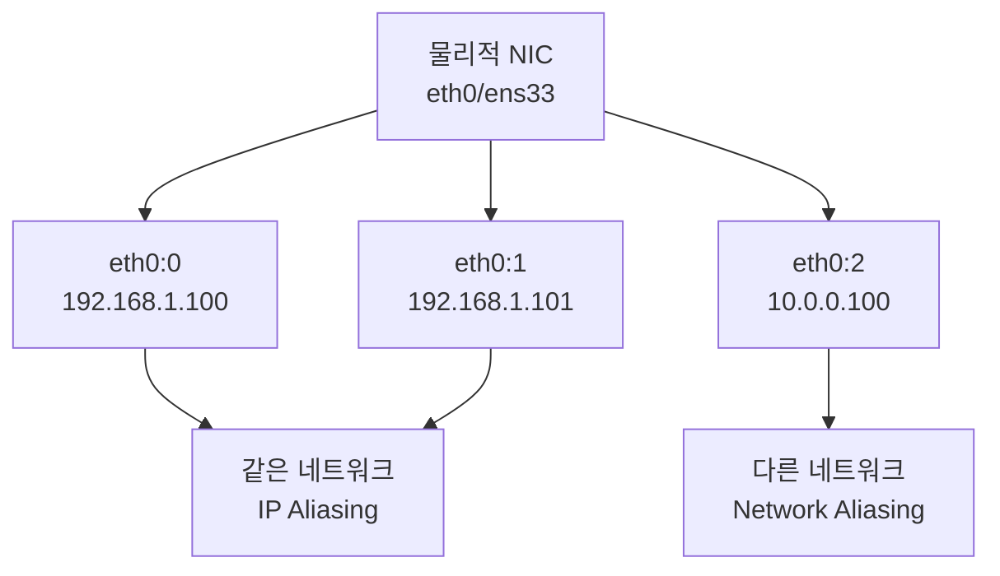
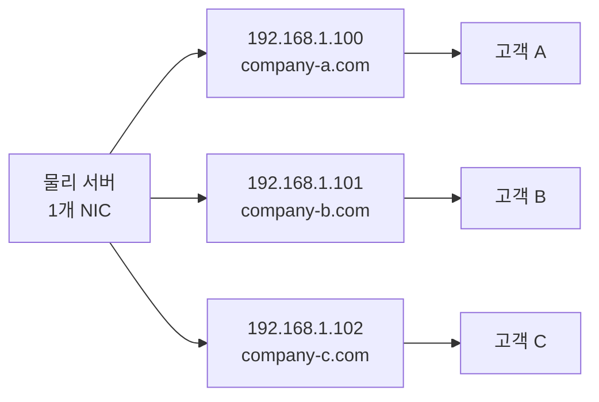
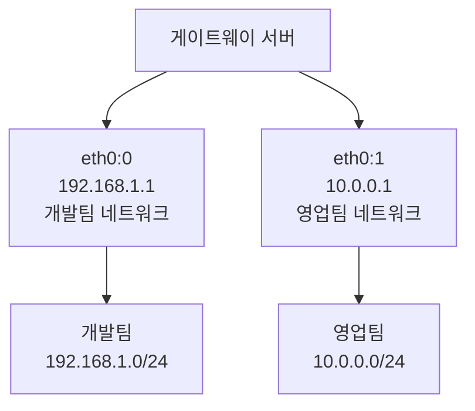
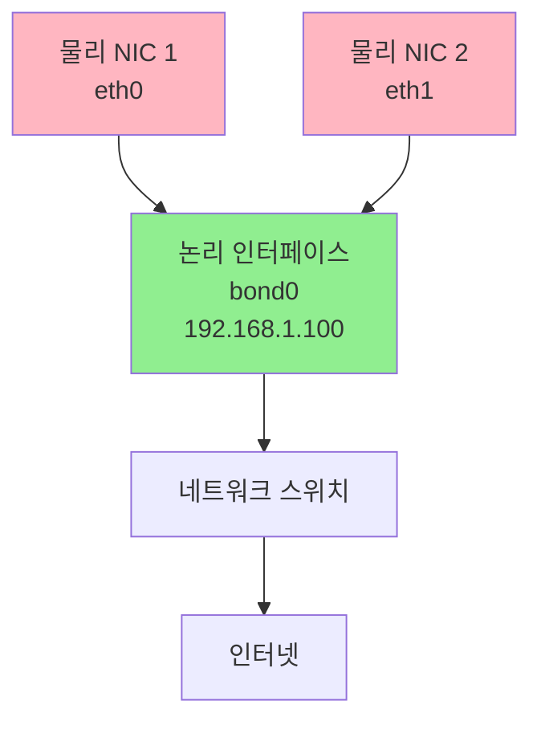
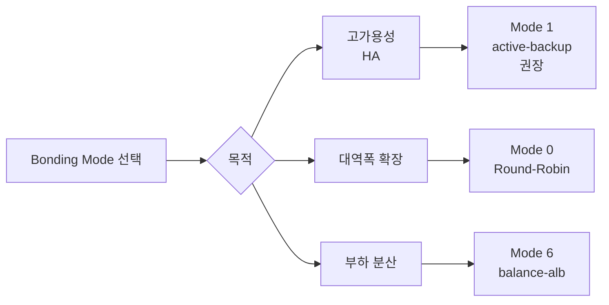
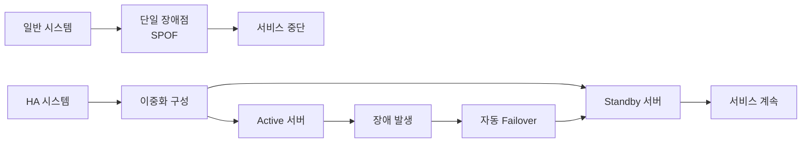
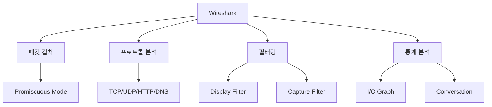
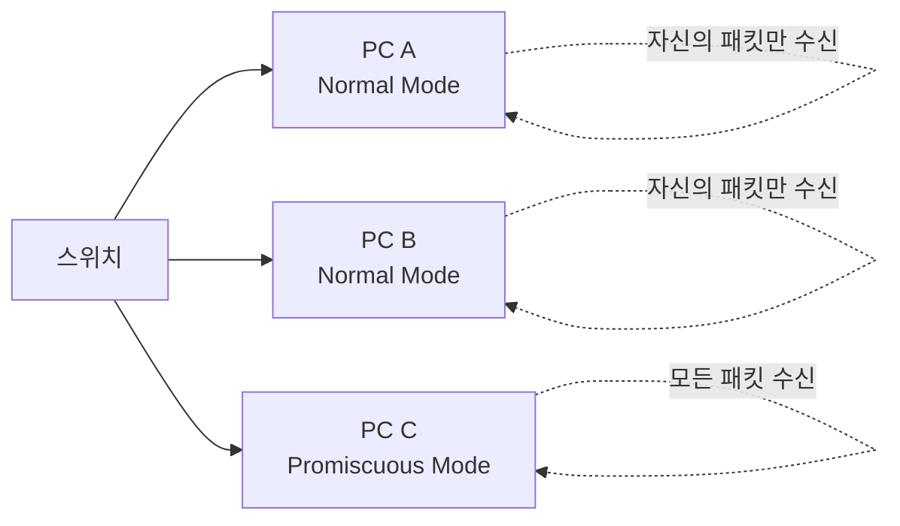

## 전체 흐름 요약

이번 Part 11에서는 고급 네트워크 설정 기법과 패킷 분석 도구를 학습합니다.

먼저 **IP Alias(IP 별칭)**를 배웁니다. 한 개의 물리적 네트워크 인터페이스에 여러 개의 IP 주소를 설정하여 설정된 IP 어디에서나 접근이 가능하도록 허용하는 기술입니다. 같은 네트워크에 속하면 IP Aliasing이고, 다른 네트워크에 속하면 Network Aliasing입니다. 웹 호스팅(Virtual Web)과 가상 LAN(Virtual LAN) 구성에 활용됩니다. 임시 설정과 영구 설정 방법을 모두 학습하며, 데비안 계열과 CentOS 계열의 설정 방법 차이를 이해합니다.

다음으로 **Channel Bonding(네트워크 본딩)**을 학습합니다. 리눅스 시스템에서 bonding 커널 모듈을 이용하여 다수의 네트워크 인터페이스를 묶어서 하나의 채널로 사용하는 기술입니다. 2개 이상의 네트워크 인터페이스를 이용하여 네트워크의 대역폭(Bandwidth)을 확장하고, 인터페이스 이중화 구성으로 장애에 대비할 수 있습니다. Mode 0부터 Mode 6까지의 다양한 본딩 모드를 학습하고, 고가용성(HA, High Availability)을 위한 Active-Backup 모드와 부하 분산을 위한 Round-Robin 모드의 차이를 이해합니다.

마지막으로 **Wireshark**를 활용한 패킷 분석을 학습합니다. Wireshark는 네트워크 트래픽을 캡처하고 분석하는 가장 널리 사용되는 오픈소스 도구입니다. Promiscuous Mode를 활성화하여 네트워크의 모든 패킷을 캡처하고, 다양한 필터를 활용하여 원하는 트래픽만 추출합니다. TCP 3-Way Handshake, HTTP 요청/응답, DNS 쿼리 등을 실시간으로 분석하며, 네트워크 문제를 진단하고 보안 위협을 탐지하는 방법을 익힙니다.

---

## 1. IP Alias (IP 별칭)

### 1.1 IP Alias 개념

**IP Alias**는 한 개의 물리적 네트워크 인터페이스에 여러 개의 IP 주소를 설정하여 설정된 IP 어디에서나 접근이 가능하도록 허용하는 것을 의미합니다.

#### IP Alias 분류

- **IP Aliasing**: 같은 네트워크에 속한 여러 IP 주소 설정
  - 예: 192.168.1.100, 192.168.1.101, 192.168.1.102
  
- **Network Aliasing**: 다른 네트워크에 속한 여러 IP 주소 설정
  - 예: 192.168.1.100, 10.0.0.100, 172.16.0.100

#### 제약사항

**IP Alias는 DHCP를 지원하지 않습니다.** 정적 IP만 설정 가능합니다.



### 1.2 IP Alias 사용 목적

#### 1) Virtual Web (웹 호스팅)

**웹 호스팅**은 ISP 업체 등이 자신의 호스트에 다른 기업의 웹 서버를 올려서 운영해주고, 월 사용료를 받는 것을 의미합니다.

**특징:**
- 한 대의 컴퓨터에 두 개 이상의 홈페이지가 운영됩니다
- 각 홈페이지는 독립적으로 구성 및 운영됩니다
- 외부에서는 두 홈페이지가 같은 호스트에 있다는 것을 알 수 없습니다

**문제점:**
- 홈페이지마다 서로 다른 IP를 할당하기 위해 NIC 카드를 홈페이지 수만큼 끼워 넣는 것은 비효율적입니다

**해결책:**
- 물리적으로 하나의 NIC에 여러 virtual IP를 설정해 사용합니다



#### 2) Virtual LAN

하나의 컴퓨터가 서로 다른 두 그룹의 컴퓨터들 사이에 연결되어 있을 경우, 두 그룹이 모두 이 컴퓨터에 접속하게 하기 위해 1개의 NIC을 물리적으로 두 개 넣은 것과 같은 효과를 내기 위해 IP Alias를 적용할 수 있습니다.



### 1.3 IP Alias 설정 및 해제 (임시)

#### 데비안/우분투 기준

##### 설정

```bash
# eth0에 추가 IP 설정
sudo ip addr add 192.168.1.200/24 dev eth0 label eth0:0
sudo ip addr add 192.168.1.201/24 dev eth0 label eth0:1

# 또는 ifconfig 사용 (구버전)
sudo ifconfig eth0:0 192.168.1.200 netmask 255.255.255.0 up
sudo ifconfig eth0:1 192.168.1.201 netmask 255.255.255.0 up

# 확인
ip addr show eth0
# 또는
ifconfig eth0
```

##### 해제

```bash
# ip 명령어로 해제
sudo ip addr del 192.168.1.200/24 dev eth0 label eth0:0
sudo ip addr del 192.168.1.201/24 dev eth0 label eth0:1

# 또는 ifconfig로 해제 (구버전)
sudo ifconfig eth0:0 down
sudo ifconfig eth0:1 down
```

##### 확인

```bash
# 모든 인터페이스 확인
ip addr show
# 또는
ifconfig -a

# 특정 인터페이스만 확인
ip addr show eth0

# Alias IP로 ping 테스트
ping -c 4 192.168.1.200
ping -c 4 192.168.1.201
```

#### CentOS/RHEL 기준

##### 설정

```bash
# ens33에 추가 IP 설정
sudo ifconfig ens33:0 192.168.1.200 up
sudo ifconfig ens33:1 192.168.1.201 up

# 확인
ifconfig | grep -A 5 ens33
```

##### 해제

```bash
# Alias 인터페이스 내리기
sudo ifconfig ens33:0 192.168.1.200 down
sudo ifconfig ens33:1 192.168.1.201 down

# 또는 ip 명령어 사용
sudo ip link set ens33:0 down
sudo ip link set ens33:1 down
```

### 1.4 IP Alias 영구 설정

재부팅 후에도 IP Alias가 유지되도록 설정 파일에 등록합니다.

#### 데비안/우분투 - /etc/network/interfaces 방식

```bash
# 네트워크 설정 파일 편집
sudo vi /etc/network/interfaces

# 다음 내용 추가:
auto eth0
iface eth0 inet static
    address 192.168.1.100
    netmask 255.255.255.0
    gateway 192.168.1.1

# eth0:0 설정
auto eth0:0
iface eth0:0 inet static
    address 192.168.1.200
    netmask 255.255.255.0

# eth0:1 설정
auto eth0:1
iface eth0:1 inet static
    address 192.168.1.201
    netmask 255.255.255.0

# 네트워크 재시작
sudo systemctl restart networking
# 또는
sudo /etc/init.d/networking restart

# 확인
ip addr show eth0
```

#### 데비안/우분투 - Netplan 방식 (Ubuntu 18.04+)

```bash
# Netplan 설정 파일 편집
sudo vi /etc/netplan/01-netcfg.yaml

# 다음 내용 작성:
network:
  version: 2
  renderer: networkd
  ethernets:
    eth0:
      dhcp4: no
      addresses:
        - 192.168.1.100/24
        - 192.168.1.200/24
        - 192.168.1.201/24
      gateway4: 192.168.1.1
      nameservers:
        addresses: [8.8.8.8, 8.8.4.4]

# 설정 적용
sudo netplan apply

# 확인
ip addr show eth0
```

#### CentOS/RHEL - 네트워크 스크립트 방식

```bash
# 네트워크 스크립트 디렉토리로 이동
cd /etc/sysconfig/network-scripts/

# 원본 설정 파일 복사
sudo cp ifcfg-ens33 ifcfg-ens33:0
sudo cp ifcfg-ens33 ifcfg-ens33:1

# ens33:0 설정 (192.168.1.200)
sudo vi ifcfg-ens33:0

# 다음 내용으로 수정:
DEVICE=ens33:0
BOOTPROTO=static
ONBOOT=yes
IPADDR=192.168.1.200
NETMASK=255.255.255.0
NAME=ens33:0

# ens33:1 설정 (192.168.1.201)
sudo vi ifcfg-ens33:1

# 다음 내용으로 수정:
DEVICE=ens33:1
BOOTPROTO=static
ONBOOT=yes
IPADDR=192.168.1.201
NETMASK=255.255.255.0
NAME=ens33:1

# 네트워크 재시작
sudo systemctl restart network

# 확인
ifconfig | grep -A 5 ens33
```

### 1.5 IP Alias 삭제

#### 데비안/우분투

```bash
# Netplan 방식 (Ubuntu 18.04+)
sudo vi /etc/netplan/01-netcfg.yaml
# addresses에서 불필요한 IP 삭제 후
sudo netplan apply

# interfaces 방식
sudo vi /etc/network/interfaces
# eth0:0, eth0:1 섹션 삭제 후
sudo systemctl restart networking
```

#### CentOS/RHEL

```bash
# 설정 파일 삭제
sudo rm -rf /etc/sysconfig/network-scripts/ifcfg-ens33:0
sudo rm -rf /etc/sysconfig/network-scripts/ifcfg-ens33:1

# 네트워크 재시작
sudo systemctl restart network

# 확인
ifconfig
```

---

## 2. Channel Bonding (네트워크 본딩)

### 2.1 Channel Bonding 개념

**Channel Bonding Interface**는 리눅스 시스템에서 bonding 커널 모듈을 이용하여 다수의 네트워크 인터페이스를 묶어서 하나의 채널로 사용하는 기술입니다.

#### Channel Bonding의 특징

- **대역폭 확장**: 2개 이상의 네트워크 인터페이스를 이용하여 네트워크 Bandwidth를 확장합니다
- **인터페이스 이중화**: 장애 대비(Failover) 구성이 가능합니다
- **고가용성(HA)**: 24시간 365일 무중단 서비스를 제공할 수 있습니다



#### 필수 조건

- **NIC은 최소 2개 이상** 있어야 bonding 구성이 가능합니다
- bonding 커널 모듈이 로드되어 있어야 합니다

### 2.2 Bonding Mode 종류

| Mode | 이름 | 설명 | 장점 | 단점 |
|------|------|------|------|------|
| **Mode 0** | balance-rr<br/>(Round-Robin) | 패킷을 순차적으로 전송 | 대역폭 증가, 부하 분산 | Failover 미지원 |
| **Mode 1** | active-backup | 하나만 Active, 나머지 Standby | 고가용성(HA), Failover | 대역폭 증가 없음 |
| **Mode 2** | balance-xor | MAC 주소 기반 전송 | 부하 분산 | 설정 복잡 |
| **Mode 3** | broadcast | 모든 인터페이스로 전송 | 내결함성 높음 | 대역폭 낭비 |
| **Mode 4** | 802.3ad (LACP) | 동적 링크 집합 | 표준 기술, 대역폭 증가 | 스위치 지원 필요 |
| **Mode 5** | balance-tlb | 송신 부하 분산 | 수신 부하 분산 | 스위치 설정 불필요 |
| **Mode 6** | balance-alb | 송수신 부하 분산 | 가장 균형잡힌 성능 | 설정 복잡 |



#### Mode 0: balance-rr (Round-Robin)

- 패킷을 각 인터페이스에 순차적으로 분산 전송합니다
- 대역폭이 증가합니다 (2개 NIC → 2배 대역폭)
- Failover는 지원하지 않습니다

#### Mode 1: active-backup (권장)

- 하나의 인터페이스만 Active 상태로 동작합니다
- Active 인터페이스 장애 시 Standby 인터페이스가 자동으로 Active가 됩니다
- **고가용성(HA)이 필요한 환경에서 가장 많이 사용됩니다**
- 대역폭 증가는 없지만, 안정성이 뛰어납니다

### 2.3 Channel Bonding 설정 (데비안/우분투)

#### 필수 패키지 설치

```bash
# ifenslave 패키지 설치 (bonding 관리 도구)
sudo apt-get update
sudo apt-get install -y ifenslave
```

#### 1단계: bonding 커널 모듈 로드

```bash
# bonding 모듈 로드
sudo modprobe bonding

# 로드된 모듈 확인
lsmod | grep bonding

# 출력 예시:
# bonding               151552  0
```

**Module이란?**
- 탈부착이 가능한 독립적으로 특정한 기능을 하는 프로그램/장치입니다
- 커널에 동적으로 추가/제거할 수 있습니다

#### 2단계: bonding 모듈 자동 로드 설정

```bash
# 부팅 시 자동 로드되도록 설정
echo "bonding" | sudo tee -a /etc/modules

# bonding 옵션 설정
sudo vi /etc/modprobe.d/bonding.conf

# 다음 내용 추가:
alias bond0 bonding
options bonding mode=1 miimon=100

# 저장 후 종료
```

**옵션 설명:**
- `mode=1`: active-backup 모드
- `miimon=100`: 100ms마다 링크 상태 확인

#### 3단계: Netplan으로 bond0 설정 (Ubuntu 18.04+)

```bash
# Netplan 설정 파일 편집
sudo vi /etc/netplan/01-netcfg.yaml

# 다음 내용 작성:
network:
  version: 2
  renderer: networkd
  ethernets:
    eth0:
      dhcp4: no
    eth1:
      dhcp4: no
  bonds:
    bond0:
      interfaces: [eth0, eth1]
      addresses: [192.168.1.100/24]
      gateway4: 192.168.1.1
      nameservers:
        addresses: [8.8.8.8, 8.8.4.4]
      parameters:
        mode: active-backup
        mii-monitor-interval: 100

# 설정 적용
sudo netplan apply

# 확인
ip addr show bond0
```

#### 4단계: /etc/network/interfaces 방식 (구버전)

```bash
# 네트워크 설정 파일 편집
sudo vi /etc/network/interfaces

# 다음 내용 추가:
# bond0 설정 (Master)
auto bond0
iface bond0 inet static
    address 192.168.1.100
    netmask 255.255.255.0
    gateway 192.168.1.1
    dns-nameservers 8.8.8.8
    bond-mode active-backup
    bond-miimon 100
    bond-slaves eth0 eth1

# eth0 설정 (Slave)
auto eth0
iface eth0 inet manual
    bond-master bond0

# eth1 설정 (Slave)
auto eth1
iface eth1 inet manual
    bond-master bond0

# 네트워크 재시작
sudo systemctl restart networking

# 확인
cat /proc/net/bonding/bond0
```

### 2.4 Channel Bonding 설정 (CentOS/RHEL)

#### 1단계: bonding 커널 모듈 로드

```bash
# bonding 모듈 로드
sudo modprobe bonding

# 로드 확인
lsmod | grep bonding

# 출력 예시:
# bonding    151552  0
```

#### 2단계: bond0 장치 생성 (MASTER)

가상의 device인 bond0을 생성하여 MASTER로 설정합니다.

```bash
# 네트워크 스크립트 디렉토리로 이동
cd /etc/sysconfig/network-scripts/

# 원본 설정 파일 복사
sudo cp ifcfg-ens33 ifcfg-bond0

# bond0 설정 파일 편집
sudo vi ifcfg-bond0

# 다음 내용으로 작성:
DEVICE=bond0
BOOTPROTO=none
ONBOOT=yes
IPADDR=192.168.10.100
NETMASK=255.255.255.0
GATEWAY=192.168.10.2
DNS1=192.168.10.2
DNS2=8.8.8.8
NAME=bond0
BONDING_MASTER=yes
BONDING_OPTS="mode=0 miimon=100"
USERCTL=no
NM_CONTROLLED=no

# 저장 후 종료
```

**설정 항목 설명:**
- `DEVICE=bond0`: 장치명
- `BOOTPROTO=none`: 정적 IP 사용
- `ONBOOT=yes`: 부팅 시 자동 활성화
- `BONDING_MASTER=yes`: 이 인터페이스가 본딩 마스터
- `BONDING_OPTS="mode=0 miimon=100"`: 본딩 옵션
- `USERCTL=no`: 일반 사용자 제어 불가
- `NM_CONTROLLED=no`: NetworkManager 제어 비활성화

#### 3단계: Slave 인터페이스 설정 (ens33, ens36)

##### ens33 설정

```bash
# ens33 설정 파일 편집
sudo vi ifcfg-ens33

# 다음 내용으로 작성:
DEVICE=ens33
BOOTPROTO=none
ONBOOT=yes
MASTER=bond0
SLAVE=yes
USERCTL=no
NM_CONTROLLED=no

# 저장 후 종료
```

##### ens36 설정

```bash
# ens36 설정 파일 생성
sudo cp ifcfg-ens33 ifcfg-ens36

# ens36 설정 파일 편집
sudo vi ifcfg-ens36

# DEVICE만 수정:
DEVICE=ens36
BOOTPROTO=none
ONBOOT=yes
MASTER=bond0
SLAVE=yes
USERCTL=no
NM_CONTROLLED=no

# 저장 후 종료
```

#### 4단계: /etc/sysconfig/network 설정

```bash
# 네트워크 전역 설정
sudo vi /etc/sysconfig/network

# 다음 내용 추가:
NETWORKING=yes
GATEDEV=bond0

# 저장 후 종료
```

#### 5단계: modprobe.conf 설정

```bash
# modprobe 설정 파일 생성
sudo vi /etc/modprobe.d/bonding.conf

# 다음 내용 작성:
alias bond0 bonding
options bond0 mode=0 miimon=100

# 저장 후 종료
```

#### 6단계: bonding 모듈 커널에 로드

```bash
# bonding 모듈 로드
sudo modprobe bonding

# 로드 확인
lsmod | grep bonding
```

**참고:** bonding 해제 시 커널에서 내리는 명령어
```bash
sudo rmmod bonding
```

#### 7단계: 네트워크 데몬 재시작

```bash
# 네트워크 서비스 재시작
sudo systemctl restart network

# 주의: PuTTY 등 SSH 접속이 끊어질 수 있습니다
# bond0 인터페이스 주소(192.168.10.100)로 재접속하세요
```

#### 8단계: bonding 활성화 확인

```bash
# bonding 상태 확인
cat /proc/net/bonding/bond0

# 출력 예시:
# Ethernet Channel Bonding Driver: v3.7.1
# 
# Bonding Mode: load balancing (round-robin)
# MII Status: up
# MII Polling Interval (ms): 100
# Up Delay (ms): 0
# Down Delay (ms): 0
# 
# Slave Interface: ens33
# MII Status: up
# Speed: 1000 Mbps
# Duplex: full
# 
# Slave Interface: ens36
# MII Status: up
# Speed: 1000 Mbps
# Duplex: full

# 네트워크 인터페이스 확인
ip addr show bond0
ifconfig bond0
```

### 2.5 Bonding 옵션 설명

#### mode 옵션

| 값 | 모드 | 설명 |
|----|------|------|
| 0 | balance-rr | Round-Robin, 패킷 순차 전송 |
| 1 | active-backup | Active-Standby, Failover 지원 |
| 2 | balance-xor | XOR 해시 기반 부하 분산 |
| 3 | broadcast | 모든 인터페이스로 동시 전송 |
| 4 | 802.3ad | LACP 동적 링크 집합 |
| 5 | balance-tlb | 송신 부하 분산 |
| 6 | balance-alb | 송수신 부하 분산 |

**Failover란?**
- Active-Standby 방식에서 Active가 죽으면 Standby였던 장비로 일을 넘기는 것
- 고가용성(HA) 구성의 핵심 기능

**Broadcast란?**
- Active-Active 방식이라고도 부름
- 모든 인터페이스가 공평하게 일을 나눔

#### miimon 옵션

- **mii**(Media Independent Interface)는 네트워크 인터페이스가 살아있는지 확인하는 데 사용됩니다
- mii link를 얼마나 자주 감시할 것인지 설정하는 옵션입니다
- **0.001초 단위**로 설정됩니다 (예: 100 = 100ms = 0.1초)
- Active-Standby 모드를 사용하는 고가용성(HA)을 요구하는 경우 매우 유용합니다

```bash
# miimon=100: 0.1초마다 링크 상태 확인
# miimon=1000: 1초마다 링크 상태 확인
```

#### downdelay 옵션 (선택사항)

- 링크가 끊어지고 해당 링크를 disable하기 전에 얼마만큼 기다릴 것인지 지정하는 옵션입니다
- 일시적인 네트워크 끊김을 무시하고 안정성을 높입니다

```bash
options bond0 mode=1 miimon=100 downdelay=200
```

### 2.6 고가용성(HA) 개념

**HA (High Availability, 고가용성)**는 24시간 365일 내내 서비스를 제공하기 위한 시스템 구성입니다.



**HA 연결 특징:**
- 물리적인 HA 전용 포트가 따로 있습니다
- Heartbeat 신호로 서버 상태를 지속적으로 확인합니다
- Active 서버 장애 시 Standby 서버가 즉시 서비스를 인계받습니다

---

## 3. Wireshark - 네트워크 패킷 분석

### 3.1 Wireshark 개념

**Wireshark**는 네트워크 트래픽을 캡처하고 분석하는 오픈소스 패킷 분석 도구입니다. 네트워크 관리자, 보안 전문가, 개발자들이 가장 널리 사용하는 도구입니다.

#### Wireshark의 주요 기능

- **실시간 패킷 캡처**: 네트워크 인터페이스를 통과하는 모든 패킷 캡처
- **프로토콜 분석**: 수백 가지 프로토콜 자동 해석
- **필터링**: 원하는 트래픽만 선택적으로 표시
- **통계 분석**: 네트워크 트래픽 통계 및 시각화
- **패킷 저장**: pcap 형식으로 패킷 저장 및 공유



### 3.2 Wireshark 설치

#### 데비안/우분투

```bash
# 패키지 업데이트
sudo apt-get update

# Wireshark 설치
sudo apt-get install -y wireshark

# 설치 중 "일반 사용자도 패킷 캡처 허용?" → Yes 선택

# 현재 사용자를 wireshark 그룹에 추가
sudo usermod -aG wireshark $USER

# 로그아웃 후 재로그인 (또는 재부팅)
# 그룹 변경사항 적용 확인
groups

# Wireshark 실행
wireshark
```

#### CentOS/RHEL

```bash
# EPEL 저장소 활성화
sudo yum install -y epel-release

# Wireshark 설치
sudo yum install -y wireshark wireshark-gnome

# Wireshark 실행 (GUI)
sudo wireshark

# 또는 CLI 버전 (tshark)
sudo tshark
```

#### 윈도우

1. Wireshark 공식 사이트 방문: https://www.wireshark.org/
2. "Download" 클릭
3. Windows Installer 다운로드
4. 설치 프로그램 실행
5. Npcap 설치 (패킷 캡처 드라이버)

### 3.3 Promiscuous Mode (무차별 모드)

**Promiscuous Mode**는 네트워크 인터페이스가 자신에게 전송된 패킷뿐만 아니라 네트워크상의 모든 패킷을 수신하는 모드입니다.

#### 일반 모드 vs Promiscuous 모드



**일반 모드 (Normal Mode):**
- 자신의 MAC 주소로 전송된 패킷만 수신합니다
- Broadcast 패킷은 수신합니다

**Promiscuous 모드:**
- 네트워크의 **모든 패킷**을 수신합니다
- 보안 감사, 네트워크 분석에 필수입니다
- 관리자 권한이 필요합니다

#### Promiscuous Mode 활성화

```bash
# 데비안/우분투
# 임시 활성화
sudo ip link set eth0 promisc on

# 비활성화
sudo ip link set eth0 promisc off

# 확인
ip link show eth0 | grep PROMISC

# CentOS/RHEL
# 임시 활성화
sudo ifconfig eth0 promisc

# 비활성화
sudo ifconfig eth0 -promisc

# 확인
ifconfig eth0 | grep PROMISC
```

### 3.4 Wireshark 기본 사용법

#### 1단계: 캡처 시작

```
1. Wireshark 실행

2. 캡처할 인터페이스 선택
   - eth0, wlan0 등

3. "Start capturing packets" 버튼 클릭 (상어 지느러미 아이콘)

4. 패킷이 실시간으로 캡처됩니다
```

#### 2단계: 패킷 분석

Wireshark 화면은 3개 영역으로 구성됩니다:

```
┌─────────────────────────────────┐
│  1. Packet List Pane            │ ← 캡처된 패킷 목록
│  (패킷 번호, 시간, 출발지, 목적지)│
├─────────────────────────────────┤
│  2. Packet Details Pane         │ ← 선택된 패킷의 프로토콜 계층
│  (Ethernet, IP, TCP, HTTP 등)   │
├─────────────────────────────────┤
│  3. Packet Bytes Pane           │ ← 패킷의 Hex 및 ASCII 표시
│  (16진수 및 ASCII)              │
└─────────────────────────────────┘
```

#### 3단계: 필터 사용

**Display Filter (표시 필터):**
- 이미 캡처된 패킷에서 원하는 것만 표시합니다

```
# HTTP 트래픽만 표시
http

# 특정 IP 주소 필터
ip.addr == 192.168.1.100

# 특정 포트 필터
tcp.port == 80

# AND 조건
ip.src == 192.168.1.100 && tcp.port == 443

# OR 조건
tcp.port == 80 || tcp.port == 443
```

**Capture Filter (캡처 필터):**
- 캡처 시작 전에 설정하여 원하는 패킷만 캡처합니다
- BPF (Berkeley Packet Filter) 문법 사용

```
# HTTP 트래픽만 캡처
port 80

# 특정 호스트와의 트래픽만 캡처
host 192.168.1.100

# 특정 네트워크 캡처
net 192.168.1.0/24

# TCP 트래픽만 캡처
tcp
```

### 3.5 유용한 Display Filter 예시

#### 프로토콜별 필터

```bash
# HTTP 트래픽
http

# HTTPS (TLS/SSL)
tls

# DNS 쿼리
dns

# ICMP (ping)
icmp

# SSH
ssh

# FTP
ftp
```

#### IP 주소 필터

```bash
# 특정 IP 주소 (출발지 또는 목적지)
ip.addr == 192.168.1.100

# 출발지 IP
ip.src == 192.168.1.100

# 목적지 IP
ip.dst == 192.168.1.100

# IP 범위
ip.addr >= 192.168.1.0 && ip.addr <= 192.168.1.255
```

#### 포트 필터

```bash
# 특정 포트
tcp.port == 80

# 출발지 포트
tcp.srcport == 443

# 목적지 포트
tcp.dstport == 22

# 포트 범위
tcp.port >= 1000 && tcp.port <= 2000
```

#### TCP 플래그 필터

```bash
# SYN 패킷 (연결 요청)
tcp.flags.syn == 1 && tcp.flags.ack == 0

# SYN+ACK 패킷 (연결 수락)
tcp.flags.syn == 1 && tcp.flags.ack == 1

# RST 패킷 (연결 강제 종료)
tcp.flags.reset == 1

# FIN 패킷 (연결 정상 종료)
tcp.flags.fin == 1
```

#### HTTP 관련 필터

```bash
# HTTP GET 요청
http.request.method == "GET"

# HTTP POST 요청
http.request.method == "POST"

# 특정 호스트 요청
http.host == "www.example.com"

# HTTP 응답 코드
http.response.code == 200
http.response.code == 404

# HTTP 쿠키
http.cookie
```

### 3.6 실전 분석 시나리오

#### 시나리오 1: TCP 3-Way Handshake 분석

```bash
# Display Filter
tcp.flags.syn == 1

# 분석 절차:
1. SYN 패킷 확인 (클라이언트 → 서버)
2. SYN+ACK 패킷 확인 (서버 → 클라이언트)
3. ACK 패킷 확인 (클라이언트 → 서버)
```

**Packet Details 예시:**
```
1. Client → Server: SYN
   TCP Flags: SYN
   Seq: 0

2. Server → Client: SYN+ACK
   TCP Flags: SYN, ACK
   Seq: 0
   Ack: 1

3. Client → Server: ACK
   TCP Flags: ACK
   Seq: 1
   Ack: 1
```

#### 시나리오 2: HTTP 요청/응답 분석

```bash
# Display Filter
http

# Follow TCP Stream으로 전체 대화 확인:
1. HTTP 패킷 우클릭
2. "Follow" → "TCP Stream" 선택
3. 전체 요청/응답 내용 확인

# HTTP 요청 예시:
GET / HTTP/1.1
Host: www.example.com
User-Agent: Mozilla/5.0
Accept: text/html

# HTTP 응답 예시:
HTTP/1.1 200 OK
Content-Type: text/html
Content-Length: 1234

<html>...</html>
```

#### 시나리오 3: DNS 쿼리 분석

```bash
# Display Filter
dns

# 분석:
1. DNS Query (클라이언트 → DNS 서버)
   - Query Name: www.example.com
   - Query Type: A (IPv4 주소)

2. DNS Response (DNS 서버 → 클라이언트)
   - Answer: 93.184.216.34
   - TTL: 3600
```

#### 시나리오 4: 비정상 트래픽 탐지

```bash
# SYN Flood 공격 탐지
tcp.flags.syn == 1 && tcp.flags.ack == 0

# 통계 메뉴:
Statistics → Conversations → TCP
- 동일 출발지에서 많은 SYN 패킷 확인

# 포트 스캔 탐지
tcp.flags.reset == 1

# 통계:
Statistics → I/O Graph
- RST 패킷이 급증하는 시점 확인
```

### 3.7 Wireshark 고급 기능

#### 1. 통계 (Statistics)

```
Statistics → Protocol Hierarchy
- 캡처된 프로토콜 계층별 통계

Statistics → Conversations
- 통신 세션별 패킷 수, 바이트 수

Statistics → Endpoints
- 종단점(IP 주소)별 통계

Statistics → I/O Graph
- 시간대별 트래픽 그래프
```

#### 2. 패킷 저장 및 공유

```bash
# 캡처한 패킷 저장
File → Save As → capture.pcap

# 필터된 패킷만 저장
File → Export Specified Packets
- Displayed: 현재 표시된 패킷만
- Selected: 선택한 패킷만

# 다른 형식으로 내보내기
File → Export Packet Dissections
- As Plain Text
- As CSV
- As JSON
```

#### 3. TShark (CLI 버전)

```bash
# 데비안/우분투
sudo apt-get install -y tshark

# CentOS/RHEL
sudo yum install -y wireshark

# 기본 캡처
sudo tshark -i eth0

# 특정 개수만 캡처
sudo tshark -i eth0 -c 100

# 파일로 저장
sudo tshark -i eth0 -w capture.pcap

# Display Filter 사용
sudo tshark -r capture.pcap -Y "http"

# 필드만 출력
sudo tshark -r capture.pcap -T fields -e ip.src -e ip.dst -e tcp.port
```

### 3.8 Wireshark 보안 및 윤리

#### 법적 고려사항

**주의:** Wireshark로 다른 사람의 네트워크 트래픽을 무단으로 캡처하는 것은 **불법**입니다.

- **자신의 네트워크**에서만 사용하세요
- 회사 네트워크에서는 **관리자 승인**을 받으세요
- 공공 Wi-Fi에서는 **절대 사용하지 마세요**
- 교육 목적으로만 사용하세요

#### 개인정보 보호

```bash
# 캡처 파일 공유 전 민감 정보 제거
# Wireshark에서:
Edit → Preferences → Protocols → HTTP
- "Reassemble HTTP bodies" 비활성화

# 또는 tshark로 민감 필드 제거
tshark -r original.pcap -w sanitized.pcap \
  -Y "!(http.cookie || http.authorization)"
```

---

## 주요 개념 요약표

| 구분 | 주요 개념 | 설명 |
|------|----------|------|
| **IP Alias** | 개념 | 하나의 NIC에 여러 IP 주소 설정 |
| | IP Aliasing | 같은 네트워크 (예: 192.168.1.x) |
| | Network Aliasing | 다른 네트워크 (예: 192.168.1.x, 10.0.0.x) |
| | 제약 | DHCP 미지원, 정적 IP만 가능 |
| | 용도 | 웹 호스팅(Virtual Web), Virtual LAN |
| | 데비안 설정 | Netplan 또는 /etc/network/interfaces |
| | CentOS 설정 | /etc/sysconfig/network-scripts/ |
| **Channel Bonding** | 개념 | 여러 NIC를 묶어 하나의 채널로 사용 |
| | 필수 조건 | NIC 2개 이상, bonding 모듈 |
| | Mode 0 | Round-Robin, 대역폭 증가 |
| | Mode 1 | Active-Backup, HA/Failover |
| | Mode 4 | 802.3ad (LACP), 표준 기술 |
| | miimon | 링크 상태 확인 주기 (ms 단위) |
| | HA | High Availability, 24/365 무중단 |
| | Failover | Active 장애 시 Standby로 전환 |
| **Wireshark** | 개념 | 네트워크 패킷 캡처 및 분석 도구 |
| | Promiscuous Mode | 네트워크 모든 패킷 수신 |
| | Display Filter | 캡처 후 패킷 필터링 |
| | Capture Filter | 캡처 전 패킷 필터링 (BPF) |
| | Follow Stream | TCP 대화 전체 내용 확인 |
| | Statistics | 프로토콜, 대화, 트래픽 통계 |
| | TShark | CLI 버전 Wireshark |
| | 법적 주의 | 자신의 네트워크에서만 사용 |

---

## 데비안(Debian/Ubuntu) vs CentOS 차이점

### IP Alias

| 항목 | Debian/Ubuntu | CentOS/RHEL |
|------|---------------|-------------|
| 임시 설정 | `ip addr add ... label eth0:0` | `ifconfig ens33:0 ... up` |
| 영구 설정 (구버전) | `/etc/network/interfaces` | `/etc/sysconfig/network-scripts/ifcfg-*` |
| 영구 설정 (신버전) | Netplan (`/etc/netplan/*.yaml`) | NetworkManager (nmcli) |
| 적용 명령어 | `netplan apply` 또는 `systemctl restart networking` | `systemctl restart network` |
| 인터페이스명 | eth0, eth1 | ens33, ens36 |

### Channel Bonding

| 항목 | Debian/Ubuntu | CentOS/RHEL |
|------|---------------|-------------|
| 패키지 설치 | `apt-get install ifenslave` | bonding 모듈 내장 |
| 모듈 로드 | `modprobe bonding` | `modprobe bonding` |
| 영구 설정 (구버전) | `/etc/network/interfaces` | `/etc/sysconfig/network-scripts/` |
| 영구 설정 (신버전) | Netplan | NetworkManager |
| 모듈 옵션 | `/etc/modprobe.d/bonding.conf` | `/etc/modprobe.d/bonding.conf` |
| 적용 명령어 | `systemctl restart networking` | `systemctl restart network` |

### Wireshark

| 항목 | Debian/Ubuntu | CentOS/RHEL |
|------|---------------|-------------|
| 설치 명령어 | `apt-get install wireshark` | `yum install wireshark wireshark-gnome` |
| 사용자 권한 | wireshark 그룹 추가 | sudo로 실행 |
| CLI 버전 | tshark (패키지에 포함) | tshark (별도 설치 가능) |
| Promiscuous 설정 | `ip link set eth0 promisc on` | `ifconfig eth0 promisc` |

---

## 마무리

이번 Part 11에서는 고급 네트워크 설정 기법인 IP Alias와 Channel Bonding, 그리고 네트워크 패킷 분석 도구인 Wireshark를 학습했습니다.

**IP Alias**를 통해 하나의 네트워크 인터페이스에 여러 IP 주소를 할당하여 웹 호스팅이나 가상 LAN 구성에 활용할 수 있습니다. **Channel Bonding**으로는 여러 네트워크 인터페이스를 묶어 대역폭을 확장하거나 고가용성 시스템을 구축할 수 있습니다. **Wireshark**를 통해 네트워크 트래픽을 상세히 분석하여 문제를 진단하고 보안 위협을 탐지하는 능력을 기를 수 있습니다.

이러한 기술들은 실무에서 네트워크 관리자와 보안 전문가에게 필수적인 역량입니다. 특히 Channel Bonding의 고가용성 구성은 무중단 서비스를 제공하는 기업 환경에서 매우 중요하며, Wireshark는 네트워크 문제 해결과 보안 감사의 핵심 도구입니다.
