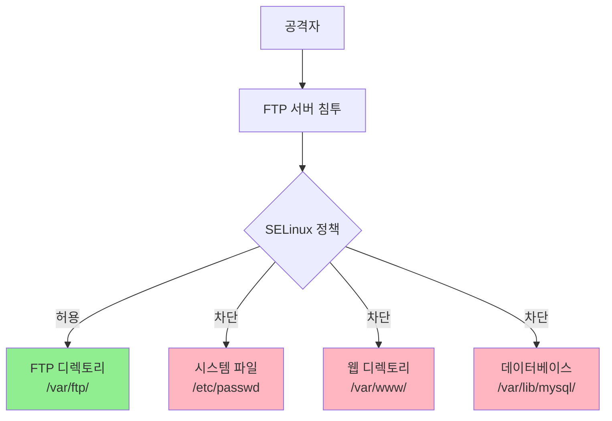
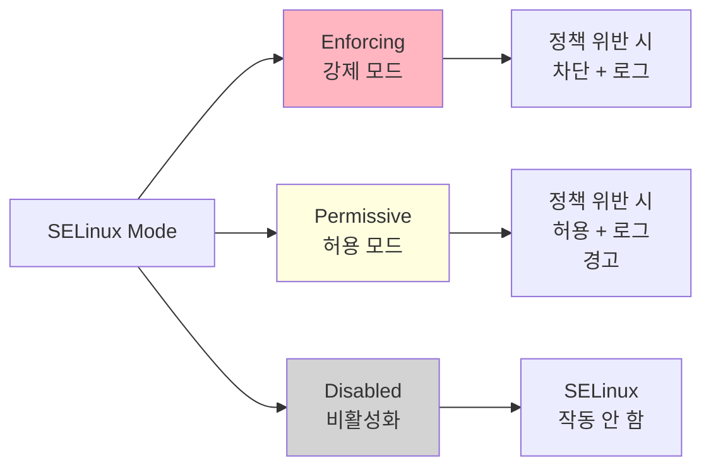
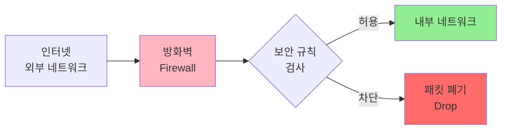
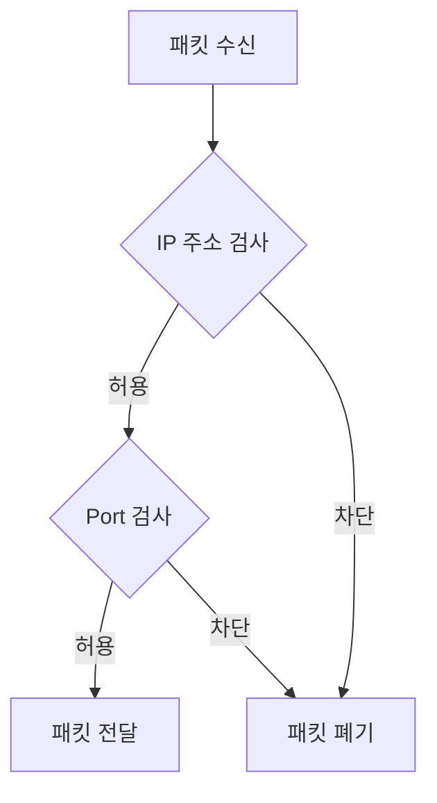
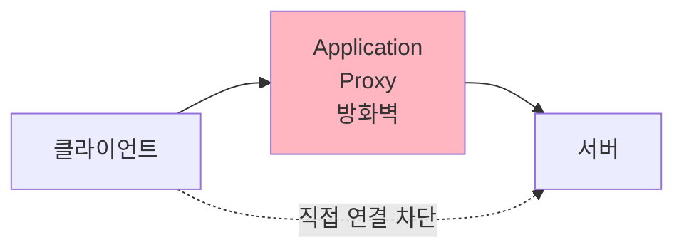
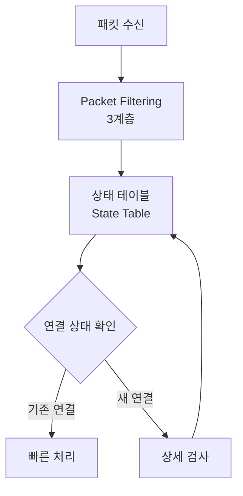
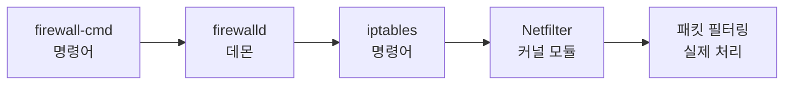
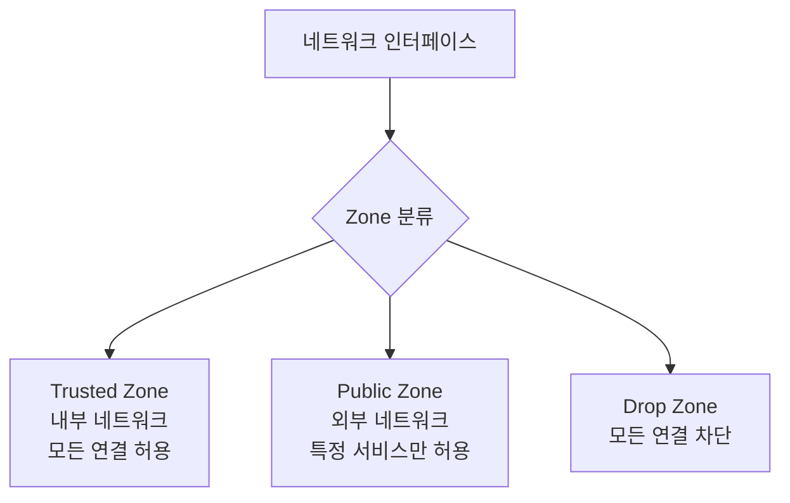

## 전체 흐름 요약

이번 Part 12에서는 리눅스 보안의 핵심인 SELinux와 방화벽(Firewall)을 학습합니다.

먼저 **SELinux(Security-Enhanced Linux)**를 배웁니다. 보안에 취약한 리눅스를 보호하기 위해 탄생한 강력한 보안 모듈입니다. SELinux 환경에서는 침해사고 발생 시 침입한 경로의 애플리케이션 사용 권한 이상의 권한을 얻지 못합니다. FTP 서버 경로로 침입하면 다른 시스템 자원을 건드리지 못하게 격리합니다. Enforcing(강제), Permissive(허용), Disabled(비활성화) 3가지 레벨을 이해하고, `getenforce`, `setenforce`, `sestatus` 명령어로 SELinux를 관리합니다. 정책 설정은 `getsebool`, `setsebool` 명령어를 사용합니다.

다음으로 **방화벽(Firewall)**의 개념과 종류를 학습합니다. 방화벽은 네트워크 트래픽을 모니터링하고 정해진 보안 규칙(IP, Port 기반)으로 특정 트래픽의 허용 또는 차단을 결정하는 네트워크 보안 시스템입니다. 접근통제, 패킷 필터링, 사용자 인증, 감사 및 로그 기능, 프록시 기능, NAT 기능 등 5가지 주요 기능을 제공합니다. Packet Filtering 방화벽, Application Gateway 방화벽, Circuit Gateway 방화벽, Stateful Inspection 방화벽 등 4가지 종류를 비교하고 각각의 장단점을 이해합니다.

**Firewalld(CentOS/RHEL 기본 방화벽)**를 상세히 학습합니다. iptables를 대체하기 위해 나온 패킷 필터링 방화벽으로, 커널의 Netfilter 모듈에 기반합니다. firewalld 데몬, firewall-config(GUI), firewall-cmd(CLI) 3가지 구성 요소를 사용합니다. Zone 개념을 이해하여 네트워크 연결의 신뢰 정도에 따라 다른 보안 정책을 적용합니다. Drop, Block, Public, External, Internal, DMZ, Home, Work, Trusted 등 9가지 Zone의 특징을 학습하고, 서비스 및 포트 등록, 영구 설정 방법을 익힙니다.

**UFW(Debian/Ubuntu 기본 방화벽)**와 **iptables**도 함께 다룹니다. UFW(Uncomplicated Firewall)는 데비안 계열의 사용자 친화적인 방화벽 관리 도구입니다. iptables는 리눅스의 전통적인 방화벽으로 강력하지만 복잡한 명령어 체계를 가지고 있습니다. 두 도구의 기본 사용법과 실전 예시를 학습합니다.

---

## 1. SELinux (Security-Enhanced Linux)

### 1.1 SELinux 개념

**SELinux**는 보안에 취약한 리눅스를 보호하기 위해 미국 NSA(국가안보국)가 개발한 강제 접근 통제(MAC, Mandatory Access Control) 보안 모듈입니다.

#### SELinux의 핵심 보안 원리

**침해사고 발생 시 피해 최소화:**
- SELinux 환경에서는 침입한 경로의 애플리케이션 사용 권한 이상의 권한을 얻지 못합니다
- **FTP 서버 경로로 침입하면 다른 시스템 자원을 건드리지 못하게 격리**합니다
- 각 프로세스와 파일에 보안 컨텍스트(Security Context)를 부여하여 세밀한 접근 제어를 수행합니다



### 1.2 SELinux 3가지 레벨 (Mode)

| 레벨 | 영문명 | 설명 |
|------|--------|------|
| **Enforcing** | 강제 | 시스템 보안에 영향을 미치는 기능이 감지되면 **아예 그 기능이 작동되지 않도록 차단** |
| **Permissive** | 허용 | 시스템 보안에 영향을 미치는 기능이 감지되면 **허용은 하되 로그에 기록** (테스트용) |
| **Disabled** | 비활성화 | SELinux 사용 안 함 |



**레벨별 사용 시나리오:**
- **Enforcing**: 운영 환경(Production)에서 사용, 강력한 보안 제공
- **Permissive**: 개발/테스트 환경에서 사용, 정책 개발 및 디버깅
- **Disabled**: 학습 또는 특정 소프트웨어 호환성 문제 해결용

### 1.3 SELinux 설정 파일

#### 설정 파일 위치

```bash
# 데비안/우분투 및 CentOS/RHEL 공통

# SELinux 원본 설정 파일
vi /etc/selinux/config

# SELinux 심볼릭 링크 파일 (같은 파일)
vi /etc/sysconfig/selinux
```

#### 설정 파일 내용

```bash
# /etc/selinux/config 파일 내용

# This file controls the state of SELinux on the system.
# SELINUX= can take one of these three values:
#     enforcing - SELinux security policy is enforced.
#     permissive - SELinux prints warnings instead of enforcing.
#     disabled - No SELinux policy is loaded.
SELINUX=enforcing

# SELINUXTYPE= can take one of these values:
#     targeted - Targeted processes are protected,
#     minimum - Modification of targeted policy. Only selected processes are protected.
#     mls - Multi Level Security protection.
SELINUXTYPE=targeted
```

**주요 설정 항목:**
- `SELINUX`: SELinux 동작 모드 (enforcing/permissive/disabled)
- `SELINUXTYPE`: SELinux 정책 유형
  - `targeted`: 특정 프로세스만 보호 (기본값, 가장 일반적)
  - `minimum`: targeted의 최소 버전
  - `mls`: 다단계 보안 레벨

### 1.4 SELinux 기본 명령어

#### SELinux 상태 확인

```bash
# 현재 SELinux 동작 모드 확인
getenforce

# 출력 예시:
# Enforcing
# 또는
# Permissive
# 또는
# Disabled

# SELinux 상세 상태 확인
sestatus

# 출력 예시:
# SELinux status:                 enabled
# SELinuxfs mount:                /sys/fs/selinux
# SELinux root directory:         /etc/selinux
# Loaded policy name:             targeted
# Current mode:                   enforcing
# Mode from config file:          enforcing
# Policy MLS status:              enabled
# Policy deny_unknown status:     allowed
# Max kernel policy version:      31
```

#### SELinux 동작 모드 변경 (임시)

```bash
# Enforcing 모드로 변경 (강제)
setenforce 1
# 또는
setenforce enforcing

# Permissive 모드로 변경 (허용)
setenforce 0
# 또는
setenforce permissive

# 확인
getenforce

# 주의: 재부팅 시 /etc/selinux/config 설정으로 되돌아감
```

**옵션 설명:**
- `setenforce 1`: Enforcing 모드 (숫자 1)
- `setenforce 0`: Permissive 모드 (숫자 0)
- Disabled 모드는 setenforce로 변경 불가 (설정 파일 수정 + 재부팅 필요)

#### SELinux 영구 비활성화

```bash
# 1. 설정 파일 편집
sudo vi /etc/selinux/config

# SELINUX=enforcing을 SELINUX=disabled로 변경
SELINUX=disabled

# 저장 후 종료

# 2. 재부팅
sudo reboot

# 3. 재부팅 후 확인
getenforce
# 출력: Disabled
```

**주의사항:**
- SELinux를 Disabled에서 Enforcing으로 다시 활성화하면 시스템 전체 레이블 재설정이 필요합니다
- 재부팅 시 시간이 오래 걸릴 수 있습니다

### 1.5 SELinux 정책 관리

#### SELinux Boolean 값 확인

Boolean 값은 SELinux 정책의 on/off 스위치 역할을 합니다.

```bash
# 모든 Boolean 값 확인
getsebool -a

# 출력 예시:
# httpd_can_network_connect --> off
# httpd_enable_homedirs --> off
# ftp_home_dir --> off
# httpd_can_sendmail --> off
# ...

# 특정 서비스 Boolean 값만 확인
getsebool -a | grep httpd

# 또는 특정 Boolean 값 확인
getsebool httpd_can_network_connect
# 출력: httpd_can_network_connect --> off
```

#### SELinux Boolean 값 설정

```bash
# 기본 문법
setsebool [옵션] 서비스(항목) on|off

# 임시 설정 (재부팅 시 초기화)
setsebool httpd_can_network_connect on

# 영구 설정 (-P 옵션)
setsebool -P httpd_can_network_connect on

# 확인
getsebool httpd_can_network_connect
# 출력: httpd_can_network_connect --> on
```

**옵션 설명:**
- `-P` (--persistent): 영구 적용 (설정 파일에 저장)
- `-a`: 모든 Boolean 값 표시

#### 실전 예시

```bash
# Apache가 네트워크 연결을 하도록 허용
sudo setsebool -P httpd_can_network_connect on

# Apache가 사용자 홈 디렉토리 접근 허용
sudo setsebool -P httpd_enable_homedirs on

# FTP가 홈 디렉토리 접근 허용
sudo setsebool -P ftp_home_dir on

# Samba가 홈 디렉토리 접근 허용
sudo setsebool -P samba_enable_home_dirs on
```

### 1.6 SELinux 컨텍스트 (보안 레이블)

#### 파일 및 프로세스의 SELinux 컨텍스트 확인

```bash
# 파일의 SELinux 컨텍스트 확인
ls -Z /var/www/html/index.html

# 출력 예시:
# -rw-r--r--. root root unconfined_u:object_r:httpd_sys_content_t:s0 /var/www/html/index.html

# 디렉토리의 SELinux 컨텍스트 확인
ls -Zd /var/www/html/

# 프로세스의 SELinux 컨텍스트 확인
ps auxZ | grep httpd

# 출력 예시:
# system_u:system_r:httpd_t:s0    root   1234  ...  /usr/sbin/httpd
```

**컨텍스트 형식: `user:role:type:level`**
- `user`: SELinux 사용자
- `role`: SELinux 역할
- `type`: SELinux 타입 (가장 중요, 접근 제어의 핵심)
- `level`: MLS 레벨

#### 파일의 SELinux 컨텍스트 변경

```bash
# 파일의 type을 httpd_sys_content_t로 변경
chcon -t httpd_sys_content_t /var/www/html/newfile.html

# 디렉토리 및 하위 파일 모두 변경 (-R)
chcon -R -t httpd_sys_content_t /var/www/html/

# 원래대로 복원 (기본 정책에 따라)
restorecon /var/www/html/newfile.html
restorecon -R /var/www/html/
```

### 1.7 SELinux 트러블슈팅

#### SELinux 로그 확인

```bash
# SELinux 감사 로그 확인
sudo tail -f /var/log/audit/audit.log | grep denied

# 또는 sealert 도구 사용 (setroubleshoot 패키지 필요)
sudo sealert -a /var/log/audit/audit.log

# setroubleshoot 설치 (CentOS/RHEL)
sudo yum install -y setroubleshoot setroubleshoot-server

# 데몬 재시작
sudo systemctl restart auditd
```

#### 일반적인 SELinux 문제 해결

**문제 1: Apache가 특정 디렉토리 접근 불가**

```bash
# 증상: Permission denied 에러
# 해결:
sudo chcon -R -t httpd_sys_content_t /custom/web/directory/
# 또는
sudo semanage fcontext -a -t httpd_sys_content_t "/custom/web/directory(/.*)?"
sudo restorecon -R /custom/web/directory/
```

**문제 2: 서비스가 비표준 포트 사용 불가**

```bash
# 증상: Apache가 8080 포트 사용 시 차단
# 해결:
sudo semanage port -a -t http_port_t -p tcp 8080

# 확인
sudo semanage port -l | grep http_port_t
```

---

## 2. 방화벽(Firewall) 개념

### 2.1 방화벽 정의

**방화벽(Firewall)**은 네트워크 트래픽을 모니터링하고 정해진 보안 규칙(IP, Port 기반)으로 특정 트래픽의 허용 또는 차단을 결정하는 네트워크 보안 소프트웨어 및 하드웨어입니다.



### 2.2 방화벽 주요 기능 5가지

#### 1) 접근 통제 (Access Control)

외부에서 내부 네트워크에 접속하는 패킷을 필터링하여 통제하는 기능입니다.

```bash
# 예시: 특정 IP만 SSH 접속 허용
# 192.168.1.100만 SSH 접속 가능
```

#### 2) 패킷 필터링 (Packet Filtering)

IP 주소, 포트 번호, 프로토콜을 기반으로 패킷을 검사하여 허용/차단합니다.

#### 3) 사용자 인증 (User Authentication)

침입차단 시스템을 지나는 트래픽에 대한 사용자 신분을 증명하는 기능입니다.

#### 4) 감사 및 로그 기능 (Audit and Logging)

모든 트래픽에 대한 접속 정보 및 네트워크 사용에 따른 통계 정보를 기록합니다.

#### 5) 프록시 기능 (Proxy)

클라이언트의 서비스 요청을 받고, 실제 서비스를 수행하는 서버의 보안 정책에 따라 클라이언트의 요청을 전달하고, 서버로부터 실행 결과를 수신하여 사용자에게 다시 전달해주는 기능입니다.

#### 6) NAT 기능 (Network Address Translation)

내부 IP를 숨기고 외부와 통신할 때 공인 IP로 변환하는 기능입니다.

### 2.3 방화벽 한계점

방화벽이 완벽한 보안 솔루션은 아닙니다. 다음과 같은 한계점이 있습니다:

- **침입 알림 기능 없음**: IDS(침입 탐지 시스템)가 별도로 필요
- **우회 경로 백도어 방어 못함**: VPN이나 별도 경로는 방어 불가
- **전자우편을 통해 유입되는 바이러스 검색 불가능**: 안티바이러스가 필요
- **내부 사용자에 의한 보안 침해 방어 불가능**: 내부 보안 정책 필요

### 2.4 방화벽 종류

#### 1) Packet Filtering 방화벽

**특징:**
- 일반적으로 방화벽 하면 이것을 말합니다
- Router의 Filtering 기능을 이용한 방화벽을 지칭합니다
- **OSI 3계층(네트워크)**에서 동작합니다
- 스크리닝 Router에서 도입된 초기 개념의 방화벽 형태입니다
- In/Outbound 패킷에 대한 **IP와 Port 번호만 검색** 후 통과합니다



**장점:**
- 패킷의 IP와 Port 번호만 검색하므로 **처리 속도가 빠릅니다**

**단점:**
- 세션 관리나 애플리케이션 내용을 참조하지 않기 때문에 보안성이 떨어집니다
- Stateful Inspection 방식이나 Application Gateway 방식에 비해 부가 기능의 지원이나 보안성이 많이 떨어집니다
- 가변 Port를 사용하는 서비스나 Multimedia 서비스 등에 대해서는 완벽한 접근 통제가 불가능합니다
- **InComing/Outgoing에 각각 별도의 접근 규칙(Access Rule) 설정 필요**
- 사용자 인터페이스(GUI)나 로깅 기능이 미약해 관리가 매우 불편합니다

#### 2) Application Gateway 방화벽 (= Application Proxy 방화벽)

**특징:**
- Filtering 기능이 **OSI 7계층(Application)**에서 작동하는 방화벽입니다
- 서비스별로 Proxy라는 통신 중계용 응용 프로그램이 있어 각 서비스 요청에 대해 방화벽이 접근 규칙을 적용하고 연결을 대신 수행합니다
- 직접 연결(IP Connection)은 허용되지 않습니다



**장점:**
- 내부/외부 시스템 간에 방화벽의 Proxy를 통한 연결만 가능하므로 외부에 대한 내부망의 완벽한 경계선 방어 및 **내부 IP 주소를 숨길 수 있습니다**
- 따라서 Packet Filtering 방화벽보다 **보안성이 뛰어납니다**
- 다른 방화벽에 비해 **강력한 로깅(Logging) 및 감사(Audit) 기능**을 제공합니다
- 사용자 인증이나 바이러스 검색 기능 같은 부가적 서비스를 지원합니다

**단점:**
- Traffic이 OSI 7계층에서 처리되기 때문에 다른 방식과 비교해서 **방화벽 성능이 떨어집니다**
- 일부 서비스에 대해서는 사용자에게 투명한 서비스 제공이 어렵습니다
- 방화벽에서 새로운 서비스를 제공하기 위해서는 Proxy 데몬이 추가적으로 필요하기 때문에 **새로운 서비스에 대한 유연성이 떨어집니다**

#### 3) Circuit Gateway 방화벽

**특징:**
- Filtering 기능이 **OSI 5계층(Session) ~ 7계층(Application) 사이**에서 접근 제어를 실시하는 방화벽입니다
- 어떤 서비스 프로토콜도 이용할 수 있는 일반적인 대표 Proxy를 이용합니다
- 비교: Application Gateway는 서비스별로 각각의 Proxy가 존재합니다
- 내부 시스템에 접속하기 위해서는 Client 쪽 PC에 대표 Proxy와 통신하기 위한 **수정된 Client 프로그램 설치가 필요**합니다

**장점:**
- 내부 IP를 숨길 수 있습니다
- 수정된 Client 프로그램이 설치된 사용자에게 별도의 인증 절차 없이 투명한 서비스 제공 가능합니다

**단점:**
- 방화벽 접속을 위해 **수정된 Client 프로그램 설치 필요**
- 사용 중인 응용 프로그램 수정 등의 번거로움이 존재합니다

#### 4) Stateful Inspection (상태 추적) 방화벽 ★

**현재 거의 모든 방화벽에서 사용하는 방식입니다.**

**특징:**
- **Packet Filtering + Application Gateway 방화벽의 장점만을 모아서 구성**했습니다
- 3계층(네트워크)에서 패킷을 처리하면서 **프로토콜 상태 정보 테이블을 유지**하며, 프로토콜 특성에 따른 변화를 동적으로 대응해주는 기능입니다



**장점:**
- 서비스에 대한 접근 규칙(Access Rule)을 생성할 때 **되돌아 나가는 Flow에 대한 또 다른 접근 규칙을 설정할 필요가 없습니다**
- 참고: Packet Filtering 방화벽은 InComing/Outgoing에 별도의 접근 규칙이 필요합니다
- Stateful Inspection 방화벽은 서비스에 대한 특성 및 통신 상태를 관리할 수 있기 때문에 **돌아나가는 패킷에 대해서는 동적으로 접근 규칙을 자동 생성**합니다

**단점:**
- 데이터 내부에 악의적인 정보를 포함할 수 있는 프로토콜에 대한 대응이 어렵습니다

---

## 3. Firewalld (CentOS/RHEL 기본 방화벽)

### 3.1 Firewalld 개요

**Firewalld**는 iptables를 대체하기 위해 나온 패킷 필터링 방화벽입니다.

#### Firewalld의 특징

- **Netfilter 모듈에 기반**한 패킷 필터링 방화벽입니다
- 동적 방화벽 관리 지원 (재시작 없이 규칙 변경 가능)
- Zone 개념 도입으로 유연한 보안 정책 적용
- D-Bus 인터페이스 제공

### 3.2 Firewalld 구성 요소

| 구성 요소 | 설명 |
|-----------|------|
| **firewalld 데몬** | 백그라운드에서 실행되는 방화벽 서비스 |
| **firewall-config** | GUI 환경 방화벽 설정 도구 |
| **firewall-cmd** | CLI 명령어 방화벽 설정 도구 |

### 3.3 Firewalld 작동 원리

**firewalld와 iptables 모두 커널의 Netfilter 모듈에 기반한 패킷 필터링 방화벽입니다.**



#### 작동 순서

**1) firewalld 데몬 구동:**
```bash
systemctl start firewalld
```

firewalld 데몬은 `firewall-cmd` 명령어로 설정 내용을 전달받아 `iptables` 명령어로 전달합니다.

**2) iptables 명령:**

iptables 명령은 firewalld 데몬이 보낸 설정 내용을 적용해서 Netfilter에 전달합니다.

```bash
# Firewalld가 보낸 명령어 확인
iptables -S

# iptables 명령어는 리눅스 커널에서 Netfilter 모듈이 활성화되어 있어야 동작합니다
```

### 3.4 iptables 비활성화 & firewalld 활성화

firewalld와 iptables 서비스가 충돌하지 않도록 설정합니다.

#### 1단계: iptables 비활성화 (mask 설정)

```bash
# iptables 상태 확인
systemctl status iptables.service

# iptables 서비스를 mask (재시작되지 않도록 완전 차단)
sudo systemctl mask iptables.service

# mask 해제 방법 (필요 시)
sudo systemctl unmask iptables.service
```

#### 2단계: firewalld 활성화

```bash
# firewalld 서비스 시작
sudo systemctl start firewalld.service

# 부팅 시 자동 시작 설정
sudo systemctl enable firewalld.service

# 상태 확인
sudo systemctl status firewalld.service
```

#### 3단계: firewalld 동작 확인

```bash
# firewalld 데몬 재기동
sudo systemctl restart firewalld.service

# 부팅 시 자동 시작 설정 (재확인)
sudo systemctl enable firewalld.service

# firewalld가 active 상태인지 확인
sudo systemctl is-active firewalld.service
# 출력: active
```

#### 4단계: firewalld 상태 및 버전 정보 확인

```bash
# firewalld 상태 확인
sudo firewall-cmd --state
# 출력: running

# firewalld 버전 확인
sudo firewall-cmd --version
# 출력: 0.9.3 (예시)
```

#### 5단계: firewalld 기본 설정 파일

```bash
# firewalld 설정 파일 확인
ls -l /etc/firewalld/firewalld.conf

# 설정 파일 내용 확인
cat /etc/firewalld/firewalld.conf
```

#### 6단계: 현재 Zone에서 등록된 서비스 목록

```bash
# 현재 Zone의 활성화된 서비스 목록
sudo firewall-cmd --list-services

# 출력 예시:
# dhcpv6-client ssh

# Zone 설정 파일 확인
cat /etc/firewalld/zones/public.xml
```

#### 7단계: 현재 사용 중인 기본 Zone

```bash
# 기본 Zone 확인
sudo firewall-cmd --get-default-zone
# 출력: public

# Zone 설정은 /etc/firewalld/firewalld.conf에 지정되어 있습니다
grep DefaultZone /etc/firewalld/firewalld.conf
```

### 3.5 Firewalld Zone 개념

**Zone은 네트워크 연결에 대한 사용자의 신뢰 정도를 정의하기 위해 사용되는 개념입니다.**

#### Zone의 핵심 원리

- 네트워크 연결이나 인터페이스 신뢰 정도에 따라 각각 다른 Ruleset을 생성해 적용합니다
- firewalld는 IP 주소가 지정된 네트워크 인터페이스를 기초로 해서 Zone을 사용합니다
- **신뢰할 수 있는 (내부) 네트워크 사용자**에게는 모든 서비스에 대해 접근을 허용하지만, **신뢰할 수 없는 (외부) 네트워크 사용자**에게는 공개 서비스만 제공하는 경우, firewalld는 Zone을 이용해 이러한 환경을 제공할 수 있습니다



### 3.6 Firewalld Zone 종류

| Zone | 한글명 | 신뢰 수준 | 설명 |
|------|--------|----------|------|
| **Drop** | 폐기 | ★☆☆☆☆ | 모든 패킷 폐기, 응답 없음, 외부 나가는 연결만 허용 |
| **Block** | 차단 | ★★☆☆☆ | 모든 패킷 폐기, icmp-host-prohibited 응답, 내부 시작 연결 허용 |
| **Public** | 공용 | ★★★☆☆ | 공개 서비스만 허용, 기본 Zone |
| **External** | 외부 | ★★★☆☆ | 외부 라우터용, 마스커레이딩(NAT) 적용, 선택된 연결만 허용 |
| **DMZ** | DMZ | ★★★☆☆ | 내부 네트워크 제한적 접근, 공개 서비스 허용 |
| **Work** | 작업 | ★★★★☆ | 회사 네트워크용, 같은 네트워크 시스템 신뢰, 선택 연결 허용 |
| **Home** | 홈 | ★★★★☆ | 홈 네트워크용, 다른 시스템 신뢰, 선택 연결 허용 |
| **Internal** | 내부 | ★★★★★ | 내부 네트워크용, 선택 연결 허용 |
| **Trusted** | 신뢰 | ★★★★★ | 모든 네트워크 패킷 허용 |

#### Zone별 상세 설명

**Drop 영역:**
- 내부로 들어오는 **모든 패킷을 폐기**합니다 (Block Zone과 동일)
- 응답 메시지도 보내지 않습니다
- 단지 **외부로 나가는 연결만 허용**됩니다
- 가장 엄격한 보안 수준

**Block 영역:**
- 내부로 들어오는 모든 패킷을 폐기합니다
- `icmp-host-prohibited`와 `icmp6-prohibited` 응답 메시지를 보냅니다
- 시스템 내부에서 시작된 연결은 허용됩니다

**Public 영역 (기본값):**
- 서비스를 제공하는 특별한 프로토콜의 연결만 허용합니다
- 그 외 포트의 연결은 모두 거부합니다
- **default zone**으로 가장 많이 사용됩니다

**DMZ 영역:**
- 내부 네트워크로의 접근은 제한적으로 허용합니다
- 공개된 네트워크에 대한 접근을 허용하는 경우 사용합니다
- 선택된 연결만 허용됩니다

**External 영역:**
- 마스커레이딩(NAT 변환) 규칙이 적용되는 외부의 라우터를 위해 사용됩니다
- 내부로의 연결 요청 중에서 선택된 연결만을 허용합니다

**Home/Work 영역:**
- 홈 또는 회사 네트워크를 위해 사용됩니다
- 같은 네트워크에 위치한 다른 시스템을 신뢰합니다
- 오직 선택된 연결만을 접속 허용합니다

**Internal 영역:**
- 내부 네트워크를 위해 사용됩니다
- 오직 선택된 연결만을 접속 허용합니다

**Trusted 영역:**
- **모든 네트워크 패킷을 허용**합니다
- 완전히 신뢰할 수 있는 네트워크에서만 사용해야 합니다

### 3.7 Firewalld 기본 명령어

#### Zone 관리

```bash
# 모든 Zone 목록 확인
sudo firewall-cmd --get-zones

# 출력:
# block dmz drop external home internal public trusted work

# 기본 Zone 확인
sudo firewall-cmd --get-default-zone
# 출력: public

# 기본 Zone 변경
sudo firewall-cmd --set-default-zone=home

# 활성화된 Zone 확인
sudo firewall-cmd --get-active-zones

# 출력 예시:
# public
#   interfaces: eth0

# 특정 Zone의 상세 정보 확인
sudo firewall-cmd --zone=public --list-all

# 출력 예시:
# public (active)
#   target: default
#   icmp-block-inversion: no
#   interfaces: eth0
#   sources:
#   services: ssh dhcpv6-client
#   ports:
#   protocols:
#   masquerade: no
#   forward-ports:
#   source-ports:
#   icmp-blocks:
#   rich rules:
```

#### 서비스 관리

```bash
# 사용 가능한 모든 서비스 목록
sudo firewall-cmd --get-services

# 출력 예시:
# amanda-client amanda-k5-client bacula bacula-client bgp ... ssh telnet ...

# 현재 Zone에 등록된 서비스 확인
sudo firewall-cmd --list-services

# 서비스 추가 (임시)
sudo firewall-cmd --add-service=http

# 서비스 추가 (영구)
sudo firewall-cmd --add-service=http --permanent

# 서비스 제거 (임시)
sudo firewall-cmd --remove-service=http

# 서비스 제거 (영구)
sudo firewall-cmd --remove-service=http --permanent

# 설정 적용 (reload)
sudo firewall-cmd --reload

# 여러 서비스 한 번에 추가
sudo firewall-cmd --add-service={http,https,ftp} --permanent
sudo firewall-cmd --reload
```

#### 포트 관리

```bash
# 열린 포트 확인
sudo firewall-cmd --list-ports

# 포트 추가 (임시)
sudo firewall-cmd --add-port=8080/tcp

# 포트 추가 (영구)
sudo firewall-cmd --add-port=8080/tcp --permanent

# 포트 범위 추가
sudo firewall-cmd --add-port=3000-3100/tcp --permanent

# 포트 제거
sudo firewall-cmd --remove-port=8080/tcp --permanent

# UDP 포트 추가
sudo firewall-cmd --add-port=53/udp --permanent

# 여러 포트 한 번에 추가
sudo firewall-cmd --add-port={80/tcp,443/tcp,8080/tcp} --permanent

# 설정 적용
sudo firewall-cmd --reload
```

#### Rich Rule (고급 규칙)

```bash
# Rich Rule 목록 확인
sudo firewall-cmd --list-rich-rules

# 특정 IP만 SSH 접속 허용
sudo firewall-cmd --add-rich-rule='rule family="ipv4" source address="192.168.1.100" service name="ssh" accept' --permanent

# 특정 IP 차단
sudo firewall-cmd --add-rich-rule='rule family="ipv4" source address="10.0.0.5" reject' --permanent

# 특정 IP 대역에서 특정 포트 허용
sudo firewall-cmd --add-rich-rule='rule family="ipv4" source address="192.168.1.0/24" port port="3306" protocol="tcp" accept' --permanent

# Rich Rule 제거
sudo firewall-cmd --remove-rich-rule='rule family="ipv4" source address="192.168.1.100" service name="ssh" accept' --permanent

# 설정 적용
sudo firewall-cmd --reload
```

### 3.8 새 서비스 Firewalld에 등록하기

사용자 정의 서비스를 firewalld에 등록할 수 있습니다.

```bash
# 1. 기존 서비스 파일 복사
sudo cp /usr/lib/firewalld/services/telnet.xml /usr/lib/firewalld/services/myapp.xml

# 2. 서비스 파일 편집
sudo vi /usr/lib/firewalld/services/myapp.xml

# 다음과 같이 수정:
<?xml version="1.0" encoding="utf-8"?>
<service>
  <short>My Application</short>
  <description>Custom application service</description>
  <port protocol="tcp" port="9999"/>
</service>

# 3. firewalld 재로드
sudo firewall-cmd --reload

# 4. 새 서비스 확인
sudo firewall-cmd --get-services | grep myapp

# 5. 서비스 추가
sudo firewall-cmd --add-service=myapp --permanent
sudo firewall-cmd --reload

# 6. 확인
sudo firewall-cmd --list-services
```

---

## 4. UFW (Debian/Ubuntu 기본 방화벽)

### 4.1 UFW 개요

**UFW (Uncomplicated Firewall)**는 데비안 계열의 사용자 친화적인 방화벽 관리 도구입니다.

#### UFW의 특징

- iptables 기반의 간편한 프론트엔드
- 사용하기 쉬운 명령어 체계
- 기본적으로 모든 들어오는 연결 차단, 나가는 연결 허용

### 4.2 UFW 설치 및 활성화

```bash
# 데비안/우분투

# UFW 설치 (보통 기본 설치됨)
sudo apt-get update
sudo apt-get install -y ufw

# UFW 상태 확인
sudo ufw status

# UFW 활성화
sudo ufw enable

# UFW 비활성화
sudo ufw disable

# UFW 상태 자세히 보기
sudo ufw status verbose

# 출력 예시:
# Status: active
# Logging: on (low)
# Default: deny (incoming), allow (outgoing), disabled (routed)
# New profiles: skip
```

### 4.3 UFW 기본 명령어

#### 기본 정책 설정

```bash
# 들어오는 연결 기본 차단
sudo ufw default deny incoming

# 나가는 연결 기본 허용
sudo ufw default allow outgoing

# 설정 확인
sudo ufw status verbose
```

#### 서비스 및 포트 관리

```bash
# SSH 허용
sudo ufw allow ssh
# 또는
sudo ufw allow 22/tcp

# HTTP 허용
sudo ufw allow http
# 또는
sudo ufw allow 80/tcp

# HTTPS 허용
sudo ufw allow https
# 또는
sudo ufw allow 443/tcp

# 특정 포트 허용
sudo ufw allow 8080/tcp

# 포트 범위 허용
sudo ufw allow 3000:3100/tcp

# UDP 포트 허용
sudo ufw allow 53/udp

# 규칙 삭제
sudo ufw delete allow 8080/tcp

# 규칙 번호로 삭제
sudo ufw status numbered
sudo ufw delete 3
```

#### IP 주소 기반 규칙

```bash
# 특정 IP 허용
sudo ufw allow from 192.168.1.100

# 특정 IP 대역 허용
sudo ufw allow from 192.168.1.0/24

# 특정 IP에서 특정 포트 허용
sudo ufw allow from 192.168.1.100 to any port 22

# 특정 IP 차단
sudo ufw deny from 10.0.0.5

# 특정 IP 대역 차단
sudo ufw deny from 10.0.0.0/24
```

#### 고급 규칙

```bash
# 특정 인터페이스에 규칙 적용
sudo ufw allow in on eth0 to any port 80

# 특정 IP의 특정 포트 허용
sudo ufw allow from 192.168.1.100 to any port 3306 proto tcp

# 로깅 활성화
sudo ufw logging on

# 로깅 레벨 설정 (low/medium/high/full)
sudo ufw logging medium

# UFW 초기화 (모든 규칙 삭제)
sudo ufw reset
```

### 4.4 UFW 실전 예시

```bash
# 웹 서버 설정
sudo ufw allow 80/tcp
sudo ufw allow 443/tcp
sudo ufw allow 22/tcp

# 데이터베이스 서버 (특정 IP만)
sudo ufw allow from 192.168.1.0/24 to any port 3306

# FTP 서버
sudo ufw allow 21/tcp
sudo ufw allow 20/tcp

# 규칙 확인
sudo ufw status numbered

# 출력 예시:
# Status: active
# 
#      To                         Action      From
#      --                         ------      ----
# [ 1] 22/tcp                     ALLOW IN    Anywhere
# [ 2] 80/tcp                     ALLOW IN    Anywhere
# [ 3] 443/tcp                    ALLOW IN    Anywhere
# [ 4] 3306                       ALLOW IN    192.168.1.0/24
```

---

## 5. iptables (전통적인 리눅스 방화벽)

### 5.1 iptables 개요

**iptables**는 리눅스의 전통적인 방화벽으로 강력하지만 복잡한 명령어 체계를 가지고 있습니다.

### 5.2 iptables 기본 개념

#### Chain (체인)

| Chain | 설명 |
|-------|------|
| **INPUT** | 시스템으로 들어오는 패킷 |
| **OUTPUT** | 시스템에서 나가는 패킷 |
| **FORWARD** | 시스템을 통과하는 패킷 (라우팅) |

#### Target (타겟)

| Target | 설명 |
|--------|------|
| **ACCEPT** | 패킷 허용 |
| **DROP** | 패킷 폐기 (응답 없음) |
| **REJECT** | 패킷 거부 (응답 전송) |
| **LOG** | 패킷 로깅 |

### 5.3 iptables 기본 명령어

```bash
# 데비안/우분투 및 CentOS/RHEL 공통

# 현재 규칙 확인
sudo iptables -L

# 규칙을 번호와 함께 확인
sudo iptables -L --line-numbers

# 자세한 정보와 함께 확인
sudo iptables -L -v

# 특정 포트 허용 (SSH)
sudo iptables -A INPUT -p tcp --dport 22 -j ACCEPT

# 특정 IP 허용
sudo iptables -A INPUT -s 192.168.1.100 -j ACCEPT

# 특정 IP 차단
sudo iptables -A INPUT -s 10.0.0.5 -j DROP

# 규칙 삭제 (번호로)
sudo iptables -D INPUT 3

# 모든 규칙 삭제
sudo iptables -F

# 설정 저장 (데비안/우분투)
sudo iptables-save > /etc/iptables/rules.v4

# 설정 저장 (CentOS/RHEL)
sudo service iptables save
```

---

## 주요 개념 요약표

| 구분 | 주요 개념 | 설명 |
|------|----------|------|
| **SELinux** | 개념 | 강제 접근 통제(MAC) 보안 모듈 |
| | Enforcing | 강제 모드, 정책 위반 시 차단 |
| | Permissive | 허용 모드, 로그만 기록 (테스트용) |
| | Disabled | 비활성화 |
| | getenforce | 현재 모드 확인 |
| | setenforce | 임시 모드 변경 (0=Permissive, 1=Enforcing) |
| | sestatus | SELinux 상세 상태 |
| | getsebool | Boolean 값 확인 |
| | setsebool | Boolean 값 설정 (-P: 영구) |
| **방화벽** | 개념 | 네트워크 트래픽 모니터링 및 제어 |
| | 주요 기능 | 접근통제, 패킷필터링, 인증, 로그, 프록시, NAT |
| | Packet Filtering | OSI 3계층, IP/Port만 검사, 빠름 |
| | Application Gateway | OSI 7계층, Proxy 사용, 강력한 보안 |
| | Circuit Gateway | OSI 5~7계층, 대표 Proxy |
| | Stateful Inspection | 3계층 + 상태 테이블, 현대 방화벽 표준 |
| **Firewalld** | 개념 | CentOS/RHEL 기본 방화벽 |
| | 기반 | Netfilter 모듈 |
| | 구성 | firewalld 데몬, firewall-config(GUI), firewall-cmd(CLI) |
| | Zone | 네트워크 신뢰 정도별 정책 |
| | Drop Zone | 모든 연결 차단, 응답 없음 |
| | Public Zone | 공개 서비스만, 기본 Zone |
| | Trusted Zone | 모든 연결 허용 |
| | --add-service | 서비스 추가 |
| | --add-port | 포트 추가 |
| | --permanent | 영구 설정 |
| | --reload | 설정 재로드 |
| **UFW** | 개념 | Debian/Ubuntu 기본 방화벽 |
| | 기반 | iptables 프론트엔드 |
| | ufw enable | UFW 활성화 |
| | ufw allow | 포트/서비스 허용 |
| | ufw deny | 포트/서비스 차단 |
| | ufw status | 상태 확인 |
| **iptables** | 개념 | 전통적인 리눅스 방화벽 |
| | INPUT Chain | 들어오는 패킷 |
| | OUTPUT Chain | 나가는 패킷 |
| | FORWARD Chain | 통과하는 패킷 |
| | ACCEPT | 패킷 허용 |
| | DROP | 패킷 폐기 (응답 없음) |
| | REJECT | 패킷 거부 (응답 전송) |

---

## 데비안(Debian/Ubuntu) vs CentOS 차이점

### SELinux

| 항목 | Debian/Ubuntu | CentOS/RHEL |
|------|---------------|-------------|
| 기본 설치 | AppArmor 사용 (SELinux 선택 설치) | SELinux 기본 설치 |
| 설치 명령어 | `apt-get install selinux-utils` | 기본 설치됨 |
| 설정 파일 | `/etc/selinux/config` | `/etc/selinux/config` |
| 명령어 | 동일 (getenforce, setenforce 등) | 동일 |

### 방화벽

| 항목 | Debian/Ubuntu | CentOS/RHEL |
|------|---------------|-------------|
| 기본 방화벽 | **UFW** (Uncomplicated Firewall) | **firewalld** |
| UFW 설치 | `apt-get install ufw` | `yum install ufw` (비권장) |
| firewalld 설치 | `apt-get install firewalld` | 기본 설치됨 |
| UFW 활성화 | `ufw enable` | N/A |
| firewalld 활성화 | `systemctl start firewalld` | `systemctl start firewalld` |
| 포트 열기 (UFW) | `ufw allow 80/tcp` | N/A |
| 포트 열기 (firewalld) | `firewall-cmd --add-port=80/tcp` | `firewall-cmd --add-port=80/tcp` |
| iptables | 동일 (공통) | 동일 (공통) |

---

## 마무리

이번 Part 12에서는 리눅스 보안의 핵심인 SELinux와 방화벽(Firewall)을 학습했습니다.

**SELinux**는 강제 접근 통제(MAC)를 통해 침해사고 발생 시 피해를 최소화하는 강력한 보안 모듈입니다. Enforcing, Permissive, Disabled 3가지 모드를 이해하고, `getenforce`, `setenforce`, `getsebool`, `setsebool` 명령어로 SELinux를 관리하는 방법을 익혔습니다.

**방화벽**의 개념과 4가지 종류(Packet Filtering, Application Gateway, Circuit Gateway, Stateful Inspection)를 비교하고, 현대 방화벽에서 표준으로 사용되는 Stateful Inspection 방식의 장점을 이해했습니다.

**Firewalld(CentOS/RHEL)**와 **UFW(Debian/Ubuntu)** 두 가지 방화벽 도구의 사용법을 익혔습니다. Firewalld의 Zone 개념을 통해 네트워크 신뢰 정도에 따라 다른 보안 정책을 적용하는 방법을 학습했으며, UFW의 간편한 명령어 체계로 빠르게 방화벽을 설정하는 방법을 익혔습니다. 전통적인 **iptables**의 기본 개념도 함께 다루어 리눅스 방화벽의 전체적인 그림을 이해할 수 있었습니다.

이러한 보안 기술들은 실무에서 서버 보안의 기본이 되는 필수 지식입니다. 특히 SELinux와 방화벽을 적절히 조합하여 사용하면 다층 방어(Defense in Depth) 전략을 구현할 수 있어 시스템 보안을 크게 향상시킬 수 있습니다.