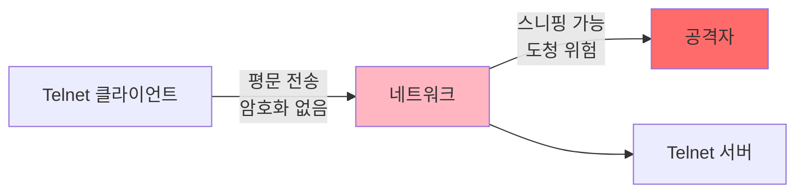
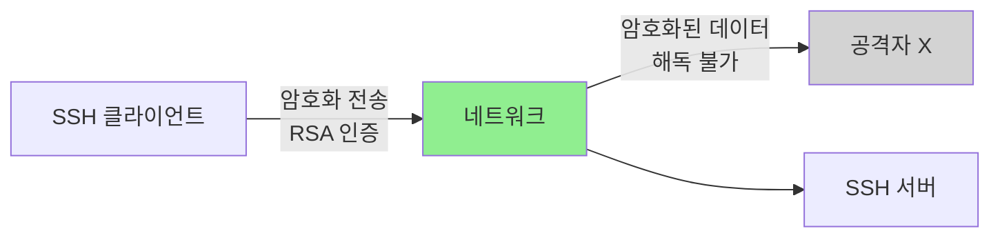
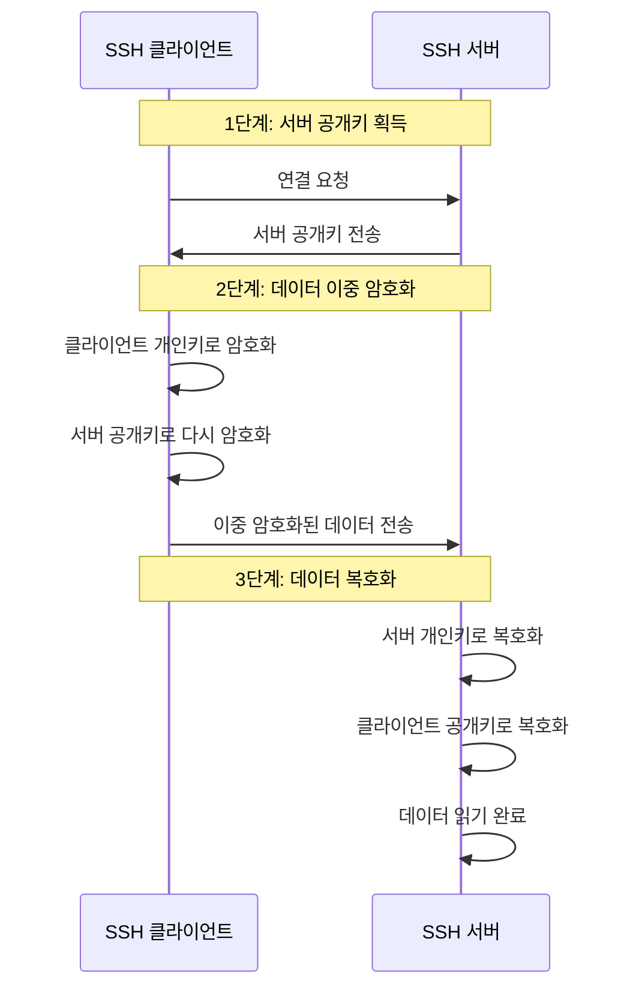
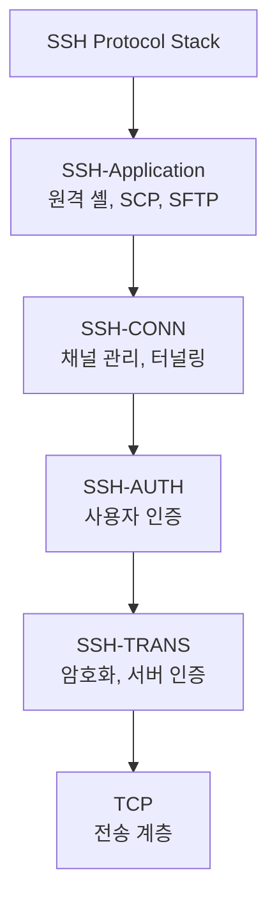
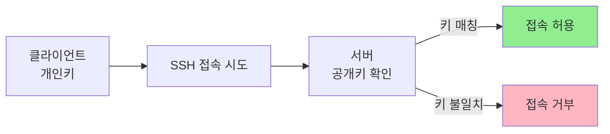
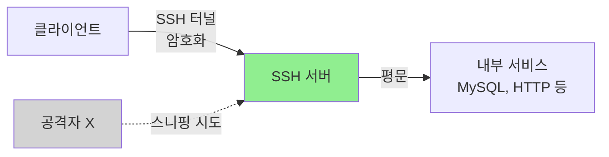
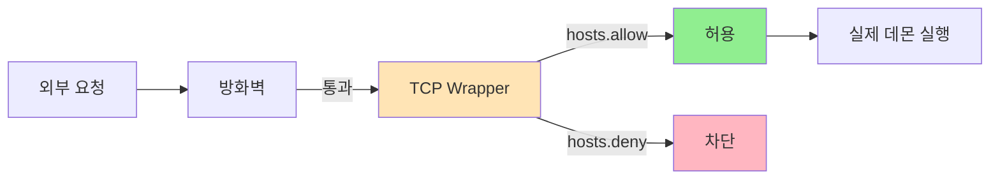

## 전체 흐름 요약

이번 Part 13에서는 리눅스 원격 관리의 핵심 기술들을 학습합니다.

먼저 전통적인 원격 접속 방법인 **Telnet**을 배웁니다. Telnet은 데이터를 평문으로 전송하므로 보안에 취약하지만, 원격 관리의 기본 개념을 이해하는 데 도움이 됩니다. 설치, 설정, root 로그인 허용 방법을 학습하며, sudo 명령어를 통한 권한 상승 기법도 익힙니다.

다음으로 현대적인 원격 접속 표준인 **SSH(Secure Shell)**를 상세히 학습합니다. SSH는 공개키 암호화 기법을 사용하여 안전한 원격 접속을 제공합니다. 접속과 인증을 위해 RSA를 이용하며, 통신 암호화를 위해 DES, 3DES, RC4, Blowfish 등을 사용합니다. SSH의 4가지 구성 요소(SSH-TRANS, SSH-AUTH, SSH-CONN, SSH-Application)를 이해하고, OpenSSH 설치 및 설정 방법을 익힙니다. SSH 키 생성 및 등록을 통한 비밀번호 없는 접속 방법도 학습합니다.

**SCP(Secure Copy Protocol)**를 활용한 원격 보안 복사를 배웁니다. 파일 다운로드와 업로드, 디렉토리 전체 복사, 포트 지정 등 다양한 옵션을 실습합니다.

**SSH 터널링**을 통해 안전하지 않은 프로토콜을 SSH 연결로 캡슐화하여 보안을 강화하는 방법을 학습합니다. 로컬 포트 포워딩, 원격 포트 포워딩, 동적 포트 포워딩(SOCKS 프록시)을 익힙니다.

**TCP Wrapper**를 통한 접근 제어를 배웁니다. hosts.allow와 hosts.deny 파일을 사용하여 특정 IP나 네트워크의 접근을 허용하거나 차단하는 방법을 익힙니다.

마지막으로 그래픽 원격 접속 도구인 **VNC**와 **XRDP**를 학습합니다. VNC는 리눅스 간 또는 윈도우에서 리눅스로 GUI 접속할 때 사용하며, XRDP는 윈도우의 원격 데스크톱 프로토콜(RDP)을 사용하여 리눅스 서버에 접속하는 도구입니다.

---

## 1. Telnet (전통적인 원격 접속)

### 1.1 Telnet 개념

**Telnet**은 전통적인 원격 접속 방법입니다.

#### Telnet의 특징

- 원격지 시스템을 관리할 수 있는 프로토콜입니다
- **데이터를 평문(Plain Text)으로 전송하므로 보안에 취약**합니다
- 포트 23/tcp를 사용합니다
- 사용자 ID와 비밀번호가 네트워크 상에 암호화 없이 전송됩니다



**보안 문제:**
- 패킷 스니핑으로 ID/비밀번호 탈취 가능
- 중간자 공격(MITM) 취약
- 현대 환경에서는 **SSH 사용 권장**

### 1.2 Telnet 설치 (데비안/우분투)

```bash
# Telnet 서버 설치
sudo apt-get update
sudo apt-get install -y telnetd xinetd

# xinetd 설정 (Telnet은 xinetd를 통해 실행됨)
sudo vi /etc/xinetd.d/telnet

# 다음 내용 작성:
service telnet
{
    disable = no
    flags = REUSE
    socket_type = stream
    wait = no
    user = root
    server = /usr/sbin/in.telnetd
    log_on_failure += USERID
}

# xinetd 재시작
sudo systemctl restart xinetd
sudo systemctl enable xinetd

# Telnet 상태 확인
sudo systemctl status xinetd
```

### 1.3 Telnet 설치 (CentOS/RHEL)

```bash
# Telnet 서버 설치
sudo yum install -y telnet-server telnet

# Telnet 소켓 활성화
sudo systemctl start telnet.socket
sudo systemctl enable telnet.socket

# 상태 확인
sudo systemctl status telnet.socket

# 방화벽 설정
sudo firewall-cmd --add-port=23/tcp --permanent
sudo firewall-cmd --reload
```

### 1.4 Telnet에서 root 로그인 허용 (비권장)

**주의:** 보안상 매우 위험하므로 테스트 환경에서만 사용하세요.

#### 데비안/우분투

```bash
# /etc/securetty 파일 편집
sudo vi /etc/securetty

# 다음 줄 추가 (가상 터미널 허용)
pts/0
pts/1
pts/2
pts/3
pts/4
pts/5

# 저장 후 종료
```

#### CentOS/RHEL

```bash
# /etc/securetty 파일 편집
sudo vi /etc/securetty

# pts (pseudo-terminal) 추가
pts/0
pts/1
pts/2
pts/3
pts/4

# 저장 후 telnet 재시작
sudo systemctl restart telnet.socket
```

**pts란?**
- **Pseudo-Terminal Slave**: 가상 터미널
- SSH, Telnet 등 원격 접속 시 할당되는 터미널

### 1.5 Telnet 사용법

```bash
# 기본 접속
telnet [IP주소]

# 예시
telnet 192.168.1.100

# 특정 포트 접속
telnet [IP주소] [포트]

# 예시 (HTTP 서버 테스트)
telnet google.com 80

# Telnet 종료
Ctrl + ]
quit
```

---

## 2. sudo 명령어 및 권한 상승

### 2.1 sudo 개념

**sudo**는 일반 사용자가 일시적으로 관리자 권한으로 명령을 실행할 수 있게 하는 명령어입니다.

### 2.2 sudoers 파일 설정

```bash
# 데비안/우분투 및 CentOS/RHEL 공통

# sudoers 파일 안전하게 편집
sudo visudo

# 또는 직접 편집 (권장하지 않음)
sudo vi /etc/sudoers
```

#### sudoers 파일 기본 형식

```bash
# 형식
계정명  호스트명=(실행 권한 계정명)  [NOPASSWD:] 명령어

# 예시 1: user1이 모든 명령 실행 가능 (비밀번호 필요)
user1  ALL=(ALL)  ALL

# 예시 2: user1이 비밀번호 없이 모든 명령 실행
user1  ALL=(ALL)  NOPASSWD: ALL

# 예시 3: user1이 특정 명령만 실행 가능
user1  ALL=(ALL)  /usr/bin/systemctl, /usr/bin/apt-get

# 예시 4: 그룹에 권한 부여
%admin  ALL=(ALL)  ALL
```

**설정 예시:**

```bash
# 100번 줄 쯤에서 계정 추가
user1   ALL=(ALL)       NOPASSWD: ALL
```

### 2.3 sudo를 이용한 권한 상승 기법

#### 방법 1: vim을 이용한 쉘 실행

```bash
# sudo로 vim을 열고, vim 내에서 쉘 실행
sudo vim -c ':!/bin/bash'

# 설명:
# -c: vim 시작 시 명령 실행
# :!: vim에서 외부 명령 실행
# /bin/bash: 쉘 실행
```

**동작 원리:**
- sudo로 vim을 root 권한으로 실행합니다
- vim이 열리자마자 `/bin/bash` 쉘을 실행하여 사용자가 vim 편집기 안에서 root 쉘 접근을 할 수 있게 합니다

#### 방법 2: awk를 이용한 쉘 실행

```bash
# awk의 BEGIN 블록에서 쉘 실행
sudo awk 'BEGIN {system("/bin/bash")}'

# 설명:
# BEGIN: awk 실행 시작 시 실행되는 블록
# system(): 시스템 명령 실행 함수
```

**awk 기본 형식:**
```bash
awk '패턴 { 액션 }' 파일명
```

---

## 3. SSH (Secure Shell)

### 3.1 SSH 개념

**SSH (Secure Shell)**는 공개키 암호화 기법을 사용한 안전한 원격 접속 프로토콜입니다.

#### SSH의 특징

- **암호화된 통신**: 모든 데이터가 암호화되어 전송됩니다
- **접속과 인증**: RSA 공개키/개인키 쌍 사용
- **통신 암호화**: DES, 3DES, RC4, Blowfish 등 다양한 암호화 알고리즘 지원
- **포트**: 22/tcp (기본값)
- **안전성**: 패킷 스니핑으로도 데이터 해독 불가능



### 3.2 SSH 암호화 과정



#### SSH 암호화 3단계

**1단계: 클라이언트는 SSH 서버에 접근하기 위해 서버의 공개키를 얻어옵니다.**

**2단계: 클라이언트는 자신의 개인키(private key)로 데이터를 암호화하고, 이를 다시 서버의 공개키(public key)로 암호화하여 서버로 전송합니다.**

**3단계: 서버는 클라이언트로부터 전송받은 암호화된 데이터를 자신의 개인키로 먼저 복호화한 후, 이를 다시 클라이언트 공개키로 복호화해서 데이터를 읽습니다.**

### 3.3 SSH Component (구성 요소)

SSH는 4개의 계층으로 구성됩니다.

#### 1) SSH 전송 계층 프로토콜 (SSH-TRANS)

**역할:**
- TCP가 안전한 전송 계층 프로토콜이 아니므로, SSH는 먼저 TCP 상에 안전한 채널을 생성하는 프로토콜을 사용합니다
- 이 새로운 계층은 **SSH-TRANS**라 불리는 독립적인 프로토콜입니다

**기능:**
- **서버 인증**: 서버의 신원을 확인하기 위해 서버의 공개키를 사용합니다
- **암호화**: 도청을 방지합니다
- **무결성 보호**: 데이터가 전송 중에 변경되지 않도록 보호합니다

#### 2) SSH 인증 프로토콜 (SSH-AUTH)

**역할:**
- 사용자의 신원을 확인하는 프로토콜입니다

**인증 방법:**
- **비밀번호 인증**: 전통적인 ID/PW 방식
- **공개키 인증**: 공개키와 개인키 쌍을 이용하여 인증합니다 (더 안전)

#### 3) SSH 연결 프로토콜 (SSH-CONN)

**역할:**
- SSH-CONN은 SSH 연결 내에서 **여러 채널을 관리**합니다
- 각 채널은 독립적인 데이터 스트림을 가지며, 이를 통해 여러 서비스를 동시에 사용할 수 있습니다

**기능:**
- **포트 포워딩**: 특정 포트를 다른 서버로 리다이렉션합니다
- **터널링**: SSH 연결을 통해 다른 네트워크 서비스에 접근합니다

#### 4) SSH 응용 (SSH-Application)

**역할:**
- SSH-Application은 SSH 프로토콜을 사용하는 애플리케이션을 의미합니다

**대표적인 예:**
- 원격 셸 (SSH)
- 파일 전송 (SCP, SFTP)
- 원격 명령 실행



### 3.4 OpenSSH 설치 및 설정

#### 데비안/우분투

```bash
# 1. 패키지 설치 확인
dpkg -l | grep openssh

# 2. OpenSSH 서버 설치
sudo apt-get update
sudo apt-get install -y openssh-server

# 3. 설정 파일 수정
sudo vi /etc/ssh/sshd_config

# 주요 설정 항목:
# Port 22                        # SSH 포트 (기본값 22)
# PermitRootLogin no             # root 로그인 허가 거부 (보안 강화)
# PasswordAuthentication yes     # 비밀번호 인증 허용
# PubkeyAuthentication yes       # 공개키 인증 허용

# 4. SSH 데몬 재시작
sudo systemctl restart ssh
sudo systemctl enable ssh

# 5. 상태 확인
sudo systemctl status ssh

# 6. 방화벽 설정 (UFW)
sudo ufw allow 22/tcp
sudo ufw reload
```

#### CentOS/RHEL

```bash
# 1. 패키지 설치 확인
rpm -qa | grep openssh

# 2. OpenSSH 설치
sudo yum install -y openssh-server openssh-clients

# 3. 설정 파일 수정
sudo vi /etc/ssh/sshd_config

# 주요 설정:
# Port 22
# PermitRootLogin no             # 38번 줄 주석 제거 후 no로 설정
# PasswordAuthentication yes

# 4. SSH 데몬 재시작
sudo systemctl restart sshd.service
sudo systemctl enable sshd.service

# 5. 상태 확인
sudo systemctl status sshd.service

# 6. 방화벽 설정
sudo firewall-cmd --add-service=ssh --permanent
sudo firewall-cmd --reload
sudo firewall-cmd --list-all
```

### 3.5 sshd_config 주요 설정

```bash
# SSH 서버 설정 파일
sudo vi /etc/ssh/sshd_config

# 주요 설정 항목:

# 1. 포트 설정
Port 22                          # 기본 포트 (보안 강화 시 변경 권장)

# 2. root 로그인 제한
PermitRootLogin no               # root 직접 로그인 금지 (보안 필수)
PermitRootLogin prohibit-password # 공개키 인증만 허용

# 3. 인증 방식
PasswordAuthentication yes       # 비밀번호 인증 허용
PubkeyAuthentication yes         # 공개키 인증 허용

# 4. 접속 제한
MaxAuthTries 3                   # 인증 시도 횟수 제한
LoginGraceTime 60                # 로그인 대기 시간 (초)
MaxSessions 10                   # 최대 동시 세션 수

# 5. 배너 설정
Banner /etc/issue.net            # 로그인 전 표시할 배너 파일

# 6. X11 포워딩
X11Forwarding yes                # GUI 애플리케이션 원격 실행 허용

# 7. Keep Alive 설정
ClientAliveInterval 300          # 클라이언트 응답 확인 간격 (초)
ClientAliveCountMax 2            # 무응답 최대 횟수

# 8. 특정 사용자/그룹만 허용
AllowUsers user1 user2           # 특정 사용자만 SSH 접속 허용
AllowGroups sshusers             # 특정 그룹만 SSH 접속 허용
DenyUsers baduser                # 특정 사용자 SSH 접속 차단
DenyGroups badgroup              # 특정 그룹 SSH 접속 차단
```

### 3.6 SSH 배너 설정

로그인 전후에 메시지를 표시할 수 있습니다.

```bash
# 1. 배너 파일 설정 (sshd_config에서)
sudo vi /etc/ssh/sshd_config

# 123번 줄 주석 제거 후 경로 입력:
Banner /etc/issue.net

# 2. 배너 파일 작성
sudo vi /etc/issue.net

# 배너 내용 작성 (예시):
*************************************************************
*                                                           *
*  WARNING: Unauthorized access to this system is          *
*  forbidden and will be prosecuted by law.                *
*                                                           *
*  By accessing this system, you agree that your actions   *
*  may be monitored and recorded.                          *
*                                                           *
*************************************************************

# 3. 로그인 후 메시지 (Message of the Day)
sudo vi /etc/motd

# MOTD 내용 작성 (예시):
Welcome to Production Server
Last backup: 2025-01-15
Contact: admin@example.com

# 4. SSH 재시작
sudo systemctl restart sshd
# 또는 (데비안/우분투)
sudo systemctl restart ssh
```

**배너 파일 종류:**
- `/etc/issue`: 로컬 로그인 전 표시
- `/etc/issue.net`: 네트워크(SSH) 로그인 전 표시
- `/etc/motd`: 로그인 후 표시 (Message of the Day)

### 3.7 SSH 기본 사용법

```bash
# 기본 접속
ssh username@hostname

# 예시
ssh user1@192.168.1.100

# 특정 포트로 접속
ssh -p 2222 user1@192.168.1.100

# 원격 명령 실행 (접속하지 않고)
ssh user1@192.168.1.100 "ls -la /var/log"

# X11 포워딩 (GUI 애플리케이션 실행)
ssh -X user1@192.168.1.100

# 예시: 원격 서버의 Firefox 실행
ssh -X user1@192.168.1.100 firefox

# Verbose 모드 (디버깅)
ssh -v user1@192.168.1.100
ssh -vv user1@192.168.1.100   # 더 자세한 정보
ssh -vvv user1@192.168.1.100  # 가장 자세한 정보
```

---

## 4. SSH 키 기반 인증

### 4.1 SSH 키 인증 개념

**SSH 키 인증**은 비밀번호 없이 안전하게 SSH 접속할 수 있는 방법입니다.



**장점:**
- 비밀번호 입력 불필요
- 더 안전한 인증
- 자동화 스크립트에 유용 (crontab 등)

### 4.2 SSH 키 생성 및 등록

#### 1단계: SSH 키 생성 (클라이언트)

```bash
# 데비안/우분투 및 CentOS/RHEL 공통

# RSA 키 생성
ssh-keygen -t rsa

# 또는 더 안전한 ED25519 키 생성 (권장)
ssh-keygen -t ed25519

# 대화형 프롬프트:
# Enter file in which to save the key (/home/user/.ssh/id_rsa): [Enter]
# Enter passphrase (empty for no passphrase): [Enter 또는 비밀번호 입력]
# Enter same passphrase again: [Enter 또는 비밀번호 재입력]

# 키 생성 확인
ls -la ~/.ssh/

# 출력 예시:
# id_rsa        # 개인키 (절대 공유 금지!)
# id_rsa.pub    # 공개키 (서버에 등록)
```

**옵션 설명:**
- `-t rsa`: RSA 알고리즘 사용 (기본값)
- `-t ed25519`: ED25519 알고리즘 (더 안전, 권장)
- `-b 4096`: 키 길이 4096비트 (더 안전, RSA에만 적용)
- `-C "comment"`: 키에 주석 추가

#### 2단계: 공개키를 원격 서버에 복사

**방법 1: ssh-copy-id 사용 (권장)**

```bash
# 공개키 복사
ssh-copy-id username@remote-server

# 예시
ssh-copy-id user1@192.168.1.100

# 특정 포트 사용 시
ssh-copy-id -p 2222 user1@192.168.1.100

# 특정 키 파일 지정
ssh-copy-id -i ~/.ssh/id_ed25519.pub user1@192.168.1.100
```

**동작 원리:**
- `ssh-copy-id`는 로컬 머신의 공개키(`~/.ssh/id_rsa.pub`)를 원격 서버의 `~/.ssh/authorized_keys` 파일에 추가합니다

**방법 2: 수동 복사**

```bash
# 1. 공개키 내용 확인
cat ~/.ssh/id_rsa.pub

# 2. 서버에 접속
ssh user1@192.168.1.100

# 3. .ssh 디렉토리 생성 (없을 경우)
mkdir -p ~/.ssh
chmod 700 ~/.ssh

# 4. authorized_keys 파일에 공개키 추가
vi ~/.ssh/authorized_keys
# 클라이언트의 공개키 내용 붙여넣기

# 5. 파일 권한 설정
chmod 600 ~/.ssh/authorized_keys

# 6. 로그아웃
exit
```

#### 3단계: 비밀번호 없이 접속 테스트

```bash
# SSH 접속 (비밀번호 입력 없이 접속됨)
ssh user1@192.168.1.100

# 성공 시 비밀번호 입력 없이 로그인됩니다
```

### 4.3 SSH 키 기반 인증 상세 설정

#### 양방향 키 인증 설정

서버 A ↔ 서버 B 양방향 비밀번호 없이 접속하기

```bash
# 서버 A에서 실행
# 1. 서버 A에서 키 생성
ssh-keygen -t rsa

# 2. 서버 B로 공개키 복사
ssh-copy-id root@192.168.1.47

# 서버 B에서 실행
# 3. 서버 B에서 키 생성
ssh-keygen -t rsa

# 4. 서버 A로 공개키 복사
ssh-copy-id root@192.168.1.22

# 테스트
# 서버 A → 서버 B (비밀번호 없이 접속)
ssh root@192.168.1.47

# 서버 B → 서버 A (비밀번호 없이 접속)
ssh root@192.168.1.22
```

#### 수동으로 authorized_keys 생성 (고급)

```bash
# 클라이언트에서 실행

# 1. .ssh 디렉토리로 이동
cd ~/.ssh

# 2. 서버의 공개키를 가져오기
scp 192.168.1.47:/root/.ssh/id_rsa.pub ./47_rsa.pub

# 3. authorized_keys 파일 생성
cat id_rsa.pub > authorized_keys
cat 47_rsa.pub >> authorized_keys

# 4. 서버에 authorized_keys 복사
scp authorized_keys 192.168.1.47:/root/.ssh/

# 5. 권한 설정 확인 (서버에서)
ssh 192.168.1.47
chmod 700 ~/.ssh
chmod 600 ~/.ssh/authorized_keys
```

---

## 5. SCP (Secure Copy Protocol)

### 5.1 SCP 개념

**SCP**는 SSH 기반의 원격 보안 복사 프로토콜입니다.

**특징:**
- SSH 프로토콜 사용 (암호화된 전송)
- 파일 및 디렉토리 복사 가능
- 22/tcp 포트 사용 (SSH와 동일)

### 5.2 SCP 기본 문법

```bash
# 기본 형식
scp [옵션] [출발지] [목적지]

# 원격 → 로컬 (다운로드)
scp [옵션] 계정명@IP주소:[원격경로] [로컬경로]

# 로컬 → 원격 (업로드)
scp [옵션] [로컬경로] 계정명@IP주소:[원격경로]
```

**주요 옵션:**
- `-p`: 원본 파일의 속성(권한, 타임스탬프) 그대로 복사
- `-r`: 디렉토리 전체 복사 (하위 디렉토리 포함)
- `-v`: 상세 출력 (Verbose)
- `-P 포트`: 포트 지정 (기본값 22)
- `-i 키파일`: SSH 키 파일 지정

### 5.3 SCP 다운로드 (원격 → 로컬)

```bash
# 1. 서버에 디렉토리 및 파일 생성 (서버에서 실행)
mkdir /scp
touch /scp/server_file

# 2. 클라이언트에서 파일 다운로드
scp root@192.168.1.22:/scp/server_file /home/

# 포트 지정
scp -P 22 root@192.168.1.22:/scp/server_file /home/

# 디렉토리 전체 다운로드
scp -r root@192.168.1.22:/scp /home/

# 원본 속성 유지하며 다운로드
scp -p root@192.168.1.22:/scp/server_file /home/

# 여러 파일 동시 다운로드
scp root@192.168.1.22:"/scp/file1 /scp/file2" /home/

# Verbose 모드 (진행 상황 표시)
scp -v root@192.168.1.22:/scp/server_file /home/
```

### 5.4 SCP 업로드 (로컬 → 원격)

#### 전제 조건

업로드할 서버의 디렉토리에 **쓰기 권한**이 있어야 합니다.

```bash
# 서버에서 쓰기 권한 부여
chmod o+w /scp

# 또는 특정 그룹/사용자에게만
chmod 770 /scp
chown user1:sshusers /scp
```

#### 업로드 실행

```bash
# 1. 클라이언트에 파일 만들기
touch /home/client_file

# 2. 클라이언트에서 서버로 업로드
scp /home/client_file root@192.168.1.47:/scp/

# 포트 지정 및 속성 유지
scp -P 22 -p /home/client_file root@192.168.1.47:/scp/

# 디렉토리 전체 업로드
scp -r /home/mydir root@192.168.1.47:/scp/

# 특정 SSH 키 사용
scp -i ~/.ssh/id_rsa /home/client_file root@192.168.1.47:/scp/
```

### 5.5 SCP 고급 사용법

```bash
# 두 원격 서버 간 파일 복사 (로컬을 경유)
scp user1@server1:/path/file user2@server2:/path/

# 와일드카드 사용
scp root@192.168.1.22:/scp/*.txt /home/

# 압축 전송 (-C 옵션)
scp -C /home/largefile.tar root@192.168.1.47:/scp/

# 대역폭 제한 (-l 옵션, Kbit/s 단위)
scp -l 1024 /home/largefile root@192.168.1.47:/scp/
# 1024 Kbit/s = 128 KB/s

# 진행률 표시 없이 조용히 복사 (-q 옵션)
scp -q /home/file root@192.168.1.47:/scp/
```

---

## 6. SSH 터널링 (Port Forwarding)

### 6.1 SSH 터널링 개념

**SSH 터널링**은 SSH 연결을 통해 안전하지 않은 프로토콜을 캡슐화하여 보안을 강화하는 기술입니다.



**사용 사례:**
- 방화벽 우회
- 안전하지 않은 프로토콜 보호 (HTTP, MySQL 등)
- 원격 데스크톱 안전하게 접속
- 공용 Wi-Fi에서 안전한 통신

### 6.2 로컬 포트 포워딩 (Local Port Forwarding)

**로컬 포트 포워딩**은 로컬 포트를 원격 서버의 특정 서비스로 포워딩합니다.

```bash
# 기본 형식
ssh -L [로컬포트]:[목적지호스트]:[목적지포트] [SSH서버]

# 예시 1: 원격 MySQL 접속
ssh -L 3307:localhost:3306 user@192.168.1.100

# 설명:
# - 로컬의 3307 포트를 원격 서버의 3306 포트(MySQL)로 포워딩
# - 로컬에서 127.0.0.1:3307로 접속하면 원격 MySQL에 연결됨

# 예시 2: 원격 웹 서버 접속
ssh -L 8080:localhost:80 user@192.168.1.100

# 브라우저에서 http://localhost:8080 접속
# → 원격 서버의 80 포트로 연결됨
```

**사용 예시:**

```bash
# 1. SSH 터널 설정
ssh -L 3307:localhost:3306 root@192.168.1.100

# 2. 다른 터미널에서 MySQL 접속
mysql -h 127.0.0.1 -P 3307 -u root -p

# 3. 백그라운드로 실행
ssh -f -N -L 3307:localhost:3306 root@192.168.1.100

# 옵션 설명:
# -f: 백그라운드 실행
# -N: 원격 명령 실행하지 않음 (터널만 유지)
```

### 6.3 원격 포트 포워딩 (Remote Port Forwarding)

**원격 포트 포워딩**은 원격 서버의 포트를 로컬 서비스로 포워딩합니다.

```bash
# 기본 형식
ssh -R [원격포트]:[로컬호스트]:[로컬포트] [SSH서버]

# 예시: 로컬 웹 서버를 원격에 노출
ssh -R 8080:localhost:80 user@192.168.1.100

# 설명:
# - 원격 서버의 8080 포트를 로컬의 80 포트로 포워딩
# - 원격 서버에서 localhost:8080 접속 시 로컬 웹 서버로 연결됨
```

**사용 사례:**
- NAT 뒤의 로컬 서버를 외부에 노출
- 방화벽 우회

### 6.4 동적 포트 포워딩 (SOCKS 프록시)

**동적 포트 포워딩**은 SOCKS 프록시를 생성하여 모든 트래픽을 SSH 터널로 보냅니다.

```bash
# 기본 형식
ssh -D [로컬포트] [SSH서버]

# 예시
ssh -D 1080 user@192.168.1.100

# 설명:
# - 로컬의 1080 포트에 SOCKS5 프록시 생성
# - 브라우저나 애플리케이션에서 localhost:1080을 SOCKS 프록시로 설정

# 백그라운드 실행
ssh -f -N -D 1080 user@192.168.1.100
```

**브라우저 설정 (Firefox 예시):**

```
설정 → 네트워크 설정 → 수동 프록시 설정
SOCKS Host: localhost
Port: 1080
SOCKS v5 선택
```

---

## 7. TCP Wrapper (접근 제어)

### 7.1 TCP Wrapper 개념

**TCP Wrapper**는 임의의 호스트가 서비스를 요청해오면 실제 데몬을 구동하기 전에 접속을 허용한 시스템인지 확인해주는 도구입니다.



**특징:**
- 방화벽을 통과한 요청을 한 번 더 필터링합니다
- inetd 데몬이 관리하는 서비스에 적용됩니다
- **standalone 데몬**은 통제할 수 없습니다 (Apache, Nginx 등)

**제약사항:**
- 최신 리눅스에서는 systemd 소켓 활성화로 대체되는 추세입니다
- SSH는 TCP Wrapper를 지원합니다

### 7.2 hosts.allow와 hosts.deny

#### 적용 순서

1. **hosts.allow 먼저 확인** → 허용 규칙 있으면 접속 허용
2. **hosts.deny 확인** → 차단 규칙 있으면 접속 차단
3. **두 파일에 없으면** → 기본적으로 접속 허용

#### 기본 형식

```bash
# 형식
서비스명 : IP주소 또는 네트워크 : [옵션]
```

### 7.3 hosts.allow 설정

```bash
# hosts.allow 파일 편집
sudo vi /etc/hosts.allow

# 예시 1: 특정 IP만 SSH 허용
sshd : 192.168.1.100

# 예시 2: 특정 네트워크 허용
sshd : 192.168.1.0/255.255.255.0
# 또는
sshd : 192.168.1.

# 예시 3: 여러 IP 허용
sshd : 192.168.1.100, 192.168.1.101, 192.168.1.102

# 예시 4: 모든 IP 허용
sshd : ALL

# 예시 5: 특정 호스트명 허용
sshd : trusted.example.com

# 예시 6: 여러 서비스에 같은 규칙 적용
sshd, vsftpd : 192.168.1.0/24

# 예시 7: 도메인 전체 허용
sshd : .example.com

# 예시 8: 로컬 네트워크 허용
ALL : 127.0.0.1, localhost
```

### 7.4 hosts.deny 설정

```bash
# hosts.deny 파일 편집
sudo vi /etc/hosts.deny

# 예시 1: 특정 IP 차단
sshd : 10.0.0.5

# 예시 2: 특정 네트워크 차단
sshd : 10.0.0.0/255.255.255.0

# 예시 3: 모든 IP 차단 (화이트리스트 방식)
sshd : ALL

# 예시 4: 특정 IP 제외하고 모두 차단
sshd : ALL EXCEPT 192.168.1.100

# 예시 5: 모든 서비스 차단
ALL : ALL
```

### 7.5 TCP Wrapper 실전 예시

#### 시나리오 1: SSH 화이트리스트 설정

```bash
# /etc/hosts.allow
sshd : 192.168.1.100
sshd : 192.168.1.101
sshd : 10.0.0.0/24

# /etc/hosts.deny
sshd : ALL

# 결과: 192.168.1.100, 192.168.1.101, 10.0.0.x 네트워크만 SSH 접속 가능
```

#### 시나리오 2: 특정 IP 차단

```bash
# /etc/hosts.deny
sshd : 203.0.113.50
sshd : 198.51.100.0/24

# /etc/hosts.allow
sshd : ALL

# 결과: 203.0.113.50과 198.51.100.x 네트워크만 차단, 나머지는 허용
```

#### 시나리오 3: 로그 기록

```bash
# /etc/hosts.deny
# 차단 시 로그 기록
sshd : ALL : spawn /bin/echo "SSH access denied from %h" | /usr/bin/logger

# %h: 클라이언트 호스트명
# %a: 클라이언트 IP 주소
```

### 7.6 TCP Wrapper 테스트

```bash
# TCP Wrapper 규칙 테스트
tcpdmatch sshd 192.168.1.100

# 출력 예시:
# client:   hostname 192.168.1.100
# server:   process sshd
# matched:  /etc/hosts.allow line 1
# access:   granted

# 차단될 경우:
# access:   denied
```

---

## 8. VNC (Virtual Network Computing)

### 8.1 VNC 개념

**VNC**는 리눅스/유닉스 시스템의 GUI 화면을 원격으로 제어할 수 있는 프로토콜입니다.

**특징:**
- GUI 원격 접속
- 5900번 포트 사용 (Display :0 = 5900, :1 = 5901)
- 플랫폼 독립적 (Windows, Linux, macOS 모두 지원)

### 8.2 VNC 서버 설치 (데비안/우분투)

```bash
# 1. VNC 서버 설치
sudo apt-get update
sudo apt-get install -y tightvncserver

# 2. VNC 비밀번호 설정
vncserver

# 비밀번호 입력 프롬프트:
# Password: [VNC 비밀번호 입력]
# Verify: [비밀번호 재입력]
# Would you like to enter a view-only password (y/n)? n

# 3. VNC 서버 중지 (설정을 위해)
vncserver -kill :1

# 4. VNC 시작 스크립트 편집
vi ~/.vnc/xstartup

# 다음 내용 작성:
#!/bin/bash
xrdb $HOME/.Xresources
startxfce4 &

# 5. 실행 권한 부여
chmod +x ~/.vnc/xstartup

# 6. VNC 서버 시작
vncserver :1 -geometry 1920x1080 -depth 24

# 7. 방화벽 설정
sudo ufw allow 5901/tcp
```

### 8.3 VNC 서버 설치 (CentOS/RHEL)

```bash
# 1. GNOME 데스크톱 환경 설치 (없을 경우)
sudo yum groupinstall -y "GNOME Desktop"

# 2. TigerVNC 서버 설치
sudo yum install -y tigervnc-server

# 3. VNC 비밀번호 설정
vncpasswd

# 4. VNC 서버 설정 파일 복사
sudo cp /lib/systemd/system/vncserver@.service /etc/systemd/system/vncserver@:1.service

# 5. 설정 파일 편집
sudo vi /etc/systemd/system/vncserver@:1.service

# <USER> 부분을 실제 사용자명으로 변경

# 6. systemd 재로드
sudo systemctl daemon-reload

# 7. VNC 서버 시작
sudo systemctl start vncserver@:1.service
sudo systemctl enable vncserver@:1.service

# 8. 방화벽 설정
sudo firewall-cmd --add-port=5901/tcp --permanent
sudo firewall-cmd --reload
```

### 8.4 VNC 클라이언트 접속

#### Windows

```
1. VNC Viewer 다운로드 (RealVNC, TightVNC 등)
2. VNC Viewer 실행
3. 서버 주소 입력: 192.168.1.100:1
4. VNC 비밀번호 입력
5. 접속 완료
```

#### Linux

```bash
# VNC Viewer 설치 (데비안/우분투)
sudo apt-get install -y xtightvncviewer

# VNC 접속
vncviewer 192.168.1.100:1

# 비밀번호 입력 후 접속
```

---

## 9. XRDP (윈도우 원격 데스크톱)

### 9.1 XRDP 개념

**XRDP**는 윈도우의 원격 데스크톱 프로토콜(RDP)을 사용하여 리눅스 서버에 접속하는 도구입니다.

**특징:**
- 윈도우 원격 데스크톱 클라이언트(mstsc) 사용 가능
- 3389/tcp 포트 사용
- VNC보다 성능이 좋음

### 9.2 XRDP 설치 (데비안/우분투)

```bash
# 1. XRDP 설치
sudo apt-get update
sudo apt-get install -y xrdp

# 2. XRDP 서비스 시작
sudo systemctl enable xrdp
sudo systemctl start xrdp

# 3. 상태 확인
sudo systemctl status xrdp

# 4. 방화벽 설정
sudo ufw allow 3389/tcp

# 5. (선택) SSL 인증서 그룹 권한 설정
sudo adduser xrdp ssl-cert

# 6. XRDP 재시작
sudo systemctl restart xrdp
```

### 9.3 XRDP 설치 (CentOS/RHEL)

```bash
# 1. EPEL 저장소 활성화
sudo yum install -y epel-release

# 2. XRDP 설치
sudo yum install -y xrdp

# 3. XRDP 서비스 시작
sudo systemctl start xrdp
sudo systemctl enable xrdp

# 4. 상태 확인
sudo systemctl status xrdp

# 5. 방화벽 설정
sudo firewall-cmd --add-port=3389/tcp --permanent
sudo firewall-cmd --reload

# 6. SELinux 설정 (필요 시)
sudo chcon --type=bin_t /usr/sbin/xrdp
sudo chcon --type=bin_t /usr/sbin/xrdp-sesman
```

### 9.4 XRDP 접속 (윈도우)

```
1. 윈도우 시작 메뉴에서 "원격 데스크톱 연결" 실행
   또는 Win + R → mstsc 입력

2. 컴퓨터: 192.168.1.100 입력

3. 연결 클릭

4. XRDP 로그인 화면에서:
   - Session: Xorg 선택
   - username: 리눅스 사용자명 입력
   - password: 리눅스 비밀번호 입력

5. OK 클릭하여 접속
```

---

## 주요 개념 요약표

| 구분 | 주요 개념 | 설명 |
|------|----------|------|
| **Telnet** | 개념 | 전통적인 원격 접속, 평문 전송 |
| | 포트 | 23/tcp |
| | 보안 | 취약 (암호화 없음) |
| | 대안 | SSH 사용 권장 |
| **SSH** | 개념 | 암호화된 원격 접속 프로토콜 |
| | 포트 | 22/tcp |
| | 암호화 | RSA, DES, 3DES, RC4, Blowfish |
| | 구성 요소 | SSH-TRANS, SSH-AUTH, SSH-CONN, SSH-Application |
| | 설정 파일 | /etc/ssh/sshd_config |
| | 키 생성 | ssh-keygen -t rsa |
| | 키 복사 | ssh-copy-id user@host |
| **SCP** | 개념 | SSH 기반 원격 보안 복사 |
| | 다운로드 | scp user@host:원격경로 로컬경로 |
| | 업로드 | scp 로컬경로 user@host:원격경로 |
| | 옵션 | -p(속성유지), -r(디렉토리), -P(포트) |
| **SSH 터널링** | 로컬 포워딩 | ssh -L 로컬포트:목적지:포트 서버 |
| | 원격 포워딩 | ssh -R 원격포트:로컬:포트 서버 |
| | 동적 포워딩 | ssh -D 1080 서버 (SOCKS) |
| **TCP Wrapper** | 개념 | 방화벽 통과 후 2차 필터링 |
| | hosts.allow | 접속 허용 규칙 (우선 적용) |
| | hosts.deny | 접속 차단 규칙 |
| | 형식 | 서비스명 : IP주소 |
| **VNC** | 개념 | GUI 원격 접속 프로토콜 |
| | 포트 | 5900+Display번호 (:1 = 5901) |
| | 설치 (데비안) | apt-get install tightvncserver |
| | 설치 (CentOS) | yum install tigervnc-server |
| | 시작 | vncserver :1 -geometry 1920x1080 |
| **XRDP** | 개념 | 윈도우 RDP로 리눅스 접속 |
| | 포트 | 3389/tcp |
| | 설치 (데비안) | apt-get install xrdp |
| | 설치 (CentOS) | yum install epel-release && yum install xrdp |
| | 접속 | mstsc (윈도우 원격 데스크톱) |

---

## 데비안(Debian/Ubuntu) vs CentOS 차이점

### SSH 설정

| 항목 | Debian/Ubuntu | CentOS/RHEL |
|------|---------------|-------------|
| 패키지 설치 | `apt-get install openssh-server` | `yum install openssh-server` |
| 서비스명 | **ssh** | **sshd** |
| 설정 파일 | `/etc/ssh/sshd_config` | `/etc/ssh/sshd_config` |
| 서비스 재시작 | `systemctl restart ssh` | `systemctl restart sshd` |
| 방화벽 (SSH 허용) | `ufw allow 22/tcp` | `firewall-cmd --add-service=ssh --permanent` |

### VNC 설정

| 항목 | Debian/Ubuntu | CentOS/RHEL |
|------|---------------|-------------|
| VNC 서버 | **tightvncserver** | **tigervnc-server** |
| 설치 | `apt-get install tightvncserver` | `yum install tigervnc-server` |
| 시작 | `vncserver :1` | `systemctl start vncserver@:1` |
| 방화벽 | `ufw allow 5901/tcp` | `firewall-cmd --add-port=5901/tcp --permanent` |

### XRDP 설정

| 항목 | Debian/Ubuntu | CentOS/RHEL |
|------|---------------|-------------|
| 저장소 | 기본 저장소 | EPEL 저장소 필요 |
| 설치 | `apt-get install xrdp` | `yum install epel-release && yum install xrdp` |
| 서비스 시작 | `systemctl start xrdp` | `systemctl start xrdp` |
| 방화벽 | `ufw allow 3389/tcp` | `firewall-cmd --add-port=3389/tcp --permanent` |
| SELinux | N/A (기본 AppArmor) | SELinux 설정 필요 |

---

## 마무리

이번 Part 13에서는 리눅스 원격 관리의 핵심 기술들을 학습했습니다.

**Telnet**을 통해 전통적인 원격 접속의 개념을 이해했지만, 평문 전송으로 인한 보안 취약점을 확인했습니다. **SSH**는 공개키 암호화를 통해 안전한 원격 접속을 제공하며, 4가지 구성 요소(SSH-TRANS, SSH-AUTH, SSH-CONN, SSH-Application)를 통해 서버 인증, 데이터 암호화, 무결성 보호를 수행합니다. SSH 키 기반 인증을 통해 비밀번호 없이 안전하게 접속하는 방법을 익혔으며, 이는 자동화 스크립트(crontab 등)에서 매우 유용합니다.

**SCP**를 활용하여 SSH 기반의 안전한 파일 전송을 수행할 수 있으며, **SSH 터널링**을 통해 안전하지 않은 프로토콜을 SSH 연결로 캡슐화하여 보안을 강화할 수 있습니다. 로컬 포트 포워딩, 원격 포트 포워딩, SOCKS 프록시를 활용하면 방화벽을 우회하거나 내부 서비스에 안전하게 접근할 수 있습니다.

**TCP Wrapper**를 통한 2차 접근 제어는 방화벽과 함께 다층 방어 전략을 구현하는 데 도움이 됩니다. **VNC**와 **XRDP**를 통해 GUI 기반의 원격 접속을 수행할 수 있으며, 특히 XRDP는 윈도우 사용자에게 친숙한 원격 데스크톱 프로토콜을 제공합니다.

이러한 원격 관리 기술들은 실무에서 서버 관리의 기본이 되는 필수 지식입니다. 특히 SSH 키 기반 인증과 터널링 기법은 현대 DevOps 환경에서 자동화와 보안을 동시에 달성하는 핵심 기술입니다.