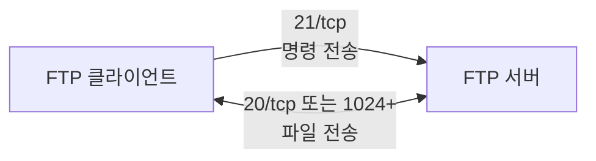
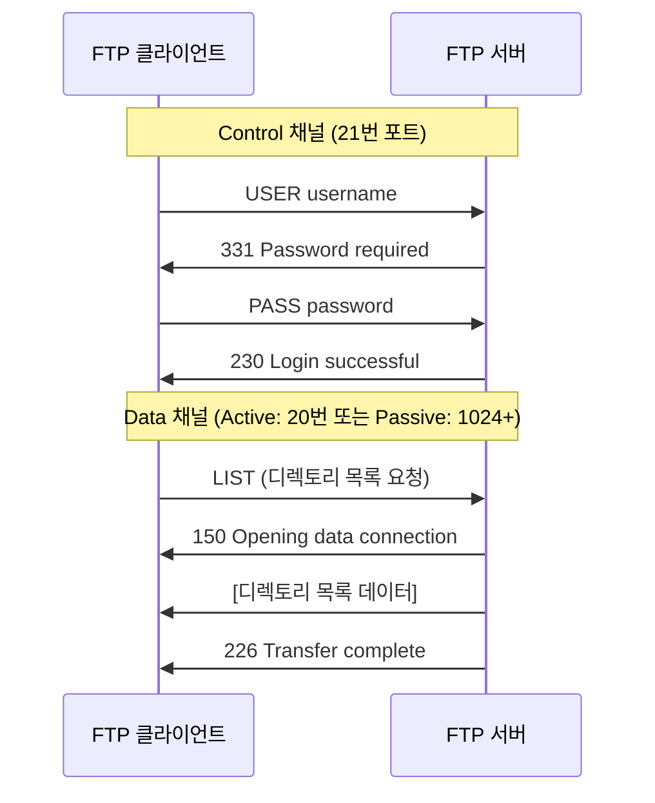
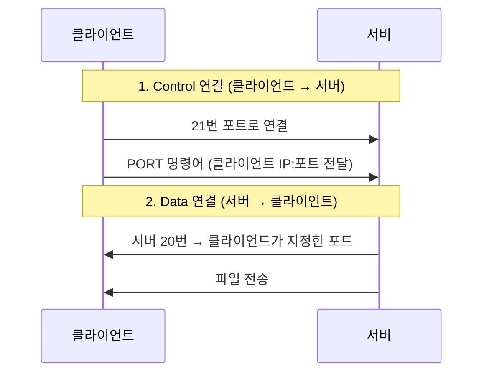
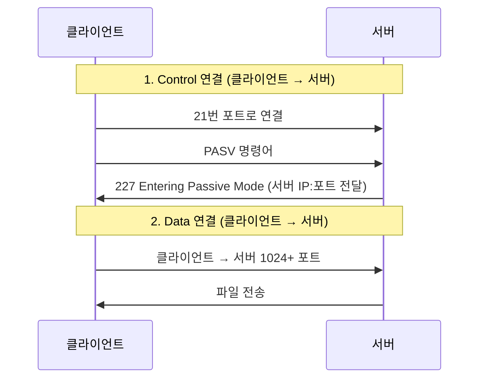
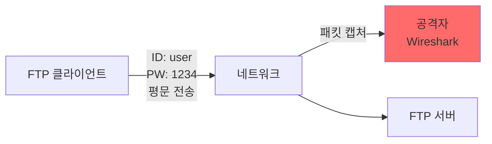
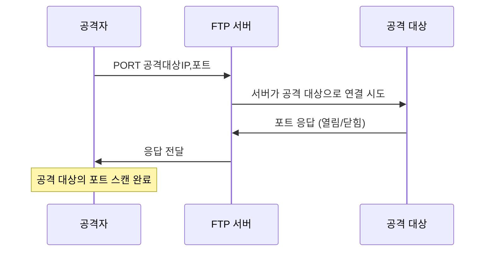
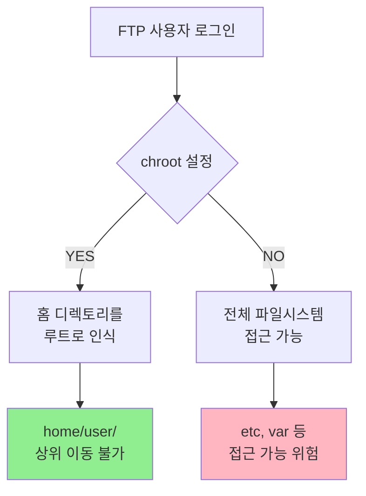

## 전체 흐름 요약

이번 Part 14에서는 FTP(File Transfer Protocol) 서버 구축 및 보안을 학습합니다.

먼저 **FTP 개념**을 배웁니다. FTP는 TCP/IP 기반의 원격 파일 전송 프로토콜로, 파일 전송 성능은 좋지만 평문 전송으로 인한 보안 취약점이 있습니다. SFTP(SSH FTP)와 FTPS(FTP over SSL/TLS) 등 보안 강화 버전을 이해합니다.

**FTP 동작 방식**에서는 Active Mode와 Passive Mode의 차이를 학습합니다. Active Mode는 서버가 클라이언트로 데이터 연결을 시작하고, Passive Mode는 클라이언트가 서버로 데이터 연결을 시작합니다. Control 채널(21번 포트)과 Data 채널(20번 또는 1024번 이상)의 역할을 이해합니다.

**VSFTP (Very Secure FTP Daemon)**를 설치하고 설정합니다. vsftpd는 보안을 강조한 FTP 데몬으로 빠른 성능과 안정성이 탁월하여 RedHat, SUSE, OpenBSD에서 기본 FTP로 채택되었습니다. 익명 접속, 사용자 인증, 업로드/다운로드 설정 방법을 익힙니다.

**FTP 보안**을 상세히 다룹니다. 평문 전송의 위험성, Bounce Attack, Anonymous FTP 취약점을 이해하고, chroot jail을 통한 디렉토리 접근 제한, ftpusers 파일과 TCP Wrapper를 통한 접근 제어 방법을 학습합니다.

**FTP 파일 전송 모드**에서는 ASCII 모드와 Binary 모드의 차이를 이해합니다. ASCII 모드는 텍스트 파일의 개행 문자를 자동으로 변환하고, Binary 모드는 파일을 있는 그대로 전송합니다.

마지막으로 **FTP 클라이언트 사용법**을 익히고, ncftp를 사용한 파일 업로드/다운로드 실습을 진행합니다.

---

## 1. FTP 개념

### 1.1 FTP란?

**FTP (File Transfer Protocol)**는 TCP/IP 기반의 원격으로 파일을 전송하기 위한 통신 프로토콜입니다.

#### FTP의 특징

- **파일 전송 전용 프로토콜**: 파일 전송 성능이 매우 좋습니다
- **표준 포트**: 21/tcp (Control), 20/tcp (Data - Active Mode)
- **인증 방식**: 사용자명/비밀번호 또는 익명(Anonymous) 접속
- **양방향 전송**: 업로드(Upload)와 다운로드(Download) 모두 가능



**현재 상황:**
- 웹 브라우저에서 파일 전송을 편리하게 할 수 있어 예전보다 인기가 떨어졌습니다
- 하지만 **대용량 파일 전송 성능**은 여전히 우수합니다
- 보안이 중요한 환경에서는 SFTP나 FTPS 사용이 권장됩니다

### 1.2 FTP 보안 강화 버전

#### SFTP (Secure File Transfer Protocol)

- **SSH 기반**: SSH 프로토콜을 사용하여 파일 전송
- **포트**: 22/tcp (SSH와 동일)
- **암호화**: 모든 데이터가 암호화됨
- **사용**: SSH가 설치되어 있으면 바로 사용 가능

#### FTPS (FTP over SSL/TLS)

- **SSL/TLS 기반**: SSL/TLS 계층을 추가하여 암호화
- **포트**: 990/tcp (Implicit SSL) 또는 21/tcp (Explicit SSL)
- **암호화**: 제어 채널과 데이터 채널 모두 암호화
- **사용**: vsftpd에서 SSL 설정 필요

| 구분 | FTP | SFTP | FTPS |
|------|-----|------|------|
| 암호화 | ❌ 평문 | ✅ SSH | ✅ SSL/TLS |
| 포트 | 21, 20 | 22 | 990, 21 |
| 인증 | ID/PW | SSH 키 또는 ID/PW | 인증서 또는 ID/PW |
| 방화벽 친화성 | 복잡 (2개 포트) | 간단 (1개 포트) | 복잡 (2개 포트) |
| 권장 사용 | ❌ | ✅ | ⚠️ |

---

## 2. FTP 동작 방식

### 2.1 FTP의 2개 채널

FTP는 **Control 채널**과 **Data 채널** 2개의 독립적인 TCP 연결을 사용합니다.

#### Control 채널 (명령 채널)

- **포트**: 21/tcp
- **역할**: 사용자 인증, 명령어 전송, 응답 코드 수신
- **연결**: 세션 동안 계속 유지됨
- **명령 예시**: USER, PASS, LIST, RETR, STOR 등

#### Data 채널 (데이터 채널)

- **포트**: 20/tcp (Active Mode) 또는 1024+ (Passive Mode)
- **역할**: 실제 파일 내용 전송, 디렉토리 목록 전송
- **연결**: 데이터 전송이 필요할 때만 생성됨
- **특징**: 전송 완료 후 연결 종료



### 2.2 Active Mode (능동 모드)

**Active Mode**는 서버가 클라이언트로 데이터 연결을 시작합니다.



**Active Mode 특징:**
- **21번 포트 (Control)**: 클라이언트 → 서버로 접속
- **20번 포트 (Data)**: **서버 → 클라이언트**로 접속
- **문제점**: 클라이언트의 방화벽이 서버로부터의 연결을 차단할 수 있음
- **NAT 문제**: 클라이언트가 NAT 뒤에 있으면 연결 실패 가능

### 2.3 Passive Mode (수동 모드)

**Passive Mode**는 클라이언트가 서버로 데이터 연결을 시작합니다.



**Passive Mode 특징:**
- **21번 포트 (Control)**: 클라이언트 → 서버로 접속
- **1024번 이상 포트 (Data)**: **클라이언트 → 서버**로 접속
- **장점**: 클라이언트 방화벽 문제 해결, NAT 환경에서 안정적
- **현대 FTP의 기본 모드**: 대부분의 FTP 클라이언트가 Passive Mode 사용

### 2.4 Active vs Passive Mode 비교

| 항목 | Active Mode | Passive Mode |
|------|-------------|--------------|
| Control 연결 | 클라이언트 → 서버 (21) | 클라이언트 → 서버 (21) |
| Data 연결 | **서버 → 클라이언트 (20)** | **클라이언트 → 서버 (1024+)** |
| 클라이언트 방화벽 | 문제 발생 가능 | 문제 없음 |
| 서버 방화벽 | 문제 없음 | 포트 범위 열어야 함 |
| NAT 환경 | 문제 발생 가능 | 안정적 |
| 사용 권장 | ❌ | ✅ (현대 기본값) |

---

## 3. VSFTP (Very Secure FTP Daemon)

### 3.1 VSFTP 개념

**VSFTP (Very Secure FTP Daemon)**는 보안을 강조한 FTP 데몬입니다.

**특징:**
- **빠른 성능 (Performance)**: 매우 빠른 파일 전송 속도
- **안정성 (Stability)**: 탁월한 안정성으로 대규모 환경에서도 안정적
- **보안 (Security)**: 기본 설정이 보안 중심으로 구성됨
- **채택**: RedHat, SUSE, OpenBSD에서 기본 FTP로 채택

### 3.2 VSFTP 설치 (데비안/우분투)

```bash
# 1. 패키지 업데이트
sudo apt-get update

# 2. vsftpd 설치
sudo apt-get install -y vsftpd

# 3. 상태 확인
sudo systemctl status vsftpd

# 4. 부팅 시 자동 시작 설정
sudo systemctl enable vsftpd

# 5. FTP 클라이언트 설치 (ncftp)
sudo apt-get install -y ncftp
```

### 3.3 VSFTP 설치 (CentOS/RHEL)

```bash
# 1. vsftpd 서버 설치
sudo yum install -y vsftpd

# 2. vsftpd 시작
sudo systemctl start vsftpd.service
sudo systemctl enable vsftpd.service

# 3. 상태 확인
sudo systemctl status vsftpd.service

# 4. FTP 클라이언트 설치 (ncftp)
# EPEL 저장소 활성화
sudo yum install -y epel-release

# ncftp 설치
sudo yum install -y ncftp

# 5. 방화벽 설정
sudo firewall-cmd --add-service=ftp --permanent
# 또는 포트 직접 지정
sudo firewall-cmd --add-port=21/tcp --permanent

# 방화벽 재로드
sudo firewall-cmd --reload

# 확인
sudo firewall-cmd --list-all
```

### 3.4 vsftpd 설정 파일

```bash
# vsftpd 설정 파일 위치 (데비안/우분투 및 CentOS/RHEL 공통)
sudo vi /etc/vsftpd/vsftpd.conf
# 또는 (데비안/우분투)
sudo vi /etc/vsftpd.conf
```

#### 주요 설정 항목

```bash
# ===== 기본 설정 =====

# 익명 접속 허용 여부
anonymous_enable=NO              # NO: 익명 접속 차단 (권장)

# 로컬 사용자 로그인 허용
local_enable=YES                 # YES: 로컬 계정으로 로그인 가능

# 쓰기 권한 허용
write_enable=YES                 # YES: 업로드 가능

# 로컬 사용자의 umask 설정
local_umask=022                  # 업로드된 파일 권한 (644)

# ===== 메시지 설정 =====

# 디렉토리 진입 시 메시지 파일
dirmessage_enable=YES
message_file=.message            # .message 파일 내용 표시

# 로그인 환영 메시지
ftpd_banner=Welcome to FTP Server

# ===== 익명 사용자 설정 =====

# 익명 사용자 업로드 허용
anon_upload_enable=YES           # YES: 익명 업로드 가능 (비권장)

# 익명 사용자 디렉토리 생성 허용
anon_mkdir_write_enable=YES      # YES: 익명 디렉토리 생성 가능 (비권장)

# ===== 로그 설정 =====

# 전송 로그 활성화
xferlog_enable=YES
xferlog_file=/var/log/vsftpd.log

# ===== chroot 설정 (보안) =====

# 모든 로컬 사용자를 홈 디렉토리에 가두기
chroot_local_user=YES            # YES: 상위 디렉토리 접근 차단

# chroot 환경에서 쓰기 가능한 홈 디렉토리 허용
allow_writeable_chroot=YES       # vsftpd 3.0+ 필수 설정

# chroot 예외 목록 활성화
chroot_list_enable=YES           # YES: 예외 사용자 목록 사용
chroot_list_file=/etc/vsftpd/chroot_list

# ===== Passive Mode 설정 =====

# Passive Mode 활성화
pasv_enable=YES

# Passive Mode 포트 범위 지정
pasv_min_port=10000
pasv_max_port=10100

# ===== 보안 설정 =====

# 루트 로그인 차단 (ftpusers 파일 사용)
userlist_enable=YES
userlist_deny=YES
userlist_file=/etc/vsftpd/ftpusers

# ASCII 모드 업로드/다운로드 허용
ascii_upload_enable=YES
ascii_download_enable=YES

# ===== 성능 설정 =====

# 최대 동시 접속자 수
max_clients=50

# 같은 IP에서 최대 접속 수
max_per_ip=5
```

### 3.5 vsftpd 기본 설정 (간단 버전)

```bash
# /etc/vsftpd/vsftpd.conf 편집
sudo vi /etc/vsftpd/vsftpd.conf

# 최소 설정 (보안 중심)
anonymous_enable=NO              # 익명 접속 차단
local_enable=YES                 # 로컬 사용자 허용
write_enable=YES                 # 업로드 허용
local_umask=022                  # 파일 권한
chroot_local_user=YES            # 홈 디렉토리에 가두기
allow_writeable_chroot=YES       # 쓰기 가능 홈 디렉토리 허용
pasv_min_port=10000              # Passive Mode 포트 범위
pasv_max_port=10100

# 저장 후 재시작
sudo systemctl restart vsftpd
```

---

## 4. FTP 사용자 관리

### 4.1 FTP 전용 사용자 생성

```bash
# 데비안/우분투 및 CentOS/RHEL 공통

# 1. FTP 전용 사용자 생성
sudo useradd -m -d /home/ftp_user -s /bin/bash ftp_user

# 2. 비밀번호 설정
sudo passwd ftp_user

# 3. 홈 디렉토리 권한 설정
sudo chown ftp_user:ftp_user /home/ftp_user
sudo chmod 755 /home/ftp_user

# 4. 테스트 파일 생성
sudo -u ftp_user touch /home/ftp_user/test_file.txt
echo "FTP Test File" | sudo tee /home/ftp_user/test_file.txt
```

### 4.2 익명(Anonymous) FTP 설정

**주의:** 보안상 매우 위험하므로 공개 파일 배포용으로만 사용하세요.

```bash
# 1. vsftpd.conf 편집
sudo vi /etc/vsftpd/vsftpd.conf

# 익명 접속 허용
anonymous_enable=YES

# 익명 업로드 허용 (선택사항, 비권장)
anon_upload_enable=YES

# 익명 디렉토리 생성 허용 (선택사항, 비권장)
anon_mkdir_write_enable=YES

# 2. 익명 FTP 디렉토리 권한 설정
sudo mkdir -p /var/ftp/pub
sudo chown ftp:ftp /var/ftp/pub
sudo chmod 755 /var/ftp/pub

# 3. 환영 메시지 생성 (선택사항)
sudo vi /var/ftp/pub/.message

# 메시지 내용 작성:
Welcome to Anonymous FTP Server
Please download files from /pub directory

# 4. vsftpd 재시작
sudo systemctl restart vsftpd

# 5. 익명 접속 테스트
ftp localhost
# Name: anonymous
# Password: [Enter 또는 이메일 주소]
```

---

## 5. FTP 클라이언트 사용법

### 5.1 ncftp 사용법

**ncftp**는 사용자 친화적인 FTP 클라이언트입니다.

#### 기본 접속

```bash
# 사용자 인증 접속
ncftp -u username hostname

# 예시
ncftp -u ftp_user 192.168.1.100

# 익명 접속
ncftp hostname

# 예시
ncftp 192.168.1.100
```

#### 파일 다운로드

```bash
# ncftp 접속 후

# 디렉토리 이동
cd pub

# 디렉토리 목록 확인
ls

# 파일 다운로드 (로컬 /home 디렉토리로)
get filename.txt

# 여러 파일 다운로드
mget *.txt

# 특정 경로로 다운로드
lcd /tmp           # 로컬 디렉토리 변경
get filename.txt
```

#### 파일 업로드

```bash
# ncftp 접속 후

# 파일 업로드
put /path/to/local/file.txt

# 여러 파일 업로드
mput /path/to/local/*.txt

# 로컬 디렉토리 확인
lpwd

# 로컬 파일 목록 확인
lls
```

#### ncftp 명령어 모음

| 명령어 | 설명 |
|--------|------|
| `ls` | 원격 디렉토리 목록 |
| `cd` | 원격 디렉토리 이동 |
| `pwd` | 원격 현재 경로 |
| `get` | 파일 다운로드 |
| `mget` | 여러 파일 다운로드 |
| `put` | 파일 업로드 |
| `mput` | 여러 파일 업로드 |
| `lcd` | 로컬 디렉토리 이동 |
| `lpwd` | 로컬 현재 경로 |
| `lls` | 로컬 디렉토리 목록 |
| `mkdir` | 원격 디렉토리 생성 |
| `rmdir` | 원격 디렉토리 삭제 |
| `rm` | 원격 파일 삭제 |
| `bye` 또는 `quit` | 접속 종료 |

### 5.2 표준 ftp 명령어 사용법

```bash
# FTP 접속
ftp hostname

# 예시
ftp 192.168.1.100

# Name 입력: ftp_user
# Password 입력: ****

# FTP 프롬프트에서:
ftp> ls                    # 목록 확인
ftp> cd pub                # 디렉토리 이동
ftp> get file.txt          # 다운로드
ftp> put localfile.txt     # 업로드
ftp> binary                # Binary 모드 전환
ftp> ascii                 # ASCII 모드 전환
ftp> bye                   # 종료
```

### 5.3 lftp 사용법 (고급)

```bash
# lftp 설치
# 데비안/우분투
sudo apt-get install -y lftp

# CentOS/RHEL
sudo yum install -y lftp

# 사용법
lftp -u username hostname

# 예시
lftp -u ftp_user 192.168.1.100

# 비밀번호 입력 후 명령어 사용
lftp ftp_user@192.168.1.100:~> mirror remote_dir local_dir  # 디렉토리 동기화
lftp ftp_user@192.168.1.100:~> mget *.txt                   # 패턴 다운로드
```

---

## 6. FTP 보안

### 6.1 FTP 보안 취약점

#### 1) 평문 전송

**문제점:**
- FTP는 데이터를 **평문(Plain Text)으로 전송**합니다
- 사용자 ID, 비밀번호, 파일 내용이 모두 암호화 없이 전송됩니다
- **패킷 스니핑**으로 쉽게 정보 탈취 가능합니다



**해결책:**
- **SFTP (SSH FTP)** 사용: SSH 기반 암호화
- **FTPS (FTP over SSL/TLS)** 사용: SSL/TLS 계층 추가

#### 2) Bounce Attack (바운스 공격)

**공격 원리:**
- FTP는 Control 채널과 Data 채널을 분리하여 사용합니다
- Active Mode에서 클라이언트가 PORT 명령어로 서버에게 "이 IP:포트로 데이터를 보내라"고 지시합니다
- 공격자는 이 PORT 명령어를 조작하여 **임의의 IP:포트**를 지정할 수 있습니다



**공격 영향:**
- 주로 **익명 FTP 서버**를 이용합니다
- FTP 서버를 **프록시 삼아 포트 스캔** 수행
- 공격자의 실제 IP를 숨기고 FTP 서버가 공격자 역할 수행

**방어 방법:**
```bash
# vsftpd.conf 설정
sudo vi /etc/vsftpd/vsftpd.conf

# PORT 명령어 제한 (Bounce Attack 방어)
port_enable=NO
pasv_enable=YES

# 또는 특정 포트 범위만 허용
port_promiscuous=NO
```

#### 3) Anonymous FTP 취약점

**문제점:**
- 익명 사용자가 FTP 서버에 **쓰기 권한**이 있을 경우
- 공격자가 악성코드, 불법 파일을 업로드할 수 있습니다
- FTP 서버가 불법 파일 공유의 저장소로 악용됩니다

**방어 방법:**

```bash
# 1. Anonymous FTP 비활성화 (권장)
sudo vi /etc/vsftpd/vsftpd.conf

anonymous_enable=NO

# 2. Anonymous FTP 사용 시 읽기 전용 설정
anonymous_enable=YES
anon_upload_enable=NO           # 업로드 차단
anon_mkdir_write_enable=NO      # 디렉토리 생성 차단
anon_other_write_enable=NO      # 삭제/이름변경 차단

# 3. 디렉토리 권한 설정
sudo chown root:root /var/ftp
sudo chmod 755 /var/ftp

sudo mkdir /var/ftp/pub
sudo chown ftp:ftp /var/ftp/pub
sudo chmod 555 /var/ftp/pub     # 읽기 전용
```

### 6.2 chroot jail (디렉토리 접근 제한)

**chroot jail**은 사용자를 특정 디렉토리에 가두어 상위 디렉토리 접근을 차단하는 보안 기법입니다.



#### 모든 사용자 chroot 적용

```bash
# vsftpd.conf 편집
sudo vi /etc/vsftpd/vsftpd.conf

# 모든 로컬 사용자를 홈 디렉토리에 가두기
chroot_local_user=YES

# 홈 디렉토리에 쓰기 권한 허용 (vsftpd 3.0+)
allow_writeable_chroot=YES

# vsftpd 재시작
sudo systemctl restart vsftpd
```

**설정 의미:**
- `chroot_local_user=YES`: 모든 FTP 사용자는 홈 디렉토리를 루트(`/`)로 인식
- `/home/ftp_user` 디렉토리가 FTP 사용자에게는 `/`로 보임
- 상위 디렉토리(`cd ..`)로 이동 불가

#### 특정 사용자만 chroot 적용

```bash
# 1. vsftpd.conf 편집
sudo vi /etc/vsftpd/vsftpd.conf

# 일부 사용자만 chroot 적용
chroot_local_user=NO
chroot_list_enable=YES
chroot_list_file=/etc/vsftpd/chroot_list

# 2. chroot 적용할 사용자 목록 작성
sudo vi /etc/vsftpd/chroot_list

# 다음과 같이 사용자명 추가 (한 줄에 하나씩):
ftp_user
user1
user2

# 3. vsftpd 재시작
sudo systemctl restart vsftpd
```

**주의:**
- `chroot_local_user=NO`일 때, `chroot_list`에 있는 사용자**만** chroot 적용
- `chroot_local_user=YES`일 때, `chroot_list`에 있는 사용자는 chroot **예외** (상위 이동 가능)

#### chroot 예외 사용자 설정

```bash
# vsftpd.conf 편집
sudo vi /etc/vsftpd/vsftpd.conf

# 모든 사용자 chroot 적용하되, 일부 예외 허용
chroot_local_user=YES           # 모든 사용자 chroot
chroot_list_enable=YES
chroot_list_file=/etc/vsftpd/chroot_list

# chroot_list에 있는 사용자는 상위 디렉토리 이동 가능
sudo vi /etc/vsftpd/chroot_list

admin_user
trusted_user

# vsftpd 재시작
sudo systemctl restart vsftpd
```

### 6.3 FTP 접근 제어

#### 1) ftpusers 파일 (사용자 차단)

**ftpusers 파일**에 등록된 사용자는 FTP 접속이 차단됩니다.

```bash
# 데비안/우분투
sudo vi /etc/vsftpd/ftpusers
# 또는
sudo vi /etc/ftpusers

# CentOS/RHEL
sudo vi /etc/vsftpd/ftpusers

# 차단할 사용자 추가 (한 줄에 하나씩)
root
bin
daemon
adm
lp
sync
shutdown
halt
mail
operator
nobody

# 특정 사용자 차단
baduser
testuser
```

**기본적으로 root는 차단되어 있습니다** (보안상 필수).

#### 2) user_list 파일

```bash
# vsftpd.conf 설정
sudo vi /etc/vsftpd/vsftpd.conf

# user_list 활성화
userlist_enable=YES

# user_list 동작 모드
userlist_deny=YES               # YES: 목록 사용자 차단 (기본값)
                                # NO: 목록 사용자만 허용 (화이트리스트)

userlist_file=/etc/vsftpd/user_list

# user_list 파일 편집
sudo vi /etc/vsftpd/user_list

# userlist_deny=YES인 경우: 차단할 사용자
root
admin

# userlist_deny=NO인 경우: 허용할 사용자만
allowed_user1
allowed_user2
```

#### 3) TCP Wrapper (hosts.allow / hosts.deny)

```bash
# hosts.allow: FTP 허용 규칙
sudo vi /etc/hosts.allow

# 특정 IP만 FTP 접속 허용
vsftpd : 192.168.1.100
vsftpd : 192.168.1.0/24
vsftpd : .example.com

# hosts.deny: FTP 차단 규칙
sudo vi /etc/hosts.deny

# 나머지 모든 IP 차단
vsftpd : ALL

# 또는 특정 IP 차단
vsftpd : 10.0.0.50
```

---

## 7. FTP 파일 전송 모드

### 7.1 ASCII 모드 vs Binary 모드

FTP는 2가지 파일 전송 모드를 지원합니다.

#### ASCII 모드

- **용도**: 텍스트 파일 전송
- **특징**: 개행 문자(줄 바꿈)를 OS에 맞게 자동 변환
  - Unix/Linux: `\n` (LF)
  - Windows: `\r\n` (CRLF)
  - Mac (구버전): `\r` (CR)
- **장점**: 텍스트 파일이 각 OS에서 올바르게 표시됨
- **단점**: 바이너리 파일 전송 시 파일 손상

#### Binary 모드

- **용도**: 실행 파일, 이미지, 압축 파일 등 모든 파일
- **특징**: 파일을 있는 그대로 전송 (변환 없음)
- **장점**: 파일 무결성 보장
- **단점**: 텍스트 파일의 개행 문자가 다른 OS에서 깨질 수 있음

| 파일 종류 | 권장 모드 |
|----------|----------|
| `.txt`, `.html`, `.xml`, `.json` | ASCII |
| `.jpg`, `.png`, `.gif`, `.mp3`, `.mp4` | Binary |
| `.zip`, `.tar`, `.gz` | Binary |
| `.exe`, `.dll`, `.so` | Binary |
| `.doc`, `.pdf` | Binary |
| **모든 파일 (안전)** | **Binary (권장)** |

### 7.2 vsftpd에서 ASCII 모드 활성화

```bash
# vsftpd.conf 편집
sudo vi /etc/vsftpd/vsftpd.conf

# ASCII 모드 업로드 허용
ascii_upload_enable=YES

# ASCII 모드 다운로드 허용
ascii_download_enable=YES

# vsftpd 재시작
sudo systemctl restart vsftpd
```

### 7.3 FTP 클라이언트에서 모드 변경

```bash
# FTP 접속 후

# Binary 모드로 전환 (기본값, 권장)
ftp> binary
200 Switching to Binary mode.

# ASCII 모드로 전환
ftp> ascii
200 Switching to ASCII mode.

# 현재 모드 확인
ftp> status
```

**ncftp**에서는 자동으로 파일 확장자에 따라 모드를 선택합니다.

---

## 8. FTP 실전 시나리오

### 8.1 시나리오 1: 보안 FTP 서버 구축

```bash
# 1. vsftpd 설치
sudo apt-get install -y vsftpd

# 2. 보안 설정
sudo vi /etc/vsftpd/vsftpd.conf

# 보안 중심 설정:
anonymous_enable=NO              # 익명 접속 차단
local_enable=YES                 # 로컬 사용자만 허용
write_enable=YES
chroot_local_user=YES            # 모든 사용자 chroot
allow_writeable_chroot=YES
userlist_enable=YES              # user_list 활성화
userlist_deny=YES
pasv_min_port=10000
pasv_max_port=10100
xferlog_enable=YES               # 전송 로그

# 3. FTP 전용 사용자 생성
sudo useradd -m -d /home/ftpuser -s /bin/bash ftpuser
sudo passwd ftpuser

# 4. root 차단 확인
sudo vi /etc/vsftpd/ftpusers
# root가 목록에 있는지 확인

# 5. 방화벽 설정
sudo ufw allow 21/tcp
sudo ufw allow 10000:10100/tcp

# 6. vsftpd 재시작
sudo systemctl restart vsftpd

# 7. 테스트
ncftp -u ftpuser localhost
```

### 8.2 시나리오 2: 파일 다운로드 서버 (읽기 전용)

```bash
# 1. 공개 디렉토리 생성
sudo mkdir -p /var/ftp/public
sudo chmod 755 /var/ftp/public

# 2. 파일 업로드 (관리자)
sudo cp /path/to/files/* /var/ftp/public/
sudo chown -R ftp:ftp /var/ftp/public

# 3. vsftpd.conf 설정
sudo vi /etc/vsftpd/vsftpd.conf

anonymous_enable=YES             # 익명 접속 허용
anon_upload_enable=NO            # 업로드 차단
anon_mkdir_write_enable=NO       # 디렉토리 생성 차단
anon_root=/var/ftp/public        # 익명 루트 디렉토리
write_enable=NO                  # 전역 쓰기 차단

# 4. vsftpd 재시작
sudo systemctl restart vsftpd

# 5. 익명 접속 테스트
ncftp 192.168.1.100
# Name: anonymous
# Password: [Enter]
```

### 8.3 시나리오 3: 부서별 FTP 디렉토리 분리

```bash
# 1. 그룹 및 디렉토리 생성
sudo groupadd sales
sudo groupadd dev

sudo mkdir /home/ftp_sales
sudo mkdir /home/ftp_dev

# 2. 사용자 생성 및 그룹 할당
sudo useradd -m -d /home/ftp_sales/john -g sales john
sudo useradd -m -d /home/ftp_sales/jane -g sales jane
sudo useradd -m -d /home/ftp_dev/alice -g dev alice
sudo useradd -m -d /home/ftp_dev/bob -g dev bob

# 3. 비밀번호 설정
sudo passwd john
sudo passwd jane
sudo passwd alice
sudo passwd bob

# 4. 디렉토리 권한 설정
sudo chown -R root:sales /home/ftp_sales
sudo chown -R root:dev /home/ftp_dev
sudo chmod 770 /home/ftp_sales
sudo chmod 770 /home/ftp_dev

# 5. vsftpd.conf 설정
sudo vi /etc/vsftpd/vsftpd.conf

local_enable=YES
write_enable=YES
chroot_local_user=YES
allow_writeable_chroot=YES

# 6. vsftpd 재시작
sudo systemctl restart vsftpd

# 7. 각 사용자는 자신의 홈 디렉토리에만 접근 가능
```

---

## 주요 개념 요약표

| 구분 | 주요 개념 | 설명 |
|------|----------|------|
| **FTP 개념** | 프로토콜 | TCP/IP 기반 파일 전송 프로토콜 |
| | 포트 | 21/tcp (Control), 20/tcp (Data) |
| | 보안 | 평문 전송 (암호화 없음) |
| | SFTP | SSH 기반, 22/tcp, 암호화 |
| | FTPS | SSL/TLS 기반, 990/tcp, 암호화 |
| **동작 방식** | Control 채널 | 21번 포트, 명령어 전송 |
| | Data 채널 | 20번 또는 1024+, 파일 전송 |
| | Active Mode | 서버 → 클라이언트 데이터 연결 |
| | Passive Mode | 클라이언트 → 서버 데이터 연결 (권장) |
| **VSFTP** | 개념 | Very Secure FTP Daemon |
| | 설정 파일 | /etc/vsftpd/vsftpd.conf |
| | 데비안 설치 | apt-get install vsftpd |
| | CentOS 설치 | yum install vsftpd |
| **보안** | chroot jail | 홈 디렉토리에 가두기 |
| | ftpusers | FTP 접속 차단 사용자 목록 |
| | user_list | 허용/차단 사용자 목록 |
| | Bounce Attack | PORT 명령 조작 공격 |
| | Anonymous FTP | 익명 접속 (비권장) |
| **전송 모드** | ASCII 모드 | 텍스트 파일, 개행 문자 자동 변환 |
| | Binary 모드 | 모든 파일, 있는 그대로 전송 (권장) |
| **클라이언트** | ncftp | 사용자 친화적 FTP 클라이언트 |
| | get | 파일 다운로드 |
| | put | 파일 업로드 |
| | bye | 접속 종료 |

---

## 데비안(Debian/Ubuntu) vs CentOS 차이점

### vsftpd 설치 및 설정

| 항목 | Debian/Ubuntu | CentOS/RHEL |
|------|---------------|-------------|
| 설치 명령어 | `apt-get install vsftpd` | `yum install vsftpd` |
| 설정 파일 | `/etc/vsftpd.conf` 또는 `/etc/vsftpd/vsftpd.conf` | `/etc/vsftpd/vsftpd.conf` |
| 서비스 이름 | **vsftpd** | **vsftpd** |
| 서비스 재시작 | `systemctl restart vsftpd` | `systemctl restart vsftpd` |
| 방화벽 (FTP 허용) | `ufw allow 21/tcp` | `firewall-cmd --add-service=ftp --permanent` |
| 방화벽 (Passive 포트) | `ufw allow 10000:10100/tcp` | `firewall-cmd --add-port=10000-10100/tcp --permanent` |

### FTP 클라이언트

| 항목 | Debian/Ubuntu | CentOS/RHEL |
|------|---------------|-------------|
| ncftp 설치 | `apt-get install ncftp` | `yum install epel-release && yum install ncftp` |
| lftp 설치 | `apt-get install lftp` | `yum install lftp` |
| 표준 ftp | 기본 설치됨 | 기본 설치됨 |

---

## 마무리

이번 Part 14에서는 FTP 서버 구축과 보안을 학습했습니다.

**FTP**는 파일 전송 성능이 우수하지만 평문 전송으로 인한 보안 취약점이 있습니다. Active Mode와 Passive Mode의 동작 원리를 이해하고, 현대 환경에서는 Passive Mode가 방화벽과 NAT 환경에서 더 안정적임을 확인했습니다.

**VSFTP**를 통해 보안을 강조한 FTP 서버를 구축했으며, chroot jail을 통한 디렉토리 접근 제한, ftpusers와 user_list를 통한 사용자 접근 제어, TCP Wrapper를 통한 IP 기반 접근 제어를 학습했습니다.

**FTP 보안 취약점**인 평문 전송, Bounce Attack, Anonymous FTP의 위험성을 이해하고, SFTP나 FTPS 사용을 권장합니다. ASCII 모드와 Binary 모드의 차이를 이해하여 파일 종류에 따라 적절한 전송 모드를 선택할 수 있습니다.

실무에서는 보안이 중요한 환경에서 **SFTP (SSH 기반)** 사용을 강력히 권장하며, FTP는 공개 파일 배포나 레거시 시스템과의 호환성을 위해 제한적으로 사용해야 합니다.
