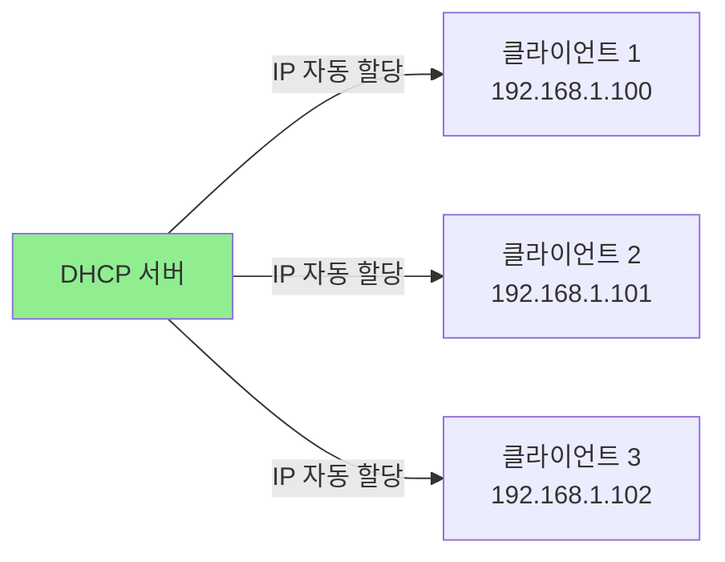
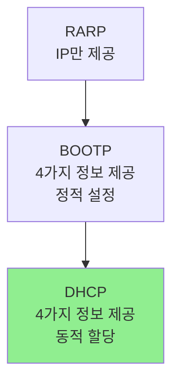
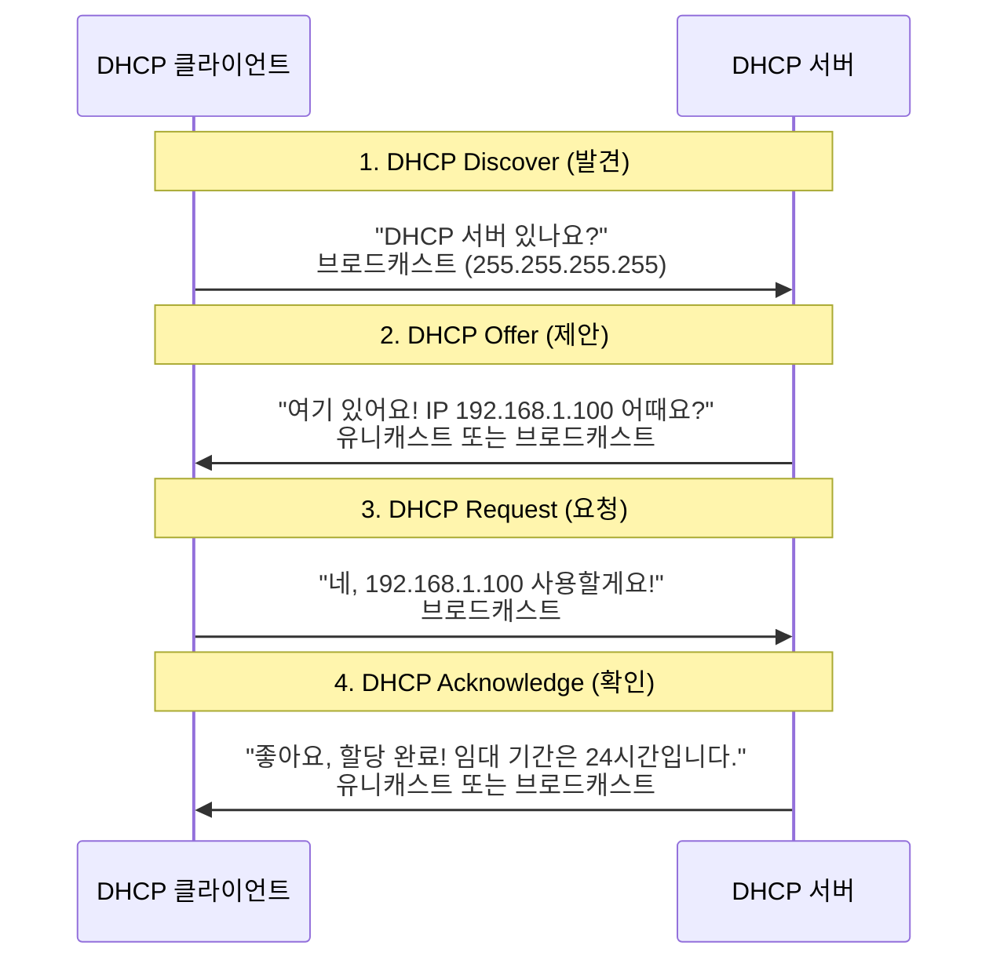
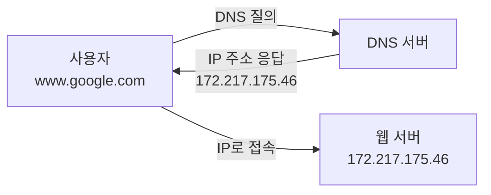
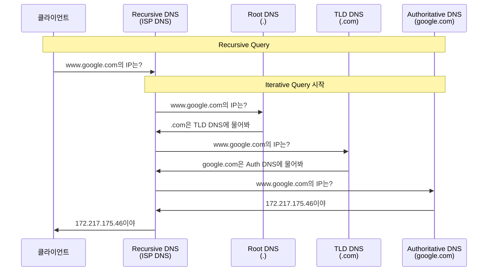
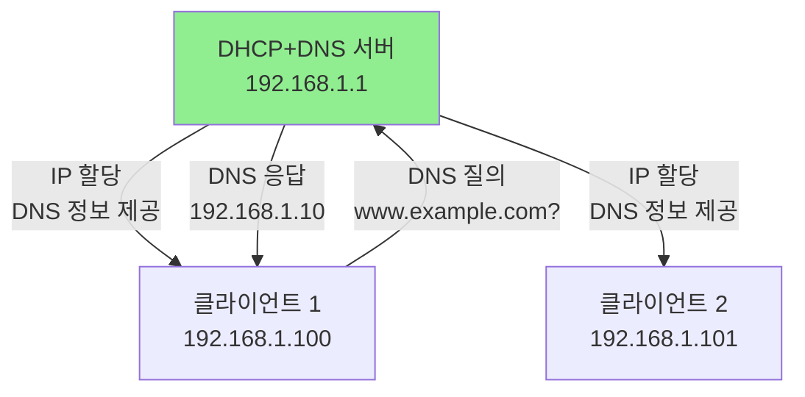

## 전체 흐름 요약

이번 Part 15에서는 네트워크 인프라의 핵심 서비스인 DHCP와 DNS 서버를 학습합니다.

먼저 **DHCP (Dynamic Host Configuration Protocol)**를 배웁니다. DHCP는 네트워크에 연결된 장치에 IP 주소, 서브넷 마스크, 게이트웨이, DNS 서버 주소 등을 자동으로 할당하는 프로토콜입니다. RARP와 BOOTP의 한계를 극복하고 등장했으며, UDP 67/68 포트를 사용합니다. DHCP 4단계 과정(DORA: Discover, Offer, Request, Acknowledge)을 이해하고, DHCP 서버를 구축하여 동적 IP 할당과 고정 IP 예약 설정을 실습합니다.

다음으로 **DNS (Domain Name System)**를 학습합니다. DNS는 사람이 읽을 수 있는 도메인 이름(예: www.google.com)을 컴퓨터가 이해할 수 있는 IP 주소(예: 172.217.175.46)로 변환하는 시스템입니다. Recursive Query(재귀적 질의)와 Iterative Query(반복적 질의)의 차이를 이해하고, BIND(Berkeley Internet Name Domain)를 설치하여 DNS 서버를 구축합니다. Forward Zone과 Reverse Zone 파일을 작성하고, A, NS, PTR, CNAME, MX 등 다양한 DNS 레코드 타입을 학습합니다.

마지막으로 **DHCP와 DNS를 연동**하여 실전 네트워크 인프라를 구축합니다. DHCP 서버가 클라이언트에게 IP 주소를 할당하면서 DNS 서버 정보도 함께 제공하여, 클라이언트가 도메인 이름으로 네트워크 리소스에 접근할 수 있도록 설정합니다.

---

## 1. DHCP (Dynamic Host Configuration Protocol)

### 1.1 DHCP 개념

**DHCP**는 네트워크에 연결된 장치에 IP 주소 및 네트워크 설정을 자동으로 할당하는 프로토콜입니다.

#### DHCP가 제공하는 네트워크 설정 (4가지)

1. **IP 주소**: 클라이언트의 고유한 IP 주소
2. **서브넷 마스크**: 네트워크 범위 정의
3. **게이트웨이 주소**: 외부 네트워크 접속을 위한 라우터 주소
4. **DNS 서버 주소**: 도메인 이름 해석을 위한 DNS 서버



#### DHCP의 특징

- **자동 설정**: 수동 IP 설정 불필요
- **중앙 관리**: DHCP 서버에서 IP 풀 관리
- **IP 재사용**: 임대 기간(Lease Time) 만료 후 IP 회수
- **프로토콜**: UDP 사용 (서버 67번 포트, 클라이언트 68번 포트)

### 1.2 DHCP의 역사

#### RARP (Reverse ARP)

- **문제점**: IP 주소만 제공하고, 서브넷 마스크, 게이트웨이, DNS 서버 정보는 제공하지 못함
- **현재**: 사용되지 않음

#### BOOTP (Bootstrap Protocol)

- **특징**: RARP의 단점을 극복하기 위해 등장
- **한계**: **정적 설정 프로토콜** (각 클라이언트마다 수동 설정 필요)
- **현재**: DHCP로 대체됨

#### DHCP (Dynamic Host Configuration Protocol)

- **특징**: BOOTP의 기능을 이어받아 **동적 할당** 추가
- **호환성**: BOOTP와 호환됨 (DHCP의 동적인 측면 제외하면 BOOTP에도 모두 적용 가능)
- **프로토콜**: UDP 사용, 출발지 포트 68번, 목적지 포트 67번



### 1.3 DHCP 4단계 (DORA 프로세스)

DHCP는 4단계 과정을 거쳐 IP 주소를 할당합니다: **DORA**



#### 1) DHCP Discover (발견)

- **클라이언트 → 서버**: 브로드캐스트 (255.255.255.255)
- **내용**: "DHCP 서버 있나요? IP 주소 필요해요!"
- **출발지 IP**: 0.0.0.0 (아직 IP가 없음)
- **목적지 IP**: 255.255.255.255 (모든 호스트)

#### 2) DHCP Offer (제안)

- **서버 → 클라이언트**: 유니캐스트 또는 브로드캐스트
- **내용**: "여기 DHCP 서버입니다. IP 192.168.1.100 어떠세요?"
- **포함 정보**: IP 주소, 서브넷 마스크, 게이트웨이, DNS 서버, 임대 기간

#### 3) DHCP Request (요청)

- **클라이언트 → 서버**: 브로드캐스트
- **내용**: "네, 192.168.1.100을 사용하겠습니다!"
- **이유**: 여러 DHCP 서버가 응답할 수 있으므로, 선택한 서버를 다른 서버들에게 알림

#### 4) DHCP Acknowledge (확인)

- **서버 → 클라이언트**: 유니캐스트 또는 브로드캐스트
- **내용**: "좋습니다! IP 할당 완료. 임대 기간은 24시간입니다."
- **클라이언트**: 이제 네트워크 사용 가능

### 1.4 DHCP 서버 설치 (데비안/우분투)

```bash
# 1. 패키지 업데이트
sudo apt-get update

# 2. ISC DHCP 서버 설치
sudo apt-get install -y isc-dhcp-server

# 3. 상태 확인
sudo systemctl status isc-dhcp-server

# 4. 부팅 시 자동 시작
sudo systemctl enable isc-dhcp-server
```

### 1.5 DHCP 서버 설치 (CentOS/RHEL)

```bash
# 1. DHCP 서버 설치
sudo yum install -y dhcp

# 2. 상태 확인
sudo systemctl status dhcpd

# 3. 부팅 시 자동 시작
sudo systemctl enable dhcpd
```

### 1.6 DHCP 서버 설정 전 준비

#### DHCP 서버에 고정 IP 설정

DHCP 서버는 반드시 고정 IP를 가져야 합니다.

**데비안/우분투 (Netplan):**

```bash
# Netplan 설정 파일 편집
sudo vi /etc/netplan/01-netcfg.yaml

# 다음과 같이 설정:
network:
  version: 2
  renderer: networkd
  ethernets:
    eth0:
      dhcp4: no
      addresses:
        - 192.168.1.1/24
      gateway4: 192.168.1.254
      nameservers:
        addresses: [8.8.8.8, 8.8.4.4]

# 적용
sudo netplan apply
```

**CentOS/RHEL:**

```bash
# 네트워크 인터페이스 설정 파일 편집
sudo vi /etc/sysconfig/network-scripts/ifcfg-ens33

# 다음과 같이 수정:
DEVICE=ens33
BOOTPROTO=static           # static으로 변경
ONBOOT=yes
IPADDR=192.168.1.1         # DHCP 서버 IP
NETMASK=255.255.255.0
GATEWAY=192.168.1.254
DNS1=8.8.8.8
DNS2=8.8.4.4

# 네트워크 재시작
sudo systemctl restart network

# 확인
ip addr show ens33
```

#### VMware DHCP 기능 비활성화 (중요!)

VMware Workstation/Fusion 사용 시 **VMware의 내장 DHCP 기능을 반드시 비활성화**해야 충돌을 방지할 수 있습니다.

```
1. VMware Workstation → Edit → Virtual Network Editor
2. 사용 중인 네트워크 (예: VMnet8) 선택
3. "Use local DHCP service" 체크 해제
4. Apply 클릭
```

### 1.7 DHCP 서버 설정 파일

#### 데비안/우분투

```bash
# 1. DHCP 설정 파일 편집
sudo vi /etc/dhcp/dhcpd.conf

# 기본 설정:

# 도메인 이름
option domain-name "example.com";

# DNS 서버 주소
option domain-name-servers 8.8.8.8, 8.8.4.4;

# 기본 임대 시간 (초 단위, 86400초 = 24시간)
default-lease-time 86400;

# 최대 임대 시간 (초 단위, 604800초 = 7일)
max-lease-time 604800;

# DHCP 서버가 네트워크의 공식 서버임을 선언
authoritative;

# 로그 파일 위치
log-facility local7;

# 서브넷 설정
subnet 192.168.1.0 netmask 255.255.255.0 {
    # IP 할당 범위
    range 192.168.1.100 192.168.1.200;
    
    # 게이트웨이
    option routers 192.168.1.1;
    
    # 브로드캐스트 주소
    option broadcast-address 192.168.1.255;
    
    # DNS 서버
    option domain-name-servers 8.8.8.8, 8.8.4.4;
}

# 2. DHCP 서버가 사용할 네트워크 인터페이스 지정
sudo vi /etc/default/isc-dhcp-server

# 다음과 같이 수정:
INTERFACESv4="eth0"

# 3. Lease 파일 존재 확인 (없으면 생성)
sudo touch /var/lib/dhcp/dhcpd.leases

# 4. DHCP 서버 재시작
sudo systemctl restart isc-dhcp-server

# 5. 상태 확인
sudo systemctl status isc-dhcp-server

# 6. 방화벽 설정 (UFW)
sudo ufw allow 67/udp
sudo ufw allow 68/udp
```

#### CentOS/RHEL

```bash
# 1. DHCP 설정 파일 편집
sudo vi /etc/dhcp/dhcpd.conf

# 다음 내용 작성:

# 도메인 이름
option domain-name "example.com";

# DNS 서버
option domain-name-servers 8.8.8.8, 8.8.4.4;

# 기본 임대 시간 (86400초 = 24시간)
default-lease-time 86400;

# 최대 임대 시간 (604800초 = 7일)
max-lease-time 604800;

# 권한 있는 서버
authoritative;

# 로그 설정
log-facility local7;

# 서브넷 설정
subnet 192.168.1.0 netmask 255.255.255.0 {
    range 192.168.1.100 192.168.1.200;
    option routers 192.168.1.1;
    option broadcast-address 192.168.1.255;
    option domain-name-servers 8.8.8.8, 8.8.4.4;
}

# 2. Lease 파일 확인 (없으면 생성)
ls -l /var/lib/dhcpd/dhcpd.leases
# 없으면:
sudo touch /var/lib/dhcpd/dhcpd.leases

# 3. DHCP 서버 재시작
sudo systemctl restart dhcpd
sudo systemctl enable dhcpd

# 4. 상태 확인
sudo systemctl status dhcpd

# 5. 방화벽 설정
sudo firewall-cmd --add-service=dhcp --permanent
# 또는
sudo firewall-cmd --add-port=67/udp --permanent
sudo firewall-cmd --add-port=68/udp --permanent

sudo firewall-cmd --reload
sudo firewall-cmd --list-all
```

### 1.8 DHCP 고정 IP 할당 (MAC 주소 기반)

특정 장치에 항상 같은 IP를 할당하려면 MAC 주소를 기반으로 예약할 수 있습니다.

```bash
# dhcpd.conf 파일에 추가
sudo vi /etc/dhcp/dhcpd.conf

# 서브넷 설정 아래에 추가:

# 고정 IP 할당 - 프린터
host printer {
    hardware ethernet 00:11:22:33:44:55;
    fixed-address 192.168.1.10;
}

# 고정 IP 할당 - 서버
host fileserver {
    hardware ethernet AA:BB:CC:DD:EE:FF;
    fixed-address 192.168.1.20;
    option host-name "fileserver.example.com";
}

# DHCP 서버 재시작
sudo systemctl restart dhcpd
# 또는 (데비안/우분투)
sudo systemctl restart isc-dhcp-server
```

**MAC 주소 확인 방법:**

```bash
# Linux
ip link show
# 또는
ifconfig

# Windows
ipconfig /all

# 출력 예시:
# ether 00:11:22:33:44:55
```

### 1.9 DHCP 클라이언트 설정

#### 데비안/우분투 (Netplan)

```bash
# Netplan 설정 파일 편집
sudo vi /etc/netplan/01-netcfg.yaml

# DHCP 활성화:
network:
  version: 2
  renderer: networkd
  ethernets:
    eth0:
      dhcp4: yes

# 적용
sudo netplan apply

# IP 확인
ip addr show eth0
```

#### CentOS/RHEL

```bash
# 네트워크 인터페이스 설정
sudo vi /etc/sysconfig/network-scripts/ifcfg-ens33

# DHCP 활성화:
DEVICE=ens33
BOOTPROTO=dhcp           # dhcp로 변경
ONBOOT=yes

# 네트워크 재시작
sudo systemctl restart network

# IP 재할당 (강제)
sudo dhclient -r         # 현재 IP 반납
sudo dhclient            # 새 IP 요청

# IP 확인
ip addr show ens33
```

### 1.10 DHCP Lease 확인

#### DHCP 서버에서 Lease 확인

```bash
# 데비안/우분투
sudo cat /var/lib/dhcp/dhcpd.leases

# CentOS/RHEL
sudo cat /var/lib/dhcpd/dhcpd.leases

# 출력 예시:
# lease 192.168.1.100 {
#   starts 4 2025/01/15 10:30:00;
#   ends 5 2025/01/16 10:30:00;
#   cltt 4 2025/01/15 10:30:00;
#   binding state active;
#   next binding state free;
#   hardware ethernet 00:0c:29:12:34:56;
#   client-hostname "client1";
# }
```

#### 클라이언트에서 Lease 확인

```bash
# Linux
cat /var/lib/dhcp/dhclient.leases
# 또는
cat /var/lib/dhclient/dhclient.leases

# Windows
ipconfig /all
```

---

## 2. DNS (Domain Name System)

### 2.1 DNS 개념

**DNS (Domain Name System)**는 사람이 읽을 수 있는 도메인 이름을 컴퓨터가 이해할 수 있는 IP 주소로 변환하는 시스템입니다.



#### DNS의 역할

- **도메인 → IP 변환**: www.google.com → 172.217.175.46
- **IP → 도메인 변환**: 172.217.175.46 → www.google.com (역방향 조회)
- **메일 서버 정보**: MX 레코드로 메일 서버 위치 제공
- **서비스 위치**: SRV 레코드로 특정 서비스 위치 제공

### 2.2 DNS 동작 원리

#### Recursive Query (재귀적 질의)

클라이언트 PC에서 DNS 서버에 질의하는 과정입니다.

- **특징**: 클라이언트는 한 번만 질의하고, DNS 서버가 최종 답을 찾아서 제공
- **책임**: DNS 서버가 답을 찾을 책임

#### Iterative Query (반복적 질의)

Recursive DNS 서버가 Authoritative DNS 서버에 순차적으로 질의하는 과정입니다.

- **특징**: DNS 서버가 다른 DNS 서버들에게 반복적으로 질의
- **책임**: 각 DNS 서버는 자신이 아는 정보만 제공



### 2.3 DNS 레코드 타입

| 레코드 타입 | 설명 | 예시 |
|------------|------|------|
| **A** | 도메인 → IPv4 주소 | www.example.com → 192.168.1.100 |
| **AAAA** | 도메인 → IPv6 주소 | www.example.com → 2001:db8::1 |
| **NS** | 네임서버 지정 | example.com → ns1.example.com |
| **CNAME** | 별칭 (Canonical Name) | www → webserver.example.com |
| **MX** | 메일 서버 | example.com → mail.example.com |
| **PTR** | IP → 도메인 (역방향 조회) | 192.168.1.100 → www.example.com |
| **SOA** | 영역 권한 시작 (Start of Authority) | 영역 정보 및 권한 |
| **TXT** | 텍스트 정보 | SPF, DKIM 등 |

### 2.4 hosts 파일 (로컬 DNS)

DNS 서버에 질의하기 전에 먼저 확인하는 로컬 파일입니다.

```bash
# Linux (데비안/우분투 및 CentOS/RHEL)
sudo vi /etc/hosts

# 내용 예시:
127.0.0.1       localhost
127.0.1.1       mycomputer
192.168.1.100   webserver.example.com webserver
192.168.1.200   fileserver.example.com fileserver

# Windows
# C:\Windows\System32\drivers\etc\hosts
```

### 2.5 BIND (Berkeley Internet Name Domain)

**BIND**는 리눅스, 유닉스, macOS, 윈도우용 DNS 프로토콜을 구현한 오픈소스 소프트웨어 패키지입니다.

- **개발**: 인터넷 시스템 컨소시엄(ISC)
- **데몬**: `named` (Name Daemon)
- **설정 파일**: `/etc/named.conf` (CentOS), `/etc/bind/named.conf` (데비안)

### 2.6 BIND 설치 (데비안/우분투)

```bash
# 1. BIND9 설치
sudo apt-get update
sudo apt-get install -y bind9 bind9utils bind9-doc

# 2. 상태 확인
sudo systemctl status bind9

# 3. 부팅 시 자동 시작
sudo systemctl enable bind9
```

### 2.7 BIND 설치 (CentOS/RHEL)

```bash
# 1. BIND 설치
sudo yum install -y bind bind-utils

# 2. 상태 확인
sudo systemctl status named

# 3. 부팅 시 자동 시작
sudo systemctl enable named
```

### 2.8 DNS 서버 설정 (CentOS/RHEL 기준)

#### 1단계: DNS 환경 설정 (/etc/named.conf)

```bash
# named.conf 편집
sudo vi /etc/named.conf

# 주요 설정:

options {
    # DNS 서버가 수신할 포트
    listen-on port 53 { any; };          # 모든 인터페이스에서 수신
    listen-on-v6 port 53 { any; };
    
    # 작업 디렉토리
    directory "/var/named";
    
    # 쿼리를 허용할 네트워크
    allow-query { any; };                 # 모든 네트워크 허용
    
    # Zone 전송을 허용할 서버 (보조 DNS)
    allow-transfer { none; };             # 전송 차단 (보안)
    
    # 재귀 질의 허용
    recursion yes;
    
    # DNSSEC 검증
    dnssec-enable yes;
    dnssec-validation yes;
    
    # 로그 파일
    pid-file "/run/named/named.pid";
    session-keyfile "/run/named/session.key";
};

# 루트 DNS 서버 정보
zone "." IN {
    type hint;
    file "named.ca";
};

# localhost 정방향 Zone
zone "localhost" IN {
    type master;
    file "named.localhost";
    allow-update { none; };
};

# localhost 역방향 Zone
zone "0.0.127.in-addr.arpa" IN {
    type master;
    file "named.loopback";
    allow-update { none; };
};
```

#### 2단계: 영역 설정 (/etc/named.rfc1912.zones)

```bash
# Zone 파일 편집
sudo vi /etc/named.rfc1912.zones

# 끝에 다음 내용 추가:

# example.com 정방향 Zone
zone "example.com" IN {
    type master;
    file "example.com.zone";
    allow-update { none; };
};

# 역방향 Zone (192.168.1.0/24)
zone "1.168.192.in-addr.arpa" IN {
    type master;
    file "example.com.rev";
    allow-update { none; };
};
```

**역방향 도메인 형식:**
- IP: 192.168.1.50
- 역방향: `50.1.168.192.in-addr.arpa`
- Zone 파일에서는 네트워크 부분만: `1.168.192.in-addr.arpa`

#### 3단계: Zone 파일 생성

**정방향 Zone 파일 (example.com.zone):**

```bash
# Zone 파일 생성
sudo vi /var/named/example.com.zone

# 다음 내용 작성:

$TTL 86400
@   IN  SOA ns1.example.com. admin.example.com. (
        2025011501  ; Serial (YYYYMMDDnn)
        3600        ; Refresh (1 hour)
        1800        ; Retry (30 minutes)
        604800      ; Expire (1 week)
        86400 )     ; Minimum TTL (1 day)

; 네임서버 레코드
@       IN  NS      ns1.example.com.

; A 레코드 (도메인 → IP)
ns1     IN  A       192.168.1.1
www     IN  A       192.168.1.10
ftp     IN  A       192.168.1.20
mail    IN  A       192.168.1.30

; MX 레코드 (메일 서버)
@       IN  MX  10  mail.example.com.

; CNAME 레코드 (별칭)
webserver   IN  CNAME   www.example.com.
```

**역방향 Zone 파일 (example.com.rev):**

```bash
# 역방향 Zone 파일 생성
sudo vi /var/named/example.com.rev

# 다음 내용 작성:

$TTL 86400
@   IN  SOA ns1.example.com. admin.example.com. (
        2025011501  ; Serial
        3600        ; Refresh
        1800        ; Retry
        604800      ; Expire
        86400 )     ; Minimum TTL

; 네임서버
@       IN  NS      ns1.example.com.

; PTR 레코드 (IP → 도메인)
1       IN  PTR     ns1.example.com.
10      IN  PTR     www.example.com.
20      IN  PTR     ftp.example.com.
30      IN  PTR     mail.example.com.
```

**Zone 파일 설명:**

- **$TTL**: Time To Live, 레코드가 캐시에 유지되는 시간 (초 단위)
- **SOA**: Start of Authority, 영역의 권한 정보
  - `ns1.example.com.`: 주 네임서버 (끝에 점 필수)
  - `admin.example.com.`: 관리자 이메일 (admin@example.com)
  - `Serial`: 버전 번호, Zone 파일 수정 시 증가시켜야 함
- **NS**: Name Server, 네임서버 지정
- **A**: Address, 도메인을 IPv4 주소로 매핑
- **PTR**: Pointer, IP 주소를 도메인으로 매핑 (역방향 조회)
- **MX**: Mail eXchange, 메일 서버 지정 (숫자는 우선순위)
- **CNAME**: Canonical Name, 별칭

#### 4단계: 소유자 및 권한 변경

```bash
# Zone 파일 소유자 변경
sudo chown named:named /var/named/example.com.*

# 권한 변경
sudo chmod 660 /var/named/example.com.*
```

#### 5단계: 설정 파일 문법 검사

```bash
# named.conf 문법 검사
sudo named-checkconf /etc/named.conf

# Zone 파일 문법 검사 (정방향)
sudo named-checkzone example.com /var/named/example.com.zone

# 출력 예시:
# zone example.com/IN: loaded serial 2025011501
# OK

# Zone 파일 문법 검사 (역방향)
sudo named-checkzone 1.168.192.in-addr.arpa /var/named/example.com.rev

# 출력 예시:
# zone 1.168.192.in-addr.arpa/IN: loaded serial 2025011501
# OK
```

#### 6단계: named 데몬 재시작

```bash
# named 재시작
sudo systemctl restart named

# 상태 확인
sudo systemctl status named

# 로그 확인 (문제 발생 시)
sudo journalctl -xe -u named
sudo tail -f /var/log/messages
```

#### 7단계: 방화벽 설정

```bash
# CentOS/RHEL
sudo firewall-cmd --add-service=dns --permanent
# 또는
sudo firewall-cmd --add-port=53/tcp --permanent
sudo firewall-cmd --add-port=53/udp --permanent

sudo firewall-cmd --reload
sudo firewall-cmd --list-all
```

### 2.9 DNS 서버 설정 (데비안/우분투)

데비안/우분투는 설정 파일 경로가 다릅니다.

```bash
# 1. 메인 설정 파일
sudo vi /etc/bind/named.conf.options

# 주요 설정:
options {
    directory "/var/cache/bind";
    
    allow-query { any; };
    recursion yes;
    
    listen-on { any; };
    listen-on-v6 { any; };
    
    dnssec-validation auto;
};

# 2. Zone 설정
sudo vi /etc/bind/named.conf.local

# 다음 내용 추가:
zone "example.com" {
    type master;
    file "/etc/bind/zones/example.com.zone";
};

zone "1.168.192.in-addr.arpa" {
    type master;
    file "/etc/bind/zones/example.com.rev";
};

# 3. Zone 파일 디렉토리 생성
sudo mkdir /etc/bind/zones

# 4. Zone 파일 생성 (CentOS와 동일한 내용)
sudo vi /etc/bind/zones/example.com.zone
sudo vi /etc/bind/zones/example.com.rev

# 5. 권한 설정
sudo chown bind:bind /etc/bind/zones/*
sudo chmod 644 /etc/bind/zones/*

# 6. 문법 검사
sudo named-checkconf
sudo named-checkzone example.com /etc/bind/zones/example.com.zone

# 7. BIND 재시작
sudo systemctl restart bind9

# 8. 방화벽 설정
sudo ufw allow 53/tcp
sudo ufw allow 53/udp
```

### 2.10 DNS 클라이언트 설정

DNS 서버를 사용하도록 클라이언트를 설정합니다.

#### 데비안/우분투

```bash
# /etc/resolv.conf 편집
sudo vi /etc/resolv.conf

# 다음 내용 작성:
nameserver 192.168.1.1       # 자신의 DNS 서버
nameserver 8.8.8.8           # 백업 DNS
search example.com

# Netplan 사용 시 (영구 설정)
sudo vi /etc/netplan/01-netcfg.yaml

network:
  version: 2
  ethernets:
    eth0:
      dhcp4: no
      addresses: [192.168.1.100/24]
      gateway4: 192.168.1.1
      nameservers:
        addresses: [192.168.1.1, 8.8.8.8]
        search: [example.com]

sudo netplan apply
```

#### CentOS/RHEL

```bash
# /etc/resolv.conf 편집
sudo vi /etc/resolv.conf

nameserver 192.168.1.1
nameserver 8.8.8.8
search example.com

# 또는 네트워크 인터페이스 설정 파일에서
sudo vi /etc/sysconfig/network-scripts/ifcfg-ens33

DNS1=192.168.1.1
DNS2=8.8.8.8

sudo systemctl restart network
```

### 2.11 DNS 테스트 명령어

#### nslookup

```bash
# 기본 사용법
nslookup www.example.com

# 출력 예시:
# Server:         192.168.1.1
# Address:        192.168.1.1#53
# 
# Name:   www.example.com
# Address: 192.168.1.10

# 특정 DNS 서버 지정
nslookup www.example.com 192.168.1.1

# 역방향 조회
nslookup 192.168.1.10

# 대화형 모드
nslookup
> server 192.168.1.1
> set type=NS
> example.com
> set type=A
> www.example.com
> exit
```

#### dig (Domain Information Groper)

```bash
# 기본 사용법
dig www.example.com

# 특정 DNS 서버 지정
dig @192.168.1.1 www.example.com

# 특정 레코드 타입 조회
dig www.example.com A        # A 레코드
dig example.com NS           # NS 레코드
dig example.com MX           # MX 레코드

# 짧은 출력
dig www.example.com +short

# 역방향 조회
dig -x 192.168.1.10

# Iterative Query 테스트
dig @ns1.google.com www.google.com +norecurse

# DNS 서버 버전 확인
dig @192.168.1.1 chaos version.bind txt +short
```

#### host

```bash
# 기본 사용법
host www.example.com

# 역방향 조회
host 192.168.1.10

# 특정 레코드 타입
host -t MX example.com
host -t NS example.com
```

---

## 3. DHCP & DNS 연동 실습

### 3.1 통합 네트워크 인프라 구축

DHCP 서버가 클라이언트에게 IP 주소를 할당하면서 자체 DNS 서버 정보도 함께 제공합니다.



### 3.2 DHCP 설정에 DNS 정보 추가

```bash
# DHCP 설정 파일 편집
sudo vi /etc/dhcp/dhcpd.conf

# DNS 서버를 자신(192.168.1.1)으로 설정
option domain-name "example.com";
option domain-name-servers 192.168.1.1;

default-lease-time 86400;
max-lease-time 604800;

authoritative;

subnet 192.168.1.0 netmask 255.255.255.0 {
    range 192.168.1.100 192.168.1.200;
    option routers 192.168.1.1;
    option broadcast-address 192.168.1.255;
    option domain-name-servers 192.168.1.1;    # 자신을 DNS 서버로
    option domain-name "example.com";
}

# DHCP 재시작
sudo systemctl restart dhcpd
```

### 3.3 클라이언트 테스트

```bash
# 1. 클라이언트에서 IP 재할당
sudo dhclient -r
sudo dhclient

# 2. 네트워크 설정 확인
cat /etc/resolv.conf

# 출력 예시:
# nameserver 192.168.1.1
# search example.com

# 3. DNS 테스트
nslookup www.example.com

# 출력 예시:
# Server:         192.168.1.1
# Address:        192.168.1.1#53
# 
# Name:   www.example.com
# Address: 192.168.1.10

# 4. 실제 접속 테스트 (www 서버가 있을 경우)
ping www.example.com
```

---

## 주요 개념 요약표

| 구분 | 주요 개념 | 설명 |
|------|----------|------|
| **DHCP** | 개념 | 네트워크 설정 자동 할당 프로토콜 |
| | 포트 | UDP 67 (서버), 68 (클라이언트) |
| | DORA | Discover, Offer, Request, Acknowledge |
| | 할당 정보 | IP, 서브넷, 게이트웨이, DNS |
| | 데비안 패키지 | isc-dhcp-server |
| | CentOS 패키지 | dhcp |
| | 설정 파일 | /etc/dhcp/dhcpd.conf |
| | Lease 파일 | /var/lib/dhcp(d)/dhcpd.leases |
| **DNS** | 개념 | 도메인 이름 → IP 주소 변환 |
| | 포트 | 53/tcp, 53/udp |
| | Recursive Query | 클라이언트 → DNS 서버 |
| | Iterative Query | DNS 서버 간 반복 질의 |
| | BIND | 오픈소스 DNS 서버 소프트웨어 |
| | 데몬 | named |
| | 설정 파일 (CentOS) | /etc/named.conf |
| | 설정 파일 (데비안) | /etc/bind/named.conf |
| | Zone 파일 | /var/named/ (CentOS), /etc/bind/zones/ (데비안) |
| **DNS 레코드** | A | 도메인 → IPv4 |
| | NS | 네임서버 지정 |
| | PTR | IP → 도메인 (역방향) |
| | CNAME | 별칭 |
| | MX | 메일 서버 |
| | SOA | 영역 권한 시작 |
| **DNS 도구** | nslookup | 기본 DNS 조회 |
| | dig | 상세 DNS 조회 |
| | host | 간단한 DNS 조회 |
| | named-checkconf | 설정 파일 문법 검사 |
| | named-checkzone | Zone 파일 문법 검사 |

---

## 데비안(Debian/Ubuntu) vs CentOS 차이점

### DHCP 서버

| 항목 | Debian/Ubuntu | CentOS/RHEL |
|------|---------------|-------------|
| 패키지 | **isc-dhcp-server** | **dhcp** |
| 설치 | `apt-get install isc-dhcp-server` | `yum install dhcp` |
| 서비스명 | **isc-dhcp-server** | **dhcpd** |
| 설정 파일 | `/etc/dhcp/dhcpd.conf` | `/etc/dhcp/dhcpd.conf` |
| 인터페이스 지정 | `/etc/default/isc-dhcp-server` | 자동 감지 |
| Lease 파일 | `/var/lib/dhcp/dhcpd.leases` | `/var/lib/dhcpd/dhcpd.leases` |
| 재시작 | `systemctl restart isc-dhcp-server` | `systemctl restart dhcpd` |
| 방화벽 | `ufw allow 67/udp` | `firewall-cmd --add-service=dhcp` |

### DNS 서버 (BIND)

| 항목 | Debian/Ubuntu | CentOS/RHEL |
|------|---------------|-------------|
| 패키지 | **bind9** | **bind** |
| 설치 | `apt-get install bind9` | `yum install bind` |
| 서비스명 | **bind9** | **named** |
| 메인 설정 | `/etc/bind/named.conf` | `/etc/named.conf` |
| Zone 설정 | `/etc/bind/named.conf.local` | `/etc/named.rfc1912.zones` |
| Zone 파일 경로 | `/etc/bind/zones/` | `/var/named/` |
| 재시작 | `systemctl restart bind9` | `systemctl restart named` |
| 방화벽 | `ufw allow 53` | `firewall-cmd --add-service=dns` |

---

## 마무리

이번 Part 15에서는 네트워크 인프라의 핵심 서비스인 DHCP와 DNS 서버를 학습했습니다.

**DHCP**를 통해 클라이언트에게 IP 주소, 서브넷 마스크, 게이트웨이, DNS 서버 정보를 자동으로 할당하여 네트워크 관리를 효율화할 수 있습니다. DORA 4단계 과정(Discover, Offer, Request, Acknowledge)을 이해하고, 동적 IP 할당과 MAC 주소 기반 고정 IP 예약을 실습했습니다.

**DNS**를 통해 도메인 이름을 IP 주소로 변환하여 사용자가 쉽게 네트워크 리소스에 접근할 수 있도록 했습니다. BIND를 설치하고 Forward Zone과 Reverse Zone을 설정하여 정방향/역방향 조회를 모두 지원하는 DNS 서버를 구축했습니다. A, NS, PTR, CNAME, MX 등 다양한 DNS 레코드 타입을 학습하고 실제 Zone 파일에 적용했습니다.

**DHCP와 DNS를 연동**하여 통합 네트워크 인프라를 구축하는 실습을 통해, 실무에서 네트워크 서비스를 어떻게 통합 관리하는지 이해할 수 있었습니다. 클라이언트가 네트워크에 연결하면 자동으로 IP를 받고, 내부 DNS 서버를 통해 도메인 이름으로 리소스에 접근할 수 있는 완전한 네트워크 환경을 완성했습니다.