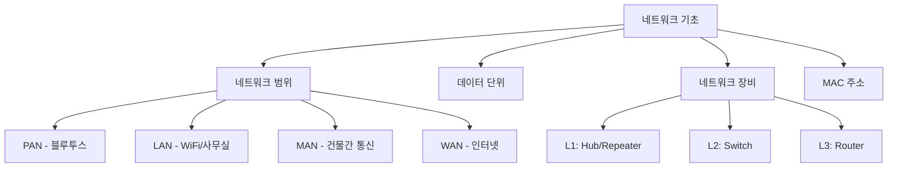
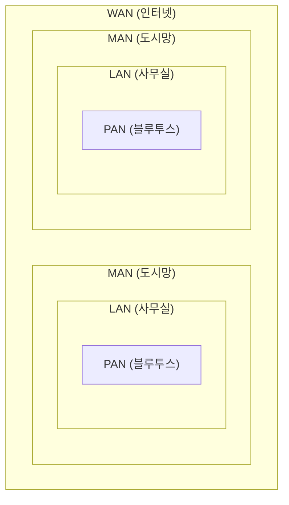
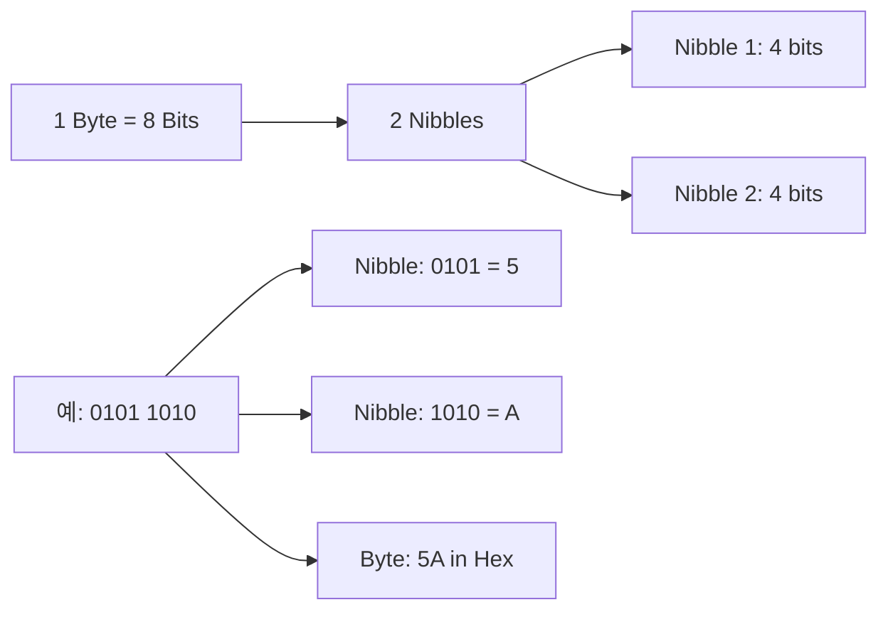
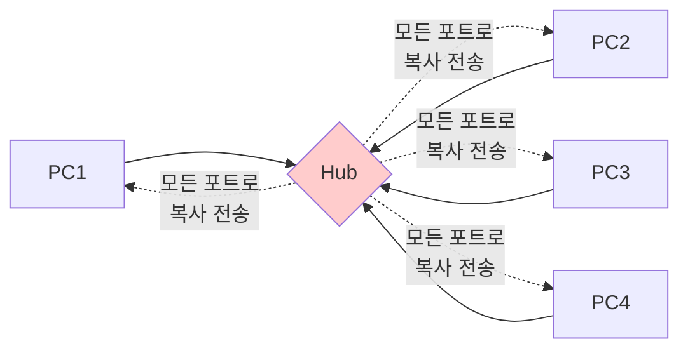
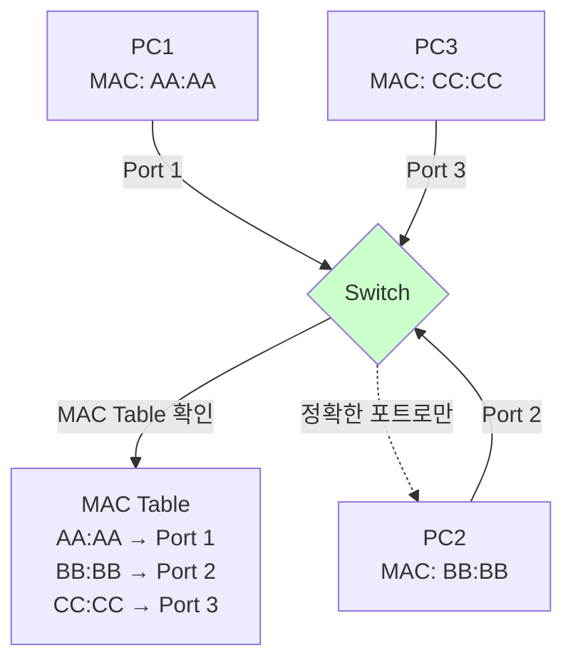
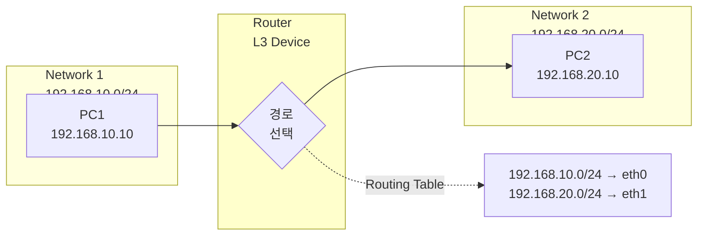
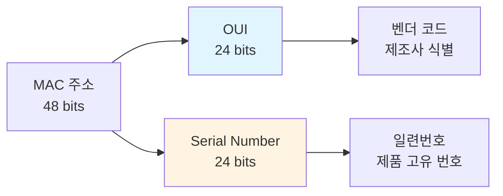
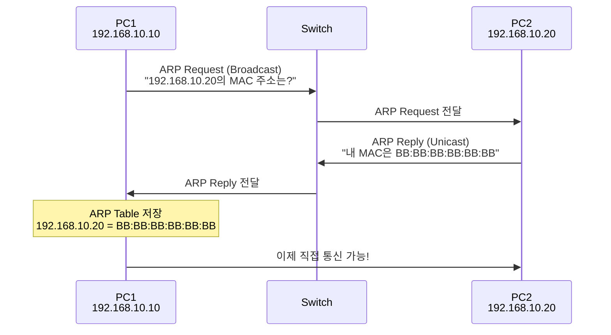
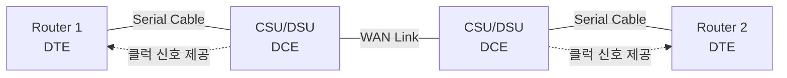
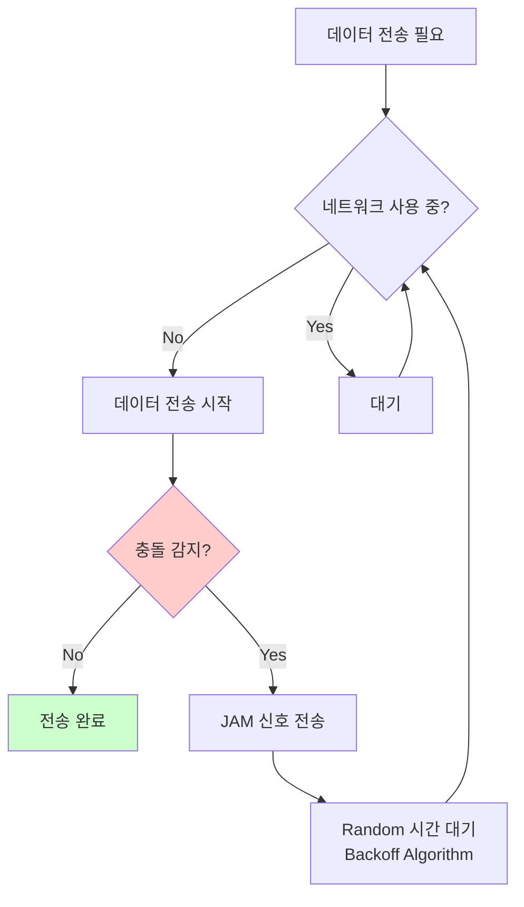

# Part 1: 네트워크 기초 종합
## 전체 흐름 요약

이 문서에서는 네트워크의 기본 개념부터 실무에서 자주 사용하는 용어들을 다룹니다. 네트워크의 범위(PAN/LAN/MAN/WAN), 데이터 전송 단위(bit, byte), 네트워크 장비의 계층별 역할, 그리고 물리적 주소인 MAC 주소의 구조까지 학습합니다.



---

## 1. 네트워크 범위의 이해

### 1.1 네트워크 분류

네트워크는 통신 거리에 따라 4가지로 분류됩니다.

| 구분 | 영문 | 범위 | 주요 기술 | 실무 예시 |
|------|------|------|-----------|-----------|
| **PAN** | Personal Area Network | 개인(~10m) | Bluetooth, IrDA | 스마트폰-이어폰 연결 |
| **LAN** | Local Area Network | 근거리(~150m) | Ethernet, WiFi | 사무실 네트워크 |
| **MAN** | Metropolitan Area Network | 중거리(~50km) | WiMAX, 광케이블 | 건물간 전용선 |
| **WAN** | Wide Area Network | 원거리(국가간) | 인터넷, MPLS | ISP 네트워크 |



### 1.2 LAN의 특징

LAN(Local Area Network)은 가장 흔히 접하는 네트워크 형태입니다.

**주요 특징:**
- **범위:** 사무실, 학교, 가정 등 제한된 공간
- **속도:** 100Mbps ~ 10Gbps (매우 빠름)
- **소유:** 조직이나 개인이 직접 소유/관리
- **비용:** 초기 투자 후 유지비 저렴
- **프로토콜:** Ethernet, Token Ring, FDDI

**실무 시나리오:**
회사에서 50명의 직원이 사용하는 네트워크를 구축한다면, 스위치를 중심으로 각 PC를 UTP 케이블로 연결하는 LAN을 구성합니다.

### 1.3 WAN의 특징

WAN(Wide Area Network)은 먼 거리를 연결하는 네트워크입니다.

**주요 특징:**
- **범위:** 국가, 대륙간 연결 (인터넷이 대표적)
- **속도:** 56Kbps ~ 수백 Mbps (상대적으로 느림)
- **관리:** ISP(Internet Service Provider) 업체가 관리
  - 한국: KT, SKT, LG U+
- **비용:** 초기 투자 적지만 월 유지비 높음
- **프로토콜:** PPP, HDLC, Frame Relay, ATM

**실무 시나리오:**
서울 본사와 부산 지사를 연결하려면 통신사(ISP)의 전용선을 사용하여 WAN을 구성합니다.

---

## 2. 컴퓨터의 데이터 표현 단위

### 2.1 기본 단위

컴퓨터는 모든 데이터를 2진수(0과 1)로 처리합니다.

| 단위 | 설명 | 크기 | 예시 |
|------|------|------|------|
| **Bit** | Binary Digit, 최소 단위 | 0 또는 1 | 전기신호 On(1)/Off(0) |
| **Nibble** | 반 바이트 | 4 bits | 16진수 한 자리 (0~F) |
| **Byte** | 기본 처리 단위 | 8 bits | ASCII 문자 1개 ('A' = 65) |
| **Word** | CPU 처리 단위 | CPU마다 다름 | 32bit/64bit CPU |



### 2.2 진수 변환 예제

네트워크에서는 IP 주소와 MAC 주소를 다루기 위해 진수 변환이 필수입니다.

**10진수 44를 다양한 진수로 변환:**

| 진법 | 변환 과정 | 결과 |
|------|-----------|------|
| **2진수** | 44 = 32 + 8 + 4 = 2⁵ + 2³ + 2² | `101100` |
| **8진수** | 2진수를 3자리씩 묶음: `101 100` | `54` (5×8¹ + 4×8⁰) |
| **16진수** | 2진수를 4자리씩 묶음: `0010 1100` | `2C` (2×16¹ + 12×16⁰) |

```
10진수: 44
     ↓
2진수: 128  64  32  16   8   4   2   1
        0   0   1   0   1   1   0   0
     ↓
8진수: 오른쪽에서 3자리씩 묶기
       101 | 100
        5     4  → 54
     ↓
16진수: 오른쪽에서 4자리씩 묶기
        0010 | 1100
         2      C  → 2C
```

**실무 팁:**
- IP 주소는 10진수로 표현: `192.168.10.1`
- MAC 주소는 16진수로 표현: `00-0C-29-65-3A-4E`
- 서브넷 마스크 계산 시 2진수 변환 필수

---

## 3. 대역폭과 처리량

### 3.1 핵심 개념

네트워크 성능을 이해하기 위한 3가지 용어입니다.

| 용어 | 영문 | 단위 | 설명 |
|------|------|------|------|
| **대역폭** | Bandwidth | bps (bits per second) | 1초당 **최대** 전송 가능한 비트 수 |
| **처리량** | Throughput | bps | 1초당 **실제** 처리되는 비트 수 |
| **데이터 처리량** | Goodput | bps | 응용 프로그램에서 **사용 가능한** 비트 수 |


### 3.2 실무 예제

**시나리오:** 100Mbps 인터넷 회선을 사용하는 경우

```
Bandwidth (대역폭):     100 Mbps (광고 속도)
        ↓
    네트워크 혼잡, 지연 발생
        ↓
Throughput (처리량):    85 Mbps (실제 측정 속도)
        ↓
    TCP/IP 헤더 제거 (약 5~10%)
        ↓
Goodput (데이터 처리량): 75 Mbps (파일 다운로드 속도)
```

**왜 광고 속도보다 느릴까?**
1. 네트워크 혼잡 (다른 사용자의 트래픽)
2. 프로토콜 오버헤드 (TCP/IP 헤더)
3. 재전송 (패킷 손실 시)
4. 라우터/스위치 처리 지연

---

## 4. 네트워크 장비의 계층별 역할

OSI 7계층 모델에서 각 계층별로 동작하는 장비들이 있습니다.

### 4.1 L1 장비: Physical Layer

**Hub (허브)**
- 전기 신호를 모든 포트로 복사해서 전송 (Broadcasting)
- MAC 주소를 이해하지 못함
- 충돌 도메인(Collision Domain)이 커짐
- **보안 취약:** 모든 PC가 다른 PC의 데이터를 볼 수 있음 (Sniffing 가능)

**Repeater (리피터)**
- 약해진 전기 신호를 증폭
- 전송 거리 연장 목적



### 4.2 L2 장비: Data Link Layer

**Switch (스위치)**
- MAC 주소를 학습하여 **정확한 포트로만** 전송
- 충돌 도메인을 **포트별로 분리**
- MAC Address Table 유지 (300초 갱신)
- 보안 향상 (Unicast 통신)

**Bridge (브리지)**
- 스위치와 유사하지만 포트 수가 적음 (보통 2~4개)
- 네트워크를 여러 세그먼트로 분할



### 4.3 L3 장비: Network Layer

**Router (라우터)**
- IP 주소를 기반으로 **최적 경로** 선택
- 브로드캐스트 도메인 분리 (네트워크 분할)
- 2가지 핵심 기능:
  1. **Routing:** 최적 경로 계산
  2. **Packet Switching:** 네트워크 주소가 달라도 통신 가능



### 4.4 장비 비교표

| 항목 | Hub (L1) | Switch (L2) | Router (L3) |
|------|----------|-------------|-------------|
| **처리 단위** | Bit (전기 신호) | Frame (MAC) | Packet (IP) |
| **주소 인식** | ❌ 없음 | MAC 주소 | IP 주소 |
| **전송 방식** | Broadcasting (모든 포트) | Unicast (특정 포트) | Routing (최적 경로) |
| **충돌 도메인** | 전체가 1개 | 포트별 분리 | 네트워크별 분리 |
| **브로드캐스트 도메인** | 통과 | 통과 | **차단** |
| **속도** | 매우 느림 | 빠름 | 보통 |
| **가격** | 저렴 | 보통 | 비쌈 |
| **보안** | 매우 취약 | 보통 | 높음 |

**실무 선택 기준:**
- **Hub:** 거의 사용 안 함 (구형 장비)
- **Switch:** 같은 네트워크 내 PC 연결 (사무실 내부)
- **Router:** 다른 네트워크 간 연결 (본사-지사, 인터넷 연결)

---

## 5. MAC 주소의 이해

### 5.1 MAC 주소란?

MAC(Media Access Control) 주소는 네트워크 카드(NIC)에 부여된 **물리적 주소**입니다.

**핵심 특징:**
- **크기:** 48 bits = 6 bytes
- **표현:** 16진수 12자리 (예: `00-0C-29-65-3A-4E`)
- **고유성:** 전 세계에서 유일 (제조사가 할당)
- **변경 불가:** 하드웨어에 고정 (소프트웨어로 변조 가능하지만 원래 값은 유지)



### 5.2 MAC 주소 구조

```
MAC 주소: 00-0C-29-65-3A-4E
          ↓      ↓
        OUI    Serial Number
    (벤더 코드) (일련번호)

00-0C-29: VMware, Inc. (가상 머신)
65-3A-4E: 제품 고유 번호
```

**주요 제조사 OUI 예시:**

| OUI | 제조사 |
|-----|--------|
| `00-0C-29` | VMware (가상 NIC) |
| `08-00-27` | VirtualBox |
| `00-50-56` | VMware (일부 제품) |
| `00-1A-A0` | Dell |
| `00-23-AE` | Apple |

### 5.3 MAC 주소 확인 방법

#### 📟 Windows `ipconfig` 명령어

**목적:** 네트워크 인터페이스의 IP 설정 및 MAC 주소를 확인합니다.

**기본 문법:**
```cmd
ipconfig [/all] [/release] [/renew]
```

**주요 옵션:**

| 옵션 | 의미 | 사용 예시 |
|------|------|-----------|
| `/all` | 상세 정보 출력 | `ipconfig /all` |
| `/release` | DHCP IP 주소 해제 | `ipconfig /release` |
| `/renew` | DHCP IP 주소 갱신 | `ipconfig /renew` |

**실행 예제:**
```cmd
C:\> ipconfig /all
```

**예상 출력:**
```
Windows IP 구성

   호스트 이름 . . . . . . . . : DESKTOP-ABC123
   주 DNS 접미사 . . . . . . . :
   노드 유형 . . . . . . . . . : 하이브리드

이더넷 어댑터 이더넷:

   연결별 DNS 접미사. . . . :
   설명. . . . . . . . . . . : Intel(R) Ethernet Connection
   물리적 주소 . . . . . . . . : 00-0C-29-65-3A-4E
   DHCP 사용 . . . . . . . . : 예
   자동 구성 사용. . . . . . : 예
   IPv4 주소 . . . . . . . . : 192.168.10.100(기본 설정)
   서브넷 마스크 . . . . . . : 255.255.255.0
   기본 게이트웨이 . . . . . : 192.168.10.1
   DNS 서버. . . . . . . . . : 8.8.8.8
```

**출력 해석:**
- **물리적 주소**: MAC 주소 (00-0C-29-65-3A-4E)
- **IPv4 주소**: 현재 할당된 IP 주소
- **기본 게이트웨이**: 라우터 IP 주소

---

#### 📟 Windows `getmac` 명령어

**목적:** 시스템의 모든 네트워크 어댑터의 MAC 주소를 빠르게 확인합니다.

**기본 문법:**
```cmd
getmac [/v] [/fo {table|list|csv}]
```

**실행 예제:**
```cmd
C:\> getmac /v /fo table
```

**예상 출력:**
```
연결 이름           네트워크 어댑터                    물리적 주소        전송 이름
=================== ================================= ================= ===================
이더넷              Intel(R) Ethernet Connection       00-0C-29-65-3A-4E \Device\Tcpip_{...}
Wi-Fi               Intel(R) Wireless-AC 9560          A4-B1-C1-23-45-67 \Device\Tcpip_{...}
```

---

#### 📟 Linux `ip link` 명령어

**목적:** 네트워크 인터페이스의 링크 계층 정보를 확인합니다.

**기본 문법:**
```bash
ip link show [인터페이스명]
```

**실행 예제:**
```bash
$ ip link show
```

**예상 출력:**
```
1: lo: <LOOPBACK,UP,LOWER_UP> mtu 65536 qdisc noqueue state UNKNOWN mode DEFAULT group default qlen 1000
    link/loopback 00:00:00:00:00:00 brd 00:00:00:00:00:00
2: ens33: <BROADCAST,MULTICAST,UP,LOWER_UP> mtu 1500 qdisc fq_codel state UP mode DEFAULT group default qlen 1000
    link/ether 00:0c:29:65:3a:4e brd ff:ff:ff:ff:ff:ff
    altname enp2s1
```

**출력 해석:**
- **ens33**: 네트워크 인터페이스 이름
- **link/ether 00:0c:29:65:3a:4e**: MAC 주소
- **UP**: 인터페이스가 활성화됨
- **mtu 1500**: Maximum Transmission Unit (최대 전송 단위)

**특정 인터페이스만 확인:**
```bash
$ ip link show ens33
2: ens33: <BROADCAST,MULTICAST,UP,LOWER_UP> mtu 1500 qdisc fq_codel state UP mode DEFAULT group default qlen 1000
    link/ether 00:0c:29:65:3a:4e brd ff:ff:ff:ff:ff:ff
```

---

#### 📟 Linux `ifconfig` 명령어 (레거시)

**목적:** 네트워크 인터페이스 설정 및 MAC 주소를 확인합니다.

**기본 문법:**
```bash
ifconfig [인터페이스명]
```

**실행 예제:**
```bash
$ ifconfig ens33
```

**예상 출력:**
```
ens33: flags=4163<UP,BROADCAST,RUNNING,MULTICAST>  mtu 1500
        inet 192.168.10.100  netmask 255.255.255.0  broadcast 192.168.10.255
        inet6 fe80::20c:29ff:fe65:3a4e  prefixlen 64  scopeid 0x20<link>
        ether 00:0c:29:65:3a:4e  txqueuelen 1000  (Ethernet)
        RX packets 12345  bytes 9876543 (9.4 MiB)
        RX errors 0  dropped 0  overruns 0  frame 0
        TX packets 8901  bytes 1234567 (1.1 MiB)
        TX errors 0  dropped 0 overruns 0  carrier 0  collisions 0
```

**출력 해석:**
- **ether 00:0c:29:65:3a:4e**: MAC 주소
- **inet 192.168.10.100**: IPv4 주소
- **RX packets**: 수신 패킷 수
- **TX packets**: 송신 패킷 수

**실무 팁:**
- 최신 Linux는 `ip` 명령어 사용 권장 (`ifconfig`는 deprecated)
- `ifconfig`가 없으면 `net-tools` 패키지 설치: `sudo apt install net-tools`

### 5.4 ARP (Address Resolution Protocol)

ARP는 **IP 주소**를 **MAC 주소**로 변환하는 프로토콜입니다.



#### 📟 `arp` 명령어

**목적:** ARP 테이블을 확인하고 관리합니다. IP 주소와 MAC 주소의 매핑 정보를 표시합니다.

**기본 문법:**
```bash
arp [-a] [-d IP주소] [-s IP주소 MAC주소]
```

**주요 옵션:**

| 옵션 | 의미 | 사용 예시 |
|------|------|-----------|
| `-a` | ARP 테이블 전체 출력 | `arp -a` |
| `-d` | 특정 항목 삭제 | `arp -d 192.168.10.20` |
| `-s` | 정적 항목 추가 | `arp -s 192.168.10.30 00-aa-bb-cc-dd-ee` |

**실행 예제:**
```bash
# ARP 테이블 확인
$ arp -a
```

**예상 출력 (Windows):**
```
인터페이스: 192.168.10.100 --- 0xb
  인터넷 주소           물리적 주소           형식
  192.168.10.1          00-50-56-c0-00-08     동적
  192.168.10.20         aa-bb-cc-dd-ee-ff     동적
  192.168.10.254        ff-ff-ff-ff-ff-ff     정적
  224.0.0.22            01-00-5e-00-00-16     정적
```

**예상 출력 (Linux):**
```
? (192.168.10.1) at 00:50:56:c0:00:08 [ether] on ens33
? (192.168.10.20) at aa:bb:cc:dd:ee:ff [ether] on ens33
```

**출력 해석:**
- **동적 (dynamic)**: ARP 프로토콜로 자동 학습됨 (약 2분 후 만료)
- **정적 (static)**: 관리자가 수동으로 추가 (재부팅 후에도 유지)
- **224.0.0.x**: 멀티캐스트 주소

**ARP 테이블 관리:**
```bash
# 특정 항목 삭제
$ arp -d 192.168.10.20

# 정적 항목 추가 (재부팅 후에도 유지)
$ arp -s 192.168.10.30 00-aa-bb-cc-dd-ee

# Linux: 모든 항목 삭제 (관리자 권한 필요)
$ sudo ip -s -s neigh flush all
```

**실무 팁:**
- ARP 테이블은 **캐시**이므로 일정 시간 후 자동 삭제됨
- 네트워크 문제 발생 시 `arp -d`로 캐시 삭제 후 재연결 시도
- ARP Spoofing 공격 방지를 위해 중요한 장비는 정적 항목 추가 권장

---

## 6. 케이블의 종류

### 6.1 UTP (Unshielded Twisted Pair)

가장 흔히 사용하는 네트워크 케이블입니다.

**특징:**
- 8개의 선이 4쌍으로 꼬여 있음 (전자기 간섭 감소)
- 차폐 없음 (저렴)
- 최대 거리: 100m

**카테고리:**

| 카테고리 | 속도 | 주파수 | 용도 |
|----------|------|--------|------|
| **Cat 5** | 100 Mbps | 100 MHz | 구형, 거의 사용 안 함 |
| **Cat 5e** | 1 Gbps | 100 MHz | 일반 사무실 |
| **Cat 6** | 1 Gbps | 250 MHz | 현대 표준 |
| **Cat 6a** | 10 Gbps | 500 MHz | 데이터센터 |

### 6.2 케이블 타입

**Direct Cable (다이렉트 케이블)**
- 양쪽 끝의 배선 순서가 **동일**
- **용도:** 서로 다른 종류의 장비 연결
  - PC ↔ Switch
  - Switch ↔ Router
  - PC ↔ Hub

```
[PC] ─────────── [Switch]
     Direct Cable

핀 배열 (양쪽 동일):
1. 주황/흰
2. 주황
3. 녹색/흰
4. 파랑
5. 파랑/흰
6. 녹색
7. 갈색/흰
8. 갈색
```

**Crossover Cable (크로스 케이블)**
- 양쪽 끝의 배선 순서가 **교차**
- **용도:** 같은 종류의 장비 연결
  - PC ↔ PC
  - Switch ↔ Switch
  - Router ↔ Router

```
[Switch] ─────────── [Switch]
       Crossover Cable

왼쪽:           오른쪽:
1. 주황/흰  →  3. 녹색/흰
2. 주황    →  6. 녹색
3. 녹색/흰  →  1. 주황/흰
6. 녹색    →  2. 주황
(4,5,7,8은 동일)
```

**Auto MDI-X:**
현대의 스위치와 NIC는 케이블 타입을 자동 감지하므로 크로스 케이블이 거의 필요 없습니다.

### 6.3 Serial Cable (시리얼 케이블)

라우터 간 WAN 연결에 사용됩니다.

**DCE vs DTE:**
- **DCE (Data Communication Equipment):** 클럭 신호 제공
- **DTE (Data Terminal Equipment):** 클럭 신호 수신



**실무:** 실제 환경에서는 통신사(ISP)가 CSU/DSU를 제공하므로 관리자는 신경 쓸 필요 없습니다.

---

## 7. CSMA/CD (Carrier Sense Multiple Access with Collision Detection)

Ethernet의 핵심 동작 원리입니다.

### 7.1 동작 과정



### 7.2 Backoff Algorithm

충돌이 발생하면 재전송 시간을 점진적으로 증가시킵니다.

```
1회 충돌: 0 ~ 1 슬롯 중 랜덤 선택
2회 충돌: 0 ~ 3 슬롯 중 랜덤 선택
3회 충돌: 0 ~ 7 슬롯 중 랜덤 선택
...
10회 충돌: 0 ~ 1023 슬롯 중 랜덤 선택
16회 충돌: 전송 포기, 에러 보고
```

**실무 의미:**
- **Full Duplex (전이중):** 송수신 동시 가능, 충돌 없음 → CSMA/CD 불필요
- **Half Duplex (반이중):** 한 번에 한쪽만 통신 → CSMA/CD 필요

현대 스위치는 기본적으로 Full Duplex이므로 CSMA/CD는 거의 사용되지 않습니다.

---

## 주요 개념 요약표

| 개념 | 설명 | 실무 포인트 |
|------|------|-------------|
| **LAN** | 근거리 통신망 | 사무실 내부 네트워크 |
| **WAN** | 원거리 통신망 | ISP를 통한 인터넷/전용선 |
| **Bandwidth** | 최대 전송 속도 | 광고 속도 |
| **Throughput** | 실제 전송 속도 | 측정 속도 (대역폭의 70~90%) |
| **Hub** | L1 장비, 모든 포트로 복사 | 보안 취약, 사용 안 함 |
| **Switch** | L2 장비, MAC 기반 전송 | 사무실 표준 장비 |
| **Router** | L3 장비, IP 기반 라우팅 | 네트워크 간 연결 |
| **MAC 주소** | 48bit 물리 주소 | NIC에 고정, 16진수 표현 |
| **ARP** | IP → MAC 변환 | 같은 네트워크 내 통신 필수 |
| **Direct Cable** | 다른 장비 연결 | PC-Switch, Switch-Router |
| **Crossover Cable** | 같은 장비 연결 | PC-PC, Switch-Switch (현대는 불필요) |

---

## 마무리

이번 Part 1에서는 **네트워크의 기초 개념**을 체계적으로 학습했습니다. 네트워크 범위(PAN/LAN/MAN/WAN)를 이해하고, 데이터의 기본 단위(bit, byte)와 진수 변환 방법을 익혔습니다. 또한 대역폭(Bandwidth), 처리량(Throughput), 데이터 처리량(Goodput)의 차이를 명확히 구분할 수 있게 되었습니다.

**OSI 계층별 네트워크 장비**의 역할을 학습하며, Hub(L1)는 모든 포트로 브로드캐스팅하여 보안이 취약하고, Switch(L2)는 MAC 주소 기반으로 정확한 포트로만 전송하며, Router(L3)는 IP 주소 기반으로 최적 경로를 선택한다는 것을 이해했습니다. 현대 네트워크에서는 Hub 대신 Switch를 사용하고, 네트워크 간 연결에는 Router를 사용합니다.

**MAC 주소**는 48bit 물리 주소로, 전 세계에서 유일하며 NIC에 고정되어 있습니다. OUI(24bit)로 제조사를 식별하고, 일련번호(24bit)로 개별 장비를 구분합니다. ARP 프로토콜을 통해 IP 주소를 MAC 주소로 변환하여 같은 네트워크 내에서 통신할 수 있으며, `arp -a` 명령어로 ARP 테이블을 확인할 수 있습니다.

네트워크 케이블은 **UTP(Unshielded Twisted Pair)**가 가장 널리 사용되며, Cat 5e(1Gbps)와 Cat 6(1Gbps/10Gbps)가 일반적입니다. Direct Cable은 서로 다른 장비(PC-Switch)를 연결하고, Crossover Cable은 같은 종류 장비(PC-PC, Switch-Switch)를 연결하지만, 현대 장비는 Auto MDI-X 기능으로 케이블 타입을 자동 감지합니다.

다음 Part 2에서는 **IP 주소 체계, 서브넷 마스크, 라우팅**을 학습하여 네트워크 간 통신 원리를 깊이 이해하게 됩니다. IPv4 주소 클래스, 서브넷팅, CIDR 표기법, 정적/동적 라우팅 등 실무에서 필수적인 IP 네트워킹 기술을 익히게 됩니다.

---