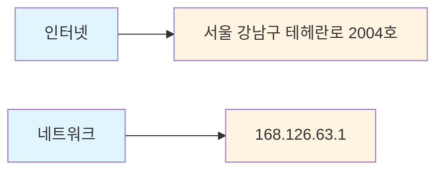
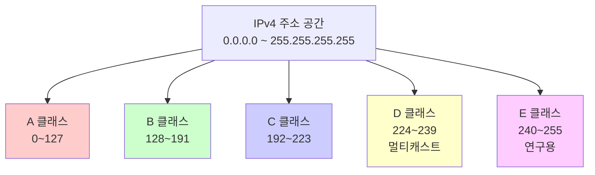
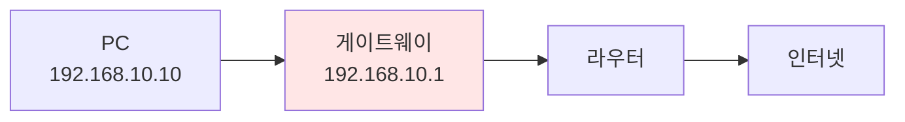
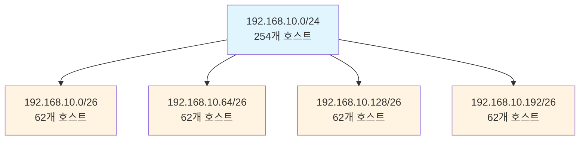
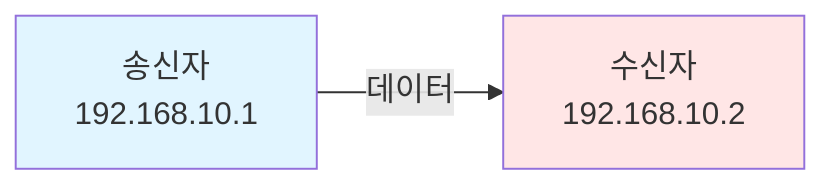
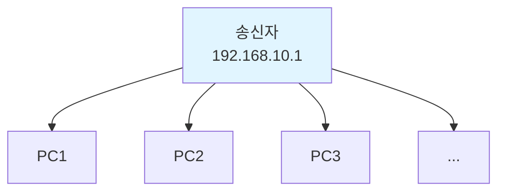
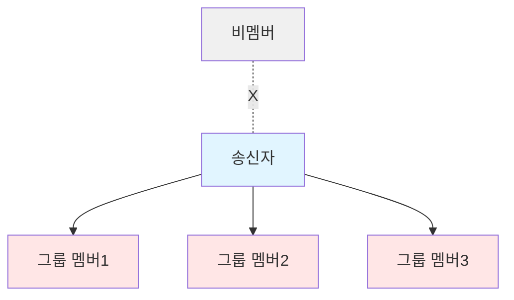

## 📚 전체 흐름 요약

Part 2에서는 네트워크 통신의 핵심인 **IP 주소 체계**와 **라우팅의 기초**를 다룹니다. IP 주소가 무엇인지, 어떻게 구성되는지, 그리고 네트워크를 효율적으로 나누는 서브넷팅 기법까지 학습합니다.

**학습 목표:**
- IP 주소의 개념과 구조 이해
- IPv4 클래스 체계 학습
- 서브넷 마스크의 역할과 계산 방법
- 서브넷팅과 수퍼넷팅의 실무 적용
- 사설 IP와 공인 IP의 차이점

---

## 1. IP 주소란?

### 1.1 IP 주소의 정의

**IP 주소(Internet Protocol Address)**는 네트워크에 연결된 장치들이 서로를 식별하고 통신하기 위해 사용하는 고유한 주소입니다.



**실생활 비유:**
- **집 주소**: "서울시 강남구 테헤란로 123번지"
- **IP 주소**: "192.168.10.1"

### 1.2 IP 주소의 특징

| 특성 | 설명 | 예시 |
|------|------|------|
| **고유성** | 네트워크 내에서 유일한 주소 | 같은 네트워크에 동일 IP 불가 |
| **계층 구조** | Network ID + Host ID로 구성 | 192.168(네트워크).10.1(호스트) |
| **논리 주소** | 소프트웨어적으로 할당 가능 | MAC 주소는 물리적 주소 |
| **라우팅 가능** | 경로 설정이 가능 | 인터넷 통신의 기반 |

### 1.3 IP 주소 확인 방법

**Windows:**
```bash
# 공인 IP 확인
curl ifconfig.me

# 내 PC의 IP 확인
ipconfig

# 네트워크 상태 확인
netstat -ano -p tcp
```

**주요 포트 번호:**
- `80`: HTTP (웹 서비스)
- `443`: HTTPS (보안 웹 서비스)
- `22`: SSH (원격 접속)
- `23`: Telnet (원격 접속)
- `3389`: RDP (Windows 원격 데스크톱)

---

## 2. IPv4 주소 체계

### 2.1 IPv4 주소 형식

IPv4 주소는 **32비트(4바이트)**로 구성되며, 사람이 읽기 쉽도록 **점으로 구분된 10진수** 형태로 표현됩니다.

```
192 . 168 . 10 . 1
 ↓     ↓     ↓    ↓
11000000.10101000.00001010.00000001
```

**구성 요소:**
1. **4개의 옥텟(Octet)**: 각각 8비트
2. **각 옥텟 범위**: 0~255
3. **전체 비트 수**: 32비트 (4바이트)

### 2.2 Classful 주소 체계

IPv4는 초기에 **클래스 기반(Classful)** 체계로 설계되었습니다.



#### A 클래스 (대규모 네트워크)

| 구분 | 내용 |
|------|------|
| **범위** | 0.0.0.0 ~ 127.255.255.255 |
| **첫 번째 비트** | `0`으로 시작 (0xxxxxxx) |
| **기본 서브넷 마스크** | 255.0.0.0 (`/8`) |
| **Network ID** | 첫 번째 옥텟 (8비트) |
| **Host ID** | 나머지 3개 옥텟 (24비트) |
| **네트워크 수** | 2^7 - 2 = 126개 |
| **호스트 수/네트워크** | 2^24 - 2 = 16,777,214개 |
| **용도** | 대규모 조직, ISP |

**예시:**
- `10.0.0.0` ~ `10.255.255.255` (사설 IP)
- `127.0.0.0` ~ `127.255.255.255` (루프백)

#### B 클래스 (중규모 네트워크)

| 구분 | 내용 |
|------|------|
| **범위** | 128.0.0.0 ~ 191.255.255.255 |
| **첫 번째 비트** | `10`으로 시작 (10xxxxxx) |
| **기본 서브넷 마스크** | 255.255.0.0 (`/16`) |
| **Network ID** | 처음 2개 옥텟 (16비트) |
| **Host ID** | 나머지 2개 옥텟 (16비트) |
| **네트워크 수** | 2^14 = 16,384개 |
| **호스트 수/네트워크** | 2^16 - 2 = 65,534개 |
| **용도** | 중규모 조직, 대학 |

**예시:**
- `172.16.0.0` ~ `172.31.255.255` (사설 IP)

#### C 클래스 (소규모 네트워크)

| 구분 | 내용 |
|------|------|
| **범위** | 192.0.0.0 ~ 223.255.255.255 |
| **첫 번째 비트** | `110`으로 시작 (110xxxxx) |
| **기본 서브넷 마스크** | 255.255.255.0 (`/24`) |
| **Network ID** | 처음 3개 옥텟 (24비트) |
| **Host ID** | 마지막 옥텟 (8비트) |
| **네트워크 수** | 2^21 = 2,097,152개 |
| **호스트 수/네트워크** | 2^8 - 2 = 254개 |
| **용도** | 소규모 조직, 가정 |

**예시:**
- `192.168.0.0` ~ `192.168.255.255` (사설 IP)

### 2.3 특수 용도 주소

#### D 클래스 (멀티캐스트)

- **범위**: 224.0.0.0 ~ 239.255.255.255
- **용도**: 그룹 통신 (1:多)
- **예시**:
  - `224.0.0.9`: RIPv2
  - `224.0.0.10`: EIGRP
  - `224.0.0.5`, `224.0.0.6`: OSPF

#### E 클래스 (연구용)

- **범위**: 240.0.0.0 ~ 255.255.255.255
- **용도**: 실험 및 연구 목적
- **일반 사용 불가**

---

## 3. Network ID와 Host ID

### 3.1 구성 요소

IP 주소는 **Network ID**와 **Host ID** 두 부분으로 구성됩니다.

```
192 . 168 . 10 . 1  /24
└──────┬──────┘  └┬┘
   Network ID    Host ID
```

| 구분 | 역할 | 비유 |
|------|------|------|
| **Network ID** | 네트워크를 식별 | 아파트 단지 번호 |
| **Host ID** | 네트워크 내 호스트 식별 | 동/호수 |

### 3.2 서브넷 마스크 (Subnet Mask)

**서브넷 마스크**는 IP 주소에서 Network ID와 Host ID를 구분하는 데 사용됩니다.

#### 서브넷 마스크의 원리

```
IP 주소:         192.168.10.1
                11000000.10101000.00001010.00000001

서브넷 마스크:    255.255.255.0
                11111111.11111111.11111111.00000000
                └──────────┬──────────┘└──┬──┘
                   Network ID (1)      Host ID (0)
```

**비트 AND 연산:**
```
  11000000.10101000.00001010.00000001  (IP 주소)
∧ 11111111.11111111.11111111.00000000  (서브넷 마스크)
─────────────────────────────────────
  11000000.10101000.00001010.00000000  = 192.168.10.0 (Network ID)
```

#### 클래스별 기본 서브넷 마스크

| 클래스 | 서브넷 마스크 | CIDR 표기 | 2진수 표현 |
|--------|--------------|-----------|-----------|
| A | 255.0.0.0 | /8 | 11111111.00000000.00000000.00000000 |
| B | 255.255.0.0 | /16 | 11111111.11111111.00000000.00000000 |
| C | 255.255.255.0 | /24 | 11111111.11111111.11111111.00000000 |

### 3.3 특수한 IP 주소

#### 네트워크 주소 (Network Address)

- Host ID가 **모두 0**인 주소
- 네트워크 자체를 나타냄
- **할당 불가**

**예시:** `192.168.10.0`

#### 브로드캐스트 주소 (Broadcast Address)

- Host ID가 **모두 1**인 주소
- 네트워크 내 모든 호스트에게 전송
- **할당 불가**

**예시:** `192.168.10.255`

#### 사용 가능한 호스트 주소

```
네트워크: 192.168.10.0/24

192.168.10.0     ← 네트워크 주소 (사용 불가)
192.168.10.1     ← 첫 번째 호스트 (일반적으로 게이트웨이)
192.168.10.2
...
192.168.10.254   ← 마지막 호스트
192.168.10.255   ← 브로드캐스트 주소 (사용 불가)

사용 가능: 192.168.10.1 ~ 192.168.10.254 (총 254개)
```

---

## 4. 사설 IP 주소 (RFC 1918)

### 4.1 사설 IP와 공인 IP

| 구분 | 공인 IP | 사설 IP |
|------|---------|---------|
| **할당 기관** | ISP, IANA | 사용자가 자유롭게 할당 |
| **라우팅** | 인터넷에서 라우팅 가능 | 인터넷에서 라우팅 불가 |
| **고유성** | 전 세계에서 유일 | 내부 네트워크에서만 유일 |
| **용도** | 인터넷 통신 | 내부 네트워크 통신 |
| **비용** | 유료 (제한적) | 무료 |

### 4.2 RFC 1918 사설 IP 대역

인터넷에서 라우팅되지 않도록 예약된 사설 IP 주소 대역입니다.

| 클래스 | IP 범위 | CIDR 표기 | 네트워크 수 | 호스트 수 |
|--------|---------|-----------|------------|-----------|
| **A** | 10.0.0.0 ~ 10.255.255.255 | 10.0.0.0/8 | 1개 | 16,777,216개 |
| **B** | 172.16.0.0 ~ 172.31.255.255 | 172.16.0.0/12 | 16개 | 1,048,576개 |
| **C** | 192.168.0.0 ~ 192.168.255.255 | 192.168.0.0/16 | 256개 | 65,536개 |

**실무 사용 예:**
```
소규모 사무실:  192.168.1.0/24 (254개 호스트)
중규모 기업:    10.0.0.0/16 (65,534개 호스트)
대규모 데이터센터: 10.0.0.0/8 (1,600만개 호스트)
```

### 4.3 특수 용도 주소

#### 루프백 주소 (Loopback)

- **범위**: 127.0.0.0/8
- **대표 주소**: 127.0.0.1 (localhost)
- **용도**: 자기 자신에게 통신
- **테스트**: 네트워크 스택 정상 작동 확인

```bash
# 루프백 테스트
ping 127.0.0.1
ping localhost
```

#### APIPA (Automatic Private IP Addressing)

- **범위**: 169.254.0.0/16
- **용도**: DHCP 서버 연결 실패 시 자동 할당
- **특징**: 같은 네트워크 내에서만 통신 가능

**발생 상황:**
```
1. PC 부팅
2. DHCP 서버에 IP 요청
3. DHCP 서버 응답 없음
4. APIPA 주소 자동 할당 (169.254.x.x)
```

### 4.4 Default Gateway

**게이트웨이(Gateway)**는 다른 네트워크로 나가기 위한 출입구 역할을 합니다.



**역할:**
- 로컬 네트워크(LAN)와 원격 네트워크(WAN) 연결
- 패킷 스위칭을 통해 네트워크 주소가 달라도 통신 가능

**설정 예:**
```
IP 주소:       192.168.10.10
서브넷 마스크:  255.255.255.0
게이트웨이:    192.168.10.1  ← 라우터 주소
```

---

## 5. 서브넷팅 (Subnetting)

### 5.1 서브넷팅이란?

**서브넷팅(Subnetting)**은 하나의 큰 네트워크를 여러 개의 작은 네트워크로 나누는 기술입니다.

**목적:**
- IP 주소 효율적 사용
- 보안 강화 (네트워크 분리)
- 브로드캐스트 도메인 축소
- 네트워크 관리 용이



### 5.2 서브넷팅 계산 방법

#### 기본 공식

```
필요한 서브넷 수 = 2^n (n: 빌린 비트 수)
서브넷당 호스트 수 = 2^h - 2 (h: 남은 Host ID 비트 수)
```

#### 예제 1: C 클래스를 2개로 나누기

**요구사항:** 192.168.10.0/24를 2개의 서브넷으로 분할

```
원래 주소: 192.168.10.0/24
서브넷 마스크: 255.255.255.0 (11111111.11111111.11111111.00000000)

필요 비트: 2^1 = 2개 서브넷 → 1비트 빌림
새 서브넷 마스크: /25 = 255.255.255.128 (11111111.11111111.11111111.10000000)
```

**결과:**

| 서브넷 | Network ID | 사용 가능 범위 | Broadcast | 호스트 수 |
|--------|-----------|---------------|-----------|----------|
| 1번 | 192.168.10.0 | 192.168.10.1 ~ .126 | 192.168.10.127 | 126개 |
| 2번 | 192.168.10.128 | 192.168.10.129 ~ .254 | 192.168.10.255 | 126개 |

#### 예제 2: C 클래스를 4개로 나누기

**요구사항:** 192.168.10.0/24를 4개의 서브넷으로 분할

```
필요 비트: 2^2 = 4개 서브넷 → 2비트 빌림
새 서브넷 마스크: /26 = 255.255.255.192
```

**계산:**
```
증가값 = 256 - 192 = 64

서브넷 1: 192.168.10.0/26    (0 + 64*0)
서브넷 2: 192.168.10.64/26   (0 + 64*1)
서브넷 3: 192.168.10.128/26  (0 + 64*2)
서브넷 4: 192.168.10.192/26  (0 + 64*3)
```

**결과:**

| 서브넷 | Network ID | 사용 가능 범위 | Broadcast | 호스트 수 |
|--------|-----------|---------------|-----------|----------|
| 1번 | 192.168.10.0 | .1 ~ .62 | .63 | 62개 |
| 2번 | 192.168.10.64 | .65 ~ .126 | .127 | 62개 |
| 3번 | 192.168.10.128 | .129 ~ .190 | .191 | 62개 |
| 4번 | 192.168.10.192 | .193 ~ .254 | .255 | 62개 |

### 5.3 서브넷팅 빠른 계산법

**단계별 접근:**

1. **필요한 서브넷/호스트 수 파악**
2. **비트 수 계산** (2^n ≥ 필요 수)
3. **새 서브넷 마스크 결정**
4. **증가값 계산** (256 - 옥텟 값)
5. **네트워크 주소 나열** (0부터 증가값씩 증가)

**서브넷 마스크 참조표:**

| CIDR | 서브넷 마스크 | 호스트 수 | 서브넷 수 (C기준) |
|------|--------------|----------|------------------|
| /24 | 255.255.255.0 | 254 | 1 |
| /25 | 255.255.255.128 | 126 | 2 |
| /26 | 255.255.255.192 | 62 | 4 |
| /27 | 255.255.255.224 | 30 | 8 |
| /28 | 255.255.255.240 | 14 | 16 |
| /29 | 255.255.255.248 | 6 | 32 |
| /30 | 255.255.255.252 | 2 | 64 |

---

## 6. CIDR (Classless Inter-Domain Routing)

### 6.1 CIDR이란?

**CIDR**는 클래스 개념을 없애고 **프리픽스(Prefix)** 방식으로 네트워크를 표현하는 주소 체계입니다.

**장점:**
- IP 주소 낭비 감소
- 라우팅 테이블 크기 축소
- 유연한 주소 할당

**표기법:**
```
192.168.10.0/24
           └─┬─┘
         프리픽스 길이 (Network ID 비트 수)
```

### 6.2 CIDR 표기 예시

| CIDR 표기 | 서브넷 마스크 | 네트워크 비트 | 호스트 비트 | 호스트 수 |
|-----------|--------------|--------------|------------|----------|
| /8 | 255.0.0.0 | 8 | 24 | 16,777,214 |
| /16 | 255.255.0.0 | 16 | 16 | 65,534 |
| /24 | 255.255.255.0 | 24 | 8 | 254 |
| /25 | 255.255.255.128 | 25 | 7 | 126 |
| /30 | 255.255.255.252 | 30 | 2 | 2 |

### 6.3 수퍼넷팅 (Supernetting)

**수퍼넷팅**은 여러 개의 작은 네트워크를 하나의 큰 네트워크로 합치는 기술입니다.

**목적:**
- 라우팅 테이블 축소 (경로 집약)
- 효율적인 주소 관리

#### 예제: C 클래스 2개 합치기

```
192.168.10.0/24  ┐
                 ├─→  192.168.10.0/23
192.168.11.0/24  ┘

서브넷 마스크: 255.255.254.0
호스트 수: 510개 (254 × 2 - 2)
```

**계산:**
```
192.168.10.0  = 11000000.10101000.00001010.00000000
192.168.11.0  = 11000000.10101000.00001011.00000000
                                      └─┬─┘
                                   다른 부분: 1비트

새 서브넷 마스크: /23 (23개 1, 9개 0)
255.255.254.0 = 11111111.11111111.11111110.00000000
```

---

## 7. IPv4 통신 방식

### 7.1 유니캐스트 (Unicast)

**1:1 통신** - 가장 일반적인 통신 방식



**특징:**
- CPU 부하 최소
- 대역폭 효율적
- 대부분의 인터넷 트래픽

### 7.2 브로드캐스트 (Broadcast)

**1:多 통신** - 같은 네트워크 내 모든 장치에 전송



**특징:**
- **로컬 LAN에만 전달** (라우터 통과 불가)
- CPU 부하 증가 (모든 장치가 처리)
- ARP, DHCP 등에서 사용

**브로드캐스트 주소:**
- Layer 2: `FF-FF-FF-FF-FF-FF`
- Layer 3 Limited: `255.255.255.255`
- Layer 3 Directed: `192.168.10.255` (네트워크별)

### 7.3 멀티캐스트 (Multicast)

**1:Group 통신** - 특정 그룹에만 전송



**특징:**
- 그룹 멤버만 수신
- 대역폭 효율적
- IPTV, 화상회의 등에 사용

**주요 멀티캐스트 주소:**
- `224.0.0.9`: RIPv2
- `224.0.0.10`: EIGRP
- `224.0.0.5`, `224.0.0.6`: OSPF

### 7.4 애니캐스트 (Anycast)

**IPv6**에서 주로 사용되며, 가장 가까운 노드에 전달합니다.

---

## 8. 실습 예제

### 예제 1: IP 주소 클래스 판별

**문제:** 다음 IP 주소의 클래스를 판별하세요.

1. `10.20.30.40`
2. `172.16.5.100`
3. `192.168.1.1`
4. `224.0.0.5`

**풀이:**

| IP 주소 | 첫 옥텟 | 클래스 | 기본 서브넷 마스크 |
|---------|--------|--------|-------------------|
| 10.20.30.40 | 10 | A (0~127) | 255.0.0.0 |
| 172.16.5.100 | 172 | B (128~191) | 255.255.0.0 |
| 192.168.1.1 | 192 | C (192~223) | 255.255.255.0 |
| 224.0.0.5 | 224 | D (224~239) | - (멀티캐스트) |

### 예제 2: Network ID 계산

**문제:** IP 주소 `192.168.10.25/24`의 Network ID, Broadcast 주소, 사용 가능 범위를 구하세요.

**풀이:**

```
IP 주소: 192.168.10.25
서브넷 마스크: 255.255.255.0 (/24)

Network ID = IP AND 서브넷 마스크
           = 192.168.10.0

Broadcast = Network ID에서 Host ID를 모두 1로
          = 192.168.10.255

사용 가능 범위 = 192.168.10.1 ~ 192.168.10.254
```

### 예제 3: 서브넷팅 실습

**문제:** `192.168.100.0/24`를 각 부서에 다음과 같이 할당하세요.
- 영업부: 60개 호스트
- 개발부: 30개 호스트
- 총무부: 10개 호스트

**풀이:**

```
1. 영업부 (60개 필요 → 62개 제공)
   - 필요 비트: 2^6 = 64 > 60
   - 서브넷: /26 (255.255.255.192)
   - 할당: 192.168.100.0/26
   - 범위: .1 ~ .62

2. 개발부 (30개 필요 → 30개 제공)
   - 필요 비트: 2^5 = 32 > 30
   - 서브넷: /27 (255.255.255.224)
   - 할당: 192.168.100.64/27
   - 범위: .65 ~ .94

3. 총무부 (10개 필요 → 14개 제공)
   - 필요 비트: 2^4 = 16 > 10
   - 서브넷: /28 (255.255.255.240)
   - 할당: 192.168.100.96/28
   - 범위: .97 ~ .110
```

---

## 9. 주요 개념 요약표

### IPv4 클래스 비교

| 항목 | A 클래스 | B 클래스 | C 클래스 |
|------|---------|---------|---------|
| **범위** | 0~127 | 128~191 | 192~223 |
| **서브넷 마스크** | 255.0.0.0 | 255.255.0.0 | 255.255.255.0 |
| **CIDR** | /8 | /16 | /24 |
| **네트워크 수** | 126 | 16,384 | 2,097,152 |
| **호스트/네트워크** | 16,777,214 | 65,534 | 254 |
| **용도** | 대규모 조직 | 중규모 조직 | 소규모 조직 |

### 사설 IP 대역

| 클래스 | IP 범위 | CIDR | 사용처 |
|--------|---------|------|--------|
| A | 10.0.0.0 ~ 10.255.255.255 | 10.0.0.0/8 | 대규모 기업, 데이터센터 |
| B | 172.16.0.0 ~ 172.31.255.255 | 172.16.0.0/12 | 중규모 조직 |
| C | 192.168.0.0 ~ 192.168.255.255 | 192.168.0.0/16 | 가정, 소규모 사무실 |

### 서브넷 마스크 변환표

| CIDR | 서브넷 마스크 | 2진수 (마지막 옥텟) | 호스트 수 |
|------|--------------|-------------------|----------|
| /24 | 255.255.255.0 | 00000000 | 254 |
| /25 | 255.255.255.128 | 10000000 | 126 |
| /26 | 255.255.255.192 | 11000000 | 62 |
| /27 | 255.255.255.224 | 11100000 | 30 |
| /28 | 255.255.255.240 | 11110000 | 14 |
| /29 | 255.255.255.248 | 11111000 | 6 |
| /30 | 255.255.255.252 | 11111100 | 2 |

---

## 10. 마무리

### 핵심 요점

1. **IP 주소는 Network ID + Host ID**로 구성됩니다.
2. **서브넷 마스크**는 Network ID와 Host ID를 구분합니다.
3. **클래스 체계**는 초기 설계이며, 현재는 **CIDR**을 주로 사용합니다.
4. **서브넷팅**은 네트워크를 효율적으로 나누는 핵심 기술입니다.
5. **사설 IP**는 내부 네트워크에서 자유롭게 사용 가능합니다.

### 다음 단계

Part 3에서는 다음 내용을 다룹니다:
- DHCP (Dynamic Host Configuration Protocol)
- DNS (Domain Name System)
- NAT (Network Address Translation)
- ACL (Access Control List)
- 방화벽과 보안

