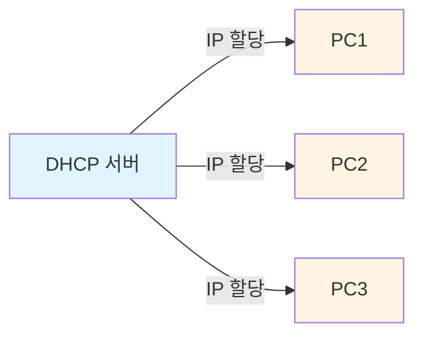
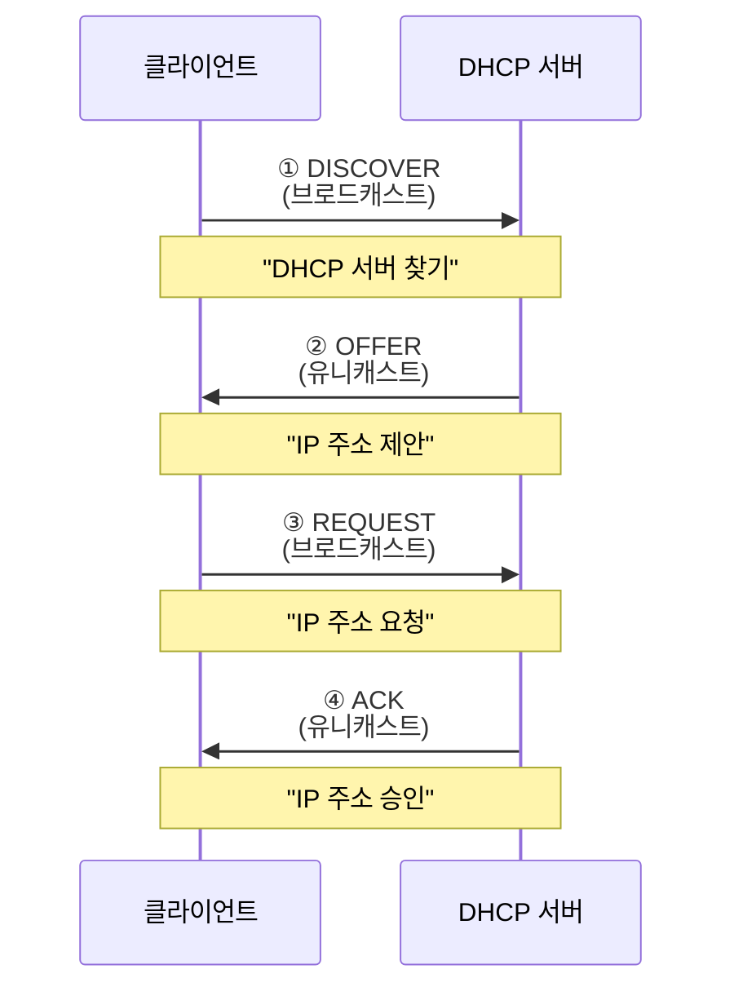
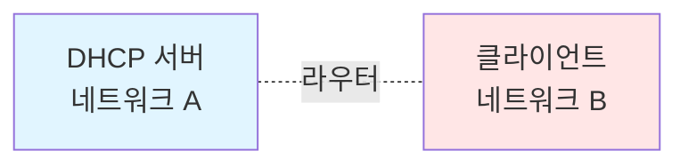
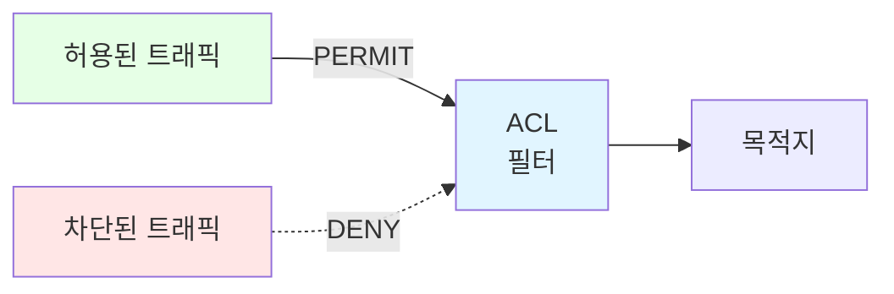

## 📚 전체 흐름 요약

Part 3에서는 실무에서 필수적인 **네트워크 서비스**와 **보안 기술**을 학습합니다. IP 주소를 자동으로 할당하는 DHCP, 사설 IP를 공인 IP로 변환하는 NAT, 그리고 네트워크 접근을 제어하는 ACL 등을 다룹니다.

**학습 목표:**
- DHCP의 동작 원리와 설정 방법
- NAT의 종류와 실무 활용
- ACL을 통한 네트워크 접근 제어
- 방화벽의 기본 개념
- 포트 스캔과 보안 대책

---

## 1. DHCP (Dynamic Host Configuration Protocol)

### 1.1 DHCP란?

**DHCP**는 네트워크 장치에 IP 주소와 네트워크 설정을 **자동으로 할당**하는 프로토콜입니다 (RFC 1541).



**장점:**
- 관리자의 수동 설정 불필요
- IP 주소 충돌 방지
- 효율적인 IP 주소 관리
- 중앙 집중식 관리

**할당 정보:**
- IP 주소
- 서브넷 마스크
- 기본 게이트웨이
- DNS 서버 주소
- 임대 시간 (Lease Time)

### 1.2 DHCP 동작 과정 (4단계)

DHCP는 **DORA** 과정을 통해 IP 주소를 할당합니다.



#### ① DISCOVER (서버 찾기)

```
클라이언트 → 브로드캐스트

출발지 IP: 0.0.0.0
목적지 IP: 255.255.255.255
메시지: "DHCP 서버 있나요?"
```

**상황:**
- PC 부팅 또는 네트워크 연결 시
- IP 주소가 없어 0.0.0.0 사용
- 브로드캐스트로 네트워크 전체에 전송

#### ② OFFER (IP 제안)

```
DHCP 서버 → 클라이언트

출발지 IP: DHCP 서버 IP
목적지 IP: 클라이언트가 받을 IP
메시지: "이 IP 주소(192.168.10.100) 어때요?"
```

**내용:**
- 사용 가능한 IP 주소
- 서브넷 마스크
- 임대 시간
- 게이트웨이, DNS 정보

#### ③ REQUEST (IP 요청)

```
클라이언트 → 브로드캐스트

메시지: "192.168.10.100 주소를 사용하겠습니다!"
```

**이유:**
- 여러 DHCP 서버가 응답할 수 있음
- 선택한 서버에게 알림
- 다른 서버는 제안 철회

#### ④ ACK (IP 승인)

```
DHCP 서버 → 클라이언트

메시지: "승인! 192.168.10.100 사용하세요."
임대 시간: 7일
```

**결과:**
- IP 주소 할당 완료
- 클라이언트 네트워크 통신 가능

### 1.3 DHCP 임대 갱신

```
임대 시간: 7일

50% 경과 (3.5일) → 갱신 시도 (UNICAST)
75% 경과 (5.25일) → 재갱신 시도 (BROADCAST)
100% 경과 (7일) → IP 반납, 새로 할당받기
```

### 1.4 DHCP Relay Agent

**문제 상황:**



DHCP DISCOVER는 **브로드캐스트**이므로 **라우터를 넘지 못합니다**.

**해결책: DHCP Relay Agent**


**동작 방식:**
1. 클라이언트 → 라우터: DISCOVER (브로드캐스트)
2. 라우터 → DHCP 서버: DISCOVER (유니캐스트로 변환)
3. DHCP 서버 → 라우터: OFFER
4. 라우터 → 클라이언트: OFFER 전달


---

## 2. NAT (Network Address Translation)

### 2.1 NAT란?

**NAT**는 IP 패킷의 주소 정보를 변환하는 기술로, 주로 **사설 IP ↔ 공인 IP** 변환에 사용됩니다 (RFC 1631).


**필요성:**
- IPv4 주소 고갈 문제 해결
- 보안 강화 (내부 네트워크 숨김)
- 비용 절감 (공인 IP 최소화)

**용어:**
- **Inside Local**: 내부 사설 IP (192.168.10.10)
- **Inside Global**: 외부로 나갈 때 변환된 공인 IP (203.235.222.10)

### 2.2 NAT 종류

#### 1) Static NAT (정적 NAT)

**1:1 고정 매핑** - 특정 사설 IP를 특정 공인 IP로 고정 변환

```
사설 IP          공인 IP
192.168.10.5  →  203.235.222.10  (항상 고정)
192.168.10.6  →  203.235.222.11  (항상 고정)
```

**특징:**
- NAT 테이블이 삭제되지 않음
- 외부에서 내부 서버 접속 가능
- 공인 IP가 많이 필요

**용도:**
- 웹 서버, 메일 서버 등 공개 서비스
- DMZ 영역 서버


#### 2) Dynamic NAT (동적 NAT)

**N:M 매핑** - 사설 IP를 공인 IP Pool에서 동적 할당

```
사설 IP Pool          공인 IP Pool
192.168.10.10  ─┐
192.168.10.11  ─┼─→  203.235.222.1 ~ .14
192.168.10.12  ─┘     (14개 공인 IP)
     ...
```

**특징:**
- 통신 시에만 NAT 테이블 생성
- 일정 시간 후 자동 삭제
- 공인 IP보다 사설 IP가 많으면 대기

**용도:**
- 내부 → 외부 인터넷 사용
- 일반 사무실 네트워크


#### 3) PAT (Port Address Translation)

**N:1 매핑** - 여러 사설 IP를 하나의 공인 IP로 변환 (포트 번호 활용)

```
사설 IP            포트    →    공인 IP          포트
192.168.10.10:1111  ────→  203.235.222.1:1111
192.168.10.10:2222  ────→  203.235.222.1:2222
192.168.10.11:3333  ────→  203.235.222.1:3333
192.168.10.12:4444  ────→  203.235.222.1:4444
```

**특징:**
- **공인 IP 1개로 수천 대 지원**
- 포트 번호로 구분
- 가장 일반적인 NAT 방식
- 가정용 공유기에서 사용


### 2.3 NAT의 장단점

**장점:**
- IPv4 주소 절약
- 내부 네트워크 보안 강화
- 네트워크 구조 변경 용이

**단점:**
- 패킷 지연 발생
- 종단 간 투명성 저하
- 일부 프로토콜 호환 문제 (FTP, SIP 등)

---

## 3. ACL (Access Control List)

### 3.1 ACL이란?

**ACL**은 네트워크 트래픽을 **필터링**하여 접근을 제어하는 보안 기술입니다.



**용도:**
- 특정 트래픽 허용/차단
- 원격 접속 제어 (Telnet, SSH)
- NAT와 함께 사용
- QoS 정책 적용

### 3.2 ACL 종류

#### 1) Standard ACL (표준 ACL)

**출발지 IP 주소만** 검사합니다.

| 항목 | 내용 |
|------|------|
| **번호 범위** | 1~99, 1300~1999 |
| **검사 항목** | 출발지 IP만 |
| **적용 위치** | 목적지에 가깝게 |
| **세밀도** | 낮음 |


#### 2) Extended ACL (확장 ACL)

**출발지, 목적지, 프로토콜, 포트** 모두 검사합니다.

| 항목 | 내용 |
|------|------|
| **번호 범위** | 100~199, 2000~2699 |
| **검사 항목** | 출발지, 목적지, 프로토콜, 포트 |
| **적용 위치** | 출발지에 가깝게 |
| **세밀도** | 높음 |


**프로토콜:**
- `ip`: 모든 IP 트래픽
- `tcp`: TCP 트래픽
- `udp`: UDP 트래픽
- `icmp`: ICMP (ping 등)

**포트 연산자:**
- `eq (equal)`: 같음 (예: eq 80)
- `neq (not equal)`: 같지 않음
- `gt (greater than)`: 초과
- `lt (less than)`: 미만
- `range`: 범위 (예: range 1000 2000)


### 3.3 Wildcard Mask

**Wildcard Mask**는 서브넷 마스크와 반대 개념입니다.

| 비트 | 의미 |
|------|------|
| `0` | **검사** (정확히 일치해야 함) |
| `1` | **무시** (아무 값이나 허용) |

**계산 방법:**
```
서브넷 마스크:  255.255.255.0
Wildcard:     0.0.0.255  ← 255에서 빼기
```

**예시:**

| 목적 | IP 주소 | Wildcard Mask | 의미 |
|------|---------|---------------|------|
| 단일 호스트 | 192.168.10.1 | 0.0.0.0 | 정확히 192.168.10.1만 |
| C 클래스 네트워크 | 192.168.10.0 | 0.0.0.255 | 192.168.10.0/24 전체 |
| 홀수 호스트만 | 192.168.10.0 | 0.0.0.1 | 마지막 비트 무시 (0,1 / 2,3 ...) |
| 모든 주소 | 0.0.0.0 | 255.255.255.255 | any와 동일 |

---

## 4. 방화벽의 이해

### 4.1 방화벽이란?

**방화벽(Firewall)**은 신뢰할 수 있는 네트워크와 신뢰할 수 없는 네트워크 사이에서 **트래픽을 제어**하는 보안 시스템입니다.


### 4.2 방화벽 필터링 방식

#### 1) Egress Filtering (Outbound)

**내부 → 외부** 나가는 트래픽 검사

```
목적: 내부 시스템의 악성 행위 차단
검사: 출발지 IP 주소
예시: 특정 PC의 외부 통신 차단
```

#### 2) Ingress Filtering (Inbound)

**외부 → 내부** 들어오는 트래픽 검사

```
목적: 외부 공격 차단
검사: 출발지 IP, 목적지 포트
예시: 특정 IP 대역 차단, 포트 스캔 차단
```

#### 3) Blackhole Filtering (Null Routing)

특정 트래픽을 **null 인터페이스(쓰레기통)**로 전송


**장점:**
- CPU 부하 최소 (ACL보다 효율적)
- 간단한 설정

#### 4) Unicast RPF (Reverse Path Forwarding)

**IP 스푸핑** 공격 방어


**동작 원리:**
```
1. 패킷 수신 (출발지 IP: 1.1.1.1)
2. 라우팅 테이블 확인: 1.1.1.1로 가는 경로는?
3. 같은 인터페이스로 나가는가?
   - Yes → 정상 트래픽 (통과)
   - No → 스푸핑 의심 (차단)
```

---

## 5. 포트 스캔 (Port Scan)

### 5.1 포트 스캔이란?

**포트 스캔**은 대상 시스템의 **열린 포트**를 찾아내는 정찰 기법입니다.


**목적:**
- 서비스 탐지
- 취약점 분석
- 침투 경로 파악

### 5.2 포트 스캔 종류

#### 1) TCP Connect Scan (TCP OPEN 스캔)

**3-way handshake 완료** - 가장 정확하지만 로그 기록됨

```
클라이언트 → 서버: SYN
서버 → 클라이언트: SYN+ACK  ← 포트 열림
클라이언트 → 서버: ACK

결과: 포트 OPEN
```

**단점:**
- 로그에 기록됨
- 느림

#### 2) TCP SYN Scan (Half-OPEN 스캔)

**SYN만 전송**, 연결 완료하지 않음 - 스텔스 스캔

```
클라이언트 → 서버: SYN
서버 → 클라이언트: SYN+ACK  ← 포트 열림
클라이언트 → 서버: RST  ← 연결 중단

결과: 포트 OPEN, 로그 기록 최소화
```

**장점:**
- 로그 회피 가능
- 빠름

#### 3) FIN/NULL/XMAS Scan

**비정상 패킷** 전송 - **닫힌 포트** 기준으로 판단

| 스캔 | 플래그 설정 | 응답 |
|------|-----------|------|
| **FIN** | FIN=1 | RST+ACK (닫힘), 무응답 (열림) |
| **NULL** | 모두 0 | RST+ACK (닫힘), 무응답 (열림) |
| **XMAS** | FIN+PSH+URG=1 | RST+ACK (닫힘), 무응답 (열림) |

**원리:**
```
RFC 793: 닫힌 포트는 RST 응답
        열린 포트는 무시

→ 응답 없음 = 포트 열림
→ RST 응답 = 포트 닫힘
```

#### 4) UDP Scan

UDP는 비연결성이므로 **ICMP 응답**으로 판단

```
열린 포트: 무응답 또는 UDP 응답
닫힌 포트: ICMP Port Unreachable
```

**단점:**
- 신뢰성 낮음
- 느림

#### 5) TCP ACK Scan

포트 상태가 아닌 **방화벽 정책** 테스트

```
클라이언트 → 서버: ACK

방화벽 필터링: 무응답 또는 ICMP
필터링 없음: RST+ACK
```

**용도:**
- Stateful 방화벽 탐지
- 방화벽 규칙 분석

#### 6) Decoy Scan

**다양한 IP**로 출발지 위조 - 추적 회피

```
실제 공격자: 10.10.10.10
위조 IP1: 20.20.20.20
위조 IP2: 30.30.30.30
위조 IP3: 40.40.40.40

→ 서버 로그에 여러 IP 기록
→ 실제 공격자 특정 어려움
```

---

## 7. 주요 개념 요약표

### DHCP 메시지 비교

| 단계 | 메시지 | 전송 방식 | 내용 |
|------|--------|----------|------|
| ① | DISCOVER | 브로드캐스트 | DHCP 서버 찾기 |
| ② | OFFER | 유니캐스트 | IP 주소 제안 |
| ③ | REQUEST | 브로드캐스트 | IP 주소 요청 |
| ④ | ACK | 유니캐스트 | IP 주소 승인 |

### NAT 종류 비교

| 종류 | 매핑 | NAT 테이블 | 용도 | 공인 IP 수 |
|------|------|-----------|------|----------|
| **Static** | 1:1 고정 | 유지 | 서버 공개 | 많음 |
| **Dynamic** | N:M 동적 | 임시 | 내부→외부 | 중간 |
| **PAT** | N:1 포트 | 임시 | 가정/사무실 | 1개 |

### ACL 종류 비교

| 구분 | Standard ACL | Extended ACL |
|------|-------------|-------------|
| **번호** | 1~99, 1300~1999 | 100~199, 2000~2699 |
| **검사 항목** | 출발지 IP만 | 출발지, 목적지, 프로토콜, 포트 |
| **적용 위치** | 목적지 근처 | 출발지 근처 |
| **세밀도** | 낮음 | 높음 |

### 포트 스캔 비교

| 스캔 종류 | 플래그 | 로그 기록 | 탐지 난이도 |
|----------|--------|----------|-----------|
| **TCP Connect** | SYN→SYN+ACK→ACK | 많음 | 쉬움 |
| **SYN** | SYN→RST | 적음 | 중간 |
| **FIN** | FIN | 적음 | 어려움 |
| **NULL** | 없음 | 적음 | 어려움 |
| **XMAS** | FIN+PSH+URG | 적음 | 어려움 |

---

## 8. 마무리

### 핵심 요점

1. **DHCP**는 DORA 과정으로 IP를 자동 할당합니다.
2. **NAT**는 사설 IP를 공인 IP로 변환하여 IPv4 부족 문제를 해결합니다.
3. **ACL**은 출발지, 목적지, 프로토콜, 포트를 기반으로 트래픽을 제어합니다.
4. **방화벽**은 다양한 필터링 기법으로 네트워크 보안을 강화합니다.
5. **포트 스캔**을 이해하고 대응 방법을 마련해야 합니다.

### 실무 팁

**DHCP 설계 시:**
- 충분한 IP Pool 확보 (사용자 수의 120%)
- 중요 장비는 고정 IP 또는 DHCP Reservation
- 임대 시간은 환경에 맞게 조정 (일반: 7일, 유동적: 1일)

**NAT 설계 시:**
- 서버는 Static NAT 사용
- 일반 사용자는 PAT 사용
- NAT Pool 크기는 동시 접속자 수 고려

**ACL 설계 시:**
- 구체적인 규칙부터 작성 (위→아래 순서 중요)
- 마지막에 `permit any` 또는 `deny any` 명시
- Extended ACL은 출발지 근처에 적용

### 마무리

이번 Part 3에서는 **실무 네트워크 서비스와 보안 기술**을 종합적으로 학습했습니다. **DHCP**를 통해 IP 주소를 자동으로 할당받는 4단계 DORA 과정(Discover, Offer, Request, ACK)을 이해하고, DHCP 릴레이를 통해 다른 네트워크에 있는 DHCP 서버와 통신하는 방법을 익혔습니다.

**NAT**(Network Address Translation)와 **PAT**(Port Address Translation)의 차이를 명확히 구분하며, 사설 IP를 공인 IP로 변환하여 인터넷 통신을 가능하게 하는 원리를 파악했습니다. Static NAT는 1:1 매핑으로 서버에 적합하고, Dynamic NAT는 Pool 방식으로 여러 공인 IP를 공유하며, PAT는 포트를 이용해 하나의 공인 IP로 여러 사설 IP를 동시에 인터넷에 연결할 수 있습니다.

**ACL**(Access Control List)을 통한 네트워크 접근 제어 기법을 학습했습니다. Standard ACL은 출발지 IP만 검사하고, Extended ACL은 출발지/목적지 IP, 프로토콜, 포트까지 세밀하게 제어합니다. ACL은 위에서 아래로 순차 검사하므로 구체적인 규칙을 먼저 배치하고, 마지막에 deny any로 기본 차단하는 것이 원칙입니다.

**방화벽**의 개념과 포트 스캔 대응 방법을 이해하며, Stateless 방화벽(패킷 필터링)과 Stateful 방화벽(상태 추적)의 차이를 파악했습니다. nmap을 이용한 포트 스캔 기법과 이에 대한 방어 전략도 학습했습니다.

다음 Part 4에서는 Layer 2 네트워킹의 핵심인 **스위치 동작 원리와 VLAN**을 학습합니다. 스위치의 5가지 동작(Learning, Flooding, Forwarding, Filtering, Aging), MAC 주소 테이블 관리, VLAN을 통한 브로드캐스트 도메인 분리, Inter-VLAN 라우팅, STP를 이용한 루프 방지 등 실무 네트워크 구축의 필수 기술을 익히게 됩니다.

---