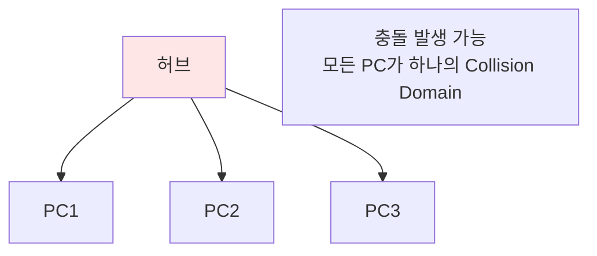
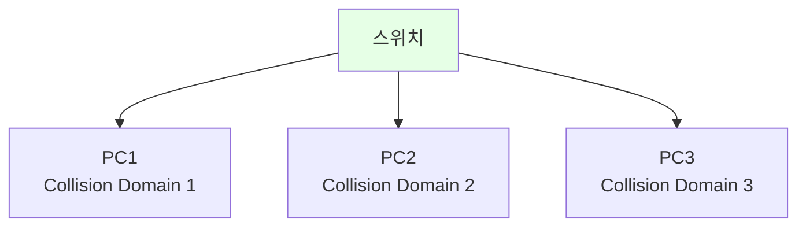
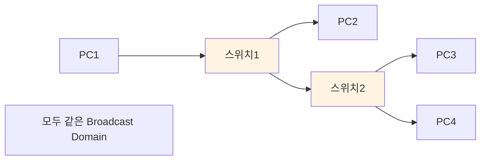
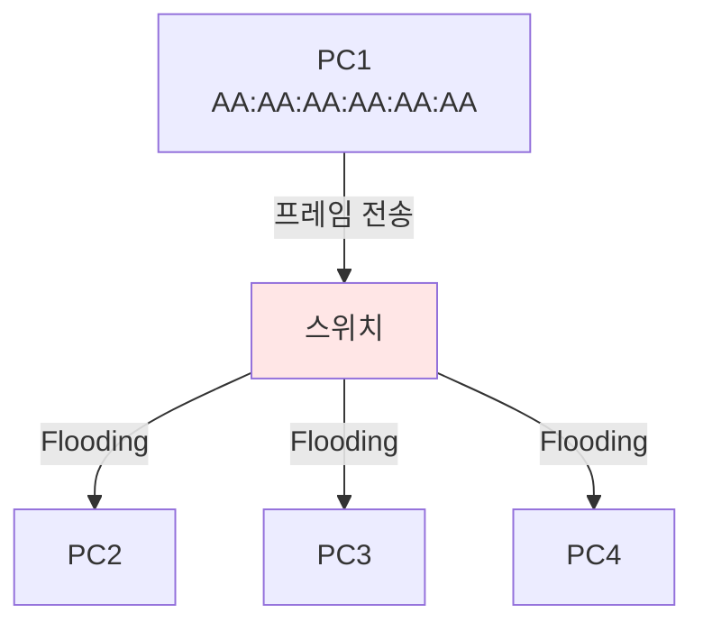
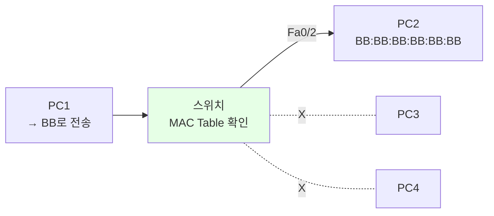
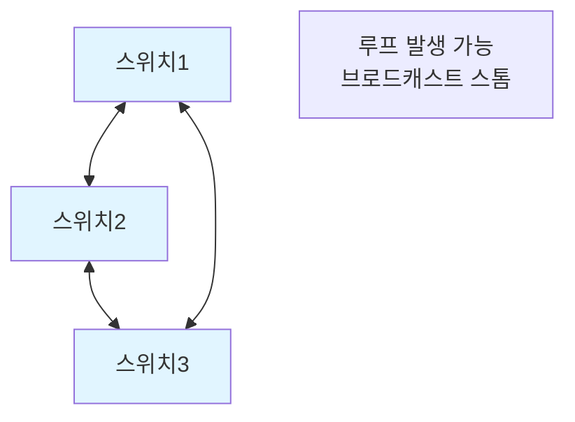
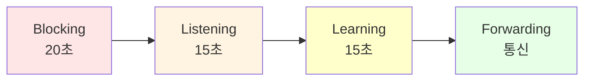
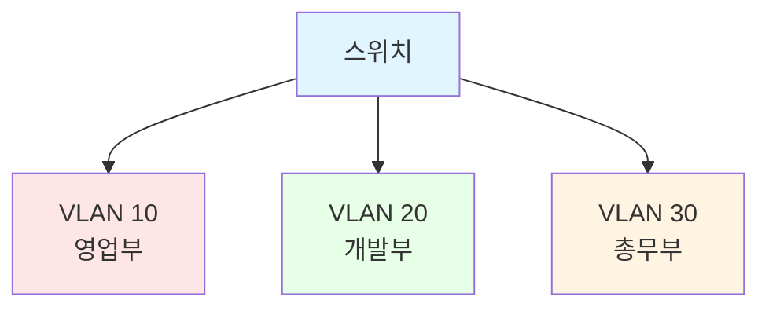
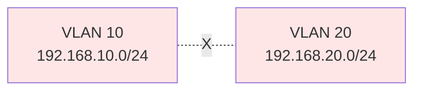
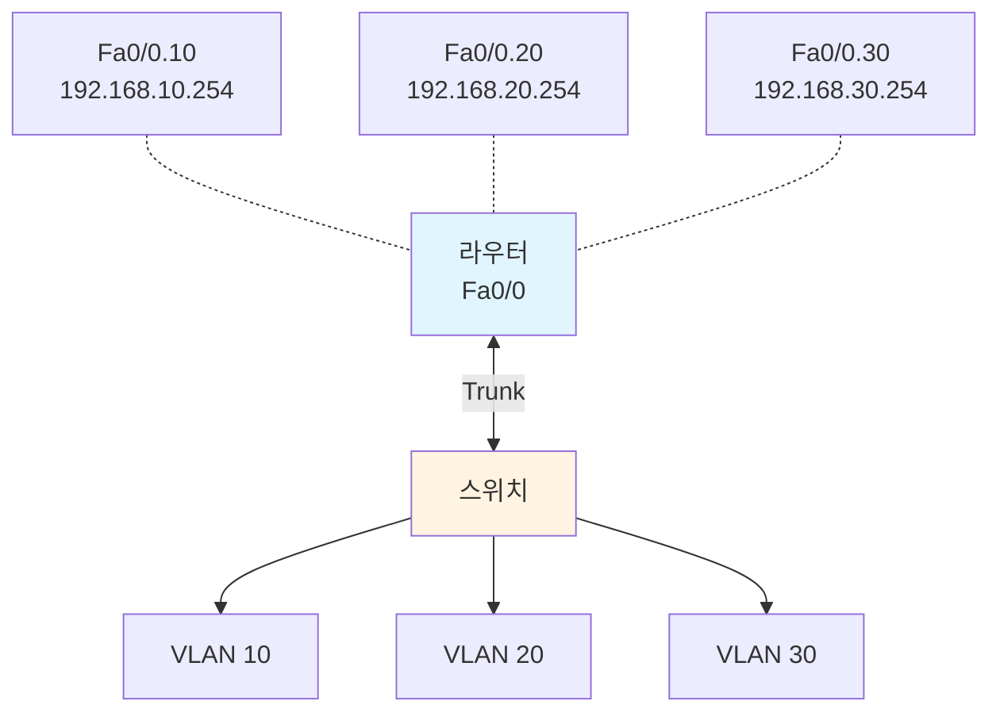

## 📚 전체 흐름 요약

Part 4에서는 Layer 2 네트워크의 핵심인 **스위치와 VLAN**을 학습합니다. 스위치의 동작 원리, MAC 주소 학습 과정, 그리고 VLAN을 통한 네트워크 분리 기법을 이해합니다.

**학습 목표:**
- 스위치의 5가지 기본 동작 이해
- MAC 주소 테이블 학습 과정
- Collision Domain과 Broadcast Domain 구분
- VLAN의 개념과 실무 적용
- Inter-VLAN 라우팅 설정

---

## 1. Collision Domain vs Broadcast Domain

### 1.1 Collision Domain (충돌 영역)

**동일한 네트워크 세그먼트에서 동시에 데이터를 전송할 때 충돌이 발생하는 영역**입니다.



**특징:**
- **허브(Hub)**: 모든 포트가 하나의 Collision Domain
- **스위치(Switch)**: 각 포트가 독립적인 Collision Domain
- **해결**: Layer 2 장비 (스위치, 브리지)



### 1.2 Broadcast Domain (브로드캐스트 영역)

**브로드캐스트 패킷이 전달되는 영역**입니다.



**특징:**
- **스위치**: 브로드캐스트를 모든 포트로 전달
- **라우터**: 브로드캐스트를 차단 (분리)
- **해결**: Layer 3 장비 (라우터, L3 스위치) 또는 VLAN

| 구분 | Collision Domain | Broadcast Domain |
|------|-----------------|------------------|
| **분리 장비** | 스위치 (L2) | 라우터 (L3) 또는 VLAN |
| **문제** | 데이터 충돌 | CPU 부하, 대역폭 낭비 |
| **범위** | 포트별 | 네트워크별 |

---

## 2. 스위치 기본 동작

### 2.1 스위치 5가지 동작

스위치는 **MAC 주소 테이블**을 기반으로 다음 5가지 동작을 수행합니다.

#### 1) Flooding (플러딩)

**목적지 MAC 주소를 모를 때** 모든 포트로 전송합니다.



**상황:**
```
MAC Table이 비어있거나
목적지 MAC 주소가 테이블에 없을 때

→ 브로드캐스트처럼 모든 포트로 전송
→ 올바른 PC만 응답
```

#### 2) Learning (학습)

**프레임의 출발지 MAC 주소를 학습**하여 MAC 테이블에 저장합니다.

```
프레임 수신:
출발지 MAC: AA:AA:AA:AA:AA:AA
수신 포트: Fa0/1

MAC 테이블 업데이트:
AA:AA:AA:AA:AA:AA → Fa0/1
```

**MAC 테이블 예:**

| MAC 주소 | 포트 | 학습 시간 |
|---------|------|----------|
| AA:AA:AA:AA:AA:AA | Fa0/1 | 00:00:05 |
| BB:BB:BB:BB:BB:BB | Fa0/2 | 00:00:12 |
| CC:CC:CC:CC:CC:CC | Fa0/3 | 00:00:08 |

#### 3) Forwarding (포워딩)

**목적지 MAC 주소를 알 때** 해당 포트로만 전송합니다.



**장점:**
- 대역폭 효율적
- 보안 강화 (타 포트에 전송 안 됨)

#### 4) Filtering (필터링)

**불필요한 포트로는 전송하지 않음** (Forwarding의 반대)

```
PC1(Fa0/1) → PC2(Fa0/2) 통신 시

Fa0/3, Fa0/4, ... → 차단 (Filtering)
```

#### 5) Aging (에이징)

**일정 시간(기본 300초) 동안 사용하지 않은 MAC 주소를 테이블에서 삭제**합니다.

```
MAC 테이블:
AA:AA:AA:AA:AA:AA → Fa0/1 (마지막 사용: 250초 전)
BB:BB:BB:BB:BB:BB → Fa0/2 (마지막 사용: 350초 전) ← 삭제

→ 네트워크 변경 시 자동 갱신
```

### 2.2 스위치 동작 시나리오

#### 초기 상태 (MAC 테이블 비어있음)

```
네트워크:
PC1 (AA) - Fa0/1
PC2 (BB) - Fa0/2
PC3 (CC) - Fa0/3
```

#### 단계 1: PC1 → PC2 통신

```
1. PC1이 PC2에게 프레임 전송
   출발지: AA, 목적지: BB

2. 스위치 수신 (Fa0/1)
   - Learning: AA → Fa0/1 저장
   - MAC Table에 BB 없음

3. Flooding: Fa0/2, Fa0/3으로 전송

4. PC2가 응답
   출발지: BB, 목적지: AA

5. 스위치 수신 (Fa0/2)
   - Learning: BB → Fa0/2 저장
   - AA는 Fa0/1에 있음 확인

6. Forwarding: Fa0/1로만 전송
```

**MAC 테이블:**

| MAC 주소 | 포트 |
|---------|------|
| AA | Fa0/1 |
| BB | Fa0/2 |

#### 단계 2: PC1 → PC2 재전송

```
이번에는 MAC 테이블에 BB 존재

1. 스위치 수신
2. Learning: AA → Fa0/1 (갱신)
3. Forwarding: Fa0/2로만 전송 (Flooding 없음!)
4. Filtering: Fa0/3 차단
```

---

## 3. 스위치 포트 상태 (STP)

### 3.1 STP (Spanning Tree Protocol)

**STP**는 스위치 네트워크에서 **루프를 방지**하는 프로토콜입니다.



**문제:**
- 브로드캐스트 스톰 (무한 반복)
- MAC 테이블 불안정
- 네트워크 마비

**해결:**
- STP가 하나의 경로를 차단 (Blocking)
- 루프 없는 트리 구조 생성

### 3.2 포트 상태 전이



#### ① Blocking (20초)

```
- BPDU만 수신
- 데이터 프레임 송수신 X
- 루프 방지용 대기 상태
```

#### ② Listening (15초)

```
- BPDU 송수신 (DP인 경우)
- 데이터 프레임 송수신 X
- RP(Root Port) 또는 DP(Designated Port) 결정
```

#### ③ Learning (15초)

```
- MAC 주소 학습 시작
- MAC 테이블 구축
- 데이터 프레임 수신만 가능
```

#### ④ Forwarding (정상 통신)

```
- 모든 기능 활성화
- 데이터 프레임 송수신
- MAC 테이블 갱신
```

**총 소요 시간:** 20 + 15 + 15 = **50초**

### 3.3 STP 용어

| 용어 | 설명 |
|------|------|
| **Root Bridge** | 최상위 스위치 (Bridge ID가 가장 낮음) |
| **RP (Root Port)** | Root Bridge로 가는 최적 경로 포트 |
| **DP (Designated Port)** | 각 세그먼트에서 Root로 가는 포트 |
| **BPDU** | Bridge Protocol Data Unit (STP 정보) |
| **Port Cost** | 경로 비용 (속도 기반) |

---

## 4. VLAN (Virtual LAN)

### 4.1 VLAN이란?

**VLAN**은 물리적 위치와 관계없이 **논리적으로 네트워크를 분리**하는 기술입니다 (Layer 2).



**장점:**
- **Broadcast Domain 분리** (성능 향상)
- **보안 강화** (부서별 격리)
- **유연한 네트워크 구성** (물리적 이동 불필요)
- **관리 용이성** (논리적 그룹화)

**특징:**
- **Layer 2 기술** (스위치 기능)
- **VLAN 간 통신**: 라우터 또는 L3 스위치 필요
- **포트 기반**: 각 포트를 특정 VLAN에 할당

### 4.2 VLAN 종류

#### 1) Port-Based VLAN (가장 일반적)

**스위치 포트를 VLAN에 할당**합니다.

```
Fa0/1 ~ Fa0/10  → VLAN 10 (영업부)
Fa0/11 ~ Fa0/20 → VLAN 20 (개발부)
Fa0/21 ~ Fa0/24 → VLAN 30 (총무부)
```

#### 2) MAC-Based VLAN

**MAC 주소 기반으로 VLAN 할당**합니다.

```
AA:AA:AA:AA:AA:AA → VLAN 10
BB:BB:BB:BB:BB:BB → VLAN 20
```

**장점:** 사용자 이동 시 자동 VLAN 유지

#### 3) Protocol-Based VLAN

**프로토콜 기반**으로 VLAN을 구분합니다.

```
IP 트래픽 → VLAN 10
IPX 트래픽 → VLAN 20
```


---


## 5. Inter-VLAN 라우팅

### 5.1 문제 상황

**VLAN은 서로 다른 네트워크이므로 통신 불가능**합니다.



### 5.2 해결 방법: Router-on-a-Stick

**하나의 라우터 인터페이스에 여러 서브인터페이스를 생성**하여 VLAN 간 라우팅합니다.




**동작 원리:**
```
PC1 (VLAN 10) → PC2 (VLAN 20) 통신

1. PC1 → 게이트웨이 (192.168.10.254)
2. 스위치 → 라우터 (Trunk, VLAN 10 태그)
3. 라우터 Fa0/0.10 수신
4. 라우팅 → Fa0/0.20로 전송
5. 스위치 수신 (VLAN 20 태그)
6. PC2로 전달
```

### 5.3 Layer 3 스위치

**L3 스위치**는 라우팅 기능을 내장하여 VLAN 간 라우팅을 스위치 내부에서 처리합니다.

**장점:**
- 라우터 불필요
- 빠른 처리 속도 (하드웨어 기반)
- 관리 편의성

---


## 6. 주요 개념 요약표

### 스위치 vs 허브 vs 라우터

| 항목 | 허브 | 스위치 | 라우터 |
|------|------|--------|--------|
| **OSI 계층** | Layer 1 | Layer 2 | Layer 3 |
| **주소** | 없음 | MAC 주소 | IP 주소 |
| **Collision Domain** | 1개 (전체) | 포트별 분리 | 포트별 분리 |
| **Broadcast Domain** | 1개 | 1개 | 분리 |
| **전송 방식** | Flooding | MAC 기반 | IP 기반 |
| **처리 속도** | 빠름 | 빠름 | 느림 |

### 스위치 동작 비교

| 동작 | 조건 | 대상 |
|------|------|------|
| **Flooding** | MAC 테이블에 없음 | 모든 포트 (수신 포트 제외) |
| **Learning** | 프레임 수신 | MAC 테이블 |
| **Forwarding** | MAC 테이블에 있음 | 특정 포트 |
| **Filtering** | 목적지 아님 | 해당 포트 차단 |
| **Aging** | 300초 미사용 | MAC 테이블에서 삭제 |

### STP 포트 상태

| 상태 | 시간 | BPDU | Data | MAC 학습 |
|------|------|------|------|---------|
| **Blocking** | 20초 | 수신만 | X | X |
| **Listening** | 15초 | 송수신 | X | X |
| **Learning** | 15초 | 송수신 | 수신 | O |
| **Forwarding** | - | 송수신 | 송수신 | O |

### Access vs Trunk 포트

| 구분 | Access 포트 | Trunk 포트 |
|------|------------|-----------|
| **VLAN 수** | 1개 | 여러 개 |
| **연결 대상** | PC, 서버 | 스위치, 라우터 |
| **VLAN 태그** | 제거 | 유지 (802.1Q) |
| **용도** | 일반 장치 | VLAN 확장 |

---

## 8. 마무리

이번 Part 4에서는 **Layer 2 네트워킹의 핵심인 스위치와 VLAN**을 체계적으로 학습했습니다. **Collision Domain**은 데이터 충돌이 발생하는 영역으로 스위치가 포트별로 분리하며, **Broadcast Domain**은 브로드캐스트 패킷이 전파되는 영역으로 라우터 또는 VLAN이 분리합니다. 허브는 모든 포트가 하나의 Collision Domain이지만, 스위치는 각 포트가 독립적인 Collision Domain을 형성하여 충돌을 방지합니다.

**스위치의 5가지 기본 동작**을 이해했습니다. Learning(MAC 주소 학습), Flooding(미지의 목적지로 전체 전송), Forwarding(알려진 목적지로만 전송), Filtering(같은 포트 차단), Aging(오래된 항목 삭제) 과정을 통해 효율적인 프레임 전달이 가능합니다. MAC 주소 테이블은 300초(기본값) 동안 유지되며, 지속적으로 갱신됩니다.

**VLAN**(Virtual LAN)을 통해 물리적으로 같은 스위치에 연결되어 있어도 **논리적으로 네트워크를 분리**할 수 있습니다. VLAN은 브로드캐스트 도메인을 축소하여 네트워크 성능을 향상시키고, 부서별/용도별 네트워크 분리로 보안을 강화합니다. Access 포트는 하나의 VLAN만 처리하며 PC/서버와 연결하고, Trunk 포트는 여러 VLAN을 802.1Q 태깅으로 전송하여 스위치 간 연결에 사용됩니다.

**Inter-VLAN 라우팅**을 통해 서로 다른 VLAN 간 통신이 가능합니다. 라우터 방식(Router-on-a-Stick)은 서브인터페이스를 생성하여 처리하고, L3 스위치 방식은 SVI(Switch Virtual Interface)를 통해 더 빠른 성능을 제공합니다. STP(Spanning Tree Protocol)는 네트워크 루프를 방지하여 브로드캐스트 스톰을 차단하고, Root Bridge 선출과 포트 상태 관리로 안정적인 토폴로지를 유지합니다.

네트워크 Part 1~4를 모두 마무리하며, 네트워크 기초 개념부터 IP 주소 체계, 네트워크 서비스, Layer 2 스위칭까지 **실무 네트워크 구축에 필요한 핵심 기술**을 모두 학습했습니다. 이제 여러분은 소규모부터 중규모 네트워크를 설계하고 구축하며, 문제를 진단하고 해결할 수 있는 역량을 갖추었습니다.

---
