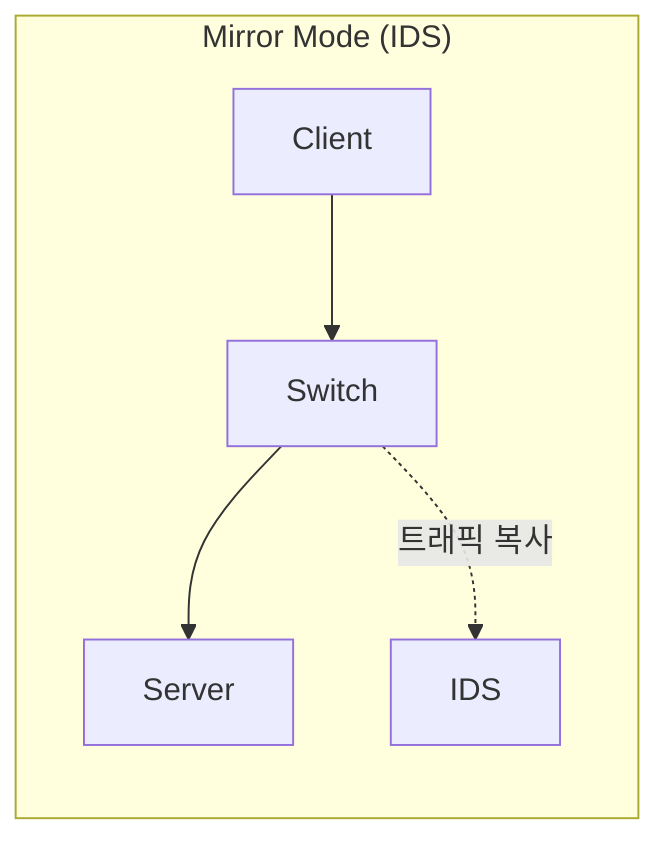
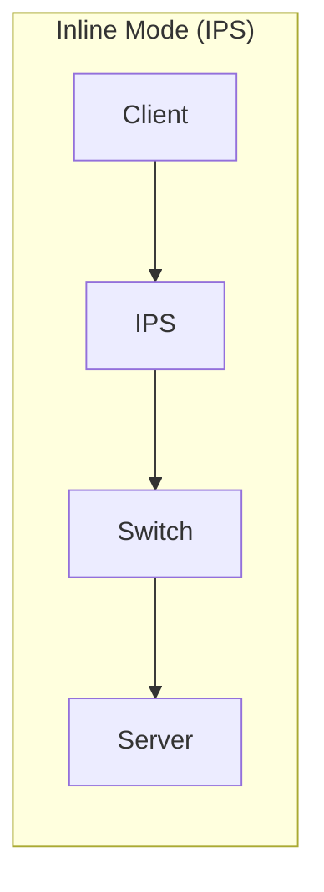

> **이전 편**: [보안 모니터링 3편: Wireshark 패킷 분석](/categories/security/security-monitoring-3-wireshark/)

---

## 1. IDS vs IPS 개념

| 구분 | IDS (Intrusion Detection System) | IPS (Intrusion Prevention System) |
|------|----------------------------------|-----------------------------------|
| 역할 | 침입 **탐지** | 침입 **차단** |
| 동작 | 이상 징후 발견 시 알람 | 이상 징후 발견 시 차단 + 기록 |
| 배치 | Mirror Mode (트래픽 복사) | Inline Mode (트래픽 경유) |
| 장점 | 오탐 시에도 서비스 영향 없음 | 실시간 차단 가능 |
| 단점 | 실시간 차단 불가 | 오탐 시 정상 트래픽도 차단 |

**쉽게 비유하면**:
- IDS: 어제까지 떠들다가 오늘 갑자기 조용해지면 "뭔가 이상하다" 알람
- IPS: 팔다리가 잘렸다(심각한 룰 위반) → 즉시 차단

> **실무 선택 기준**: 인원이 충분하고 오탐 DB가 확실하면 IPS, 그렇지 않으면 IDS가 안전

---

## 2. Mirror Mode vs Inline Mode





**Mirror Mode (미러 모드)**:
- 트래픽을 **복사**해서 IDS에 전달
- 실제 통신에 영향 없음
- 스위치/라우터에 부하 발생
- VMware에서는 VMnet8이 자동으로 미러링 수행

**Inline Mode (인라인 모드)**:
- 모든 트래픽이 IPS를 **경유**
- TAP 장비 사용
- 실시간 차단 가능하지만 장애 시 전체 네트워크 영향

**미러링 포트 특징**:
- 미러링 포트로는 **ping이 안 나감** (정상 동작)
- 미러링 포트는 캡처 전용, 통신 불가
- "IDS로 ping 안 나가요" → 정상. 잘 캡처하고 있는 것

**Cisco 스위치에서의 용어**:
- Mirror = **SPAN** (Switched Port Analyzer)

---

## 3. Snort vs Suricata

| 구분 | Snort | Suricata |
|------|-------|----------|
| 개발 | Cisco (Sourcefire) | OISF |
| 멀티스레드 | X (단일 스레드) | O (멀티코어 지원) |
| 성능 | 보통 | 우수 |
| 규칙 호환 | Snort 규칙 | Snort 규칙 호환 |

> Security Onion에서는 **Suricata**를 기본으로 사용 (성능 우수)

---

## 4. 규칙 구조

```
[Action] [Protocol] [Src IP] [Src Port] -> [Dst IP] [Dst Port] (Options)
```

**예시**:
```
alert tcp $EXTERNAL_NET any -> $HOME_NET 80 (msg:"Web Attack"; content:"/etc/passwd"; sid:3000001; rev:1;)
```

---

## 5. 규칙 파일 위치 (Security Onion)

| 파일 | 경로 | 설명 |
|------|------|------|
| 기본 규칙 | `/etc/nsm/rules/downloaded.rules` | 제공되는 스노트 규칙 |
| 사용자 규칙 | `/etc/nsm/rules/local.rules` | 직접 작성하는 규칙 |
| 설정 파일 | `/etc/nsm/templates/snort/snort.conf` | 스노트 설정 |
| 분류 정의 | `/etc/nsm/센서명/classification.config` | classtype 정의 |
| 참조 정의 | `/etc/nsm/센서명/reference.config` | reference 정의 |

---

## 6. Action (행동)

| Action | 설명 |
|--------|------|
| `alert` | 로그 기록 + 경고 발생 |
| `log` | 로그 파일에만 기록 |
| `pass` | 패킷 무시 (특정 대역 제외 시) |
| `drop` | 패킷 차단 + 기록 (IPS, Inline 모드) |
| `reject` | drop + TCP RST 또는 ICMP Unreachable 전송 |
| `sdrop` | 차단만 하고 로그 기록 안 함 |

---

## 7. IP 주소 지정

| 표현 | 설명 |
|------|------|
| `any` | 모든 IP |
| `192.168.1.1` | 특정 IP (= /32) |
| `192.168.1.0/24` | 특정 대역 |
| `!192.168.1.0/24` | 특정 대역 제외 |
| `[192.168.1.0/24, 10.0.0.0/8]` | 여러 대역 지정 |
| `$HOME_NET` | 내부 IP 변수 |
| `$EXTERNAL_NET` | 외부 IP 변수 |
| `$HTTP_SERVERS` | 웹 서버 변수 |

---

## 8. 포트 지정

| 표현 | 설명 |
|------|------|
| `any` | 모든 포트 |
| `80` | 특정 포트 |
| `1:1024` | 1~1024 포트 범위 |
| `!80` | 80 제외 |
| `!1:1000` | 1~1000 제외 |

---

## 9. 일반 옵션 (General Options)

| 옵션 | 설명 | 예시 |
|------|------|------|
| `msg` | 경고 메시지 | `msg:"SQL Injection Detected";` |
| `sid` | 규칙 식별자 (3000000 이상 사용) | `sid:3000001;` |
| `rev` | 규칙 버전 (수정 시 증가) | `rev:1;` |
| `priority` | 우선순위 (1:높음 ~ 10:낮음) | `priority:1;` |
| `classtype` | 규칙 분류 | `classtype:web-application-attack;` |
| `reference` | 참조 정보 | `reference:cve,2021-44228;` |

---

## 10. 흐름 옵션 (Flow Options)

| 옵션 | 설명 |
|------|------|
| `flow:to_server` | 클라이언트 → 서버 방향 |
| `flow:to_client` | 서버 → 클라이언트 방향 |
| `flow:established` | 세션이 연결된 상태만 |
| `flow:stateless` | 세션 상태 무관 |

**조합 예시**:
```
flow:to_server,established;
```

---

## 11. 페이로드 옵션 (Payload Options)

| 옵션 | 설명 | 예시 |
|------|------|------|
| `content` | 탐지할 패턴 | `content:"/etc/passwd";` |
| `content` (hex) | 16진수 패턴 | `content:"\|61 62 63\|";` (abc) |
| `nocase` | 대소문자 무시 | `content:"select"; nocase;` |
| `offset` | 탐색 시작 위치 | `offset:5;` |
| `depth` | 탐색 범위 (처음부터) | `depth:100;` |
| `distance` | 이전 매칭 후 탐색 시작 거리 | `distance:10;` |
| `within` | 이전 매칭 후 탐색 종료 거리 | `within:50;` |

**예시 - 연속 패턴 탐지**:
```
content:"abc"; nocase; content:"xyz"; distance:10; within:50;
```
→ "abc" 매칭 후 10~50바이트 내에 "xyz" 있는지 검사

---

## 12. HTTP 관련 옵션

| 옵션 | 설명 |
|------|------|
| `http_method` | HTTP 메소드 (GET, POST 등) |
| `http_uri` | URI 부분 |
| `http_cookie` | 쿠키 값 |
| `http_header` | 요청/응답 헤더 |
| `http_client_body` | 요청/응답 바디 |
| `http_stat_code` | 응답 상태 코드 |
| `http_stat_msg` | 응답 상태 메시지 |

---

## 13. PCRE (정규표현식)

**기본 문법**:
```
pcre:"/패턴/옵션";
```

**옵션**:
| 옵션 | 설명 |
|------|------|
| `i` | 대소문자 무시 |
| `U` | URI 디코딩 |
| `H` | HTTP 헤더에서 검색 |
| `S` | 상태 코드에서 검색 |

### 13.1 정규표현식 메타문자

| 메타문자 | 설명 |
|----------|------|
| `.` | 임의의 문자 하나 |
| `*` | 0번 이상 반복 |
| `+` | 1번 이상 반복 |
| `?` | 0번 또는 1번 |
| `^` | 문자열 시작 |
| `$` | 문자열 끝 |
| `&#124;` | OR 연산 |
| `()` | 그룹화 |
| `[]` | 문자 클래스 |
| `{n}` | 정확히 n번 |
| `{n,}` | n번 이상 |
| `{n,m}` | n~m번 |
| `\\` | 이스케이프 |

### 13.2 정규표현식 클래스

| 클래스 | 설명 |
|--------|------|
| `[abc]` | a, b, c 중 하나 |
| `[a-z]` | 소문자 a~z |
| `[A-Z]` | 대문자 A~Z |
| `[0-9]` | 숫자 0~9 |
| `[A-Za-z0-9]` | 모든 영숫자 |
| `[^0-9]` | 숫자가 아닌 것 |
| `[\f\r\t\n\v]` | 모든 공백 문자 |

### 13.3 정규표현식 예제

| PCRE | 매칭되는 예 |
|------|------------|
| `pcre:"/a.a/"` | aTa, aba, a1a |
| `pcre:"/(one&#124;two) apple/"` | one apple, two apple |
| `pcre:"/boan?/"` | boa, boan |
| `pcre:"/pro*ject/"` | prject, project, prooject |
| `pcre:"/hello+world/"` | helloworld, hellloworld |
| `pcre:"/[A-Z]{3}/"` | ABC, XYZ |
| `pcre:"/[0-9]{4,}/"` | 1234, 99999 |
| `pcre:"/bo{2,4}an/"` | booan, boooan, booooan |
| `pcre:"/union/Ui"` | union, UNION, UniOn |
| `pcre:"/(200&#124;404)/S"` | 200, 404 (상태코드) |
| `pcre:"/select/Hi"` | select (헤더에서, 대소문자 무시) |

---

## 14. 규칙 작성 실습

**문제**: 다음 조건의 규칙을 작성하시오
- 프로토콜: TCP
- 출발지: 192.168.2.0/24 대역
- 목적지: 192.168.2.0/24 대역
- 탐지 패턴: `/etc/passwd` (대소문자 무시)

**정답**:
```
alert tcp 192.168.2.0/24 any -> 192.168.2.0/24 any (msg:"Passwd File Access Attempt"; content:"/etc/passwd"; nocase; sid:202501201; rev:1;)
```

---

## 15. 규칙 적용 방법

```bash
# 1. 규칙 파일 편집
sudo nano /etc/nsm/rules/local.rules

# 2. 규칙 추가 후 저장 (Ctrl+O, Ctrl+X)

# 3. 규칙 업데이트 적용
sudo rule-update

# 문법 오류 시 fail 메시지 출력됨

# 4. 수정 후 재적용
sudo nsm --sensor --restart --only-snort-alert
```

---

## 16. 커스텀 규칙 작성 실습 (상세)

Path Traversal 공격을 탐지하는 실제 규칙을 작성해본다.

### 16.1 규칙 작성

```bash
sudo nano /etc/nsm/rules/local.rules
```

**작성할 규칙**:
```
alert tcp 192.168.2.0/24 any -> 192.168.2.0/24 any (msg:"Snort Option Test - Path Traversal"; content:"/etc/passwd"; nocase; sid:20260121; rev:1;)
```

**규칙 구조 분석**:
| 부분 | 값 | 설명 |
|------|-----|------|
| Action | `alert` | 경고 발생 |
| Protocol | `tcp` | TCP 프로토콜 |
| 출발지 IP | `192.168.2.0/24` | 내부 대역 |
| 출발지 Port | `any` | 모든 포트 |
| 방향 | `->` | 단방향 |
| 목적지 IP | `192.168.2.0/24` | 내부 대역 |
| 목적지 Port | `any` | 모든 포트 |
| msg | `"Snort Option Test..."` | 경고 메시지 |
| content | `"/etc/passwd"` | 탐지할 패턴 |
| nocase | - | 대소문자 무시 |
| sid | `20260121` | 규칙 ID (날짜 권장) |
| rev | `1` | 버전 |

### 16.2 규칙 적용

```bash
# 저장 후 나가기
Ctrl+X → Y → Enter

# 센서 재시작 (규칙 적용)
sudo nsm --sensor --restart --only-snort-alert
```

> 에러 발생 시 오타 확인. 특히 세미콜론(;) 누락 주의.

### 16.3 규칙 테스트

1. ZAP에서 DVWA → File Inclusion 페이지 접속
2. Path Traversal 스캔 실행
3. Security Onion의 Sguil에서 경고 확인
4. 우리가 작성한 `"Snort Option Test..."` 메시지가 뜨면 성공

---

## 17. 부록: Snort SID 범위

| 범위 | 용도 |
|------|------|
| 0 ~ 2,999,999 | 예약됨 (사용 불가) |
| 3,000,000 ~ | 사용자 정의 가능 |

> SID는 날짜로 지정 권장 (예: `20260121`)

---

**다음 편**: [보안 모니터링 5편: ZAP 웹 취약점 진단](/categories/security/security-monitoring-5-zap/)
