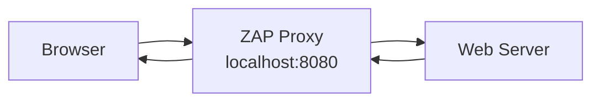
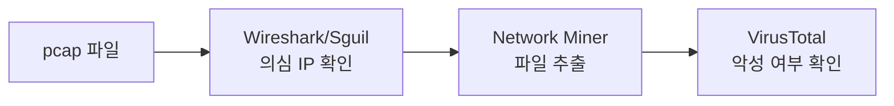

> **이전 편**: [보안 모니터링 4편: Snort/Suricata IDS 규칙 작성](/categories/security/security-monitoring-4-ids-rules/)

---

## 1. ZAP (Zed Attack Proxy) 소개

OWASP에서 개발한 무료 웹 취약점 스캐너. 웹 애플리케이션의 보안 취약점을 자동으로 탐지한다.

**설치 위치**: Windows 10 VM (`사전배포\Utils`)

**사전 요구사항**: Java 설치 및 환경변수 설정 필요

---

## 2. ZAP 초기 설정

### 2.1 폰트 크기 조정

1. ZAP 실행
2. **Tools** → **Options** → **Display**
3. **Font Size** 조정 (12~14 권장)
4. ZAP 재시작하여 적용

---

### 2.2 애드온 업데이트 및 설치

1. **Help** → **Check for Updates**
2. **Installed** 탭: 설치된 애드온 업데이트
3. **Marketplace** 탭: 추가 애드온 설치

**스캔 작업에 필요한 애드온 (체크 권장)**:
- Active Scanner rules
- Passive Scanner rules
- Spider
- Ajax Spider
- Directory Bruteforcer
- SQL Injection Scanner (Beta)

> 한 번에 10개 이상 설치하면 시간이 오래 걸림. 필요한 것만 선택.

---

## 3. 프록시 설정 (Inline Mode)

ZAP이 브라우저와 웹서버 사이에서 트래픽을 가로채려면 프록시 설정이 필요하다.



### 3.1 ZAP 프록시 포트 확인

1. **Tools** → **Options** → **Network** → **Local Servers/Proxies**
2. 기본값: `localhost:8080`

### 3.2 Windows 프록시 설정

1. `Win + R` → `inetcpl.cpl` 입력 → 확인
2. **연결** 탭 → **LAN 설정** 클릭
3. **프록시 서버** 체크:
   - 주소: `localhost`
   - 포트: `8080`
4. 확인 → 확인

> **중요**: ZAP과 브라우저가 같은 Windows VM 안에 있어야 프록시가 동작함. 외부 브라우저 사용 시 미러링/스팬 설정 필요.

---

### 3.3 프록시 동작 확인

1. 브라우저에서 Metasploitable 접속: `http://192.168.2.209`
2. ZAP 하단에 요청이 캡처되는지 확인
3. 클릭할 때마다 ZAP에 기록이 쌓이면 정상

---

## 4. 실습 환경

**공격자**: Windows 10 + ZAP (+ Kali Linux)
**피해자**: Metasploitable v2 (취약한 리눅스)

Metasploitable v2에는 DVWA, phpMyAdmin 등 취약한 웹 애플리케이션이 포함되어 있다.

**Metasploitable 기본 계정**: `msfadmin` / `msfadmin`

---

## 5. 스파이더 (크롤링)

웹사이트의 디렉토리 구조를 자동으로 탐색한다.

### 5.1 기본 스파이더 실행

1. 사이트 맵에서 타겟 (예: DVWA) 우클릭
2. **Attack** → **Spider**
3. **Show Advanced Options** 체크
4. **Depth** 조정 (더 깊이 탐색하려면 값 증가)
5. **Start Scan**

### 5.2 강제 검색 (딕셔너리 어택)

스파이더로 못 찾은 숨겨진 디렉토리를 찾을 때 사용.

1. 사이트 맵에서 타겟 우클릭
2. **Attack** → **Forced Browse Site**
3. 딕셔너리 파일 선택 (일반적인 디렉토리 이름 목록)
4. **Start**

> 404 에러가 많이 발생하면 강제 검색이 동작 중인 것. 없는 디렉토리를 계속 시도하기 때문.

> 강제 검색은 시간이 매우 오래 걸릴 수 있음 (며칠 소요 가능)

---

## 6. 인터셉트 기능

요청을 가로채서 내용을 수정한 후 전송할 수 있다.

### 6.1 인터셉트 활성화

1. ZAP 상단 **녹색 원형 버튼** (Break) 클릭
2. 브라우저에서 폼 제출 등 액션 수행
3. ZAP에서 요청이 멈춤 → 내용 수정 가능
4. **재생 버튼** (Forward) 클릭하여 전송

### 6.2 XSS 테스트 예시

1. DVWA → XSS (Stored) 메뉴
2. Security Level: **Low** 확인
3. 이름/메시지 입력 후 Submit 전에 인터셉트 활성화
4. 메시지 내용을 다른 값으로 변경
5. Forward 클릭
6. 변경된 내용이 저장되는지 확인

---

## 7. 스캔 정책 관리

전체 스캔은 시간이 오래 걸리고 서버에 부하를 줌. 특정 취약점만 스캔하는 정책을 만들어 사용.

### 7.1 SQL Injection 전용 정책 생성

1. **Analyze** → **Scan Policy Manager**
2. 기존 정책 중 Default만 남기고 삭제
3. **Add** 클릭
4. 이름: `SQL_Injection`
5. **Default Threshold**: `Off` 선택 → **Go** (모든 스캔 비활성화)
6. **Injection** 카테고리 클릭
7. SQL Injection 관련 항목만 **Default**로 활성화
8. **OK**

### 7.2 Path Traversal 전용 정책 생성

1. **Add** 클릭
2. 이름: `Path_Traversal`
3. **Default Threshold**: `Off` → **Go**
4. **Server Security** 카테고리 클릭
5. **Path Traversal** 항목만 **Default**로 활성화
6. **OK**

---

### 7.3 정책을 사용한 스캔

1. 사이트 맵에서 타겟 우클릭
2. **Attack** → **Active Scan**
3. **Policy**: 방금 만든 정책 선택 (예: `SQL_Injection`)
   - 안 보이면 **초기화** 버튼 클릭
4. **Start Scan**

> 전체 스캔보다 훨씬 빠르고 정확함

---

## 8. 액티브 스캔 결과 확인

1. 스캔 완료 후 **Alerts** 탭 클릭
2. 취약점 목록 확인 (High, Medium, Low, Informational)
3. 각 항목 클릭 시 상세 설명, 요청/응답 확인 가능
4. 우클릭 → **Open in Browser** 로 실제 공격 결과 확인

**Path Traversal 성공 시**:
- `../../../etc/passwd` 같은 패턴으로 루트까지 접근
- `/etc/passwd` 파일 내용이 보이면 취약점 존재

---

## 9. SQLMap을 이용한 자동 SQL Injection (Kali)

ZAP으로 취약점을 발견한 후, Kali의 SQLMap으로 자동 공격 가능.

### 9.1 사전 준비

1. DVWA Security Level: **Low** 확인
2. SQL Injection 페이지에서 아무 값(예: `1`) 입력 후 Submit
3. 크롬에서 `F12` → **Console** 탭
4. `document.cookie` 입력 → 쿠키 정보 복사
5. URL 주소창에서 타겟 URL 복사

### 9.2 SQLMap 실행 (Kali 터미널)

```bash
# 기본 스캔 (DB 정보 수집)
sqlmap -u "http://192.168.2.209/dvwa/vulnerabilities/sqli/?id=1&Submit=Submit" --cookie="PHPSESSID=xxx; security=low"

# 현재 DB 이름 확인
sqlmap -u "URL" --cookie="쿠키" --current-db

# 테이블 목록 확인
sqlmap -u "URL" --cookie="쿠키" -D dvwa --tables

# 테이블 덤프 (데이터 추출)
sqlmap -u "URL" --cookie="쿠키" -D dvwa -T users --dump
```

### 9.3 SQLMap 실행 흐름

1. `-u` 옵션으로 타겟 URL 지정
2. `--cookie` 옵션으로 세션 쿠키 전달
3. 질문이 나오면 대부분 `Y` (Yes) 입력
4. `--current-db`: DB 이름 알아냄 (예: `dvwa`)
5. `-D dvwa --tables`: 테이블 목록 (예: `users`, `guestbook`)
6. `--dump`: 테이블 내용 추출 + 비밀번호 크래킹

> 실제 환경에서는 DB가 크면 며칠 걸릴 수 있음

---

## 10. FTP로 웹 로그 가져오기

Metasploitable의 Apache 로그를 Windows로 가져와 분석.

### 10.1 Windows CMD에서 FTP 접속

```cmd
ftp 192.168.2.209
# 사용자: msfadmin
# 비밀번호: msfadmin

cd /var/log/apache2
get access.log
bye
```

### 10.2 로그 파일 분석

1. 다운로드된 `access.log`를 Notepad++로 열기
2. `Ctrl + F`로 검색:
   - `../` : Path Traversal 시도
   - `union select` : SQL Injection 시도
   - `Nmap` : Nmap 스캔 흔적
   - `sqlmap` : SQLMap 공격 흔적

---

## 11. 보고서 추출

### 11.1 ZAP 보고서 생성

1. **Report** → **Generate Report**
2. 형식: HTML 또는 XML
3. 저장

### 11.2 상세 보고서 추출

1. Alerts에서 `Ctrl + 클릭`으로 여러 항목 선택
2. 우클릭 → **Report** → **Detail** 선택
3. 메모장에 붙여넣기

> 프로젝트 시 로그는 미리 많이 수집해두기. 나중에 하려면 시간 부족.

---

## 12. Network Miner를 이용한 악성코드 분석

### 12.1 분석 흐름



---

### 12.2 주요 용어

| 용어 | 설명 |
|------|------|
| Landing Page | 피싱/악성코드 유포 페이지 (사용자를 "착륙"시키는 페이지) |
| Exploit Kit (EK) | 취약점을 자동으로 공격하는 도구 모음 |
| C&C (C2) Server | Command & Control 서버, 백도어가 보고하는 서버 |
| Backdoor | 시스템에 숨겨진 원격 접속 통로 |

---

### 12.3 실습: 악성 트래픽 분석

**Step 1: Sguil/Wireshark로 의심 IP 확인**

```
# 의심 IP 확인 후 필터링
ip.addr == 64.20.39.203
```

**Step 2: Network Miner로 파일 추출**

1. Network Miner 실행 (Windows 10)
2. **File** → **Open** → pcap 파일 선택
3. 분석 완료 후 **Hosts** 탭에서 IP 목록 확인
4. 의심 IP 찾기 (예: `64.20.39.203`)
5. **Files** 탭에서 해당 IP로부터 다운로드된 파일 확인
6. 파일 우클릭 → **Open Folder** → 파일 복사

**Step 3: VirusTotal 검사**

1. https://www.virustotal.com 접속
2. **Choose file** → 추출한 파일 업로드
3. 검사 결과 확인:
   - Trojan, Malware 등 탐지 시 악성
   - 탐지율 (예: 45/70) 확인

---

### 12.4 분석 보고서 작성 요령

**포함 내용**:
1. **분석 개요**
   - 분석 환경 (OS, 도구)
   - 분석 대상 (pcap 파일명, 크기)

2. **분석 결과 요약**
   - 공격자 IP
   - 피해자 IP
   - 사용된 공격 기법
   - 탐지된 악성코드

3. **세부 분석 과정**
   - 단계별 스크린샷
   - 사용한 필터/명령어
   - VirusTotal 결과

4. (옵션) **대응 방안**
   - 차단해야 할 IP/도메인
   - 패치가 필요한 취약점

---

## 13. Kali Linux 주요 도구

| 도구 | 용도 |
|------|------|
| Nmap | 포트 스캔, 서비스 탐지 |
| SQLMap | 자동 SQL Injection |
| Metasploit | 익스플로잇 프레임워크 |
| Burp Suite | 웹 프록시, 취약점 스캔 |
| Wireshark | 패킷 분석 |
| John the Ripper | 패스워드 크래킹 |
| Hydra | 브루트포스 공격 |

### 13.1 Nmap 기본 사용법

```bash
# 기본 스캔
nmap 192.168.2.209

# 서비스 버전 탐지
nmap -sV 192.168.2.209

# 전체 포트 스캔
nmap -p- 192.168.2.209

# OS 탐지
nmap -O 192.168.2.209

# 상세 스캔 (서비스 + 스크립트)
nmap -sV -sC 192.168.2.209
```

---

**다음 편**: [보안 모니터링 6편: Splunk 설치 및 SPL 기초](/categories/security/security-monitoring-6-splunk/)
