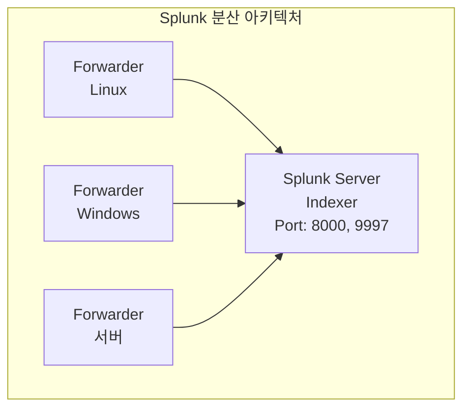

> **이전 편**: [보안 모니터링 5편: ZAP 웹 취약점 진단](/categories/security/security-monitoring-5-zap/)

---

## 1. Splunk 개요 및 아키텍처

### 1.1 Splunk란?

Splunk는 엔터프라이즈급 **빅데이터 수집/인덱싱/분석 플랫폼**이다.

- **가격**: 엔터프라이즈 버전 약 1억원 이상
- **무료 버전**: 일일 분석 데이터 **500MB** 제한
- **SK이노스에서 교육/학습용으로 많이 사용**

### 1.2 아키텍처 구조



| 포트 | 용도 |
|------|------|
| 8000 | Splunk 웹 UI |
| 9997 | Forwarder 수신 |
| 8089 | Splunk REST API |

### 1.3 실습 환경 구성

| 역할 | OS | 용도 |
|------|-----|------|
| Splunk Server | Ubuntu 20.04 | 로그 수집/분석 서버 |
| Forwarder (Linux) | Ubuntu 20.04 | 리눅스 로그 전송 |
| Forwarder (Windows) | Windows 10 | 윈도우 이벤트 로그 전송 |
| 공격자 | Kali Linux | 공격 시뮬레이션 |

### 1.4 사전 준비: VM 클론

```
주의: 클론 후 반드시 MAC 주소 변경!

1. VMware → VM → Manage → Clone
2. Clone type: Full clone (Link clone 하면 안됨!)
3. 부팅 전: Settings → Network Adapter → Advanced → Generate (MAC 변경)
4. 부팅 시 "Copy it" 선택 (Move it 안됨!)
```

**MAC 주소 구조**:
- 앞 24비트: OUI (벤더 ID) - VMware면 `00:0C:29` 등
- 뒤 24비트: 제품 고유 ID

---

## 2. Splunk 서버 설치 (Ubuntu 20.04)

### 2.1 필요 파일

| 파일명 | 용도 |
|--------|------|
| `splunk-8.2.0-e053ef3c985f-linux-2.6-amd64.deb` | Splunk 서버 |
| `splunkforwarder-8.2.0-...-linux-2.6-amd64.deb` | Linux Forwarder |
| `splunkforwarder-8.2.0-...-x64-release.msi` | Windows Forwarder |

### 2.2 설치 절차

**Step 1: 패키지 설치**

```bash
# 바탕화면에 파일 복사 후
cd ~/바탕화면
sudo dpkg -i splunk-8.2.0-e053ef3c985f-linux-2.6-amd64.deb
```

**Step 2: 초기 설정 및 시작**

```bash
# 부팅 시 자동 시작 설정
sudo /opt/splunk/bin/splunk enable boot-start

# 라이선스 동의 화면에서:
# q 눌러서 빠져나와
# y 입력하여 동의

# 관리자 계정 설정
# Username: admin
# Password: 12345678 (최소 8자)

# 상태 확인
/opt/splunk/bin/splunk status

# 시작
/opt/splunk/bin/splunk start
```

**Step 3: 웹 접속**

```
http://[Splunk서버IP]:8000

예: http://192.168.2.212:8000
ID: admin
PW: 12345678
```

> **팁**: 호스트 PC 브라우저에서 접속하면 한글 지원됨

---

## 3. Splunk 기본 사용법

### 3.1 샘플 데이터 업로드

```
1. 설정 → 데이터 추가 → 업로드
2. 파일 선택: tutorialdata.zip
3. 소스 타입: 자동 인식 또는 수동 선택
4. 인덱스 설정:
   - "새 인덱스 만들기" 클릭
   - 이름: test_index
   - 저장
5. 검토 → 제출
```

### 3.2 검색 기본

```
주의: 시간 범위를 "전체 시간"으로 설정!
(과거 데이터는 기본 시간 범위에 안 잡힘)
```

**기본 검색 구조**:
```sql
source="tutorialdata.zip:*" host="ubuntu" index="test_index"
```

### 3.3 소스 타입 (sourcetype) 종류

| sourcetype | 설명 |
|------------|------|
| `access_combined_wcookie` | Apache 웹 로그 (쿠키 포함) |
| `secure-2` | Linux 보안 로그 (/var/log/secure) |
| `vendor_sales` | 사용자 정의 판매 로그 |
| `access_combined` | 일반 Apache 액세스 로그 |

---

## 4. SPL 검색 문법

### 4.1 기본 검색 조건

| 문법 | 설명 | 예시 |
|------|------|------|
| `키워드` | 단어 검색 | `port` |
| `키워드*` | 와일드카드 | `por*` → port, portal 등 |
| `A B` | AND 연산 (둘 다 포함) | `port mongodb` |
| `"A B"` | 정확한 문자열 | `"mongodb from"` |
| `A AND B` | 명시적 AND | `mongodb AND 194.8.74.23` |
| `A OR B` | OR 연산 | `A OR B` |
| `(A OR B)` | 괄호로 우선순위 | `mongodb AND (ip1 OR ip2)` |

### 4.2 실습 예시

```sql
# 기본 검색
source="tutorialdata.zip:*" host="ubuntu" index="test_index" port

# 와일드카드
source="tutorialdata.zip:*" host="ubuntu" index="test_index" por*

# AND 연산
source="tutorialdata.zip:*" host="ubuntu" index="test_index" port mongodb

# 정확한 문자열
source="tutorialdata.zip:*" host="ubuntu" index="test_index" "mongodb from"

# 복합 조건
source="tutorialdata.zip:*" host="ubuntu" index="test_index" mongodb AND (194.8.74.23 OR 85.62.218.82)
```

### 4.3 파이프라인 명령어

```sql
# 테이블 출력
host="*" index="test_index" | table Code, AcctID, sourcetype

# 정렬
host="*" index="test_index" | table Code, AcctID, source, sourcetype | sort Code

# 상위 N개
host="*" index="test_index" | top Code
host="*" index="test_index" | top Code limit=5

# 하위 N개 (희귀값)
host="*" index="test_index" | rare Code limit=5
```

### 4.4 VIP 고객 분석 쿼리 (서브쿼리)

```sql
index=test_index sourcetype=access_* status=200 action=purchase
[ search index=test_index sourcetype=access_* status=200 action=purchase
  | top limit=1 clientip
  | table clientip ]
| stats count AS "Total Purchased",
        dc(productId) AS "Total Products",
        values(product_name) AS "Product Names"
  BY clientip
| rename clientip AS "VIP Customer"
```

**쿼리 해석**:
1. `status=200 action=purchase`: 구매 성공 이벤트
2. 서브쿼리: 가장 많이 구매한 clientip 1개 추출
3. `stats count`: 총 구매 횟수
4. `dc(productId)`: 고유 상품 개수 (distinct count)
5. `values(product_name)`: 구매한 상품 목록

---

## 5. 데이터 조인 (Lookup)

### 5.1 Lookup 개념

두 개의 데이터셋을 **공통 필드**로 연결 (SQL의 JOIN과 유사)

### 5.2 Lookup 설정 (3단계)

**Step 1: Lookup 테이블 파일 업로드**

```
1. 설정 → Lookup → Lookup 테이블 파일 → 새로 추가
2. 파일 선택: prices.csv (압축 해제 필요)
3. 이름: prices
4. 저장
5. 권한 → 모든 앱에서 사용 가능하게 설정
```

**Step 2: Lookup 정의 생성**

```
1. 설정 → Lookup → Lookup 정의 → 새로 추가
2. 이름: prices_lookup
3. Lookup 파일: prices (방금 업로드한 것)
4. 저장
5. 권한 → 모든 앱에서 사용 가능하게 설정
```

**Step 3: 자동 Lookup 설정**

```
1. 설정 → Lookup → 자동 Lookup → 새로 추가
2. 이름: auto_lookup_prices
3. Lookup 테이블: prices_lookup
4. 적용 대상 sourcetype: access_combined_wcookie
5. Lookup 입력 필드: productId (대소문자 주의! I가 대문자)
6. Lookup 출력 필드:
   - product_name → product_name
   - price → price
7. 저장
8. 권한 설정
```

### 5.3 조인 결과 확인

```sql
index="test_index" sourcetype="access_combined_wcookie" product_name=* productId=* price=*
```

조인 성공 시 **price** 필드가 새로 생성됨!

```
# 시간에 따른 평균 가격 확인
필드에서 price 클릭 → "시간에 따른 평균" 선택
```

---

## 6. 보고서 및 대시보드 생성

### 6.1 보고서 저장

```
1. 검색 실행 후 결과 확인
2. 다른 이름으로 저장 → 보고서
3. 제목: VIP 고객 분석
4. 설명: 가장 많이 구매한 고객 분석
5. 저장
```

### 6.2 차트 만들기

```sql
# 상품별 구매 전환율 분석
index="test_index" sourcetype=access_* status=200
| stats
    count AS views,
    count(eval(action="addtocart")) AS addtocart,
    count(eval(action="purchase")) AS purchases
    by product_name
| eval viewsToPurchases = round((purchases/views)*100, 2),
       cartToPurchases = round((purchases/addtocart)*100, 2)
| table product_name, views, addtocart, purchases, viewsToPurchases, cartToPurchases
| rename
    product_name AS "Product Name",
    views AS "Views",
    addtocart AS "Adds To Cart",
    purchases AS "Purchases",
    viewsToPurchases AS "View→Purchase(%)",
    cartToPurchases AS "Cart→Purchase(%)"
```

**차트 저장**:
```
1. 시각화 탭 클릭
2. 차트 유형 선택: 파이, 라인, 막대 등
   - 보안 분야: 파이 차트 선호
   - 인프라/클라우드: 라인/그래프 선호
3. 다른 이름으로 저장 → 보고서
4. 차트 형식 선택 체크
```

### 6.3 대시보드 만들기

```
1. 검색 결과에서: 다른 이름으로 저장 → 대시보드
2. 새 대시보드:
   - 제목: 2026-01-22_홍길동_대시보드
   - 설명: 보안 로그 분석
   - 폴더에 대시보드 선택
3. 저장 → 대시보드 보기
```

**대시보드에 패널 추가**:
```
1. 대시보드 → 편집
2. 패널 추가 → 보고서에서
3. 기존 보고서 선택 (VIP 고객 등)
4. 대시보드에 추가
```

> **포트폴리오 팁**: 보고서/대시보드를 많이 만들어서 캡처하세요!
> "1월 20일 로그", "1월 21일 로그", "새벽 공격 분석" 등으로 다양하게

---

## 7. SPL 명령어 요약

| 명령어 | 설명 | 예시 |
|--------|------|------|
| `table` | 필드 선택 출력 | `&#124; table ip, status` |
| `sort` | 정렬 | `&#124; sort - count` (내림차순) |
| `top` | 상위 N개 | `&#124; top limit=10 clientip` |
| `rare` | 하위 N개 | `&#124; rare limit=5 status` |
| `stats` | 통계 | `&#124; stats count by status` |
| `timechart` | 시간별 차트 | `&#124; timechart span=1h count` |
| `eval` | 계산/조건 | `&#124; eval pct=round(a/b*100,2)` |
| `rename` | 필드명 변경 | `&#124; rename ip AS "IP주소"` |
| `head` | 상위 N개 결과 | `&#124; head 20` |
| `rex` | 정규식 추출 | `&#124; rex "from (?<ip>\d+)"` |

---

## 8. Splunk 서비스 관리

```bash
# 상태 확인
/opt/splunk/bin/splunk status

# 시작
/opt/splunk/bin/splunk start

# 중지
/opt/splunk/bin/splunk stop

# 재시작
/opt/splunk/bin/splunk restart

# 부팅 시 자동 시작 설정
/opt/splunk/bin/splunk enable boot-start

# 리슨 포트 열기
/opt/splunk/bin/splunk enable listen 9997
```

---

**다음 편**: [보안 모니터링 7편: Splunk Forwarder & Wazuh](/categories/security/security-monitoring-7-forwarder-wazuh/)
