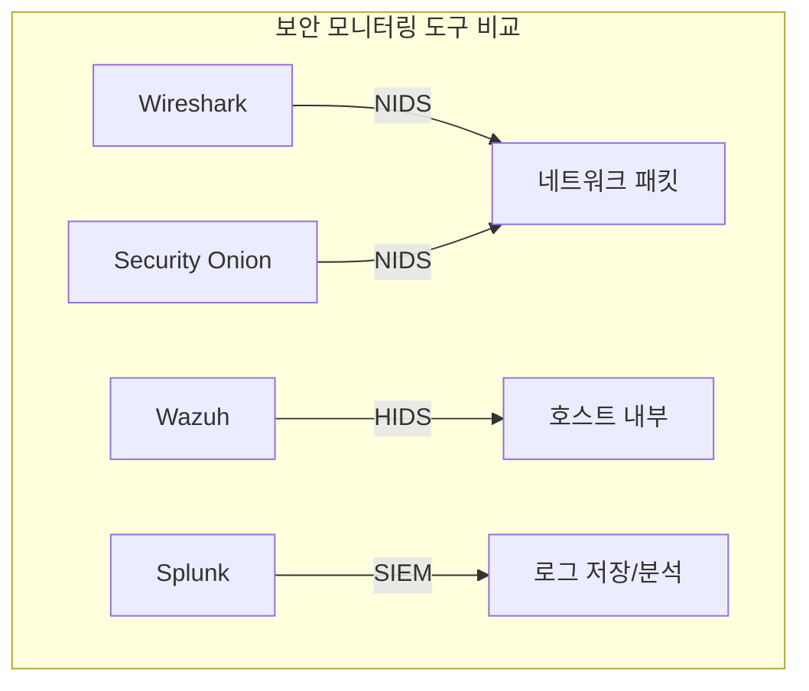

> **이전 편**: [보안 모니터링 6편: Splunk 설치 및 SPL 기초](/categories/security/security-monitoring-6-splunk/)

---

## 1. Linux Forwarder 설치

### 1.1 패키지 설치

```bash
cd ~/바탕화면
sudo dpkg -i splunkforwarder-8.2.0-e053ef3c985f-linux-2.6-amd64.deb
```

### 1.2 초기 설정

```bash
# 재시작
/opt/splunkforwarder/bin/splunk restart

# 부팅 시 자동 시작
/opt/splunkforwarder/bin/splunk enable boot-start
# q → y → admin / 12345678

# Splunk 서버 연결
/opt/splunkforwarder/bin/splunk add forward-server 192.168.2.212:9997
# admin / 12345678 입력
```

### 1.3 모니터링 설정 (inputs.conf)

```bash
sudo nano /opt/splunkforwarder/etc/system/local/inputs.conf
```

```ini
[default]
host = 192.168.2.212

[monitor:///var/log/auth.log]
disabled = false
index = waf
sourcetype = access_combined

[monitor:///var/log/nginx/access.log]
disabled = false
index = web
sourcetype = access_combined

[monitor:///var/log/ufw.log]
disabled = false
index = main
sourcetype = access_combined
```

### 1.4 재시작

```bash
/opt/splunkforwarder/bin/splunk restart
```

---

## 2. Splunk 서버에서 수신 설정

```
1. 설정 → 인덱스 → 새 인덱스 만들기
2. 인덱스 생성:
   - web (웹 로그용)
   - waf (인증 로그용)
3. 설정 → 데이터 전달 및 수신 → 수신 구성
4. 새로 추가 → 포트: 9997
```

---

## 3. Windows Forwarder 설치

### 3.1 설치 전 준비

```
1. 검색창에서 inetcpl.cpl 입력
2. 인터넷 속성 → 연결 → LAN 설정
3. 프록시 서버 체크 해제
```

### 3.2 Forwarder 설치

1. `splunkforwarder-8.2.0-...-x64-release.msi` 더블클릭
2. 라이선스 동의 체크
3. **On-Premises** 선택 (기본값)
4. SSL 설정: 스킵 (Next)
5. 로그 수집 대상: **Windows Event Logs만 체크**
   - Application
   - System
   - Security

> **팁**: 모든 로그를 선택하면 파싱할 데이터가 너무 많아짐

6. 관리자 계정:
   - Username: admin
   - Password: 12345678

7. **Receiving Indexer** (중요!):
   - `192.168.2.212:9997` (본인 Splunk 서버)

8. Deployment Server: Splunk 서버 주소 입력 (또는 스킵)

### 3.3 감사 정책 설정

```
1. 검색창: 로컬 보안 (띄어쓰기 필수)
2. 로컬 보안 정책 → 로컬 정책 → 감사 정책
3. 각 항목 더블클릭 → 성공/실패 모두 체크 → 적용
```

설정할 항목:
- 계정 로그온 이벤트 감사
- 계정 관리 감사
- 로그온 이벤트 감사
- 개체 액세스 감사
- 정책 변경 감사
- 권한 사용 감사
- 시스템 이벤트 감사

### 3.4 inputs.conf 작성

경로: `C:\Program Files\SplunkUniversalForwarder\etc\system\local\inputs.conf`

```ini
[default]
host = DESKTOP-2L7DUQ

[WinEventLog://Application]
disabled = 0
index = main

[WinEventLog://System]
disabled = 0
index = main

[WinEventLog://Security]
disabled = 0
index = main
current_only = 0
checkpointInterval = 5
```

> **호스트 이름 확인**: 검색창 → 시스템 정보 → 시스템 이름

### 3.5 서비스 재시작

```cmd
# CMD (관리자)
"C:\Program Files\SplunkUniversalForwarder\bin\splunk.exe" restart

# 포트 변경 여부 → No 입력
```

또는:
```
1. 검색창: 서비스
2. SplunkForwarder 찾기
3. 우클릭 → 다시 시작
```

---

## 4. 공격 로그 발생 (PowerShell)

호스트 PC(Windows 11)에서 PowerShell 관리자 권한으로 실행:

### 4.1 대량 GET 요청

```powershell
$target = "http://192.168.2.213/"
for ($i = 1; $i -le 100; $i++) {
    try {
        Invoke-WebRequest -Uri $target -UseBasicParsing | Out-Null
        Write-Host "REQ $i"
    } catch {
        Write-Host "Error on $i"
    }
    Start-Sleep -Milliseconds 50
}
```

> **주의**: URL 끝에 `/` 슬래시 반드시 포함!

### 4.2 경로 스캐너 (404 유발)

```powershell
$base = "http://192.168.2.213"
$paths = @("/", "/index.html", "/health",
           "/notfound1", "/admin/login", "/phpmyadmin/", "/.env")

for ($i = 1; $i -le 2000; $i++) {
    $path = $paths[(Get-Random -Minimum 0 -Maximum $paths.Count)]
    $url = "$base$path"
    try {
        Invoke-WebRequest -Uri $url -UseBasicParsing | Out-Null
        Write-Host "$i : $url"
    } catch {
        Write-Host "$i : ERROR $url"
    }
    Start-Sleep -Milliseconds 20
}
```

### 4.3 SQL Injection / XSS 시도

```powershell
$base = "http://192.168.2.213"
$payloads = @(
    "/?id=1",
    "/?id=1%20OR%201=1",
    "/?q=<script>alert(1)</script>",
    "/?file=../../etc/passwd",
    "/login.php?user=admin'--",
    "/search.php?q=union+select+1,2,3"
)

for ($i = 1; $i -le 500; $i++) {
    $path = Get-Random -InputObject $payloads
    $url = "$base$path"
    try {
        Invoke-WebRequest -Uri $url -UseBasicParsing | Out-Null
        Write-Host "$i : $url"
    } catch {
        Write-Host "$i : ERROR $url"
    }
}
```

### 4.4 RDP 로그인 실패 공격 (Kali)

```bash
# xfreerdp3 설치
sudo apt install freerdp3 -y

# 15회 로그인 실패 시도
for i in {1..15}; do
    echo "Try $i"
    xfreerdp3 /v:192.168.2.xxx /u:fakeuser /p:WrongPass123! /cert:ignore
done
```

---

## 5. Splunk 로그 검색 실습

### 5.1 Linux Forwarder 로그 검색

**HTTP 상태 코드 통계**
```sql
index=web sourcetype="access_combined"
| stats count as hits by status
| sort - hits
```

**IP별 접속 횟수 (상위 20개)**
```sql
index=web sourcetype="access_combined"
| stats count as hits by clientip
| sort - hits
| head 20
```

**404 에러 URI (스캐너 탐지)**
```sql
index=web sourcetype="access_combined" status=404
| stats count as notfound_cnt by uri
| sort - notfound_cnt
| head 20
```

**시간별 상태 코드 추이**
```sql
index=web sourcetype="access_combined"
| timechart span=1m count by status
```

**SQL Injection / XSS 탐지**
```sql
index=web sourcetype="access_combined"
("union select" OR "select * from" OR "etc/passwd" OR "<script" OR "%3Cscript%3E")
| stats count by clientip, uri
| sort - count
```

**SSH 로그인 실패 탐지**
```sql
index=waf sourcetype="access_combined" "Failed password"
| rex "from (?<src_ip>\d+\.\d+\.\d+\.\d+)"
| stats count as fail_cnt by src_ip
| sort - fail_cnt
| head 20
```

### 5.2 Windows Forwarder 로그 검색

**소스별 이벤트 수**
```sql
index=* host="DESKTOP-2L7DUQ"
| stats count by source sourcetype
```

**이벤트 코드별 통계**
```sql
index=* host="DESKTOP-2L7DUQ" source="WinEventLog:Security"
| stats count by EventCode
| sort - count
```

**로그온 실패 이벤트 (EventCode 4625)**
```sql
index=* host="DESKTOP-2L7DUQ" source="WinEventLog:Security" EventCode=4625
| table _time EventCode Account_Name Message
| sort _time
```

### 5.3 주요 Windows 이벤트 코드

| EventCode | 설명 |
|-----------|------|
| 4624 | 로그온 성공 |
| 4625 | **로그온 실패** |
| 4634 | 로그오프 |
| 4648 | 명시적 원격 증명 로그온 |
| 4672 | 특수권한 할당 |
| 4673 | 권한 있는 서비스 호출 |
| 4688 | 새 프로세스 생성 |
| 4720 | 사용자 계정 생성 |
| 4726 | 사용자 계정 삭제 |

---

## 6. Wazuh 개요 및 환경 구축

### 6.1 Wazuh란?

- **위협 헌팅(Threat Hunting)**에 사용하는 **호스트 기반 IDS**
- **블루팀**이 주로 사용하는 시스템
- 침입 후 조사/모니터링 용도

### 6.2 Wazuh vs Splunk vs Security Onion



| 도구 | 유형 | 용도 |
|------|------|------|
| **Wireshark** | NIDS (네트워크) | 패킷 캡처/분석 |
| **Security Onion** | NIDS (네트워크) | 네트워크 트래픽 모니터링 |
| **Wazuh** | HIDS (호스트) | 호스트 내부 모니터링 |
| **Splunk** | SIEM | 로그 저장/분석/시각화 |

### 6.3 IDS vs IPS 개념

| 구분 | IDS | IPS |
|------|-----|-----|
| 역할 | 침입 **탐지** | 침입 **방지** |
| 동작 | 알려진 공격 패턴 감지 | 이상 행위 감지 및 차단 |
| 비유 | "목이 잘리면 죽은 것" (이미 일어난 사건) | "어제까지 잘 다녔는데 오늘 왜 안 와?" (이상 감지) |
| 특징 | - | 제로데이 공격 방어 가능 |

### 6.4 Wazuh 환경 구성

**IP 고정 계획**

| 역할 | IP | 호스트명 |
|------|-----|----------|
| Wazuh Server | 192.168.2.10 | wazuh-server |
| Wazuh Agent 1 | 192.168.2.11 | wazuh-agent1 |
| Wazuh Agent 2 | 192.168.2.12 | wazuh-agent2 |
| Windows 10 | 192.168.2.13 | (나중에) |

### 6.5 VM 클론 및 설정

**Step 1: 클론 생성**

```
1. VMware → 원본 Ubuntu 20.04 선택
2. VM → Manage → Clone
3. Clone type: Full clone (Link clone 안됨!)
4. 이름: wazuh-server (또는 wazuh-agent1, wazuh-agent2)
5. 저장 위치 지정
```

**Step 2: MAC 주소 변경 (부팅 전!)**

```
1. 클론된 VM 선택 → Settings
2. Network Adapter → Advanced
3. MAC Address → Generate 클릭
4. OK
```

**Step 3: 호스트명 변경 (부팅 후)**

```bash
# 호스트명 변경
sudo hostnamectl set-hostname wazuh-server

# 확인
hostname

# 재부팅 필요
sudo reboot
```

**Step 4: IP 고정 (Netplan)**

```bash
# 설정 파일 확인
ls /etc/netplan/

# 편집 (파일명은 다를 수 있음)
sudo nano /etc/netplan/01-netcfg.yaml
```

**YAML 파일 내용** (들여쓰기 2칸 중요!):

```yaml
network:
  version: 2
  renderer: networkd
  ethernets:
    ens33:
      dhcp4: no
      addresses:
        - 192.168.2.10/24
      gateway4: 192.168.2.2
      nameservers:
        addresses:
          - 8.8.8.8
          - 8.8.4.4
```

> **주의**: YAML은 들여쓰기가 정확해야 함! (탭 X, 스페이스 2칸)

```bash
# 적용
sudo netplan apply

# 오류 시 한 번 더 실행
sudo netplan apply

# IP 확인
ip a
```

### 6.6 Wazuh 설치 스크립트

```bash
# Wazuh 올인원 설치 (Kibana, Elasticsearch 포함)
curl -sO https://packages.wazuh.com/4.x/wazuh-install.sh
sudo bash wazuh-install.sh -a
```

설치 완료 시 포함되는 컴포넌트:
- Wazuh Manager
- Wazuh Indexer (Elasticsearch 기반)
- Wazuh Dashboard (Kibana 기반)

---

## 7. 보안 모니터링 도구 정리

| 도구 | 용도 | 비용 |
|------|------|------|
| **Splunk** | SIEM (로그 분석) | 1억+ (엔터프라이즈) |
| **Wazuh** | HIDS (위협 헌팅) | 무료 |
| **Zabbix** | 인프라 모니터링 | 무료 |
| **Prometheus + Grafana** | 메트릭 모니터링 | 무료 |

> **포트폴리오 팁**: Wazuh는 우리 과정에 없는 도구라 사용 시 주목받을 수 있음!

---

## 8. 부록: 설정 파일 경로

### Linux Forwarder

| 파일 | 경로 |
|------|------|
| inputs.conf | `/opt/splunkforwarder/etc/system/local/inputs.conf` |

### Windows Forwarder

| 파일 | 경로 |
|------|------|
| inputs.conf | `C:\Program Files\SplunkUniversalForwarder\etc\system\local\inputs.conf` |

### Ubuntu IP 설정

| 파일 | 경로 |
|------|------|
| Netplan | `/etc/netplan/01-netcfg.yaml` |

### 로그 파일 위치

| 로그 | 경로 |
|------|------|
| Nginx 액세스 | `/var/log/nginx/access.log` |
| 인증 로그 | `/var/log/auth.log` |
| 방화벽 로그 | `/var/log/ufw.log` |
| SSH 설정 | `/etc/ssh/sshd_config` |

---

## 핵심 포인트 요약

1. **로그 발생**: PowerShell 공격 코드 3개 돌리기 (URL 끝 `/` 주의!)
2. **Windows Forwarder**: Event Logs만 선택, inputs.conf 자동 생성
3. **호스트 이름**: 시스템 정보에서 정확히 확인
4. **이벤트 코드 4625**: 로그온 실패 (보안 분석 핵심)
5. **Wazuh**: HIDS (호스트 기반), 블루팀 위협 헌팅용
6. **VM 클론**: Full clone + MAC 주소 변경 + IP 고정
7. **Netplan**: YAML 들여쓰기 2칸 정확히!

---