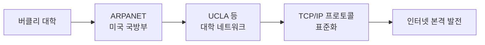
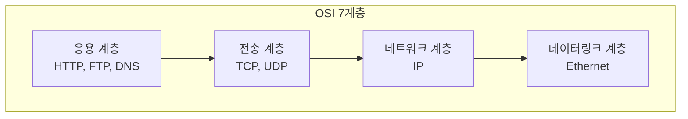
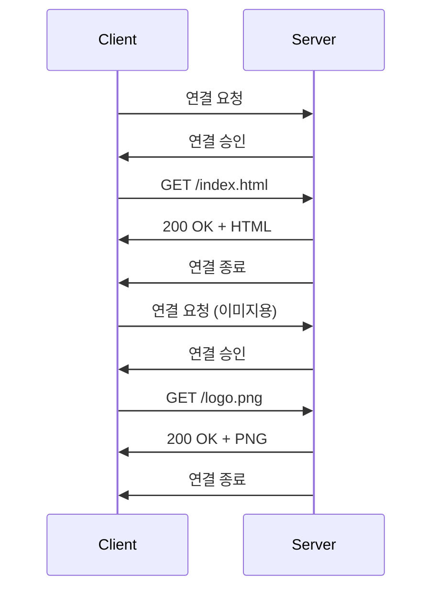
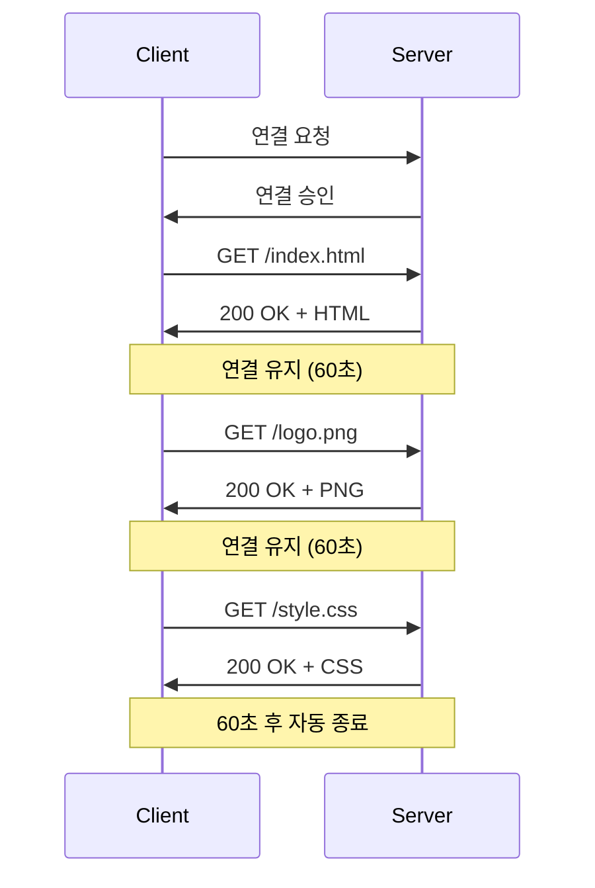
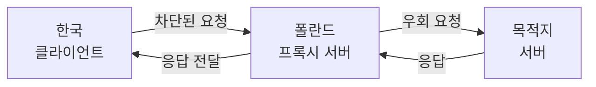
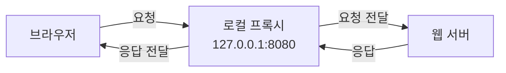
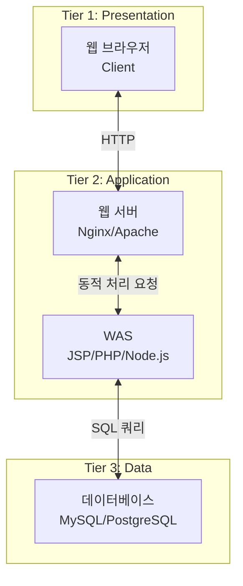
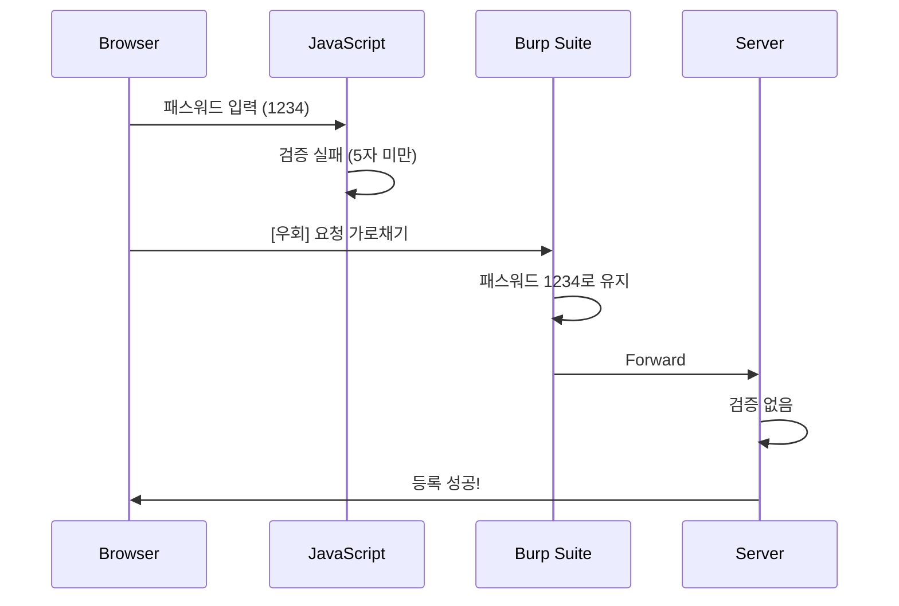

## 전체 흐름 요약

본 강의는 웹 보안의 기초가 되는 인터넷과 HTTP 프로토콜의 동작 원리를 학습합니다. 인터넷의 탄생 배경과 TCP/IP 프로토콜의 기본 개념부터 시작하여, HTTP 요청/응답 구조, 헤더의 역할, GET/POST 메소드의 차이를 이해합니다.

실습에서는 Burp Suite라는 로컬 프록시 도구를 설치하고, 실제 HTTP 트래픽을 가로채어 분석하는 방법을 배웁니다. 이를 통해 쿠키, 세션, User-Agent 등의 헤더가 보안에서 어떤 의미를 갖는지 확인할 수 있습니다.

마지막으로 웹 애플리케이션의 3-Tier 아키텍처(Web Server - WAS - Database)를 이해하고, 클라이언트 사이드 스크립트(CSS)와 서버 사이드 스크립트(SSS)의 차이, 그리고 각 계층에서 발생할 수 있는 보안 취약점을 파악합니다.

---

## Part 1: 인터넷과 프로토콜 기초

### 1.1 인터넷의 탄생과 발전

#### 인터넷의 시작



**핵심 개념:**
- **프로토콜 (Protocol)**: 네트워크 상에서 데이터를 주고받기 위한 약속된 규칙
- **TCP/IP**: 인터넷 통신의 기본 프로토콜로, 신뢰성 있는 데이터 전송을 보장

#### 대한민국의 인터넷 발전

- **1982년**: KIET-서울대 연결, SDN (Service Delivery Network) 시작
- **초기 모뎀 시대**: ADSL, 코넷 서비스를 통한 전화선 기반 인터넷
- **속도 발전**: 초기에는 1MB 이미지 다운로드에 수 시간 소요 → 현재 초고속 인터넷

### 1.2 인터넷 표준화 기구

#### IETF (Internet Engineering Task Force)

**역할**: 인터넷 기술 표준화, RFC 문서 발행

**RFC (Request for Comments)**:
- TCP: RFC 0761
- HTTP: RFC 1945
- 프로토콜의 상세한 동작 방식과 구현 세부사항을 정의한 문서

**RFC 문서 확인 방법:**
```bash
# IETF 데이터 트래커 접속
https://datatracker.ietf.org/

# TCP 검색 예시
검색어: TCP
필터: RFC Documents Only
```

#### ICANN (Internet Corporation for Assigned Names and Numbers)

**역할**: 도메인 이름, DNS, IP 주소 관리

**도메인 계층 구조:**
```
. (루트 서버)
└── kr
    └── co
        └── naver
            └── www
```

**DNS 조회 과정:**
1. 루트 서버(.) → kr 서버 위치 반환
2. kr 서버 → co.kr 서버 위치 반환  
3. co.kr 서버 → naver.co.kr 서버 위치 반환
4. naver.co.kr 서버 → www.naver.co.kr의 IP 주소 반환

**📟 `nslookup` 명령어**

```bash
$ nslookup www.naver.com
Server:  168.126.63.1
Address: 168.126.63.1

Non-authoritative answer:
Name:    www.naver.com.nheos.com
Addresses:  223.130.195.200
          223.130.195.95
```

#### IANA (Internet Assigned Numbers Authority)

**역할**: IP 주소 할당 및 관리

#### W3C (World Wide Web Consortium)

**역할**: 웹 표준화 추진 (HTML, CSS 등)

**표준 준수 확인:**
- 웹 페이지 소스 보기 시 W3C 주석 확인 가능
- 브라우저별 호환성 문제는 W3C 표준 미준수가 주요 원인

---

## Part 2: HTTP 프로토콜의 이해

### 2.1 HTTP 기본 개념

#### HTTP (HyperText Transfer Protocol)

**정의**: 웹 서버와 클라이언트 간 데이터를 주고받기 위한 응용 계층 프로토콜

**버전:**
- HTTP/0.9: 초기 버전, 단순 읽기만 지원
- HTTP/1.0: GET, HEAD, POST 메소드 추가
- **HTTP/1.1**: 현재 가장 많이 사용, Keep-Alive 기능
- HTTP/2.0: 멀티미디어 강화

### 2.2 TCP/IP와 HTTP의 관계

**편지 봉투 비유:**
- **IP**: 보내는 주소와 받는 주소 (목적지)
- **TCP**: 전송 방식 (일반우편 vs 등기우편)
- **HTTP**: 편지 내용 (실제 데이터)



**TCP 특징:**
- 연결 지향형 (Connection-oriented)
- 신뢰성 보장 (수신 확인)
- 3-Way Handshake로 연결 설정

**UDP 특징:**
- 비연결형 (Connectionless)
- 신뢰성 미보장 (수신 확인 없음)
- 빠른 전송 속도

### 2.3 HTTP Request 구조

#### Request Line

```http
GET / HTTP/1.1
```

**구성 요소:**
- **Method**: GET (요청 방식)
- **URL**: / (루트 경로)
- **Version**: HTTP/1.1 (프로토콜 버전)

#### Request Headers

```http
Host: www.google.com
User-Agent: Mozilla/5.0 (Windows NT 10.0; Win64; x64)
Accept: text/html,application/xhtml+xml
Accept-Encoding: gzip, deflate
Cookie: session_id=abc123xyz
Connection: keep-alive
```

**주요 헤더 설명:**

| 헤더 | 역할 | 보안 측면 |
|------|------|----------|
| `Host` | 요청 대상 도메인 | 외부 링크 필터링에 사용 |
| `User-Agent` | 브라우저 정보 | 자동화 탐지, 로그 분석 |
| `Accept` | 허용 MIME 타입 | 파일 업로드 검증 |
| `Accept-Encoding` | 압축 방식 | gzip 등으로 전송량 절감 |
| `Cookie` | 세션 정보 | 인증/인가, 세션 유지 |
| `Connection` | 연결 유지 | Keep-Alive로 성능 향상 |

#### Accept 헤더와 MIME 타입

**MIME 타입 예시:**
```
text/html
text/plain
image/jpeg
image/png
application/json
application/pdf
```

**보안 이슈: 파일 업로드 우회**

악의적 사용자가 실행 파일을 업로드할 때:
1. 클라이언트: `Accept: image/jpeg`로 헤더 조작
2. 서버: Accept 헤더만 검증 → 업로드 허용
3. 결과: 랜섬웨어 등 악성 파일 업로드 성공

**대응 방법:**
- 서버 측에서 파일 확장자와 실제 내용 모두 검증
- Magic Number (파일 시그니처) 확인
- 업로드 파일 격리 및 스캔

### 2.4 HTTP Response 구조

#### Status Line

```http
HTTP/1.1 200 OK
```

**구성 요소:**
- **Version**: HTTP/1.1
- **Status Code**: 200 (상태 코드)
- **Reason Phrase**: OK (상태 설명)

#### 상태 코드 분류

| 범위 | 의미 | 대표 예시 |
|------|------|----------|
| 1xx | 임시 응답 | 180 Ringing (통화 연결 중) |
| 2xx | 성공 | 200 OK, 201 Created |
| 3xx | 리다이렉션 | 301 Moved Permanently, 304 Not Modified |
| 4xx | 클라이언트 오류 | 400 Bad Request, 403 Forbidden, 404 Not Found |
| 5xx | 서버 오류 | 500 Internal Server Error |

**자주 보는 상태 코드:**

```http
200 OK                  # 정상 처리
304 Not Modified        # 캐시된 리소스 사용
400 Bad Request         # 잘못된 요청 (파라미터 오류)
403 Forbidden           # 접근 권한 없음
404 Not Found           # 리소스 없음
500 Internal Server Error  # 서버 내부 오류 (코드 오류)
```

#### Response Headers

```http
HTTP/1.1 200 OK
Date: Mon, 16 Dec 2024 09:00:00 GMT
Content-Type: text/html; charset=UTF-8
Content-Length: 112239
Set-Cookie: session_id=xyz789; Expires=Mon, 16 Dec 2024 19:00:00 GMT
Cache-Control: private, max-age=0
Pragma: no-cache
Connection: close
```

**주요 헤더 설명:**

| 헤더 | 역할 |
|------|------|
| `Date` | 서버 응답 시간 |
| `Content-Type` | 응답 데이터 형식 |
| `Content-Length` | 응답 본문 크기 (바이트) |
| `Set-Cookie` | 쿠키 설정 |
| `Cache-Control` | 캐시 정책 |
| `Pragma` | 캐시 제어 (하위 호환) |

#### Content-Length와 메시지 본문

```http
Content-Length: 112239

<!DOCTYPE html>
<html>
<head>
    <title>Example</title>
</head>
<body>
    <h1>Hello, World!</h1>
</body>
</html>
```

**구조:**
- 헤더 끝: 빈 줄 2개 (CRLF CRLF)
- 본문 시작: Content-Length만큼의 데이터

### 2.5 GET vs POST 메소드

#### GET 메소드

**특징:**
- URL에 파라미터 포함
- 데이터가 노출됨
- 텍스트만 전송 가능
- 길이 제한 있음 (브라우저별 상이)

**예시:**
```http
GET /search?id=363&page=10 HTTP/1.1
Host: www.example.com
```

**구조:**
- `?`: 파라미터 시작
- `&`: 파라미터 구분
- `=`: 이름-값 구분

**보안 문제:**
```http
GET /login?username=admin&password=1234 HTTP/1.1
```
- 브라우저 히스토리에 저장
- 서버 로그에 기록
- 네트워크 모니터링으로 노출

#### POST 메소드

**특징:**
- 메시지 본문(Body)에 데이터 포함
- URL에 노출되지 않음
- 바이너리 파일 전송 가능
- 길이 제한 없음

**예시:**
```http
POST /login HTTP/1.1
Host: www.example.com
Content-Type: application/x-www-form-urlencoded
Content-Length: 29

username=admin&password=5678
```

#### GET vs POST 비교표

| 구분 | GET | POST |
|------|-----|------|
| 데이터 위치 | URL | Body |
| 보안성 | 낮음 (노출) | 높음 (상대적) |
| 전송 가능 타입 | 텍스트만 | 텍스트 + 바이너리 |
| 길이 제한 | 있음 | 없음 |
| 캐싱 | 가능 | 불가능 |
| 용도 | 조회 | 등록/수정/삭제 |

### 2.6 Keep-Alive와 세션 관리

#### Keep-Alive 동작 원리

**HTTP/1.0 (Keep-Alive 없음):**


**HTTP/1.1 (Keep-Alive 적용):**


**장점:**
- 3-Way Handshake 횟수 감소
- 서버 리소스 절약
- 페이지 로딩 속도 향상

**세션 확인:**
```bash
$ netstat -an | more

Active Connections

  Proto  Local Address          Foreign Address        State
  TCP    127.0.0.1:8080         0.0.0.0:0              LISTENING
  TCP    192.168.0.10:49152     93.184.216.34:80      ESTABLISHED
  TCP    192.168.0.10:49153     93.184.216.34:443     ESTABLISHED
```

**상태 설명:**
- `LISTENING`: 서비스 대기 중 (서버 포트)
- `ESTABLISHED`: 연결됨
- `TIME_WAIT`: 연결 종료 대기
- `CLOSE_WAIT`: 상대방 종료 대기

#### 쿠키와 세션

**쿠키 설정 (Response):**
```http
Set-Cookie: session_id=abc123xyz; Expires=Mon, 16 Dec 2024 19:00:00 GMT; Path=/; HttpOnly; Secure
```

**쿠키 전송 (Request):**
```http
Cookie: session_id=abc123xyz
```

**보안 속성:**
- `HttpOnly`: JavaScript 접근 차단 (XSS 방어)
- `Secure`: HTTPS에서만 전송
- `SameSite`: CSRF 방어

**세션 하이재킹:**
1. 공격자가 쿠키 값 탈취
2. 자신의 브라우저에 쿠키 설정
3. 피해자 계정으로 로그인

**대응 방법:**
- 세션 ID 예측 불가능하게 생성
- HTTPS 사용 (암호화)
- 세션 타임아웃 설정
- IP 주소 검증

---

## Part 3: Burp Suite를 활용한 패킷 분석

### 3.1 로컬 프록시 개념

#### 프록시 (Proxy) 란?

**역할**: 클라이언트와 서버 사이에서 요청/응답을 중계하는 중간 서버

**프록시 유형:**

1. **웹 프록시 (우회 접속용)**


2. **로컬 프록시 (분석용)**


### 3.2 Burp Suite 설치 및 설정

#### 설치

1. **다운로드**
```
https://portswigger.net/burp/communitydownload
```

2. **설치 과정**
```
1. Burp Suite Installer 실행
2. Next > Next > Install
3. Finish
```

3. **실행**
```
시작 메뉴 > Burp Suite Community Edition
> Temporary project > Start Burp
```

#### 프록시 설정

**Burp Suite 설정:**
```
Proxy > Intercept > Intercept is off
[버튼 클릭]
Intercept is on
```

**브라우저 프록시 설정 (Windows):**
```
1. 설정 > 네트워크 및 인터넷 > 프록시
2. 수동 프록시 설정
   - 주소: 127.0.0.1
   - 포트: 8080
3. 저장
```

**포트 확인:**
```bash
$ netstat -an | findstr 8080
TCP    127.0.0.1:8080         0.0.0.0:0              LISTENING
```

#### Burp Browser 사용

**장점:**
- 별도의 프록시 설정 불필요
- Burp Suite와 자동 연동

**실행 방법:**
```
Burp Suite > Proxy > Open browser
```

### 3.3 HTTP 트래픽 가로채기

#### Intercept 활성화

```
Proxy > Intercept > Intercept is on
```

#### 요청 가로채기

**가로챈 요청 예시:**
```http
GET / HTTP/1.1
Host: www.hanbit.co.kr
User-Agent: Mozilla/5.0 (Windows NT 10.0; Win64; x64) AppleWebKit/537.36
Accept: text/html,application/xhtml+xml,application/xml;q=0.9,*/*;q=0.8
Accept-Language: ko-KR,ko;q=0.9,en-US;q=0.8,en;q=0.7
Accept-Encoding: gzip, deflate
Cookie: session_id=abc123
Connection: keep-alive
```

**조작 가능한 부분:**
- Method (GET → POST)
- URL
- 모든 헤더 값
- 쿠키

#### Forward와 Drop

**Forward**: 조작한 요청을 서버로 전송
**Drop**: 요청 폐기
**Forward All**: 모든 대기 중인 요청 일괄 전송

#### HTTP History 확인

```
Proxy > HTTP history
```

**확인 가능한 정보:**
- Request: 전송한 요청 내용
- Response: 받은 응답 내용
- 상태 코드
- Content-Type
- Content-Length

### 3.4 실전 공격 시나리오

#### 시나리오 1: 패스워드 규칙 우회

**상황:**
- 클라이언트: JavaScript로 "5자 이상" 검증
- 서버: 검증 누락

**공격 과정:**
1. 패스워드 입력: `12345`
2. JavaScript 검증 통과
3. Burp Suite에서 가로채기
4. 패스워드 수정: `12345` → `1234`
5. Forward
6. 서버: `1234` 등록 (4자!)

**대응:**
- 서버 측에서도 동일한 검증 수행
- 클라이언트 검증은 UX 향상 목적
- 서버 검증이 최종 방어선

#### 시나리오 2: 세션 하이재킹

**공격 과정:**
1. HTTP History에서 쿠키 확인
```http
Cookie: session_id=abc123xyz; user_role=admin
```

2. 다른 브라우저 개발자 도구에서 쿠키 설정
```javascript
document.cookie = "session_id=abc123xyz; user_role=admin";
```

3. 페이지 새로고침
4. 로그인 우회 성공

**대응:**
- HttpOnly 플래그 사용
- 세션 ID에 IP 주소 바인딩
- 세션 타임아웃 설정

#### 시나리오 3: 파일 업로드 우회

**상황:**
- 갤러리에 이미지만 업로드 가능
- 서버: Accept 헤더만 검증

**공격 과정:**
1. 랜섬웨어 파일 준비: `malware.exe`
2. 업로드 요청 가로채기
3. Accept 헤더 조작
```http
Accept: application/octet-stream

Accept: image/jpeg
```
4. Forward
5. 서버: 이미지로 인식하여 업로드 허용

**대응:**
- 파일 확장자 검증
- Magic Number (파일 시그니처) 확인
- 업로드 디렉토리 실행 권한 제거

---

## Part 4: 웹 애플리케이션 아키텍처

### 4.1 3-Tier 아키텍처

#### 계층 구조



#### 각 계층의 역할

**Tier 1: 웹 서버 (Web Server)**
- 정적 파일 서비스 (HTML, CSS, JS, 이미지)
- 프록시 역할 (요청을 WAS로 전달)
- 로드 밸런싱

**Tier 2: WAS (Web Application Server)**
- 동적 콘텐츠 생성
- 비즈니스 로직 처리
- 데이터베이스 연동

**Tier 3: 데이터베이스 (Database)**
- 데이터 저장/조회/수정/삭제
- 트랜잭션 관리
- 데이터 무결성 보장

### 4.2 서버 측 기술 스택

#### 웹 서버 비교

| 웹 서버 | 특징 | 장점 | 단점 | 점유율 |
|---------|------|------|------|--------|
| Nginx | 고성능 비동기 처리 | 빠름, 설정 간단 | - | 1위 (35%) |
| Apache | 전통적 표준 | 안정성, 풍부한 모듈 | 상대적으로 느림 | 2위 (25%) |
| IIS | MS 제품 | Windows 통합 | 라이선스 비용 | 5% |

#### WAS 기술

**언어별 특징:**

| 언어 | 프레임워크 | 특징 | 주 사용처 |
|------|-----------|------|----------|
| Java/JSP | Spring, Tomcat | 안정성, 엔터프라이즈 | 관공서, 대기업 |
| PHP | Laravel, CodeIgniter | 간편함 | 중소기업, 스타트업 |
| Node.js | Express, NestJS | 비동기, 실시간 | 스타트업, 실시간 서비스 |
| Python | Django, Flask | 빠른 개발 | 프로토타입, 데이터 분석 |

**관공서 표준: Java/JSP**
- 전자정부 프레임워크 (eGovFrame)
- 높은 안정성과 보안성
- 풍부한 레거시 코드

#### 데이터베이스 비교

| DBMS | 유형 | 라이선스 | 특징 |
|------|------|---------|------|
| MySQL | 관계형 | 오픈소스 | 무료, 범용적 |
| PostgreSQL | 관계형 | 오픈소스 | 고급 기능, 표준 준수 |
| Oracle DB | 관계형 | 상용 | 기업용, 유지보수 25%/년 |
| MS SQL | 관계형 | 상용 | Windows 생태계 |
| MongoDB | 비관계형 (NoSQL) | 오픈소스 | 유연한 스키마 |

**Oracle DB 유지보수 이슈:**
- 구매 비용의 25%를 매년 유지보수 비용으로 지불
- 3년 미납 시 전액 지불 후 유지보수 가능
- 국내 관공서 주로 사용 → 예산 낭비 논란

### 4.3 클라이언트 vs 서버 사이드 스크립트

#### CSS (Client-Side Script)

**실행 위치**: 브라우저

**역할:**
- 사용자 입력 검증 (클라이언트 측)
- DOM 조작
- 이벤트 처리
- UI 인터랙션

**예시 (JavaScript):**
```javascript
// 패스워드 길이 검증
function validatePassword() {
    const password = document.getElementById('password').value;
    if (password.length < 5) {
        alert('패스워드는 5자 이상이어야 합니다.');
        return false;
    }
    return true;
}
```

**보안 이슈:**
- 클라이언트에서만 검증 → Burp Suite로 우회 가능
- 소스 코드 노출
- 악의적 사용자가 임의 변경 가능

#### SSS (Server-Side Script)

**실행 위치**: 서버 (WAS)

**역할:**
- 비즈니스 로직 처리
- 데이터베이스 연동
- 사용자 입력 검증 (서버 측)
- 세션 관리

**예시 (PHP):**
```php
<?php
// 로그인 처리
if ($_SERVER['REQUEST_METHOD'] === 'POST') {
    $username = $_POST['username'];
    $password = $_POST['password'];
    
    // 서버 측 검증
    if (strlen($password) < 5) {
        echo "패스워드는 5자 이상이어야 합니다.";
        exit;
    }
    
    // 데이터베이스 조회
    $sql = "SELECT * FROM users WHERE username = ? AND password = ?";
    // ... (데이터베이스 처리)
}
?>
```

**보안 원칙:**
- 클라이언트 검증 + 서버 검증 (이중 검증)
- 중요한 로직은 서버에서만 처리
- 입력값 검증, 이스케이핑 필수

### 4.4 보안 취약점과 공격 벡터

#### 클라이언트 측 취약점

**1. 로컬 검증 우회**


**2. 쿠키 조작**
- 개발자 도구로 쿠키 수정
- 권한 상승 (user → admin)
- 세션 하이재킹

#### 서버 측 취약점

**1. SQL Injection**
```php
// 취약한 코드
$sql = "SELECT * FROM users WHERE username = '$username'";

// 공격 입력
username: admin' OR '1'='1

// 실행되는 쿼리
SELECT * FROM users WHERE username = 'admin' OR '1'='1'
// 모든 사용자 조회!
```

**대응:**
```php
// Prepared Statement 사용
$stmt = $pdo->prepare("SELECT * FROM users WHERE username = ?");
$stmt->execute([$username]);
```

**2. XSS (Cross-Site Scripting)**
```html
<!-- 취약한 출력 -->
<div><?php echo $_GET['name']; ?></div>

<!-- 공격 입력 -->
name: <script>alert(document.cookie)</script>

<!-- 결과 -->
<div><script>alert(document.cookie)</script></div>
```

**대응:**
```php
<div><?php echo htmlspecialchars($_GET['name']); ?></div>
```

**3. 파일 업로드 취약점**
```
1. 확장자 검증만 수행 (.jpg 허용)
2. 공격자: shell.php.jpg 업로드
3. 서버: .jpg 확인 후 허용
4. 공격자: shell.php.jpg 실행 (웹셸)
```

**대응:**
- Magic Number 검증
- 업로드 디렉토리 실행 권한 제거
- 파일명 랜덤 변경


---

## 주요 개념 요약표

| 구분 | 주요 개념 | 설명 |
|------|----------|------|
| **인터넷 기초** | 프로토콜 (Protocol) | 네트워크 통신을 위한 약속된 규칙 |
| | TCP/IP | 인터넷 통신의 기본 프로토콜 (신뢰성 보장) |
| | RFC | 프로토콜 표준 문서 (IETF 발행) |
| **표준화 기구** | IETF | 인터넷 기술 표준화 (RFC 문서) |
| | ICANN | 도메인, DNS, IP 주소 관리 |
| | IANA | IP 주소 할당 관리 |
| | W3C | 웹 표준화 (HTML, CSS) |
| **HTTP 기본** | HTTP | 웹 통신 프로토콜 (응용 계층) |
| | Request | 클라이언트 → 서버 요청 |
| | Response | 서버 → 클라이언트 응답 |
| | Status Code | 응답 상태 (200, 404, 500 등) |
| **HTTP 헤더** | Host | 요청 대상 도메인 |
| | User-Agent | 브라우저 정보 |
| | Accept | 허용 MIME 타입 |
| | Cookie | 세션 정보 |
| | Connection | 연결 유지 (Keep-Alive) |
| | Content-Type | 응답 데이터 형식 |
| | Content-Length | 응답 본문 크기 |
| **메소드** | GET | URL에 파라미터, 조회용 |
| | POST | Body에 데이터, 등록/수정용 |
| **프록시** | Proxy | 클라이언트-서버 중계 |
| | Burp Suite | 로컬 프록시 도구 (패킷 분석) |
| | Intercept | 요청/응답 가로채기 |
| **웹 아키텍처** | 3-Tier | Web Server - WAS - DB |
| | Web Server | 정적 파일, 프록시 (Nginx, Apache) |
| | WAS | 동적 처리 (JSP, PHP, Node.js) |
| | Database | 데이터 저장 (MySQL, PostgreSQL) |
| **스크립트** | CSS | 클라이언트 사이드 (JavaScript) |
| | SSS | 서버 사이드 (JSP, PHP) |
| **보안 취약점** | SQL Injection | SQL 쿼리 조작 |
| | XSS | 악성 스크립트 삽입 |
| | 세션 하이재킹 | 쿠키 탈취 |
| | 파일 업로드 | 악성 파일 업로드 |
| **VM 네트워크** | NAT | 외부 인터넷 접근 |
| | Host-Only | VM 간 통신만 |
| | Bridge | 물리 네트워크 직접 연결 |

---

## 마무리

이번 강의에서는 웹 보안의 기초가 되는 인터넷과 HTTP 프로토콜을 학습했습니다. 인터넷의 탄생 배경과 TCP/IP의 역할을 이해하고, HTTP 요청/응답의 구조와 각 헤더의 의미를 파악했습니다.

Burp Suite를 통한 실습에서는 실제 HTTP 트래픽을 가로채고 조작하는 방법을 배웠습니다. 이를 통해 클라이언트 측 검증의 한계, 쿠키를 통한 세션 관리의 위험성, 파일 업로드 시 Accept 헤더 조작 등의 보안 취약점을 확인할 수 있었습니다.

3-Tier 웹 애플리케이션 아키텍처를 이해함으로써, 웹 서비스가 어떻게 구성되고 각 계층에서 어떤 보안 이슈가 발생할 수 있는지 파악했습니다. 클라이언트 사이드 스크립트와 서버 사이드 스크립트의 차이를 명확히 하고, 이중 검증의 중요성을 인식했습니다.

**다음 학습 내용:**

- 웹 서버 (Nginx) 설치 및 설정
- WAS (Tomcat/PHP) 설치 및 연동
- 데이터베이스 (MySQL) 설치 및 연동
- 로그인 페이지 구현 및 보안 테스트
- SQL Injection 실습
- XSS (Cross-Site Scripting) 실습

**참고 자료:**
- RFC 문서: https://datatracker.ietf.org/
- Burp Suite 공식 문서: https://portswigger.net/burp/documentation
- OWASP Top 10: https://owasp.org/www-project-top-ten/
- Ubuntu 공식 문서: https://ubuntu.com/server/docs
